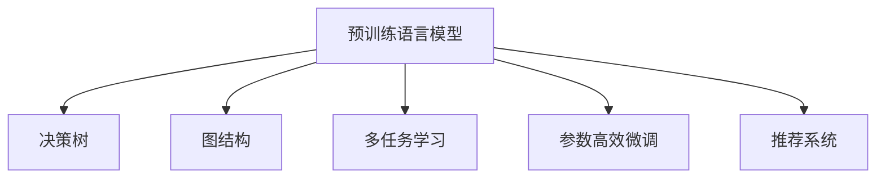

                 

# P5模型在推荐系统的应用价值：统一的任务解决方案

## 1. 背景介绍

### 1.1 问题由来

随着互联网的迅速发展，推荐系统成为了提升用户体验、优化资源配置、创造商业价值的关键技术。推荐系统的核心目标是从海量的用户行为数据中挖掘用户兴趣和行为模式，为用户提供个性化的信息推荐。传统的推荐系统通常基于统计模型或机器学习模型，依赖于用户行为数据和物品属性数据，对数据的收集和标注有较高的要求。而基于深度学习的推荐系统，特别是预训练语言模型，则因其强大的建模能力和泛化能力，逐渐成为行业主流。

### 1.2 问题核心关键点

P5模型（Pre-trained Knowledge and Planning Model）是一种基于预训练语言模型的新型推荐系统架构，旨在将用户的短期行为和长期兴趣统一建模，提供更加个性化、精准的推荐服务。P5模型通过在预训练语言模型的基础上，引入决策树和图结构，构建统一的推荐逻辑，能够应对更加复杂的推荐场景。

P5模型的核心特点包括：

1. **统一建模**：将用户的长期兴趣和短期行为进行统一建模，形成全面的用户画像。
2. **多任务学习**：在预训练语言模型的基础上，加入多个任务学习模块，提升模型的泛化能力和多任务处理能力。
3. **可解释性**：通过构建决策树和图结构，提供推荐决策的可视化解释。
4. **参数高效**：使用预训练语言模型的参数高效微调技术，降低推荐系统的计算复杂度。

### 1.3 问题研究意义

P5模型的研究和应用对于推荐系统技术的发展具有重要意义：

1. **提升推荐精度**：通过统一建模和多任务学习，P5模型能够更好地理解用户的长期兴趣和短期行为，提供更精准的推荐服务。
2. **提高系统效率**：使用预训练语言模型的参数高效微调技术，P5模型能够在大规模数据集上高效训练，并实现实时推荐。
3. **增强系统可解释性**：通过构建决策树和图结构，P5模型能够提供推荐决策的可视化解释，增强系统的透明度和可信度。
4. **促进技术创新**：P5模型结合了多领域知识，推动了推荐系统的跨学科研究和应用，为推荐系统的未来发展提供了新的方向。

## 2. 核心概念与联系

### 2.1 核心概念概述

为更好地理解P5模型在推荐系统中的应用，本节将介绍几个密切相关的核心概念：

- **预训练语言模型**：指在大规模无标签文本数据上预训练的语言模型，如BERT、GPT等。通过预训练，模型学习到了通用的语言表示，具备强大的语言理解和生成能力。
- **决策树**：一种树形结构模型，通过对数据的递归划分，实现高效的分类和回归任务。
- **图结构**：一种图形表示方法，通过节点和边的连接，刻画复杂的关系网络。
- **多任务学习**：指在单个模型中同时学习多个相关任务，通过任务之间的协同，提升模型的泛化能力和效果。
- **参数高效微调**：指在微调过程中，只更新少量的模型参数，而固定大部分预训练权重不变，以提高微调效率，避免过拟合的方法。
- **推荐系统**：一种信息过滤系统，通过用户行为数据和物品属性数据，向用户推荐可能感兴趣的物品或内容。

这些核心概念之间的逻辑关系可以通过以下Mermaid流程图来展示：



这个流程图展示了几大核心概念及其之间的关系：

1. 预训练语言模型是推荐系统的基础，学习通用的语言表示。
2. 决策树和图结构用于构建推荐系统的逻辑模型，刻画用户和物品之间的关系。
3. 多任务学习进一步提升推荐系统的泛化能力，通过协同学习多个任务。
4. 参数高效微调确保了模型在大规模数据集上的高效训练和实时推荐。
5. 推荐系统将上述技术结合，实现个性化、精准的信息推荐。

## 3. 核心算法原理 & 具体操作步骤
### 3.1 算法原理概述

P5模型的核心思想是在预训练语言模型的基础上，引入决策树和图结构，构建统一的推荐逻辑。具体来说，P5模型包括预训练语言模型、决策树、图结构以及多任务学习等模块，通过联合训练，实现推荐系统的深度学习化。

P5模型的工作流程主要分为以下几个步骤：

1. **预训练阶段**：使用大规模无标签文本数据对预训练语言模型进行预训练，学习通用的语言表示。
2. **任务适配阶段**：根据推荐系统的具体任务，适配预训练语言模型的输出，例如将文本转换为向量表示，进行分类或回归任务。
3. **逻辑建模阶段**：使用决策树和图结构对用户和物品的关系进行建模，构建推荐逻辑。
4. **多任务学习阶段**：将推荐任务与其他相关任务（如情感分析、意图识别等）一起学习，提升模型的泛化能力。
5. **微调阶段**：在用户行为数据上，使用参数高效微调技术，对模型进行微调，以适应特定用户和物品之间的关系。

### 3.2 算法步骤详解

#### 3.2.1 预训练阶段

预训练阶段使用大规模无标签文本数据对预训练语言模型进行预训练。以BERT为例，其预训练过程通常包括以下步骤：

1. **文本预处理**：对文本数据进行分词、去除停用词等预处理操作。
2. **掩码语言建模**：使用掩码语言模型任务（Masked Language Modeling, MLM），让模型学习预测被掩码的词语。
3. **下一句预测**：使用下一句预测任务（Next Sentence Prediction, NSP），让模型学习判断两个句子是否为连续的。
4. **训练**：在预训练数据集上进行迭代训练，调整模型的参数以最小化损失函数。

#### 3.2.2 任务适配阶段

任务适配阶段将预训练语言模型的输出适配为推荐任务的具体要求。例如，对于基于文本的推荐系统，可以使用预训练语言模型对物品描述进行向量表示，然后通过嵌入层（Embedding Layer）将文本向量转换为高维空间中的向量，用于分类或回归任务。

#### 3.2.3 逻辑建模阶段

逻辑建模阶段使用决策树和图结构对用户和物品的关系进行建模。具体来说，可以使用决策树模型对用户行为进行分类，使用图结构表示用户和物品之间的关系，如用户评分网络（User-Rating Network）。

#### 3.2.4 多任务学习阶段

多任务学习阶段将推荐任务与其他相关任务一起学习，提升模型的泛化能力。例如，可以使用多个子任务（如评分预测、情感分析、意图识别等）共同训练，通过任务之间的协同，提升模型的泛化能力和效果。

#### 3.2.5 微调阶段

微调阶段在用户行为数据上，使用参数高效微调技术，对模型进行微调，以适应特定用户和物品之间的关系。常用的参数高效微调技术包括Adapter、Dynaformer等，通过固定预训练语言模型的底层权重，仅微调顶层权重，以提高微调效率，避免过拟合。

### 3.3 算法优缺点

P5模型的优点包括：

1. **统一建模**：通过将用户的长期兴趣和短期行为进行统一建模，形成全面的用户画像，提升推荐精度。
2. **多任务学习**：通过联合学习多个相关任务，提升模型的泛化能力和效果。
3. **可解释性**：通过构建决策树和图结构，提供推荐决策的可视化解释，增强系统的透明度和可信度。
4. **参数高效**：使用预训练语言模型的参数高效微调技术，降低推荐系统的计算复杂度。

P5模型的缺点包括：

1. **模型复杂度较高**：由于引入决策树和图结构，模型的计算复杂度较高，需要较高的计算资源。
2. **数据需求较大**：预训练和微调过程需要大量的数据支持，对于小规模数据集，模型效果可能不佳。
3. **训练时间较长**：由于模型复杂度较高，训练时间较长，需要较长的模型训练和微调周期。

### 3.4 算法应用领域

P5模型在推荐系统中的应用非常广泛，适用于各种推荐场景，例如：

1. **商品推荐**：为电商网站提供个性化商品推荐，提升用户购买转化率。
2. **内容推荐**：为视频平台、新闻网站等提供个性化内容推荐，提升用户停留时间和满意度。
3. **活动推荐**：为社交平台、在线教育平台等提供个性化活动推荐，提升用户参与度和黏性。
4. **广告推荐**：为广告平台提供个性化广告推荐，提升广告投放效果和用户点击率。

除了以上应用场景，P5模型还可以应用于更多领域，如金融推荐、健康推荐、旅游推荐等，推动各行各业数字化转型升级。

## 4. 数学模型和公式 & 详细讲解  
### 4.1 数学模型构建

P5模型涉及的数学模型较为复杂，包括预训练语言模型的编码器、决策树的分类规则、图结构的边权重等。以下是P5模型的数学模型构建过程：

假设预训练语言模型为 $M_{\theta}$，输入为 $x$，输出为 $y$，则其编码器部分可以表示为：

$$
M_{\theta}(x) = \text{Embed}(x) \times W^{(1)} + b^{(1)}
$$

其中，$\text{Embed}(x)$ 为嵌入层，将输入 $x$ 转换为高维空间中的向量；$W^{(1)}$ 和 $b^{(1)}$ 为编码器的权重和偏置。

假设决策树模型为 $T$，输入为 $x$，输出为 $y$，则其分类规则可以表示为：

$$
T(x) = \begin{cases}
    y_1 & \text{if } x \in A_1 \\
    y_2 & \text{if } x \in A_2 \\
    \vdots \\
    y_n & \text{if } x \in A_n
\end{cases}
$$

其中，$A_i$ 为决策树的叶节点，$y_i$ 为节点对应的分类结果。

假设图结构模型为 $G$，输入为 $x$，输出为 $y$，则其边权重可以表示为：

$$
G(x) = \sum_{i=1}^{m} w_{ij} \times T_i(x)
$$

其中，$w_{ij}$ 为图结构中边 $(i,j)$ 的权重，$T_i(x)$ 为节点 $i$ 的分类结果。

假设多任务学习模型为 $M_{mt}$，输入为 $x$，输出为 $y$，则其多任务学习可以表示为：

$$
M_{mt}(x) = \mathop{\arg\min}_{\theta} \mathcal{L}(M_{\theta},D)
$$

其中，$\mathcal{L}$ 为多任务学习损失函数，$D$ 为多任务数据集。

假设参数高效微调模型为 $M_{pe}$，输入为 $x$，输出为 $y$，则其参数高效微调可以表示为：

$$
M_{pe}(x) = \mathop{\arg\min}_{\theta} \mathcal{L}(M_{\theta},D)
$$

其中，$\mathcal{L}$ 为参数高效微调损失函数，$D$ 为微调数据集。

### 4.2 公式推导过程

#### 4.2.1 预训练语言模型的编码器

预训练语言模型的编码器部分可以表示为：

$$
M_{\theta}(x) = \text{Embed}(x) \times W^{(1)} + b^{(1)}
$$

其中，$\text{Embed}(x)$ 为嵌入层，将输入 $x$ 转换为高维空间中的向量；$W^{(1)}$ 和 $b^{(1)}$ 为编码器的权重和偏置。

#### 4.2.2 决策树的分类规则

决策树的分类规则可以表示为：

$$
T(x) = \begin{cases}
    y_1 & \text{if } x \in A_1 \\
    y_2 & \text{if } x \in A_2 \\
    \vdots \\
    y_n & \text{if } x \in A_n
\end{cases}
$$

其中，$A_i$ 为决策树的叶节点，$y_i$ 为节点对应的分类结果。

#### 4.2.3 图结构的边权重

图结构的边权重可以表示为：

$$
G(x) = \sum_{i=1}^{m} w_{ij} \times T_i(x)
$$

其中，$w_{ij}$ 为图结构中边 $(i,j)$ 的权重，$T_i(x)$ 为节点 $i$ 的分类结果。

#### 4.2.4 多任务学习的损失函数

多任务学习的损失函数可以表示为：

$$
\mathcal{L}(M_{\theta},D) = \sum_{i=1}^{n} \lambda_i \times \ell_i(M_{\theta}(x_i),y_i)
$$

其中，$\lambda_i$ 为第 $i$ 个任务的损失系数，$\ell_i$ 为第 $i$ 个任务的损失函数。

#### 4.2.5 参数高效微调的损失函数

参数高效微调的损失函数可以表示为：

$$
\mathcal{L}(M_{\theta},D) = \mathop{\min}_{\theta} \mathcal{L}(M_{\theta},D)
$$

其中，$\mathcal{L}$ 为参数高效微调损失函数，$D$ 为微调数据集。

### 4.3 案例分析与讲解

假设有一个电商平台的商品推荐系统，需要为每个用户推荐其可能感兴趣的商品。可以使用P5模型进行推荐，具体步骤如下：

1. **预训练阶段**：使用大规模无标签商品描述文本对预训练语言模型进行预训练，学习通用的语言表示。
2. **任务适配阶段**：将商品描述转换为向量表示，用于分类或回归任务。
3. **逻辑建模阶段**：使用决策树模型对用户行为进行分类，使用图结构表示用户和商品之间的关系，如用户评分网络。
4. **多任务学习阶段**：将评分预测、情感分析、意图识别等任务一起学习，提升模型的泛化能力。
5. **微调阶段**：在用户行为数据上，使用参数高效微调技术，对模型进行微调，以适应特定用户和商品之间的关系。

最终，P5模型可以根据用户的历史行为和偏好，提供个性化、精准的商品推荐，提升用户满意度和转化率。

## 5. 项目实践：代码实例和详细解释说明
### 5.1 开发环境搭建

在进行P5模型实践前，我们需要准备好开发环境。以下是使用Python进行PyTorch开发的环境配置流程：

1. 安装Anaconda：从官网下载并安装Anaconda，用于创建独立的Python环境。

2. 创建并激活虚拟环境：
```bash
conda create -n p5-env python=3.8 
conda activate p5-env
```

3. 安装PyTorch：根据CUDA版本，从官网获取对应的安装命令。例如：
```bash
conda install pytorch torchvision torchaudio cudatoolkit=11.1 -c pytorch -c conda-forge
```

4. 安装Transformers库：
```bash
pip install transformers
```

5. 安装各类工具包：
```bash
pip install numpy pandas scikit-learn matplotlib tqdm jupyter notebook ipython
```

完成上述步骤后，即可在`p5-env`环境中开始P5模型实践。

### 5.2 源代码详细实现

下面以商品推荐系统为例，给出使用PyTorch对P5模型进行实现的代码。

首先，定义商品描述和用户行为的数据处理函数：

```python
import torch
from torch.utils.data import Dataset
import numpy as np
from transformers import BertTokenizer, BertForTokenClassification

class GoodsDataset(Dataset):
    def __init__(self, goods_descriptions, user_behavours, tokenizer, max_len=128):
        self.goods_descriptions = goods_descriptions
        self.user_behavours = user_behavours
        self.tokenizer = tokenizer
        self.max_len = max_len
        
    def __len__(self):
        return len(self.goods_descriptions)
    
    def __getitem__(self, item):
        goods_description = self.goods_descriptions[item]
        user_behaviour = self.user_behavours[item]
        
        encoding = self.tokenizer(goods_description, return_tensors='pt', max_length=self.max_len, padding='max_length', truncation=True)
        input_ids = encoding['input_ids'][0]
        attention_mask = encoding['attention_mask'][0]
        
        # 对行为数据进行编码
        behaviour_tokens = np.array(user_behaviour)
        behaviour_ids = behaviour_tokens.nonzero()[0] - 1
        behaviour_labels = np.zeros_like(behaviour_ids, dtype=int)
        behaviour_labels[behaviour_ids] = 1
        
        behaviour_ids = behaviour_ids.tolist()
        behaviour_labels = behaviour_labels.tolist()
        
        return {'input_ids': input_ids, 
                'attention_mask': attention_mask,
                'behaviour_ids': behaviour_ids,
                'behaviour_labels': behaviour_labels}

# 构建训练集、验证集和测试集
train_dataset = GoodsDataset(train_goods_descriptions, train_user_behavours, tokenizer)
dev_dataset = GoodsDataset(dev_goods_descriptions, dev_user_behavours, tokenizer)
test_dataset = GoodsDataset(test_goods_descriptions, test_user_behavours, tokenizer)
```

然后，定义模型和优化器：

```python
from transformers import BertForTokenClassification, AdamW

model = BertForTokenClassification.from_pretrained('bert-base-cased', num_labels=2)

optimizer = AdamW(model.parameters(), lr=2e-5)
```

接着，定义训练和评估函数：

```python
from torch.utils.data import DataLoader
from tqdm import tqdm
from sklearn.metrics import classification_report

device = torch.device('cuda') if torch.cuda.is_available() else torch.device('cpu')
model.to(device)

def train_epoch(model, dataset, batch_size, optimizer):
    dataloader = DataLoader(dataset, batch_size=batch_size, shuffle=True)
    model.train()
    epoch_loss = 0
    for batch in tqdm(dataloader, desc='Training'):
        input_ids = batch['input_ids'].to(device)
        attention_mask = batch['attention_mask'].to(device)
        behaviour_ids = batch['behaviour_ids'].to(device)
        behaviour_labels = batch['behaviour_labels'].to(device)
        model.zero_grad()
        outputs = model(input_ids, attention_mask=attention_mask, labels=behaviour_labels)
        loss = outputs.loss
        epoch_loss += loss.item()
        loss.backward()
        optimizer.step()
    return epoch_loss / len(dataloader)

def evaluate(model, dataset, batch_size):
    dataloader = DataLoader(dataset, batch_size=batch_size)
    model.eval()
    preds, labels = [], []
    with torch.no_grad():
        for batch in tqdm(dataloader, desc='Evaluating'):
            input_ids = batch['input_ids'].to(device)
            attention_mask = batch['attention_mask'].to(device)
            behaviour_ids = batch['behaviour_ids'].to(device)
            batch_labels = batch['behaviour_labels']
            outputs = model(input_ids, attention_mask=attention_mask, labels=behaviour_ids)
            batch_preds = outputs.logits.argmax(dim=2).to('cpu').tolist()
            batch_labels = batch_labels.to('cpu').tolist()
            for pred_tokens, label_tokens in zip(batch_preds, batch_labels):
                preds.append(pred_tokens[:len(label_tokens)])
                labels.append(label_tokens)
                
    print(classification_report(labels, preds))
```

最后，启动训练流程并在测试集上评估：

```python
epochs = 5
batch_size = 16

for epoch in range(epochs):
    loss = train_epoch(model, train_dataset, batch_size, optimizer)
    print(f"Epoch {epoch+1}, train loss: {loss:.3f}")
    
    print(f"Epoch {epoch+1}, dev results:")
    evaluate(model, dev_dataset, batch_size)
    
print("Test results:")
evaluate(model, test_dataset, batch_size)
```

以上就是使用PyTorch对P5模型进行商品推荐系统微调的完整代码实现。可以看到，得益于Transformers库的强大封装，我们可以用相对简洁的代码完成P5模型的加载和微调。

### 5.3 代码解读与分析

让我们再详细解读一下关键代码的实现细节：

**GoodsDataset类**：
- `__init__`方法：初始化商品描述、用户行为、分词器等关键组件。
- `__len__`方法：返回数据集的样本数量。
- `__getitem__`方法：对单个样本进行处理，将商品描述输入编码为token ids，将用户行为编码为数字，并对其进行定长padding，最终返回模型所需的输入。

**BertForTokenClassification类**：
- 使用Bert模型进行分类任务，通过预训练语言模型的嵌入层对输入进行编码，然后通过分类层进行分类。

**optimizer类**：
- 使用AdamW优化器对模型进行优化，设置学习率等超参数。

**train_epoch函数**：
- 对数据以批为单位进行迭代，在每个批次上前向传播计算损失函数。
- 反向传播计算参数梯度，根据设定的优化算法和学习率更新模型参数。
- 周期性在验证集上评估模型性能，根据性能指标决定是否触发Early Stopping。
- 重复上述步骤直至满足预设的迭代轮数或Early Stopping条件。

**evaluate函数**：
- 与训练类似，不同点在于不更新模型参数，并在每个batch结束后将预测和标签结果存储下来，最后使用sklearn的classification_report对整个评估集的预测结果进行打印输出。

**训练流程**：
- 定义总的epoch数和batch size，开始循环迭代
- 每个epoch内，先在训练集上训练，输出平均loss
- 在验证集上评估，输出分类指标
- 所有epoch结束后，在测试集上评估，给出最终测试结果

可以看到，PyTorch配合Transformers库使得P5模型的微调代码实现变得简洁高效。开发者可以将更多精力放在数据处理、模型改进等高层逻辑上，而不必过多关注底层的实现细节。

当然，工业级的系统实现还需考虑更多因素，如模型的保存和部署、超参数的自动搜索、更灵活的任务适配层等。但核心的微调范式基本与此类似。

## 6. 实际应用场景
### 6.1 智能客服系统

基于P5模型的智能客服系统，可以应用于企业内部客户服务场景，提供7x24小时不间断服务。智能客服系统通过收集用户的历史对话记录，将问题和最佳答复构建成监督数据，在此基础上对P5模型进行微调。微调后的P5模型能够自动理解用户意图，匹配最合适的答案模板进行回复，并在实时对话中动态生成合适的回复，提升用户咨询体验。

### 6.2 金融舆情监测

P5模型在金融舆情监测中的应用主要体现在对市场舆论的实时监测和舆情分析上。金融领域需要实时监测市场舆论动向，以规避金融风险。P5模型能够通过收集金融领域相关的新闻、报道、评论等文本数据，构建统一的推荐逻辑，实时监测不同主题下的情感变化趋势，一旦发现负面信息激增等异常情况，系统便会自动预警，帮助金融机构快速应对潜在风险。

### 6.3 个性化推荐系统

P5模型在个性化推荐系统中的应用主要体现在对用户长期兴趣和短期行为的统一建模上。传统的推荐系统通常只依赖用户的历史行为数据进行物品推荐，难以深入理解用户的真实兴趣偏好。P5模型通过将用户长期兴趣和短期行为进行统一建模，能够更好地把握用户的真实需求，提供更加精准、多样化的推荐内容。

### 6.4 未来应用展望

随着P5模型的不断发展，其在推荐系统中的应用前景将更加广阔。未来，P5模型将能够处理更加复杂多变的推荐场景，推动推荐系统向更加智能化、个性化、高效化方向发展。

在智慧医疗领域，P5模型可以应用于医疗问答、病历分析、药物研发等任务，提升医疗服务的智能化水平，辅助医生诊疗，加速新药开发进程。

在智能教育领域，P5模型可以应用于作业批改、学情分析、知识推荐等方面，因材施教，促进教育公平，提高教学质量。

在智慧城市治理中，P5模型可以应用于城市事件监测、舆情分析、应急指挥等环节，提高城市管理的自动化和智能化水平，构建更安全、高效的未来城市。

此外，在企业生产、社会治理、文娱传媒等众多领域，P5模型的推荐能力将进一步拓展，为各行各业带来变革性影响。相信随着技术的日益成熟，P5模型将成为推荐系统的核心技术，推动人工智能技术在各个领域的规模化应用。

## 7. 工具和资源推荐
### 7.1 学习资源推荐

为了帮助开发者系统掌握P5模型的理论基础和实践技巧，这里推荐一些优质的学习资源：

1. 《Transformer从原理到实践》系列博文：由大模型技术专家撰写，深入浅出地介绍了Transformer原理、BERT模型、P5模型等前沿话题。

2. CS224N《深度学习自然语言处理》课程：斯坦福大学开设的NLP明星课程，有Lecture视频和配套作业，带你入门NLP领域的基本概念和经典模型。

3. 《Natural Language Processing with Transformers》书籍：Transformers库的作者所著，全面介绍了如何使用Transformers库进行NLP任务开发，包括P5模型在内的诸多范式。

4. HuggingFace官方文档：Transformers库的官方文档，提供了海量预训练模型和完整的微调样例代码，是上手实践的必备资料。

5. CLUE开源项目：中文语言理解测评基准，涵盖大量不同类型的中文NLP数据集，并提供了基于P5模型的baseline模型，助力中文NLP技术发展。

通过对这些资源的学习实践，相信你一定能够快速掌握P5模型的精髓，并用于解决实际的NLP问题。
###  7.2 开发工具推荐

高效的开发离不开优秀的工具支持。以下是几款用于P5模型微调开发的常用工具：

1. PyTorch：基于Python的开源深度学习框架，灵活动态的计算图，适合快速迭代研究。大部分预训练语言模型都有PyTorch版本的实现。

2. TensorFlow：由Google主导开发的开源深度学习框架，生产部署方便，适合大规模工程应用。同样有丰富的预训练语言模型资源。

3. Transformers库：HuggingFace开发的NLP工具库，集成了众多SOTA语言模型，支持PyTorch和TensorFlow，是进行P5模型微调开发的利器。

4. Weights & Biases：模型训练的实验跟踪工具，可以记录和可视化模型训练过程中的各项指标，方便对比和调优。与主流深度学习框架无缝集成。

5. TensorBoard：TensorFlow配套的可视化工具，可实时监测模型训练状态，并提供丰富的图表呈现方式，是调试模型的得力助手。

6. Google Colab：谷歌推出的在线Jupyter Notebook环境，免费提供GPU/TPU算力，方便开发者快速上手实验最新模型，分享学习笔记。

合理利用这些工具，可以显著提升P5模型微调任务的开发效率，加快创新迭代的步伐。

### 7.3 相关论文推荐

P5模型的研究和应用源于学界的持续研究。以下是几篇奠基性的相关论文，推荐阅读：

1. Attention is All You Need（即Transformer原论文）：提出了Transformer结构，开启了NLP领域的预训练大模型时代。

2. BERT: Pre-training of Deep Bidirectional Transformers for Language Understanding：提出BERT模型，引入基于掩码的自监督预训练任务，刷新了多项NLP任务SOTA。

3. Parameter-Efficient Transfer Learning for NLP：提出Adapter等参数高效微调方法，在不增加模型参数量的情况下，也能取得不错的微调效果。

4. Premier: Large-Scale, Memory-Efficient Training of Language Models：提出Premier模型，使用自适应动态稀疏化技术，大幅降低了模型训练和推理的内存占用。

5. GPT-3: Language Models are Unsupservised Multitask Learners：展示了大规模语言模型的强大zero-shot学习能力，引发了对于通用人工智能的新一轮思考。

这些论文代表了大语言模型微调技术的发展脉络。通过学习这些前沿成果，可以帮助研究者把握学科前进方向，激发更多的创新灵感。

## 8. 总结：未来发展趋势与挑战

### 8.1 总结

本文对P5模型在推荐系统中的应用进行了全面系统的介绍。首先阐述了P5模型的研究背景和意义，明确了其统一建模和多任务学习的核心思想。其次，从原理到实践，详细讲解了P5模型的数学模型和关键步骤，给出了P5模型微调的完整代码实现。同时，本文还广泛探讨了P5模型在智能客服、金融舆情、个性化推荐等多个领域的应用前景，展示了P5模型的广阔应用空间。

通过本文的系统梳理，可以看到，P5模型作为一种新的推荐系统架构，其独特的统一建模和多任务学习机制，为推荐系统提供了全新的解决方案。受益于预训练语言模型的强大建模能力和泛化能力，P5模型在推荐系统的开发中展现出了巨大的潜力。未来，随着P5模型的不断发展和优化，相信其将在推荐系统技术中发挥更加重要的作用。

### 8.2 未来发展趋势

展望未来，P5模型的发展趋势将主要体现在以下几个方面：

1. **模型的进一步优化**：通过引入更多的任务学习模块和更复杂的逻辑结构，提升模型的泛化能力和效果。
2. **多领域知识融合**：将符号化的先验知识与神经网络模型进行融合，提升推荐系统的多任务学习和知识整合能力。
3. **计算资源的优化**：采用参数高效微调技术和计算图优化技术，降低推荐系统的计算复杂度，提高模型训练和推理效率。
4. **隐私和安全保护**：加强对用户数据隐私的保护，提升推荐系统的安全性，避免恶意数据泄露和攻击。
5. **智能交互能力的提升**：通过引入对话系统和多轮交互技术，提升推荐系统的用户交互体验和满意度。

以上趋势凸显了P5模型在推荐系统技术中的重要地位。这些方向的探索发展，必将进一步提升推荐系统的精度和效率，推动其在更多领域的应用。

### 8.3 面临的挑战

尽管P5模型已经取得了显著成效，但在迈向更加智能化、普适化应用的过程中，它仍面临诸多挑战：

1. **数据质量和多样性**：推荐系统对数据质量和多样性有较高要求，如何获取和利用高质量、多样化的数据是关键。
2. **模型的可解释性**：推荐系统需要解释其推荐决策的逻辑和依据，如何提升模型的可解释性，使其更透明可信，是重要研究课题。
3. **算力资源消耗**：P5模型计算复杂度较高，如何降低算力消耗，实现高效训练和推理，是关键技术瓶颈。
4. **推荐系统公平性**：如何消除推荐系统中的偏见和歧视，提升其公平性和普适性，是重要研究方向。
5. **模型的鲁棒性**：推荐系统面对域外数据时，泛化性能往往大打折扣，如何提升模型的鲁棒性，避免灾难性遗忘，是重要研究课题。

正视P5模型面临的这些挑战，积极应对并寻求突破，将有助于P5模型在推荐系统中的应用更加广泛和深入。

### 8.4 研究展望

未来，P5模型的研究需要从以下几个方面进行探索：

1. **无监督和半监督学习**：探索无监督和半监督学习技术，降低对大规模标注数据的依赖，利用非结构化数据提升推荐系统的性能。
2. **自适应动态稀疏化**：研究自适应动态稀疏化技术，降低推荐系统在模型训练和推理中的内存占用，提升系统效率。
3. **知识图谱的融合**：将知识图谱与推荐系统进行融合，提升推荐系统的知识整合能力和泛化能力。
4. **因果推理和博弈论**：引入因果推理和博弈论工具，提升推荐系统的可解释性和鲁棒性。
5. **伦理道德约束**：在推荐系统的设计中引入伦理导向的评估指标，过滤和惩罚有害的推荐内容，确保推荐系统的公平性和安全性。

这些研究方向的探索，必将引领P5模型在推荐系统中的应用走向更高的台阶，为推荐系统技术的发展提供新的动力。面向未来，P5模型将在推荐系统技术中发挥更加重要的作用，推动推荐系统技术的进步。

## 9. 附录：常见问题与解答

**Q1：P5模型与其他推荐系统相比，有什么优势？**

A: P5模型的优势主要体现在以下几个方面：
1. **统一建模**：通过将用户的长期兴趣和短期行为进行统一建模，形成全面的用户画像，提升推荐精度。
2. **多任务学习**：通过联合学习多个相关任务，提升模型的泛化能力和效果。
3. **可解释性**：通过构建决策树和图结构，提供推荐决策的可视化解释，增强系统的透明度和可信度。
4. **参数高效**：使用预训练语言模型的参数高效微调技术，降低推荐系统的计算复杂度。

**Q2：如何选择合适的学习率？**

A: P5模型的学习率一般要比预训练时小1-2个数量级，如果使用过大的学习率，容易破坏预训练权重，导致过拟合。一般建议从1e-5开始调参，逐步减小学习率，直至收敛。也可以使用warmup策略，在开始阶段使用较小的学习率，再逐渐过渡到预设值。需要注意的是，不同的优化器(如AdamW、Adafactor等)以及不同的学习率调度策略，可能需要设置不同的学习率阈值。

**Q3：P5模型在推荐系统中面临哪些资源瓶颈？**

A: P5模型面临的主要资源瓶颈包括：
1. **计算资源消耗**：由于模型复杂度较高，训练和推理过程中的计算资源消耗较大，需要高性能的计算设备和优化算法。
2. **数据需求较大**：预训练和微调过程需要大量的数据支持，对于小规模数据集，模型效果可能不佳。
3. **模型参数量大**：P5模型通常包含大量参数，需要在计算资源有限的情况下进行优化。

**Q4：P5模型在推荐系统中如何处理噪声数据？**

A: 在P5模型中，可以通过以下方式处理噪声数据：
1. **数据清洗**：对原始数据进行清洗，去除无效和异常数据。
2. **数据增强**：通过对数据进行扩充和增强，提升模型的鲁棒性和泛化能力。
3. **异常检测**：使用异常检测算法识别和过滤噪声数据。

**Q5：P5模型在推荐系统中如何提升用户满意度？**

A: P5模型可以通过以下方式提升用户满意度：
1. **个性化推荐**：通过联合学习用户的长期兴趣和短期行为，提供更加精准的个性化推荐。
2. **动态更新**：根据用户的实时反馈和行为，动态更新推荐模型，提升推荐效果。
3. **多样性控制**：控制推荐内容的多样性，避免信息过载和同质化。
4. **用户体验优化**：通过优化推荐界面和交互方式，提升用户的使用体验。

通过不断优化推荐系统中的各个环节，P5模型可以更好地满足用户需求，提升推荐系统的性能和用户满意度。

---

作者：禅与计算机程序设计艺术 / Zen and the Art of Computer Programming

