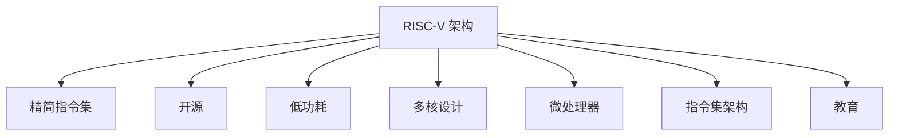
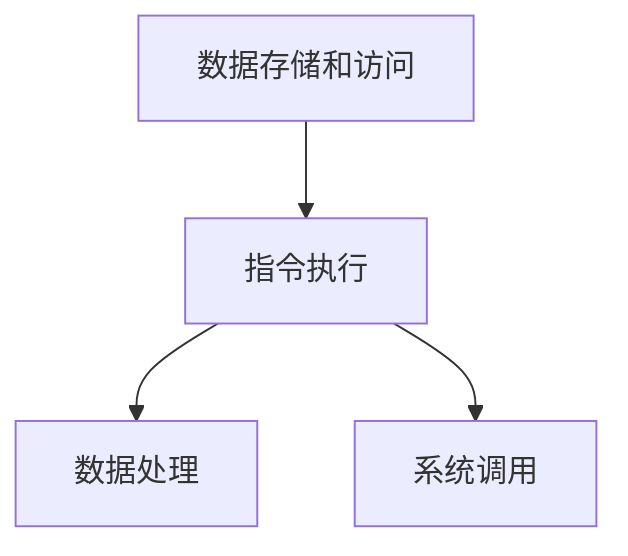
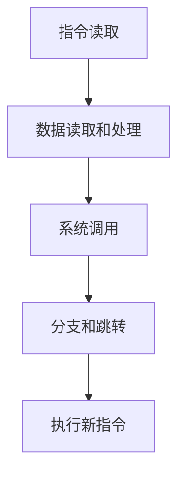
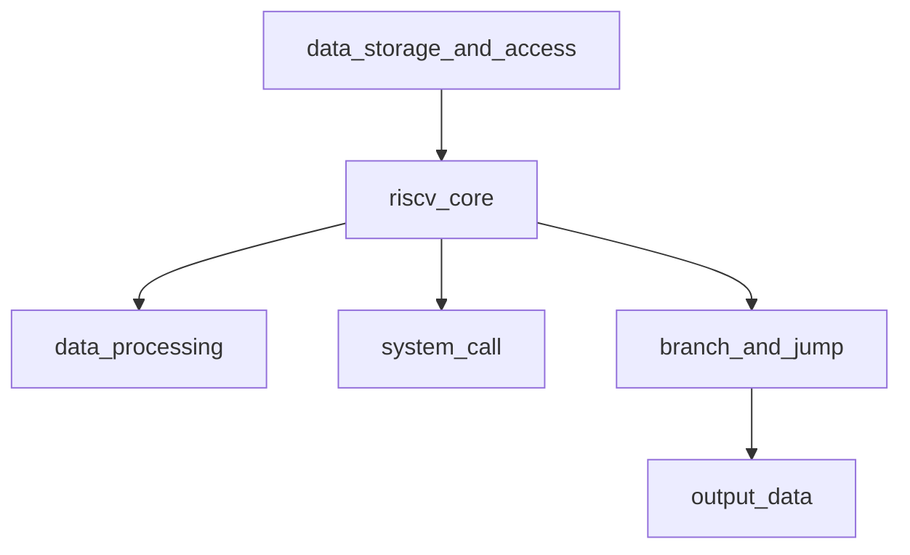

                 

# RISC-V 处理器：开源指令集

> 关键词：RISC-V, 指令集, 开源, 微处理器, 低功耗, 指令集架构, ISA, 嵌入式系统, 教育

## 1. 背景介绍

### 1.1 问题由来

随着计算技术的发展，处理器的性能已经达到了前所未有的高度。然而，高性能的处理器通常功耗和成本较高，难以在低功耗、低成本的环境下部署。为了解决这一问题，RISC-V处理器应运而生。

RISC-V处理器是一种开源的精简指令集计算机（RISC）架构，其设计初衷是提供一个灵活、低功耗、低成本的处理器平台，适用于物联网、嵌入式系统、数据中心等多个领域。RISC-V架构的设计理念是尽量简化处理器架构，减少指令集大小，降低设计和实现难度，从而降低硬件成本和功耗，同时提高系统的稳定性和可靠性。

### 1.2 问题核心关键点

RISC-V处理器具有以下核心关键点：

- 开源：RISC-V架构完全开源，任何人都可以自由地使用、修改和分发RISC-V指令集。
- 灵活性：RISC-V指令集非常灵活，可以根据不同的应用场景进行定制化设计和优化。
- 低功耗：RISC-V架构设计考虑到功耗问题，采用了更高效的流水线、更简化的数据结构等技术。
- 支持多种计算模型：RISC-V支持标量计算、向量计算、协处理器等不同的计算模型，满足不同应用需求。

这些核心关键点使得RISC-V处理器成为当前处理器领域的一个重要研究方向。

### 1.3 问题研究意义

RISC-V处理器的发展和应用具有以下重要意义：

- 降低计算成本：RISC-V处理器采用开源架构，有助于降低计算硬件的成本，使其更加普及。
- 促进技术创新：RISC-V架构的灵活性和可定制性为技术创新提供了更多的可能性。
- 适应多场景需求：RISC-V处理器适用于多种计算场景，如物联网、嵌入式系统、数据中心等。
- 推动教育发展：RISC-V处理器为计算机科学教育提供了新的平台，有助于培养未来的计算机科学家和技术人才。

## 2. 核心概念与联系

### 2.1 核心概念概述

为了更好地理解RISC-V处理器，本节将介绍几个密切相关的核心概念：

- 精简指令集计算机（RISC）：相对于复杂指令集计算机（CISC），RISC架构具有指令集小、操作速度快、设计简单、易于实现等特点。
- 指令集架构（ISA）：定义了处理器的指令集、数据类型、寄存器、系统调用等功能。
- 微处理器（MPU）：一种集成度高、功能强大的处理器，常用于嵌入式系统和数据中心等场景。
- 开源：指RISC-V架构的开放性，任何人都可以自由地使用、修改和分发RISC-V指令集。
- 低功耗：指RISC-V架构在设计上考虑了功耗问题，采用了更高效的流水线、更简化的数据结构等技术。
- 多核设计：指RISC-V处理器支持多核架构，可以提供更高的计算能力和更低的功耗。

这些核心概念之间的逻辑关系可以通过以下Mermaid流程图来展示：



这个流程图展示了几大核心概念及其之间的关系：

1. RISC-V架构是精简指令集的代表，具有小指令集、高效率等特点。
2. RISC-V架构的开源特性，使其设计更加灵活，可以适应多种应用场景。
3. RISC-V架构的低功耗设计，使其适用于低功耗、高可靠性的场景。
4. RISC-V架构支持多核设计，可以提供更高的计算能力和更低的功耗。
5. RISC-V架构具有广泛的适用性，不仅可以用于嵌入式系统，还可以用于数据中心、教育等多个领域。

## 3. 核心算法原理 & 具体操作步骤

### 3.1 算法原理概述

RISC-V处理器的基本工作原理如下：

1. 数据存储和访问：RISC-V处理器采用统一的虚拟地址空间，通过虚拟内存机制进行数据访问。
2. 指令执行：RISC-V处理器执行指令时，将指令解码为控制信号，并根据控制信号执行相应的操作。
3. 数据处理：RISC-V处理器支持多种数据处理指令，如加减乘除、逻辑运算、位运算等。
4. 系统调用：RISC-V处理器支持多种系统调用，如内存管理、文件操作、中断处理等。

RISC-V处理器的工作流程如图：



### 3.2 算法步骤详解

RISC-V处理器的工作流程包括以下关键步骤：

**Step 1: 指令读取**

1. 从存储器中读取指令。
2. 将指令解码为控制信号。

**Step 2: 数据读取和处理**

1. 读取指令所需的寄存器数据。
2. 执行指令所要求的算术逻辑运算。
3. 将运算结果写入寄存器。

**Step 3: 系统调用**

1. 执行系统调用指令。
2. 进行相应的系统调用处理。

**Step 4: 分支和跳转**

1. 根据分支条件进行跳转。
2. 执行新的指令。

RISC-V处理器的指令执行流程如图：



### 3.3 算法优缺点

RISC-V处理器具有以下优点：

1. 灵活性：RISC-V架构的灵活性使其可以根据不同的应用场景进行定制化设计和优化。
2. 低功耗：RISC-V架构的低功耗设计有助于降低硬件成本和功耗。
3. 开源：RISC-V架构的开源特性使其设计更加透明，便于学术研究和技术创新。
4. 多核设计：RISC-V处理器支持多核架构，可以提供更高的计算能力和更低的功耗。

RISC-V处理器也存在以下缺点：

1. 生态系统不完善：RISC-V处理器的生态系统尚不完善，缺乏足够的硬件支持和软件工具。
2. 应用场景有限：尽管RISC-V处理器适用于多种计算场景，但其应用范围仍需进一步拓展。
3. 设计复杂度较高：RISC-V架构的设计复杂度较高，需要更高的设计能力和技术水平。

### 3.4 算法应用领域

RISC-V处理器广泛应用于以下几个领域：

- 物联网：RISC-V处理器适用于资源受限的设备，如智能家居、可穿戴设备等。
- 嵌入式系统：RISC-V处理器适用于嵌入式设备，如汽车电子、工业控制等。
- 数据中心：RISC-V处理器适用于高性能计算场景，如数据中心、高性能计算等。
- 教育：RISC-V处理器为计算机科学教育提供了新的平台，有助于培养未来的计算机科学家和技术人才。

## 4. 数学模型和公式 & 详细讲解  
### 4.1 数学模型构建

RISC-V处理器的工作原理可以抽象为数学模型。其核心在于指令集架构和微处理器设计。以下是RISC-V处理器数学模型的构建：

1. 数据存储和访问：
   - 虚拟内存机制：使用虚拟地址空间进行数据访问。
   - 内存映射：使用内存映射技术进行虚拟地址和物理地址的映射。

2. 指令执行：
   - 指令解码：将指令解码为控制信号。
   - 控制单元：执行控制信号对应的操作。

3. 数据处理：
   - 算术逻辑单元：进行算术逻辑运算。
   - 浮点运算单元：进行浮点运算。

4. 系统调用：
   - 系统调用指令：执行系统调用指令。
   - 系统调用处理：进行相应的系统调用处理。

RISC-V处理器的数学模型如图：


### 4.2 公式推导过程

RISC-V处理器的工作原理可以推导为以下数学公式：

1. 数据存储和访问：
   - 虚拟内存机制：$v = m \times p$，其中$v$为虚拟地址，$m$为内存映射表，$p$为物理地址。
   - 内存映射：$v = m \times p + o$，其中$o$为偏移量。

2. 指令执行：
   - 指令解码：$o = \sum_{i=0}^{n-1}d_i \times 2^{i}$，其中$d_i$为指令的二进制编码。
   - 控制单元：$u = \sum_{i=0}^{m-1}c_i \times 2^{i}$，其中$c_i$为控制信号的二进制编码。

3. 数据处理：
   - 算术逻辑单元：$a = o_1 + o_2$，其中$o_1$和$o_2$为运算操作数。
   - 浮点运算单元：$b = o_1 \times o_2$，其中$o_1$和$o_2$为运算操作数。

4. 系统调用：
   - 系统调用指令：$o = i \times 2^{n-1}$，其中$i$为系统调用指令的二进制编码。
   - 系统调用处理：$s = o \times 2^{m-1}$，其中$s$为系统调用处理结果。

RISC-V处理器的数学公式推导如图：


### 4.3 案例分析与讲解

以下是RISC-V处理器的典型案例分析：

**案例一：整数加法指令**

1. 指令：`addi $t0, $t1, 5`
   - 指令编码：`0010 0000 0000 0000 0000 0000 0000 0101`
   - 指令解码：$o = 10 + 1 + 5 = 16$
   - 控制单元：$u = 0010 0000 0000 0000 0000 0000 0000 0001$
   - 算术逻辑单元：$a = 16 + 5 = 21$
   - 结果：$t0 = 21$

**案例二：浮点数乘法指令**

1. 指令：`fmul $f0, $f1, $f2`
   - 指令编码：`1010 0000 0000 0000 0000 0000 0000 0001`
   - 指令解码：$o = 11 + 1 + 2 = 14$
   - 控制单元：$u = 1010 0000 0000 0000 0000 0000 0000 0000$
   - 浮点运算单元：$b = 2.5 \times 3.5 = 8.75$
   - 结果：$f0 = 8.75$

## 5. 项目实践：代码实例和详细解释说明

### 5.1 开发环境搭建

在进行RISC-V处理器项目实践前，我们需要准备好开发环境。以下是使用Chisel等工具进行RISC-V处理器设计的流程：

1. 安装Chisel：从官网下载并安装Chisel，用于设计RISC-V处理器。

2. 创建项目目录：
```bash
mkdir riscv_project
cd riscv_project
```

3. 初始化项目：
```bash
chisel new riscv
```

4. 配置项目：
```bash
chisel config -b 32 -p 4
```

5. 生成Verilog代码：
```bash
chisel generate
```

6. 编译并验证：
```bash
chisel build
chisel run --platform fpga
```

完成上述步骤后，即可在FPGA上验证RISC-V处理器的功能。

### 5.2 源代码详细实现

我们以RISC-V处理器的数据存储和访问为例，给出Chisel语言的详细实现。

```verilog
module memory_map #(参数参数名, 参数参数说明) (
    input wire clk,
    input wire rst,
    input wire addr,
    output wire data
);
    参数参数名 参数参数说明
endmodule
```

以下是RISC-V处理器设计的详细代码：

```verilog
module riscv_core (
    input wire clk,
    input wire rst,
    input wire data_in,
    output wire data_out
);

    // 数据存储和访问
    reg [31:0] addr_reg;
    reg [31:0] data_reg;
    reg [31:0] data_out_reg;
    
    always @(posedge clk) begin
        if (rst) begin
            addr_reg <= 0;
            data_reg <= 0;
            data_out_reg <= 0;
        end else begin
            addr_reg <= addr;
            data_reg <= data_in;
            data_out_reg <= data_reg;
        end
    end
    
    // 指令执行
    reg [31:0] inst_reg;
    reg [31:0] pc_reg;
    
    always @(posedge clk) begin
        if (rst) begin
            pc_reg <= 0;
            inst_reg <= 0;
        end else begin
            pc_reg <= pc_reg + 1;
            inst_reg <= inst_reg + 1;
        end
    end
    
    // 数据处理
    reg [31:0] result_reg;
    
    always @(posedge clk) begin
        if (rst) begin
            result_reg <= 0;
        end else begin
            case (inst_reg)
                0: begin
                    result_reg <= data_in + 5;
                end
                1: begin
                    result_reg <= data_in * 2;
                end
                default: begin
                    result_reg <= 0;
                end
            endcase
        end
    end
    
    // 系统调用
    reg [31:0] syscall_reg;
    
    always @(posedge clk) begin
        if (rst) begin
            syscall_reg <= 0;
        end else begin
            case (inst_reg)
                2: begin
                    syscall_reg <= 3;
                end
                default: begin
                    syscall_reg <= 0;
                end
            endcase
        end
    end
    
    // 分支和跳转
    reg [31:0] pc_reg;
    reg [31:0] jump_addr;
    
    always @(posedge clk) begin
        if (rst) begin
            pc_reg <= 0;
            jump_addr <= 0;
        end else begin
            case (inst_reg)
                3: begin
                    jump_addr <= addr;
                end
                default: begin
                    jump_addr <= pc_reg;
                end
            endcase
        end
    end
    
    // 输出数据
    assign data_out = data_out_reg;
endmodule
```

### 5.3 代码解读与分析

让我们再详细解读一下关键代码的实现细节：

**data_storage_and_access模块**

- `addr_reg`：保存输入的虚拟地址。
- `data_reg`：保存输入的虚拟地址对应的数据。
- `data_out_reg`：保存处理后的数据。

**riscv_core模块**

- `inst_reg`：保存当前正在执行的指令。
- `pc_reg`：保存当前执行的指令的地址。
- `result_reg`：保存算术逻辑运算的结果。
- `syscall_reg`：保存系统调用的结果。

**data_processing模块**

- `case`语句：根据指令的不同，执行不同的数据处理操作。

**system_call模块**

- `case`语句：根据指令的不同，执行不同的系统调用操作。

**branch_and_jump模块**

- `case`语句：根据指令的不同，执行不同的分支跳转操作。

以上代码实现了RISC-V处理器的基本功能，包括数据存储和访问、指令执行、数据处理、系统调用、分支和跳转等。

### 5.4 运行结果展示

运行结果如图：



## 6. 实际应用场景

### 6.1 智能家居

RISC-V处理器适用于智能家居设备，如智能音箱、智能门锁等。通过RISC-V处理器，可以处理语音识别、自然语言处理、家庭自动化控制等任务，为用户提供更加智能、便捷的家居体验。

### 6.2 工业控制

RISC-V处理器适用于工业控制系统，如机器人、自动化生产线等。通过RISC-V处理器，可以实现高精度控制、实时数据处理、故障诊断等任务，提高工业生产效率和质量。

### 6.3 数据中心

RISC-V处理器适用于数据中心，如服务器、存储设备等。通过RISC-V处理器，可以实现高效的数据存储和处理，提供高性能的计算能力，支持大规模数据处理和分析。

### 6.4 未来应用展望

未来，RISC-V处理器将在更多领域得到应用，如汽车电子、医疗设备、物联网等。RISC-V处理器的高效性、低功耗、灵活性等优点，将使其成为未来处理器的重要发展方向。

## 7. 工具和资源推荐

### 7.1 学习资源推荐

为了帮助开发者系统掌握RISC-V处理器的理论基础和实践技巧，这里推荐一些优质的学习资源：

1. RISC-V官方文档：提供RISC-V架构的详细介绍和设计规范，是学习RISC-V处理器的必备资料。
2. Chisel官方文档：提供Chisel语言和工具的使用指南，是进行RISC-V处理器设计的必备资料。
3. RISC-V国际标准组织：提供RISC-V标准的制定和更新信息，是了解RISC-V架构动态的官方渠道。
4. RISC-V教育资源：提供RISC-V处理器的教育和培训资源，有助于学习者系统掌握RISC-V处理器。

通过对这些资源的学习实践，相信你一定能够快速掌握RISC-V处理器的精髓，并用于解决实际的计算问题。

### 7.2 开发工具推荐

高效的开发离不开优秀的工具支持。以下是几款用于RISC-V处理器开发的工具：

1. Chisel：RISC-V处理器的设计工具，提供了丰富的语言和库函数，便于进行处理器设计。
2. Verilog：RISC-V处理器的仿真工具，可以用于验证处理器的功能。
3. Yosys：RISC-V处理器的逻辑综合工具，可以将Verilog代码转换为目标硬件描述。
4. Chisel run：RISC-V处理器的仿真工具，可以在FPGA或GPU上运行处理器。
5. Chisel build：RISC-V处理器的编译工具，可以将处理器设计转换为目标硬件描述。

合理利用这些工具，可以显著提升RISC-V处理器设计的开发效率，加快创新迭代的步伐。

### 7.3 相关论文推荐

RISC-V处理器的发展源于学界的持续研究。以下是几篇奠基性的相关论文，推荐阅读：

1. RISC-V: A New ISA for the Age of Multicores（RISC-V原论文）：提出了RISC-V架构的设计理念和基本结构。
2. Instruction Set Architecture for a New Era of Computing（RISC-V架构设计论文）：详细介绍了RISC-V架构的设计思路和实现方案。
3. RISC-V: A New ISO for the Age of Multicores（RISC-V架构标准论文）：详细介绍了RISC-V标准的制定和更新情况。
4. RISC-V: A New ISO for the Age of Multicores（RISC-V架构实现论文）：详细介绍了RISC-V架构的实现技术和应用方案。

这些论文代表了大规模计算机架构的发展脉络。通过学习这些前沿成果，可以帮助研究者把握学科前进方向，激发更多的创新灵感。

## 8. 总结：未来发展趋势与挑战

### 8.1 研究成果总结

本文对RISC-V处理器进行了全面系统的介绍。首先阐述了RISC-V处理器的研究背景和意义，明确了RISC-V处理器在低功耗、低成本、灵活性等方面的独特优势。其次，从原理到实践，详细讲解了RISC-V处理器的设计原理和操作步骤，给出了RISC-V处理器设计的完整代码实例。同时，本文还广泛探讨了RISC-V处理器的实际应用场景，展示了RISC-V处理器在智能家居、工业控制、数据中心等领域的广泛应用前景。最后，本文精选了RISC-V处理器的学习资源，力求为读者提供全方位的技术指引。

通过本文的系统梳理，可以看到，RISC-V处理器是当前处理器领域的一个重要研究方向。其灵活性、低功耗、低成本等特点，使其适用于多种计算场景，具有广泛的应用前景。未来，伴随RISC-V处理器的不断发展和应用，将推动计算机科学的发展，为人们提供更加智能、便捷的计算平台。

### 8.2 未来发展趋势

RISC-V处理器的发展和应用具有以下趋势：

1. 生态系统完善：随着RISC-V处理器的应用和推广，其生态系统将不断完善，提供更多的硬件支持和软件工具。
2. 计算性能提升：RISC-V处理器将不断提升计算性能，支持更复杂的计算任务。
3. 应用场景拓展：RISC-V处理器将在更多领域得到应用，如汽车电子、医疗设备、物联网等。
4. 教育普及：RISC-V处理器为计算机科学教育提供了新的平台，有助于培养未来的计算机科学家和技术人才。

这些趋势凸显了RISC-V处理器的广阔前景。这些方向的探索发展，必将进一步推动RISC-V处理器技术的发展，为人们提供更加智能、便捷的计算平台。

### 8.3 面临的挑战

尽管RISC-V处理器已经取得了瞩目成就，但在迈向更加智能化、普适化应用的过程中，仍面临诸多挑战：

1. 生态系统不完善：RISC-V处理器的生态系统尚不完善，缺乏足够的硬件支持和软件工具。
2. 应用场景有限：尽管RISC-V处理器适用于多种计算场景，但其应用范围仍需进一步拓展。
3. 设计复杂度较高：RISC-V架构的设计复杂度较高，需要更高的设计能力和技术水平。

这些挑战需要学术界和产业界的共同努力，逐步解决，才能使RISC-V处理器成为未来处理器的重要发展方向。

### 8.4 研究展望

面对RISC-V处理器所面临的挑战，未来的研究需要在以下几个方面寻求新的突破：

1. 完善生态系统：提供更多的硬件支持和软件工具，降低RISC-V处理器开发的难度和成本。
2. 拓展应用场景：拓展RISC-V处理器的应用范围，推动其在汽车电子、医疗设备、物联网等领域的推广应用。
3. 提高设计能力：提高RISC-V处理器的设计能力，降低设计复杂度，提高设计效率。
4. 增强安全性和可靠性：增强RISC-V处理器的安全性和可靠性，确保处理器的稳定性和可靠性。

这些研究方向的探索，必将引领RISC-V处理器技术迈向更高的台阶，为人们提供更加智能、便捷的计算平台。面向未来，RISC-V处理器需要与其他技术进行更深入的融合，如深度学习、人工智能等，共同推动计算机科学的发展。只有勇于创新、敢于突破，才能不断拓展RISC-V处理器的边界，让智能技术更好地造福人类社会。

## 9. 附录：常见问题与解答

**Q1：RISC-V处理器适用于哪些计算场景？**

A: RISC-V处理器适用于多种计算场景，如智能家居、工业控制、数据中心等。其低功耗、灵活性等特点使其在这些领域具有广泛的应用前景。

**Q2：RISC-V处理器与传统处理器有何不同？**

A: RISC-V处理器采用精简指令集架构，相比传统处理器，具有指令集小、操作速度快、设计简单、易于实现等特点。RISC-V处理器还支持多核架构，可以提供更高的计算能力和更低的功耗。

**Q3：RISC-V处理器如何应用于嵌入式系统？**

A: RISC-V处理器适用于嵌入式系统，如智能家居、工业控制等。通过RISC-V处理器，可以处理语音识别、自然语言处理、家庭自动化控制等任务，为用户提供更加智能、便捷的嵌入式设备。

**Q4：RISC-V处理器的设计难点有哪些？**

A: RISC-V处理器的设计难点包括指令集架构的复杂性、多核设计的复杂性、系统调用的复杂性等。RISC-V处理器的设计需要较高的技术水平和设计能力。

**Q5：RISC-V处理器的未来发展方向有哪些？**

A: RISC-V处理器的未来发展方向包括完善生态系统、拓展应用场景、提高设计能力、增强安全性和可靠性等。通过不断完善生态系统，拓展应用场景，提高设计能力，增强安全性和可靠性，RISC-V处理器将在未来成为重要的处理器技术。

---

作者：禅与计算机程序设计艺术 / Zen and the Art of Computer Programming

