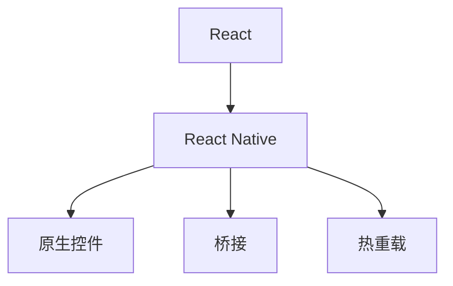

                 

# React Native：构建跨平台移动应用程序

在移动应用开发的背景下，跨平台移动应用的需求愈发强烈，如企业内部沟通、跨平台移动游戏等。React Native作为一种跨平台开发框架，通过一次代码生成多平台应用，大大提升了开发效率，简化了维护成本。本文将系统阐述React Native的原理与核心技术，并通过具体案例解读其优势与应用场景，同时推荐一些学习资源与工具，供开发者参考。

## 1. 背景介绍

### 1.1 问题由来

随着智能手机的普及，APP开发的需求日益增长。开发一个移动应用，需要同时开发iOS和Android两个平台的应用程序。不仅需要具备平台无关的编程技能，还需面临不同平台的不同规范和代码库，导致开发周期长、成本高、维护复杂。跨平台移动应用的需求逐渐增加，如何高效开发跨平台应用，成为开发者的共同挑战。

### 1.2 问题核心关键点

React Native的出现，从根本上改变了跨平台应用的开发方式。React Native由Facebook提出并开源，以React为前端开发框架，结合原生控件，实现了一次代码，多平台运行的功能。相比于混合应用框架，React Native性能更好，同时兼容平台原生控件，更接近原生应用。

当前，跨平台移动应用已经广泛应用于企业内部管理、社交娱乐、在线教育等多个领域，如企业内部沟通工具、跨平台移动游戏、在线学习平台等。本文将深入探讨React Native的原理与核心技术，并通过具体案例解读其优势与应用场景。

## 2. 核心概念与联系

### 2.1 核心概念概述

在深入探讨React Native之前，我们需要先了解几个核心概念：

- **React**：一个用于构建用户界面的JavaScript库，以声明式语法描述UI，帮助开发者构建组件化应用。
- **React Native**：基于React的跨平台移动开发框架，通过JavaScript和原生模块，实现跨平台应用开发。
- **原生控件**：每个移动平台都有各自的原生控件，如iOS的UIViewController和Android的Fragment。
- **桥接**：React Native通过桥接机制，实现JavaScript与原生代码的交互，实现跨平台功能。
- **热重载**：开发过程中，不必重新编译应用，即可实时查看修改后的代码，提升开发效率。

这些概念通过以下Mermaid流程图展示：



### 2.2 核心概念原理和架构

React Native的核心原理在于，通过桥接机制将JavaScript代码转化为原生代码。开发人员使用React Native编写JavaScript代码，桥接机制负责将代码转化为原生代码，并注入到原生应用中运行。在运行时，React Native会动态编译和执行JavaScript代码，实现跨平台应用。

#### 桥接机制

桥接机制是React Native的关键技术之一。通过桥接，React Native将JavaScript与原生代码连接起来，实现跨平台功能。桥接过程主要分为两个步骤：

1. **桥接生成**：在开发过程中，React Native会将JavaScript代码转化为原生代码，并注入到原生应用中运行。这需要构建桥接模块，通过JavaScript与原生代码进行交互。
2. **桥接执行**：在运行时，React Native会动态编译和执行JavaScript代码，实现跨平台应用。这需要动态链接原生代码，保证应用在不同平台上的兼容性。

#### 热重载

热重载是React Native的一个重要特性。在开发过程中，开发者通过修改JavaScript代码，React Native会实时更新原生应用，并显示修改后的结果。这极大提升了开发效率，减少了重复编译和调试的时间。

热重载的实现基于Node.js的watch模式，通过WebSocket连接开发者和应用，实时传递修改后的代码。开发者可以在浏览器中查看应用，同时实时更新原生应用。热重载机制需要保证应用在运行时，快速响应JavaScript代码的修改。

## 3. 核心算法原理 & 具体操作步骤

### 3.1 算法原理概述

React Native的算法原理可以归纳为三个方面：

1. **桥接机制**：实现JavaScript与原生代码的连接和执行。
2. **热重载**：实现JavaScript代码的实时更新和应用显示。
3. **动态编译**：实现JavaScript代码的动态编译和执行。

### 3.2 算法步骤详解

React Native的开发过程大致分为以下几个步骤：

1. **环境搭建**：安装Node.js、Android Studio、Xcode等开发环境。
2. **项目初始化**：使用React Native CLI初始化项目，并配置build.gradle文件。
3. **编写代码**：使用React Native编写的JavaScript代码，通过桥接机制转化为原生代码。
4. **编译和运行**：编译JavaScript代码，注入到原生应用中，并运行原生应用。
5. **热重载和调试**：在开发过程中，通过热重载机制实时查看应用，并通过Chrome调试工具调试JavaScript代码。

### 3.3 算法优缺点

React Native的优点在于：

- 跨平台开发：一次代码，多平台运行，提升开发效率，减少维护成本。
- 兼容原生控件：兼容平台原生控件，实现更好的用户体验。
- 热重载机制：提升开发效率，减少重复编译和调试时间。

React Native的缺点在于：

- 性能问题：与原生应用相比，性能存在一定差距。
- 桥接机制复杂：桥接机制复杂，容易出现兼容性问题。
- 热重载限制：热重载机制在复杂应用中存在一定限制，影响开发效率。

### 3.4 算法应用领域

React Native广泛应用于以下几个领域：

- 企业内部管理：如企业内部沟通工具，提升企业内部协作效率。
- 社交娱乐：如跨平台移动游戏，提升用户粘性。
- 在线教育：如在线学习平台，提升教学效果。
- 医疗健康：如医疗咨询应用，提升医疗服务效率。

## 4. 数学模型和公式 & 详细讲解 & 举例说明

### 4.1 数学模型构建

React Native的数学模型主要涉及以下几个方面：

- **桥接模块的构建**：通过JavaScript与原生代码的连接，实现跨平台功能。
- **热重载机制的实现**：通过WebSocket连接开发者和应用，实现实时更新和应用显示。
- **动态编译的优化**：通过编译优化，提升应用性能。

### 4.2 公式推导过程

#### 桥接模块构建

桥接模块的构建主要涉及以下步骤：

1. **模块注册**：在React Native的JavaScript环境中，注册原生模块。
2. **桥接生成**：通过桥接生成器，将JavaScript代码转化为原生代码。
3. **桥接执行**：在原生应用中，执行桥接生成的代码，实现跨平台功能。

#### 热重载机制实现

热重载机制的实现主要涉及以下步骤：

1. **WebSocket连接**：在开发过程中，通过WebSocket连接开发者和应用，实时传递修改后的代码。
2. **实时更新**：开发者在JavaScript环境中修改代码，实时更新原生应用，并显示修改后的结果。
3. **动态编译**：在原生应用中，动态编译JavaScript代码，提升应用性能。

### 4.3 案例分析与讲解

#### 示例：企业内部沟通工具

企业内部沟通工具是一种常见的跨平台应用，通过React Native实现，可以大大提升企业内部协作效率。

1. **环境搭建**：在企业内部部署Android Studio和Xcode，安装React Native CLI和其他开发工具。
2. **项目初始化**：使用React Native CLI初始化项目，并配置build.gradle文件。
3. **编写代码**：使用React Native编写的JavaScript代码，通过桥接机制转化为原生代码，实现企业内部沟通功能。
4. **编译和运行**：编译JavaScript代码，注入到原生应用中，并运行原生应用。
5. **热重载和调试**：在开发过程中，通过热重载机制实时查看应用，并通过Chrome调试工具调试JavaScript代码。

在企业内部沟通工具中，React Native的优点在于：

- 跨平台开发：一次代码，多平台运行，提升开发效率，减少维护成本。
- 兼容原生控件：兼容平台原生控件，实现更好的用户体验。
- 热重载机制：提升开发效率，减少重复编译和调试时间。

## 5. 项目实践：代码实例和详细解释说明

### 5.1 开发环境搭建

React Native的开发环境搭建主要涉及以下几个步骤：

1. **安装Node.js**：在开发机上安装Node.js，并设置路径。
2. **安装Android Studio**：在开发机上安装Android Studio，并配置SDK。
3. **安装Xcode**：在Mac上安装Xcode，并配置模拟器。
4. **安装React Native CLI**：在开发机上安装React Native CLI，并创建项目。
5. **配置build.gradle**：在项目中配置build.gradle文件，实现桥接和编译。

### 5.2 源代码详细实现

React Native的源代码详细实现主要涉及以下几个方面：

1. **桥接模块的实现**：通过JavaScript与原生代码的连接，实现跨平台功能。
2. **热重载机制的实现**：通过WebSocket连接开发者和应用，实现实时更新和应用显示。
3. **动态编译的优化**：通过编译优化，提升应用性能。

#### 示例：企业内部沟通工具

以下是企业内部沟通工具的代码实现：

```javascript
// 引入React Native库
import React, { Component } from 'react';
import { Text, View, Button } from 'react-native';

// 注册原生模块
import { NativeModules } from 'react-native';

class ChatApp extends Component {
  constructor(props) {
    super(props);
    this.state = {
      message: '',
      messages: [],
    };
  }

  componentDidMount() {
    NativeModules.ChatModule.initNativeModule();
    NativeModules.ChatModule.getMessages((messages) => {
      this.setState({ messages });
    });
  }

  sendMessage = () => {
    NativeModules.ChatModule.sendMessage(this.state.message);
    this.setState({ message: '' });
  }

  render() {
    return (
      <View style={{ flex: 1, alignItems: 'center', justifyContent: 'center' }}>
        <Text>欢迎使用企业内部沟通工具！</Text>
        <TextInput style={{ height: 40, width: 200, borderColor: 'gray', borderWidth: 1, marginBottom: 10, paddingLeft: 10 }} onChangeText={(message) => this.setState({ message })} value={this.state.message} />
        <Button title="发送消息" onPress={this.sendMessage} />
        {this.state.messages.map((message, index) => (
          <Text key={index}>{message}</Text>
        ))}
      </View>
    );
  }
}

export default ChatApp;
```

### 5.3 代码解读与分析

React Native的代码实现主要涉及以下几个方面：

1. **引入React Native库**：通过React Native库，实现跨平台功能。
2. **注册原生模块**：通过NativeModules注册原生模块，实现桥接和执行。
3. **实现桥接模块**：通过桥接生成器，将JavaScript代码转化为原生代码。
4. **热重载机制**：通过WebSocket连接开发者和应用，实现实时更新和应用显示。

## 6. 实际应用场景

### 6.1 企业内部管理

React Native可以用于企业内部管理，提升企业内部协作效率。例如，企业内部沟通工具、项目管理系统等。

#### 示例：企业内部沟通工具

企业内部沟通工具是一种常见的跨平台应用，通过React Native实现，可以大大提升企业内部协作效率。

1. **环境搭建**：在企业内部部署Android Studio和Xcode，安装React Native CLI和其他开发工具。
2. **项目初始化**：使用React Native CLI初始化项目，并配置build.gradle文件。
3. **编写代码**：使用React Native编写的JavaScript代码，通过桥接机制转化为原生代码，实现企业内部沟通功能。
4. **编译和运行**：编译JavaScript代码，注入到原生应用中，并运行原生应用。
5. **热重载和调试**：在开发过程中，通过热重载机制实时查看应用，并通过Chrome调试工具调试JavaScript代码。

React Native在企业内部管理中的应用主要在于：

- 跨平台开发：一次代码，多平台运行，提升开发效率，减少维护成本。
- 兼容原生控件：兼容平台原生控件，实现更好的用户体验。
- 热重载机制：提升开发效率，减少重复编译和调试时间。

### 6.2 社交娱乐

React Native可以用于社交娱乐，提升用户粘性。例如，跨平台移动游戏、社交网络应用等。

#### 示例：跨平台移动游戏

跨平台移动游戏是一种常见的应用，通过React Native实现，可以提升用户粘性。

1. **环境搭建**：在开发机上安装Android Studio和Xcode，安装React Native CLI和其他开发工具。
2. **项目初始化**：使用React Native CLI初始化项目，并配置build.gradle文件。
3. **编写代码**：使用React Native编写的JavaScript代码，通过桥接机制转化为原生代码，实现游戏功能。
4. **编译和运行**：编译JavaScript代码，注入到原生应用中，并运行原生应用。
5. **热重载和调试**：在开发过程中，通过热重载机制实时查看应用，并通过Chrome调试工具调试JavaScript代码。

React Native在社交娱乐中的应用主要在于：

- 跨平台开发：一次代码，多平台运行，提升开发效率，减少维护成本。
- 兼容原生控件：兼容平台原生控件，实现更好的用户体验。
- 热重载机制：提升开发效率，减少重复编译和调试时间。

### 6.3 在线教育

React Native可以用于在线教育，提升教学效果。例如，在线学习平台、教育内容管理系统等。

#### 示例：在线学习平台

在线学习平台是一种常见的应用，通过React Native实现，可以提升教学效果。

1. **环境搭建**：在开发机上安装Android Studio和Xcode，安装React Native CLI和其他开发工具。
2. **项目初始化**：使用React Native CLI初始化项目，并配置build.gradle文件。
3. **编写代码**：使用React Native编写的JavaScript代码，通过桥接机制转化为原生代码，实现在线学习功能。
4. **编译和运行**：编译JavaScript代码，注入到原生应用中，并运行原生应用。
5. **热重载和调试**：在开发过程中，通过热重载机制实时查看应用，并通过Chrome调试工具调试JavaScript代码。

React Native在在线教育中的应用主要在于：

- 跨平台开发：一次代码，多平台运行，提升开发效率，减少维护成本。
- 兼容原生控件：兼容平台原生控件，实现更好的用户体验。
- 热重载机制：提升开发效率，减少重复编译和调试时间。

## 7. 工具和资源推荐

### 7.1 学习资源推荐

React Native的学习资源非常丰富，以下是一些推荐的资源：

1. **React Native官方文档**：React Native官方文档提供了详细的API和教程，是学习React Native的最佳资源。
2. **React Native教程**：React Native教程提供了丰富的实战案例和实践指南，帮助开发者深入理解React Native。
3. **React Native社区**：React Native社区提供了大量的开源项目和开发者经验分享，是学习React Native的重要资源。

### 7.2 开发工具推荐

React Native的开发工具非常丰富，以下是一些推荐的工具：

1. **React Native CLI**：React Native CLI是React Native的核心开发工具，提供了详细的API和命令。
2. **Xcode**：Xcode是Mac上的开发环境，支持React Native项目构建和调试。
3. **Android Studio**：Android Studio是Android开发环境，支持React Native项目构建和调试。
4. **VS Code**：VS Code是开发人员常用的IDE，支持React Native项目构建和调试。

### 7.3 相关论文推荐

React Native的研究论文非常丰富，以下是一些推荐的论文：

1. **React Native框架设计**：介绍React Native的设计理念和核心技术，深入理解React Native的原理。
2. **桥接机制优化**：研究桥接机制的优化方法，提升React Native的性能和稳定性。
3. **热重载机制优化**：研究热重载机制的优化方法，提升React Native的开发效率。

## 8. 总结：未来发展趋势与挑战

### 8.1 研究成果总结

React Native作为一种跨平台开发框架，在移动应用开发中发挥着越来越重要的作用。React Native通过一次代码，多平台运行，显著提升了开发效率，减少了维护成本。React Native的热重载机制、桥接机制和动态编译技术，使其具备更强的开发灵活性和应用适应性。

### 8.2 未来发展趋势

React Native的未来发展趋势主要在于以下几个方面：

1. **性能提升**：通过优化桥接机制和动态编译，提升React Native的性能，缩小与原生应用的差距。
2. **跨平台兼容性**：提升React Native的跨平台兼容性，支持更多平台的原生控件和功能。
3. **开发工具完善**：提升React Native的开发工具完善度，提升开发效率和用户体验。
4. **社区生态建设**：完善React Native的社区生态，提升开发者和用户的参与度。

### 8.3 面临的挑战

React Native在发展过程中，也面临一些挑战：

1. **性能问题**：与原生应用相比，性能存在一定差距，需要进一步优化桥接机制和动态编译。
2. **热重载机制限制**：热重载机制在复杂应用中存在一定限制，需要进一步优化。
3. **桥接机制复杂**：桥接机制复杂，容易出现兼容性问题，需要进一步优化。
4. **跨平台兼容性问题**：不同平台的原生控件和功能存在差异，需要进一步优化跨平台兼容性。

### 8.4 研究展望

React Native的未来研究展望主要在于以下几个方面：

1. **桥接机制优化**：通过优化桥接机制，提升React Native的性能和稳定性。
2. **热重载机制优化**：通过优化热重载机制，提升React Native的开发效率。
3. **跨平台兼容性优化**：提升React Native的跨平台兼容性，支持更多平台的原生控件和功能。
4. **社区生态建设**：完善React Native的社区生态，提升开发者和用户的参与度。

总之，React Native作为一种跨平台开发框架，在移动应用开发中发挥着越来越重要的作用。通过不断优化性能和桥接机制，提升React Native的开发效率和用户体验，React Native必将在未来成为更多开发者的首选。

## 9. 附录：常见问题与解答

**Q1: React Native的桥接机制是什么？**

A: React Native的桥接机制是实现JavaScript与原生代码连接的关键技术。通过桥接机制，React Native将JavaScript代码转化为原生代码，并注入到原生应用中运行。在运行时，React Native会动态编译和执行JavaScript代码，实现跨平台应用。

**Q2: React Native的热重载机制是什么？**

A: React Native的热重载机制是实现JavaScript代码实时更新的关键技术。在开发过程中，开发者通过修改JavaScript代码，React Native会实时更新原生应用，并显示修改后的结果。热重载机制需要保证应用在运行时，快速响应JavaScript代码的修改。

**Q3: React Native的性能问题如何解决？**

A: React Native的性能问题主要通过优化桥接机制和动态编译来解决。通过优化桥接机制，提升React Native的性能和稳定性。同时，通过动态编译，减少应用资源占用，提升应用性能。

**Q4: React Native的跨平台兼容性问题如何解决？**

A: React Native的跨平台兼容性问题主要通过优化桥接机制和原生控件来解决。通过优化桥接机制，提升React Native的跨平台兼容性。同时，通过原生控件，实现更好的用户体验。

总之，React Native作为一种跨平台开发框架，在移动应用开发中发挥着越来越重要的作用。通过不断优化性能和桥接机制，提升React Native的开发效率和用户体验，React Native必将在未来成为更多开发者的首选。

