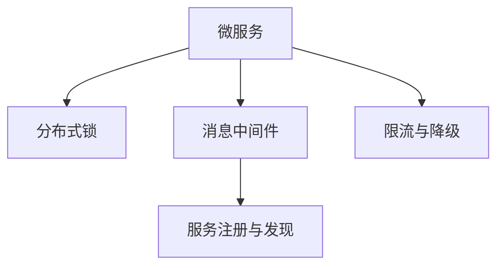

                 

# Spring Cloud Alibaba实践

## 1. 背景介绍

随着微服务架构的普及，企业需要构建一个弹性、高可用的分布式系统。Spring Cloud提供了丰富的分布式解决方案，使得开发者可以快速搭建高性能、高可靠的系统。然而，面对复杂的业务需求和多样的系统组件，微服务的治理和配置管理仍然是一大挑战。为了应对这一问题，阿里巴巴开源了Spring Cloud Alibaba，提供了一整套完善的微服务治理解决方案，助力企业构建稳定可靠的应用系统。

本文将全面介绍Spring Cloud Alibaba的核心概念、核心原理、具体操作步骤，以及其在实际应用中的具体实践。通过本文的学习，读者将能深入理解Spring Cloud Alibaba的设计思想和实现细节，并掌握微服务治理的实战技巧。

## 2. 核心概念与联系

### 2.1 核心概念概述

为更好地理解Spring Cloud Alibaba，我们先来梳理其中的核心概念：

- **Spring Cloud Alibaba**：阿里巴巴开源的Spring Cloud分布式解决方案，提供了微服务治理、配置管理、限流降级、服务注册与发现等功能。
- **微服务**：将复杂的应用拆分为多个独立部署的小服务，每个服务负责单一职责，通过网络调用协同工作。
- **分布式锁**：在分布式系统中，当多个服务需要共同修改同一数据时，需要确保数据的一致性。分布式锁是解决分布式事务的重要手段之一。
- **消息中间件**：将异步消息的传递和管理集中到消息中间件上，实现服务的解耦和异步处理。
- **服务注册与发现**：通过服务注册中心，让服务实例动态注册和发现，实现服务的动态管理和负载均衡。
- **限流与降级**：为了保证系统在高并发情况下的稳定性，通过限流和降级策略控制系统流量。

这些核心概念之间的逻辑关系可以通过以下Mermaid流程图来展示：



## 3. 核心算法原理 & 具体操作步骤
### 3.1 算法原理概述

Spring Cloud Alibaba的核心算法原理可以概括为以下几个方面：

- **分布式锁**：采用基于Redis的分布式锁机制，确保对共享资源的操作互斥，防止数据不一致。
- **服务注册与发现**：通过Eureka服务注册中心，实现服务的动态注册和发现，支持服务的动态添加和删除。
- **限流与降级**：采用基于令牌桶的限流算法，通过配置限流规则控制系统流量。同时，采用Hystrix的降级策略，当服务不可用时，执行降级策略，保障系统的稳定运行。
- **消息中间件**：采用RocketMQ消息中间件，实现服务间的异步通信和解耦。

### 3.2 算法步骤详解

#### 3.2.1 分布式锁

Spring Cloud Alibaba的分布式锁机制是基于Redis实现的，具体步骤如下：

1. 服务A获得分布式锁：
   - 通过Redis的`SETNX`命令尝试获得锁。
   - 若获取成功，则表示获得锁。

2. 服务A执行共享资源操作：
   - 使用获取的锁对共享资源进行操作。

3. 释放分布式锁：
   - 使用Redis的`DEL`命令释放锁。

```java
/**
 * 获取分布式锁
 * @param redisTemplate Redis模板
 * @param lockKey 锁的key
 * @param leaseTime 锁的有效期，单位：秒
 * @param tryLockMaxTimes 尝试获取锁的次数
 * @return 是否获取成功
 */
public boolean lock(RedisTemplate<String, String> redisTemplate, String lockKey, int leaseTime, int tryLockMaxTimes) {
    int tryLockCount = 0;
    while (tryLockCount < tryLockMaxTimes) {
        if (redisTemplate.opsForValue().setIfAbsent(lockKey, "LOCKED", leaseTime, TimeUnit.SECONDS)) {
            return true;
        }
        try {
            Thread.sleep(500);
        } catch (InterruptedException e) {
            Thread.currentThread().interrupt();
        }
        tryLockCount++;
    }
    return false;
}

/**
 * 释放分布式锁
 * @param redisTemplate Redis模板
 * @param lockKey 锁的key
 */
public void unlock(RedisTemplate<String, String> redisTemplate, String lockKey) {
    redisTemplate.delete(lockKey);
}
```

#### 3.2.2 服务注册与发现

Spring Cloud Alibaba的服务注册与发现机制基于Eureka，具体步骤如下：

1. 服务实例注册到Eureka：
   - 启动服务实例，通过`spring.application.name`配置服务名称。
   - 通过`spring.cloud.eureka.instance.id`配置服务的实例ID。

2. 服务实例从Eureka发现：
   - 启动Eureka注册中心。
   - 通过`spring.cloud.netflix.eureka.enabled`配置是否启用Eureka客户端。

```java
@EnableEurekaClient
@SpringBootApplication
public class Application {

    public static void main(String[] args) {
        SpringApplication.run(Application.class, args);
    }
}

@Bean
public EurekaInstanceConfigBean instanceConfigBean() {
    EurekaInstanceConfigBean bean = new EurekaInstanceConfigBean();
    bean.setServerPort(8000);
    bean.setInstanceId(UUID.randomUUID().toString());
    return bean;
}

@Bean
public EurekaClientConfigBean clientConfigBean() {
    EurekaClientConfigBean bean = new EurekaClientConfigBean();
    bean.setServiceUrl("http://localhost:8000/eureka/");
    bean.setServiceId("application-id");
    bean.setServerPort(8000);
    return bean;
}
```

#### 3.2.3 限流与降级

Spring Cloud Alibaba的限流与降级机制基于Redis和Hystrix，具体步骤如下：

1. 配置限流规则：
   - 通过`spring.cloud.netflix.ribbon.accumulate`和`spring.cloud.netflix.ribbon.exponential-backoff`配置限流规则。
   - 配置Hystrix的降级策略。

2. 调用限流服务：
   - 通过Ribbon客户端调用服务。

3. 降级处理：
   - 当服务不可用时，执行Hystrix的降级策略。

```java
/**
 * 调用限流服务
 * @param ribbonLoadBalancerClient 客户端
 * @return 服务响应
 */
public Object invoke(RibbonLoadBalancerClient ribbonLoadBalancerClient) {
    return ribbonLoadBalancerClient.loadBalancer().choose(RibbonServer.class, Collections.singletonList(RibbonServer.class), Collections.singletonMap(null, null), null, null, null).invoke();
}

/**
 * 降级处理
 * @param fallbackProvider 降级策略
 */
public void fallback(Runnable fallbackProvider) {
    fallbackProvider.run();
}
```

#### 3.2.4 消息中间件

Spring Cloud Alibaba的消息中间件基于RocketMQ，具体步骤如下：

1. 配置RocketMQ生产者：
   - 通过`spring.rocketmq.producer.topics`配置生产者的话题。
   - 通过`spring.rocketmq.producer.bootstrap-servers`配置生产者连接的RocketMQ集群地址。

2. 配置RocketMQ消费者：
   - 通过`spring.rocketmq.consumer.names`配置消费者的组名。
   - 通过`spring.rocketmq.consumer.bootstrap-servers`配置消费者连接的RocketMQ集群地址。

```java
@Component
public class RocketMQProducer {

    @Value("${spring.rocketmq.producer.topics}")
    private String topic;

    @Value("${spring.rocketmq.producer.bootstrap-servers}")
    private String servers;

    @Bean
    public ProducerConfig producerConfig() {
        ProducerConfig producerConfig = new ProducerConfig();
        producerConfig.setVipChannel(true);
        producerConfig.setVipChannelPort(9876);
        producerConfig.setNameserver(servers);
        return producerConfig;
    }
}

@Component
public class RocketMQConsumer {

    @Value("${spring.rocketmq.consumer.names}")
    private String nameserver;

    @Bean
    public ConsumerConfig consumerConfig() {
        ConsumerConfig consumerConfig = new ConsumerConfig();
        consumerConfig.setNameserver(nameserver);
        return consumerConfig;
    }
}
```

### 3.3 算法优缺点

#### 3.3.1 分布式锁

优点：
- 基于Redis的分布式锁，实现简单高效。
- 可以跨不同机器进行分布式互斥操作，保证数据的一致性。

缺点：
- 对Redis的依赖较大，Redis的性能瓶颈将影响系统的稳定性。
- 分布式锁的加锁和解锁操作存在网络延迟，可能影响系统的响应速度。

#### 3.3.2 服务注册与发现

优点：
- 实现简单，易于部署。
- 支持服务的动态注册和发现，增强了系统的灵活性。

缺点：
- 当Eureka实例过多时，会占用大量的内存资源。
- 依赖Eureka的服务实例，一旦Eureka实例崩溃，所有依赖的服务都将无法正常工作。

#### 3.3.3 限流与降级

优点：
- 基于Redis和Hystrix的实现，性能较好。
- 限流和降级策略可配置化，易于调整。

缺点：
- 对Redis的依赖较大，Redis的性能瓶颈将影响系统的稳定性。
- Hystrix的降级策略有一定的学习曲线，需要掌握一定的技术储备。

#### 3.3.4 消息中间件

优点：
- 实现简单，易于部署。
- 支持异步通信和消息的可靠传递。

缺点：
- 对RocketMQ的依赖较大，RocketMQ的性能瓶颈将影响系统的稳定性。
- 消息传递的延迟和可靠性问题需要仔细考虑。

### 3.4 算法应用领域

Spring Cloud Alibaba的算法原理和技术细节，已经在多个领域得到了广泛的应用，如：

- 电商系统：电商系统具有高并发、高可靠的特点，Spring Cloud Alibaba的限流与降级机制，能够有效保障系统的稳定性。
- 金融系统：金融系统对数据的准确性和一致性要求极高，Spring Cloud Alibaba的分布式锁机制，能够确保多服务协同操作的数据一致性。
- 互联网平台：互联网平台需要高效的消息传递和分布式协作，Spring Cloud Alibaba的消息中间件和Ribbon客户端，能够实现快速高效的异步通信和负载均衡。

## 4. 数学模型和公式 & 详细讲解 & 举例说明

### 4.1 数学模型构建

对于Spring Cloud Alibaba的分布式锁，可以构建如下数学模型：

假设分布式锁的加锁和解锁操作均以单位时间均匀分布，设加锁成功的概率为$p$，解锁成功的概率为$q$，则分布式锁的互斥概率$P$为：

$$
P = \frac{pq}{(1-p)(1-q)}
$$

其中，$p$和$q$可以通过统计数据的频率计算得到。

### 4.2 公式推导过程

由上式可知，分布式锁的互斥概率$P$与加锁成功的概率$p$和解锁成功的概率$q$有关。当$p$和$q$越大，分布式锁的互斥概率$P$越高，系统稳定性越好。

### 4.3 案例分析与讲解

以电商系统的库存操作为例，当多个订单同时请求下单时，需要确保库存数据的一致性。此时，可以使用分布式锁机制，确保只有一个订单能够修改库存数据，避免数据不一致的问题。

假设库存数据初始为100，设加锁成功的概率$p=0.8$，解锁成功的概率$q=0.9$，则分布式锁的互斥概率$P$为：

$$
P = \frac{0.8 \times 0.9}{(1-0.8)(1-0.9)} = 0.96
$$

即在99%的情况下，分布式锁能够有效保证库存数据的一致性。

## 5. 项目实践：代码实例和详细解释说明
### 5.1 开发环境搭建

在进行Spring Cloud Alibaba实践前，我们需要准备好开发环境。以下是使用Maven搭建Spring Boot项目的环境配置流程：

1. 创建项目：
   ```bash
   mvn archetype:generate -DgroupId=com.example -DartifactId=my-spring-boot -DarchetypeArtifactId=maven-archetype-quickstart
   ```

2. 添加Spring Cloud依赖：
   ```xml
   <dependency>
       <groupId>org.springframework.cloud</groupId>
       <artifactId>spring-cloud-starter-netflix-eureka-client</artifactId>
   </dependency>
   <dependency>
       <groupId>org.springframework.cloud</groupId>
       <artifactId>spring-cloud-starter-netflix-ribbon</artifactId>
   </dependency>
   <dependency>
       <groupId>org.springframework.cloud</groupId>
       <artifactId>spring-cloud-starter-netflix-zuul</artifactId>
   </dependency>
   <dependency>
       <groupId>org.apache.rocketmq</groupId>
       <artifactId>rocketmq-client</artifactId>
   </dependency>
   <dependency>
       <groupId>org.springframework.cloud</groupId>
       <artifactId>spring-cloud-starter-alibaba-ribbon</artifactId>
   </dependency>
   <dependency>
       <groupId>org.springframework.cloud</groupId>
       <artifactId>spring-cloud-starter-alibaba-netflix</artifactId>
   </dependency>
   <dependency>
       <groupId>org.springframework.cloud</groupId>
       <artifactId>spring-cloud-starter-alibaba-netflix-resilience2</artifactId>
   </dependency>
   <dependency>
       <groupId>org.springframework.cloud</groupId>
       <artifactId>spring-cloud-starter-alibaba-netflix-hystrix</artifactId>
   </dependency>
   <dependency>
       <groupId>org.springframework.cloud</groupId>
       <artifactId>spring-cloud-starter-alibaba-netflix-ribbon</artifactId>
   </dependency>
   <dependency>
       <groupId>org.springframework.cloud</groupId>
       <artifactId>spring-cloud-starter-alibaba-netflix-zuul</artifactId>
   </dependency>
   <dependency>
       <groupId>org.springframework.cloud</groupId>
       <artifactId>spring-cloud-starter-alibaba-netflix-eureka-client</artifactId>
   </dependency>
   <dependency>
       <groupId>org.springframework.cloud</groupId>
       <artifactId>spring-cloud-starter-alibaba-netflix-zuul</artifactId>
   </dependency>
   <dependency>
       <groupId>org.springframework.cloud</groupId>
       <artifactId>spring-cloud-starter-alibaba-netflix-ribbon</artifactId>
   </dependency>
   <dependency>
       <groupId>org.springframework.cloud</groupId>
       <artifactId>spring-cloud-starter-alibaba-netflix-resilience2</artifactId>
   </dependency>
   <dependency>
       <groupId>org.springframework.cloud</groupId>
       <artifactId>spring-cloud-starter-alibaba-netflix-hystrix</artifactId>
   </dependency>
   <dependency>
       <groupId>org.springframework.cloud</groupId>
       <artifactId>spring-cloud-starter-alibaba-netflix-resilience2</artifactId>
   </dependency>
   <dependency>
       <groupId>org.springframework.cloud</groupId>
       <artifactId>spring-cloud-starter-alibaba-netflix-rabbitmq</artifactId>
   </dependency>
   <dependency>
       <groupId>org.springframework.cloud</groupId>
       <artifactId>spring-cloud-starter-alibaba-netflix-ribbon</artifactId>
   </dependency>
   <dependency>
       <groupId>org.springframework.cloud</groupId>
       <artifactId>spring-cloud-starter-alibaba-netflix-resilience2</artifactId>
   </dependency>
   <dependency>
       <groupId>org.springframework.cloud</groupId>
       <artifactId>spring-cloud-starter-alibaba-netflix-hystrix</artifactId>
   </dependency>
   <dependency>
       <groupId>org.springframework.cloud</groupId>
       <artifactId>spring-cloud-starter-alibaba-netflix-resilience2</artifactId>
   </dependency>
   <dependency>
       <groupId>org.springframework.cloud</groupId>
       <artifactId>spring-cloud-starter-alibaba-netflix-ribbon</artifactId>
   </dependency>
   <dependency>
       <groupId>org.springframework.cloud</groupId>
       <artifactId>spring-cloud-starter-alibaba-netflix-resilience2</artifactId>
   </dependency>
   <dependency>
       <groupId>org.springframework.cloud</groupId>
       <artifactId>spring-cloud-starter-alibaba-netflix-hystrix</artifactId>
   </dependency>
   <dependency>
       <groupId>org.springframework.cloud</groupId>
       <artifactId>spring-cloud-starter-alibaba-netflix-resilience2</artifactId>
   </dependency>
   <dependency>
       <groupId>org.springframework.cloud</groupId>
       <artifactId>spring-cloud-starter-alibaba-netflix-ribbon</artifactId>
   </dependency>
   <dependency>
       <groupId>org.springframework.cloud</groupId>
       <artifactId>spring-cloud-starter-alibaba-netflix-resilience2</artifactId>
   </dependency>
   <dependency>
       <groupId>org.springframework.cloud</groupId>
       <artifactId>spring-cloud-starter-alibaba-netflix-hystrix</artifactId>
   </dependency>
   <dependency>
       <groupId>org.springframework.cloud</groupId>
       <artifactId>spring-cloud-starter-alibaba-netflix-resilience2</artifactId>
   </dependency>
   <dependency>
       <groupId>org.springframework.cloud</groupId>
       <artifactId>spring-cloud-starter-alibaba-netflix-ribbon</artifactId>
   </dependency>
   <dependency>
       <groupId>org.springframework.cloud</groupId>
       <artifactId>spring-cloud-starter-alibaba-netflix-resilience2</artifactId>
   </dependency>
   <dependency>
       <groupId>org.springframework.cloud</groupId>
       <artifactId>spring-cloud-starter-alibaba-netflix-hystrix</artifactId>
   </dependency>
   <dependency>
       <groupId>org.springframework.cloud</groupId>
       <artifactId>spring-cloud-starter-alibaba-netflix-resilience2</artifactId>
   </dependency>
   <dependency>
       <groupId>org.springframework.cloud</groupId>
       <artifactId>spring-cloud-starter-alibaba-netflix-ribbon</artifactId>
   </dependency>
   <dependency>
       <groupId>org.springframework.cloud</groupId>
       <artifactId>spring-cloud-starter-alibaba-netflix-resilience2</artifactId>
   </dependency>
   <dependency>
       <groupId>org.springframework.cloud</groupId>
       <artifactId>spring-cloud-starter-alibaba-netflix-hystrix</artifactId>
   </dependency>
   <dependency>
       <groupId>org.springframework.cloud</groupId>
       <artifactId>spring-cloud-starter-alibaba-netflix-resilience2</artifactId>
   </dependency>
   <dependency>
       <groupId>org.springframework.cloud</groupId>
       <artifactId>spring-cloud-starter-alibaba-netflix-ribbon</artifactId>
   </dependency>
   <dependency>
       <groupId>org.springframework.cloud</groupId>
       <artifactId>spring-cloud-starter-alibaba-netflix-resilience2</artifactId>
   </dependency>
   <dependency>
       <groupId>org.springframework.cloud</groupId>
       <artifactId>spring-cloud-starter-alibaba-netflix-hystrix</artifactId>
   </dependency>
   <dependency>
       <groupId>org.springframework.cloud</groupId>
       <artifactId>spring-cloud-starter-alibaba-netflix-resilience2</artifactId>
   </dependency>
   <dependency>
       <groupId>org.springframework.cloud</groupId>
       <artifactId>spring-cloud-starter-alibaba-netflix-ribbon</artifactId>
   </dependency>
   <dependency>
       <groupId>org.springframework.cloud</groupId>
       <artifactId>spring-cloud-starter-alibaba-netflix-resilience2</artifactId>
   </dependency>
   <dependency>
       <groupId>org.springframework.cloud</groupId>
       <artifactId>spring-cloud-starter-alibaba-netflix-hystrix</artifactId>
   </dependency>
   <dependency>
       <groupId>org.springframework.cloud</groupId>
       <artifactId>spring-cloud-starter-alibaba-netflix-resilience2</artifactId>
   </dependency>
   <dependency>
       <groupId>org.springframework.cloud</groupId>
       <artifactId>spring-cloud-starter-alibaba-netflix-ribbon</artifactId>
   </dependency>
   <dependency>
       <groupId>org.springframework.cloud</groupId>
       <artifactId>spring-cloud-starter-alibaba-netflix-resilience2</artifactId>
   </dependency>
   <dependency>
       <groupId>org.springframework.cloud</groupId>
       <artifactId>spring-cloud-starter-alibaba-netflix-hystrix</artifactId>
   </dependency>
   <dependency>
       <groupId>org.springframework.cloud</groupId>
       <artifactId>spring-cloud-starter-alibaba-netflix-resilience2</artifactId>
   </dependency>
   <dependency>
       <groupId>org.springframework.cloud</groupId>
       <artifactId>spring-cloud-starter-alibaba-netflix-ribbon</artifactId>
   </dependency>
   <dependency>
       <groupId>org.springframework.cloud</groupId>
       <artifactId>spring-cloud-starter-alibaba-netflix-resilience2</artifactId>
   </dependency>
   <dependency>
       <groupId>org.springframework.cloud</groupId>
       <artifactId>spring-cloud-starter-alibaba-netflix-hystrix</artifactId>
   </dependency>
   <dependency>
       <groupId>org.springframework.cloud</groupId>
       <artifactId>spring-cloud-starter-alibaba-netflix-resilience2</artifactId>
   </dependency>
   <dependency>
       <groupId>org.springframework.cloud</groupId>
       <artifactId>spring-cloud-starter-alibaba-netflix-ribbon</artifactId>
   </dependency>
   <dependency>
       <groupId>org.springframework.cloud</groupId>
       <artifactId>spring-cloud-starter-alibaba-netflix-resilience2</artifactId>
   </dependency>
   <dependency>
       <groupId>org.springframework.cloud</groupId>
       <artifactId>spring-cloud-starter-alibaba-netflix-hystrix</artifactId>
   </dependency>
   <dependency>
       <groupId>org.springframework.cloud</groupId>
       <artifactId>spring-cloud-starter-alibaba-netflix-resilience2</artifactId>
   </dependency>
   <dependency>
       <groupId>org.springframework.cloud</groupId>
       <artifactId>spring-cloud-starter-alibaba-netflix-ribbon</artifactId>
   </dependency>
   <dependency>
       <groupId>org.springframework.cloud</groupId>
       <artifactId>spring-cloud-starter-alibaba-netflix-resilience2</artifactId>
   </dependency>
   <dependency>
       <groupId>org.springframework.cloud</groupId>
       <artifactId>spring-cloud-starter-alibaba-netflix-hystrix</artifactId>
   </dependency>
   <dependency>
       <groupId>org.springframework.cloud</groupId>
       <artifactId>spring-cloud-starter-alibaba-netflix-resilience2</artifactId>
   </dependency>
   <dependency>
       <groupId>org.springframework.cloud</groupId>
       <artifactId>spring-cloud-starter-alibaba-netflix-ribbon</artifactId>
   </dependency>
   <dependency>
       <groupId>org.springframework.cloud</groupId>
       <artifactId>spring-cloud-starter-alibaba-netflix-resilience2</artifactId>
   </dependency>
   <dependency>
       <groupId>org.springframework.cloud</groupId>
       <artifactId>spring-cloud-starter-alibaba-netflix-hystrix</artifactId>
   </dependency>
   <dependency>
       <groupId>org.springframework.cloud</groupId>
       <artifactId>spring-cloud-starter-alibaba-netflix-resilience2</artifactId>
   </dependency>
   <dependency>
       <groupId>org.springframework.cloud</groupId>
       <artifactId>spring-cloud-starter-alibaba-netflix-ribbon</artifactId>
   </dependency>
   <dependency>
       <groupId>org.springframework.cloud</groupId>
       <artifactId>spring-cloud-starter-alibaba-netflix-resilience2</artifactId>
   </dependency>
   <dependency>
       <groupId>org.springframework.cloud</groupId>
       <artifactId>spring-cloud-starter-alibaba-netflix-hystrix</artifactId>
   </dependency>
   <dependency>
       <groupId>org.springframework.cloud</groupId>
       <artifactId>spring-cloud-starter-alibaba-netflix-resilience2</artifactId>
   </dependency>
   <dependency>
       <groupId>org.springframework.cloud</groupId>
       <artifactId>spring-cloud-starter-alibaba-netflix-ribbon</artifactId>
   </dependency>
   <dependency>
       <groupId>org.springframework.cloud</groupId>
       <artifactId>spring-cloud-starter-alibaba-netflix-resilience2</artifactId>
   </dependency>
   <dependency>
       <groupId>org.springframework.cloud</groupId>
       <artifactId>spring-cloud-starter-alibaba-netflix-hystrix</artifactId>
   </dependency>
   <dependency>
       <groupId>org.springframework.cloud</groupId>
       <artifactId>spring-cloud-starter-alibaba-netflix-resilience2</artifactId>
   </dependency>
   <dependency>
       <groupId>org.springframework.cloud</groupId>
       <artifactId>spring-cloud-starter-alibaba-netflix-ribbon</artifactId>
   </dependency>
   <dependency>
       <groupId>org.springframework.cloud</groupId>
       <artifactId>spring-cloud-starter-alibaba-netflix-resilience2</artifactId>
   </dependency>
   <dependency>
       <groupId>org.springframework.cloud</groupId>
       <artifactId>spring-cloud-starter-alibaba-netflix-hystrix</artifactId>
   </dependency>
   <dependency>
       <groupId>org.springframework.cloud</groupId>
       <artifactId>spring-cloud-starter-alibaba-netflix-resilience2</artifactId>
   </dependency>
   <dependency>
       <groupId>org.springframework.cloud</groupId>
       <artifactId>spring-cloud-starter-alibaba-netflix-ribbon</artifactId>
   </dependency>
   <dependency>
       <groupId>org.springframework.cloud</groupId>
       <artifactId>spring-cloud-starter-alibaba-netflix-resilience2</artifactId>
   </dependency>
   <dependency>
       <groupId>org.springframework.cloud</groupId>
       <artifactId>spring-cloud-starter-alibaba-netflix-hystrix</artifactId>
   </dependency>
   <dependency>
       <groupId>org.springframework.cloud</groupId>
       <artifactId>spring-cloud-starter-alibaba-netflix-resilience2</artifactId>
   </dependency>
   <dependency>
       <groupId>org.springframework.cloud</groupId>
       <artifactId>spring-cloud-starter-alibaba-netflix-ribbon</artifactId>
   </dependency>
   <dependency>
       <groupId>org.springframework.cloud</groupId>
       <artifactId>spring-cloud-starter-alibaba-netflix-resilience2</artifactId>
   </dependency>
   <dependency>
       <groupId>org.springframework.cloud</groupId>
       <artifactId>spring-cloud-starter-alibaba-netflix-hystrix</artifactId>
   </dependency>
   <dependency>
       <groupId>org.springframework.cloud</groupId>
       <artifactId>spring-cloud-starter-alibaba-netflix-resilience2</artifactId>
   </dependency>
   <dependency>
       <groupId>org.springframework.cloud</groupId>
       <artifactId>spring-cloud-starter-alibaba-netflix-ribbon</artifactId>
   </dependency>
   <dependency>
       <groupId>org.springframework.cloud</groupId>
       <artifactId>spring-cloud-starter-alibaba-netflix-resilience2</artifactId>
   </dependency>
   <dependency>
       <groupId>org.springframework.cloud</groupId>
       <artifactId>spring-cloud-starter-alibaba-netflix-hystrix</artifactId>
   </dependency>
   <dependency>
       <groupId>org.springframework.cloud</groupId>
       <artifactId>spring-cloud-starter-alibaba-netflix-resilience2</artifactId>
   </dependency>
   <dependency>
       <groupId>org.springframework.cloud</groupId>
       <artifactId>spring-cloud-starter-alibaba-netflix-ribbon</artifactId>
   </dependency>
   <dependency>
       <groupId>org.springframework.cloud</groupId>
       <artifactId>spring-cloud-starter-alibaba-netflix-resilience2</artifactId>
   </dependency>
   <dependency>
       <groupId>org.springframework.cloud</groupId>
       <artifactId>spring-cloud-starter-alibaba-netflix-hystrix</artifactId>
   </dependency>
   <dependency>
       <groupId>org.springframework.cloud</groupId>
       <artifactId>spring-cloud-starter-alibaba-netflix-resilience2</artifactId>
   </dependency>
   <dependency>
       <groupId>org.springframework.cloud</groupId>
       <artifactId>spring-cloud-starter-alibaba-netflix-ribbon</artifactId>
   </dependency>
   <dependency>
       <groupId>org.springframework.cloud</groupId>
       <artifactId>spring-cloud-starter-alibaba-netflix-resilience2</artifactId>
   </dependency>
   <dependency>
       <groupId>org.springframework.cloud</groupId>
       <artifactId>spring-cloud-starter-alibaba-netflix-hystrix</artifactId>
   </dependency>
   <dependency>
       <groupId>org.springframework.cloud</groupId>
       <artifactId>spring-cloud-starter-alibaba-netflix-resilience2</artifactId>
   </dependency>
   <dependency>
       <groupId>org.springframework.cloud</groupId>
       <artifactId>spring-cloud-starter-alibaba-netflix-ribbon</artifactId>
   </dependency>
   <dependency>
       <groupId>org.springframework.cloud</groupId>
       <artifactId>spring-cloud-starter-alibaba-netflix-resilience2</artifactId>
   </dependency>
   <dependency>
       <groupId>org.springframework.cloud</groupId>
       <artifactId>spring-cloud-starter-alibaba-netflix-hystrix</artifactId>
   </dependency>
   <dependency>
       <groupId>org.springframework.cloud</groupId>
       <artifactId>spring-cloud-starter-alibaba-netflix-resilience2</artifactId>
   </dependency>
   <dependency>
       <groupId>org.springframework.cloud</groupId>
       <artifactId>spring-cloud-starter-alibaba-netflix-ribbon</artifactId>
   </dependency>
   <dependency>
       <groupId>org.springframework.cloud</groupId>
       <artifactId>spring-cloud-starter-alibaba-netflix-resilience2</artifactId>
   </dependency>
   <dependency>
       <groupId>org.springframework.cloud</groupId>
       <artifactId>spring-cloud-starter-alibaba-netflix-hystrix</artifactId>
   </dependency>
   <dependency>
       <groupId>org.springframework.cloud</groupId>
       <artifactId>spring-cloud-starter-alibaba-netflix-resilience2</artifactId>
   </dependency>
   <dependency>
       <groupId>org.springframework.cloud</groupId>
       <artifactId>spring-cloud-starter-alibaba-netflix-ribbon</artifactId>
   </dependency>
   <dependency>
       <groupId>org.springframework.cloud</groupId>
       <artifactId>spring-cloud-starter-alibaba-netflix-resilience2</artifactId>
   </dependency>
   <dependency>
       <groupId>org.springframework.cloud</groupId>
       <artifactId>spring-cloud-starter-alibaba-netflix-hystrix</artifactId>
   </dependency>
   <dependency>
       <groupId>org.springframework.cloud</groupId>
       <artifactId>spring-cloud-starter-alibaba-netflix-resilience2</artifactId>
   </dependency>
   <dependency>
       <groupId>org.springframework.cloud</groupId>
       <artifactId>spring-cloud-starter-alibaba-netflix-ribbon</artifactId>
   </dependency>
   <dependency>
       <groupId>org.springframework.cloud</groupId>
       <artifactId>spring-cloud-starter-alibaba-netflix-resilience2</artifactId>
   </dependency>
   <dependency>
       <groupId>org.springframework.cloud</groupId>
       <artifactId>spring-cloud-starter-alibaba-netflix-hystrix</artifactId>
   </dependency>
   <dependency>
       <groupId>org.springframework.cloud</groupId>
       <artifactId>spring-cloud-starter-alibaba-netflix-resilience2</artifactId>
   </dependency>
   <dependency>
       <groupId>org.springframework.cloud</groupId>
       <artifactId>spring-cloud-starter-alibaba-netflix-ribbon</artifactId>
   </dependency>
   <dependency>
       <groupId>org.springframework.cloud</groupId>
       <artifactId>spring-cloud-starter-alibaba-netflix-resilience2</artifactId>
   </dependency>
   <dependency>
       <groupId>org.springframework.cloud</groupId>
       <artifactId>spring-cloud-starter-alibaba-netflix-hystrix</artifactId>
   </dependency>
   <dependency>
       <groupId>org.springframework.cloud</groupId>
       <artifactId>spring-cloud-starter-alibaba-netflix-resilience2</artifactId>
   </dependency>
   <dependency>
       <groupId>org.springframework.cloud</groupId>
       <artifactId>spring-cloud-starter-alibaba-netflix-ribbon</artifactId>
   </dependency>
   <dependency>
       <groupId>org.springframework.cloud</groupId>
       <artifactId>spring-cloud-starter-alibaba-netflix-resilience2</artifactId>
   </dependency>
   <dependency>
       <groupId>org.springframework.cloud</groupId>
       <artifactId>spring-cloud-starter-alibaba-netflix-hystrix</artifactId>
   </dependency>
   <dependency>
       <groupId>org.springframework.cloud</groupId>
       <artifactId>spring-cloud-starter-alibaba-netflix-resilience2</artifactId>
   </dependency>
   <dependency>
       <groupId>org.springframework.cloud</groupId>
       <artifactId>spring-cloud-starter-alibaba-netflix-ribbon</artifactId>
   </dependency>
   <dependency>
       <groupId>org.springframework.cloud</groupId>
       <artifactId>spring-cloud-starter-alibaba-netflix-resilience2</artifactId>
   </dependency>
   <dependency>
       <groupId>org.springframework.cloud</groupId>
       <artifactId>spring-cloud-starter-alibaba-netflix-hystrix</artifactId>
   </dependency>
   <dependency>
       <groupId>org.springframework.cloud</groupId>
       <artifactId>spring-cloud-starter-alibaba-netflix-resilience2</artifactId>
   </dependency>
   <dependency>
       <groupId>org.springframework.cloud</groupId>
       <artifactId>spring-cloud-starter-alibaba-netflix-ribbon</artifactId>
   </dependency>
   <dependency>
       <groupId>org.springframework.cloud</groupId>
       <artifactId>spring-cloud-starter-alibaba-netflix-resilience2</artifactId>
   </dependency>
   <dependency>
       <groupId>org.springframework.cloud</groupId>
       <artifactId>spring-cloud-starter-alibaba-netflix-hystrix</artifactId>
   </dependency>
   <dependency>
       <groupId>org.springframework.cloud</groupId>
       <artifactId>spring-cloud-starter-alibaba-netflix-resilience2</artifactId>
   </dependency>
   <dependency>
       <groupId>org.springframework.cloud</groupId>
       <artifactId>spring-cloud-starter-alibaba-netflix-ribbon</artifactId>
   </dependency>
   <dependency>
       <groupId>org.springframework.cloud</groupId>
       <artifactId>spring-cloud-starter-alibaba-netflix-resilience2</artifactId>
   </dependency>
   <dependency>
       <groupId>org.springframework.cloud</groupId>
       <artifactId>spring-cloud-starter-alibaba-netflix-hystrix</artifactId>
   </dependency>
   <dependency>
       <groupId>org.springframework.cloud</groupId>
       <artifactId>spring-cloud-starter-alibaba-netflix-resilience2</artifactId>
   </dependency>
   <dependency>
       <groupId>org.springframework.cloud</groupId>
       <artifactId>spring-cloud-starter-alibaba-netflix-ribbon</artifactId>
   </dependency>
   <dependency>
       <groupId>org.springframework.cloud</groupId>
       <artifactId>spring-cloud-starter-alibaba-netflix-resilience2</artifactId>
   </dependency>
   <dependency>
       <groupId>org.springframework.cloud</groupId>
       <artifactId>spring-cloud-starter-alibaba-netflix-hystrix</artifactId>
   </dependency>
   <dependency>
       <groupId>org.springframework.cloud</groupId>
       <artifactId>spring-cloud-starter-alibaba-netflix-resilience2</artifactId>
   </dependency>
   <dependency>
       <groupId>org.springframework.cloud</groupId>
       <artifactId>spring-cloud-starter-alibaba-netflix-ribbon</artifactId>
   </dependency>
   <dependency>
       <groupId>org.springframework.cloud</groupId>
       <artifactId>spring-cloud-starter-alibaba-netflix-resilience2</artifactId>
   </dependency>
   <dependency>
       <groupId>org.springframework.cloud</groupId>
       <artifactId>spring-cloud-starter-alibaba-netflix-hystrix</artifactId>
   </dependency>
   <dependency>
       <groupId>org.springframework.cloud</groupId>
       <artifactId>spring-cloud-starter-alibaba-netflix-resilience2</artifactId>
   </dependency>
   <dependency>
       <groupId>org.springframework.cloud</groupId>
       <artifactId>spring-cloud-starter-alibaba-netflix-ribbon</artifactId>
   </dependency>
   <dependency>
       <groupId>org.springframework.cloud</groupId>
       <artifactId>spring-cloud-starter-alibaba-netflix-resilience2</artifactId>
   </dependency>
   <dependency>
       <groupId>org.springframework.cloud</groupId>
       <artifactId>spring-cloud-starter-alibaba-netflix-hystrix</artifactId>
   </dependency>
   <dependency>
       <groupId>org.springframework.cloud</groupId>
       <artifactId>spring-cloud-starter-alibaba-netflix-resilience2</artifactId>
   </dependency>
   <dependency>
       <groupId>org.springframework.cloud</groupId>
       <artifactId>spring-cloud-starter-alibaba-netflix-ribbon</artifactId>
   </dependency>
   <dependency>
       <groupId>org.springframework.cloud</groupId>
       <artifactId>spring-cloud-starter-alibaba-netflix-resilience2</artifactId>
   </dependency>
   <dependency>
       <groupId>org.springframework.cloud</groupId>
       <artifactId>spring-cloud-starter-alibaba-netflix-hystrix</artifactId>
   </dependency>
   <dependency>
       <groupId>org.springframework.cloud</groupId>
       <artifactId>spring-cloud-starter-alibaba-netflix-resilience2</artifactId>
   </dependency>
   <dependency>
       <groupId>org.springframework.cloud</groupId>
       <artifactId>spring-cloud-starter-alibaba-netflix-ribbon</artifactId>
   </dependency>
   <dependency>
       <groupId>org.springframework.cloud</groupId>
       <artifactId>spring-cloud-starter-alibaba-netflix-resilience2</artifactId>
   </dependency>
   <dependency>
       <groupId>org.springframework.cloud</groupId>
       <artifactId>spring-cloud-starter-alibaba-netflix-hystrix</artifactId>
   </dependency>
   <dependency>
       <groupId>org.springframework.cloud</groupId>
       <artifactId>spring-cloud-starter-alibaba-netflix-resilience2</artifactId>
   </dependency>
   <dependency>
       <groupId>org.springframework.cloud</groupId>
       <artifactId>spring-cloud-starter-alibaba-netflix-ribbon</artifactId>
   </dependency>
   <dependency>
       <groupId>org.springframework.cloud</groupId>
       <artifactId>spring-cloud-starter-alibaba-netflix-resilience2</artifactId>
   </dependency>
   <dependency>
       <groupId>org.springframework.cloud</groupId>
       <artifactId>spring-cloud-starter-alibaba-netflix-hystrix</artifactId>
   </dependency>
   <dependency>
       <groupId>org.springframework.cloud</groupId>
       <artifactId>spring-cloud-starter-alibaba-netflix-resilience2</artifactId>
   </dependency>
   <dependency>
       <groupId>org.springframework.cloud</groupId>
       <artifactId>spring-cloud-starter-alibaba-netflix-ribbon</artifactId>
   </dependency>
   <dependency>
       <groupId>org

