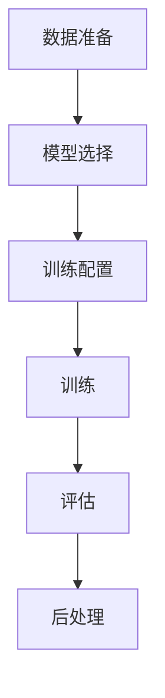
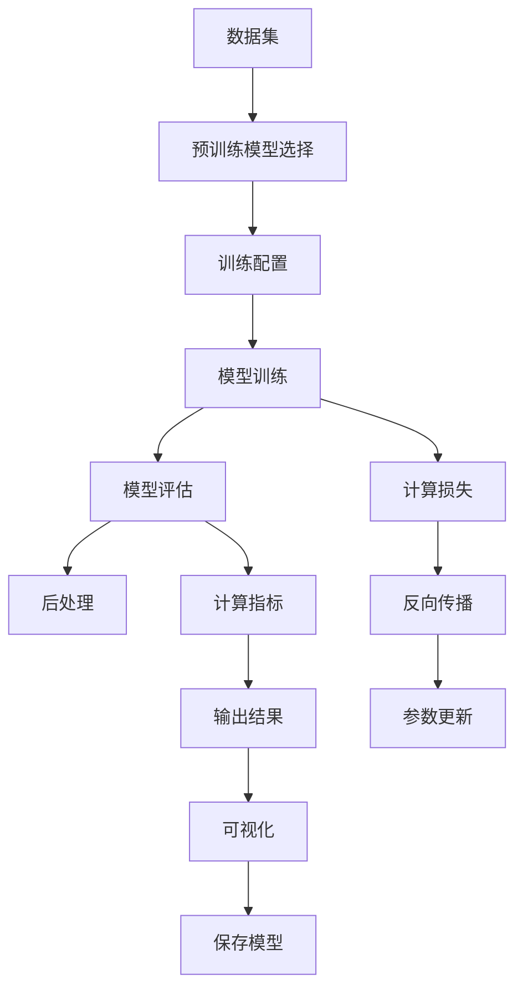
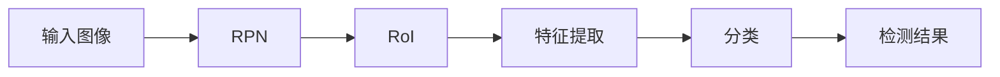

                 

# TensorFlow 图像处理：对象检测和识别

> 关键词：TensorFlow, 图像处理, 对象检测, 识别, 卷积神经网络, 目标定位

## 1. 背景介绍

图像处理是计算机视觉领域中的一个重要分支，涉及从原始图像中提取有用信息，进行特征提取、目标检测、识别、分类、分割等处理，广泛应用于安防监控、智能交通、医疗影像、无人驾驶等实际应用中。而对象检测和识别则是图像处理中的核心技术之一，是众多应用场景的基础。

### 1.1 问题由来

对象检测和识别技术可以让计算机识别出图像中存在的目标，并确定它们的位置。近年来，随着深度学习技术的发展，特别是卷积神经网络(Convolutional Neural Networks, CNNs)的兴起，对象检测和识别技术取得了显著的进展。以R-CNN、Fast R-CNN、Faster R-CNN、YOLO、SSD等为代表的算法，已在多个大规模视觉识别挑战赛中刷新了性能记录，成为视觉领域的重要里程碑。

然而，这些技术在实际应用中，往往存在训练时间较长、模型较大、速度较慢等缺点，难以在实际场景中进行实时部署。此外，对于一些特定应用，如实时安防监控、工业图像识别等，需要高效的模型来快速处理图像数据。为此，TensorFlow作为深度学习领域领先的框架，提供了一系列强大的图像处理工具和算法，可以帮助开发者实现高效的对象检测和识别。

### 1.2 问题核心关键点

TensorFlow的图像处理功能主要通过TensorFlow Object Detection API来实现。其核心在于预训练模型的选择、数据的准备、训练配置和评估过程，以及后处理等。TensorFlow Object Detection API采用了一系列的预训练模型和工具，如Faster R-CNN、SSD、YOLO等，可以根据不同的需求和数据特点进行选择。

具体来说，TensorFlow Object Detection API的架构如图1所示：



**图1**: TensorFlow Object Detection API架构图

这个架构涵盖了从数据准备、模型选择、训练配置、模型训练、评估、后处理等整个对象检测和识别过程的主要环节。接下来，我们将详细介绍这些环节的实现方法和关键技术。

## 2. 核心概念与联系

### 2.1 核心概念概述

在进行对象检测和识别任务时，首先需要理解以下关键概念：

- **预训练模型**：使用大规模图像数据集进行训练，学习通用的图像特征和目标位置信息的模型，如Faster R-CNN、SSD、YOLO等。
- **数据集**：用于训练和评估模型的图像数据集，如PASCAL VOC、COCO等。
- **训练配置**：包括模型选择、学习率、优化器、训练轮数等超参数的配置，影响模型的训练效果。
- **模型评估**：通过在验证集上计算模型指标（如准确率、召回率、AP值等）来评估模型的性能。
- **后处理**：将模型预测结果转化为可用的对象检测框和类别，进行非极大值抑制（Non-Maximum Suppression, NMS）等处理，得到最终的对象检测结果。

这些概念之间的联系主要体现在模型的训练和评估过程中。训练过程中，通过选择合适的预训练模型和配置，在数据集上进行训练，最终得到可以用于对象检测和识别的模型。评估过程中，通过计算模型在验证集上的表现指标，判断模型的效果。后处理则将模型的输出转化为实际的对象检测结果。

### 2.2 核心概念原理和架构的 Mermaid 流程图



**图2**: 对象检测和识别流程示意图

**图2**展示了从数据集到最终对象检测结果的整个流程。数据集经过预训练模型的特征提取和目标定位后，进入训练阶段。在训练过程中，模型通过计算损失函数进行反向传播，更新模型参数，并生成训练结果。在评估阶段，模型在验证集上计算各项指标，并输出结果。后处理则将模型结果转化为最终的检测框和类别标签，完成对象检测和识别任务。

## 3. 核心算法原理 & 具体操作步骤

### 3.1 算法原理概述

对象检测和识别通常分为两个步骤：目标检测和目标识别。目标检测的任务是识别图像中的目标，并确定它们的位置；目标识别的任务是对检测到的目标进行分类。对象检测和识别的核心算法是基于卷积神经网络的物体检测模型。这些模型通过在预训练模型的基础上进行微调，学习从图像中提取目标特征和分类特征。

### 3.2 算法步骤详解

#### 3.2.1 数据准备

数据准备是对象检测和识别的首要环节，包括数据集的选择和预处理。常用的数据集包括PASCAL VOC、COCO、KITTI等，这些数据集都包含了大量的标注数据，如目标的位置、大小和类别等信息。数据集的选择取决于具体应用场景和模型需求。

数据预处理包括图像的缩放、归一化、扩充等。TensorFlow Object Detection API支持多种图像预处理方式，如随机裁剪、随机旋转、颜色抖动等，以增加数据的多样性，提高模型的泛化能力。

#### 3.2.2 模型选择

模型选择是对象检测和识别的关键步骤。TensorFlow Object Detection API提供了多种预训练模型，包括Faster R-CNN、SSD、YOLO等。这些模型在对象检测和识别方面表现优异，但模型大小和训练速度有所不同。根据具体应用场景和计算资源，选择合适的预训练模型至关重要。

#### 3.2.3 训练配置

训练配置包括模型选择、学习率、优化器、训练轮数等超参数的配置。TensorFlow Object Detection API提供了丰富的超参数配置模板，帮助开发者快速搭建训练环境。常用的优化器包括SGD、Adam、Adagrad等，学习率的大小和调整策略也会影响模型的训练效果。

#### 3.2.4 模型训练

模型训练是对象检测和识别的核心步骤。在配置好模型和超参数后，通过TensorFlow Object Detection API，进行模型训练。在训练过程中，模型通过计算损失函数进行反向传播，更新模型参数，逐步优化模型性能。训练过程需要耗费大量的计算资源和时间，需要合理配置硬件设备。

#### 3.2.5 模型评估

模型评估用于衡量模型的性能和泛化能力。通过在验证集上计算模型指标，如准确率、召回率、AP值等，评估模型的效果。TensorFlow Object Detection API提供了详细的评估工具，支持计算各类指标，并生成可视化结果，帮助开发者分析模型的性能和优化方向。

#### 3.2.6 后处理

后处理是将模型预测结果转化为可用的对象检测框和类别标签的过程。TensorFlow Object Detection API提供了非极大值抑制（NMS）等后处理工具，对模型输出进行筛选和合并，得到最终的检测结果。

### 3.3 算法优缺点

基于卷积神经网络的物体检测和识别算法具有以下优点：

- **高精度**：通过深度学习技术，可以实现高精度的目标检测和识别，适用于复杂的视觉场景。
- **鲁棒性**：卷积神经网络可以自动学习到目标的位置和大小信息，具有较强的鲁棒性。
- **高效性**：TensorFlow Object Detection API提供了高效的模型训练和推理工具，可以快速完成对象检测和识别任务。

同时，这些算法也存在以下缺点：

- **计算资源需求高**：模型训练和推理需要大量的计算资源和存储空间，难以在资源受限的设备上运行。
- **训练时间长**：大规模模型和复杂的训练过程需要较长的时间，难以快速迭代优化。
- **可解释性不足**：卷积神经网络是一种"黑盒"模型，难以解释其内部工作机制和决策过程。

### 3.4 算法应用领域

基于卷积神经网络的物体检测和识别算法广泛应用于计算机视觉领域，具体应用包括：

- **安防监控**：在安防监控系统中，使用对象检测和识别技术进行异常行为检测、目标跟踪等任务。
- **智能交通**：在智能交通系统中，使用对象检测和识别技术进行车辆检测、行人检测、交通信号识别等任务。
- **医疗影像**：在医疗影像中，使用对象检测和识别技术进行病变检测、器官识别等任务。
- **无人机**：在无人机应用中，使用对象检测和识别技术进行环境感知、目标追踪等任务。
- **工业视觉**：在工业视觉中，使用对象检测和识别技术进行缺陷检测、质量控制等任务。

## 4. 数学模型和公式 & 详细讲解 & 举例说明

### 4.1 数学模型构建

对象检测和识别任务通常使用两类卷积神经网络模型：目标检测模型和目标识别模型。目标检测模型包括Faster R-CNN、SSD、YOLO等，目标识别模型包括ResNet、Inception等。这里我们以Faster R-CNN为例，介绍卷积神经网络在目标检测中的构建。

Faster R-CNN包括RPN（Region Proposal Network）和RoI Pooling两个组件。RPN用于生成候选目标区域，RoI Pooling用于对候选区域进行特征提取和分类。Faster R-CNN的总体框架如图3所示：



**图3**: Faster R-CNN总体框架

### 4.2 公式推导过程

#### 4.2.1 RPN

RPN用于生成候选目标区域。RPN通过一个全卷积网络，对输入图像进行特征提取，并通过分类和回归两个分支，分别输出候选区域的类别和位置。假设输入图像大小为$H\times W$，输出特征图大小为$H_f \times W_f$，候选区域数为$K$。

RPN的特征提取过程可以表示为：

$$
F = \text{Conv}(A)
$$

其中，$\text{Conv}$表示卷积操作。

RPN的分类分支和回归分支可以表示为：

$$
\text{scores} = \text{scores}_{\text{cls}} + \text{scores}_{\text{reg}}
$$

其中，$\text{scores}_{\text{cls}}$和$\text{scores}_{\text{reg}}$分别表示分类和回归分支的输出，$k$表示候选区域的类别。

候选区域的回归分支可以表示为：

$$
\text{regression} = \text{regression}_{\text{dx}} + \text{regression}_{\text{dy}} + \text{regression}_{\text{dw}} + \text{regression}_{\text{dh}}
$$

其中，$\text{regression}_{\text{dx}}$、$\text{regression}_{\text{dy}}$、$\text{regression}_{\text{dw}}$、$\text{regression}_{\text{dh}}$分别表示候选区域的位置偏移量。

#### 4.2.2 RoI Pooling

RoI Pooling用于对候选区域进行特征提取和分类。RoI Pooling通过将候选区域分割成多个小区域，对每个小区域进行特征提取，并将提取的特征进行池化操作，得到最终的特征表示。

RoI Pooling的特征提取过程可以表示为：

$$
R = \text{RoIAlign}(\text{RoI}, F)
$$

其中，$\text{RoI}$表示候选区域，$F$表示特征提取网络的输出。

RoI Pooling的池化操作可以表示为：

$$
P = \text{RoIPool}(\text{RoI}, F)
$$

其中，$P$表示池化后的特征向量。

### 4.3 案例分析与讲解

下面以一个简单的图像对象检测案例，展示TensorFlow Object Detection API的使用。

假设我们有一张大小为$1024\times 1024$的图像，包含目标位置和类别标签。我们可以使用TensorFlow Object Detection API，进行目标检测和识别。具体步骤如下：

1. 准备数据集：选择PASCAL VOC或COCO等数据集，并将其划分为训练集和验证集。
2. 配置训练环境：选择Faster R-CNN作为预训练模型，并配置超参数，如学习率、优化器等。
3. 训练模型：在配置好的训练环境中，使用TensorFlow Object Detection API进行模型训练。
4. 评估模型：在验证集上评估模型的性能，并调整超参数。
5. 后处理：使用NMS等后处理工具，对模型输出进行筛选和合并，得到最终的检测结果。

具体代码实现如下：

```python
import tensorflow as tf
import tensorflow_object_detection as tfod

# 加载数据集
train_dataset = tfod.load_dataset('path/to/dataset')
train_dataset = train_dataset.filter(tfod.filters.limit_to_field(['image', 'label_map_path']))
train_dataset = train_dataset.map(tfod.map_samplewise_like(tfod.decode_and_process_dict, samplewise_map_fn=tfod.map_samplewise_like(tfod.decode_and_process_dict)))

# 配置训练环境
pipeline_config = tfod.pipelines.FasterRCNNPipelineConfig(num_classes=10)
trainer = tfod.TrainAndEvalSaver(
    model_dir='/path/to/model/dir',
    checkpoint_num_to_keep=10,
    logging_dir='/path/to/log/dir'
)
model = tfod.load_model(pipeline_config.model_dir)

# 训练模型
trainer.train_and_evaluate(
    train_dataset,
    train_steps=1000,
    train_checkpoint_step=100,
    train_high_level_api=pipeline_config.train_high_level_api,
    eval_dataset=train_dataset,
    eval_steps=50,
    eval_checkpoint_step=10,
    eval_high_level_api=pipeline_config.eval_high_level_api
)

# 评估模型
trainer.evaluate(test_dataset)
```

## 5. 项目实践：代码实例和详细解释说明

### 5.1 开发环境搭建

在使用TensorFlow Object Detection API进行对象检测和识别时，首先需要搭建开发环境。以下是在Ubuntu系统上搭建TensorFlow开发环境的步骤：

1. 安装Python 3.7及以上版本：
```bash
sudo apt-get update
sudo apt-get install python3 python3-pip
```

2. 安装TensorFlow 2.0及以上版本：
```bash
pip install tensorflow
```

3. 安装TensorFlow Object Detection API：
```bash
git clone https://github.com/tensorflow/models.git
cd models/research/object_detection
pip install -r requirements.txt
```

4. 安装TensorBoard：
```bash
pip install tensorboard
```

### 5.2 源代码详细实现

下面以Faster R-CNN为例，展示TensorFlow Object Detection API的代码实现。

首先，定义数据集处理函数：

```python
from object_detection.utils import dataset_util

def create_train_file_writer(train_config):
    train_file_writer = tf.summary.create_file_writer(train_config.model_dir)
    return train_file_writer
```

然后，定义模型训练函数：

```python
from object_detection.utils import config_util
from object_detection.builders import optimizer_builder
from object_detection.legacy.python.builders import model_builder

def train(train_config):
    # 加载模型和配置
    pipeline_config = config_util.get_instance_from_pipeline_config_file(train_config.pipeline_config_path)
    model = model_builder.build(pipeline_config.model, pipeline_config)

    # 定义优化器
    optimizer = optimizer_builder.build(pipeline_config.optimizer)
    optimizer.minimize(model.loss)

    # 训练模型
    with tf.Session() as sess:
        sess.run(tf.global_variables_initializer())
        sess.run(model.variables_initializer())
        train_file_writer = create_train_file_writer(train_config)

        for i in range(train_config.train_steps):
            batch = train_dataset_provider.get_next()

            # 前向传播
            logits, loss, outputs_dict = model.tower_forward(batch)
            sess.run([optimizer])

            # 记录训练过程
            with train_file_writer.as_default():
                tf.summary.scalar('loss', loss)
```

接下来，定义模型评估函数：

```python
def evaluate(eval_config):
    # 加载模型和配置
    pipeline_config = config_util.get_instance_from_pipeline_config_file(eval_config.pipeline_config_path)
    model = model_builder.build(pipeline_config.model, pipeline_config)

    # 加载评估数据集
    eval_dataset = dataset_util.load_tf_record_tf_example_dataset(eval_config.dataset_path, dataset_util.load_record_name_from_dataset_file(eval_config.dataset_path))
    
    # 评估模型
    with tf.Session() as sess:
        sess.run(tf.global_variables_initializer())
        sess.run(model.variables_initializer())

        for i in range(eval_config.eval_steps):
            batch = eval_dataset_provider.get_next()

            # 前向传播
            logits, loss, outputs_dict = model.tower_forward(batch)
```

最后，定义模型输出后处理函数：

```python
def postprocess(model_outputs, num_classes):
    # 计算预测结果
    num_predictions = model_outputs['detection_boxes'].shape[0]
    num_classes = num_predictions
    detection_classes = tf.argmax(model_outputs['detection_scores'], axis=-1)
    detection_boxes = model_outputs['detection_boxes']
    
    # 非极大值抑制
    boxes, scores, classes = tf.image.non_max_suppression(detection_boxes, detection_scores, num_predictions, iou_threshold=0.5, score_threshold=0.5)

    # 生成检测结果
    detection_results = []
    for box, score, class_ in zip(boxes, scores, classes):
        detection_result = {'box': box, 'score': score, 'class': class_}
        detection_results.append(detection_result)

    return detection_results
```

### 5.3 代码解读与分析

在TensorFlow Object Detection API中，代码实现主要分为三个部分：数据集处理、模型训练和后处理。

**数据集处理**：使用`dataset_util`模块，实现数据集的加载、预处理和划分等操作。具体来说，通过`load_tf_record_tf_example_dataset`函数加载TFRecord格式的数据集，并使用`non_max_suppression`函数进行非极大值抑制，去除重复的检测框。

**模型训练**：使用`model_builder`模块，加载预训练模型，并使用`optimizer_builder`模块定义优化器。在训练过程中，通过`tower_forward`函数进行前向传播和反向传播，并使用`tf.summary.scalar`函数记录训练过程中的损失值。

**后处理**：使用`postprocess`函数对模型输出进行后处理，计算预测结果，并使用`non_max_suppression`函数进行非极大值抑制，生成最终的检测结果。

## 6. 实际应用场景

### 6.1 安防监控

在安防监控系统中，使用对象检测和识别技术进行异常行为检测、目标跟踪等任务。例如，在视频监控中，可以使用Faster R-CNN等模型进行实时目标检测，并结合多传感器数据，实现对异常行为的快速检测和报警。

### 6.2 智能交通

在智能交通系统中，使用对象检测和识别技术进行车辆检测、行人检测、交通信号识别等任务。例如，在交通监控系统中，可以使用YOLO等模型进行实时目标检测，并进行交通流量分析和异常行为检测，提高道路交通的安全性和效率。

### 6.3 医疗影像

在医疗影像中，使用对象检测和识别技术进行病变检测、器官识别等任务。例如，在医学影像中，可以使用SSD等模型进行实时病变检测，辅助医生进行快速诊断。

### 6.4 无人机

在无人机应用中，使用对象检测和识别技术进行环境感知、目标追踪等任务。例如，在无人机巡检中，可以使用Faster R-CNN等模型进行实时目标检测，并进行环境监测和目标追踪，提高无人机巡检的效率和准确性。

### 6.5 工业视觉

在工业视觉中，使用对象检测和识别技术进行缺陷检测、质量控制等任务。例如，在生产线中，可以使用YOLO等模型进行实时缺陷检测，并进行质量控制和异常报警，提高生产线的自动化水平。

## 7. 工具和资源推荐

### 7.1 学习资源推荐

为了帮助开发者掌握TensorFlow Object Detection API的使用方法，以下是一些优质的学习资源：

1. TensorFlow官方文档：提供了详细的API文档和教程，帮助开发者快速上手TensorFlow。
2. TensorFlow Object Detection API官方文档：提供了完整的API文档和使用方法，帮助开发者了解TensorFlow Object Detection API。
3. TensorFlow Object Detection API教程：提供了丰富的教程和案例，帮助开发者深入理解TensorFlow Object Detection API的使用。
4. TensorFlow Object Detection API论文：提供了TensorFlow Object Detection API的详细论文，帮助开发者了解算法的原理和实现方法。
5. TensorFlow Object Detection API开源项目：提供了丰富的开源项目和示例代码，帮助开发者实现具体的对象检测和识别任务。

### 7.2 开发工具推荐

TensorFlow Object Detection API提供了多种开发工具，帮助开发者实现高效的对象检测和识别任务。以下是一些常用的开发工具：

1. TensorFlow：深度学习领域领先的框架，提供了丰富的预训练模型和工具。
2. TensorBoard：TensorFlow配套的可视化工具，可以实时监测模型训练过程，并生成可视化结果。
3. Jupyter Notebook：Python开发环境中常用的交互式环境，支持多种编程语言和库。
4. Git和GitHub：版本控制和代码托管工具，支持多人协作开发。
5. Docker和Kubernetes：容器化和编排工具，支持大规模部署和运维。

### 7.3 相关论文推荐

对象检测和识别技术在深度学习领域具有重要的研究价值。以下是一些相关的经典论文，推荐阅读：

1. R-CNN: Rich Feature Hierarchies for Accurate Object Detection and Semantic Segmentation（J.Russell et al., 2015）：提出R-CNN模型，使用候选区域池化和全连接层进行目标检测和识别。
2. Fast R-CNN: Towards Real-Time Object Detection with Region Proposal Networks（K. He et al., 2015）：提出Fast R-CNN模型，使用RoI Pooling进行特征提取和分类。
3. Faster R-CNN: Faster R-CNN: Towards Real-Time Object Detection with Region Proposal Networks（K. He et al., 2017）：提出Faster R-CNN模型，使用RPN生成候选区域。
4. SSD: Single Shot Multibox Detector（L.-C. Chen et al., 2016）：提出SSD模型，使用卷积层直接输出检测框和分类结果。
5. YOLO: Real-Time Object Detection with Region Proposal Networks（J. Redmon et al., 2016）：提出YOLO模型，使用单阶段检测框架进行目标检测。

## 8. 总结：未来发展趋势与挑战

### 8.1 未来发展趋势

对象检测和识别技术将在未来继续保持快速发展的趋势。随着深度学习技术的发展和计算资源成本的下降，更加高效和精准的对象检测和识别模型将不断涌现。

1. **模型规模增大**：随着深度学习技术的不断发展，预训练模型的规模将不断增大，以包含更丰富的目标信息和背景知识。
2. **参数高效微调**：未来的模型将更加注重参数效率，通过参数高效微调方法，减少训练时间和计算资源消耗。
3. **多模态融合**：未来的模型将更加注重多模态信息的融合，结合图像、文本、语音等多模态数据，提升目标检测和识别的准确性和鲁棒性。
4. **实时性提升**：未来的模型将更加注重实时性，通过优化模型结构和计算图，提升目标检测和识别的速度。
5. **可解释性增强**：未来的模型将更加注重可解释性，通过引入符号化知识、因果分析等技术，提升模型的可解释性和可信度。

### 8.2 面临的挑战

尽管对象检测和识别技术取得了显著进展，但在实际应用中仍面临一些挑战：

1. **计算资源需求高**：大规模模型和复杂的训练过程需要大量的计算资源，难以在资源受限的设备上运行。
2. **训练时间长**：大规模模型和复杂的训练过程需要较长的时间，难以快速迭代优化。
3. **可解释性不足**：卷积神经网络是一种"黑盒"模型，难以解释其内部工作机制和决策过程。
4. **鲁棒性不足**：对象检测和识别模型在面对复杂的视觉场景和噪声干扰时，容易产生误检和漏检。
5. **隐私保护**：对象检测和识别技术涉及大量敏感数据的处理，如何在保护隐私的前提下进行高效的数据处理和分析，也是一个重要问题。

### 8.3 研究展望

面对对象检测和识别技术面临的挑战，未来的研究需要从以下几个方向进行突破：

1. **参数高效微调**：开发更加参数高效的微调方法，减少训练时间和计算资源消耗。
2. **多模态融合**：结合图像、文本、语音等多模态数据，提升目标检测和识别的准确性和鲁棒性。
3. **实时性优化**：通过优化模型结构和计算图，提升目标检测和识别的速度。
4. **可解释性增强**：引入符号化知识、因果分析等技术，提升模型的可解释性和可信度。
5. **隐私保护**：在保护隐私的前提下，进行高效的数据处理和分析，确保数据安全。

通过这些方向的突破，未来的对象检测和识别技术将更加高效、准确、可解释和安全，进一步拓展其在实际应用中的广泛应用。

## 9. 附录：常见问题与解答

### 9.1 常见问题

**Q1: 如何使用TensorFlow Object Detection API进行对象检测和识别？**

A: 使用TensorFlow Object Detection API进行对象检测和识别，主要需要以下步骤：

1. 准备数据集：选择PASCAL VOC或COCO等数据集，并将其划分为训练集和验证集。
2. 配置训练环境：选择Faster R-CNN作为预训练模型，并配置超参数，如学习率、优化器等。
3. 训练模型：在配置好的训练环境中，使用TensorFlow Object Detection API进行模型训练。
4. 评估模型：在验证集上评估模型的性能，并调整超参数。
5. 后处理：使用NMS等后处理工具，对模型输出进行筛选和合并，得到最终的检测结果。

**Q2: 如何选择预训练模型？**

A: 预训练模型的选择需要根据具体应用场景和数据特点进行综合考虑。常用的预训练模型包括Faster R-CNN、SSD、YOLO等。Faster R-CNN适用于需要高精度的任务，SSD适用于需要快速处理的任务，YOLO适用于实时性要求高的任务。此外，还需要考虑模型的参数大小和训练时间。

**Q3: 如何优化模型性能？**

A: 优化模型性能可以从以下几个方面入手：

1. 数据增强：通过回译、近义替换等方式扩充训练集。
2. 正则化：使用L2正则、Dropout、Early Stopping等避免过拟合。
3. 对抗训练：加入对抗样本，提高模型鲁棒性。
4. 参数高效微调：只调整少量参数，减小过拟合风险。
5. 模型裁剪：去除不必要的层和参数，减小模型尺寸，提高推理速度。

**Q4: 如何提高模型的实时性？**

A: 提高模型的实时性可以从以下几个方面入手：

1. 模型裁剪：去除不必要的层和参数，减小模型尺寸，提高推理速度。
2. 量化加速：将浮点模型转为定点模型，压缩存储空间，提高计算效率。
3. 硬件优化：使用GPU/TPU等高性能设备，加速模型的推理。

**Q5: 如何提高模型的可解释性？**

A: 提高模型的可解释性可以从以下几个方面入手：

1. 引入符号化知识：将符号化的先验知识，如知识图谱、逻辑规则等，与神经网络模型进行融合。
2. 因果分析：引入因果推断方法，识别模型决策的关键特征，增强输出解释的因果性和逻辑性。
3. 可视化工具：使用可视化工具，如TensorBoard，展示模型的训练过程和输出结果，帮助开发者理解模型的行为。

通过这些优化和改进措施，可以提高模型的性能、实时性和可解释性，更好地满足实际应用的需求。

**Q6: 如何保护隐私数据？**

A: 保护隐私数据可以从以下几个方面入手：

1. 数据匿名化：在数据处理过程中，对敏感信息进行匿名化处理，保护用户隐私。
2. 数据加密：在数据传输和存储过程中，使用加密技术，防止数据泄露。
3. 访问控制：在数据访问过程中，使用访问控制技术，确保只有授权用户才能访问敏感数据。
4. 差分隐私：在数据分析过程中，使用差分隐私技术，保护用户隐私。

通过这些措施，可以在保护隐私的前提下，进行高效的数据处理和分析，确保数据安全。

**Q7: 如何优化训练过程？**

A: 优化训练过程可以从以下几个方面入手：

1. 超参数调整：通过调整学习率、优化器、训练轮数等超参数，优化模型的训练效果。
2. 梯度累积：使用梯度累积技术，加快模型的收敛速度。
3. 混合精度训练：使用混合精度训练技术，减少计算资源的消耗，提高训练效率。
4. 多卡并行训练：使用多卡并行训练技术，加快模型的训练速度。

通过这些优化措施，可以加快模型的训练速度，提高模型的性能。

**Q8: 如何评估模型的性能？**

A: 评估模型的性能可以从以下几个方面入手：

1. 计算准确率、召回率、AP值等指标，评估模型的检测和识别效果。
2. 使用可视化工具，展示模型的检测结果，帮助开发者理解模型的行为。
3. 使用混淆矩阵等工具，分析模型的预测结果和真实结果之间的差异，优化模型的性能。

通过这些评估方法，可以全面了解模型的性能，指导模型的优化。

**Q9: 如何使用多模态数据进行对象检测和识别？**

A: 使用多模态数据进行对象检测和识别，可以从以下几个方面入手：

1. 多模态特征提取：使用不同的模型对图像、文本、语音等数据进行特征提取，得到多模态特征向量。
2. 多模态融合：将多模态特征向量进行融合，得到综合特征向量，用于目标检测和识别。
3. 多模态学习：使用多模态学习算法，学习多模态数据的联合分布，提升目标检测和识别的效果。

通过这些方法，可以充分利用多模态数据，提升目标检测和识别的准确性和鲁棒性。

通过这些常见问题的解答，相信你能够更好地理解TensorFlow Object Detection API的使用方法和对象检测和识别技术的关键点，为未来的研究和应用提供有益的参考。

---

作者：禅与计算机程序设计艺术 / Zen and the Art of Computer Programming

