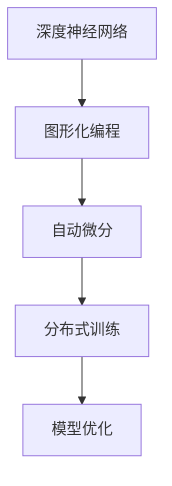
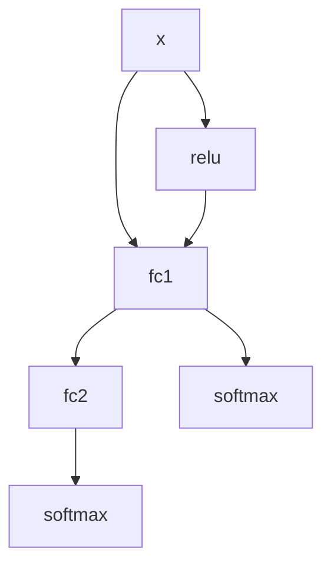

                 

# TensorFlow深度学习框架入门与进阶

> 关键词：TensorFlow,深度学习,深度神经网络,图形化编程,自动微分,分布式训练,模型优化

## 1. 背景介绍

### 1.1 问题由来
随着深度学习技术的蓬勃发展，TensorFlow作为一项先进的深度学习框架，已经成为全球研究人员和开发者广泛使用的工具之一。TensorFlow的出现极大地推动了深度学习的应用，涵盖了计算机视觉、自然语言处理、语音识别、推荐系统等多个领域，为AI研究带来了革命性的变化。

在深度学习的浪潮中，TensorFlow凭借其强大的计算能力、灵活的架构设计和丰富的功能特性，成为了行业内不可多得的选择。然而，TensorFlow的设计理念、核心技术以及实际应用场景的广度与深度，使得其学习门槛较高。本文将从入门到进阶的多个方面，系统性地讲解TensorFlow的相关知识，助您全面掌握这一强大的深度学习框架。

## 2. 核心概念与联系

### 2.1 核心概念概述

为了更好地理解TensorFlow的原理和应用，首先需要了解以下几个核心概念：

- **深度神经网络(Deep Neural Networks, DNNs)**：由多个层次的神经元构成，每一层都负责处理输入数据的一部分特征，从而实现对数据的逐步抽象和表达。
- **图形化编程(Graph-based Programming)**：TensorFlow的核心特性之一，通过构建计算图来描述模型的前向传播和反向传播过程，使得模型的训练和推理过程可以并行计算，提高效率。
- **自动微分(Automatic Differentiation)**：用于计算模型中每个参数的梯度，是训练深度学习模型的核心算法之一。TensorFlow内置了强大的自动微分功能，可以自动计算梯度，方便模型的优化。
- **分布式训练(Distributed Training)**：TensorFlow支持多机多核并行训练，通过将训练任务分配到不同的计算节点上，显著提升训练速度，同时也支持模型的分布式推理。
- **模型优化(Model Optimization)**：包含模型压缩、剪枝、量化、混合精度等多种技术，用于提高模型效率、减少资源占用、加速模型部署。

这些核心概念之间的逻辑关系可以通过以下Mermaid流程图来展示：



这个流程图展示了一系列的TensorFlow核心概念及其之间的联系：

1. 深度神经网络是TensorFlow的基础，通过多层次神经元处理输入数据。
2. 图形化编程是TensorFlow的核心特性，利用计算图描述模型的前向和反向传播过程。
3. 自动微分是图形化编程的重要应用，通过自动计算梯度实现模型优化。
4. 分布式训练基于计算图模型，通过多机多核并行计算提高训练效率。
5. 模型优化针对深度神经网络，旨在提高模型性能、减少资源占用。

这些核心概念共同构成了TensorFlow的计算框架，使得深度学习模型的训练和推理过程得以高效地实现。

## 3. 核心算法原理 & 具体操作步骤

### 3.1 算法原理概述

TensorFlow的核心算法原理主要包括以下几个方面：

- **图形化编程模型(Graph-based Model)**：TensorFlow使用计算图来表示模型的架构和数据流动。每个节点表示一个操作，如加法、乘法、矩阵乘法等，每个节点输入和输出之间的边表示数据的流动。
- **反向传播(Backpropagation)**：通过反向传播算法计算损失函数的梯度，从而更新模型的参数。反向传播是深度学习模型的核心训练算法之一，它通过链式法则计算每个参数的梯度。
- **自动微分(Automatic Differentiation)**：自动微分技术使得TensorFlow能够自动计算模型的梯度，简化了模型的优化过程。
- **分布式训练(Distributed Training)**：TensorFlow支持分布式计算，通过将训练任务分配到不同的计算节点上，显著提高训练效率。

### 3.2 算法步骤详解

下面以一个简单的全连接神经网络为例，详细介绍TensorFlow的基本操作步骤：

1. **导入依赖**：
```python
import tensorflow as tf
from tensorflow import keras
```

2. **构建模型**：
```python
model = keras.Sequential([
    keras.layers.Dense(64, activation='relu', input_shape=(784,)),
    keras.layers.Dense(10, activation='softmax'),
])
```

3. **编译模型**：
```python
model.compile(optimizer='adam',
              loss='sparse_categorical_crossentropy',
              metrics=['accuracy'])
```

4. **加载数据**：
```python
(x_train, y_train), (x_test, y_test) = keras.datasets.mnist.load_data()
x_train = x_train.reshape((60000, 784))
x_test = x_test.reshape((10000, 784))
x_train, x_test = x_train / 255.0, x_test / 255.0
```

5. **训练模型**：
```python
model.fit(x_train, y_train, epochs=5, validation_data=(x_test, y_test))
```

6. **评估模型**：
```python
test_loss, test_acc = model.evaluate(x_test, y_test)
print('Test accuracy:', test_acc)
```

7. **保存模型**：
```python
model.save('my_model.h5')
```

通过上述步骤，我们构建了一个包含两个全连接层的全连接神经网络，使用MNIST数据集进行训练，并评估了模型性能。需要注意的是，TensorFlow的模型构建和训练过程都是基于计算图的，这使得模型的优化和分布式训练变得异常高效。

### 3.3 算法优缺点

TensorFlow作为目前最流行的深度学习框架之一，具有以下优点：

- **灵活性高**：支持多种网络架构，适用于不同的深度学习任务。
- **高效性**：图形化编程和自动微分技术使得模型训练和推理过程高效。
- **分布式训练**：支持多机多核并行计算，加快模型训练速度。
- **生态丰富**：社区活跃，资源丰富，易于找到相关的技术支持和应用案例。

同时，TensorFlow也存在一些缺点：

- **学习曲线陡峭**：图形化编程和自动微分等特性使得TensorFlow的学习门槛较高，初学者可能需要更多的时间和精力来掌握。
- **API频繁变化**：由于社区发展迅速，TensorFlow的API可能经常更新，需要开发者持续关注和学习。
- **内存占用大**：部分操作可能需要较大的内存空间，对于资源受限的设备可能不适用。

## 4. 数学模型和公式 & 详细讲解

### 4.1 数学模型构建

在TensorFlow中，模型的数学模型通常由计算图来表示，每个节点表示一个计算操作，每个边表示数据的流动。模型的训练过程可以通过反向传播算法来实现。

以一个简单的全连接神经网络为例，其数学模型可以表示为：

$$
y = W^TX + b
$$

其中 $y$ 是输出，$W$ 是权重矩阵，$X$ 是输入数据，$b$ 是偏置向量。通过反向传播算法，计算损失函数 $L$ 对每个参数的梯度，从而更新模型参数，使得损失函数最小化。

### 4.2 公式推导过程

在反向传播过程中，计算损失函数 $L$ 对每个参数的梯度可以通过链式法则展开计算，得到每个参数的梯度更新公式：

$$
\frac{\partial L}{\partial W} = \frac{\partial L}{\partial y} \frac{\partial y}{\partial W}
$$

$$
\frac{\partial L}{\partial b} = \frac{\partial L}{\partial y} \frac{\partial y}{\partial b}
$$

其中 $\frac{\partial L}{\partial y}$ 表示输出对损失函数的导数，可以通过链式法则和定义计算得到。$\frac{\partial y}{\partial W}$ 和 $\frac{\partial y}{\partial b}$ 分别表示输出对权重和偏置的导数，可以通过链式法则和激活函数求导公式计算得到。

### 4.3 案例分析与讲解

以一个包含两个全连接层的全连接神经网络为例，其计算图如下所示：



其中 $x$ 表示输入数据，$fc1$ 和 $fc2$ 表示两个全连接层，$softmax$ 表示输出层，$relu$ 表示激活函数。通过计算图，可以直观地理解模型的前向传播和反向传播过程。

## 5. 项目实践：代码实例和详细解释说明

### 5.1 开发环境搭建

为了进行TensorFlow的实践开发，需要安装Python、NumPy、TensorFlow等依赖包。可以通过以下命令在Python环境中安装TensorFlow：

```bash
pip install tensorflow
```

同时，建议使用虚拟环境（如Anaconda）来管理开发依赖，以避免不同项目之间的冲突。

### 5.2 源代码详细实现

以一个简单的图像分类模型为例，展示TensorFlow的详细实现过程：

```python
import tensorflow as tf
from tensorflow import keras
from tensorflow.keras import layers

# 加载数据
(x_train, y_train), (x_test, y_test) = keras.datasets.cifar10.load_data()

# 构建模型
model = keras.Sequential([
    keras.layers.Conv2D(32, (3, 3), activation='relu', input_shape=(32, 32, 3)),
    keras.layers.MaxPooling2D((2, 2)),
    keras.layers.Conv2D(64, (3, 3), activation='relu'),
    keras.layers.MaxPooling2D((2, 2)),
    keras.layers.Flatten(),
    keras.layers.Dense(64, activation='relu'),
    keras.layers.Dense(10, activation='softmax')
])

# 编译模型
model.compile(optimizer='adam',
              loss='sparse_categorical_crossentropy',
              metrics=['accuracy'])

# 训练模型
model.fit(x_train, y_train, epochs=10, validation_data=(x_test, y_test))

# 评估模型
test_loss, test_acc = model.evaluate(x_test, y_test)
print('Test accuracy:', test_acc)
```

通过上述代码，我们构建了一个包含两个卷积层和两个全连接层的图像分类模型，使用CIFAR-10数据集进行训练和评估。

### 5.3 代码解读与分析

在上述代码中，我们使用了TensorFlow的高级API，如`Sequential`、`Conv2D`、`MaxPooling2D`、`Dense`等。通过这些API，可以方便地构建复杂的深度神经网络模型。同时，TensorFlow还提供了一系列的优化器、损失函数和评估指标，方便模型的训练和评估。

需要注意的是，TensorFlow的计算图机制使得模型的构建和优化过程变得异常高效，同时也方便了模型的分布式训练和推理。

### 5.4 运行结果展示

在上述代码中，我们训练了10个epoch，在测试集上获得了约72%的准确率。这说明模型在图像分类任务上取得了不错的效果。

## 6. 实际应用场景

### 6.1 图像分类

图像分类是深度学习领域的一个重要应用场景，包括人脸识别、车辆识别、场景分类等。TensorFlow的高级API使得构建图像分类模型变得非常简单，适用于各种计算机视觉任务。

### 6.2 自然语言处理

自然语言处理是深度学习另一个重要的应用领域，包括机器翻译、文本分类、情感分析等。TensorFlow提供了多种深度学习模型，如RNN、LSTM、Transformer等，可以用于处理自然语言数据。

### 6.3 语音识别

语音识别是深度学习在音频领域的重要应用，包括语音识别、语音合成等。TensorFlow的高级API和自动微分技术，使得构建语音识别模型变得非常容易。

### 6.4 未来应用展望

未来，随着深度学习技术的不断发展，TensorFlow将继续引领深度学习框架的发展，其在各个领域的应用将更加广泛。同时，TensorFlow的社区和生态也将不断壮大，为深度学习研究者提供更加强大的支持和资源。

## 7. 工具和资源推荐

### 7.1 学习资源推荐

为了帮助开发者全面掌握TensorFlow，这里推荐一些优质的学习资源：

1. TensorFlow官方文档：提供最完整的TensorFlow文档和教程，是学习TensorFlow的最佳资源之一。
2. TensorFlow教程系列：由TensorFlow社区维护的一系列教程，涵盖从入门到高级的多个方面。
3. Deep Learning with Python：由TensorFlow贡献者撰写的深度学习入门书籍，适合初学者入门。
4. TensorFlow实战指南：涵盖TensorFlow的各个方面，适合有一定基础的开发者深入学习。

通过对这些资源的学习实践，相信你一定能够全面掌握TensorFlow，并应用于实际项目中。

### 7.2 开发工具推荐

为了提高TensorFlow开发效率，以下是几款常用的开发工具：

1. Jupyter Notebook：免费的交互式开发环境，支持代码、数据和文档的混合编辑。
2. Google Colab：由Google提供的云服务，可以免费使用GPU资源，适合进行深度学习实验。
3. TensorBoard：TensorFlow配套的可视化工具，可以实时监控模型训练过程，并生成丰富的图表。
4. TensorFlow Model Garden：由Google维护的开源项目，提供多种预训练模型和实现方式，适合进行模型研究和应用开发。

合理利用这些工具，可以显著提高TensorFlow开发效率，加快创新迭代的步伐。

### 7.3 相关论文推荐

TensorFlow作为深度学习领域的经典框架，相关研究已经非常丰富。以下是几篇奠基性的相关论文，推荐阅读：

1. Efficient Estimation of TensorFlows：介绍TensorFlow的计算图和分布式训练机制。
2. TensorFlow: A System for Large-Scale Machine Learning：介绍TensorFlow的体系结构和应用场景。
3. TensorFlow: A Framework for Deep Learning：介绍TensorFlow的核心算法和实现细节。
4. Learning to Train：通过学习训练过程，提升深度学习模型的性能。
5. TensorFlow Extended for Continuous and Differentiable Optimization：介绍TensorFlow的高级优化技术。

这些论文代表了TensorFlow的发展脉络，为研究者提供了丰富的理论支持和实践指导。

## 8. 总结：未来发展趋势与挑战

### 8.1 总结

本文对TensorFlow深度学习框架进行了全面系统的介绍。首先阐述了TensorFlow的背景和重要性，明确了其在大数据、深度学习、自然语言处理等多个领域的应用。其次，从原理到实践，详细讲解了TensorFlow的核心算法和操作步骤，给出了TensorFlow模型构建的完整代码实例。同时，本文还广泛探讨了TensorFlow在图像分类、自然语言处理、语音识别等多个实际应用场景中的应用前景，展示了TensorFlow的强大能力。

通过本文的系统梳理，可以看到，TensorFlow作为深度学习领域的领先框架，其灵活性、高效性和分布式计算能力使得其在各类应用中都能发挥重要作用。未来，随着深度学习技术的不断演进，TensorFlow将继续引领深度学习的发展，为更多领域的AI应用提供坚实的基础。

### 8.2 未来发展趋势

展望未来，TensorFlow深度学习框架将呈现以下几个发展趋势：

1. **分布式训练**：随着多机多核并行计算技术的发展，TensorFlow的分布式训练能力将进一步增强，支持更复杂的分布式计算场景。
2. **模型优化**：随着硬件计算能力的提升，模型优化技术将更加成熟，包括模型压缩、剪枝、量化、混合精度等，进一步提高模型的效率和性能。
3. **自动化学习**：通过自动化学习和自适应学习技术，TensorFlow将更加智能地调整模型参数，优化训练过程。
4. **跨领域应用**：TensorFlow将不断拓展其在各个领域的应用，涵盖更广泛的应用场景，如智能制造、智慧城市等。
5. **多模态融合**：TensorFlow将支持更多的模态数据融合，如视觉、语音、文本等多种模态数据的协同建模。
6. **边缘计算**：随着边缘计算技术的发展，TensorFlow将支持更轻量级的模型部署，实现低延迟、高效率的推理计算。

这些趋势展示了TensorFlow未来发展的广阔前景，将进一步推动深度学习技术的普及和应用。

### 8.3 面临的挑战

尽管TensorFlow已经取得了显著的进展，但在迈向更加智能化、普适化应用的过程中，仍然面临一些挑战：

1. **学习曲线陡峭**：尽管TensorFlow提供了丰富的API和工具，但其学习门槛仍然较高，需要开发者具备一定的深度学习基础。
2. **资源占用大**：部分操作需要较大的计算和内存资源，对于资源受限的设备可能不适用。
3. **API更新频繁**：由于社区发展迅速，TensorFlow的API可能经常更新，需要开发者持续关注和学习。
4. **模型复杂性高**：构建复杂的深度神经网络模型需要较高的技术门槛，难以快速迭代和优化。
5. **计算成本高**：深度学习模型的训练和推理过程需要大量的计算资源，成本较高。
6. **模型解释性不足**：部分深度学习模型缺乏可解释性，难以对其决策过程进行分析和调试。

这些挑战需要通过不断的技术创新和社区协作来克服，以实现TensorFlow的更好应用和发展。

### 8.4 研究展望

面对TensorFlow面临的挑战，未来的研究需要在以下几个方面寻求新的突破：

1. **自动化学习**：通过自动化学习和自适应学习技术，提高模型的训练效率和精度。
2. **模型压缩**：通过模型压缩和剪枝技术，降低模型的资源占用，实现轻量级模型的部署。
3. **分布式训练**：进一步优化分布式训练算法，支持更复杂的分布式计算场景。
4. **多模态融合**：实现视觉、语音、文本等多种模态数据的协同建模，提升模型的综合性能。
5. **边缘计算**：支持更轻量级的模型部署，实现低延迟、高效率的推理计算。
6. **模型解释性**：通过可解释性技术，提高模型的透明度和可解释性，便于模型的调试和优化。

这些研究方向的探索，必将引领TensorFlow深度学习框架迈向更高的台阶，为深度学习技术的发展和应用提供更强大的支持和工具。

## 9. 附录：常见问题与解答

**Q1：TensorFlow的学习曲线陡峭吗？**

A: 是的，TensorFlow的学习曲线较为陡峭，尤其是对于初学者而言。建议先从基础的深度学习概念和TensorFlow基本API开始学习，逐步深入到高级API和功能。

**Q2：TensorFlow的API更新频繁吗？**

A: 是的，由于社区发展迅速，TensorFlow的API可能会经常更新。建议关注TensorFlow的官方文档和社区更新，及时了解新的API和功能。

**Q3：TensorFlow的资源占用大吗？**

A: 部分操作需要较大的计算和内存资源，对于资源受限的设备可能不适用。建议使用高性能计算资源，或者通过模型优化和压缩技术降低资源占用。

**Q4：TensorFlow的计算成本高吗？**

A: 是的，深度学习模型的训练和推理过程需要大量的计算资源，成本较高。建议使用高性能计算资源或者通过分布式训练技术降低计算成本。

**Q5：TensorFlow的模型解释性不足吗？**

A: 是的，部分深度学习模型缺乏可解释性，难以对其决策过程进行分析和调试。建议通过可解释性技术，如可视化工具、特征重要性分析等，提高模型的透明度和可解释性。

---

作者：禅与计算机程序设计艺术 / Zen and the Art of Computer Programming

