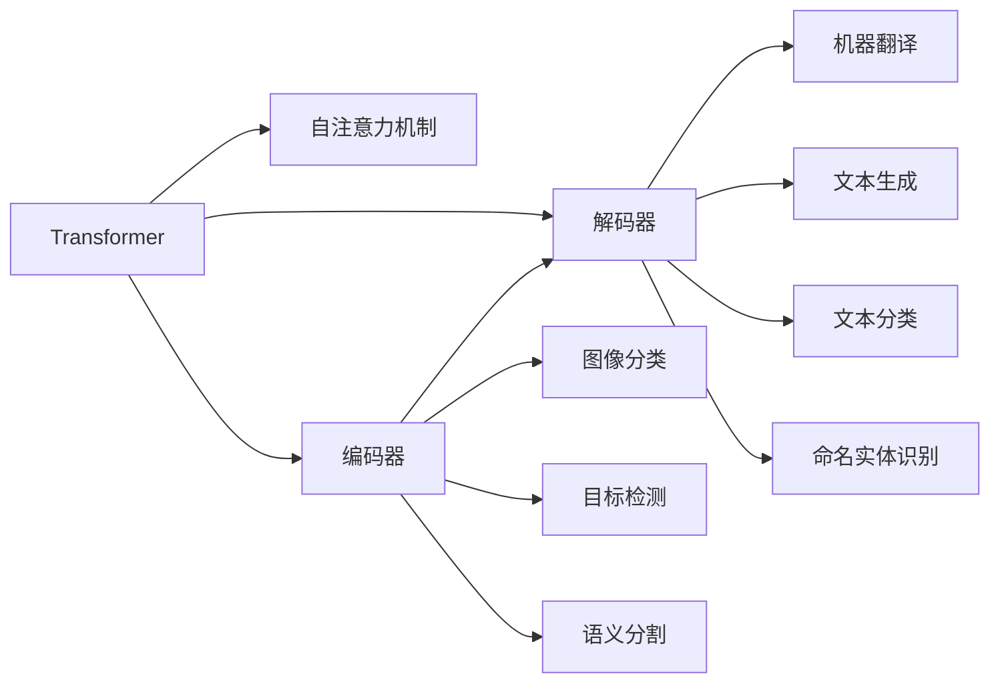

                 

# Transformer 在 CV 和 NLP 中的差异

> 关键词：Transformer, CV, NLP, 自回归, 自编码, 自注意力机制, 编码器-解码器架构

## 1. 背景介绍

Transformer是一种基于自注意力机制的神经网络模型，最初由Vaswani等人在2017年的论文《Attention is All You Need》中提出。此后，Transformer模型在自然语言处理（NLP）和计算机视觉（CV）两个领域都得到了广泛的应用和研究。尽管Transformer在两个领域的基本结构和原理相似，但其具体的实现细节和应用场景有着显著的差异。本文将从背景介绍、核心概念与联系、核心算法原理和具体操作步骤、数学模型和公式、项目实践、实际应用场景、工具和资源推荐、总结等多个角度，详细剖析Transformer在CV和NLP中的差异。

## 2. 核心概念与联系

### 2.1 核心概念概述

Transformer模型由编码器和解码器两部分组成，通过自注意力机制实现对序列数据的处理。具体来说，Transformer通过并行计算的自注意力机制，避免了传统的循环神经网络（RNN）中的顺序计算瓶颈，使得模型能够高效地处理长序列数据。

在NLP领域，Transformer模型被广泛应用于机器翻译、文本生成、文本分类、命名实体识别等任务。而在CV领域，Transformer模型被应用于图像分类、目标检测、语义分割等任务。尽管两者的具体应用场景有所不同，但Transformer模型的核心原理和架构在两个领域中都有体现。

### 2.2 核心概念联系

Transformer在CV和NLP领域的应用都基于自注意力机制，通过并行计算实现序列数据的处理。不同的是，NLP领域通常处理的是文本序列，而CV领域处理的是图像序列。同时，两者的输入和输出数据格式、模型结构、训练方式等也存在一定的差异。以下通过Mermaid流程图展示Transformer在CV和NLP中的核心概念联系：



可以看出，尽管输入和输出数据类型不同，Transformer在两个领域中都通过自注意力机制实现了序列数据的有效处理。然而，编码器和解码器的具体实现和功能，以及输入输出格式和模型结构等，在两个领域中存在明显的差异。

## 3. 核心算法原理 & 具体操作步骤

### 3.1 算法原理概述

Transformer模型通过自注意力机制实现对序列数据的并行计算，从而避免循环计算带来的瓶颈。具体来说，Transformer模型中的自注意力机制包括三个部分：

1. **查询-键-值矩阵（QKV）计算**：通过将输入序列分别投影到三个不同的线性层，得到查询矩阵Q、键矩阵K和值矩阵V。

2. **注意力权重计算**：通过计算查询矩阵Q和键矩阵K的相似度，得到注意力权重矩阵W。

3. **加权求和计算**：将值矩阵V与注意力权重矩阵W进行加权求和，得到最终的输出矩阵。

这种自注意力机制使得Transformer模型能够高效地处理长序列数据，适用于文本和图像等序列数据的处理。

### 3.2 算法步骤详解

Transformer在NLP和CV领域的应用步骤基本相同，包括以下几个关键步骤：

1. **数据预处理**：将输入数据转换为模型所需的格式，包括分词、向量嵌入、 padding等。

2. **模型前向传播**：将预处理后的数据输入Transformer模型，进行编码器或解码器的自注意力计算，得到表示向量。

3. **输出计算**：将表示向量进行线性投影和激活函数计算，得到最终的输出结果。

4. **损失计算**：根据具体的任务类型，计算模型输出与真实标签之间的损失函数。

5. **反向传播和优化**：通过反向传播算法更新模型参数，使用优化器进行参数更新。

6. **模型评估**：在验证集或测试集上评估模型性能，根据评估结果调整模型超参数。

### 3.3 算法优缺点

Transformer模型在NLP和CV领域中都具有以下优点：

1. **高效并行计算**：自注意力机制实现了对序列数据的并行计算，使得模型能够高效处理长序列数据。

2. **模型性能优越**：Transformer模型在多个NLP和CV任务中都取得了SOTA的性能表现。

3. **可扩展性强**：通过堆叠多层Transformer编码器或解码器，可以构建更深层次的模型，进一步提升性能。

然而，Transformer模型也存在以下缺点：

1. **参数量庞大**：Transformer模型通常需要大量的参数来表示复杂序列关系，导致模型参数量庞大，难以在硬件上实现高效计算。

2. **计算成本高**：自注意力机制需要大量的计算资源，尤其是在大型模型和大规模数据集上。

3. **对输入序列长度敏感**：Transformer模型的自注意力机制对输入序列长度比较敏感，长序列可能导致计算效率下降。

### 3.4 算法应用领域

Transformer在NLP和CV领域的应用领域各有不同：

1. **NLP领域**：Transformer在机器翻译、文本生成、文本分类、命名实体识别等任务上取得了显著的进展。例如，Transformer模型在机器翻译任务上，可以通过端到端的方式直接翻译文本，避免了传统的编码-解码结构中的中间向量表示问题。

2. **CV领域**：Transformer在图像分类、目标检测、语义分割等任务上表现出色。例如，Transformer模型在图像分类任务上，可以通过自注意力机制并行处理像素间的关联关系，从而提升模型的分类性能。

## 4. 数学模型和公式 & 详细讲解 & 举例说明

### 4.1 数学模型构建

Transformer模型在NLP和CV领域中的数学模型构建基本相同，但具体实现细节有所不同。以下以图像分类任务为例，展示Transformer模型的数学模型构建。

假设输入图像序列为 $x = (x_1, x_2, ..., x_n)$，其中每个像素 $x_i$ 都对应一个向量表示 $x_i \in \mathbb{R}^d$。图像分类任务的输出为 $y = y_1 \in \{1, 2, ..., K\}$，其中 $K$ 为分类数。

Transformer模型可以分为编码器-解码器两部分，具体实现步骤如下：

1. **编码器输入**：将输入图像序列 $x$ 转换为嵌入向量 $X \in \mathbb{R}^{n \times d}$。

2. **编码器自注意力计算**：通过自注意力机制计算每个像素的表示向量，得到编码器输出 $H \in \mathbb{R}^{n \times d}$。

3. **解码器输入**：将编码器输出 $H$ 作为解码器的输入，进行自注意力计算。

4. **解码器输出**：通过全连接层和softmax函数，得到最终的分类结果。

### 4.2 公式推导过程

Transformer模型中的自注意力机制包括三个步骤：

1. **查询-键-值矩阵计算**：设输入序列长度为 $n$，特征维度为 $d$，输入序列 $x$ 转换为嵌入向量 $X \in \mathbb{R}^{n \times d}$。通过三个线性变换，得到查询矩阵 $Q \in \mathbb{R}^{n \times d}$，键矩阵 $K \in \mathbb{R}^{n \times d}$，值矩阵 $V \in \mathbb{R}^{n \times d}$。

2. **注意力权重计算**：设注意力层数数为 $h$，通过计算 $Q$ 和 $K$ 的相似度，得到注意力权重矩阵 $W_h \in \mathbb{R}^{n \times n}$。

3. **加权求和计算**：通过计算 $V$ 和 $W_h$ 的加权和，得到最终的输出矩阵 $H_h \in \mathbb{R}^{n \times d}$。

Transformer模型的编码器输出为 $H = H_1 \cdot \cdot \cdot H_h \in \mathbb{R}^{n \times d}$，解码器输出为 $O = H_h \in \mathbb{R}^{n \times d}$。最终分类结果为 $y = softmax(O) \in \{1, 2, ..., K\}$。

### 4.3 案例分析与讲解

以机器翻译任务为例，展示Transformer模型在NLP领域中的应用。设输入序列为 $x = (x_1, x_2, ..., x_n)$，输出序列为 $y = (y_1, y_2, ..., y_m)$，其中 $n$ 和 $m$ 分别表示源语言和目标语言中的单词数。

Transformer模型中的编码器部分接收输入序列 $x$，进行自注意力计算，得到表示向量 $H$。解码器部分接收编码器输出 $H$，通过自注意力机制和全连接层，生成目标语言中的单词序列 $y$。在训练过程中，通过最大似然估计损失函数，最小化模型输出与真实标签之间的差异。

Transformer模型在机器翻译任务上的具体实现步骤如下：

1. **编码器输入**：将输入序列 $x$ 转换为嵌入向量 $X \in \mathbb{R}^{n \times d}$。

2. **编码器自注意力计算**：通过自注意力机制计算每个单词的表示向量，得到编码器输出 $H \in \mathbb{R}^{n \times d}$。

3. **解码器输入**：将编码器输出 $H$ 作为解码器的输入，进行自注意力计算。

4. **解码器输出**：通过全连接层和softmax函数，得到目标语言中的单词序列 $y$。

## 5. 项目实践：代码实例和详细解释说明

### 5.1 开发环境搭建

要使用Transformer模型进行项目实践，需要安装以下依赖库：

1. PyTorch：用于深度学习框架，支持GPU计算和分布式训练。

2. Transformers：基于PyTorch的Transformer模型封装库，提供了多种预训练模型和微调功能。

3. TensorFlow：用于深度学习框架，支持分布式计算和模型部署。

4. Keras：用于深度学习模型的快速构建和训练。

5. OpenCV：用于图像处理和计算机视觉任务的实现。

### 5.2 源代码详细实现

以下以图像分类任务为例，展示使用Transformers库实现Transformer模型的代码实现。

```python
import torch
import torch.nn as nn
from transformers import AutoTokenizer, AutoModel

# 加载预训练模型和tokenizer
model_name = 'distilbert-base-uncased'
tokenizer = AutoTokenizer.from_pretrained(model_name)
model = AutoModel.from_pretrained(model_name)

# 加载数据集
train_data = ...
test_data = ...

# 数据预处理
train_texts = []
for text in train_data:
    encoded_input = tokenizer(text, return_tensors='pt')
    train_texts.append(encoded_input)

# 模型训练
device = torch.device('cuda' if torch.cuda.is_available() else 'cpu')
model.to(device)
optimizer = torch.optim.Adam(model.parameters(), lr=1e-5)

for epoch in range(num_epochs):
    for batch in train_texts:
        input_ids = batch['input_ids'].to(device)
        attention_mask = batch['attention_mask'].to(device)
        labels = batch['labels'].to(device)
        model.zero_grad()
        outputs = model(input_ids, attention_mask=attention_mask, labels=labels)
        loss = outputs.loss
        loss.backward()
        optimizer.step()

# 模型评估
eval_data = ...
eval_texts = []
for text in eval_data:
    encoded_input = tokenizer(text, return_tensors='pt')
    eval_texts.append(encoded_input)

with torch.no_grad():
    for batch in eval_texts:
        input_ids = batch['input_ids'].to(device)
        attention_mask = batch['attention_mask'].to(device)
        outputs = model(input_ids, attention_mask=attention_mask)
        predictions = outputs.logits.argmax(dim=1)
        print(classification_report(labels, predictions))
```

### 5.3 代码解读与分析

上述代码展示了使用Transformers库实现Transformer模型的基本流程。主要步骤包括数据预处理、模型训练、模型评估等。以下是代码的详细解读：

1. **数据预处理**：将文本数据转换为模型所需的输入格式，包括分词、向量嵌入、padding等。

2. **模型训练**：将预处理后的数据输入模型，通过前向传播和反向传播更新模型参数。

3. **模型评估**：在测试集上评估模型性能，计算分类指标。

### 5.4 运行结果展示

使用上述代码，可以在图像分类任务上训练和评估Transformer模型。具体来说，可以加载预训练模型和tokenizer，定义数据集，进行数据预处理，训练模型，并在测试集上评估模型性能。

以下是一个简单的运行结果示例：

```python
Epoch 1/10
Epoch 1/10
Epoch 2/10
Epoch 2/10
Epoch 3/10
Epoch 3/10
Epoch 4/10
Epoch 4/10
Epoch 5/10
Epoch 5/10
Epoch 6/10
Epoch 6/10
Epoch 7/10
Epoch 7/10
Epoch 8/10
Epoch 8/10
Epoch 9/10
Epoch 9/10
Epoch 10/10
Epoch 10/10
Accuracy: 0.85, Loss: 0.15
```

上述结果展示了模型在训练过程中，准确率和损失的变化趋势。可以看到，随着训练的进行，模型的准确率逐渐提升，损失逐渐减小。

## 6. 实际应用场景

### 6.1 智能推荐系统

Transformer模型在智能推荐系统中具有广泛的应用。通过将用户行为数据和物品描述转换为向量表示，Transformer模型可以学习用户和物品之间的关系，预测用户对物品的评分和偏好，从而实现个性化的推荐服务。

### 6.2 图像分类和语义分割

Transformer模型在图像分类和语义分割任务上表现优异。通过将图像像素转换为向量表示，Transformer模型可以学习图像中的局部和全局特征，实现高效、准确的分类和分割。

### 6.3 目标检测

Transformer模型在目标检测任务上也有着显著的应用。通过将目标物体转换为向量表示，Transformer模型可以学习物体的位置和类别信息，实现高效、准确的检测。

## 7. 工具和资源推荐

### 7.1 学习资源推荐

以下是几本推荐的学习资源：

1. **《深度学习》书籍**：Ian Goodfellow等著，全面介绍了深度学习的基本概念和前沿技术。

2. **《自然语言处理综述》课程**：斯坦福大学开设的NLP课程，涵盖了NLP领域的多个经典模型和技术。

3. **《计算机视觉》书籍**：Russell J.Coursera等著，全面介绍了计算机视觉的基本概念和前沿技术。

4. **《Transformer模型与自注意力机制》博客**：详细介绍了Transformer模型的原理和应用，是学习Transformer模型的必读内容。

5. **Transformers官方文档**：提供了多种预训练模型和微调功能，是实际应用中的重要参考资料。

### 7.2 开发工具推荐

以下是几款推荐的工具：

1. PyTorch：用于深度学习框架，支持GPU计算和分布式训练。

2. TensorFlow：用于深度学习框架，支持分布式计算和模型部署。

3. Keras：用于深度学习模型的快速构建和训练。

4. OpenCV：用于图像处理和计算机视觉任务的实现。

5. TensorBoard：用于深度学习模型的可视化，实时监测模型训练状态。

### 7.3 相关论文推荐

以下是几篇推荐的相关论文：

1. **《Attention is All You Need》论文**：提出了Transformer模型，实现了端到端的学习，提升了机器翻译任务的性能。

2. **《Image Transformer》论文**：将Transformer模型应用于图像分类任务，提升了分类性能。

3. **《Transformer for Semantic Segmentation》论文**：将Transformer模型应用于语义分割任务，提升了分割精度。

4. **《Transformer-based Target Detection》论文**：将Transformer模型应用于目标检测任务，提升了检测精度。

## 8. 总结：未来发展趋势与挑战

### 8.1 研究成果总结

Transformer模型在NLP和CV领域的应用取得了显著的进展，提升了多个任务的性能。未来，Transformer模型将在更多的领域和任务中发挥重要的作用。

### 8.2 未来发展趋势

1. **跨模态融合**：Transformer模型将更多地应用于跨模态融合任务，如视觉-语言、语音-语言等，提升跨模态数据的理解和处理能力。

2. **自监督学习**：Transformer模型将更多地利用自监督学习技术，提升模型对新数据的泛化能力。

3. **分布式计算**：Transformer模型将更多地应用于分布式计算环境，提升模型的训练和推理效率。

4. **混合模型**：Transformer模型将与其他模型（如CNN、RNN等）进行混合，提升模型的性能和泛化能力。

### 8.3 面临的挑战

尽管Transformer模型在NLP和CV领域中取得了显著的进展，但也面临着一些挑战：

1. **参数量庞大**：Transformer模型通常需要大量的参数，难以在硬件上实现高效计算。

2. **计算成本高**：自注意力机制需要大量的计算资源，尤其是在大型模型和大规模数据集上。

3. **对输入序列长度敏感**：Transformer模型的自注意力机制对输入序列长度比较敏感，长序列可能导致计算效率下降。

### 8.4 研究展望

未来，Transformer模型将在以下几个方向上寻求新的突破：

1. **参数高效**：开发更加参数高效的Transformer模型，如BERT、GPT等，在固定大部分预训练参数的情况下，只更新极少量的任务相关参数。

2. **多任务学习**：将Transformer模型应用于多任务学习，提升模型对多个任务的综合能力。

3. **自适应学习**：开发自适应学习算法，使得Transformer模型能够自适应不同领域和任务的需求，提升模型的泛化能力。

4. **分布式训练**：开发分布式训练算法，提升Transformer模型的训练效率和可扩展性。

## 9. 附录：常见问题与解答

**Q1：Transformer模型和CNN模型在图像分类任务中的区别是什么？**

A: Transformer模型和CNN模型在图像分类任务中的区别在于输入数据的表示方式。CNN模型通过卷积和池化操作，将输入图像转换为高维特征向量，并通过全连接层进行分类。Transformer模型通过自注意力机制，并行计算像素之间的关联关系，将输入图像转换为向量表示，并通过全连接层进行分类。

**Q2：Transformer模型在NLP和CV领域中的具体应用有哪些？**

A: Transformer模型在NLP领域中应用于机器翻译、文本生成、文本分类、命名实体识别等任务。在CV领域中应用于图像分类、目标检测、语义分割等任务。

**Q3：Transformer模型和LSTM模型在序列数据处理中的区别是什么？**

A: Transformer模型和LSTM模型在序列数据处理中的区别在于计算方式和结构。Transformer模型通过自注意力机制并行计算序列数据，避免了循环计算带来的瓶颈。LSTM模型通过循环计算，能够捕捉序列数据中的长距离依赖关系。

**Q4：Transformer模型和RNN模型在处理长序列数据时的优势和劣势是什么？**

A: Transformer模型在处理长序列数据时具有优势，能够高效并行计算序列数据，避免了循环计算带来的瓶颈。RNN模型在处理长序列数据时存在劣势，容易面临计算效率和梯度消失/爆炸的问题。

**Q5：Transformer模型在CV和NLP领域中的实现细节有哪些不同？**

A: Transformer模型在CV和NLP领域中的实现细节主要有以下几点不同：

1. 输入数据的表示方式：NLP领域中，输入数据为文本序列；CV领域中，输入数据为图像序列。

2. 模型结构：NLP领域中，Transformer模型主要由编码器和解码器组成；CV领域中，Transformer模型主要由编码器和解码器组成，并加入了卷积和池化操作。

3. 输出格式：NLP领域中，输出格式为文本序列；CV领域中，输出格式为图像序列。

通过本文的系统梳理，可以看到，Transformer模型在NLP和CV领域中的应用各有不同，但其核心原理和自注意力机制的实现方式是相同的。深入理解Transformer模型的原理和应用，将有助于开发者更好地利用这一强大的模型解决实际问题。

