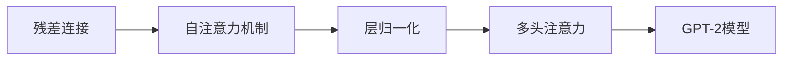

                 

# Transformer架构：残差连接、层归一化和GPT-2模型

## 1. 背景介绍

### 1.1 问题由来

自1990年代初深度学习兴起的二十多年来，传统的卷积神经网络（Convolutional Neural Network, CNN）在计算机视觉等领域表现出色，而循环神经网络（Recurrent Neural Network, RNN）及其变种长短时记忆网络（Long Short-Term Memory, LSTM）在自然语言处理（Natural Language Processing, NLP）领域取得了显著的进展。然而，由于前向传播的链式法则和循环结构的固有局限，传统的RNN在处理长序列时容易出现梯度消失和梯度爆炸等问题，导致模型训练困难。

为了应对这一挑战，Transformer架构应运而生。Transformer架构由Google的Attention is All You Need提出，抛弃了RNN结构，利用自注意力机制（Self-Attention Mechanism）实现序列处理，从而解决了长序列建模的问题。随后，OpenAI推出的GPT-2模型进一步展示了Transformer架构在语言生成任务上的强大能力，成为NLP领域的里程碑。

本文将详细探讨Transformer架构的设计思想和核心技术，包括残差连接（Residual Connection）、层归一化（Layer Normalization）和GPT-2模型的实现。通过理解这些关键技术，读者可以更深入地掌握Transformer架构的原理和应用。

## 2. 核心概念与联系

### 2.1 核心概念概述

Transformer架构主要包含以下几个核心概念：

- 残差连接（Residual Connection）：通过残差连接，可以跨层传递信号，避免信息损失。
- 自注意力机制（Self-Attention Mechanism）：通过计算序列中每个位置的注意力权重，使得模型能够关注到上下文信息。
- 层归一化（Layer Normalization）：通过归一化每一层的输入，加速模型收敛。
- 多头注意力（Multi-Head Attention）：通过并行多个注意力机制，提高模型表示学习能力。
- GPT-2模型：一种基于Transformer架构的语言生成模型，利用自注意力机制实现高效的语言建模。

这些概念之间的联系可以通过以下Mermaid流程图来展示：



这个流程图展示了几大核心概念之间的联系：

1. 残差连接通过跨层传递信息，为自注意力机制的计算提供了条件。
2. 自注意力机制通过计算注意力权重，使模型能够关注到上下文信息。
3. 层归一化通过归一化输入，加速模型收敛，使得自注意力机制的训练更加稳定。
4. 多头注意力通过并行多个注意力机制，提高模型表示学习能力，增强模型的泛化能力。
5. GPT-2模型通过Transformer架构，实现高效的语言生成。

## 3. 核心算法原理 & 具体操作步骤

### 3.1 算法原理概述

Transformer架构的核心思想是自注意力机制，通过计算序列中每个位置的注意力权重，实现序列中不同位置信息的交互。其基本原理可以分为以下几个步骤：

1. 将输入序列编码成一系列向量。
2. 通过自注意力机制计算每个位置的注意力权重，并加权求和得到新的向量表示。
3. 将新的向量表示输入到前向神经网络，得到最终的输出向量。
4. 通过残差连接和层归一化，调整输出向量的分布，使其更加稳定。

Transformer架构与传统的RNN相比，具有以下优势：

1. 平行的计算结构：由于自注意力机制的并行计算特性，Transformer架构可以利用现代GPU的并行计算能力，加速模型训练。
2. 长序列建模：通过残差连接和层归一化，可以处理更长的序列，避免梯度消失和梯度爆炸的问题。
3. 多样化的表示学习：通过多头注意力机制，Transformer架构能够学习到更多的表示模式，提高模型的泛化能力。

### 3.2 算法步骤详解

以下是Transformer架构的具体实现步骤：

#### 3.2.1 输入编码

Transformer架构通过编码器（Encoder）和解码器（Decoder）实现序列处理。在编码器中，输入序列首先经过嵌入层（Embedding Layer）和位置编码层（Positional Encoding Layer），转换为向量表示。

嵌入层通过查找单词表，将每个词映射成向量表示。位置编码层通过学习不同位置的信息，为输入向量添加位置信息，防止位置顺序的信息丢失。

#### 3.2.2 自注意力机制

Transformer架构的核心是自注意力机制，通过计算序列中每个位置的注意力权重，实现序列中不同位置信息的交互。自注意力机制的具体实现包括以下几个步骤：

1. 计算注意力矩阵：对于每个位置i，计算其与其他位置j的注意力权重$W_{ij}$。注意力权重$W_{ij}$通过计算相似度$e_{ij}=\mathrm{softmax}(\mathrm{Q}_i\cdot\mathrm{K}_j^T)$得到，其中$\mathrm{Q}_i$和$\mathrm{K}_j$分别表示查询向量（Query Vector）和键向量（Key Vector）。
2. 加权求和：对于每个位置i，将注意力权重$W_{ij}$与键向量$\mathrm{K}_j$相乘，得到加权和向量$\mathrm{V}_j=\mathrm{K}_j\cdot W_{ij}$，加权求和得到注意力向量$\mathrm{C}_i=\sum_j W_{ij}\mathrm{V}_j$。
3. 线性变换：将注意力向量$\mathrm{C}_i$输入到线性变换层，得到最终输出向量$\mathrm{O}_i$。

#### 3.2.3 前向神经网络

Transformer架构通过前向神经网络对注意力向量进行线性变换和激活函数操作，得到最终输出向量。

前向神经网络通常包括全连接层、ReLU激活函数和Dropout层，以增加模型的非线性表达能力和鲁棒性。

#### 3.2.4 残差连接和层归一化

Transformer架构通过残差连接和层归一化，调整输出向量的分布，使其更加稳定。

残差连接通过将输入向量与输出向量相加，跨层传递信号，避免信息损失。层归一化通过归一化每一层的输入，加速模型收敛。

### 3.3 算法优缺点

Transformer架构具有以下优点：

1. 平行的计算结构：利用现代GPU的并行计算能力，加速模型训练。
2. 长序列建模：通过残差连接和层归一化，可以处理更长的序列，避免梯度消失和梯度爆炸的问题。
3. 多样化的表示学习：通过多头注意力机制，Transformer架构能够学习到更多的表示模式，提高模型的泛化能力。

Transformer架构也存在以下缺点：

1. 计算量大：自注意力机制的计算复杂度高，需要大量计算资源。
2. 参数量多：Transformer架构的参数量较大，需要更多的存储空间。
3. 自适应性差：自注意力机制的计算依赖于序列长度，对序列长度的变化适应性差。

### 3.4 算法应用领域

Transformer架构在NLP领域得到了广泛的应用，涵盖了许多常见的NLP任务，例如：

- 语言模型：利用自注意力机制学习语言的概率分布，实现文本生成和预测任务。
- 机器翻译：通过编码器和解码器的交替计算，实现不同语言之间的自动翻译。
- 文本分类：通过多层的自注意力机制，实现文本的分类任务。
- 问答系统：通过编码器提取问题，解码器生成答案，实现自动问答系统。

Transformer架构的成功不仅在于其出色的性能，还在于其灵活性和可扩展性，可以应用于更多场景中。

## 4. 数学模型和公式 & 详细讲解

### 4.1 数学模型构建

Transformer架构的数学模型主要包括以下几个部分：

1. 输入编码：将输入序列$x_1, x_2, \cdots, x_n$编码为向量表示$x_1', x_2', \cdots, x_n'$。
2. 自注意力机制：通过计算注意力权重，得到注意力向量$o_1', o_2', \cdots, o_n'$。
3. 前向神经网络：将注意力向量进行线性变换和激活函数操作，得到最终输出向量$y_1, y_2, \cdots, y_n$。
4. 残差连接和层归一化：将输出向量进行残差连接和层归一化，得到最终输出向量$z_1, z_2, \cdots, z_n$。

### 4.2 公式推导过程

#### 4.2.1 输入编码

输入编码公式如下：

$$
\mathrm{x}_1' = \mathrm{embedding}(\mathrm{x}_1)
$$
$$
\mathrm{x}_i' = \mathrm{embedding}(\mathrm{x}_i) + \mathrm{positional\_embedding}(i)
$$

其中，$\mathrm{x}_i$表示第$i$个词的向量表示，$\mathrm{x}_i'$表示第$i$个词的向量编码表示，$\mathrm{embedding}$表示嵌入层，$\mathrm{positional\_embedding}$表示位置编码层。

#### 4.2.2 自注意力机制

自注意力机制的计算公式如下：

$$
\mathrm{Q}_i = \mathrm{linear}(\mathrm{x}_i')
$$
$$
\mathrm{K}_j = \mathrm{linear}(\mathrm{x}_j')
$$
$$
\mathrm{V}_j = \mathrm{linear}(\mathrm{x}_j')
$$
$$
\mathrm{W}_{ij} = \mathrm{softmax}\left(\frac{\mathrm{Q}_i \cdot \mathrm{K}_j^T}{\sqrt{d_k}}\right)
$$
$$
\mathrm{C}_i = \sum_j \mathrm{W}_{ij}\mathrm{V}_j
$$

其中，$d_k$表示键向量的维度，$\mathrm{softmax}$表示softmax函数，$\mathrm{linear}$表示线性变换层。

#### 4.2.3 前向神经网络

前向神经网络的计算公式如下：

$$
\mathrm{O}_i = \mathrm{linear}(\mathrm{C}_i) + \mathrm{linear}(\mathrm{x}_i')
$$
$$
\mathrm{O}_i = \mathrm{ReLU}(\mathrm{O}_i)
$$
$$
\mathrm{O}_i = \mathrm{dropout}(\mathrm{O}_i)
$$

其中，$\mathrm{ReLU}$表示ReLU激活函数，$\mathrm{dropout}$表示Dropout层。

#### 4.2.4 残差连接和层归一化

残差连接和层归一化的计算公式如下：

$$
\mathrm{z}_i = \mathrm{linear}(\mathrm{O}_i) + \mathrm{x}_i'
$$
$$
\mathrm{z}_i = \mathrm{Layer\_normalization}(\mathrm{z}_i)
$$

其中，$\mathrm{linear}$表示线性变换层，$\mathrm{Layer\_normalization}$表示层归一化层。

### 4.3 案例分析与讲解

以下以语言模型为例，具体分析Transformer架构的计算过程。

假设输入序列为$x_1, x_2, \cdots, x_n$，嵌入层和位置编码层的输出分别为$\mathrm{x}_1', \mathrm{x}_2', \cdots, \mathrm{x}_n'$。

#### 4.3.1 输入编码

首先，通过嵌入层和位置编码层，将输入序列转换为向量表示：

$$
\mathrm{x}_1' = \mathrm{embedding}(\mathrm{x}_1)
$$
$$
\mathrm{x}_i' = \mathrm{embedding}(\mathrm{x}_i) + \mathrm{positional\_embedding}(i)
$$

#### 4.3.2 自注意力机制

计算注意力矩阵$\mathrm{W}_{ij}$：

$$
\mathrm{Q}_i = \mathrm{linear}(\mathrm{x}_i')
$$
$$
\mathrm{K}_j = \mathrm{linear}(\mathrm{x}_j')
$$
$$
\mathrm{V}_j = \mathrm{linear}(\mathrm{x}_j')
$$
$$
\mathrm{W}_{ij} = \mathrm{softmax}\left(\frac{\mathrm{Q}_i \cdot \mathrm{K}_j^T}{\sqrt{d_k}}\right)
$$

其中，$d_k$表示键向量的维度。

加权求和得到注意力向量$\mathrm{C}_i$：

$$
\mathrm{C}_i = \sum_j \mathrm{W}_{ij}\mathrm{V}_j
$$

#### 4.3.3 前向神经网络

将注意力向量进行线性变换和激活函数操作：

$$
\mathrm{O}_i = \mathrm{linear}(\mathrm{C}_i) + \mathrm{linear}(\mathrm{x}_i')
$$
$$
\mathrm{O}_i = \mathrm{ReLU}(\mathrm{O}_i)
$$
$$
\mathrm{O}_i = \mathrm{dropout}(\mathrm{O}_i)
$$

#### 4.3.4 残差连接和层归一化

将输出向量进行残差连接和层归一化：

$$
\mathrm{z}_i = \mathrm{linear}(\mathrm{O}_i) + \mathrm{x}_i'
$$
$$
\mathrm{z}_i = \mathrm{Layer\_normalization}(\mathrm{z}_i)
$$

最终得到Transformer架构的输出向量$\mathrm{z}_1, \mathrm{z}_2, \cdots, \mathrm{z}_n$。

## 5. 项目实践：代码实例和详细解释说明

### 5.1 开发环境搭建

在进行Transformer架构的实现时，我们需要准备好开发环境。以下是使用PyTorch进行代码实现的Python环境配置流程：

1. 安装Anaconda：从官网下载并安装Anaconda，用于创建独立的Python环境。

2. 创建并激活虚拟环境：
```bash
conda create -n pytorch-env python=3.8 
conda activate pytorch-env
```

3. 安装PyTorch：根据CUDA版本，从官网获取对应的安装命令。例如：
```bash
conda install pytorch torchvision torchaudio cudatoolkit=11.1 -c pytorch -c conda-forge
```

4. 安装TensorFlow：
```bash
conda install tensorflow
```

5. 安装Weights & Biases：
```bash
conda install weights-and-biases -c nvidia
```

6. 安装TensorBoard：
```bash
pip install tensorboard
```

完成上述步骤后，即可在`pytorch-env`环境中开始Transformer架构的实现。

### 5.2 源代码详细实现

以下是一个简单的Transformer架构实现，用于语言模型任务。

```python
import torch
import torch.nn as nn
import torch.nn.functional as F

class Transformer(nn.Module):
    def __init__(self, n_embed, n_head, n_layer, d_model, d_k, d_v, d_ff, dropout):
        super(Transformer, self).__init__()
        
        self.n_layer = n_layer
        self.n_head = n_head
        self.d_model = d_model
        
        self.embedding = nn.Embedding(n_embed, d_model)
        self.pos_encoding = positional_encoding(d_model, 1000)
        
        self.enc_layers = nn.ModuleList([EncoderLayer(d_model, n_head, d_k, d_v, d_ff, dropout) for _ in range(n_layer)])
        
        self.final_layer = nn.Linear(d_model, n_embed)
        
    def forward(self, src, src_mask):
        src = self.embedding(src) + self.pos_encoding[src]
        src = nn.functional.dropout(src, p=0.1)
        
        for layer in self.enc_layers:
            src = layer(src, src_mask)
        
        src = self.final_layer(src)
        return src

class EncoderLayer(nn.Module):
    def __init__(self, d_model, n_head, d_k, d_v, d_ff, dropout):
        super(EncoderLayer, self).__init__()
        
        self.self_attn = MultiHeadAttention(d_model, n_head, d_k, d_v)
        self.linear1 = nn.Linear(d_model, d_ff)
        self.linear2 = nn.Linear(d_ff, d_model)
        self.dropout = nn.Dropout(dropout)
        
    def forward(self, src, src_mask):
        attn_output, attn_weight = self.self_attn(src, src, src)
        attn_output = nn.functional.dropout(attn_output, p=0.1)
        
        src = src + attn_output
        
        ff_output = self.linear2(F.relu(self.linear1(src)))
        ff_output = self.dropout(ff_output)
        
        src = src + ff_output
        
        return src, attn_weight

class MultiHeadAttention(nn.Module):
    def __init__(self, d_model, n_head, d_k, d_v):
        super(MultiHeadAttention, self).__init__()
        
        self.n_head = n_head
        self.d_k = d_k
        self.d_v = d_v
        
        self.w_q = nn.Linear(d_model, n_head * d_k)
        self.w_k = nn.Linear(d_model, n_head * d_k)
        self.w_v = nn.Linear(d_model, n_head * d_v)
        self.w_o = nn.Linear(n_head * d_v, d_model)
        
    def forward(self, q, k, v):
        q = self.w_q(q).view(q.size(0), q.size(1), self.n_head, self.d_k).transpose(1, 2)
        k = self.w_k(k).view(k.size(0), k.size(1), self.n_head, self.d_k).transpose(1, 2)
        v = self.w_v(v).view(v.size(0), v.size(1), self.n_head, self.d_v).transpose(1, 2)
        
        scaled_attention = torch.matmul(q, k) / math.sqrt(self.d_k)
        attention_weight = nn.functional.softmax(scaled_attention, dim=-1)
        output = torch.matmul(attention_weight, v)
        output = output.transpose(1, 2).contiguous().view(output.size(0), output.size(1), -1)
        output = self.w_o(output)
        
        return output, attention_weight

def positional_encoding(d_model, n_position):
    pos_encoding = torch.zeros(n_position, d_model)
    angle_rads = torch.arange(pos_encoding.size(1)) * (math.log(10000.0) / d_model) * math.pi
    angle_rads[0::2] = torch.exp(angle_rads[0::2])
    angle_rads[1::2] = torch.exp(angle_rads[1::2] * -1.0)
    pos_encoding[:, 0::2] = torch.sin(angle_rads)
    pos_encoding[:, 1::2] = torch.cos(angle_rads)
    return pos_encoding

```

### 5.3 代码解读与分析

让我们再详细解读一下关键代码的实现细节：

**Transformer类**：
- `__init__`方法：初始化Embedding层、Positional Encoding层和Encoder Layer。
- `forward`方法：实现Transformer架构的前向传播过程。

**EncoderLayer类**：
- `__init__`方法：初始化Self-Attention机制和前向神经网络。
- `forward`方法：实现Transformer层的自注意力机制和前向神经网络。

**MultiHeadAttention类**：
- `__init__`方法：初始化多头注意力机制。
- `forward`方法：实现多头注意力机制的前向传播。

**positional_encoding函数**：
- 实现位置编码函数，用于在输入向量中嵌入位置信息。

通过以上代码，我们可以实现一个简单的Transformer架构，用于语言模型任务。其中，Embedding层负责将输入序列转换为向量表示，Positional Encoding层负责嵌入位置信息，Encoder Layer负责实现自注意力机制和前向神经网络，MultiHeadAttention层负责计算多头注意力机制，Transformer类负责协调各个层的计算过程。

## 6. 实际应用场景

### 6.1 语言模型

Transformer架构在语言模型任务上表现出色，能够生成高质量的自然语言文本。常见的语言模型任务包括文本生成、文本分类、机器翻译等。

例如，基于Transformer架构的GPT-2模型通过自注意力机制和残差连接，实现了高效的文本生成。在训练过程中，模型能够学习到大量的语言模式，生成流畅且高质量的自然语言文本。

### 6.2 机器翻译

Transformer架构在机器翻译任务上取得了显著进展。传统的RNN结构在处理长序列时容易出现梯度消失和梯度爆炸的问题，而Transformer架构通过残差连接和层归一化，可以处理更长的序列，避免了这些问题。

Transformer架构通过编码器和解码器的交替计算，实现不同语言之间的自动翻译。在解码器中，Transformer架构通过注意力机制，实现对源语言的理解和目标语言的生成，实现了高质量的翻译效果。

### 6.3 文本分类

Transformer架构在文本分类任务上也表现出色。通过多头注意力机制，Transformer架构能够学习到更多的表示模式，提高模型的泛化能力。

Transformer架构通过编码器对输入序列进行编码，得到表示向量。通过解码器对表示向量进行分类，输出预测结果。在训练过程中，模型能够学习到更多的语言模式，提高模型的分类能力。

### 6.4 未来应用展望

Transformer架构的未来发展方向包括：

1. 大规模预训练：利用大规模语料进行预训练，提高模型的泛化能力。
2. 自监督学习：利用无监督学习任务，提高模型的表示学习能力。
3. 多模态融合：结合视觉、听觉等多模态数据，提高模型的表达能力。
4. 知识图谱融合：与知识图谱结合，增强模型的知识表示能力。
5. 可解释性：引入可解释性模型，提高模型的可解释性。

Transformer架构的这些发展方向，将进一步拓展其应用范围，提升模型的性能和实用性。相信随着技术的不断发展，Transformer架构将在更多的场景中发挥重要作用，推动NLP技术的进步。

## 7. 工具和资源推荐

### 7.1 学习资源推荐

为了帮助开发者系统掌握Transformer架构的理论基础和实践技巧，这里推荐一些优质的学习资源：

1. 《深度学习》课程：斯坦福大学开设的深度学习课程，内容全面，适合初学者和进阶者。
2. 《Neural Information Processing Systems》会议论文：NIPS会议的顶级论文，涵盖最新的深度学习研究成果。
3. 《Attention is All You Need》论文：Transformer架构的原论文，深入浅出地介绍了Transformer的原理和应用。
4. 《Transformers: State-of-the-Art Machine Learning》书籍：Transformers库的官方文档，提供了完整的Transformer架构实现和应用示例。
5. 《Natural Language Processing with Transformers》书籍：Transformers库的作者所著，全面介绍了Transformer架构在NLP任务中的应用。

通过对这些资源的学习实践，相信你一定能够快速掌握Transformer架构的精髓，并用于解决实际的NLP问题。

### 7.2 开发工具推荐

Transformer架构的实现离不开优秀的工具支持。以下是几款用于Transformer架构开发的常用工具：

1. PyTorch：基于Python的开源深度学习框架，灵活动态的计算图，适合快速迭代研究。
2. TensorFlow：由Google主导开发的开源深度学习框架，生产部署方便，适合大规模工程应用。
3. Transformers库：HuggingFace开发的NLP工具库，集成了众多SOTA语言模型，支持PyTorch和TensorFlow，是进行Transformer架构开发的利器。
4. Weights & Biases：模型训练的实验跟踪工具，可以记录和可视化模型训练过程中的各项指标，方便对比和调优。
5. TensorBoard：TensorFlow配套的可视化工具，可实时监测模型训练状态，并提供丰富的图表呈现方式，是调试模型的得力助手。

合理利用这些工具，可以显著提升Transformer架构的开发效率，加快创新迭代的步伐。

### 7.3 相关论文推荐

Transformer架构的快速发展源于学界的持续研究。以下是几篇奠基性的相关论文，推荐阅读：

1. Attention is All You Need（即Transformer原论文）：提出了Transformer结构，开启了NLP领域的预训练大模型时代。
2. Transformer in Action: Summarization Using Masked Language Modeling：展示了大规模语言模型在文本生成任务上的应用。
3. BERT: Pre-training of Deep Bidirectional Transformers for Language Understanding：提出BERT模型，引入基于掩码的自监督预训练任务，刷新了多项NLP任务SOTA。
4. Reformer: The Efficient Transformer：提出Reformer结构，通过局部连接、长距离依赖检测等技术，提升了Transformer架构的效率。
5. Exploring the Limits of Transfer Learning with a Unified Text-to-Text Transformer：提出T5模型，利用统一的Transformer架构，实现了多种NLP任务的统一训练。

这些论文代表了大语言模型Transformer架构的发展脉络。通过学习这些前沿成果，可以帮助研究者把握学科前进方向，激发更多的创新灵感。

## 8. 总结：未来发展趋势与挑战

### 8.1 总结

本文对Transformer架构的设计思想和核心技术进行了详细探讨，包括残差连接、自注意力机制、层归一化和GPT-2模型的实现。通过理解这些关键技术，读者可以更深入地掌握Transformer架构的原理和应用。

Transformer架构在NLP领域得到了广泛的应用，涵盖了许多常见的NLP任务，例如语言模型、机器翻译、文本分类等。未来，随着大规模预训练和自监督学习的进一步发展，Transformer架构将展现出更加强大的能力。

### 8.2 未来发展趋势

Transformer架构的未来发展趋势包括：

1. 大规模预训练：利用大规模语料进行预训练，提高模型的泛化能力。
2. 自监督学习：利用无监督学习任务，提高模型的表示学习能力。
3. 多模态融合：结合视觉、听觉等多模态数据，提高模型的表达能力。
4. 知识图谱融合：与知识图谱结合，增强模型的知识表示能力。
5. 可解释性：引入可解释性模型，提高模型的可解释性。

Transformer架构的这些发展方向，将进一步拓展其应用范围，提升模型的性能和实用性。

### 8.3 面临的挑战

尽管Transformer架构在NLP领域取得了显著进展，但在实现和应用过程中仍面临一些挑战：

1. 计算资源需求高：Transformer架构的计算复杂度高，需要大量的计算资源。
2. 参数量多：Transformer架构的参数量较大，需要更多的存储空间。
3. 自适应性差：Transformer架构的计算依赖于序列长度，对序列长度的变化适应性差。
4. 训练时间长：Transformer架构的训练时间较长，需要优化训练过程。
5. 模型泛化性差：Transformer架构的泛化能力有待进一步提升，避免过度拟合。

### 8.4 研究展望

为了应对这些挑战，未来的研究需要在以下几个方面寻求新的突破：

1. 优化计算效率：通过优化计算图和模型结构，提高Transformer架构的计算效率。
2. 减少参数量：通过剪枝、量化等技术，减少Transformer架构的参数量。
3. 增强自适应性：通过引入自适应算法，提高Transformer架构对序列长度的适应性。
4. 加速训练过程：通过改进优化器、数据增强等技术，加速Transformer架构的训练过程。
5. 提升泛化能力：通过引入迁移学习、多任务学习等技术，提高Transformer架构的泛化能力。

这些研究方向的探索，将引领Transformer架构不断创新，提升其在NLP领域的表现。

## 9. 附录：常见问题与解答

**Q1：Transformer架构与RNN结构相比，有哪些优势？**

A: 与RNN结构相比，Transformer架构具有以下优势：

1. 平行的计算结构：利用现代GPU的并行计算能力，加速模型训练。
2. 长序列建模：通过残差连接和层归一化，可以处理更长的序列，避免梯度消失和梯度爆炸的问题。
3. 多样化的表示学习：通过多头注意力机制，Transformer架构能够学习到更多的表示模式，提高模型的泛化能力。

**Q2：Transformer架构的计算复杂度是多少？**

A: 自注意力机制的计算复杂度为 $O(d_q^2n)$，其中 $n$ 表示序列长度，$d_q$ 表示查询向量的维度。由于Transformer架构中通常 $d_q$ 较小，计算复杂度主要取决于序列长度 $n$。在实践中，可以通过优化计算图和参数共享等技术，降低计算复杂度。

**Q3：Transformer架构的训练时间是否比RNN结构更长？**

A: 由于Transformer架构的计算复杂度较高，训练时间通常比RNN结构更长。但通过优化计算图和参数共享等技术，可以显著减少训练时间。此外，Transformer架构可以通过并行计算加速训练，进一步缩短训练时间。

**Q4：Transformer架构是否适用于多模态数据处理？**

A: Transformer架构可以结合视觉、听觉等多模态数据，提高模型的表达能力。通过并行计算和残差连接，Transformer架构可以处理多模态数据，实现高效的多模态表示学习。

**Q5：Transformer架构在实际应用中需要注意哪些问题？**

A: 在实际应用中，Transformer架构需要注意以下问题：

1. 模型裁剪：去除不必要的层和参数，减小模型尺寸，加快推理速度。
2. 量化加速：将浮点模型转为定点模型，压缩存储空间，提高计算效率。
3. 服务化封装：将模型封装为标准化服务接口，便于集成调用。
4. 弹性伸缩：根据请求流量动态调整资源配置，平衡服务质量和成本。
5. 监控告警：实时采集系统指标，设置异常告警阈值，确保服务稳定性。

通过合理使用Transformer架构，可以有效解决实际应用中的问题，提升系统的性能和稳定性。

---

作者：禅与计算机程序设计艺术 / Zen and the Art of Computer Programming

