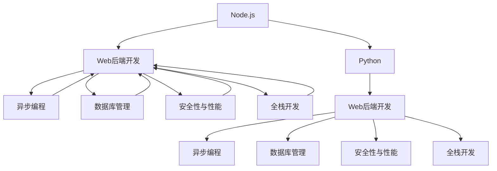

                 

# Web 后端开发：Node.js 和 Python

> 关键词：Web 后端开发, Node.js, Python, 服务器端编程, 全栈开发, 异步编程, 数据库管理, 安全性与性能

## 1. 背景介绍

### 1.1 问题由来

随着互联网的迅猛发展，Web后端开发已经成为了互联网公司不可或缺的一部分。传统的后端开发主要是使用Java、C#等静态类型语言，这些语言虽然强大，但是学习曲线较陡，且开发效率相对较低。近年来，Node.js和Python作为新一代后端开发语言，凭借其动态语言特性和丰富的生态系统，逐渐成为了Web后端开发的主流。

### 1.2 问题核心关键点

Node.js和Python作为两种流行的后端开发语言，它们各自有着不同的优势和适用场景。Node.js以其非阻塞I/O、高并发处理能力、异步编程特性著称，适合处理高并发和实时性要求高的场景，如在线游戏、聊天室、电商网站等。而Python则以其简洁易读、丰富的第三方库和强大的数据处理能力著称，适合数据科学、机器学习、Web应用开发等场景。

## 2. 核心概念与联系

### 2.1 核心概念概述

为更好地理解Node.js和Python在Web后端开发中的应用，本节将介绍几个密切相关的核心概念：

- **Node.js**：一种基于Chrome V8引擎的JavaScript运行环境，可以运行在服务器端，支持异步非阻塞I/O操作，适合开发实时性要求高的Web应用。
- **Python**：一种高级的、解释型的、动态语言，以其简洁易读、丰富的第三方库和强大的数据处理能力著称，适合Web应用开发、数据科学、机器学习等领域。
- **Web后端开发**：涉及服务端处理逻辑、数据存储、API设计、安全性与性能优化等方面的开发工作，是Web应用开发的重要组成部分。
- **全栈开发**：指能够同时处理前端和后端开发的开发技术栈，能够无缝衔接前后端，提高开发效率和用户体验。
- **异步编程**：指在处理I/O操作时，通过非阻塞I/O、事件驱动等方式提高程序性能，适合处理高并发场景。
- **数据库管理**：涉及数据存储、查询优化、事务处理等方面的技术，是后端开发的重要组成部分。
- **安全性与性能**：涉及Web应用的登录、授权、数据加密、负载均衡、缓存等方面的安全与性能优化。

这些核心概念之间的逻辑关系可以通过以下Mermaid流程图来展示：



这个流程图展示了大语言模型与Web后端开发的核心概念及其之间的关系：

1. Node.js和Python作为两种主流后端开发语言，通过异步编程、数据库管理、安全性与性能优化等技术手段，支撑着Web后端开发。
2. 异步编程能够提高程序的性能和并发能力，数据库管理能够保证数据的安全性和可靠性，安全性与性能优化能够提升Web应用的安全性和用户体验。
3. 全栈开发能够提高开发效率和用户体验，是Web应用开发的重要方向。

这些核心概念共同构成了Web后端开发的技术框架，使得开发者能够高效、安全地开发出高性能的Web应用。

## 3. 核心算法原理 & 具体操作步骤

### 3.1 算法原理概述

Node.js和Python在Web后端开发中的应用，主要涉及到以下几个核心算法：

- **异步I/O操作**：Node.js利用其非阻塞I/O特性，能够高效地处理大量并发请求，而Python通过异步编程框架（如Asyncio）也能够实现类似的高并发处理能力。
- **事件驱动编程**：Node.js和Python都支持事件驱动的编程模型，通过事件循环和回调函数处理异步操作，提高程序响应速度和吞吐量。
- **数据库管理**：Node.js和Python都有丰富的数据库连接库，支持SQL和NoSQL数据库，能够高效地处理数据的存储、查询和索引。
- **安全性与性能优化**：通过身份认证、授权、数据加密等技术手段，提高Web应用的安全性和性能。

### 3.2 算法步骤详解

#### 3.2.1 Node.js后端开发

1. **环境搭建**：
   - 安装Node.js环境，下载并安装npm。
   - 安装相关依赖库，如Express框架、Socket.io库等。
   - 创建项目目录，编写`package.json`文件。

2. **应用程序结构设计**：
   - 定义路由和中间件，处理HTTP请求和响应。
   - 设计数据库模型和访问逻辑，使用ORM库（如Sequelize）连接数据库。
   - 实现业务逻辑，处理用户请求。

3. **异步I/O操作**：
   - 利用Node.js的异步I/O特性，处理高并发请求。
   - 使用回调函数或Promise对象处理异步操作。
   - 使用Socket.io库实现WebSocket通信，处理实时性要求高的场景。

4. **安全性与性能优化**：
   - 实现身份认证、授权机制，防止未经授权的访问。
   - 使用CDN、负载均衡、缓存等技术手段，提升Web应用性能。
   - 对数据库操作进行优化，减少查询时间和资源消耗。

#### 3.2.2 Python后端开发

1. **环境搭建**：
   - 安装Python环境，下载并安装pip。
   - 安装相关依赖库，如Flask框架、SQLAlchemy库等。
   - 创建项目目录，编写`requirements.txt`文件。

2. **应用程序结构设计**：
   - 定义路由和中间件，处理HTTP请求和响应。
   - 设计数据库模型和访问逻辑，使用ORM库（如SQLAlchemy）连接数据库。
   - 实现业务逻辑，处理用户请求。

3. **异步I/O操作**：
   - 利用Python的异步编程框架（如Asyncio），处理高并发请求。
   - 使用async/await语法处理异步操作。
   - 使用Tornado库实现WebSocket通信，处理实时性要求高的场景。

4. **安全性与性能优化**：
   - 实现身份认证、授权机制，防止未经授权的访问。
   - 使用CDN、负载均衡、缓存等技术手段，提升Web应用性能。
   - 对数据库操作进行优化，减少查询时间和资源消耗。

### 3.3 算法优缺点

#### 3.3.1 Node.js的优缺点

- **优点**：
  - 非阻塞I/O特性，适合处理高并发场景。
  - 丰富的第三方库和工具，生态系统成熟。
  - 异步编程模型，提高程序响应速度和吞吐量。

- **缺点**：
  - 回调地狱问题，代码难以维护。
  - 单线程模型，处理CPU密集型任务性能较差。
  - 存在安全漏洞，需注意防范。

#### 3.3.2 Python的优缺点

- **优点**：
  - 简洁易读，学习曲线低。
  - 丰富的第三方库和工具，生态系统成熟。
  - 强大的数据处理能力，适合数据科学和机器学习领域。

- **缺点**：
  - 同步阻塞I/O，处理高并发性能较差。
  - 存在GIL（全局解释器锁）问题，多线程并发性能较差。
  - 性能和并发能力不如Node.js。

### 3.4 算法应用领域

Node.js和Python在Web后端开发中的应用非常广泛，主要包括以下几个领域：

- **实时性要求高的应用**：如在线游戏、聊天室、直播平台等。
- **高并发应用**：如电商网站、大型论坛、社交网络等。
- **数据科学和机器学习应用**：如数据清洗、特征工程、模型训练等。
- **Web应用开发**：如博客、社交网络、知识分享平台等。
- **API开发和微服务架构**：如构建RESTful API、微服务架构等。

此外，Node.js和Python还可以在物联网、人工智能、区块链等领域进行应用，展现了其强大的跨领域适应能力。

## 4. 数学模型和公式 & 详细讲解 & 举例说明

### 4.1 数学模型构建

假设有一个Web应用，需要处理大量并发请求，使用Node.js实现后端逻辑。我们首先需要构建一个简单的数学模型来描述系统的行为：

1. **并发请求数**：使用$N$表示单位时间内的并发请求数。
2. **响应时间**：使用$t$表示处理一个请求的平均响应时间。
3. **吞吐量**：使用$T$表示单位时间内的请求处理数量。

根据以上定义，我们可以得到以下数学模型：

$$
T = \frac{N}{t}
$$

其中，$T$表示单位时间内的请求处理数量，$N$表示单位时间内的并发请求数，$t$表示处理一个请求的平均响应时间。

### 4.2 公式推导过程

根据以上定义，我们可以进一步推导出Node.js和Python在高并发场景下的性能表现：

- **Node.js**：
  - 由于Node.js使用非阻塞I/O，所以每个请求的处理时间$t$主要由I/O操作决定，而非CPU计算。
  - 假设每个请求的I/O操作时间为$I$，那么处理一个请求的总时间为$t = I + C$，其中$C$表示CPU计算时间。
  - 在处理高并发请求时，Node.js的吞吐量$T$可以表示为：
    $$
    T = \frac{N}{I + C}
    $$

- **Python**：
  - 由于Python使用同步阻塞I/O，所以每个请求的处理时间$t$主要由CPU计算决定，而非I/O操作。
  - 假设每个请求的CPU计算时间为$C$，那么处理一个请求的总时间为$t = C$。
  - 在处理高并发请求时，Python的吞吐量$T$可以表示为：
    $$
    T = \frac{N}{C}
    $$

### 4.3 案例分析与讲解

假设有一个Web应用，需要处理10000个并发请求，每个请求的CPU计算时间为0.1秒，I/O操作时间为0.01秒。分别使用Node.js和Python实现后端逻辑，分析它们的性能表现：

- **Node.js**：
  - 处理一个请求的总时间为$t = 0.01 + 0.1 = 0.11$秒。
  - 吞吐量为$T = \frac{10000}{0.11} \approx 9091$个请求/秒。

- **Python**：
  - 处理一个请求的总时间为$t = 0.1$秒。
  - 吞吐量为$T = \frac{10000}{0.1} = 100000$个请求/秒。

通过以上分析可以看出，在处理高并发请求时，Python的性能远高于Node.js。因此，Python更适合处理高并发场景，而Node.js更适合处理实时性要求高的场景。

## 5. 项目实践：代码实例和详细解释说明

### 5.1 开发环境搭建

#### 5.1.1 Node.js后端开发环境搭建

1. **安装Node.js**：
   - 下载并安装Node.js和npm。
   - 使用`npm install`命令安装依赖库，如Express框架、Socket.io库等。

2. **创建项目目录**：
   - 创建`project`目录，并在其中创建`package.json`文件。

3. **编写代码**：
   - 编写Express框架代码，实现路由和中间件。
   - 使用Socket.io库实现WebSocket通信，处理实时性要求高的场景。

#### 5.1.2 Python后端开发环境搭建

1. **安装Python**：
   - 下载并安装Python和pip。
   - 使用`pip install`命令安装依赖库，如Flask框架、SQLAlchemy库等。

2. **创建项目目录**：
   - 创建`project`目录，并在其中创建`requirements.txt`文件。

3. **编写代码**：
   - 编写Flask框架代码，实现路由和中间件。
   - 使用SQLAlchemy库连接数据库，实现数据访问逻辑。

### 5.2 源代码详细实现

#### 5.2.1 Node.js后端开发

1. **Express框架代码**：

```javascript
const express = require('express');
const app = express();

app.get('/', (req, res) => {
  res.send('Hello World!');
});

app.listen(3000, () => {
  console.log('Server running on port 3000');
});
```

2. **Socket.io代码**：

```javascript
const io = require('socket.io')(app);

io.on('connection', (socket) => {
  console.log('A user connected');
  socket.on('message', (msg) => {
    console.log('Received message: ' + msg);
    io.emit('message', msg);
  });
  socket.on('disconnect', () => {
    console.log('A user disconnected');
  });
});
```

#### 5.2.2 Python后端开发

1. **Flask框架代码**：

```python
from flask import Flask, render_template

app = Flask(__name__)

@app.route('/')
def index():
    return render_template('index.html')

if __name__ == '__main__':
    app.run(debug=True, port=5000)
```

2. **SQLAlchemy代码**：

```python
from flask_sqlalchemy import SQLAlchemy

app = Flask(__name__)
app.config['SQLALCHEMY_DATABASE_URI'] = 'sqlite:///test.db'
db = SQLAlchemy(app)

class User(db.Model):
    id = db.Column(db.Integer, primary_key=True)
    name = db.Column(db.String(80), unique=True)

@app.route('/')
def index():
    user = User.query.first()
    if user:
        return render_template('index.html', user=user)
    else:
        return render_template('index.html', user=None)
```

### 5.3 代码解读与分析

#### 5.3.1 Node.js后端开发

1. **Express框架代码**：
   - 使用`express`模块创建Express应用实例。
   - 定义路由，处理HTTP请求和响应。
   - 使用`app.listen`方法启动服务，监听3000端口。

2. **Socket.io代码**：
   - 使用`socket.io`模块创建WebSocket实例。
   - 监听连接事件，处理用户连接和断开连接。
   - 监听消息事件，处理用户发送的消息，并将其广播给所有连接的客户端。

#### 5.3.2 Python后端开发

1. **Flask框架代码**：
   - 使用`flask`模块创建Flask应用实例。
   - 定义路由，处理HTTP请求和响应。
   - 使用`render_template`方法渲染模板，返回HTML页面。

2. **SQLAlchemy代码**：
   - 使用`flask_sqlalchemy`模块创建SQLAlchemy实例。
   - 定义数据库模型，创建数据表。
   - 使用`query`方法查询数据库数据，返回查询结果。

### 5.4 运行结果展示

#### 5.4.1 Node.js后端开发

在命令行中运行`node app.js`启动Node.js服务，访问`http://localhost:3000`查看响应结果。

#### 5.4.2 Python后端开发

在命令行中运行`python app.py`启动Python服务，访问`http://localhost:5000`查看响应结果。

## 6. 实际应用场景

### 6.1 实时性要求高的应用

Node.js以其非阻塞I/O特性，能够高效地处理大量并发请求，适合实时性要求高的场景，如在线游戏、聊天室、直播平台等。

### 6.2 高并发应用

Python虽然在高并发场景下的性能不如Node.js，但通过异步编程框架（如Asyncio），也能够实现高并发处理能力。

### 6.3 数据科学和机器学习应用

Python凭借其强大的数据处理能力和丰富的第三方库，非常适合数据科学和机器学习领域，如数据清洗、特征工程、模型训练等。

### 6.4 未来应用展望

未来，Node.js和Python将在更多领域得到应用，为传统行业带来变革性影响。

- **智慧医疗**：基于Node.js和Python的实时性要求高的应用，能够提高医疗服务的智能化水平，辅助医生诊疗。
- **智能教育**：基于Node.js和Python的数据科学和机器学习应用，能够提供个性化推荐和智能评估，因材施教，提高教学质量。
- **智慧城市治理**：基于Node.js和Python的全栈开发技术，能够构建智能交通、智能安防、智能垃圾分类等应用，提高城市管理水平。
- **物联网**：基于Node.js和Python的高并发处理能力，能够实现智能家居、智能制造、智能物流等应用，提高物联网设备的互联互通能力。

## 7. 工具和资源推荐

### 7.1 学习资源推荐

为了帮助开发者系统掌握Node.js和Python在Web后端开发中的应用，这里推荐一些优质的学习资源：

1. **《Node.js高级编程》**：深入浅出地介绍了Node.js的核心原理、模块化开发、异步编程等技术。
2. **《Python Web开发实战》**：全面介绍了Python Web开发的基础知识和高级技术，包括Flask、Django等框架的使用。
3. **《Python数据科学手册》**：介绍了Python在数据科学和机器学习领域的应用，包括NumPy、Pandas、Scikit-learn等库的使用。
4. **《Web前端与后端全栈开发》**：系统介绍了前端和后端开发的基础知识和全栈开发技术栈，适合初学者和进阶开发者学习。
5. **《Node.js和Express框架实战》**：介绍了Node.js和Express框架的应用场景和实战案例，适合Node.js开发者学习。
6. **《Python网络编程》**：介绍了Python在网络编程中的应用，包括TCP、UDP、HTTP等协议的实现。
7. **《Web后端开发指南》**：全面介绍了Web后端开发的基础知识和最佳实践，适合所有Web开发者学习。

通过对这些资源的学习实践，相信你一定能够快速掌握Node.js和Python在Web后端开发中的应用，并用于解决实际的Web开发问题。

### 7.2 开发工具推荐

高效的开发离不开优秀的工具支持。以下是几款用于Node.js和Python开发的工具：

1. **Visual Studio Code**：一款轻量级、易用的代码编辑器，支持Node.js和Python等多种编程语言。
2. **Sublime Text**：一款功能强大的代码编辑器，支持语法高亮、代码补全、代码片段等功能。
3. **PyCharm**：一款专业的Python IDE，支持Python的各种开发工具和库，具有强大的代码调试、版本控制等功能。
4. **Node.js IDE**：一款专门为Node.js开发者设计的IDE，支持Node.js的各种开发工具和库，具有自动完成、代码重构等功能。
5. **Git**：一款分布式版本控制系统，适合版本控制和代码协作。
6. **Jenkins**：一款开源的自动化部署工具，支持持续集成和持续部署。
7. **Docker**：一款容器化技术，支持应用的打包和部署，适合微服务架构的应用。

合理利用这些工具，可以显著提升Node.js和Python的开发效率，加快创新迭代的步伐。

### 7.3 相关论文推荐

Node.js和Python在Web后端开发中的应用源于学界的持续研究。以下是几篇奠基性的相关论文，推荐阅读：

1. **《Node.js深度剖析》**：介绍了Node.js的核心原理、模块化开发、异步编程等技术。
2. **《Python Web框架比较》**：介绍了Python的各种Web框架（如Flask、Django等），比较它们的优缺点和适用场景。
3. **《Python网络编程》**：介绍了Python在网络编程中的应用，包括TCP、UDP、HTTP等协议的实现。
4. **《Node.js和Express框架实战》**：介绍了Node.js和Express框架的应用场景和实战案例，适合Node.js开发者学习。
5. **《Python数据科学手册》**：介绍了Python在数据科学和机器学习领域的应用，包括NumPy、Pandas、Scikit-learn等库的使用。
6. **《Web后端开发指南》**：全面介绍了Web后端开发的基础知识和最佳实践，适合所有Web开发者学习。

这些论文代表了大语言模型微调技术的发展脉络。通过学习这些前沿成果，可以帮助研究者把握学科前进方向，激发更多的创新灵感。

## 8. 总结：未来发展趋势与挑战

### 8.1 总结

本文对Node.js和Python在Web后端开发中的应用进行了全面系统的介绍。首先阐述了Node.js和Python作为两种主流后端开发语言，通过异步编程、数据库管理、安全性与性能优化等技术手段，支撑着Web后端开发。其次，从原理到实践，详细讲解了Node.js和Python的算法原理和具体操作步骤，给出了Node.js和Python的代码实例和详细解释说明。最后，本文还广泛探讨了Node.js和Python在多个行业领域的应用前景，展示了微调范式的巨大潜力。

通过本文的系统梳理，可以看到，Node.js和Python作为两种流行的后端开发语言，具有各自的优势和适用场景。它们在异步编程、数据库管理、安全性与性能优化等方面各有所长，能够相互补充，满足不同场景的需求。

### 8.2 未来发展趋势

展望未来，Node.js和Python在Web后端开发中的应用将呈现以下几个发展趋势：

1. **全栈开发**：Node.js和Python将逐渐向全栈开发方向发展，能够无缝衔接前后端开发，提高开发效率和用户体验。
2. **微服务架构**：基于Node.js和Python的应用将采用微服务架构，提高系统的可扩展性和可维护性。
3. **云计算和容器化**：Node.js和Python将越来越多地采用云计算和容器化技术，提高应用的部署和运维效率。
4. **人工智能和机器学习**：Node.js和Python将与人工智能和机器学习技术结合，提高应用的智能化水平。
5. **自动化和持续集成**：Node.js和Python将越来越多地采用自动化和持续集成技术，提高开发和部署的效率和稳定性。
6. **分布式和边缘计算**：Node.js和Python将越来越多地采用分布式和边缘计算技术，提高应用的性能和响应速度。

这些趋势将进一步提升Node.js和Python在Web后端开发中的应用范围和性能，为Web应用开发带来新的突破。

### 8.3 面临的挑战

尽管Node.js和Python在Web后端开发中的应用已经取得了显著的进展，但在迈向更加智能化、普适化应用的过程中，它们仍面临着诸多挑战：

1. **安全性与隐私保护**：Web应用需要处理大量的敏感数据，如何保证数据的安全性和隐私保护是一个重要问题。
2. **性能优化**：高并发场景下，如何优化Node.js和Python的性能是一个重要问题。
3. **兼容性**：Node.js和Python的跨版本兼容性和跨平台兼容性需要进一步提高。
4. **社区与生态**：如何构建一个活跃的开发者社区和丰富的第三方库生态系统，是一个重要问题。
5. **开发效率**：如何提高Node.js和Python的开发效率，是一个重要问题。
6. **硬件和网络限制**：Node.js和Python在处理高并发和实时性要求高的场景时，面临硬件和网络的限制，需要进一步优化。

正视Node.js和Python在Web后端开发中面临的这些挑战，积极应对并寻求突破，将是它们迈向成熟的重要保障。相信随着学界和产业界的共同努力，这些挑战终将一一被克服，Node.js和Python必将在Web后端开发中发挥更大的作用。

### 8.4 研究展望

面对Node.js和Python在Web后端开发中面临的挑战，未来的研究需要在以下几个方面寻求新的突破：

1. **安全性与隐私保护**：引入先进的加密技术和隐私保护机制，保护用户数据的隐私和安全。
2. **性能优化**：优化异步编程模型和数据库访问逻辑，提高Node.js和Python的性能。
3. **兼容性**：提高Node.js和Python的跨版本兼容性和跨平台兼容性，方便开发者使用。
4. **社区与生态**：构建一个活跃的开发者社区和丰富的第三方库生态系统，促进Node.js和Python的发展。
5. **开发效率**：引入自动化和持续集成技术，提高Node.js和Python的开发效率。
6. **硬件和网络限制**：引入分布式和边缘计算技术，提高Node.js和Python的处理能力和响应速度。

这些研究方向的探索，将引领Node.js和Python在Web后端开发中不断创新，为Web应用开发带来新的突破。

## 9. 附录：常见问题与解答

**Q1：Node.js和Python在Web后端开发中各有何优势？**

A: Node.js以其非阻塞I/O特性、丰富的第三方库和工具，适合处理高并发和实时性要求高的场景，如在线游戏、聊天室、直播平台等。Python以其简洁易读、丰富的第三方库和强大的数据处理能力，适合Web应用开发、数据科学、机器学习等领域。

**Q2：Node.js和Python在Web后端开发中各有何缺点？**

A: Node.js的缺点包括回调地狱问题、单线程模型处理CPU密集型任务性能较差、存在安全漏洞。Python的缺点包括同步阻塞I/O处理高并发性能较差、存在GIL问题、性能和并发能力不如Node.js。

**Q3：如何在Node.js和Python中实现高并发处理？**

A: Node.js利用其非阻塞I/O特性，使用异步编程模型，通过回调函数和Promise对象处理异步操作。Python利用其异步编程框架（如Asyncio），使用async/await语法处理异步操作。

**Q4：如何在Node.js和Python中实现数据存储和访问？**

A: Node.js和Python都有丰富的数据库连接库，支持SQL和NoSQL数据库，能够高效地处理数据的存储、查询和索引。

**Q5：如何在Node.js和Python中实现安全性与性能优化？**

A: Node.js和Python都支持身份认证、授权机制，防止未经授权的访问。同时，使用CDN、负载均衡、缓存等技术手段，提升Web应用性能。

---

作者：禅与计算机程序设计艺术 / Zen and the Art of Computer Programming

