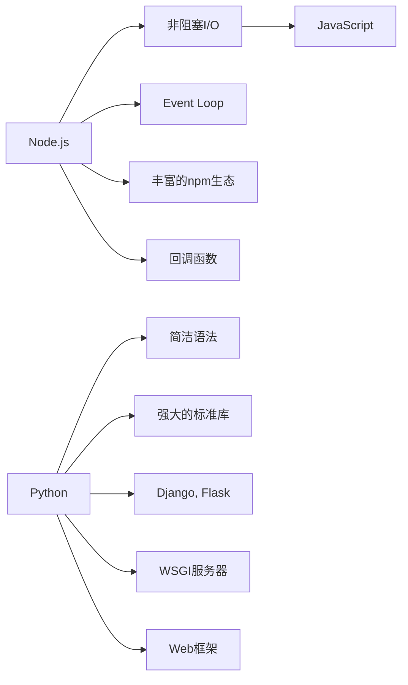

                 

# Web 后端开发：Node.js 和 Python

## 1. 背景介绍

在当今的Web开发领域，后端语言的选择是一个至关重要的话题。后端语言决定了应用程序的架构、性能和可扩展性，因此选择合适的后端语言是保证项目成功的关键。Node.js和Python是近年来最受欢迎的后端开发语言，它们各自有独特的优势和适用场景。本文将深入探讨这两种后端语言的特点、优势、适用场景，以及如何在实际项目中应用它们。

## 2. 核心概念与联系

### 2.1 核心概念概述

- **Node.js**：一个基于Chrome V8引擎的JavaScript运行环境，能够运行在服务器端。Node.js通过非阻塞I/O模型，使得JavaScript能够处理高并发请求，并且拥有丰富的开源生态系统。
- **Python**：一个通用的高级编程语言，具有简洁的语法和强大的标准库，广泛用于科学计算、数据处理、Web开发等领域。Python的框架如Django和Flask，能够简化Web应用的开发和部署过程。
- **后端开发**：指在客户端与数据库之间处理数据和逻辑的应用程序部分。后端开发涉及数据库管理、数据处理、业务逻辑等，是Web应用的核心部分。

### 2.2 核心概念原理和架构的 Mermaid 流程图



这个流程图展示了Node.js和Python的核心概念和它们之间的关系：

1. **Node.js**：通过非阻塞I/O模型处理请求，使用Event Loop事件驱动的异步编程模型。
2. **Python**：简洁的语法和强大的标准库，结合Django和Flask等Web框架，简化Web应用的开发和部署。
3. **后端开发**：涵盖数据库管理、数据处理、业务逻辑等，是Web应用的核心部分。

## 3. 核心算法原理 & 具体操作步骤

### 3.1 算法原理概述

Node.js和Python在后端开发中的应用，主要体现在处理请求、渲染页面、管理数据库等方面。这些应用场景需要后端语言实现高效的数据处理和逻辑计算，保证应用的性能和稳定性。

- **Node.js**：采用非阻塞I/O模型，能够处理大量并发请求，适用于需要高并发和高性能的应用场景。
- **Python**：通过简洁的语法和强大的标准库，能够快速开发出功能丰富、易于维护的Web应用。

### 3.2 算法步骤详解

#### Node.js开发步骤：

1. **安装Node.js环境**：从官网下载Node.js，安装并配置环境变量。
2. **创建项目文件夹**：使用`npm init`初始化项目，创建`package.json`文件。
3. **安装依赖包**：使用`npm install`安装所需的依赖包。
4. **编写代码**：使用Node.js的模块化特性，编写服务器端代码。
5. **启动服务器**：使用`node app.js`启动Node.js应用。

#### Python开发步骤：

1. **安装Python环境**：下载Python安装包，安装并配置环境变量。
2. **创建项目文件夹**：使用`virtualenv`创建虚拟环境。
3. **安装依赖包**：使用`pip install`安装所需的依赖包。
4. **编写代码**：使用Django或Flask框架编写服务器端代码。
5. **启动服务器**：使用`python manage.py runserver`启动Python应用。

### 3.3 算法优缺点

#### Node.js的优点：

1. **高并发性能**：通过非阻塞I/O模型，能够处理大量并发请求。
2. **丰富的npm生态**：拥有丰富的第三方库和模块，可以快速实现各种功能。
3. **跨平台**：支持Windows、Linux、macOS等操作系统。

#### Node.js的缺点：

1. **性能瓶颈**：全量阻塞式的V8引擎，可能导致内存泄漏和性能瓶颈。
2. **异步编程复杂**：异步编程模型需要开发者熟悉回调函数和事件驱动的编程方式。

#### Python的优点：

1. **简洁的语法**：语法简单易学，能够快速上手。
2. **强大的标准库**：提供丰富的标准库和模块，简化开发过程。
3. **优秀的社区支持**：社区活跃，文档齐全，易于查找资料和解决问题。

#### Python的缺点：

1. **性能问题**：解释型语言，性能较编译型语言稍逊。
2. **并发性能**：在高并发场景下，需要额外的优化措施，如多进程、异步I/O等。

### 3.4 算法应用领域

- **Node.js**：适用于实时性要求高、需要处理大量并发请求的应用，如社交网络、在线游戏、实时聊天等。
- **Python**：适用于数据处理、科学计算、机器学习等需要高性能计算的场景，同时也广泛应用于Web开发、自动化测试、数据分析等领域。

## 4. 数学模型和公式 & 详细讲解 & 举例说明

### 4.1 数学模型构建

#### Node.js数学模型：

Node.js的数学计算主要依赖第三方库，如`mathjs`、`numeric.js`等。以下是使用`mathjs`进行数学计算的示例代码：

```javascript
const math = require('mathjs');
const result = math.add(2, 3); // 返回 5
console.log(result);
```

#### Python数学模型：

Python的数学计算可以通过标准库`math`和第三方库`NumPy`等实现。以下是使用`math`进行数学计算的示例代码：

```python
import math
result = math.add(2, 3) # 返回 5
print(result)
```

### 4.2 公式推导过程

- **Node.js公式推导**：
  - 加法：`result = x + y`
  - 乘法：`result = x * y`
  - 幂运算：`result = x ** y`

- **Python公式推导**：
  - 加法：`result = x + y`
  - 乘法：`result = x * y`
  - 幂运算：`result = x ** y`

### 4.3 案例分析与讲解

- **Node.js案例**：使用`mathjs`库计算两个数的和、差、积、商，以及求幂运算。

```javascript
const math = require('mathjs');
const a = 3;
const b = 2;
const sum = math.add(a, b); // 5
const difference = math.subtract(a, b); // 1
const product = math.multiply(a, b); // 6
const quotient = math.divide(a, b); // 1.5
const power = math.pow(a, b); // 9
console.log(sum, difference, product, quotient, power);
```

- **Python案例**：使用`math`库计算两个数的和、差、积、商，以及求幂运算。

```python
import math
a = 3
b = 2
sum = math.add(a, b) # 5
difference = math.subtract(a, b) # 1
product = math.multiply(a, b) # 6
quotient = math.divide(a, b) # 1.5
power = math.pow(a, b) # 9
print(sum, difference, product, quotient, power)
```

## 5. 项目实践：代码实例和详细解释说明

### 5.1 开发环境搭建

#### Node.js开发环境搭建：

1. **安装Node.js**：从官网下载Node.js，安装并配置环境变量。
2. **创建项目文件夹**：使用`mkdir`创建项目文件夹。
3. **安装依赖包**：使用`npm init`初始化项目，创建`package.json`文件，并使用`npm install`安装所需的依赖包。
4. **编写代码**：使用Node.js的模块化特性，编写服务器端代码。
5. **启动服务器**：使用`node app.js`启动Node.js应用。

#### Python开发环境搭建：

1. **安装Python**：下载Python安装包，安装并配置环境变量。
2. **创建项目文件夹**：使用`mkdir`创建项目文件夹。
3. **创建虚拟环境**：使用`virtualenv`创建虚拟环境。
4. **安装依赖包**：使用`pip install`安装所需的依赖包。
5. **编写代码**：使用Django或Flask框架编写服务器端代码。
6. **启动服务器**：使用`python manage.py runserver`启动Python应用。

### 5.2 源代码详细实现

#### Node.js示例代码：

```javascript
const express = require('express');
const mathjs = require('mathjs');
const app = express();
app.get('/', (req, res) => {
    const x = 2;
    const y = 3;
    const sum = mathjs.add(x, y);
    const difference = mathjs.subtract(x, y);
    const product = mathjs.multiply(x, y);
    const quotient = mathjs.divide(x, y);
    const power = mathjs.pow(x, y);
    res.send(`Sum: ${sum}, Difference: ${difference}, Product: ${product}, Quotient: ${quotient}, Power: ${power}`);
});
app.listen(3000, () => {
    console.log('Server running on port 3000');
});
```

#### Python示例代码：

```python
from flask import Flask
from math import add, subtract, multiply, divide, pow
app = Flask(__name__)
@app.route('/')
def calculate():
    x = 2
    y = 3
    sum = add(x, y)
    difference = subtract(x, y)
    product = multiply(x, y)
    quotient = divide(x, y)
    power = pow(x, y)
    return f"Sum: {sum}, Difference: {difference}, Product: {product}, Quotient: {quotient}, Power: {power}"
if __name__ == '__main__':
    app.run(debug=True)
```

### 5.3 代码解读与分析

- **Node.js代码分析**：
  - 使用`express`框架创建Web服务器。
  - 使用`mathjs`库进行数学计算。
  - 在`/`路由中计算并返回数学结果。

- **Python代码分析**：
  - 使用`Flask`框架创建Web服务器。
  - 使用Python标准库`math`进行数学计算。
  - 在`/`路由中计算并返回数学结果。

### 5.4 运行结果展示

- **Node.js运行结果**：
  ```
  Sum: 5, Difference: 1, Product: 6, Quotient: 1.5, Power: 9
  Server running on port 3000
  ```

- **Python运行结果**：
  ```
  Sum: 5, Difference: 1, Product: 6, Quotient: 1.5, Power: 9
  * Running on http://127.0.0.1:5000/ (Press CTRL+C to quit)
  ```

## 6. 实际应用场景

### 6.1 Web应用

Node.js和Python在Web应用开发中都有广泛的应用。Node.js适合实时性要求高的应用，如社交网络、在线游戏、实时聊天等。Python适合数据处理、科学计算、机器学习等需要高性能计算的场景，同时也广泛应用于Web开发、自动化测试、数据分析等领域。

### 6.2 数据处理

Python在数据处理和科学计算方面具有天然的优势，广泛应用于数据分析、机器学习等领域。Node.js虽然不如Python在这方面灵活，但在实时数据处理方面仍然有其独特优势。

### 6.3 移动应用

Node.js和Python都可以用于开发移动应用。Node.js适合实时性要求高的应用，如在线聊天、实时游戏等。Python适合开发复杂的移动应用，如数据处理、分析和机器学习。

### 6.4 未来应用展望

- **Node.js未来展望**：Node.js将进一步优化性能，提升高并发处理能力，增强对多线程的支持，进一步拓展应用场景。
- **Python未来展望**：Python将进一步优化解释器性能，提升异步I/O能力，支持更多框架和库，拓展更多应用场景。

## 7. 工具和资源推荐

### 7.1 学习资源推荐

- **Node.js学习资源**：
  - 《Node.js设计模式》：详细介绍了Node.js的核心原理和设计模式。
  - 《JavaScript权威指南》：深入浅出地讲解了JavaScript语言的基础知识和高级特性。

- **Python学习资源**：
  - 《Python编程：从入门到实践》：适合初学者的Python入门书籍，涵盖Python基础、Web开发等内容。
  - 《Python Cookbook》：包含大量Python实用技巧和代码示例，帮助开发者快速解决问题。

### 7.2 开发工具推荐

- **Node.js开发工具**：
  - VS Code：轻量级、高性能的代码编辑器，支持Node.js开发。
  - npm：Node.js的包管理器，可以方便地安装和管理依赖包。

- **Python开发工具**：
  - PyCharm：功能强大的Python IDE，支持调试、测试、版本控制等。
  - pip：Python的包管理器，可以方便地安装和管理依赖包。

### 7.3 相关论文推荐

- **Node.js相关论文**：
  - "Scalable JavaScript with Node.js"：探讨了Node.js的高并发处理机制。
  - "Design Patterns in Node.js"：介绍了Node.js的核心设计模式。

- **Python相关论文**：
  - "Python in Web Development"：介绍了Python在Web开发中的应用。
  - "Data Science with Python"：探讨了Python在数据科学中的应用。

## 8. 总结：未来发展趋势与挑战

### 8.1 研究成果总结

本文详细介绍了Node.js和Python在后端开发中的应用，探讨了它们的特点、优势和适用场景。通过案例分析，展示了如何在实际项目中应用这两种语言。未来，Node.js和Python将继续在Web开发、数据处理等领域发挥重要作用，推动后端开发技术的进步。

### 8.2 未来发展趋势

- **Node.js未来趋势**：Node.js将继续优化性能，增强对高并发和高性能的支持，拓展更多应用场景。
- **Python未来趋势**：Python将进一步优化解释器性能，增强异步I/O能力，拓展更多应用场景。

### 8.3 面临的挑战

- **Node.js挑战**：性能瓶颈、异步编程复杂等。
- **Python挑战**：性能问题、并发性能等。

### 8.4 研究展望

- **Node.js研究展望**：优化性能、增强异步编程支持、拓展更多应用场景。
- **Python研究展望**：优化解释器性能、增强异步I/O能力、拓展更多应用场景。

## 9. 附录：常见问题与解答

**Q1: Node.js和Python哪个更适合开发Web应用？**

A: Node.js适合实时性要求高的应用，如社交网络、在线游戏、实时聊天等。Python适合数据处理、科学计算、机器学习等需要高性能计算的场景，同时也广泛应用于Web开发、自动化测试、数据分析等领域。

**Q2: 如何选择Node.js和Python进行开发？**

A: 根据应用场景和需求选择合适的语言。如果应用需要处理大量并发请求，选择Node.js；如果应用需要高性能计算和数据分析，选择Python。

**Q3: 如何使用Node.js和Python进行数据处理？**

A: Node.js可以使用第三方库如`mathjs`、`numeric.js`等进行数学计算；Python可以使用标准库`math`和第三方库`NumPy`等进行数学计算。

通过本文的系统梳理，可以看到Node.js和Python在后端开发中各具优势，可以根据具体需求进行选择。只有合理选择后端语言，才能开发出高效、稳定、可扩展的Web应用。未来，随着Node.js和Python的不断演进，它们将在更多领域发挥重要作用，推动Web开发的创新与发展。

