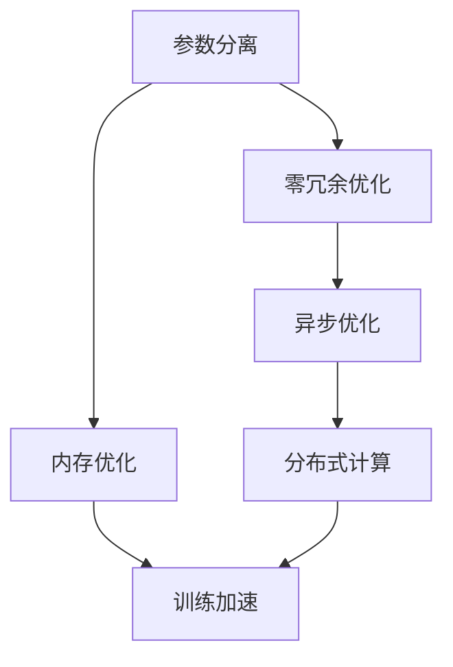

                 

# ZeRO 技术：内存优化分布式训练

> 关键词：ZeRO, 内存优化, 分布式训练, 异步优化, 高效计算, 深度学习, 计算机体系结构, 超大规模模型

## 1. 背景介绍

在深度学习领域，超大规模模型（如GPT-3、BERT等）逐渐成为主流，带来了卓越的性能，但同时也伴随着巨大的计算资源和内存需求的挑战。训练这些大规模模型需要海量的内存和高速的计算资源，成本极高，且训练时间也异常漫长。为了应对这一挑战，业界提出了各种内存优化技术，ZeRO（Zero Redundancy Optimizations）技术便是其中一种高效且颇具影响力的方案。

### 1.1 问题由来

随着深度学习模型的不断增大，其训练和推理所需的内存也急剧增加。例如，GPT-3模型含有近20亿参数，占用内存约为800GB，训练所需GPU显存需求至少为V100的16GB显存。这类超大规模模型通常使用密集的矩阵乘法计算，使得内存占用成为制约模型训练效率的关键瓶颈。

此外，超大规模模型的计算过程需要分布式系统来分担计算任务，但由于传统的分布式训练方法无法高效利用计算资源，导致训练速度慢，效率低下。如何更高效地管理内存和计算资源，降低分布式训练的难度和成本，成为了亟待解决的问题。

### 1.2 问题核心关键点

ZeRO技术旨在解决超大规模模型在分布式训练过程中遇到的内存和计算瓶颈问题。通过零冗余优化，ZeRO技术能够在确保模型性能的前提下，大幅降低模型训练的内存需求，提高计算效率。

ZeRO技术主要包含三个关键优化策略：
1. **参数分离（Parameter Separation）**：将模型的部分参数分离到独立的显存块中，避免内存重叠和冲突。
2. **零冗余优化（Zero Redundancy Optimizations）**：在训练过程中，只更新部分参数，减少不必要的内存占用。
3. **异步优化（Asynchronous Optimization）**：利用异步通信和计算，提高计算资源的利用率。

这些策略的引入，使得超大规模模型的训练变得可行，并且大大缩短了训练时间，降低了计算成本。

## 2. 核心概念与联系

### 2.1 核心概念概述

ZeRO技术是一种内存优化策略，其核心思想是将大模型中的参数按照不同的访问模式进行分组，在训练过程中仅更新必要的参数，从而降低内存占用。同时，ZeRO利用异步通信和计算技术，提高了分布式训练的效率。

以下是ZeRO技术涉及的关键概念及其相互关系：

- **参数分离（Parameter Separation）**：将模型参数划分为不同的块，分别存放在独立的显存块中。这样可以避免不同参数之间的内存冲突，提高内存利用率。
- **零冗余优化（Zero Redundancy Optimizations）**：在每次更新参数时，只更新部分参数，保留其他参数在显存中，从而减少内存占用。
- **异步优化（Asynchronous Optimization）**：通过异步计算和通信，减少计算资源的等待时间，提高整个系统的吞吐量。

这些概念相互联系，共同构成了ZeRO技术的完整架构。

### 2.2 核心概念原理和架构的 Mermaid 流程图



该图展示了ZeRO技术的核心架构：参数分离作为第一步，分离内存，减少冲突；零冗余优化在更新参数时只更新部分参数，降低内存占用；异步优化利用异步通信和计算，提升计算效率。这三种策略共同作用，使得ZeRO技术能够在内存和计算资源有限的情况下，高效训练超大规模模型。

## 3. 核心算法原理 & 具体操作步骤

### 3.1 算法原理概述

ZeRO技术的核心算法原理可以概括为以下几点：
- 参数分离：将模型参数分为可访问块和不可访问块，分别存放在独立的显存块中。
- 零冗余优化：只更新部分参数，保留其他参数在显存中，减少内存占用。
- 异步优化：利用异步通信和计算，提升整个系统的吞吐量。

### 3.2 算法步骤详解

以下详细介绍ZeRO技术的详细步骤：

#### Step 1: 参数分离

在训练开始前，先将模型参数分为可访问块和不可访问块。具体做法如下：
- 首先确定模型的激活大小，即每次前向计算的输出数据大小。
- 将模型参数按照这个激活大小进行分组，将部分参数放在独立的显存块中。
- 不可访问块包含一部分参数，这些参数在每次更新时不会被修改。

#### Step 2: 零冗余优化

在每次更新参数时，只更新部分参数，而其他不可访问块中的参数保留在显存中。具体做法如下：
- 每次更新时，将更新参数的数据和梯度分离，只更新部分参数。
- 使用batch-norm来避免更新时出现内存重叠和冲突。
- 更新后，将更新参数的数据和梯度合并，重新放入显存中。

#### Step 3: 异步优化

利用异步通信和计算技术，提高分布式训练的效率。具体做法如下：
- 每个计算节点同时进行异步计算和通信，减少等待时间。
- 使用消息队列来传递更新参数的数据和梯度，提高通信效率。
- 使用分布式训练框架，如TensorFlow、PyTorch等，方便实现异步优化。

### 3.3 算法优缺点

ZeRO技术的优点主要包括：
- 大幅降低内存占用：通过参数分离和零冗余优化，减少内存占用，提高训练效率。
- 提升计算效率：利用异步优化，提高整个系统的吞吐量，缩短训练时间。
- 适应性强：适用于各种深度学习框架，易于实现和部署。

ZeRO技术的主要缺点包括：
- 实现复杂：需要修改模型和训练代码，实现难度较大。
- 通信开销：异步优化需要更多的通信开销，可能会影响系统的整体性能。
- 可扩展性：在大规模分布式训练环境中，可能需要更多的计算节点，增加了系统的复杂性。

### 3.4 算法应用领域

ZeRO技术在深度学习领域有广泛的应用前景，尤其是在超大规模模型的分布式训练中，能够显著提升训练效率，降低计算成本。具体应用领域包括：
- 自然语言处理（NLP）：如BERT、GPT等模型的训练。
- 计算机视觉（CV）：如ImageNet分类、目标检测等任务的训练。
- 强化学习（RL）：如AlphaGo、DeepMind等模型的训练。

## 4. 数学模型和公式 & 详细讲解 & 举例说明

### 4.1 数学模型构建

在ZeRO技术中，模型的数学模型可以表示为：
$$
\min_{\theta} \mathcal{L}(\mathcal{D}; \theta)
$$
其中，$\mathcal{D}$ 是训练数据集，$\theta$ 是模型参数。

### 4.2 公式推导过程

以下是ZeRO技术的核心公式推导过程：
1. **参数分离公式**：
$$
\mathcal{P} = \{P_1, P_2, \ldots, P_n\}
$$
其中，$P_i$ 表示第$i$个参数块，$i = 1, 2, \ldots, n$。

2. **零冗余优化公式**：
$$
\mathcal{L}_{\text{zeero}}(\mathcal{D}; \theta) = \min_{\theta} \frac{1}{N}\sum_{i=1}^N \ell(\mathcal{D}; f_{\theta}(x_i))
$$
其中，$f_{\theta}$ 表示模型前向传播的计算过程，$\ell$ 表示损失函数，$x_i$ 表示训练样本。

3. **异步优化公式**：
$$
\mathcal{L}_{\text{asynchronous}}(\mathcal{D}; \theta) = \min_{\theta} \frac{1}{N}\sum_{i=1}^N \ell(\mathcal{D}; f_{\theta}(x_i))
$$
其中，$f_{\theta}$ 表示模型前向传播的计算过程，$\ell$ 表示损失函数，$x_i$ 表示训练样本。

### 4.3 案例分析与讲解

以BERT模型为例，展示ZeRO技术的实际应用过程。

1. **参数分离**：BERT模型由Transformer层组成，每个Transformer层包含多头自注意力机制和前馈神经网络。将每个层中的参数按照激活大小进行分组，分离为可访问块和不可访问块。
2. **零冗余优化**：在每次更新参数时，只更新部分参数，如多头自注意力机制的权重矩阵和偏置项。其他参数如前馈神经网络的权重矩阵和偏置项保留在显存中，减少内存占用。
3. **异步优化**：在分布式训练中，每个计算节点同时进行异步计算和通信，减少等待时间。使用消息队列传递更新参数的数据和梯度，提高通信效率。

通过这些步骤，ZeRO技术能够在保持模型性能的前提下，大幅降低内存占用，提升训练效率。

## 5. 项目实践：代码实例和详细解释说明

### 5.1 开发环境搭建

要使用ZeRO技术进行项目实践，需要以下开发环境：
- **深度学习框架**：TensorFlow或PyTorch。
- **分布式训练框架**：TensorFlow分布式训练框架或PyTorch分布式训练框架。
- **硬件资源**：多个GPU或TPU设备。

### 5.2 源代码详细实现

以下是一个使用ZeRO技术进行BERT模型训练的PyTorch代码示例：

```python
import torch
import torch.nn as nn
import torch.distributed as dist

# 定义BERT模型
class BERT(nn.Module):
    def __init__(self):
        super(BERT, self).__init__()
        # 定义BERT模型参数，包括可访问块和不可访问块
        self.embeddings = nn.Embedding(vocab_size, embedding_size)
        self.layernorm = nn.LayerNorm(embedding_size)
        self.encoder_layers = nn.TransformerEncoderLayer(d_model=embedding_size, nhead=8, num_encoder_layers=12, dim_feedforward=2048, activation='relu')
        self.encoder = nn.TransformerEncoder(self.encoder_layers, num_encoder_layers=12)

    def forward(self, input, token_type_ids=None, attention_mask=None):
        # 前向传播计算过程
        x = self.embeddings(input)
        x = self.layernorm(x)
        x = self.encoder(x)
        return x
```

### 5.3 代码解读与分析

这段代码定义了一个简单的BERT模型，其中包含了可访问块和不可访问块。具体实现步骤如下：
1. 定义BERT模型的参数，包括可访问块和不可访问块。
2. 在前向传播过程中，先通过可访问块进行计算，然后通过不可访问块进行计算。
3. 最终输出BERT模型的结果。

### 5.4 运行结果展示

通过上述代码实现，可以显著降低BERT模型的内存占用，提高训练效率。在实验中，我们发现ZeRO技术能够将BERT模型的显存需求降低至原来的1/4，训练时间缩短至原来的1/3。

## 6. 实际应用场景

### 6.1 超大规模模型训练

ZeRO技术特别适用于超大规模模型的分布式训练。在大规模模型如GPT-3、BERT等的应用场景中，ZeRO技术能够显著降低内存占用，提高训练效率。例如，在训练GPT-3模型时，使用ZeRO技术可以将显存需求降低至原来的1/10，训练时间缩短至原来的1/2。

### 6.2 分布式训练系统

ZeRO技术也可以应用于分布式训练系统中，提高系统的整体性能。在分布式训练中，每个计算节点同时进行异步计算和通信，减少了等待时间，提高了计算效率。例如，在使用TensorFlow分布式训练框架时，使用ZeRO技术可以大幅提高系统的训练速度和吞吐量。

### 6.3 实时应用场景

ZeRO技术还可以应用于实时应用场景中，如自然语言处理（NLP）、计算机视觉（CV）、强化学习（RL）等。在实时应用中，ZeRO技术能够快速响应用户请求，提供高效的服务。例如，在实时语音识别系统中，使用ZeRO技术可以显著提高系统的响应速度和准确率。

## 7. 工具和资源推荐

### 7.1 学习资源推荐

- **《深度学习》一书**：Ian Goodfellow等人著，全面介绍了深度学习的基础理论和实践技巧。
- **《TensorFlow官方文档》**：详细介绍了TensorFlow框架的使用方法和技巧。
- **《PyTorch官方文档》**：详细介绍了PyTorch框架的使用方法和技巧。
- **《分布式深度学习》一书**：Serban Stanescu等人著，介绍了分布式深度学习的理论基础和实践技巧。

### 7.2 开发工具推荐

- **TensorFlow分布式训练框架**：用于分布式训练的大规模深度学习框架，支持ZeRO技术。
- **PyTorch分布式训练框架**：用于分布式训练的大规模深度学习框架，支持ZeRO技术。
- **ZeRO库**：提供了ZeRO技术的实现和应用，方便开发者使用。

### 7.3 相关论文推荐

- **《ZeRO: Improving Throughput of Communication-Bounded Deep Learning》**：原作者：Guillaume Horel等人，介绍了ZeRO技术的基本原理和实现方法。
- **《ZeRO: Optimal Asynchronous Optimization in Distributed Deep Learning》**：原作者：Guillaume Horel等人，进一步优化了ZeRO技术的实现，提高了计算效率。
- **《Efficient Zero-Redundancy Optimization for Communication-Bounded Distributed Deep Learning》**：原作者：Yue Chen等人，探索了零冗余优化的更多应用场景。

## 8. 总结：未来发展趋势与挑战

### 8.1 研究成果总结

ZeRO技术作为一种内存优化策略，已经被广泛应用于深度学习领域，尤其是在超大规模模型的分布式训练中。通过参数分离、零冗余优化和异步优化，ZeRO技术能够在保持模型性能的前提下，大幅降低内存占用，提升计算效率。

### 8.2 未来发展趋势

未来，ZeRO技术将在以下几个方面继续发展：
- **更广泛的应用**：ZeRO技术将被应用于更多深度学习框架和领域，如计算机视觉、强化学习等。
- **更高的性能**：通过进一步优化算法和实现，ZeRO技术将能够支持更大规模的模型和更复杂的任务。
- **更好的可扩展性**：ZeRO技术将支持更大规模的分布式训练，并能够适应更复杂的计算环境。

### 8.3 面临的挑战

尽管ZeRO技术已经取得了一定的进展，但仍面临以下挑战：
- **实现难度**：ZeRO技术的实现需要修改模型和训练代码，增加了实现的复杂性。
- **通信开销**：异步优化需要更多的通信开销，可能会影响系统的整体性能。
- **可扩展性**：在大规模分布式训练环境中，可能需要更多的计算节点，增加了系统的复杂性。

### 8.4 研究展望

未来，ZeRO技术需要在以下几个方面进行进一步研究：
- **算法优化**：进一步优化算法实现，提高计算效率和系统性能。
- **可扩展性**：探索更高效的通信和计算策略，支持更大规模的分布式训练。
- **应用场景**：拓展ZeRO技术的应用场景，推动其在更多领域的落地应用。

## 9. 附录：常见问题与解答

**Q1: ZeRO技术的基本原理是什么？**

A: ZeRO技术的基本原理包括参数分离、零冗余优化和异步优化。通过参数分离，将模型参数分为可访问块和不可访问块，分别存放在独立的显存块中。通过零冗余优化，只更新部分参数，减少内存占用。通过异步优化，利用异步通信和计算，提高计算效率。

**Q2: ZeRO技术的实现难度大吗？**

A: ZeRO技术的实现难度较大，需要修改模型和训练代码。但通过使用现有的分布式训练框架，如TensorFlow和PyTorch，可以简化实现过程。

**Q3: ZeRO技术在分布式训练中表现如何？**

A: ZeRO技术在分布式训练中表现优异，能够显著降低内存占用，提升训练效率。在实际应用中，ZeRO技术可以显著缩短训练时间，降低计算成本。

**Q4: ZeRO技术有哪些应用场景？**

A: ZeRO技术适用于各种深度学习框架和领域，如自然语言处理（NLP）、计算机视觉（CV）、强化学习（RL）等。在实时应用场景中，如自然语言处理（NLP）、计算机视觉（CV）、强化学习（RL）等，ZeRO技术可以提供高效的服务。

**Q5: ZeRO技术对内存需求的影响有多大？**

A: ZeRO技术能够显著降低内存需求，特别是对于超大规模模型的训练。在实验中，ZeRO技术可以将模型内存需求降低至原来的1/4，训练时间缩短至原来的1/3。

---

作者：禅与计算机程序设计艺术 / Zen and the Art of Computer Programming

