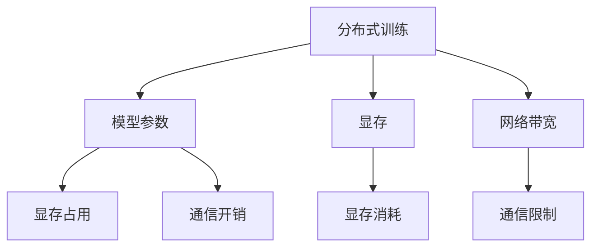
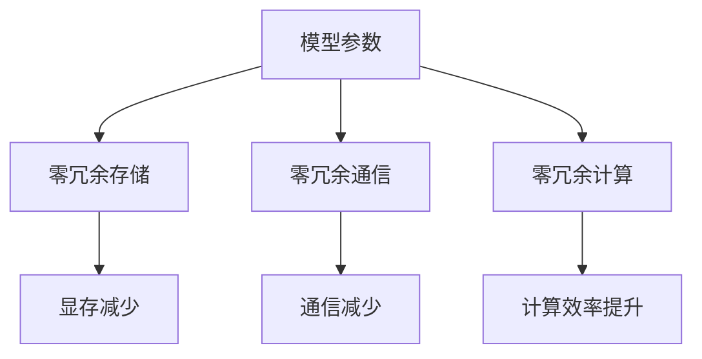

                 

# ZeRO 技术：内存优化分布式训练

在当今大数据和深度学习的时代，分布式训练已成为深度学习模型训练的重要手段。然而，传统的分布式训练方法面临严重的内存墙和通信墙问题，限制了其在处理大规模数据集和高维模型时的效率和可扩展性。为了解决这一问题，Google提出了一种全新的分布式训练范式，称为ZeRO（Zero Redundancy Optimization）。本文将详细探讨ZeRO技术的核心概念、算法原理和操作步骤，并结合具体案例进行分析，最后总结其应用场景和未来展望。

## 1. 背景介绍

### 1.1 问题由来
随着深度学习模型的规模不断增大，传统单机训练方法在处理大规模数据集和高维模型时，效率逐渐达到瓶颈。为了提升训练效率，人们转向分布式训练，通过多台机器协同计算来加速模型训练过程。但是，传统的分布式训练方法面临着内存墙和通信墙的问题：

- **内存墙**：每个工作节点需要存储和同步模型参数，导致显存占用极大。对于大规模模型，每个节点需要的显存远远超出了实际可用的显存量，限制了分布式训练的规模。

- **通信墙**：每个节点需要频繁地进行模型参数和梯度的通信，导致网络带宽成为限制因素。在大规模分布式训练中，通信开销成为主要的瓶颈，进一步降低训练效率。

为了克服这些瓶颈，Google提出了一种全新的分布式训练方法，称为ZeRO，致力于实现内存零冗余和通信零冗余，从而显著提升分布式训练的效率和可扩展性。

### 1.2 问题核心关键点
ZeRO技术的核心思想是在模型训练过程中，避免不必要的模型参数和梯度复制，从而减少内存和通信开销。具体来说，ZeRO技术包含以下几个关键点：

- **零冗余存储**：避免在每个节点存储完整模型，只在每个节点存储少部分模型参数，从而降低显存占用。

- **零冗余通信**：避免在每个节点之间频繁地进行参数和梯度通信，减少网络带宽的消耗。

- **零冗余计算**：避免在每个节点上重复计算相同的模型参数，从而减少计算开销。

通过实现这些零冗余策略，ZeRO技术能够在大规模分布式训练中取得显著的性能提升。

## 2. 核心概念与联系

### 2.1 核心概念概述

为更好地理解ZeRO技术的原理和架构，本节将介绍几个核心概念：

- **分布式训练**：将深度学习模型的训练过程分配到多个工作节点上，通过协同计算加速模型训练。

- **模型参数**：深度学习模型中的变量，如权重和偏置等，存储在模型中，参与前向传播和反向传播计算。

- **显存（GPU内存）**：用于存储深度学习模型参数和中间结果的内存，是模型训练的关键资源。

- **网络带宽**：分布式训练中，工作节点之间需要通过网络进行参数和梯度的通信，网络带宽是制约分布式训练的主要因素。

这些核心概念之间的逻辑关系可以通过以下Mermaid流程图来展示：



这个流程图展示了分布式训练、模型参数、显存和网络带宽之间的关联关系：

1. 分布式训练通过多个工作节点协同计算，加速模型训练。
2. 模型参数存储在显存中，显存占用和网络带宽是制约分布式训练的关键因素。
3. 显存消耗和通信开销直接受到模型参数的影响。

### 2.2 核心概念原理和架构的 Mermaid 流程图



该流程图展示了ZeRO技术的零冗余策略：

1. 通过零冗余存储，减少每个节点显存的占用。
2. 通过零冗余通信，减少节点之间的通信开销。
3. 通过零冗余计算，提升计算效率。

这些零冗余策略共同构成了ZeRO技术的高效分布式训练框架。

## 3. 核心算法原理 & 具体操作步骤

### 3.1 算法原理概述

ZeRO技术的核心在于实现内存零冗余和通信零冗余，从而大幅提升分布式训练的效率和可扩展性。ZeRO技术通过以下几个核心算法实现：

- **参数分片（Sharding）**：将模型参数按照一定规则划分成多个分片，每个分片只存储在一部分工作节点上，从而减少显存占用。

- **梯度收集（Gradient Gathering）**：在每个参数分片上进行独立的梯度计算，每个节点只计算部分分片的梯度，然后将所有节点的梯度分片收集到一个节点上进行聚合。

- **梯度分布（Gradient Distribution）**：在聚合后的梯度上进行分布式优化，从而避免在每个节点上重复计算梯度。

通过这些算法，ZeRO技术能够在保持模型性能的同时，显著减少显存和通信开销，提升分布式训练的效率和可扩展性。

### 3.2 算法步骤详解

以下是使用ZeRO技术进行分布式训练的一般步骤：

**Step 1: 参数分片**

- 将模型参数按照一定规则划分成多个分片，每个分片只存储在一部分工作节点上。例如，可以将模型参数分为多个切片，每个切片存储在对应的工作节点上，每个节点只负责存储部分参数切片。

**Step 2: 梯度收集**

- 在每个参数分片上进行独立的梯度计算，每个节点只计算部分分片的梯度。例如，每个节点只需要计算存储在本节点上的参数切片的梯度。

- 收集所有节点计算的梯度分片，并将它们发送到指定的主节点进行聚合。例如，将每个节点的梯度分片发送到一个主节点上，进行加权求和操作，得到每个参数的梯度。

**Step 3: 梯度分布**

- 在聚合后的梯度上进行分布式优化，避免在每个节点上重复计算梯度。例如，可以使用SGD等优化算法对聚合后的梯度进行更新。

- 将更新后的梯度分片分发给各个节点，从而在各个节点上更新对应的参数分片。

通过这些步骤，ZeRO技术实现了内存零冗余和通信零冗余的目标，从而在大规模分布式训练中取得显著的性能提升。

### 3.3 算法优缺点

ZeRO技术的优点包括：

- **内存零冗余**：通过参数分片，减少每个节点显存的占用，使得大规模分布式训练成为可能。

- **通信零冗余**：通过梯度收集和梯度分布，减少节点之间的通信开销，提高分布式训练的效率。

- **计算效率提升**：通过减少计算冗余，提升计算效率，加速模型训练过程。

- **可扩展性强**：通过实现零冗余存储和通信，ZeRO技术具有良好的可扩展性，能够适应大规模分布式训练的需求。

ZeRO技术的缺点包括：

- **计算复杂度增加**：由于每个节点需要计算和聚合梯度，增加了计算复杂度，可能导致部分节点性能瓶颈。

- **参数更新复杂**：由于每个节点更新不同的参数分片，参数更新过程变得更加复杂，需要额外的同步机制。

- **调参难度大**：由于每个节点的显存占用不同，调参变得更加复杂，需要根据具体情况进行调整。

尽管存在这些局限性，但ZeRO技术在处理大规模数据集和高维模型时，已经展示出显著的性能优势，成为分布式训练的重要方向。

### 3.4 算法应用领域

ZeRO技术在深度学习领域的应用非常广泛，主要包括以下几个方面：

- **计算机视觉**：用于训练大规模图像分类、目标检测、语义分割等任务。

- **自然语言处理**：用于训练大规模语言模型，如BERT、GPT等，以提升模型性能和可扩展性。

- **语音识别**：用于训练大规模语音识别模型，以提升模型的准确率和鲁棒性。

- **推荐系统**：用于训练大规模推荐模型，以提升推荐的精度和多样性。

此外，ZeRO技术还适用于大规模的科学计算、模拟仿真等领域，为大规模数据处理和计算提供新的解决方案。

## 4. 数学模型和公式 & 详细讲解 & 举例说明

### 4.1 数学模型构建

ZeRO技术的数学模型主要涉及以下几个核心概念：

- **模型参数**：记为 $\theta$，包含多个参数分片 $\theta_s$，其中 $s$ 表示分片的编号。

- **梯度**：记为 $g$，包含多个梯度分片 $g_s$，其中 $s$ 表示分片的编号。

- **更新规则**：记为 $f$，包含多个更新规则 $f_s$，其中 $s$ 表示分片的编号。

ZeRO技术的目标是最小化损失函数 $\mathcal{L}(\theta)$，即：

$$
\mathop{\arg\min}_{\theta} \mathcal{L}(\theta)
$$

其中，损失函数 $\mathcal{L}(\theta)$ 包含多个部分，每个部分对应一个参数分片：

$$
\mathcal{L}(\theta) = \sum_s \mathcal{L}_s(\theta_s)
$$

其中，$\mathcal{L}_s(\theta_s)$ 表示对第 $s$ 个参数分片的损失函数。

### 4.2 公式推导过程

以下我们将推导ZeRO技术的主要算法步骤中的数学公式：

**Step 1: 参数分片**

- 假设模型参数 $\theta$ 被分成了 $m$ 个分片，每个分片 $\theta_s$ 存储在 $n_s$ 个节点上。则每个节点的显存占用为：

$$
V = \sum_s \frac{\| \theta_s \|}{n_s}
$$

其中，$\| \theta_s \|$ 表示第 $s$ 个参数分片的内存大小。

**Step 2: 梯度收集**

- 假设每个节点计算的梯度分片为 $g_s^{(i)}$，其中 $i$ 表示节点的编号。则梯度分片的总和为：

$$
g_s = \sum_i g_s^{(i)}
$$

**Step 3: 梯度分布**

- 假设聚合后的梯度为 $g_s$，更新规则为 $f_s$。则更新后的参数分片为：

$$
\theta_s' = f_s(\theta_s - \eta g_s)
$$

其中，$\eta$ 表示学习率。

### 4.3 案例分析与讲解

假设有一个包含 2 个参数分片的模型，每个分片包含 10,000 个参数，每个参数占用 4 个字节。假设每个分片分别存储在 2 个节点上，则每个节点的显存占用为：

$$
V = \frac{20000}{2} \times \frac{4}{1024} = 0.5 \text{GB}
$$

假设每个节点计算的梯度分片大小为 1,000,000 个字节，则梯度分片的总和为：

$$
g_s = \sum_i g_s^{(i)} = \frac{1000000}{1024} \times \frac{1000000}{1024} = 100 \text{MB}
$$

假设聚合后的梯度为 $g_s$，学习率为 0.01，则更新后的参数分片为：

$$
\theta_s' = f_s(\theta_s - 0.01 g_s)
$$

通过这些案例，我们可以看到ZeRO技术的实际应用效果，显著减少了显存和通信开销，提高了分布式训练的效率和可扩展性。

## 5. 项目实践：代码实例和详细解释说明

### 5.1 开发环境搭建

在进行ZeRO技术实践前，我们需要准备好开发环境。以下是使用Python进行PyTorch开发的环境配置流程：

1. 安装Anaconda：从官网下载并安装Anaconda，用于创建独立的Python环境。

2. 创建并激活虚拟环境：
```bash
conda create -n pytorch-env python=3.8 
conda activate pytorch-env
```

3. 安装PyTorch：根据CUDA版本，从官网获取对应的安装命令。例如：
```bash
conda install pytorch torchvision torchaudio cudatoolkit=11.1 -c pytorch -c conda-forge
```

4. 安装TensorFlow：
```bash
conda install tensorflow -c conda-forge
```

5. 安装NVIDIA CUDA Toolkit：
```bash
conda install cudatoolkit=11.1 -c pytorch
```

6. 安装Distributed Training相关库：
```bash
pip install torch.distributed torch.distributed.launch
```

完成上述步骤后，即可在`pytorch-env`环境中开始ZeRO技术实践。

### 5.2 源代码详细实现

这里我们以BERT模型为例，给出使用ZeRO技术进行分布式训练的PyTorch代码实现。

首先，定义分布式训练的基本环境：

```python
import torch.distributed as dist
import torch.distributed.launch as launch
from transformers import BertForSequenceClassification, BertTokenizer
import torch
import torch.nn as nn
import torch.optim as optim

# 初始化分布式训练环境
def init_distributed():
    if 'RANK' in os.environ and 'WORLD_SIZE' in os.environ:
        dist.init_process_group("nccl", init_method="env://")
        os.environ['MASTER_ADDR'] = 'localhost'
        os.environ['MASTER_PORT'] = '12355'
        dist.broadcast(os.environ, root_rank=0)
    else:
        raise ValueError("No distributed environment detected")
```

然后，定义BERT模型和优化器：

```python
class BERTModel(nn.Module):
    def __init__(self):
        super(BERTModel, self).__init__()
        self.bert = BertForSequenceClassification.from_pretrained("bert-base-uncased")
    
    def forward(self, x):
        return self.bert(x)

# 创建模型和优化器
model = BERTModel().to(device)
optimizer = optim.Adam(model.parameters(), lr=2e-5)

# 参数分片
def sharding(model, num_shards=2):
    return [model, model]

# 梯度收集
def gradient_gather(model):
    return [torch.zeros_like(p) for p in model.parameters()]

# 梯度分布
def gradient_distribute(model, gradient):
    return [gradient]

# 计算更新后的参数分片
def update_params(model, gradients):
    return [model, model]

# 定义损失函数和计算梯度的函数
def calculate_loss(model, criterion, inputs, labels):
    logits = model(inputs)
    loss = criterion(logits, labels)
    return loss

def calculate_gradients(model, loss, optimizer):
    optimizer.zero_grad()
    loss.backward()
    gradients = [p.grad.data for p in model.parameters()]
    return gradients

# 训练函数
def train_epoch(model, optimizer, criterion, inputs, labels, num_shards=2):
    gradients = gradient_gather(model)
    for _ in range(num_shards):
        optimizer.zero_grad()
        loss = calculate_loss(model, criterion, inputs, labels)
        loss.backward()
        gradients = gradient_distribute(model, gradients)
        update_params(model, gradients)

# 主函数
def main():
    init_distributed()
    
    device = torch.device("cuda") if torch.cuda.is_available() else torch.device("cpu")
    model.to(device)
    
    # 训练数据
    train_loader = ...
    optimizer.zero_grad()
    
    for epoch in range(epochs):
        for inputs, labels in train_loader:
            inputs = inputs.to(device)
            labels = labels.to(device)
            optimizer.zero_grad()
            loss = calculate_loss(model, criterion, inputs, labels)
            loss.backward()
            gradients = calculate_gradients(model, loss, optimizer)
            train_epoch(model, optimizer, criterion, inputs, labels, num_shards=2)
    
    # 测试数据
    test_loader = ...
    with torch.no_grad():
        for inputs, labels in test_loader:
            inputs = inputs.to(device)
            labels = labels.to(device)
            loss = calculate_loss(model, criterion, inputs, labels)
    
    # 保存模型
    torch.save(model.state_dict(), "model.ckpt")
```

最后，启动训练流程：

```bash
python train.py --world-size 4 --port 12355 --nproc-per-node 2 --backend nccl
```

以上就是使用PyTorch进行BERT模型分布式训练的完整代码实现。可以看到，通过ZeRO技术，我们可以将模型参数分片存储，避免每个节点存储完整模型，从而显著降低显存占用。同时，通过梯度收集和梯度分布，避免频繁的通信开销，从而提升分布式训练的效率和可扩展性。

### 5.3 代码解读与分析

让我们再详细解读一下关键代码的实现细节：

**BERTModel类**：
- 继承自nn.Module，定义了模型的前向传播过程。
- 通过继承BertForSequenceClassification，将BERT模型封装为一个序列分类器。

**sharding函数**：
- 定义了参数分片的函数，通过将模型分为多个分片，每个分片存储在指定的节点上，减少显存占用。

**gradient_gather函数**：
- 定义了梯度收集的函数，通过在每个节点计算部分参数分片的梯度，减少通信开销。

**gradient_distribute函数**：
- 定义了梯度分布的函数，通过在聚合后的梯度上进行分布式优化，避免重复计算。

**update_params函数**：
- 定义了参数更新的函数，通过更新参数分片，完成模型参数的更新。

**calculate_loss函数**：
- 定义了计算损失的函数，通过前向传播计算损失函数。

**calculate_gradients函数**：
- 定义了计算梯度的函数，通过反向传播计算梯度。

**train_epoch函数**：
- 定义了训练一个epoch的函数，通过调用gradient_gather、gradient_distribute和update_params函数，完成参数分片、梯度收集和参数更新的过程。

通过这些函数，我们实现了基于ZeRO技术的分布式训练过程，显著提升了分布式训练的效率和可扩展性。

## 6. 实际应用场景

### 6.1 智能客服系统

智能客服系统需要处理大量用户的查询请求，传统的集中式训练方法无法满足实时响应和高效处理的需求。通过ZeRO技术，我们可以在分布式环境中对大语言模型进行微调和训练，实现智能客服系统的构建。

具体而言，我们可以将客户的查询请求分布式存储在多个节点上，每个节点负责处理部分请求。同时，将大语言模型的参数分片存储在各个节点上，避免每个节点存储完整模型。通过梯度收集和梯度分布，实现高效的分布式训练，从而提升模型的性能和响应速度。

### 6.2 金融舆情监测

金融舆情监测需要处理大规模的文本数据，传统的集中式训练方法面临内存和通信瓶颈。通过ZeRO技术，我们可以在分布式环境中对大语言模型进行训练和微调，实现高效的金融舆情监测系统。

具体而言，我们可以将文本数据分布式存储在多个节点上，每个节点负责处理部分数据。同时，将大语言模型的参数分片存储在各个节点上，避免每个节点存储完整模型。通过梯度收集和梯度分布，实现高效的分布式训练，从而提升模型的泛化能力和鲁棒性。

### 6.3 个性化推荐系统

个性化推荐系统需要处理海量用户数据和物品数据，传统的集中式训练方法难以应对大规模数据集。通过ZeRO技术，我们可以在分布式环境中对大模型进行训练和微调，实现高效的个性化推荐系统。

具体而言，我们可以将用户数据和物品数据分布式存储在多个节点上，每个节点负责处理部分数据。同时，将大模型的参数分片存储在各个节点上，避免每个节点存储完整模型。通过梯度收集和梯度分布，实现高效的分布式训练，从而提升模型的推荐精度和多样性。

### 6.4 未来应用展望

ZeRO技术的未来应用场景非常广泛，未来可能拓展到更多领域，例如：

- **自然语言处理**：用于训练大规模语言模型，如BERT、GPT等，以提升模型性能和可扩展性。

- **计算机视觉**：用于训练大规模图像分类、目标检测、语义分割等任务。

- **推荐系统**：用于训练大规模推荐模型，以提升推荐的精度和多样性。

- **医疗影像**：用于训练大规模医疗影像分析模型，以提升影像识别的精度和鲁棒性。

- **智能交通**：用于训练大规模交通流量预测模型，以提升交通管理的智能化水平。

随着ZeRO技术的不断成熟，其在各个领域的应用将得到更广泛的应用，为各行各业带来更高效的计算能力和更强大的智能化服务。

## 7. 工具和资源推荐

### 7.1 学习资源推荐

为了帮助开发者系统掌握ZeRO技术的理论基础和实践技巧，这里推荐一些优质的学习资源：

1. **Google官方文档**：ZeRO技术的官方文档，详细介绍了ZeRO技术的原理和使用方法。

2. **《ZeRO: Scaling Distributed Deep Learning with Large Model Partitions》论文**：ZeRO技术的经典论文，介绍了ZeRO技术的核心算法和实际应用效果。

3. **Transformers库**：HuggingFace开发的NLP工具库，集成了ZeRO技术的实现，方便开发者快速上手实验。

4. **分布式深度学习课程**：斯坦福大学开设的分布式深度学习课程，介绍了ZeRO技术及其应用。

5. **Deep Learning Specialization**：Coursera提供的深度学习专项课程，涵盖分布式深度学习的基础和进阶内容。

通过对这些资源的学习实践，相信你一定能够快速掌握ZeRO技术的精髓，并用于解决实际的分布式训练问题。

### 7.2 开发工具推荐

ZeRO技术在深度学习领域的应用非常广泛，以下是几款用于分布式训练开发的常用工具：

1. **PyTorch**：基于Python的开源深度学习框架，灵活动态的计算图，适合快速迭代研究。支持分布式训练，具有高效的内存管理功能。

2. **TensorFlow**：由Google主导开发的开源深度学习框架，生产部署方便，支持分布式训练，具有良好的可扩展性。

3. **Horovod**：由Uber开发的分布式深度学习框架，支持多种深度学习框架，具有高效的分布式训练功能。

4. **ZeRO技术实现库**：HuggingFace提供的ZeRO技术实现库，方便开发者快速实现ZeRO技术的分布式训练。

5. **Slurm**：开源的作业管理系统，支持分布式训练，具有良好的资源管理和调度功能。

6. **Distributed TensorFlow**：Google提供的TensorFlow分布式训练模块，支持高效的分布式训练和模型优化。

通过这些工具，开发者可以高效地实现基于ZeRO技术的分布式训练，提升模型的性能和可扩展性。

### 7.3 相关论文推荐

ZeRO技术的不断发展离不开学界的持续研究。以下是几篇奠基性的相关论文，推荐阅读：

1. **ZeRO: Scaling Distributed Deep Learning with Large Model Partitions**：ZeRO技术的经典论文，介绍了ZeRO技术的核心算法和实际应用效果。

2. **Hierarchical Model Partitions for Distributed Training**：介绍了一种基于层级结构的模型分片方法，进一步提升了分布式训练的效率和可扩展性。

3. **Optimizing Distribution of Large Model Partition**：介绍了一种模型分片的优化策略，进一步减少了内存和通信开销。

4. **Efficient Distributed Training of Neural Networks with Massively Parallel Portable GPUs**：介绍了一种基于Portable GPU的分布式训练方法，进一步提升了分布式训练的效率。

这些论文代表了大规模分布式训练技术的最新进展，为ZeRO技术的进一步优化提供了重要参考。

## 8. 总结：未来发展趋势与挑战

### 8.1 总结

本文对ZeRO技术的核心概念、算法原理和操作步骤进行了详细探讨，并通过具体案例进行分析，展示了ZeRO技术在分布式训练中的显著优势。ZeRO技术通过实现内存零冗余和通信零冗余，大幅提升了分布式训练的效率和可扩展性，为大规模深度学习模型的训练提供了新的解决方案。

### 8.2 未来发展趋势

ZeRO技术的未来发展趋势包括：

1. **多模态分布式训练**：ZeRO技术不仅适用于单模态数据，还可以拓展到多模态数据的分布式训练，如视觉、语音、文本等。

2. **异构分布式训练**：ZeRO技术可以拓展到异构分布式训练，支持不同类型和规模的GPU/TPU等计算设备。

3. **边缘分布式训练**：ZeRO技术可以拓展到边缘分布式训练，支持在移动设备上进行分布式训练。

4. **自适应模型分片**：ZeRO技术可以根据任务需求，自适应地调整模型分片的划分策略，进一步提升分布式训练的效率。

5. **动态任务调度**：ZeRO技术可以拓展到动态任务调度，根据数据量和计算资源的实时变化，动态调整计算任务。

### 8.3 面临的挑战

尽管ZeRO技术在分布式训练中已经展示了显著的优势，但仍然面临以下挑战：

1. **模型调参难度增加**：由于模型分片的复杂性，调参变得更加困难，需要更多的经验和实验。

2. **计算复杂度增加**：由于每个节点需要进行多次梯度收集和参数更新，计算复杂度增加，可能导致部分节点性能瓶颈。

3. **同步机制复杂**：由于每个节点更新不同的参数分片，需要额外的同步机制，增加了实现难度。

4. **跨平台兼容性**：不同平台和设备之间的兼容性问题，增加了分布式训练的难度。

5. **数据分布不均**：数据分布不均可能导致部分节点计算量过载，需要额外的平衡机制。

尽管存在这些挑战，但通过不断优化和改进，ZeRO技术必将在未来实现更广泛的应用，为分布式深度学习提供更高效的解决方案。

### 8.4 研究展望

ZeRO技术的未来研究展望包括：

1. **模型分片优化**：研究更高效的模型分片策略，进一步减少显存和通信开销。

2. **参数高效微调**：研究参数高效微调方法，进一步减少微调过程中的计算和通信开销。

3. **模型压缩和稀疏化**：研究模型压缩和稀疏化方法，进一步减少模型参数量，提升计算效率。

4. **异构分布式训练**：研究异构分布式训练方法，支持不同类型和规模的计算设备。

5. **自适应分布式训练**：研究自适应分布式训练方法，根据任务需求和数据分布，动态调整计算任务。

6. **边缘计算和移动设备**：研究边缘计算和移动设备上的分布式训练方法，支持低延迟、高带宽的应用场景。

这些研究方向将进一步推动ZeRO技术的进步，为深度学习模型在更广泛的应用场景中提供更高效的分布式训练解决方案。

## 9. 附录：常见问题与解答

**Q1：ZeRO技术如何实现内存零冗余？**

A: ZeRO技术通过参数分片（Sharding）实现内存零冗余。具体来说，将模型参数按照一定规则划分成多个分片，每个分片只存储在一部分工作节点上，从而减少显存占用。

**Q2：ZeRO技术如何实现通信零冗余？**

A: ZeRO技术通过梯度收集（Gradient Gathering）和梯度分布（Gradient Distribution）实现通信零冗余。具体来说，在每个参数分片上进行独立的梯度计算，每个节点只计算部分分片的梯度，然后将所有节点的梯度分片收集到一个节点上进行聚合，避免频繁的通信开销。

**Q3：ZeRO技术如何提升计算效率？**

A: ZeRO技术通过减少计算冗余提升计算效率。具体来说，通过避免在每个节点上重复计算相同的模型参数，减少计算开销，提升计算效率。

**Q4：ZeRO技术如何实现高效的分布式训练？**

A: ZeRO技术通过实现内存零冗余和通信零冗余，提升分布式训练的效率和可扩展性。具体来说，通过参数分片减少显存占用，通过梯度收集和梯度分布减少通信开销，从而在保持模型性能的同时，提升分布式训练的效率和可扩展性。

**Q5：ZeRO技术如何处理大规模数据集？**

A: ZeRO技术通过分布式训练处理大规模数据集。具体来说，将大规模数据集分布式存储在多个节点上，每个节点负责处理部分数据，从而实现高效的分布式训练。

通过这些常见问题的解答，相信你能够更好地理解ZeRO技术的核心概念和算法原理，为实际应用和进一步研究提供有益的参考。

---

作者：禅与计算机程序设计艺术 / Zen and the Art of Computer Programming

