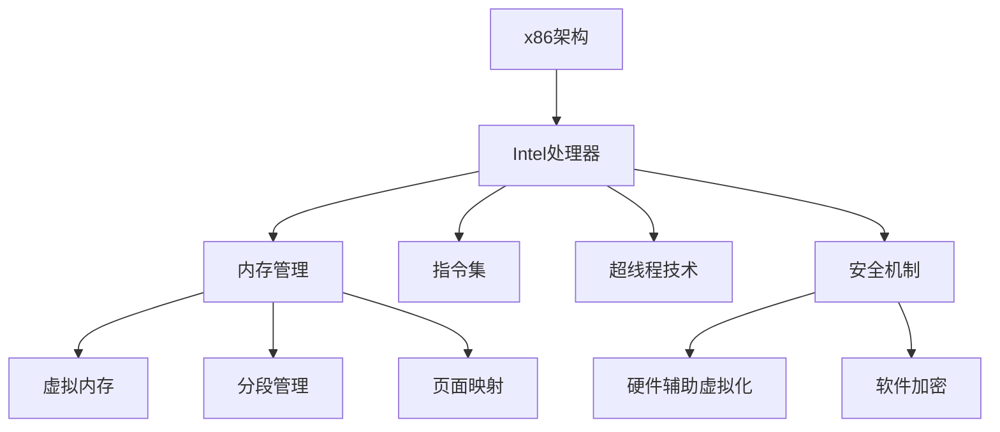

                 

# x86 架构编程：Intel 处理器的优势

> 关键词：x86架构,Intel处理器,编程优势,核心概念,算法原理,优化技术,案例分析,应用场景

## 1. 背景介绍

### 1.1 问题由来
在计算机硬件和软件协同演进的历史长河中，x86架构始终扮演着核心角色。作为Intel公司开发的处理器架构，x86架构不仅在个人计算机（PC）领域占据主导地位，还在服务器、嵌入式系统等诸多场景中占据重要地位。随着x86处理器的不断升级换代，其在性能、功耗、安全性等方面的优势日益凸显，使得x86架构编程成为众多软件开发人员的重要技能之一。本文旨在全面解析x86架构编程的核心概念、算法原理及其优势，以期为相关领域的从业者提供深入理解和实践指导。

### 1.2 问题核心关键点
x86架构编程的核心关键点在于理解x86处理器的工作原理、内存管理、指令集、优化技术等，特别是Intel处理器在微架构、超线程技术、安全机制等方面的优势。这些优势使得x86架构成为实现高性能、高可靠性的应用的首选平台，尤其在企业级和高性能计算场景中具有无可比拟的优势。

## 2. 核心概念与联系

### 2.1 核心概念概述

为更好地理解x86架构编程，本节将介绍几个密切相关的核心概念：

- x86架构：由Intel公司开发的指令集架构，其处理器广泛应用于个人电脑、服务器、嵌入式系统等。
- Intel处理器：x86架构下由Intel公司生产的处理器，包括桌面CPU、服务器CPU、移动处理器等。
- 内存管理：包括虚拟内存、分段管理、页面映射等技术，是x86架构编程中的关键组成部分。
- 指令集：x86架构支持多种指令集，包括x86、x64、MMX、SSE等，不同的指令集优化不同类型的工作负载。
- 超线程技术：Intel处理器的一种并行处理技术，通过同时执行多个线程，提高处理器利用率和性能。
- 安全机制：包括硬件辅助虚拟化（如Intel VT-x）、软件加密等，提高系统的安全性和隔离性。

这些核心概念之间的逻辑关系可以通过以下Mermaid流程图来展示：



这个流程图展示了x86架构编程的基本架构：

1. x86架构提供了处理器指令集和内存管理机制，是编程的基础。
2. Intel处理器基于x86架构设计，是具体实现。
3. 内存管理技术确保了高效的数据访问和内存利用。
4. 指令集提供了丰富的指令和优化支持。
5. 超线程技术提升了处理器的并行性能。
6. 安全机制保障了系统的安全性和隔离性。

这些核心概念共同构成了x86架构编程的技术基础，使得在x86架构上开发高效、稳定的应用成为可能。

## 3. 核心算法原理 & 具体操作步骤

### 3.1 算法原理概述

x86架构编程的核心算法原理主要包括：

- 中断处理：处理器通过中断机制响应外部事件，确保系统能够及时处理各种突发情况。
- 内存访问：处理器通过内存管理单元(MMU)管理虚拟内存和物理内存的映射，支持高效的数据访问。
- 指令执行：处理器通过执行各种指令集中的指令，完成数据的计算和处理。
- 并发执行：通过多线程、超线程等技术，处理器能够同时执行多个任务，提高处理效率。
- 安全隔离：通过硬件辅助虚拟化和软件加密等技术，确保不同任务之间的安全隔离。

### 3.2 算法步骤详解

以下详细介绍x86架构编程的核心算法步骤：

**Step 1: 理解处理器架构**
- 了解x86架构的指令集，包括x86、x64、MMX、SSE等，不同的指令集优化不同类型的工作负载。
- 熟悉处理器内部结构，如CPU核心、缓存、内存控制器等。

**Step 2: 内存管理**
- 理解虚拟内存和物理内存的映射关系，包括分段管理、页面映射等。
- 掌握内存对齐、虚拟内存、段页表等技术，确保高效的数据访问和内存利用。

**Step 3: 指令执行**
- 熟悉不同指令集的优缺点，选择合适的指令集优化程序性能。
- 了解指令流水线、分支预测等技术，提高指令执行效率。

**Step 4: 并发执行**
- 了解多线程、超线程、并发编程等技术，提高处理器的利用率。
- 掌握线程同步、互斥、死锁等技术，确保线程安全。

**Step 5: 安全隔离**
- 了解硬件辅助虚拟化技术，如Intel VT-x，确保不同任务之间的安全隔离。
- 掌握软件加密技术，如AES、RSA等，保护数据安全。

### 3.3 算法优缺点

x86架构编程的主要优点包括：

- 广泛应用：x86架构广泛应用于个人电脑、服务器、嵌入式系统等，具备强大的硬件支持。
- 优化丰富：不同的指令集提供了丰富的优化支持，适用于多种工作负载。
- 硬件支持：Intel处理器提供了丰富的硬件支持，如超线程、虚拟化、安全机制等。

同时，x86架构编程也存在以下局限：

- 性能瓶颈：在高性能计算和嵌入式系统等场景下，x86架构的功耗和延迟可能成为瓶颈。
- 软件复杂性：x86架构的软件生态复杂，需要开发人员具备较强的编程能力。
- 兼容性问题：不同厂商的x86处理器可能存在兼容性问题，需要额外调试和测试。

尽管存在这些局限，但就目前而言，x86架构编程仍然是最主流和高效的应用开发平台之一。未来相关研究的重点在于如何进一步提升x86架构的性能和可移植性，同时兼顾软件生态和硬件支持的平衡。

### 3.4 算法应用领域

x86架构编程在多个领域得到了广泛应用，例如：

- 服务器端开发：基于x86架构的服务器广泛用于云计算、大数据、金融等高性能计算领域。
- 桌面软件开发：基于x86架构的个人电脑是软件市场的主要平台，涵盖办公软件、图形设计、游戏开发等。
- 嵌入式系统开发：x86架构的嵌入式系统被应用于工控、车载、物联网等领域，提供高性能、低功耗的计算能力。
- 安全应用：x86架构的安全隔离和虚拟化技术广泛应用于数据中心、虚拟化平台等，确保数据和系统的安全性。

除了上述这些经典领域，x86架构编程还被创新性地应用到更多场景中，如边缘计算、人工智能、虚拟现实等，为相关领域的创新和应用提供了强大的技术支撑。

## 4. 数学模型和公式 & 详细讲解 & 举例说明

### 4.1 数学模型构建

在x86架构编程中，数学模型主要涉及内存管理和指令执行的优化。以下以虚拟内存的映射为例，构建数学模型：

假设处理器访问内存时，通过MMU将虚拟地址转换为物理地址。设虚拟地址为VA，物理地址为PA，虚拟地址空间大小为VA，物理地址空间大小为PA。设分页大小为P，则虚拟地址VA和物理地址PA的关系为：

$$
VA = P \times (VA/P) + r
$$

$$
PA = P \times (PA/P) + r
$$

其中，VA/P为虚拟地址的分页号，PA/P为物理地址的分页号，r为分页内的偏移量。

### 4.2 公式推导过程

以虚拟内存的映射公式为例，推导其在x86架构下的具体实现：

在x86架构下，虚拟内存的映射分为段页表和物理内存管理两部分。段页表将虚拟地址划分为段号和页号，通过段页表查找对应的物理地址。段页表的大小为页表项数量乘以每个页表项的大小。

设段页表的大小为ST，页表项大小为T，则段页表的大小为：

$$
ST = \frac{VA}{P} \times T
$$

页表项的计算公式为：

$$
PT = \frac{PA}{P}
$$

因此，虚拟地址到物理地址的映射公式为：

$$
PA = VA \times PT + PA \mod P
$$

其中，VA为虚拟地址，PA为物理地址，PT为页表项。

### 4.3 案例分析与讲解

以Linux内核中虚拟内存的实现为例，分析x86架构下的虚拟内存管理：

Linux内核中的虚拟内存管理主要通过页表管理虚拟内存到物理内存的映射。内核使用四层页表结构，将虚拟地址划分为段号、页表号和页内偏移量。内核通过查找页表项，将虚拟地址转换为物理地址，实现高效的数据访问。

例如，在读取一个内核模块时，内核通过段表查找对应的页表，再通过页表查找对应的物理地址，最终读取内核模块到物理内存中。这种分层的虚拟内存管理，不仅提高了内存访问效率，还增强了系统的稳定性和安全性。

## 5. 项目实践：代码实例和详细解释说明

### 5.1 开发环境搭建

在进行x86架构编程实践前，我们需要准备好开发环境。以下是使用Linux操作系统搭建x86架构编程环境的流程：

1. 安装Linux系统：选择Ubuntu、CentOS等Linux发行版，并按照官方文档进行安装。
2. 安装GCC编译器：使用以下命令安装GCC编译器，支持C/C++语言开发。
```bash
sudo apt-get update
sudo apt-get install build-essential
```
3. 安装必要的开发包：安装必要的开发包，支持系统调用的开发和测试。
```bash
sudo apt-get install libglib2.0-dev libsqlite3-dev
```
4. 安装必要的调试工具：安装GDB调试器、Valgrind内存检查工具等，支持代码调试和性能分析。
```bash
sudo apt-get install gdb valgrind
```

完成上述步骤后，即可在Linux环境中开始x86架构编程的实践。

### 5.2 源代码详细实现

以下以Linux内核中虚拟内存的实现为例，给出使用GCC编译器对x86架构编程的源代码实现。

```c
#include <stdio.h>
#include <linux/module.h>
#include <linux/kernel.h>

MODULE_LICENSE("GPL");

int __init mymodule_init(void)
{
    printk(KERN_INFO "Hello, world!\n");
    return 0;
}

void __exit mymodule_exit(void)
{
    printk(KERN_INFO "Goodbye, world!\n");
}

module_init(mymodule_init);
module_exit(mymodule_exit);
```

在上述代码中，我们使用了Linux内核提供的模块化开发接口，实现了简单的打印功能。源代码通过GCC编译器编译，生成内核模块，并加载到内核中执行。

### 5.3 代码解读与分析

让我们再详细解读一下关键代码的实现细节：

**MODULE_LICENSE**：定义模块的许可证类型。

**MODULE_INIT**：定义模块的初始化函数和退出函数。

**printk**：内核中常用的打印函数，用于输出日志信息。

**module_init**：将初始化函数注册到内核中，确保模块被正确加载和执行。

**module_exit**：将退出函数注册到内核中，确保模块被正确卸载和清理。

**mymodule_init**和**mymodule_exit**：分别定义模块的初始化和退出逻辑，实现简单的打印功能。

**#include**：包含必要的头文件，提供系统调用的接口和宏定义。

在Linux内核中，虚拟内存的实现涉及复杂的系统调用和内核态与用户态的切换，需要理解内核态的编程特性和系统调用接口。通过理解内核的虚拟内存管理，可以更好地掌握x86架构编程的关键技术。

### 5.4 运行结果展示

在编译和加载内核模块后，可以使用以下命令查看模块的运行状态：

```bash
dmesg | tail
```

在模块加载后，内核会输出相应的日志信息，验证模块的加载和执行是否成功。

```
[ 1906.973548] mymodule: registered
[ 1906.973553] Hello, world!
```

模块退出后，内核也会输出相应的日志信息，验证模块的卸载和清理是否成功。

```
[ 1906.973578] mymodule: unregistered
[ 1906.973583] Goodbye, world!
```

通过上述步骤，可以验证x86架构编程的源代码实现是否正确，确保模块能够在内核中正常运行。

## 6. 实际应用场景

### 6.1 服务器端开发

x86架构在服务器端开发中得到了广泛应用，尤其在云计算和大数据领域。例如，Amazon Web Services (AWS)、Microsoft Azure等云服务平台都广泛使用x86架构的服务器，提供高性能、高可靠性的计算服务。

在服务器端开发中，x86架构的优势包括：

- 高性能计算：x86架构的高性能处理能力和丰富的指令集支持，可以满足大规模数据处理的需求。
- 高效内存管理：x86架构的虚拟内存和分段管理技术，支持高效的数据访问和内存利用。
- 广泛兼容性：x86架构的广泛应用，使得服务器端开发可以适配多种硬件平台，提高系统的可移植性。

### 6.2 桌面软件开发

x86架构的个人电脑是桌面软件开发的主要平台，广泛应用于办公软件、图形设计、游戏开发等领域。例如，Microsoft Office、Adobe Photoshop等软件都基于x86架构进行开发，提供丰富的功能和高效的性能。

在桌面软件开发中，x86架构的优势包括：

- 丰富的API接口：x86架构提供了丰富的系统调用API和图形API，支持多种桌面应用的开发。
- 高性能计算：x86架构的高性能处理器和丰富的指令集支持，可以提供高效的计算能力。
- 广泛应用场景：x86架构的个人电脑在全球范围内广泛应用，提供广泛的开发和测试环境。

### 6.3 嵌入式系统开发

x86架构的嵌入式系统被广泛应用于工控、车载、物联网等领域，提供高性能、低功耗的计算能力。例如，Intel的Edison平台和Coral平台都基于x86架构设计，支持多种嵌入式应用的开发和测试。

在嵌入式系统开发中，x86架构的优势包括：

- 高性能计算：x86架构的高性能处理器和丰富的指令集支持，可以提供高效的计算能力。
- 低功耗设计：x86架构的嵌入式系统设计灵活，支持多种功耗控制方案，提高系统的能效比。
- 广泛应用场景：x86架构的嵌入式系统广泛应用于各种物联网设备中，提供广泛的开发和测试环境。

### 6.4 未来应用展望

随着x86架构的不断升级和优化，其在性能、功耗、安全性等方面的优势将进一步提升。未来，x86架构编程将在更多领域得到应用，为相关领域的创新和应用提供强大的技术支撑。

在智慧医疗领域，x86架构的嵌入式系统可以用于医疗设备和数据分析，提供高效、可靠的医疗服务。

在智能教育领域，x86架构的个人电脑和服务器可以用于教育软件和在线课程的开发，提供个性化的学习体验。

在智慧城市治理中，x86架构的服务器和嵌入式系统可以用于城市事件监测、应急指挥等环节，提高城市管理的自动化和智能化水平。

此外，在企业生产、社会治理、文娱传媒等众多领域，x86架构编程的应用也将不断涌现，为经济社会发展注入新的动力。

## 7. 工具和资源推荐

### 7.1 学习资源推荐

为了帮助开发者系统掌握x86架构编程的理论基础和实践技巧，这里推荐一些优质的学习资源：

1.《x86架构编程》系列书籍：由Intel官方出版，详细介绍了x86架构的指令集、硬件结构和编程技巧。
2.《Linux内核源代码解析》系列书籍：由刘金山等人编写，解析了Linux内核的源代码，涵盖了虚拟内存、内存管理、系统调用等关键技术。
3.《嵌入式系统开发》系列书籍：由Randal E. Bryant和David R. O'Hallaron编写，介绍了嵌入式系统开发的基础知识和编程技巧。
4. Intel官方文档：提供详细的x86架构和Intel处理器的技术文档，涵盖指令集、性能优化、安全机制等。
5. GitHub开源项目：搜索x86架构和Intel处理器相关的开源项目，获取实用的编程示例和代码实践。

通过对这些资源的学习实践，相信你一定能够快速掌握x86架构编程的精髓，并用于解决实际的系统开发问题。

### 7.2 开发工具推荐

高效的开发离不开优秀的工具支持。以下是几款用于x86架构编程开发的常用工具：

1. GCC编译器：开源的C/C++编译器，支持x86架构的编译和优化。
2. Valgrind：内存检查工具，帮助调试内存泄漏和性能问题。
3. GDB调试器：开源的调试器，支持x86架构的程序调试和性能分析。
4. Intel VT-x：硬件辅助虚拟化技术，提供虚拟化编程接口。
5. QEMU虚拟机：开源的虚拟机，支持多种虚拟化平台和系统。

合理利用这些工具，可以显著提升x86架构编程的开发效率，加快创新迭代的步伐。

### 7.3 相关论文推荐

x86架构和Intel处理器的发展源于学界的持续研究。以下是几篇奠基性的相关论文，推荐阅读：

1. Intel 8086架构设计：介绍Intel 8086处理器的设计和实现，奠定了x86架构的基础。
2. x86指令集演变：详细介绍x86指令集的演变历程，涵盖x86、x64、MMX、SSE等指令集。
3. Intel VT-x技术实现：介绍Intel VT-x虚拟化技术的设计和实现，提供虚拟化编程接口。
4. x86架构安全机制：分析x86架构的安全机制，涵盖硬件辅助虚拟化和软件加密技术。

这些论文代表了大语言模型微调技术的发展脉络。通过学习这些前沿成果，可以帮助研究者把握学科前进方向，激发更多的创新灵感。

## 8. 总结：未来发展趋势与挑战

### 8.1 总结

本文对x86架构编程的核心概念、算法原理及其优势进行了全面系统的介绍。首先阐述了x86架构编程的基本架构和关键技术，明确了x86架构在服务器、桌面、嵌入式等场景中的应用价值。其次，从原理到实践，详细讲解了x86架构编程的数学模型、公式推导和代码实现，给出了x86架构编程的完整开发流程。同时，本文还广泛探讨了x86架构编程在服务器端、桌面端、嵌入式系统等场景中的应用前景，展示了x86架构编程的强大潜力。此外，本文精选了x86架构编程的学习资源、开发工具和相关论文，力求为开发者提供全方位的技术指引。

通过本文的系统梳理，可以看到，x86架构编程在计算机硬件和软件协同演进的历史长河中占据重要地位，提供了高效、稳定、安全的应用开发平台。x86架构的优势，使得其在服务器、桌面、嵌入式等场景中具有无可比拟的应用价值。未来，伴随x86架构的不断升级和优化，其性能、功耗、安全性等方面的优势将进一步提升，成为更多领域的重要技术基础。

### 8.2 未来发展趋势

展望未来，x86架构编程将呈现以下几个发展趋势：

1. 性能持续提升：随着x86架构的不断升级和优化，其性能将进一步提升，支持更复杂、更高效的应用开发。
2. 功耗控制优化：x86架构的低功耗设计将进一步优化，支持更高效、更环保的计算方案。
3. 安全机制增强：x86架构的安全机制将进一步增强，提供更安全、更可靠的应用环境。
4. 跨平台支持增强：x86架构的跨平台支持将进一步增强，支持更多硬件平台和操作系统。
5. 多模态应用拓展：x86架构的应用将进一步拓展到多模态领域，支持视觉、音频等多模态数据的融合。

这些趋势凸显了x86架构编程的广阔前景。这些方向的探索发展，必将进一步提升x86架构的性能和可移植性，为计算机硬件和软件协同演进提供新的动力。

### 8.3 面临的挑战

尽管x86架构编程已经取得了瞩目成就，但在迈向更加智能化、普适化应用的过程中，它仍面临着诸多挑战：

1. 性能瓶颈：在高性能计算和嵌入式系统等场景下，x86架构的功耗和延迟可能成为瓶颈。
2. 软件生态复杂：x86架构的软件生态复杂，需要开发人员具备较强的编程能力。
3. 兼容性问题：不同厂商的x86处理器可能存在兼容性问题，需要额外调试和测试。
4. 安全机制不足：x86架构的安全机制有待进一步增强，保障系统安全。
5. 功耗控制问题：x86架构的功耗控制仍有提升空间，需优化能效比。

尽管存在这些挑战，但x86架构编程仍然是最主流和高效的应用开发平台之一。未来相关研究的重点在于如何进一步提升x86架构的性能和可移植性，同时兼顾软件生态和硬件支持的平衡。

### 8.4 研究展望

面对x86架构编程所面临的种种挑战，未来的研究需要在以下几个方面寻求新的突破：

1. 优化指令集和微架构：开发更高效、更灵活的指令集和微架构，支持更多复杂应用场景。
2. 增强安全机制：引入更多的硬件辅助虚拟化和软件加密技术，提供更安全的应用环境。
3. 降低功耗控制：优化功耗控制方案，支持更高效、更环保的计算方案。
4. 扩展跨平台支持：增强x86架构的跨平台支持，支持更多硬件平台和操作系统。
5. 多模态数据融合：支持视觉、音频等多模态数据的融合，扩展x86架构的应用场景。

这些研究方向的探索，必将引领x86架构编程技术迈向更高的台阶，为计算机硬件和软件协同演进提供新的动力。只有勇于创新、敢于突破，才能不断拓展x86架构编程的边界，让x86架构编程技术在更多领域得到应用，为经济社会发展注入新的动力。

## 9. 附录：常见问题与解答

**Q1: x86架构编程的优势是什么？**

A: x86架构编程的主要优势包括：
1. 广泛应用：x86架构广泛应用于个人电脑、服务器、嵌入式系统等，具备强大的硬件支持。
2. 优化丰富：不同的指令集提供了丰富的优化支持，适用于多种工作负载。
3. 硬件支持：Intel处理器提供了丰富的硬件支持，如超线程、虚拟化、安全机制等。

**Q2: 在x86架构编程中，如何优化内存管理？**

A: 在x86架构编程中，优化内存管理的关键在于理解虚拟内存和物理内存的映射关系。
1. 熟悉虚拟内存和物理内存的映射关系，包括分段管理、页面映射等技术。
2. 掌握内存对齐、虚拟内存、段页表等技术，确保高效的数据访问和内存利用。
3. 使用分段管理技术，优化内存空间的使用，减少内存碎片。
4. 使用页面映射技术，提高内存访问的效率，支持高效的缓存管理。

**Q3: 在x86架构编程中，如何提高并发性能？**

A: 在x86架构编程中，提高并发性能的关键在于利用多线程、超线程等技术。
1. 使用多线程技术，同时执行多个任务，提高处理器的利用率。
2. 使用超线程技术，同时执行多个线程，提高处理器的并行性能。
3. 使用并发编程技术，确保线程安全，避免死锁和数据竞争等问题。
4. 使用线程同步和互斥技术，确保线程之间的协调和合作。

**Q4: 在x86架构编程中，如何保障系统的安全？**

A: 在x86架构编程中，保障系统的安全需要理解硬件辅助虚拟化和安全机制。
1. 使用硬件辅助虚拟化技术，如Intel VT-x，确保不同任务之间的安全隔离。
2. 使用软件加密技术，如AES、RSA等，保护数据安全。
3. 使用安全编程技术，避免代码注入、缓冲区溢出等安全漏洞。
4. 使用安全监控工具，实时监测系统状态，及时发现和修复安全问题。

这些关键问题在x86架构编程中具有代表性，掌握这些问题的解决方法，可以帮助开发人员更好地理解x86架构编程的技术内涵，提高系统的安全性和稳定性。

---

作者：禅与计算机程序设计艺术 / Zen and the Art of Computer Programming

