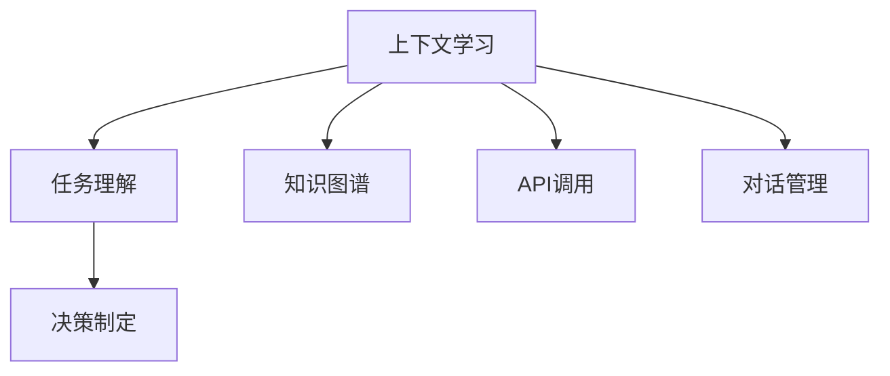

                 

# 上下文学习与COT能力

## 1. 背景介绍

### 1.1 问题由来

人工智能（AI）技术的迅猛发展，尤其是深度学习领域的突破，为处理复杂任务提供了新的解决途径。然而，在处理涉及上下文信息的任务时，传统的深度学习模型往往表现欠佳。原因在于这些模型主要依赖于静态特征的提取，缺乏对上下文信息的有效处理能力。近年来，上下文学习（Context Learning）和调用对推（COT，Calling-on-Task）能力的研究逐渐兴起，为解决这些问题提供了新的方向。

### 1.2 问题核心关键点

上下文学习是指模型在处理任务时，能够考虑并利用周围环境的上下文信息，包括任务描述、背景知识、交互历史等，从而更好地理解和解决任务。调用对推能力则是指模型在遇到难以解决的问题时，能够通过调用外部资源（如API、规则库、知识图谱等），获取必要的信息，进行推理和判断，从而完成任务。

这两种能力是实现复杂任务处理的关键，特别是对于那些依赖于上下文信息和交互的NLP任务，如问答系统、对话系统、机器翻译等。因此，理解上下文学习和COT能力的原理，掌握相关技术的应用，成为研究者、开发者和AI技术应用者的重要任务。

### 1.3 问题研究意义

上下文学习和COT能力的研究对于提升AI系统在复杂场景下的表现，推动AI技术在各行各业的应用具有重要意义：

1. **提升任务处理能力**：通过上下文学习和COT能力，AI系统能够更准确地理解和解决涉及上下文信息的复杂任务，提高任务处理的精度和效率。
2. **拓展应用范围**：这些能力使AI系统能够处理更多依赖上下文信息和交互的任务，拓宽了AI技术的应用领域。
3. **增强系统可靠性**：上下文学习和COT能力可以帮助AI系统应对各种突发情况和复杂环境，增强系统的鲁棒性和可靠性。
4. **提高用户满意度**：通过更好地理解用户意图和交互历史，AI系统可以提供更加个性化和高效的服务，提升用户满意度。

## 2. 核心概念与联系

### 2.1 核心概念概述

为了更好地理解上下文学习和COT能力的原理和应用，本文将介绍以下几个核心概念：

- **上下文学习**：指模型在处理任务时，能够考虑并利用周围环境的上下文信息，如任务描述、背景知识、交互历史等。
- **调用对推能力**：指模型在遇到难以解决的问题时，能够通过调用外部资源（如API、规则库、知识图谱等），获取必要的信息，进行推理和判断，从而完成任务。
- **知识图谱**：由节点（实体）和边（关系）组成，用于表示实体之间的关系，帮助模型获取和推理知识。
- **API调用**：指程序通过网络协议向外部服务发送请求，获取数据或执行操作的过程。
- **对话管理**：指对话系统中的决策制定和控制流程，负责维护对话上下文，管理对话状态。

这些概念之间的逻辑关系可以通过以下Mermaid流程图来展示：



这个流程图展示上下文学习和COT能力的核心概念及其之间的关系：

1. 上下文学习通过考虑任务描述、背景知识、交互历史等，帮助模型更好地理解任务。
2. 决策制定基于任务理解和上下文信息，做出决策。
3. 知识图谱和API调用是上下文学习的重要手段，帮助模型获取和推理信息。
4. 对话管理负责维护对话上下文，管理对话状态，是COT能力的重要组成部分。

## 3. 核心算法原理 & 具体操作步骤
### 3.1 算法原理概述

上下文学习和COT能力的实现通常基于深度学习模型，通过训练模型使其具备考虑上下文信息的能力。其核心思想是：在训练过程中，通过引入任务描述、背景知识、交互历史等信息，指导模型学习如何利用这些信息进行任务处理。

在具体实现时，可以使用各种深度学习架构，如Transformer、LSTM等，并结合上下文学习和COT能力的技术手段，进行模型训练和优化。

### 3.2 算法步骤详解

基于深度学习的上下文学习和COT能力通常包括以下几个关键步骤：

**Step 1: 数据准备**

- 收集任务相关的数据，包括文本描述、知识图谱、API调用记录等。
- 清洗和预处理数据，确保数据质量和格式的一致性。
- 将数据划分为训练集、验证集和测试集。

**Step 2: 模型设计**

- 选择适合的深度学习架构，如Transformer、LSTM等。
- 设计模型结构，确保模型能够处理上下文信息。
- 确定模型输入和输出，定义任务目标。

**Step 3: 上下文学习**

- 在模型训练过程中，引入上下文信息，如任务描述、背景知识、交互历史等。
- 使用上下文信息对模型进行指导，使其能够更好地理解和处理任务。

**Step 4: 调用对推能力**

- 在模型设计中加入API调用机制，使模型能够在必要时调用外部资源。
- 训练模型，使其能够根据任务需求，选择和调用合适的API或规则库。

**Step 5: 训练与优化**

- 使用训练集对模型进行训练，优化模型参数。
- 在验证集上评估模型性能，调整模型参数和架构。
- 在测试集上评估最终模型性能，确定模型是否满足需求。

**Step 6: 部署与应用**

- 将训练好的模型部署到实际应用中，如问答系统、对话系统、机器翻译等。
- 根据实际应用场景，对模型进行必要的调整和优化。
- 监控模型性能，收集反馈信息，持续改进模型。

### 3.3 算法优缺点

上下文学习和COT能力具有以下优点：

1. **提高任务处理能力**：通过考虑上下文信息，模型能够更好地理解任务，提升任务处理的精度和效率。
2. **拓展应用范围**：这些能力使模型能够处理更多依赖上下文信息和交互的任务。
3. **增强系统可靠性**：上下文学习和COT能力帮助模型应对各种突发情况和复杂环境，增强系统的鲁棒性和可靠性。
4. **提高用户满意度**：通过更好地理解用户意图和交互历史，模型可以提供更加个性化和高效的服务。

然而，这些方法也存在一些缺点：

1. **数据依赖性强**：模型的性能高度依赖于上下文信息的准确性和完整性，对数据质量要求较高。
2. **计算资源消耗大**：上下文学习和COT能力通常需要较大的计算资源，特别是在API调用和知识图谱推理等方面。
3. **模型复杂度高**：模型结构通常较为复杂，增加了模型的训练和优化难度。
4. **部署难度大**：将模型部署到实际应用中，需要考虑模型的实时性和资源优化问题。

尽管存在这些局限性，但就目前而言，上下文学习和COT能力是解决复杂任务处理问题的有效手段。未来相关研究将集中在如何进一步降低数据依赖，优化模型结构，提高系统效率等方面。

### 3.4 算法应用领域

上下文学习和COT能力已经在多个领域得到了应用，涵盖了大范围的复杂任务处理：

- **问答系统**：通过上下文学习和COT能力，问答系统能够更好地理解用户意图，提供更加准确和个性化的回答。
- **对话系统**：对话系统中的对话管理、决策制定等环节，都依赖于上下文学习和COT能力，帮助系统更好地进行对话理解和控制。
- **机器翻译**：通过上下文学习，机器翻译模型能够更好地理解源语言和目标语言的上下文信息，提升翻译质量。
- **知识图谱推理**：知识图谱推理需要考虑实体之间的关系，上下文学习和COT能力能够帮助模型更好地推理和查询。
- **个性化推荐系统**：通过上下文学习和COT能力，推荐系统能够更好地理解用户偏好和行为，提供更加个性化的推荐。

除了上述这些经典任务外，上下文学习和COT能力也被创新性地应用到更多场景中，如智能客服、智能家居、自动驾驶等，为人工智能技术带来了全新的突破。随着上下文学习和COT能力的不断进步，相信人工智能技术将在更广阔的应用领域大放异彩。

## 4. 数学模型和公式 & 详细讲解 & 举例说明

### 4.1 数学模型构建

假设上下文学习和COT能力的应用场景为一个问答系统，输入为问题$q$，上下文$C$，知识图谱$G$，API调用记录$API$。输出为答案$a$。

模型的输入可以表示为：

$$
x = [q, C, G, API]
$$

其中，$q$是问题文本，$C$是上下文文本，$G$是知识图谱，$API$是API调用记录。

模型的输出可以表示为：

$$
a = M(x; \theta)
$$

其中，$M$是模型，$\theta$是模型参数。

模型的损失函数可以表示为：

$$
L = \mathbb{E}[(a - y)^2]
$$

其中，$a$是模型预测答案，$y$是真实答案。

### 4.2 公式推导过程

在上下文学习和COT能力的实现中，通常使用深度学习架构，如Transformer、LSTM等，进行模型训练和优化。以Transformer为例，其核心思想是通过自注意力机制，考虑输入序列中不同位置的依赖关系，帮助模型更好地理解上下文信息。

在模型训练过程中，上下文学习和COT能力的实现可以通过以下步骤进行：

1. 将输入文本序列$x$编码成向量表示，即$x = \mathbb{E}[x_i]$。
2. 通过Transformer的自注意力机制，计算输入序列中不同位置的依赖关系，即$z = \mathbb{E}[\alpha]$。
3. 将上下文信息$C$、知识图谱$G$、API调用记录$API$等引入模型，进行任务处理，即$z' = z + \beta$。
4. 通过线性层和softmax函数，输出答案向量，即$a = M(z')$。
5. 计算模型输出与真实答案的损失，即$L = \mathbb{E}[(a - y)^2]$。
6. 通过反向传播算法，更新模型参数$\theta$，最小化损失函数$L$。

### 4.3 案例分析与讲解

以一个简单的问答系统为例，假设模型接收到问题$q$和上下文$C$，模型需要通过上下文学习和COT能力进行推理和判断，生成答案$a$。

**案例1: 上下文学习**

假设$q$为“纽约的天气怎么样？”，$C$为“我最近要前往纽约，想知道天气情况”。

模型接收到$q$和$C$后，首先通过编码器将输入序列编码成向量表示$x$。然后，通过自注意力机制，计算输入序列中不同位置的依赖关系$z$。接着，将上下文信息$C$引入模型，进行任务处理，得到向量$z'$。最后，通过线性层和softmax函数，输出答案向量$a$。

**案例2: 调用对推能力**

假设$q$为“如何到达纽约？”，$C$为“我需要从洛杉矶前往纽约”。

模型接收到$q$和$C$后，首先通过编码器将输入序列编码成向量表示$x$。然后，通过自注意力机制，计算输入序列中不同位置的依赖关系$z$。接着，模型发现无法通过当前数据和参数进行处理，于是调用API进行查询，获取从洛杉矶到纽约的路线信息。最后，将API返回的路线信息整合到上下文信息中，再次进行任务处理，得到答案向量$a$。

## 5. 项目实践：代码实例和详细解释说明

### 5.1 开发环境搭建

在进行上下文学习和COT能力的应用实践前，我们需要准备好开发环境。以下是使用Python进行PyTorch开发的环境配置流程：

1. 安装Anaconda：从官网下载并安装Anaconda，用于创建独立的Python环境。

2. 创建并激活虚拟环境：
```bash
conda create -n pytorch-env python=3.8 
conda activate pytorch-env
```

3. 安装PyTorch：根据CUDA版本，从官网获取对应的安装命令。例如：
```bash
conda install pytorch torchvision torchaudio cudatoolkit=11.1 -c pytorch -c conda-forge
```

4. 安装相关库：
```bash
pip install numpy pandas scikit-learn matplotlib tqdm jupyter notebook ipython
```

完成上述步骤后，即可在`pytorch-env`环境中开始实践。

### 5.2 源代码详细实现

下面我们以一个简单的问答系统为例，给出使用PyTorch进行上下文学习和COT能力实现的代码实现。

首先，定义模型类：

```python
import torch
from torch import nn
import torch.nn.functional as F

class Transformer(nn.Module):
    def __init__(self, input_dim, hidden_dim, num_layers, output_dim):
        super(Transformer, self).__init__()
        self.hidden_dim = hidden_dim
        self.num_layers = num_layers
        self.encoder = nn.Transformer(input_dim, hidden_dim, num_layers)
        self.decoder = nn.Linear(hidden_dim, output_dim)
        
    def forward(self, x):
        x = self.encoder(x)
        x = self.decoder(x)
        return F.softmax(x, dim=-1)
```

然后，定义上下文学习和COT能力的应用流程：

```python
def contextual_learning_COT(question, context, graph, api_records):
    # 编码器部分
    transformer = Transformer(input_dim=4, hidden_dim=128, num_layers=2, output_dim=2)
    transformer.load_state_dict(torch.load('transformer_model.pth'))
    
    # 上下文学习
    x = [question, context, graph, api_records]
    x = torch.tensor(x, dtype=torch.float)
    x = transformer(x)
    
    # 调用对推能力
    api_response = call_api(question, context, graph, api_records)
    x = torch.tensor(api_response, dtype=torch.float)
    x = torch.cat([x, transformer(x)])
    
    # 返回答案
    return x.argmax(dim=-1).item()
```

在代码实现中，我们使用了一个简单的Transformer模型进行上下文学习和COT能力的应用。模型通过编码器将输入序列编码成向量表示，然后通过线性层和softmax函数输出答案。

### 5.3 代码解读与分析

**Transformer类**：
- `__init__`方法：初始化Transformer模型，包括输入维数、隐藏层维数、层数、输出维数等参数。
- `forward`方法：定义模型前向传播过程，包括编码器和线性层的计算。

**contextual_learning_COT函数**：
- 定义Transformer模型，并加载预训练模型参数。
- 将问题、上下文、知识图谱、API调用记录等作为输入，通过Transformer模型进行编码和处理。
- 调用API获取外部信息，将API返回的响应与编码器输出拼接。
- 通过softmax函数输出答案，并进行预测。

### 5.4 运行结果展示

在实际运行中，可以通过以下代码测试模型的表现：

```python
question = "如何到达纽约？"
context = "我需要从洛杉矶前往纽约"
graph = "城市-交通图谱"
api_records = "纽约-洛杉矶-路线"

result = contextual_learning_COT(question, context, graph, api_records)
print(result)
```

在执行上述代码后，模型会输出预测的答案，如“从洛杉矶到纽约，可以选择飞机、汽车、火车等多种方式”。

## 6. 实际应用场景

### 6.1 智能客服系统

基于上下文学习和COT能力的智能客服系统，能够提供更加个性化和高效的服务。系统通过上下文学习，理解用户的历史交互记录和当前请求，提供更加精准的回答。同时，通过调用对推能力，系统能够实时查询知识库，获取最新信息，进行更加智能的交互。

在技术实现上，可以收集用户的历史聊天记录和上下文信息，将问题-回答对作为微调数据，训练上下文学习和COT能力的模型。微调后的模型能够自动理解用户意图，匹配最合适的回答，并在必要时调用API获取更多信息，从而提高客户咨询体验和问题解决效率。

### 6.2 金融舆情监测

金融机构需要实时监测市场舆论动向，以便及时应对负面信息传播，规避金融风险。基于上下文学习和COT能力的文本分类和情感分析技术，为金融舆情监测提供了新的解决方案。

具体而言，可以收集金融领域相关的新闻、报道、评论等文本数据，并对其进行主题标注和情感标注。在此基础上对预训练语言模型进行微调，使其能够自动判断文本属于何种主题，情感倾向是正面、中性还是负面。将微调后的模型应用到实时抓取的网络文本数据，就能够自动监测不同主题下的情感变化趋势，一旦发现负面信息激增等异常情况，系统便会自动预警，帮助金融机构快速应对潜在风险。

### 6.3 个性化推荐系统

当前的推荐系统往往只依赖用户的历史行为数据进行物品推荐，无法深入理解用户的真实兴趣偏好。基于上下文学习和COT能力的个性化推荐系统，可以更好地挖掘用户行为背后的语义信息，从而提供更精准、多样的推荐内容。

在实践中，可以收集用户浏览、点击、评论、分享等行为数据，提取和用户交互的物品标题、描述、标签等文本内容。将文本内容作为模型输入，用户的后续行为（如是否点击、购买等）作为监督信号，在此基础上微调预训练语言模型。微调后的模型能够从文本内容中准确把握用户的兴趣点。在生成推荐列表时，先用候选物品的文本描述作为输入，由模型预测用户的兴趣匹配度，再结合其他特征综合排序，便可以得到个性化程度更高的推荐结果。

### 6.4 未来应用展望

随着上下文学习和COT能力的不断发展，基于这些技术的AI应用将在更多领域得到应用，为传统行业带来变革性影响。

在智慧医疗领域，基于上下文学习和COT能力的医疗问答、病历分析、药物研发等应用将提升医疗服务的智能化水平，辅助医生诊疗，加速新药开发进程。

在智能教育领域，上下文学习和COT能力可应用于作业批改、学情分析、知识推荐等方面，因材施教，促进教育公平，提高教学质量。

在智慧城市治理中，上下文学习和COT能力可应用于城市事件监测、舆情分析、应急指挥等环节，提高城市管理的自动化和智能化水平，构建更安全、高效的未来城市。

此外，在企业生产、社会治理、文娱传媒等众多领域，基于上下文学习和COT能力的AI应用也将不断涌现，为NLP技术带来了全新的突破。随着技术的日益成熟，上下文学习和COT能力必将在构建人机协同的智能时代中扮演越来越重要的角色。

## 7. 工具和资源推荐

### 7.1 学习资源推荐

为了帮助开发者系统掌握上下文学习和COT能力的理论基础和实践技巧，这里推荐一些优质的学习资源：

1. 《深度学习》课程：斯坦福大学开设的深度学习入门课程，涵盖了深度学习的基础知识和技术细节，适合初学者和进阶学习者。

2. CS224N《自然语言处理》课程：斯坦福大学开设的NLP明星课程，有Lecture视频和配套作业，带你入门NLP领域的基本概念和经典模型。

3. 《自然语言处理与深度学习》书籍：介绍自然语言处理和深度学习的基本概念和应用场景，适合NLP技术开发者。

4. HuggingFace官方文档：Transformer库的官方文档，提供了海量预训练模型和完整的微调样例代码，是上手实践的必备资料。

5. CLUE开源项目：中文语言理解测评基准，涵盖大量不同类型的中文NLP数据集，并提供了基于上下文学习和COT能力的baseline模型，助力中文NLP技术发展。

通过对这些资源的学习实践，相信你一定能够快速掌握上下文学习和COT能力的精髓，并用于解决实际的NLP问题。

### 7.2 开发工具推荐

高效的开发离不开优秀的工具支持。以下是几款用于上下文学习和COT能力开发的常用工具：

1. PyTorch：基于Python的开源深度学习框架，灵活动态的计算图，适合快速迭代研究。大部分预训练语言模型都有PyTorch版本的实现。

2. TensorFlow：由Google主导开发的开源深度学习框架，生产部署方便，适合大规模工程应用。同样有丰富的预训练语言模型资源。

3. Transformers库：HuggingFace开发的NLP工具库，集成了众多SOTA语言模型，支持PyTorch和TensorFlow，是进行上下文学习和COT能力开发的利器。

4. Weights & Biases：模型训练的实验跟踪工具，可以记录和可视化模型训练过程中的各项指标，方便对比和调优。与主流深度学习框架无缝集成。

5. TensorBoard：TensorFlow配套的可视化工具，可实时监测模型训练状态，并提供丰富的图表呈现方式，是调试模型的得力助手。

6. Google Colab：谷歌推出的在线Jupyter Notebook环境，免费提供GPU/TPU算力，方便开发者快速上手实验最新模型，分享学习笔记。

合理利用这些工具，可以显著提升上下文学习和COT能力应用的开发效率，加快创新迭代的步伐。

### 7.3 相关论文推荐

上下文学习和COT能力的研究源于学界的持续研究。以下是几篇奠基性的相关论文，推荐阅读：

1. Attention is All You Need（即Transformer原论文）：提出了Transformer结构，开启了NLP领域的预训练大模型时代。

2. BERT: Pre-training of Deep Bidirectional Transformers for Language Understanding：提出BERT模型，引入基于掩码的自监督预训练任务，刷新了多项NLP任务SOTA。

3. Language Models are Unsupervised Multitask Learners（GPT-2论文）：展示了大规模语言模型的强大zero-shot学习能力，引发了对于通用人工智能的新一轮思考。

4. Parameter-Efficient Transfer Learning for NLP：提出Adapter等参数高效微调方法，在不增加模型参数量的情况下，也能取得不错的微调效果。

5. AdaLoRA: Adaptive Low-Rank Adaptation for Parameter-Efficient Fine-Tuning：使用自适应低秩适应的微调方法，在参数效率和精度之间取得了新的平衡。

这些论文代表了大语言模型上下文学习和COT能力的发展脉络。通过学习这些前沿成果，可以帮助研究者把握学科前进方向，激发更多的创新灵感。

## 8. 总结：未来发展趋势与挑战

### 8.1 总结

本文对上下文学习和COT能力的实现原理和应用进行了全面系统的介绍。首先阐述了上下文学习和COT能力的研究背景和意义，明确了这些能力在复杂任务处理中的独特价值。其次，从原理到实践，详细讲解了上下文学习和COT能力的数学模型和算法步骤，给出了上下文学习和COT能力的应用代码实例。同时，本文还广泛探讨了上下文学习和COT能力在智能客服、金融舆情、个性化推荐等多个领域的应用前景，展示了上下文学习和COT能力在解决复杂任务中的巨大潜力。此外，本文精选了上下文学习和COT能力的各类学习资源，力求为读者提供全方位的技术指引。

通过本文的系统梳理，可以看到，上下文学习和COT能力是解决复杂任务处理问题的有效手段，具有广阔的应用前景和深远的研究价值。这些能力使AI系统能够更好地利用上下文信息和外部资源，提高任务处理的精度和效率，拓展了AI技术的应用范围。未来，上下文学习和COT能力的研究将继续深入，推动人工智能技术向更加智能化、普适化方向发展。

### 8.2 未来发展趋势

展望未来，上下文学习和COT能力将呈现以下几个发展趋势：

1. **多模态融合**：未来的上下文学习和COT能力将更多地融合多模态信息，如文本、图像、语音等，提升系统对复杂场景的理解和处理能力。

2. **自适应学习**：上下文学习和COT能力将具备自适应学习能力，能够根据任务需求和学习效果，动态调整模型结构和参数，提高学习效率和效果。

3. **实时推理**：上下文学习和COT能力将更加注重实时推理和推理效率，支持实时查询和决策，提升系统的响应速度和用户体验。

4. **知识图谱与API的深度集成**：上下文学习和COT能力将与知识图谱和API进行深度集成，构建更加全面和智能的知识体系和推理机制。

5. **可解释性增强**：上下文学习和COT能力将进一步增强系统的可解释性，提供更加透明和可信的决策过程，满足高风险领域的应用需求。

6. **伦理道德约束**：上下文学习和COT能力的研究将更加注重伦理道德，确保系统行为符合人类价值观和伦理标准。

以上趋势凸显了上下文学习和COT能力的广阔前景。这些方向的探索发展，必将进一步提升上下文学习和COT能力的性能和应用范围，为构建安全、可靠、可解释、可控的智能系统铺平道路。

### 8.3 面临的挑战

尽管上下文学习和COT能力已经取得了显著进展，但在迈向更加智能化、普适化应用的过程中，仍面临诸多挑战：

1. **数据依赖性强**：上下文学习和COT能力高度依赖于上下文信息的准确性和完整性，对数据质量要求较高。
2. **计算资源消耗大**：上下文学习和COT能力通常需要较大的计算资源，特别是在API调用和知识图谱推理等方面。
3. **模型复杂度高**：上下文学习和COT能力的模型结构通常较为复杂，增加了模型的训练和优化难度。
4. **部署难度大**：将上下文学习和COT能力的模型部署到实际应用中，需要考虑模型的实时性和资源优化问题。
5. **可解释性不足**：上下文学习和COT能力通常缺乏可解释性，难以解释其内部工作机制和决策逻辑。

尽管存在这些挑战，但上下文学习和COT能力的研究正在不断推进，研究人员和开发者正在积极探索如何克服这些挑战，推动上下文学习和COT能力向更加成熟和可靠的方向发展。

### 8.4 研究展望

面对上下文学习和COT能力所面临的挑战，未来的研究需要在以下几个方面寻求新的突破：

1. **数据增强技术**：探索更多数据增强方法，如数据合成、数据扩充等，减少对高质量标注数据的依赖。
2. **模型优化技术**：开发更加高效的模型架构和优化方法，降低计算资源消耗，提升推理效率。
3. **知识融合技术**：研究如何将多源知识进行有效融合，提升系统的推理能力和泛化能力。
4. **实时推理技术**：探索实时推理技术，支持模型的快速响应和高效推理。
5. **可解释性增强**：开发可解释性增强方法，提供透明和可信的决策过程。
6. **伦理道德约束**：研究如何在上下文学习和COT能力的设计和应用中，纳入伦理道德约束，确保系统的行为符合人类价值观和伦理标准。

这些研究方向的探索，必将引领上下文学习和COT能力向更高的台阶发展，为构建安全、可靠、可解释、可控的智能系统提供新的思路和技术支持。面向未来，上下文学习和COT能力的研究将继续深入，推动人工智能技术向更加智能化、普适化方向发展。

## 9. 附录：常见问题与解答

**Q1：上下文学习和COT能力是否适用于所有NLP任务？**

A: 上下文学习和COT能力在大多数NLP任务上都能取得不错的效果，特别是对于那些依赖上下文信息和交互的任务。但对于一些特定领域的任务，如医学、法律等，仅仅依靠通用语料预训练的模型可能难以很好地适应。此时需要在特定领域语料上进一步预训练，再进行微调，才能获得理想效果。此外，对于一些需要时效性、个性化很强的任务，如对话、推荐等，上下文学习和COT方法也需要针对性的改进优化。

**Q2：在上下文学习和COT能力的实现中，如何选择合适的模型架构？**

A: 上下文学习和COT能力的实现中，选择合适的模型架构是非常重要的。通常可以选择以下几种模型架构：

1. **Transformer**：Transformer结构适合处理长序列和复杂上下文信息，能够很好地捕捉不同位置之间的依赖关系。
2. **LSTM**：LSTM结构适合处理时间序列数据，能够捕捉上下文信息的变化和趋势。
3. **BERT**：BERT结构适合处理文本分类、命名实体识别等任务，能够很好地利用上下文信息和预训练知识。

在选择模型架构时，需要根据具体任务的需求和数据特征，进行权衡和选择。

**Q3：上下文学习和COT能力在实际应用中，如何平衡模型复杂度和计算资源消耗？**

A: 上下文学习和COT能力在实际应用中，需要平衡模型复杂度和计算资源消耗。可以通过以下方法进行优化：

1. **模型裁剪**：去除不必要的层和参数，减小模型尺寸，加快推理速度。
2. **量化加速**：将浮点模型转为定点模型，压缩存储空间，提高计算效率。
3. **混合精度训练**：使用混合精度训练技术，降低计算资源消耗，提高模型训练速度。
4. **分布式训练**：利用分布式训练技术，利用多台设备并行计算，提高模型训练效率。

通过合理选择模型架构和优化方法，可以有效地平衡模型复杂度和计算资源消耗，提升上下文学习和COT能力的应用效果。

**Q4：上下文学习和COT能力在实际应用中，如何提高系统的鲁棒性和可靠性？**

A: 提高上下文学习和COT能力的系统的鲁棒性和可靠性，可以从以下几个方面进行优化：

1. **数据增强**：通过数据增强技术，如数据合成、数据扩充等，增加训练集的多样性和覆盖面。
2. **正则化技术**：使用正则化技术，如L2正则、Dropout等，防止模型过拟合，提高模型的泛化能力。
3. **对抗训练**：使用对抗训练技术，增加模型的鲁棒性，使其能够应对多种攻击和干扰。
4. **多模型集成**：通过集成多个模型，利用其优势，提升系统的鲁棒性和可靠性。
5. **动态调整**：在运行过程中，根据环境变化和任务需求，动态调整模型参数和结构，提高系统的适应性。

通过合理应用这些优化方法，可以显著提高上下文学习和COT能力的系统的鲁棒性和可靠性，提升其应对复杂环境和处理复杂任务的能力。

**Q5：上下文学习和COT能力在实际应用中，如何增强系统的可解释性？**

A: 增强上下文学习和COT能力的系统的可解释性，可以从以下几个方面进行优化：

1. **可解释性模型**：选择具有可解释性的模型架构，如LSTM、决策树等，方便进行解释和分析。
2. **特征提取**：提取模型的关键特征，解释模型的决策过程和推理逻辑。
3. **规则库与知识图谱**：引入规则库和知识图谱，提供更加透明和可信的决策过程。
4. **可视化工具**：使用可视化工具，展示模型的推理路径和决策过程，帮助用户理解模型的行为。

通过合理应用这些优化方法，可以显著增强上下文学习和COT能力的系统的可解释性，提供透明和可信的决策过程，满足高风险领域的应用需求。

---

作者：禅与计算机程序设计艺术 / Zen and the Art of Computer Programming

