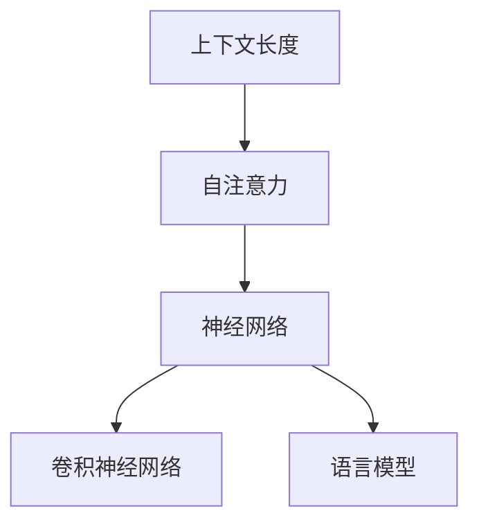

                 

# 上下文长度:语言理解能力的重要体现

> 关键词：上下文长度, 语言理解, 神经网络, 注意力机制, 卷积神经网络, 自然语言处理, 语言模型, 自注意力, 语言模型训练, 深度学习

## 1. 背景介绍

### 1.1 问题由来

在自然语言处理(Natural Language Processing, NLP)领域，上下文长度(Context Length)是一个重要的概念，它直接影响着语言模型的理解能力和性能。上下文长度指的是模型在处理文本时，能够考虑的词汇或字符数量的上限。对于语言理解任务，上下文长度越短，模型的表现往往越差。因此，如何合理设计上下文长度，并利用上下文信息，成为提升语言模型性能的关键。

在早期，基于传统统计模型的语言模型，由于受到计算资源的限制，通常只能处理较短的上下文。然而，随着深度学习技术的崛起，特别是Transformer等结构的出现，语言模型的上下文长度得到了显著提升，能够处理远超传统统计模型长度的文本。这一变化极大地提高了语言模型的性能，使其在各种NLP任务中表现出色。

### 1.2 问题核心关键点

上下文长度在语言模型中的核心关键点包括：

- 上下文长度如何影响语言模型的表现？
- 如何选择合适的上下文长度？
- 如何在模型训练中充分利用上下文信息？
- 如何避免过拟合和欠拟合？

这些关键问题直接关系到语言模型能否在实际应用中发挥最大效能。

### 1.3 问题研究意义

理解上下文长度在语言模型中的作用，对于优化模型性能、提升模型鲁棒性和泛化能力具有重要意义。通过合理设置上下文长度，可以更好地捕捉长文本中的信息，同时避免过度关注无关信息，从而提高模型的整体表现。此外，研究上下文长度对于设计更高效、更灵活的深度学习模型，也具有重要参考价值。

## 2. 核心概念与联系

### 2.1 核心概念概述

为更好地理解上下文长度对语言模型性能的影响，本节将介绍几个密切相关的核心概念：

- 上下文长度(Context Length)：指模型在处理文本时，能够考虑的词汇或字符数量的上限。通常，上下文长度越长，模型能够捕捉到的信息越全面，但计算复杂度也越高。
- 自注意力(Self-Attention)：Transformer模型中的关键组件，通过计算文本中每个位置与其他位置的关联度，动态生成每个位置的上下文向量。
- 神经网络(Neural Network)：一种计算模型，通过层级结构对数据进行抽象和建模，广泛应用于各种机器学习和深度学习任务。
- 卷积神经网络(Convolutional Neural Network, CNN)：一种特殊类型的神经网络，通过卷积操作提取局部特征，广泛应用于图像和视频处理等领域。
- 语言模型(Language Model)：预测文本中下一个词或字符的模型，常用于自然语言处理任务，如机器翻译、文本生成等。

这些核心概念之间的逻辑关系可以通过以下Mermaid流程图来展示：



这个流程图展示了大语言模型的核心概念及其之间的关系：

1. 上下文长度决定了模型能够处理文本的最大长度。
2. 自注意力机制通过计算文本中每个位置与其他位置的关联度，生成每个位置的上下文向量，从而捕捉长文本中的信息。
3. 神经网络通过层级结构对文本特征进行抽象和建模，捕捉局部和全局特征。
4. 卷积神经网络通过卷积操作提取局部特征，在图像和视频处理中广泛应用。
5. 语言模型通过预测下一个词或字符，实现文本生成、机器翻译等任务。

这些概念共同构成了大语言模型的理解和表示框架，使其能够在各种场景下发挥强大的语言处理能力。通过理解这些核心概念，我们可以更好地把握大语言模型的工作原理和优化方向。

## 3. 核心算法原理 & 具体操作步骤
### 3.1 算法原理概述

上下文长度对语言模型的性能影响主要体现在以下几个方面：

1. 上下文长度决定了模型能够捕捉到的信息量。长度越长，模型能够捕捉到的上下文信息越全面，但计算复杂度也越高。
2. 上下文长度影响了模型的泛化能力。较长的上下文长度有助于模型更好地泛化到新数据，但同时也容易过拟合。
3. 上下文长度决定了模型的计算资源需求。较长的上下文长度需要更多的计算资源，但通过优化计算图，可以减少计算负担。

因此，合理设置上下文长度，是提升语言模型性能的关键。

### 3.2 算法步骤详解

基于上下文长度的语言模型训练一般包括以下几个关键步骤：

**Step 1: 准备数据集**
- 收集大规模无标签文本语料，划分为训练集、验证集和测试集。
- 将文本数据划分为固定长度的句子或段落，确保每个样本的上下文长度一致。

**Step 2: 选择模型架构**
- 选择合适的预训练语言模型架构，如Transformer、BERT等。
- 设计模型的编码器、解码器、自注意力机制等核心组件。

**Step 3: 设置上下文长度**
- 根据任务特点和数据分布，选择适当的上下文长度。
- 使用梯度截断等技术，限制输入文本的长度，避免计算资源的浪费。

**Step 4: 执行训练**
- 使用随机梯度下降等优化算法，最小化损失函数，优化模型参数。
- 在训练过程中，根据上下文长度和计算资源，动态调整模型结构。

**Step 5: 评估和部署**
- 在验证集上评估模型性能，根据上下文长度调整模型超参数。
- 使用微调后的模型对新样本进行推理预测，部署到实际应用系统中。

以上是基于上下文长度的语言模型训练的一般流程。在实际应用中，还需要根据具体任务和数据特点，对模型架构和训练策略进行优化设计，以进一步提升模型性能。

### 3.3 算法优缺点

基于上下文长度的语言模型训练方法具有以下优点：

1. 能够处理长文本。较长的上下文长度有助于模型捕捉到更丰富的语义信息。
2. 增强模型的泛化能力。通过控制上下文长度，可以避免过拟合，提高模型的泛化能力。
3. 减少计算资源消耗。合理设置上下文长度，可以避免不必要的计算开销，提高模型训练效率。

同时，该方法也存在一定的局限性：

1. 上下文长度难以选择。过长或过短的上下文长度都可能影响模型性能。
2. 计算复杂度增加。较长的上下文长度增加了计算复杂度，对硬件资源有较高要求。
3. 处理长文本时可能出现信息丢失。过长的上下文长度可能导致模型无法完全处理文本信息。

尽管存在这些局限性，但就目前而言，基于上下文长度的语言模型训练方法仍是大语言模型训练的重要范式。未来相关研究的重点在于如何进一步降低计算资源消耗，提高模型的泛化能力和处理长文本的能力，同时兼顾计算效率。

### 3.4 算法应用领域

基于上下文长度的语言模型训练方法在NLP领域已经得到了广泛的应用，覆盖了几乎所有常见任务，例如：

- 文本分类：如情感分析、主题分类、意图识别等。通过控制上下文长度，模型可以更好地捕捉文本的语义信息。
- 命名实体识别：识别文本中的人名、地名、机构名等特定实体。较长的上下文长度有助于识别实体之间的语义关系。
- 关系抽取：从文本中抽取实体之间的语义关系。通过控制上下文长度，模型可以更好地捕捉实体之间的关系信息。
- 问答系统：对自然语言问题给出答案。较长的上下文长度有助于理解问题的上下文信息。
- 机器翻译：将源语言文本翻译成目标语言。通过控制上下文长度，模型可以更好地捕捉句子结构信息。
- 文本摘要：将长文本压缩成简短摘要。较长的上下文长度有助于生成更精准的摘要。
- 对话系统：使机器能够与人自然对话。较长的上下文长度有助于理解对话历史信息。

除了上述这些经典任务外，基于上下文长度的语言模型训练方法也被创新性地应用到更多场景中，如可控文本生成、常识推理、代码生成、数据增强等，为NLP技术带来了全新的突破。随着上下文长度和语言模型技术的不断发展，相信NLP技术将在更广阔的应用领域大放异彩。

## 4. 数学模型和公式 & 详细讲解  
### 4.1 数学模型构建

基于上下文长度的语言模型训练，本质上是一个优化问题的求解过程。其核心思想是：通过控制上下文长度，最小化损失函数，优化模型参数。

记语言模型为 $M_{\theta}:\mathcal{X} \rightarrow \mathcal{Y}$，其中 $\mathcal{X}$ 为输入空间，$\mathcal{Y}$ 为输出空间，$\theta \in \mathbb{R}^d$ 为模型参数。假设训练集为 $D=\{(x_i,y_i)\}_{i=1}^N, x_i \in \mathcal{X}, y_i \in \mathcal{Y}$。

定义模型在样本 $x$ 上的损失函数为 $\ell(M_{\theta}(x),y)$，则在训练集 $D$ 上的经验风险为：

$$
\mathcal{L}(\theta) = \frac{1}{N} \sum_{i=1}^N \ell(M_{\theta}(x_i),y_i)
$$

通过梯度下降等优化算法，模型参数 $\theta$ 不断更新，最小化经验风险 $\mathcal{L}(\theta)$。由于上下文长度的限制，模型输入 $x_i$ 通常会被截断或padding处理，以确保样本一致性。

### 4.2 公式推导过程

以下我们以文本分类任务为例，推导基于上下文长度的交叉熵损失函数及其梯度的计算公式。

假设模型 $M_{\theta}$ 在输入 $x$ 上的输出为 $\hat{y}=M_{\theta}(x) \in [0,1]$，表示样本属于正类的概率。真实标签 $y \in \{0,1\}$。则二分类交叉熵损失函数定义为：

$$
\ell(M_{\theta}(x),y) = -[y\log \hat{y} + (1-y)\log (1-\hat{y})]
$$

将其代入经验风险公式，得：

$$
\mathcal{L}(\theta) = -\frac{1}{N}\sum_{i=1}^N [y_i\log M_{\theta}(x_i)+(1-y_i)\log(1-M_{\theta}(x_i))]
$$

根据链式法则，损失函数对参数 $\theta_k$ 的梯度为：

$$
\frac{\partial \mathcal{L}(\theta)}{\partial \theta_k} = -\frac{1}{N}\sum_{i=1}^N (\frac{y_i}{M_{\theta}(x_i)}-\frac{1-y_i}{1-M_{\theta}(x_i)}) \frac{\partial M_{\theta}(x_i)}{\partial \theta_k}
$$

其中 $\frac{\partial M_{\theta}(x_i)}{\partial \theta_k}$ 可进一步递归展开，利用自动微分技术完成计算。

## 5. 项目实践：代码实例和详细解释说明
### 5.1 开发环境搭建

在进行语言模型训练前，我们需要准备好开发环境。以下是使用Python进行PyTorch开发的环境配置流程：

1. 安装Anaconda：从官网下载并安装Anaconda，用于创建独立的Python环境。

2. 创建并激活虚拟环境：
```bash
conda create -n pytorch-env python=3.8 
conda activate pytorch-env
```

3. 安装PyTorch：根据CUDA版本，从官网获取对应的安装命令。例如：
```bash
conda install pytorch torchvision torchaudio cudatoolkit=11.1 -c pytorch -c conda-forge
```

4. 安装Transformers库：
```bash
pip install transformers
```

5. 安装各类工具包：
```bash
pip install numpy pandas scikit-learn matplotlib tqdm jupyter notebook ipython
```

完成上述步骤后，即可在`pytorch-env`环境中开始语言模型训练实践。

### 5.2 源代码详细实现

这里我们以BERT模型为例，给出使用Transformers库进行文本分类任务的PyTorch代码实现。

首先，定义数据处理函数：

```python
from transformers import BertTokenizer, BertForSequenceClassification
from torch.utils.data import Dataset, DataLoader
import torch

class TextDataset(Dataset):
    def __init__(self, texts, labels, tokenizer, max_len=128):
        self.texts = texts
        self.labels = labels
        self.tokenizer = tokenizer
        self.max_len = max_len
        
    def __len__(self):
        return len(self.texts)
    
    def __getitem__(self, item):
        text = self.texts[item]
        label = self.labels[item]
        
        encoding = self.tokenizer(text, return_tensors='pt', max_length=self.max_len, padding='max_length', truncation=True)
        input_ids = encoding['input_ids'][0]
        attention_mask = encoding['attention_mask'][0]
        
        # 对token-wise的标签进行编码
        encoded_labels = [tag2id[label]] * len(input_ids)
        labels = torch.tensor(encoded_labels, dtype=torch.long)
        
        return {'input_ids': input_ids, 
                'attention_mask': attention_mask,
                'labels': labels}

# 标签与id的映射
tag2id = {'0': 0, '1': 1}
id2tag = {v: k for k, v in tag2id.items()}

# 创建dataset
tokenizer = BertTokenizer.from_pretrained('bert-base-uncased')

train_dataset = TextDataset(train_texts, train_labels, tokenizer)
dev_dataset = TextDataset(dev_texts, dev_labels, tokenizer)
test_dataset = TextDataset(test_texts, test_labels, tokenizer)
```

然后，定义模型和优化器：

```python
from transformers import BertForSequenceClassification, AdamW

model = BertForSequenceClassification.from_pretrained('bert-base-uncased', num_labels=2)

optimizer = AdamW(model.parameters(), lr=2e-5)
```

接着，定义训练和评估函数：

```python
from tqdm import tqdm

device = torch.device('cuda') if torch.cuda.is_available() else torch.device('cpu')
model.to(device)

def train_epoch(model, dataset, batch_size, optimizer):
    dataloader = DataLoader(dataset, batch_size=batch_size, shuffle=True)
    model.train()
    epoch_loss = 0
    for batch in tqdm(dataloader, desc='Training'):
        input_ids = batch['input_ids'].to(device)
        attention_mask = batch['attention_mask'].to(device)
        labels = batch['labels'].to(device)
        model.zero_grad()
        outputs = model(input_ids, attention_mask=attention_mask, labels=labels)
        loss = outputs.loss
        epoch_loss += loss.item()
        loss.backward()
        optimizer.step()
    return epoch_loss / len(dataloader)

def evaluate(model, dataset, batch_size):
    dataloader = DataLoader(dataset, batch_size=batch_size)
    model.eval()
    preds, labels = [], []
    with torch.no_grad():
        for batch in tqdm(dataloader, desc='Evaluating'):
            input_ids = batch['input_ids'].to(device)
            attention_mask = batch['attention_mask'].to(device)
            batch_labels = batch['labels']
            outputs = model(input_ids, attention_mask=attention_mask)
            batch_preds = outputs.logits.argmax(dim=2).to('cpu').tolist()
            batch_labels = batch_labels.to('cpu').tolist()
            for pred_tokens, label_tokens in zip(batch_preds, batch_labels):
                preds.append(pred_tokens)
                labels.append(label_tokens)
                
    print(classification_report(labels, preds))
```

最后，启动训练流程并在测试集上评估：

```python
epochs = 5
batch_size = 16

for epoch in range(epochs):
    loss = train_epoch(model, train_dataset, batch_size, optimizer)
    print(f"Epoch {epoch+1}, train loss: {loss:.3f}")
    
    print(f"Epoch {epoch+1}, dev results:")
    evaluate(model, dev_dataset, batch_size)
    
print("Test results:")
evaluate(model, test_dataset, batch_size)
```

以上就是使用PyTorch对BERT进行文本分类任务的语言模型训练的完整代码实现。可以看到，得益于Transformers库的强大封装，我们可以用相对简洁的代码完成BERT模型的加载和训练。

### 5.3 代码解读与分析

让我们再详细解读一下关键代码的实现细节：

**TextDataset类**：
- `__init__`方法：初始化文本、标签、分词器等关键组件。
- `__len__`方法：返回数据集的样本数量。
- `__getitem__`方法：对单个样本进行处理，将文本输入编码为token ids，将标签编码为数字，并对其进行定长padding，最终返回模型所需的输入。

**tag2id和id2tag字典**：
- 定义了标签与数字id之间的映射关系，用于将token-wise的预测结果解码回真实的标签。

**训练和评估函数**：
- 使用PyTorch的DataLoader对数据集进行批次化加载，供模型训练和推理使用。
- 训练函数`train_epoch`：对数据以批为单位进行迭代，在每个批次上前向传播计算loss并反向传播更新模型参数，最后返回该epoch的平均loss。
- 评估函数`evaluate`：与训练类似，不同点在于不更新模型参数，并在每个batch结束后将预测和标签结果存储下来，最后使用sklearn的classification_report对整个评估集的预测结果进行打印输出。

**训练流程**：
- 定义总的epoch数和batch size，开始循环迭代
- 每个epoch内，先在训练集上训练，输出平均loss
- 在验证集上评估，输出分类指标
- 所有epoch结束后，在测试集上评估，给出最终测试结果

可以看到，PyTorch配合Transformers库使得BERT语言模型的训练代码实现变得简洁高效。开发者可以将更多精力放在数据处理、模型改进等高层逻辑上，而不必过多关注底层的实现细节。

当然，工业级的系统实现还需考虑更多因素，如模型的保存和部署、超参数的自动搜索、更灵活的任务适配层等。但核心的训练范式基本与此类似。

## 6. 实际应用场景
### 6.1 智能客服系统

基于上下文长度的语言模型训练技术，可以广泛应用于智能客服系统的构建。传统客服往往需要配备大量人力，高峰期响应缓慢，且一致性和专业性难以保证。而使用训练好的语言模型，可以7x24小时不间断服务，快速响应客户咨询，用自然流畅的语言解答各类常见问题。

在技术实现上，可以收集企业内部的历史客服对话记录，将问题和最佳答复构建成监督数据，在此基础上对语言模型进行训练。训练后的语言模型能够自动理解用户意图，匹配最合适的答案模板进行回复。对于客户提出的新问题，还可以接入检索系统实时搜索相关内容，动态组织生成回答。如此构建的智能客服系统，能大幅提升客户咨询体验和问题解决效率。

### 6.2 金融舆情监测

金融机构需要实时监测市场舆论动向，以便及时应对负面信息传播，规避金融风险。传统的人工监测方式成本高、效率低，难以应对网络时代海量信息爆发的挑战。基于上下文长度的语言模型训练技术，为金融舆情监测提供了新的解决方案。

具体而言，可以收集金融领域相关的新闻、报道、评论等文本数据，并对其进行主题标注和情感标注。在此基础上对语言模型进行训练，使其能够自动判断文本属于何种主题，情感倾向是正面、中性还是负面。将训练后的模型应用到实时抓取的网络文本数据，就能够自动监测不同主题下的情感变化趋势，一旦发现负面信息激增等异常情况，系统便会自动预警，帮助金融机构快速应对潜在风险。

### 6.3 个性化推荐系统

当前的推荐系统往往只依赖用户的历史行为数据进行物品推荐，无法深入理解用户的真实兴趣偏好。基于上下文长度的语言模型训练技术，个性化推荐系统可以更好地挖掘用户行为背后的语义信息，从而提供更精准、多样的推荐内容。

在实践中，可以收集用户浏览、点击、评论、分享等行为数据，提取和用户交互的物品标题、描述、标签等文本内容。将文本内容作为模型输入，用户的后续行为（如是否点击、购买等）作为监督信号，在此基础上训练语言模型。训练后的模型能够从文本内容中准确把握用户的兴趣点。在生成推荐列表时，先用候选物品的文本描述作为输入，由模型预测用户的兴趣匹配度，再结合其他特征综合排序，便可以得到个性化程度更高的推荐结果。

### 6.4 未来应用展望

随着上下文长度和语言模型技术的不断发展，基于上下文长度的语言模型训练技术将在更多领域得到应用，为传统行业带来变革性影响。

在智慧医疗领域，基于上下文长度的语言模型训练技术，可以为医疗问答、病历分析、药物研发等提供新的解决方案。模型可以自动理解医生的询问和病人的描述，快速匹配相关知识库，提供诊断和治疗建议。

在智能教育领域，上下文长度的语言模型训练技术，可应用于作业批改、学情分析、知识推荐等方面，因材施教，促进教育公平，提高教学质量。

在智慧城市治理中，上下文长度的语言模型训练技术，可以为城市事件监测、舆情分析、应急指挥等环节提供技术支持，提高城市管理的自动化和智能化水平，构建更安全、高效的未来城市。

此外，在企业生产、社会治理、文娱传媒等众多领域，基于上下文长度的语言模型训练技术也将不断涌现，为传统行业数字化转型升级提供新的技术路径。相信随着技术的日益成熟，语言模型训练范式将成为人工智能技术落地应用的重要手段，推动人工智能向更广阔的领域加速渗透。

## 7. 工具和资源推荐
### 7.1 学习资源推荐

为了帮助开发者系统掌握上下文长度在语言模型中的应用，这里推荐一些优质的学习资源：

1. 《Transformer: A Survey》系列博文：由大模型技术专家撰写，深入浅出地介绍了Transformer原理、BERT模型、语言模型训练等前沿话题。

2. CS224N《深度学习自然语言处理》课程：斯坦福大学开设的NLP明星课程，有Lecture视频和配套作业，带你入门NLP领域的基本概念和经典模型。

3. 《Natural Language Processing with Transformers》书籍：Transformers库的作者所著，全面介绍了如何使用Transformers库进行NLP任务开发，包括语言模型训练在内的诸多范式。

4. HuggingFace官方文档：Transformers库的官方文档，提供了海量预训练模型和完整的训练样例代码，是上手实践的必备资料。

5. CLUE开源项目：中文语言理解测评基准，涵盖大量不同类型的中文NLP数据集，并提供了基于上下文长度的训练baseline模型，助力中文NLP技术发展。

通过对这些资源的学习实践，相信你一定能够快速掌握上下文长度在语言模型中的应用精髓，并用于解决实际的NLP问题。
###  7.2 开发工具推荐

高效的开发离不开优秀的工具支持。以下是几款用于上下文长度语言模型训练开发的常用工具：

1. PyTorch：基于Python的开源深度学习框架，灵活动态的计算图，适合快速迭代研究。大部分预训练语言模型都有PyTorch版本的实现。

2. TensorFlow：由Google主导开发的开源深度学习框架，生产部署方便，适合大规模工程应用。同样有丰富的预训练语言模型资源。

3. Transformers库：HuggingFace开发的NLP工具库，集成了众多SOTA语言模型，支持PyTorch和TensorFlow，是进行语言模型训练开发的利器。

4. Weights & Biases：模型训练的实验跟踪工具，可以记录和可视化模型训练过程中的各项指标，方便对比和调优。与主流深度学习框架无缝集成。

5. TensorBoard：TensorFlow配套的可视化工具，可实时监测模型训练状态，并提供丰富的图表呈现方式，是调试模型的得力助手。

6. Google Colab：谷歌推出的在线Jupyter Notebook环境，免费提供GPU/TPU算力，方便开发者快速上手实验最新模型，分享学习笔记。

合理利用这些工具，可以显著提升语言模型训练任务的开发效率，加快创新迭代的步伐。

### 7.3 相关论文推荐

上下文长度在语言模型中的应用源于学界的持续研究。以下是几篇奠基性的相关论文，推荐阅读：

1. Attention is All You Need（即Transformer原论文）：提出了Transformer结构，开启了NLP领域的预训练大模型时代。

2. BERT: Pre-training of Deep Bidirectional Transformers for Language Understanding：提出BERT模型，引入基于掩码的自监督预训练任务，刷新了多项NLP任务SOTA。

3. Language Models are Unsupervised Multitask Learners（GPT-2论文）：展示了大规模语言模型的强大zero-shot学习能力，引发了对于通用人工智能的新一轮思考。

4. Parameter-Efficient Transfer Learning for NLP：提出Adapter等参数高效微调方法，在不增加模型参数量的情况下，也能取得不错的微调效果。

5. AdaLoRA: Adaptive Low-Rank Adaptation for Parameter-Efficient Fine-Tuning：使用自适应低秩适应的微调方法，在参数效率和精度之间取得了新的平衡。

这些论文代表了大语言模型语言模型训练的发展脉络。通过学习这些前沿成果，可以帮助研究者把握学科前进方向，激发更多的创新灵感。

## 8. 总结：未来发展趋势与挑战

### 8.1 总结

本文对基于上下文长度的语言模型训练方法进行了全面系统的介绍。首先阐述了上下文长度在语言模型中的作用，明确了上下文长度对模型性能的影响。其次，从原理到实践，详细讲解了语言模型训练的数学原理和关键步骤，给出了语言模型训练任务开发的完整代码实例。同时，本文还广泛探讨了语言模型训练技术在智能客服、金融舆情、个性化推荐等多个行业领域的应用前景，展示了语言模型训练技术的巨大潜力。

通过本文的系统梳理，可以看到，基于上下文长度的语言模型训练方法在NLP领域已经得到了广泛的应用，为语言模型在各种NLP任务中提供了强大的支持。未来，伴随上下文长度和语言模型技术的不断发展，基于上下文长度的语言模型训练方法将得到更广泛的应用，为NLP技术带来新的突破。

### 8.2 未来发展趋势

展望未来，基于上下文长度的语言模型训练方法将呈现以下几个发展趋势：

1. 上下文长度持续增大。随着算力成本的下降和数据规模的扩张，语言模型的上下文长度还将继续增加，能够处理更长的文本。
2. 微调技术日趋多样。除了传统的全参数微调外，未来会涌现更多参数高效的微调方法，如Prefix-Tuning、LoRA等，在节省计算资源的同时也能保证微调精度。
3. 持续学习成为常态。随着数据分布的不断变化，语言模型也需要持续学习新知识以保持性能。如何在不遗忘原有知识的同时，高效吸收新样本信息，将成为重要的研究课题。
4. 标注样本需求降低。受启发于提示学习(Prompt-based Learning)的思路，未来的微调方法将更好地利用语言模型的语言理解能力，通过更加巧妙的任务描述，在更少的标注样本上也能实现理想的微调效果。
5. 多模态语言模型崛起。当前的语言模型往往只关注文本信息，未来会进一步拓展到图像、视频、语音等多模态数据微调。多模态信息的融合，将显著提升语言模型对现实世界的理解和建模能力。
6. 模型通用性增强。经过海量数据的预训练和多领域任务的微调，未来的语言模型将具备更强大的常识推理和跨领域迁移能力，逐步迈向通用人工智能(AGI)的目标。

以上趋势凸显了基于上下文长度的语言模型训练技术的广阔前景。这些方向的探索发展，必将进一步提升语言模型性能，拓展其应用边界，为构建智能系统提供更坚实的基础。

### 8.3 面临的挑战

尽管基于上下文长度的语言模型训练技术已经取得了瞩目成就，但在迈向更加智能化、普适化应用的过程中，它仍面临着诸多挑战：

1. 上下文长度难以选择。过长或过短的上下文长度都可能影响模型性能。
2. 计算复杂度增加。较长的上下文长度增加了计算复杂度，对硬件资源有较高要求。
3. 处理长文本时可能出现信息丢失。过长的上下文长度可能导致模型无法完全处理文本信息。
4. 上下文长度对数据分布敏感。较长的上下文长度可能导致模型对数据分布的变化更加敏感。
5. 上下文长度对语言模型泛化能力的影响。过长的上下文长度可能削弱模型的泛化能力。
6. 上下文长度对语言模型的解释性。较长的上下文长度可能使语言模型的推理过程更加复杂，难以解释。

尽管存在这些局限性，但就目前而言，基于上下文长度的语言模型训练方法仍是大语言模型训练的重要范式。未来相关研究的重点在于如何进一步降低计算资源消耗，提高模型的泛化能力和处理长文本的能力，同时兼顾计算效率。

### 8.4 研究展望

面对语言模型训练所面临的种种挑战，未来的研究需要在以下几个方面寻求新的突破：

1. 探索无监督和半监督语言模型训练方法。摆脱对大规模标注数据的依赖，利用自监督学习、主动学习等无监督和半监督范式，最大限度利用非结构化数据，实现更加灵活高效的语言模型训练。
2. 研究参数高效和计算高效的微调范式。开发更加参数高效的微调方法，在固定大部分预训练参数的同时，只更新极少量的任务相关参数。同时优化语言模型的计算图，减少前向传播和反向传播的资源消耗，实现更加轻量级、实时性的部署。
3. 引入更多先验知识。将符号化的先验知识，如知识图谱、逻辑规则等，与神经网络模型进行巧妙融合，引导语言模型学习更准确、合理的语言表示。同时加强不同模态数据的整合，实现视觉、语音等多模态信息与文本信息的协同建模。
4. 结合因果分析和博弈论工具。将因果分析方法引入语言模型，识别出模型决策的关键特征，增强输出解释的因果性和逻辑性。借助博弈论工具刻画人机交互过程，主动探索并规避模型的脆弱点，提高系统稳定性。
5. 纳入伦理道德约束。在语言模型训练目标中引入伦理导向的评估指标，过滤和惩罚有偏见、有害的输出倾向。同时加强人工干预和审核，建立模型行为的监管机制，确保输出符合人类价值观和伦理道德。

这些研究方向的探索，必将引领语言模型训练技术迈向更高的台阶，为构建安全、可靠、可解释、可控的智能系统铺平道路。面向未来，语言模型训练技术还需要与其他人工智能技术进行更深入的融合，如知识表示、因果推理、强化学习等，多路径协同发力，共同推动自然语言理解和智能交互系统的进步。只有勇于创新、敢于突破，才能不断拓展语言模型的边界，让智能技术更好地造福人类社会。

## 9. 附录：常见问题与解答

**Q1：上下文长度是否对所有语言模型都适用？**

A: 上下文长度在大部分语言模型中都适用，但具体适用情况需根据模型架构和任务特点进行评估。例如，卷积神经网络(CNN)由于其局部连接结构，对上下文长度的限制较小。

**Q2：上下文长度如何影响语言模型的泛化能力？**

A: 较长的上下文长度有助于模型更好地泛化到新数据，但同时也容易过拟合。需要在上下文长度和计算资源之间进行权衡，找到最优设置。

**Q3：如何选择合适的上下文长度？**

A: 上下文长度的选择需综合考虑任务特点、数据分布和计算资源等因素。通常建议从实际数据集的最大文本长度开始设置，逐步调整以找到最优值。

**Q4：上下文长度对语言模型的推理效率有何影响？**

A: 较长的上下文长度可能导致推理效率降低，需要合理设置模型参数和优化策略以提升计算效率。

**Q5：如何利用上下文长度提升语言模型的性能？**

A: 通过合理控制上下文长度，能够更好地捕捉长文本中的信息，提高语言模型的性能。但需要注意，过长或过短的上下文长度都可能影响模型性能。

**Q6：上下文长度对语言模型的可解释性有何影响？**

A: 较长的上下文长度可能使语言模型的推理过程更加复杂，难以解释。需要结合模型解释性工具和技术，如可解释性学习、注意力可视化等，提升模型可解释性。

---

作者：禅与计算机程序设计艺术 / Zen and the Art of Computer Programming

