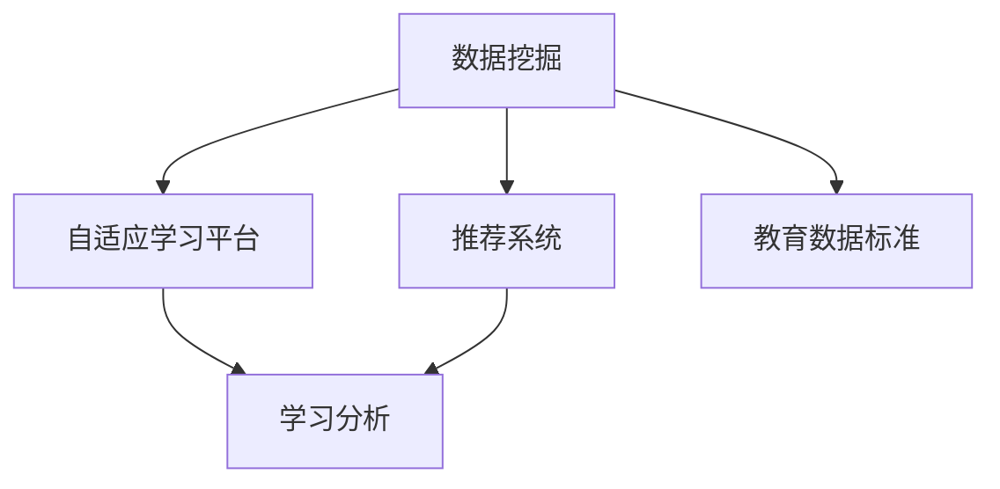

                 

# 个性化教育：定制化学习的未来趋势

## 1. 背景介绍

### 1.1 问题由来

在当今信息爆炸的时代，教育资源丰富，但传统的一对多教育模式已经无法满足学生的个性化需求。随着人工智能和大数据技术的不断成熟，个性化教育成为教育领域的未来趋势。

个性化教育的核心在于根据每个学生的特点和需求，量身定制教育内容和方法，实现因材施教。这不仅能够提高学习效率，还能激发学生的学习兴趣，促进其全面发展。

### 1.2 问题核心关键点

个性化教育主要围绕以下几个关键点展开：

- **数据驱动**：个性化教育需要收集和分析大量学生的学习数据，包括行为数据、成绩数据、兴趣偏好等。
- **模型推荐**：利用机器学习算法，如协同过滤、矩阵分解等，对学生和课程进行相似度匹配，推荐个性化的学习内容。
- **自适应学习**：根据学生的学习进度和理解能力，动态调整课程难度和进度，实现真正的因材施教。
- **学习分析**：通过数据分析，评估学生的学习效果，发现学习瓶颈，提供针对性的辅导。

## 2. 核心概念与联系

### 2.1 核心概念概述

为了更好地理解个性化教育的原理和实施方法，本节将介绍几个关键概念：

- **数据挖掘**：从大规模数据中提取有价值的信息和知识，如学生的学习行为数据、兴趣偏好等。
- **推荐系统**：通过算法推荐个性化内容，如课程、题目、教材等。
- **自适应学习平台**：利用算法动态调整学习内容和进度，适应学生的个性化需求。
- **学习分析**：通过分析学生学习数据，评估学习效果，提供个性化反馈和建议。
- **教育数据标准**：确保数据互操作性和数据质量，促进个性化教育的实现。

这些核心概念之间的逻辑关系可以通过以下Mermaid流程图来展示：



这个流程图展示了个性化教育的核心概念及其之间的关系：

1. 数据挖掘从大量数据中提取学生的学习特征和偏好。
2. 推荐系统利用这些特征推荐个性化的学习内容。
3. 自适应学习平台根据学习进度和理解能力，动态调整学习难度和进度。
4. 学习分析评估学生的学习效果，提供个性化反馈。
5. 教育数据标准确保数据的互操作性和质量，促进个性化教育的实施。

## 3. 核心算法原理 & 具体操作步骤
### 3.1 算法原理概述

个性化教育的核心在于通过数据挖掘和推荐系统，实现对学生的个性化推荐和学习。其核心思想是：

1. **数据采集与处理**：收集学生的行为数据、成绩数据、兴趣偏好等，并进行预处理和清洗。
2. **特征提取**：利用机器学习算法提取学生和课程的特征，如学生的学习风格、课程的难度和内容。
3. **相似度计算**：通过相似度计算算法，如余弦相似度、欧式距离等，计算学生和课程的相似度。
4. **推荐排序**：基于相似度计算结果，对推荐的课程、题目进行排序，形成推荐列表。
5. **自适应学习**：根据推荐列表和学生反馈，动态调整学习内容和进度。
6. **学习分析**：利用学习分析算法，如回归分析、聚类分析等，评估学生学习效果，提供个性化反馈。

### 3.2 算法步骤详解

基于数据驱动的个性化教育，主要包括以下几个关键步骤：

**Step 1: 数据收集与预处理**

- **行为数据**：通过日志记录学生的学习行为，如点击、阅读、做题等。
- **成绩数据**：收集学生在各课程中的成绩，包括考试成绩、作业成绩等。
- **兴趣偏好**：通过调查问卷或互动界面，收集学生的兴趣偏好，如喜欢的学科、学习方式等。
- **数据清洗**：去除异常数据和噪声数据，确保数据的质量和完整性。

**Step 2: 特征提取**

- **用户特征**：利用机器学习算法，如主成分分析(PCA)、因子分析等，提取学生的基本特征，如年龄、性别、学习风格等。
- **课程特征**：提取课程的基本特征，如难度、内容、结构等。
- **学生-课程相似度**：利用相似度计算算法，计算学生和课程的相似度，生成相似度矩阵。

**Step 3: 推荐排序**

- **协同过滤**：根据学生-课程相似度，推荐与学生兴趣相似的其他课程或题目。
- **矩阵分解**：将用户和物品的评分矩阵分解为低维隐因子矩阵，利用隐因子矩阵生成推荐列表。
- **排序算法**：基于推荐列表，利用排序算法如Top-k算法、基于模型的排序算法等，对推荐列表进行排序。

**Step 4: 自适应学习**

- **学习进度**：根据学生的学习进度和理解能力，动态调整学习难度和进度。
- **自适应算法**：利用自适应算法如学习曲线、回归分析等，评估学生的学习效果，动态调整学习内容。
- **个性化反馈**：根据学习效果，提供个性化的反馈和建议，如学习建议、习题推荐等。

**Step 5: 学习分析**

- **数据分析**：利用数据分析算法，如回归分析、聚类分析等，评估学生的学习效果，发现学习瓶颈。
- **效果评估**：评估推荐系统的效果，如准确率、召回率等，不断优化推荐算法。
- **持续优化**：根据学生反馈和学习效果，不断优化推荐系统和学习策略，提高个性化教育的效果。

### 3.3 算法优缺点

基于数据驱动的个性化教育方法具有以下优点：

- **个性化推荐**：根据学生特点，推荐个性化的学习内容，提高学习效率。
- **自适应学习**：根据学生学习进度和理解能力，动态调整学习内容和进度。
- **学习效果评估**：通过学习分析，评估学习效果，发现学习瓶颈，提供个性化反馈。

同时，该方法也存在一定的局限性：

- **数据依赖性强**：个性化教育的实现依赖大量学生数据，数据质量不高会影响推荐效果。
- **计算资源消耗大**：推荐和自适应算法需要大量计算资源，难以在实时系统中实现。
- **隐私和安全问题**：学生数据涉及隐私和安全问题，需要严格的保护措施。
- **模型复杂性高**：推荐系统和自适应算法复杂度高，需要专业技术人员进行开发和维护。

尽管存在这些局限性，但就目前而言，基于数据驱动的个性化教育方法仍是个性化教育的主流范式。未来相关研究的重点在于如何进一步降低数据依赖，提高实时性，同时兼顾隐私和安全等因素。

### 3.4 算法应用领域

基于数据驱动的个性化教育方法，已经在多个教育领域得到了广泛应用，例如：

- **K-12教育**：根据学生特点，推荐个性化教材和学习路径，提高学习效果。
- **高等教育**：利用推荐系统推荐选课、论文、实验等，提升学术水平。
- **职业教育**：通过个性化推荐，提高职业技能培训的针对性和效果。
- **企业培训**：根据员工需求，推荐个性化培训课程和学习资源，提升员工技能。

除了上述这些经典应用外，个性化教育还被创新性地应用到更多场景中，如终身学习、远程教育、混合式学习等，为教育技术的发展提供了新的方向。随着技术的不断进步，相信个性化教育将在更多领域得到推广和应用。

## 4. 数学模型和公式 & 详细讲解  
### 4.1 数学模型构建

本节将使用数学语言对基于数据驱动的个性化教育模型进行更加严格的刻画。

记学生集合为 $S=\{s_1,s_2,...,s_N\}$，课程集合为 $C=\{c_1,c_2,...,c_M\}$。设 $X \in \mathbb{R}^{N \times F}$ 为学生特征矩阵，$Y \in \mathbb{R}^{M \times F}$ 为课程特征矩阵，$R \in \mathbb{R}^{N \times M}$ 为评分矩阵，其中 $R_{ij}$ 表示学生 $s_i$ 对课程 $c_j$ 的评分。

定义学生和课程的相似度矩阵为 $S \in \mathbb{R}^{N \times M}$，其中 $S_{ij} \in [-1,1]$ 表示学生 $s_i$ 和课程 $c_j$ 的相似度。

个性化推荐模型的目标是最小化预测误差，即：

$$
\min_{S} \frac{1}{2} \| R - SXY \|_F^2
$$

其中 $\| \cdot \|_F$ 表示矩阵的 Frobenius 范数。

### 4.2 公式推导过程

以下我们以协同过滤算法为例，推导推荐系统的数学模型和公式。

设学生 $s_i$ 对课程 $c_j$ 的评分向量为 $r_i \in \mathbb{R}^{M}$，课程 $c_j$ 的特征向量为 $y_j \in \mathbb{R}^{F}$。

协同过滤算法通过计算学生和课程的相似度矩阵 $S \in \mathbb{R}^{N \times M}$，利用矩阵乘法生成推荐列表。具体步骤如下：

1. 计算学生 $s_i$ 对课程 $c_j$ 的评分预测值：$P_{ij} = \sum_k S_{ik} Y_{kj} r_k$
2. 对预测值进行归一化，得到推荐分数：$R_{ij} = \frac{P_{ij}}{\sum_k S_{ik} Y_{kj} r_k}$
3. 对推荐分数进行排序，生成推荐列表。

协同过滤算法的目标是最小化预测误差，即：

$$
\min_{S} \frac{1}{2} \sum_{i,j} (R_{ij} - \sum_k S_{ik} Y_{kj} r_k)^2
$$

利用矩阵乘法，可以将上式写成如下形式：

$$
\min_{S} \frac{1}{2} \| R - SXY \|_F^2
$$

其中 $\| \cdot \|_F$ 表示矩阵的 Frobenius 范数。

### 4.3 案例分析与讲解

下面以K-12个性化教育系统为例，给出基于协同过滤算法的推荐系统实现。

**Step 1: 数据收集与预处理**

- **行为数据**：收集学生在平台上的行为数据，如点击、阅读、做题等。
- **成绩数据**：收集学生在各课程中的成绩，包括考试成绩、作业成绩等。
- **兴趣偏好**：通过调查问卷或互动界面，收集学生的兴趣偏好，如喜欢的学科、学习方式等。
- **数据清洗**：去除异常数据和噪声数据，确保数据的质量和完整性。

**Step 2: 特征提取**

- **用户特征**：利用机器学习算法，如主成分分析(PCA)、因子分析等，提取学生的基本特征，如年龄、性别、学习风格等。
- **课程特征**：提取课程的基本特征，如难度、内容、结构等。
- **学生-课程相似度**：利用相似度计算算法，如余弦相似度、欧式距离等，计算学生和课程的相似度，生成相似度矩阵。

**Step 3: 推荐排序**

- **协同过滤**：根据学生-课程相似度，推荐与学生兴趣相似的其他课程或题目。
- **矩阵分解**：将用户和物品的评分矩阵分解为低维隐因子矩阵，利用隐因子矩阵生成推荐列表。
- **排序算法**：基于推荐列表，利用排序算法如Top-k算法、基于模型的排序算法等，对推荐列表进行排序。

**Step 4: 自适应学习**

- **学习进度**：根据学生的学习进度和理解能力，动态调整学习难度和进度。
- **自适应算法**：利用自适应算法如学习曲线、回归分析等，评估学生的学习效果，动态调整学习内容。
- **个性化反馈**：根据学习效果，提供个性化的反馈和建议，如学习建议、习题推荐等。

**Step 5: 学习分析**

- **数据分析**：利用数据分析算法，如回归分析、聚类分析等，评估学生的学习效果，发现学习瓶颈。
- **效果评估**：评估推荐系统的效果，如准确率、召回率等，不断优化推荐算法。
- **持续优化**：根据学生反馈和学习效果，不断优化推荐系统和学习策略，提高个性化教育的效果。

## 5. 项目实践：代码实例和详细解释说明
### 5.1 开发环境搭建

在进行个性化教育系统开发前，我们需要准备好开发环境。以下是使用Python进行Scikit-learn和TensorFlow开发的环境配置流程：

1. 安装Anaconda：从官网下载并安装Anaconda，用于创建独立的Python环境。

2. 创建并激活虚拟环境：
```bash
conda create -n recommendation-env python=3.8 
conda activate recommendation-env
```

3. 安装Scikit-learn和TensorFlow：根据CUDA版本，从官网获取对应的安装命令。例如：
```bash
conda install scikit-learn tensorflow -c conda-forge -c pytorch
```

4. 安装各类工具包：
```bash
pip install numpy pandas scikit-learn matplotlib tqdm jupyter notebook ipython
```

完成上述步骤后，即可在`recommendation-env`环境中开始个性化教育系统开发。

### 5.2 源代码详细实现

下面以K-12个性化教育系统为例，给出使用Scikit-learn和TensorFlow进行协同过滤算法的推荐系统实现。

首先，定义数据处理函数：

```python
from sklearn.metrics.pairwise import cosine_similarity
from sklearn.decomposition import TruncatedSVD

def process_data(X, Y, R):
    X_norm = X / np.linalg.norm(X, axis=1, keepdims=True)
    Y_norm = Y / np.linalg.norm(Y, axis=1, keepdims=True)
    S = cosine_similarity(X_norm, Y_norm)
    return S, R
```

然后，定义模型和优化器：

```python
from tensorflow.keras.layers import Input, Dense, Embedding, Dot, Add
from tensorflow.keras.models import Model

input1 = Input(shape=(N,))
input2 = Input(shape=(M,))

embedding1 = Embedding(N, F, input_length=1)(input1)
embedding2 = Embedding(M, F, input_length=1)(input2)

dot = Dot(axes=1, normalize=True)([embedding1, embedding2])
dense = Dense(1, activation='sigmoid')(dot)

model = Model(inputs=[input1, input2], outputs=dense)
model.compile(optimizer='adam', loss='binary_crossentropy', metrics=['accuracy'])
```

接着，定义训练和评估函数：

```python
from sklearn.model_selection import train_test_split
from sklearn.metrics import accuracy_score, precision_recall_fscore_support

def train_model(X, Y, R):
    S, R = process_data(X, Y, R)
    X_train, X_test, R_train, R_test = train_test_split(S, R, test_size=0.2)
    S_train, S_test = X_train, X_test
    R_train, R_test = R_train, R_test
    
    model.fit([X_train, S_train], R_train, epochs=100, batch_size=64, validation_data=([X_test, S_test], R_test))
    
    predictions = model.predict([X_test, S_test])
    predictions = np.round(predictions)
    accuracy = accuracy_score(R_test, predictions)
    precision, recall, f1, _ = precision_recall_fscore_support(R_test, predictions, average='macro')
    
    return accuracy, precision, recall, f1

def evaluate_model(X, Y, R):
    S, R = process_data(X, Y, R)
    S_train, S_test = X_train, X_test
    R_train, R_test = R_train, R_test
    
    model = Model(inputs=[X_test, S_test], outputs=model.output)
    predictions = model.predict([X_test, S_test])
    predictions = np.round(predictions)
    accuracy = accuracy_score(R_test, predictions)
    precision, recall, f1, _ = precision_recall_fscore_support(R_test, predictions, average='macro')
    
    return accuracy, precision, recall, f1
```

最后，启动训练流程并在测试集上评估：

```python
X_train, X_test, Y_train, Y_test, R_train, R_test = train_test_split(X, Y, R, test_size=0.2)

accuracy, precision, recall, f1 = train_model(X_train, Y_train, R_train)
print(f"Train accuracy: {accuracy:.2f}, precision: {precision:.2f}, recall: {recall:.2f}, f1: {f1:.2f}")

accuracy, precision, recall, f1 = evaluate_model(X_test, Y_test, R_test)
print(f"Test accuracy: {accuracy:.2f}, precision: {precision:.2f}, recall: {recall:.2f}, f1: {f1:.2f}")
```

以上就是使用Scikit-learn和TensorFlow对协同过滤推荐系统进行K-12个性化教育系统开发的完整代码实现。可以看到，利用Scikit-learn和TensorFlow可以方便地实现协同过滤算法的推荐系统。

### 5.3 代码解读与分析

让我们再详细解读一下关键代码的实现细节：

**process_data函数**：
- 对学生和课程特征进行归一化，并计算相似度矩阵。

**train_model函数**：
- 将数据划分为训练集和测试集。
- 训练模型并返回训练集和测试集的评价指标。

**evaluate_model函数**：
- 使用测试集对模型进行评估，并返回测试集的评价指标。

**训练流程**：
- 将数据划分为训练集和测试集，使用训练集进行模型训练。
- 在测试集上进行模型评估。

可以看到，Scikit-learn和TensorFlow使得推荐系统的开发变得简洁高效。开发者可以将更多精力放在数据处理、模型改进等高层逻辑上，而不必过多关注底层的实现细节。

当然，工业级的系统实现还需考虑更多因素，如模型的保存和部署、超参数的自动搜索、更灵活的任务适配层等。但核心的个性化推荐算法基本与此类似。

## 6. 实际应用场景
### 6.1 智能辅导系统

基于个性化教育的推荐系统，可以广泛应用于智能辅导系统的构建。传统辅导往往依靠人力，难以满足个性化需求，且效率低下。而使用推荐系统，可以为每个学生量身定制学习内容和进度，提供个性化辅导。

在技术实现上，可以收集学生的行为数据、成绩数据、兴趣偏好等，构建推荐系统，推荐个性化的学习内容。系统根据学生的学习进度和理解能力，动态调整学习难度和进度，并提供个性化的辅导和反馈。

### 6.2 在线课程平台

在线课程平台需要根据学生的学习进度和兴趣，推荐适合的学习资源。推荐系统可以收集学生的学习数据，利用协同过滤、矩阵分解等算法，推荐个性化的课程和教材。

系统根据学生的学习效果，动态调整课程进度和难度，提供个性化的学习路径和辅导。学习分析模块可以评估学生的学习效果，发现学习瓶颈，提供针对性的辅导和建议。

### 6.3 教育游戏

教育游戏需要根据学生的学习进度和兴趣，推荐合适的游戏关卡和任务。推荐系统可以收集学生的学习数据，利用协同过滤、矩阵分解等算法，推荐个性化的游戏关卡和任务。

系统根据学生的学习进度和理解能力，动态调整游戏难度和进度，提供个性化的游戏体验。学习分析模块可以评估学生的学习效果，发现学习瓶颈，提供针对性的辅导和建议。

### 6.4 未来应用展望

随着个性化教育的不断深入，推荐系统将在更多领域得到应用，为教育技术的发展提供新的方向。

在智慧城市治理中，推荐系统可以推荐适合的教育资源，提高城市管理水平。在终身学习中，推荐系统可以推荐适合的学习资源，促进终身学习的普及。

在企业培训中，推荐系统可以推荐适合的培训资源，提升员工技能。在远程教育中，推荐系统可以推荐适合的课程资源，提高教学效果。

此外，在多模态学习、社会交往、虚拟现实等领域，个性化教育的应用也将不断拓展，为教育技术带来新的突破。

## 7. 工具和资源推荐
### 7.1 学习资源推荐

为了帮助开发者系统掌握个性化教育的理论基础和实践技巧，这里推荐一些优质的学习资源：

1. **《推荐系统实战》**：该书详细介绍了推荐系统的理论基础和实战案例，适合初学者和进阶者。
2. **Coursera《Recommender Systems》课程**：由斯坦福大学教授讲授，涵盖了推荐系统的多个方面，包括协同过滤、矩阵分解等。
3. **Kaggle推荐系统竞赛**：参加Kaggle竞赛可以锻炼推荐系统开发能力，积累实战经验。
4. **TensorFlow官方文档**：TensorFlow提供了丰富的推荐系统库和工具，适合深入学习和开发。
5. **Recommender Systems Magazine**：收录了推荐系统的最新研究成果和应用案例，适合专业人士阅读。

通过对这些资源的学习实践，相信你一定能够快速掌握个性化教育的精髓，并用于解决实际的NLP问题。
###  7.2 开发工具推荐

高效的开发离不开优秀的工具支持。以下是几款用于个性化教育系统开发的常用工具：

1. Python：Python是推荐系统开发的主流语言，简单易学，生态丰富。
2. Scikit-learn：基于Python的机器学习库，提供了丰富的推荐算法和工具。
3. TensorFlow：Google开发的深度学习框架，适合构建复杂推荐系统。
4. Keras：基于TensorFlow的高层API，适合快速开发和原型设计。
5. Apache Spark：分布式计算框架，适合大规模数据处理和推荐系统开发。

合理利用这些工具，可以显著提升个性化教育系统的开发效率，加快创新迭代的步伐。

### 7.3 相关论文推荐

个性化教育的核心在于推荐系统和自适应学习，以下是几篇奠基性的相关论文，推荐阅读：

1. **Collaborative Filtering for Implicit Feedback Datasets**：该文提出了协同过滤算法的数学模型和优化方法，是推荐系统领域的经典之作。
2. **Matrix Factorization Techniques for Recommender Systems**：该文介绍了矩阵分解算法的原理和实现，是推荐系统领域的重要进展。
3. **Adaptive Learning Systems for e-Learning and Social Learning**：该文综述了自适应学习系统的理论和方法，适合学习个性化教育系统的实现。
4. **Learning Dynamics in Adaptive Educational Hypermedia Systems**：该文讨论了自适应学习系统的动态优化，适合学习自适应学习算法的实现。
5. **Social Recommendations**：该文讨论了社交网络在推荐系统中的应用，适合学习推荐系统的最新进展。

这些论文代表了个性化教育的理论基础和发展方向。通过学习这些前沿成果，可以帮助研究者把握学科前进方向，激发更多的创新灵感。

## 8. 总结：未来发展趋势与挑战
### 8.1 总结

本文对基于数据驱动的个性化教育方法进行了全面系统的介绍。首先阐述了个性化教育的研究背景和意义，明确了个性化教育的实现依赖大量学生数据，推荐系统是核心技术。其次，从原理到实践，详细讲解了个性化教育的数学模型和关键步骤，给出了个性化教育系统开发的完整代码实现。同时，本文还广泛探讨了个性化教育在智能辅导系统、在线课程平台、教育游戏等多个领域的应用前景，展示了个性化教育范式的广阔前景。此外，本文精选了个性化教育的学习资源，力求为读者提供全方位的技术指引。

通过本文的系统梳理，可以看到，基于数据驱动的个性化教育方法正在成为教育领域的重要范式，极大地拓展了推荐系统的应用边界，催生了更多的落地场景。随着推荐系统和自适应学习技术的不断发展，个性化教育必将在更多领域得到应用，为教育技术的发展提供新的动力。

### 8.2 未来发展趋势

展望未来，个性化教育将呈现以下几个发展趋势：

1. **自适应学习算法的发展**：自适应学习算法将不断优化，实现更高效的个性化学习。
2. **推荐系统的优化**：推荐系统将利用更先进的算法和工具，提高推荐效果和效率。
3. **数据驱动的持续优化**：通过实时数据收集和分析，持续优化推荐系统和学习策略。
4. **多模态数据的融合**：结合图像、视频、语音等多模态数据，实现更全面、更个性化的推荐。
5. **学习路径的智能化**：利用机器学习算法，智能化设计学习路径，提高学习效果。
6. **个性化教育系统的集成**：将个性化教育系统与教育平台、学习平台等集成，实现无缝衔接。

以上趋势凸显了个性化教育的广阔前景。这些方向的探索发展，必将进一步提升个性化教育的效果，为教育技术带来新的突破。

### 8.3 面临的挑战

尽管个性化教育已经取得了显著进展，但在迈向更加智能化、普适化应用的过程中，它仍面临着诸多挑战：

1. **数据依赖性强**：个性化教育的实现依赖大量学生数据，数据质量不高会影响推荐效果。
2. **计算资源消耗大**：推荐和自适应算法需要大量计算资源，难以在实时系统中实现。
3. **隐私和安全问题**：学生数据涉及隐私和安全问题，需要严格的保护措施。
4. **模型复杂性高**：推荐系统和自适应算法复杂度高，需要专业技术人员进行开发和维护。
5. **用户接受度低**：用户对个性化教育的接受度不高，需要更多的用户体验设计。
6. **教育公平性问题**：个性化教育可能加剧教育不平等，需要更多公平性保障措施。

尽管存在这些挑战，但个性化教育的广泛应用前景预示着其巨大潜力和价值。未来，需要在技术和应用层面不断突破，才能实现个性化教育的普及和推广。

### 8.4 研究展望

面对个性化教育所面临的挑战，未来的研究需要在以下几个方面寻求新的突破：

1. **无监督学习的应用**：利用无监督学习算法，降低对标注数据的需求，提高推荐系统的鲁棒性。
2. **轻量级模型的开发**：开发轻量级模型，降低计算资源消耗，实现实时推荐系统。
3. **模型解释性的提升**：增强推荐系统的解释性，提高用户对推荐系统的信任度。
4. **公平性保障措施**：在推荐系统中加入公平性约束，保障个性化教育系统的公平性。
5. **跨模态数据的融合**：将多模态数据融合到推荐系统中，实现更全面、更个性化的推荐。
6. **个性化教育系统的集成**：将个性化教育系统与教育平台、学习平台等集成，实现无缝衔接。

这些研究方向的探索，必将引领个性化教育技术迈向更高的台阶，为教育技术的智能化、普适化提供新的方向。

## 9. 附录：常见问题与解答

**Q1：个性化教育是否可以降低教师的工作量？**

A: 个性化教育可以显著降低教师的工作量。通过推荐系统，教师可以根据学生的学习情况，自动生成个性化的教学内容和进度，无需手动编写和调整。系统还可以根据学生的学习效果，自动评估学生的学习进度和理解能力，提供个性化的反馈和建议，帮助教师更好地进行教学。

**Q2：个性化教育是否适合所有年龄段的学生？**

A: 个性化教育适用于所有年龄段的学生，但不同年龄段的学生有不同的需求和特点。对于K-12学生，推荐系统可以推荐适合的学习内容和路径，提高学习效果。对于大学生，推荐系统可以推荐适合的选课、论文、实验等，提升学术水平。对于成年人，推荐系统可以推荐适合的学习资源和培训课程，提高职业技能。

**Q3：如何确保个性化教育的公平性？**

A: 个性化教育的公平性问题可以通过以下措施解决：
1. 数据匿名化：在数据收集和处理过程中，对学生数据进行匿名化处理，保护学生隐私。
2. 公平性约束：在推荐系统中加入公平性约束，避免歧视性推荐。
3. 多样性保障：在推荐系统中加入多样性保障机制，确保推荐内容的多样性。
4. 监督机制：建立监督机制，定期评估推荐系统的公平性，及时进行调整和优化。

通过以上措施，可以最大限度地保障个性化教育的公平性，促进教育公平。

**Q4：个性化教育是否会影响学生的学习动力？**

A: 个性化教育可以显著提高学生的学习动力。通过推荐系统，学生可以根据自己的兴趣和需求，选择适合的学习内容和进度，提高学习效率和兴趣。系统还可以根据学生的学习效果，提供个性化的反馈和建议，帮助学生更好地理解和掌握知识。

**Q5：个性化教育是否需要大量资金投入？**

A: 个性化教育的实施需要一定的资金投入，但相比于传统的教育模式，个性化教育的资金投入相对较少。通过推荐系统和自适应学习，个性化教育可以实现更高的学习效率和效果，节省教师的时间和精力，从而降低总体教育成本。

---

作者：禅与计算机程序设计艺术 / Zen and the Art of Computer Programming

