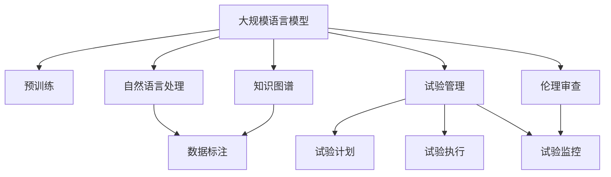

                 

# 临床试验和 LLM：提高效率和安全性

> 关键词：临床试验, LLM, 自然语言处理, 知识图谱, 数据标注, 实验管理, 自动摘要, 安全性, 伦理审查

## 1. 背景介绍

### 1.1 问题由来

随着医药行业的不断发展，临床试验成为新药上市不可或缺的环节。然而，传统的临床试验存在诸多问题，包括周期长、成本高、参与者招募难、数据标注复杂等。这些问题不仅限制了新药的开发速度，还增加了研究风险。

近年来，人工智能技术在医疗领域得到了广泛应用，尤其是在自然语言处理(NLP)和知识图谱(KG)方面的突破，为解决临床试验中的问题提供了新的思路。尤其是大规模语言模型(Large Language Models, LLMs)，在信息检索、数据标注、知识推理等方面展现出了强大的潜力。

### 1.2 问题核心关键点

1. **数据标注的复杂性**：临床试验需要大量的标注数据，但数据标注工作量大且耗时。传统的标注方式需要人工进行数据清洗、标注，成本高且容易出错。
2. **知识图谱的应用**：临床试验涉及复杂的生物医学知识，知识图谱可以为试验设计、结果分析等提供支持，但需要大量的知识资源和构建成本。
3. **试验管理的自动化**：临床试验涉及众多参与者和复杂流程，试验管理需要自动化的工具来提高效率和可靠性。
4. **试验安全性**：保障试验安全是临床试验的首要任务，涉及数据隐私、伦理审查等多个方面。

### 1.3 问题研究意义

利用大规模语言模型和知识图谱技术，可以有效提升临床试验的效率和安全性。具体而言，可以：

- **降低成本和周期**：通过自动化数据标注、知识推理等技术，降低试验成本和周期。
- **提高数据质量**：使用高级NLP技术优化数据标注流程，减少标注误差。
- **促进知识重用**：构建知识图谱，提高试验设计的科学性和可复用性。
- **保障试验安全**：通过智能化的安全监控，确保试验过程中的伦理合规和数据隐私。

## 2. 核心概念与联系

### 2.1 核心概念概述

为更好地理解基于 LLM 的临床试验优化方法，本节将介绍几个密切相关的核心概念：

- **大规模语言模型 (LLMs)**：指基于自监督学习的模型，如 GPT、BERT 等，可以在大规模语料上进行预训练，具备强大的语言理解和生成能力。
- **知识图谱 (KGs)**：指结构化表示实体及其关系的知识库，广泛用于医学、生物信息等领域，提供高质量的先验知识。
- **自然语言处理 (NLP)**：指利用计算机处理、理解和生成人类语言的技术，包括文本分类、信息检索、文本生成等。
- **试验管理 (Trial Management)**：指对临床试验进行计划、执行、监控和报告的系统化管理。
- **数据标注 (Data Annotation)**：指将非结构化文本数据转换为结构化数据的处理过程，是试验数据准备的重要环节。
- **伦理审查 (Ethics Review)**：指对试验设计的伦理合规性进行审查，保障受试者的权益和数据隐私。

这些概念之间的逻辑关系可以通过以下 Mermaid 流程图来展示：



这个流程图展示了大规模语言模型在临床试验中的应用逻辑：

1. 大规模语言模型通过预训练获得基础能力。
2. 利用 NLP 技术进行数据标注，提高标注效率和质量。
3. 结合知识图谱，优化试验设计，提高科学性。
4. 试验管理系统的智能化，提高试验执行和监控的效率。
5. 通过伦理审查，确保试验过程中的伦理合规和数据隐私。

## 3. 核心算法原理 & 具体操作步骤

### 3.1 算法原理概述

基于 LLM 的临床试验优化方法，本质上是一个结合了 NLP、KG 和试验管理的复杂过程。其核心思想是：利用 LLMs 在文本理解和生成方面的能力，结合 KG 中的先验知识，在试验管理系统中进行自动化和智能化的优化，从而提高试验效率和保障试验安全。

具体而言，包括以下几个关键步骤：

1. **数据预处理**：对临床试验相关的文本数据进行清洗、标注、格式转换等预处理。
2. **自然语言处理**：使用 LLMs 对预处理后的文本数据进行信息提取、关系推理、命名实体识别等 NLP 处理。
3. **知识图谱应用**：将 NLP 处理后的信息融入 KGs，进行数据关联、关系推理和知识融合。
4. **试验管理系统**：基于 NLP 和 KGs 提供的信息，进行试验计划、执行和监控，优化试验管理。
5. **伦理审查和安全性保障**：利用 LLMs 对试验设计进行伦理审查，确保试验安全性和合规性。

### 3.2 算法步骤详解

基于 LLM 的临床试验优化方法一般包括以下几个关键步骤：

**Step 1: 数据预处理**

- 收集临床试验相关的文本数据，如研究方案、受试者记录、临床报告等。
- 对文本数据进行清洗，去除无关或错误信息。
- 对文本数据进行标注，如命名实体识别、关系抽取等。
- 将文本数据转换为计算机可处理的格式，如 JSON、CSV 等。

**Step 2: 自然语言处理**

- 使用预训练的大规模语言模型（如 BERT、GPT）进行信息提取和关系推理。
- 对文本数据进行情感分析、主题建模、关系抽取等 NLP 处理。
- 利用知识图谱技术进行信息融合，构建试验设计所需的数据模型。

**Step 3: 知识图谱应用**

- 构建知识图谱，将 NLP 处理后的信息关联起来，形成结构化的知识库。
- 利用 KGs 中的先验知识，进行数据关联和关系推理。
- 使用 KGs 中的知识进行试验设计，如选择合适的受试者、预测试验结果等。

**Step 4: 试验管理系统**

- 基于 KGs 和 NLP 处理后的信息，优化试验计划和执行流程。
- 使用试验管理系统对试验数据进行自动化收集、分析和报告。
- 利用 LLMs 进行试验结果的智能分析和报告生成。

**Step 5: 伦理审查和安全性保障**

- 利用 LLMs 对试验设计进行伦理审查，确保试验符合伦理标准。
- 使用 LLMs 对试验数据进行隐私保护和安全性监控。
- 确保试验过程中受试者的权益和数据隐私得到保护。

### 3.3 算法优缺点

基于 LLM 的临床试验优化方法具有以下优点：

1. **自动化和智能化**：利用 LLMs 和 KGs 技术，提高试验设计的自动化和智能化水平，减少人工干预。
2. **提高数据质量**：通过 NLP 技术优化数据标注流程，减少标注误差，提高数据质量。
3. **促进知识重用**：构建知识图谱，提高试验设计的科学性和可复用性。
4. **保障试验安全**：通过智能化的安全监控，确保试验过程中的伦理合规和数据隐私。

但该方法也存在一定的局限性：

1. **模型依赖**：依赖预训练模型的质量，模型训练和优化需要大量计算资源。
2. **知识图谱构建成本高**：知识图谱的构建需要大量人工和数据，成本较高。
3. **数据隐私和安全风险**：试验数据的隐私和安全问题需要特别关注，确保数据保护。
4. **模型可解释性不足**：LLMs 和 KGs 的决策过程复杂，难以解释和调试。

尽管存在这些局限性，但就目前而言，基于 LLM 的临床试验优化方法仍是大规模应用的有力工具。未来相关研究的重点在于如何进一步降低预训练模型的依赖，提高知识图谱的自动化构建能力，同时兼顾数据隐私和模型可解释性等因素。

### 3.4 算法应用领域

基于 LLM 的临床试验优化方法在医药领域已经得到了广泛的应用，具体包括：

- **试验数据预处理**：利用 NLP 技术对临床试验数据进行清洗、标注和格式转换。
- **试验设计优化**：通过 KGs 和 NLP 技术，优化试验设计，提高试验效率和科学性。
- **试验执行监控**：利用 LLMs 进行试验数据的自动化收集、分析和报告生成。
- **试验结果分析**：使用 LLMs 进行试验结果的智能分析和报告生成。
- **试验安全性保障**：利用 LLMs 进行试验数据的隐私保护和安全性监控。

除了上述这些经典应用外，大语言模型和知识图谱技术还被创新性地应用到更多场景中，如药物发现、病理学分析、医学影像识别等，为医药领域的创新研究提供了新的工具和方法。

## 4. 数学模型和公式 & 详细讲解

### 4.1 数学模型构建

本节将使用数学语言对基于 LLM 的临床试验优化方法进行更加严格的刻画。

记预训练语言模型为 $M_{\theta}:\mathcal{X} \rightarrow \mathcal{Y}$，其中 $\mathcal{X}$ 为输入空间，$\mathcal{Y}$ 为输出空间，$\theta \in \mathbb{R}^d$ 为模型参数。假设临床试验的标注数据集为 $D=\{(x_i,y_i)\}_{i=1}^N, x_i \in \mathcal{X}, y_i \in \mathcal{Y}$。

定义模型 $M_{\theta}$ 在数据样本 $(x,y)$ 上的损失函数为 $\ell(M_{\theta}(x),y)$，则在数据集 $D$ 上的经验风险为：

$$
\mathcal{L}(\theta) = \frac{1}{N} \sum_{i=1}^N \ell(M_{\theta}(x_i),y_i)
$$

微调的优化目标是最小化经验风险，即找到最优参数：

$$
\theta^* = \mathop{\arg\min}_{\theta} \mathcal{L}(\theta)
$$

在实践中，我们通常使用基于梯度的优化算法（如 AdamW、SGD 等）来近似求解上述最优化问题。设 $\eta$ 为学习率，$\lambda$ 为正则化系数，则参数的更新公式为：

$$
\theta \leftarrow \theta - \eta \nabla_{\theta}\mathcal{L}(\theta) - \eta\lambda\theta
$$

其中 $\nabla_{\theta}\mathcal{L}(\theta)$ 为损失函数对参数 $\theta$ 的梯度，可通过反向传播算法高效计算。

### 4.2 公式推导过程

以下我们以二分类任务为例，推导交叉熵损失函数及其梯度的计算公式。

假设模型 $M_{\theta}$ 在输入 $x$ 上的输出为 $\hat{y}=M_{\theta}(x) \in [0,1]$，表示样本属于正类的概率。真实标签 $y \in \{0,1\}$。则二分类交叉熵损失函数定义为：

$$
\ell(M_{\theta}(x),y) = -[y\log \hat{y} + (1-y)\log (1-\hat{y})]
$$

将其代入经验风险公式，得：

$$
\mathcal{L}(\theta) = -\frac{1}{N}\sum_{i=1}^N [y_i\log M_{\theta}(x_i)+(1-y_i)\log(1-M_{\theta}(x_i))]
$$

根据链式法则，损失函数对参数 $\theta_k$ 的梯度为：

$$
\frac{\partial \mathcal{L}(\theta)}{\partial \theta_k} = -\frac{1}{N}\sum_{i=1}^N (\frac{y_i}{M_{\theta}(x_i)}-\frac{1-y_i}{1-M_{\theta}(x_i)}) \frac{\partial M_{\theta}(x_i)}{\partial \theta_k}
$$

其中 $\frac{\partial M_{\theta}(x_i)}{\partial \theta_k}$ 可进一步递归展开，利用自动微分技术完成计算。

在得到损失函数的梯度后，即可带入参数更新公式，完成模型的迭代优化。重复上述过程直至收敛，最终得到适应下游任务的最优模型参数 $\theta^*$。

## 5. 项目实践：代码实例和详细解释说明

### 5.1 开发环境搭建

在进行 LLM 和 KG 在临床试验中的应用实践前，我们需要准备好开发环境。以下是使用 Python 进行 PyTorch 和 SPARQL 开发的环境配置流程：

1. 安装 Anaconda：从官网下载并安装 Anaconda，用于创建独立的 Python 环境。

2. 创建并激活虚拟环境：
```bash
conda create -n pytorch-env python=3.8 
conda activate pytorch-env
```

3. 安装 PyTorch：根据 CUDA 版本，从官网获取对应的安装命令。例如：
```bash
conda install pytorch torchvision torchaudio cudatoolkit=11.1 -c pytorch -c conda-forge
```

4. 安装 SPARQL：
```bash
pip install sparql-python
```

5. 安装各类工具包：
```bash
pip install numpy pandas scikit-learn matplotlib tqdm jupyter notebook ipython
```

完成上述步骤后，即可在 `pytorch-env` 环境中开始项目实践。

### 5.2 源代码详细实现

下面我们以命名实体识别 (NER) 任务为例，给出使用 Transformers 库对 BERT 模型进行微调的 PyTorch 代码实现。

首先，定义 NER 任务的数据处理函数：

```python
from transformers import BertTokenizer
from torch.utils.data import Dataset
import torch

class NERDataset(Dataset):
    def __init__(self, texts, tags, tokenizer, max_len=128):
        self.texts = texts
        self.tags = tags
        self.tokenizer = tokenizer
        self.max_len = max_len
        
    def __len__(self):
        return len(self.texts)
    
    def __getitem__(self, item):
        text = self.texts[item]
        tags = self.tags[item]
        
        encoding = self.tokenizer(text, return_tensors='pt', max_length=self.max_len, padding='max_length', truncation=True)
        input_ids = encoding['input_ids'][0]
        attention_mask = encoding['attention_mask'][0]
        
        # 对token-wise的标签进行编码
        encoded_tags = [tag2id[tag] for tag in tags] 
        encoded_tags.extend([tag2id['O']] * (self.max_len - len(encoded_tags)))
        labels = torch.tensor(encoded_tags, dtype=torch.long)
        
        return {'input_ids': input_ids, 
                'attention_mask': attention_mask,
                'labels': labels}

# 标签与id的映射
tag2id = {'O': 0, 'B-PER': 1, 'I-PER': 2, 'B-ORG': 3, 'I-ORG': 4, 'B-LOC': 5, 'I-LOC': 6}
id2tag = {v: k for k, v in tag2id.items()}

# 创建dataset
tokenizer = BertTokenizer.from_pretrained('bert-base-cased')

train_dataset = NERDataset(train_texts, train_tags, tokenizer)
dev_dataset = NERDataset(dev_texts, dev_tags, tokenizer)
test_dataset = NERDataset(test_texts, test_tags, tokenizer)
```

然后，定义模型和优化器：

```python
from transformers import BertForTokenClassification, AdamW

model = BertForTokenClassification.from_pretrained('bert-base-cased', num_labels=len(tag2id))

optimizer = AdamW(model.parameters(), lr=2e-5)
```

接着，定义训练和评估函数：

```python
from torch.utils.data import DataLoader
from tqdm import tqdm
from sklearn.metrics import classification_report

device = torch.device('cuda') if torch.cuda.is_available() else torch.device('cpu')
model.to(device)

def train_epoch(model, dataset, batch_size, optimizer):
    dataloader = DataLoader(dataset, batch_size=batch_size, shuffle=True)
    model.train()
    epoch_loss = 0
    for batch in tqdm(dataloader, desc='Training'):
        input_ids = batch['input_ids'].to(device)
        attention_mask = batch['attention_mask'].to(device)
        labels = batch['labels'].to(device)
        model.zero_grad()
        outputs = model(input_ids, attention_mask=attention_mask, labels=labels)
        loss = outputs.loss
        epoch_loss += loss.item()
        loss.backward()
        optimizer.step()
    return epoch_loss / len(dataloader)

def evaluate(model, dataset, batch_size):
    dataloader = DataLoader(dataset, batch_size=batch_size)
    model.eval()
    preds, labels = [], []
    with torch.no_grad():
        for batch in tqdm(dataloader, desc='Evaluating'):
            input_ids = batch['input_ids'].to(device)
            attention_mask = batch['attention_mask'].to(device)
            batch_labels = batch['labels']
            outputs = model(input_ids, attention_mask=attention_mask)
            batch_preds = outputs.logits.argmax(dim=2).to('cpu').tolist()
            batch_labels = batch_labels.to('cpu').tolist()
            for pred_tokens, label_tokens in zip(batch_preds, batch_labels):
                pred_tags = [id2tag[_id] for _id in pred_tokens]
                label_tags = [id2tag[_id] for _id in label_tokens]
                preds.append(pred_tags[:len(label_tags)])
                labels.append(label_tags)
                
    print(classification_report(labels, preds))
```

最后，启动训练流程并在测试集上评估：

```python
epochs = 5
batch_size = 16

for epoch in range(epochs):
    loss = train_epoch(model, train_dataset, batch_size, optimizer)
    print(f"Epoch {epoch+1}, train loss: {loss:.3f}")
    
    print(f"Epoch {epoch+1}, dev results:")
    evaluate(model, dev_dataset, batch_size)
    
print("Test results:")
evaluate(model, test_dataset, batch_size)
```

以上就是使用 PyTorch 对 BERT 进行命名实体识别任务微调的完整代码实现。可以看到，得益于 Transformers 库的强大封装，我们可以用相对简洁的代码完成 BERT 模型的加载和微调。

### 5.3 代码解读与分析

让我们再详细解读一下关键代码的实现细节：

**NERDataset类**：
- `__init__`方法：初始化文本、标签、分词器等关键组件。
- `__len__`方法：返回数据集的样本数量。
- `__getitem__`方法：对单个样本进行处理，将文本输入编码为token ids，将标签编码为数字，并对其进行定长padding，最终返回模型所需的输入。

**tag2id和id2tag字典**：
- 定义了标签与数字id之间的映射关系，用于将token-wise的预测结果解码回真实的标签。

**训练和评估函数**：
- 使用PyTorch的DataLoader对数据集进行批次化加载，供模型训练和推理使用。
- 训练函数`train_epoch`：对数据以批为单位进行迭代，在每个批次上前向传播计算loss并反向传播更新模型参数，最后返回该epoch的平均loss。
- 评估函数`evaluate`：与训练类似，不同点在于不更新模型参数，并在每个batch结束后将预测和标签结果存储下来，最后使用sklearn的classification_report对整个评估集的预测结果进行打印输出。

**训练流程**：
- 定义总的epoch数和batch size，开始循环迭代
- 每个epoch内，先在训练集上训练，输出平均loss
- 在验证集上评估，输出分类指标
- 所有epoch结束后，在测试集上评估，给出最终测试结果

可以看到，PyTorch配合Transformers库使得BERT微调的代码实现变得简洁高效。开发者可以将更多精力放在数据处理、模型改进等高层逻辑上，而不必过多关注底层的实现细节。

当然，工业级的系统实现还需考虑更多因素，如模型的保存和部署、超参数的自动搜索、更灵活的任务适配层等。但核心的微调范式基本与此类似。

## 6. 实际应用场景

### 6.1 智能医疗辅助

基于 LLM 的临床试验优化方法，可以应用于智能医疗辅助系统中，提高医疗服务的智能化水平。智能医疗系统通过大规模语言模型和大数据，能够对临床试验中的各类数据进行智能化分析，提供实时的医疗建议和诊断。

具体而言，可以收集临床试验中的各种数据，包括病历、影像、实验室检查结果等，通过 NLP 技术进行信息提取和关系推理。使用知识图谱技术将不同数据关联起来，形成结构化的知识库。然后，利用 LLMs 对试验数据进行智能分析和报告生成，辅助医生进行诊断和治疗决策。

### 6.2 医药研发加速

在医药研发过程中，临床试验是耗费时间和成本的重要环节。利用 LLM 和 KG 技术，可以快速对试验数据进行分析，缩短试验周期，降低试验成本。

具体而言，可以使用 LLMs 对临床试验中的各类数据进行信息提取和关系推理，构建知识图谱。然后，利用知识图谱中的先验知识，进行试验设计优化和结果分析。通过智能化的试验管理系统，提高试验执行和监控的效率，加速新药的上市进程。

### 6.3 数据标注自动化

临床试验需要大量的标注数据，传统的数据标注方式耗时耗力。利用 LLMs 和 KGs 技术，可以自动化数据标注流程，减少标注误差，提高数据质量。

具体而言，可以使用 NLP 技术对临床试验数据进行清洗和标注，使用知识图谱技术对标注结果进行关联和推理。然后，利用 LLMs 进行智能化的数据标注，减少人工干预，提高标注效率和质量。

### 6.4 未来应用展望

随着 LLM 和 KG 技术的发展，基于这些技术的应用场景将越来越广泛。未来，大语言模型在临床试验中的应用将进一步拓展，为医药领域带来更多的创新和突破。

在智慧医疗领域，基于 LLM 的智能医疗辅助系统将进一步提升医疗服务的智能化水平，辅助医生进行诊断和治疗决策。

在医药研发领域，利用 LLM 和 KGs 技术，可以实现试验设计的科学化和自动化，加速新药的研发进程。

在数据标注领域，利用 LLMs 进行自动化标注，可以大幅降低标注成本，提高数据质量。

总之，基于 LLM 的临床试验优化技术将在医药领域发挥更大的作用，推动医药产业的数字化转型升级。

## 7. 工具和资源推荐

### 7.1 学习资源推荐

为了帮助开发者系统掌握 LLM 和 KG 在临床试验中的应用，这里推荐一些优质的学习资源：

1. 《Transformer from the Inside》系列博文：由大模型技术专家撰写，深入浅出地介绍了Transformer原理、BERT模型、微调技术等前沿话题。

2. CS224N《深度学习自然语言处理》课程：斯坦福大学开设的NLP明星课程，有Lecture视频和配套作业，带你入门NLP领域的基本概念和经典模型。

3. 《Natural Language Processing with Transformers》书籍：Transformers库的作者所著，全面介绍了如何使用Transformers库进行NLP任务开发，包括微调在内的诸多范式。

4. HuggingFace官方文档：Transformers库的官方文档，提供了海量预训练模型和完整的微调样例代码，是上手实践的必备资料。

5. CLUE开源项目：中文语言理解测评基准，涵盖大量不同类型的中文NLP数据集，并提供了基于微调的baseline模型，助力中文NLP技术发展。

通过对这些资源的学习实践，相信你一定能够快速掌握 LLM 和 KG 在临床试验中的应用，并用于解决实际的NLP问题。

### 7.2 开发工具推荐

高效的开发离不开优秀的工具支持。以下是几款用于 LLM 和 KG 在临床试验中的应用开发的常用工具：

1. PyTorch：基于Python的开源深度学习框架，灵活动态的计算图，适合快速迭代研究。大部分预训练语言模型都有PyTorch版本的实现。

2. TensorFlow：由Google主导开发的开源深度学习框架，生产部署方便，适合大规模工程应用。同样有丰富的预训练语言模型资源。

3. Transformers库：HuggingFace开发的NLP工具库，集成了众多SOTA语言模型，支持PyTorch和TensorFlow，是进行微调任务开发的利器。

4. Weights & Biases：模型训练的实验跟踪工具，可以记录和可视化模型训练过程中的各项指标，方便对比和调优。与主流深度学习框架无缝集成。

5. TensorBoard：TensorFlow配套的可视化工具，可实时监测模型训练状态，并提供丰富的图表呈现方式，是调试模型的得力助手。

6. Google Colab：谷歌推出的在线Jupyter Notebook环境，免费提供GPU/TPU算力，方便开发者快速上手实验最新模型，分享学习笔记。

合理利用这些工具，可以显著提升 LLM 和 KG 在临床试验中的应用开发效率，加快创新迭代的步伐。

### 7.3 相关论文推荐

大语言模型和知识图谱在临床试验中的应用源于学界的持续研究。以下是几篇奠基性的相关论文，推荐阅读：

1. Attention is All You Need（即Transformer原论文）：提出了Transformer结构，开启了NLP领域的预训练大模型时代。

2. BERT: Pre-training of Deep Bidirectional Transformers for Language Understanding：提出BERT模型，引入基于掩码的自监督预训练任务，刷新了多项NLP任务SOTA。

3. Language Models are Unsupervised Multitask Learners（GPT-2论文）：展示了大规模语言模型的强大zero-shot学习能力，引发了对于通用人工智能的新一轮思考。

4. Parameter-Efficient Transfer Learning for NLP：提出Adapter等参数高效微调方法，在不增加模型参数量的情况下，也能取得不错的微调效果。

5. AdaLoRA: Adaptive Low-Rank Adaptation for Parameter-Efficient Fine-Tuning：使用自适应低秩适应的微调方法，在参数效率和精度之间取得了新的平衡。

6. Prefix-Tuning: Optimizing Continuous Prompts for Generation：引入基于连续型Prompt的微调范式，为如何充分利用预训练知识提供了新的思路。

这些论文代表了大语言模型和知识图谱在临床试验中的应用发展脉络。通过学习这些前沿成果，可以帮助研究者把握学科前进方向，激发更多的创新灵感。

## 8. 总结：未来发展趋势与挑战

### 8.1 总结

本文对基于 LLM 的临床试验优化方法进行了全面系统的介绍。首先阐述了大语言模型和知识图谱在临床试验中的应用背景和意义，明确了这些技术在试验数据预处理、试验设计优化、试验执行监控等方面的独特价值。其次，从原理到实践，详细讲解了 LLM 和 KGs 在临床试验中的应用方法，给出了应用示例和代码实现。同时，本文还探讨了 LLM 和 KGs 在智能医疗辅助、医药研发加速、数据标注自动化等方面的应用前景，展示了这些技术在医药领域的广阔前景。此外，本文精选了 LLM 和 KGs 在临床试验中的各类学习资源，力求为读者提供全方位的技术指引。

通过本文的系统梳理，可以看到，基于 LLM 和 KGs 的临床试验优化方法正在成为医药领域的重要工具，极大地提高了试验效率和数据质量。未来，伴随 LLM 和 KGs 技术的发展，基于这些技术的应用场景将进一步拓展，为医药产业带来更多的创新和突破。

### 8.2 未来发展趋势

展望未来，基于 LLM 的临床试验优化技术将呈现以下几个发展趋势：

1. **模型规模持续增大**：随着算力成本的下降和数据规模的扩张，预训练语言模型的参数量还将持续增长。超大规模语言模型蕴含的丰富语言知识，有望支撑更加复杂多变的试验设计优化。

2. **知识图谱的自动化构建**：现有知识图谱的构建需要大量人工和数据，成本较高。未来的研究将探索更加自动化的知识图谱构建方法，减少人工干预，提高构建效率。

3. **知识图谱的融合与重用**：未来的知识图谱将更多地融合多源数据，提供更加全面和准确的先验知识，提高试验设计的科学性和可复用性。

4. **试验管理的自动化与智能化**：利用 LLMs 和 KGs 技术，进一步提升试验管理的自动化和智能化水平，减少人工干预，提高试验执行和监控的效率。

5. **数据标注的自动化与智能化**：利用 LLMs 进行数据标注，可以大幅降低标注成本，提高标注质量。未来的研究将探索更多自动化的数据标注方法，减少人工干预。

6. **安全性与隐私保护**：临床试验数据的隐私和安全问题需要特别关注。未来的研究将进一步加强试验数据的安全性保障，确保数据隐私。

7. **多模态数据的融合**：未来的研究将更多地融合文本、图像、视频等多模态数据，提供更加全面和准确的试验数据，提高试验设计和结果分析的科学性。

以上趋势凸显了大语言模型和知识图谱在临床试验中的应用前景。这些方向的探索发展，必将进一步提升临床试验的效率和科学性，为医药产业带来更多的创新和突破。

### 8.3 面临的挑战

尽管大语言模型和知识图谱在临床试验中的应用已经取得了显著进展，但在迈向更加智能化、普适化应用的过程中，仍面临诸多挑战：

1. **模型依赖**：依赖预训练模型的质量，模型训练和优化需要大量计算资源。如何降低模型依赖，提高模型的泛化能力，是未来研究的重要方向。

2. **知识图谱的构建成本**：知识图谱的构建需要大量人工和数据，成本较高。如何降低知识图谱构建成本，提高构建效率，是未来研究的重要课题。

3. **数据隐私和安全风险**：试验数据的隐私和安全问题需要特别关注。如何在保证数据隐私和安全的前提下，进行智能化的试验设计和结果分析，是未来研究的重要方向。

4. **模型的可解释性不足**：LLMs 和 KGs 的决策过程复杂，难以解释和调试。如何赋予模型更强的可解释性，是未来研究的重要方向。

5. **多模态数据的融合**：融合文本、图像、视频等多模态数据，需要解决数据格式、特征表示等诸多问题，需要更多的算法和工具支持。

6. **模型的复杂性**：大语言模型和知识图谱的决策过程复杂，模型的设计、训练和优化都需要高水平的工程和算法能力。

这些挑战需要未来的研究进一步突破，才能更好地推动大语言模型和知识图谱在临床试验中的应用。

### 8.4 研究展望

面对大语言模型和知识图谱在临床试验中面临的挑战，未来的研究需要在以下几个方面寻求新的突破：

1. **探索无监督和半监督学习**：摆脱对大规模标注数据的依赖，利用自监督学习、主动学习等无监督和半监督范式，最大限度利用非结构化数据，实现更加灵活高效的试验设计优化。

2. **研究参数高效和计算高效的微调范式**：开发更加参数高效的微调方法，在固定大部分预训练参数的同时，只更新极少量的任务相关参数。同时优化微调模型的计算图，减少前向传播和反向传播的资源消耗，实现更加轻量级、实时性的部署。

3. **引入因果学习和知识图谱**：通过引入因果推断和知识图谱思想，增强试验设计的科学性和可复用性，提高试验结果的解释性和可信度。

4. **结合多源数据和专家知识**：将符号化的先验知识，如知识图谱、逻辑规则等，与神经网络模型进行巧妙融合，引导试验设计优化过程，提高试验设计的科学性和可复用性。

5. **纳入伦理道德约束**：在试验设计中引入伦理导向的评估指标，过滤和惩罚有偏见、有害的试验设计，确保试验合规性和伦理安全性。

这些研究方向将引领大语言模型和知识图谱在临床试验中的应用走向成熟，推动临床试验的数字化转型升级，为医药产业带来更多的创新和突破。面向未来，大语言模型和知识图谱在临床试验中的应用需要与其他人工智能技术进行更深入的融合，如知识表示、因果推理、强化学习等，多路径协同发力，共同推动自然语言理解和智能交互系统的进步。只有勇于创新、敢于突破，才能不断拓展语言模型的边界，让智能技术更好地造福人类社会。

## 9. 附录：常见问题与解答

**Q1：大语言模型和知识图谱在临床试验中主要解决哪些问题？**

A: 大语言模型和知识图谱在临床试验中主要解决以下问题：

1. **数据预处理**：对临床试验相关的文本数据进行清洗、标注、格式转换等预处理。
2. **试验设计优化**：利用知识图谱中的先验知识，进行试验设计优化，提高试验设计的科学性和可复用性。
3. **试验执行监控**：使用 LLMs 进行试验数据的自动化收集、分析和报告生成，提高试验执行和监控的效率。
4. **试验结果分析**：利用 LLMs 进行试验结果的智能分析和报告生成，辅助医生进行诊断和治疗决策。
5. **试验安全性保障**：利用 LLMs 对试验设计进行伦理审查，确保试验过程中的伦理合规和数据隐私。

**Q2：大语言模型和知识图谱在临床试验中的关键步骤是什么？**

A: 大语言模型和知识图谱在临床试验中的关键步骤包括：

1. **数据预处理**：对临床试验相关的文本数据进行清洗、标注、格式转换等预处理。
2. **自然语言处理**：使用 LLMs 对预处理后的文本数据进行信息提取、关系推理、命名实体识别等 NLP 处理。
3. **知识图谱应用**：将 NLP 处理后的信息融入 KGs，进行数据关联、关系推理和知识融合。
4. **试验管理系统**：基于 KGs 和 NLP 处理后的信息，进行试验计划、执行和监控，优化试验管理。
5. **伦理审查和安全性保障**：利用 LLMs 对试验设计进行伦理审查，确保试验过程中的伦理合规和数据隐私。

**Q3：如何选择合适的预训练模型进行临床试验优化？**

A: 选择合适的预训练模型进行临床试验优化需要考虑以下几个因素：

1. **任务匹配**：选择与临床试验任务相关的预训练模型，如命名实体识别、关系抽取等。
2. **数据规模**：选择适合数据规模的预训练模型，避免因数据量过大或过小导致的模型性能问题。
3. **预训练任务**：选择预训练任务与临床试验任务相似度高的模型，以便更好地迁移知识。
4. **模型参数**：选择参数规模适中的模型，避免因参数过多或过少导致的模型性能问题。
5. **性能评估**：在验证集上评估模型性能，选择效果最好的模型。

**Q4：大语言模型和知识图谱在临床试验中如何降低成本和周期？**

A: 大语言模型和知识图谱在临床试验中可以降低成本和周期的方式包括：

1. **数据标注自动化**：利用 LLMs 进行数据标注，减少标注成本和周期。
2. **知识图谱重用**：构建知识图谱，提高试验设计的科学性和可复用性，减少重复构建工作。
3. **试验设计优化**：利用知识图谱中的先验知识，优化试验设计，提高试验设计的科学性和效率。
4. **试验执行监控自动化**：使用 LLMs 进行试验数据的自动化收集、分析和报告生成，提高试验执行和监控的效率。
5. **试验结果分析自动化**：利用 LLMs 进行试验结果的智能分析和报告生成，减少人工干预，提高结果分析的效率。

**Q5：如何保障临床试验数据的隐私和安全？**

A: 保障临床试验数据的隐私和安全需要考虑以下几个方面：

1. **数据匿名化**：对试验数据进行匿名化处理，确保受试者的身份信息不泄露。
2. **数据加密**：对试验数据进行加密处理，防止数据泄露。
3. **访问控制**：对试验数据的访问进行严格控制，确保只有授权人员可以访问数据。
4. **数据审计**：对试验数据的访问和使用进行审计，记录和监控数据访问和使用情况。
5. **合规审查**：对试验设计进行伦理审查，确保试验符合伦理标准和法律法规。

---

作者：禅与计算机程序设计艺术 / Zen and the Art of Computer Programming

