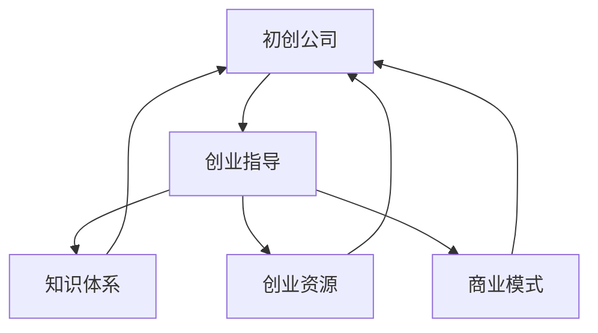

                 

# 为创业者提供系统知识培训和创业指导

> 关键词：初创公司,创业指导,知识体系,创业资源,商业模式

## 1. 背景介绍

当今世界，技术日新月异，商业模式不断迭代，创业者在面对众多机遇和挑战时，往往感到迷茫和不知所措。因此，为创业者提供系统的知识培训和科学的创业指导，成为促进技术创新和市场转型的重要手段。本文旨在为创业者提供系统的知识体系和科学的创业指导，帮助他们在复杂多变的市场环境中，抓住机遇，规避风险，实现企业的可持续发展。

## 2. 核心概念与联系

### 2.1 核心概念概述

为更好地理解本文的核心概念和框架，我们将对以下概念进行详细讲解：

- **初创公司(Startup)**：指创业早期阶段的公司，其核心任务是产品开发、市场拓展和融资等。
- **创业指导(Entrepreneurship Guidance)**：指通过培训、咨询等方式，帮助创业者掌握创业知识、技能和资源，提升企业运营能力。
- **知识体系(Knowledge System)**：指系统化的、相互关联的知识结构，涵盖企业运营、技术开发、市场拓展等多个方面。
- **创业资源(Entrepreneurial Resources)**：指创业者在创业过程中所需的资源，包括资金、人才、技术、市场渠道等。
- **商业模式(Business Model)**：指企业基于市场调研和竞争分析，确立的实现价值创造和价值捕获的逻辑。

### 2.2 核心概念原理和架构的 Mermaid 流程图



以上流程图展示了初创公司与创业指导、知识体系、创业资源、商业模式之间的联系。创业者通过获取创业指导，掌握这些关键概念和工具，能够更好地构建企业的知识体系，整合资源，制定商业策略，最终实现企业的成功运营。

## 3. 核心算法原理 & 具体操作步骤

### 3.1 算法原理概述

创业指导的过程，本质上是利用一系列算法和模型，帮助创业者在复杂多变的环境中，做出科学的决策。这些算法和模型通常包括：

- **数据驱动决策**：通过市场调研和数据分析，获取有价值的信息，指导企业运营。
- **风险管理**：识别和评估潜在的风险，制定相应的应对策略。
- **市场分析**：分析市场需求、竞争对手和市场趋势，制定合理的市场策略。
- **财务规划**：通过财务模型，预测企业未来发展，制定合理的财务策略。

### 3.2 算法步骤详解

创业指导的步骤可以分为以下几个关键环节：

**Step 1: 前期调研**
- 收集市场信息，了解目标市场的规模、竞争态势和趋势。
- 分析潜在客户的需求和痛点，明确企业的市场定位。
- 评估自身资源和能力，确定企业的发展战略。

**Step 2: 资源整合**
- 识别和整合企业所需的各类资源，包括资金、人才、技术、市场渠道等。
- 制定资源分配和利用策略，确保资源的有效利用。
- 构建资源网络，建立合作伙伴关系，提升企业的竞争力。

**Step 3: 知识培训**
- 通过课程培训、读书会、网络资源等方式，提升创业者的知识和技能。
- 学习市场分析、财务规划、风险管理等关键技能，提升企业的运营能力。
- 分享成功案例和失败教训，帮助创业者更好地理解创业过程。

**Step 4: 商业模式设计**
- 基于市场调研和资源整合的结果，设计合理的商业模式。
- 明确价值创造和价值捕获的逻辑，制定可行的运营策略。
- 进行市场验证，不断优化商业模式，提升企业市场竞争力。

### 3.3 算法优缺点

创业指导的算法具有以下优点：

- **系统性**：通过系统的知识培训和指导，创业者可以全面掌握创业所需的知识体系，提升企业的运营能力。
- **实践性**：结合实际案例和实操演练，帮助创业者更好地理解创业过程，提升实战能力。
- **指导性**：通过专家指导和资源整合，帮助创业者识别风险和机会，制定科学的决策。

同时，这些算法也存在以下缺点：

- **复杂度高**：创业指导涉及多个环节，每个环节都需要综合考虑各种因素，复杂度较高。
- **数据依赖**：创业指导的效果依赖于准确的市场信息和数据分析，数据质量直接影响指导效果。
- **动态变化**：市场环境和竞争态势不断变化，创业指导需要不断更新和优化，才能保持有效性。

### 3.4 算法应用领域

创业指导的算法广泛应用于初创企业的各个阶段，包括但不限于以下几个领域：

- **市场调研**：帮助企业了解市场趋势和客户需求，制定合适的市场策略。
- **产品开发**：基于客户需求和市场趋势，指导产品设计、开发和测试。
- **融资策略**：通过财务规划和市场分析，制定合理的融资策略，获取资金支持。
- **风险管理**：识别潜在风险，制定应对策略，提升企业的抗风险能力。

## 4. 数学模型和公式 & 详细讲解 & 举例说明

### 4.1 数学模型构建

在进行创业指导的数学建模时，通常涉及以下关键模型：

- **线性回归模型**：用于预测市场趋势和客户需求，指导企业的市场策略。
- **蒙特卡洛模拟**：用于评估项目的财务风险和不确定性，指导企业的财务决策。
- **网络分析模型**：用于分析企业的资源网络和合作伙伴关系，指导企业的资源整合策略。

### 4.2 公式推导过程

以下是几个常见模型的公式推导：

**线性回归模型**：
假设市场规模为 $M$，客户需求率为 $D$，价格为 $P$，回归系数为 $\beta$，则线性回归模型为：
$$
M = \alpha + \beta_1 P + \beta_2 D + \epsilon
$$
其中 $\alpha$ 为截距，$\epsilon$ 为误差项。

**蒙特卡洛模拟**：
假设项目的初始投资为 $I$，期望收益率为 $r$，项目寿命为 $n$，蒙特卡洛模拟中模拟的年数也为 $n$，则期望收益为：
$$
E = \sum_{i=1}^n (I \times (1 + r)^i)
$$

**网络分析模型**：
假设企业与供应商、客户、合作伙伴之间的关系强度为 $s$，则网络分析模型可以表示为：
$$
G = \sum_{i=1}^N s_i
$$
其中 $G$ 为关系强度总和，$N$ 为企业数量。

### 4.3 案例分析与讲解

假设某初创公司欲进入医疗健康领域，如何进行市场调研和商业模式设计：

**Step 1: 前期调研**
- 收集医疗健康领域的相关数据，如市场规模、增长率、竞争态势等。
- 分析潜在客户的需求和痛点，如健康监测、个性化医疗等。
- 评估自身资源和能力，如技术实力、资金需求、团队配置等。

**Step 2: 资源整合**
- 识别和整合医疗健康领域所需的各类资源，如医疗设备、健康监测技术、资金等。
- 制定资源分配和利用策略，如合理配置研发团队，提升技术能力。
- 构建资源网络，建立与医疗机构、供应商的合作关系，提升企业的竞争力。

**Step 3: 知识培训**
- 通过市场调研、技术培训、财务规划等方式，提升团队的知识和技能。
- 学习医疗健康领域的关键技术和市场策略，如远程健康监测、个性化医疗等。
- 分享成功案例和失败教训，如可穿戴设备在健康监测中的应用，提升团队的实战能力。

**Step 4: 商业模式设计**
- 基于市场调研和资源整合的结果，设计医疗健康领域的商业模式。
- 明确价值创造和价值捕获的逻辑，如通过健康监测数据获取精准医疗服务，获取用户的订阅费用。
- 进行市场验证，不断优化商业模式，提升企业的市场竞争力。

## 5. 项目实践：代码实例和详细解释说明

### 5.1 开发环境搭建

在进行创业指导的实践时，需要搭建以下开发环境：

1. **Python环境**：安装Python 3.x版本，选择适合的IDE，如Jupyter Notebook、PyCharm等。
2. **数据分析库**：安装NumPy、Pandas、Matplotlib等常用数据分析库，用于数据处理和可视化。
3. **机器学习库**：安装Scikit-Learn、TensorFlow等常用机器学习库，用于模型构建和训练。
4. **数据获取和预处理**：收集和预处理市场调研数据、客户需求数据、财务数据等，为模型训练提供数据基础。

### 5.2 源代码详细实现

以下是一个简单的市场调研和财务分析的Python代码实现：

```python
import pandas as pd
import numpy as np
from sklearn.linear_model import LinearRegression
from sklearn.metrics import r2_score

# 数据预处理
data = pd.read_csv('market_data.csv')
X = data[['P', 'D']]
y = data['M']

# 线性回归模型
model = LinearRegression()
model.fit(X, y)

# 预测和评估
y_pred = model.predict(X)
print(f'R^2: {r2_score(y, y_pred)}')
```

### 5.3 代码解读与分析

**数据预处理**：使用Pandas库读取市场调研数据，并进行数据清洗和特征提取。

**模型训练**：使用Scikit-Learn库中的LinearRegression模型，对市场规模进行线性回归预测。

**结果评估**：使用R^2系数评估模型的预测精度，衡量模型的拟合效果。

### 5.4 运行结果展示

执行上述代码，输出R^2系数，可以评估模型的预测效果。若系数接近1，说明模型的预测精度较高。

## 6. 实际应用场景

### 6.1 初创公司的市场调研

假设某初创公司欲进入人工智能教育领域，进行市场调研和商业模式设计。

**Step 1: 前期调研**
- 收集人工智能教育领域的相关数据，如市场规模、增长率、竞争态势等。
- 分析潜在客户的需求和痛点，如个性化学习、AI辅助教学等。
- 评估自身资源和能力，如技术实力、资金需求、团队配置等。

**Step 2: 资源整合**
- 识别和整合人工智能教育领域所需的各类资源，如AI技术、教育资源、资金等。
- 制定资源分配和利用策略，如合理配置研发团队，提升技术能力。
- 构建资源网络，建立与教育机构、AI技术的合作，提升企业的竞争力。

**Step 3: 知识培训**
- 通过市场调研、技术培训、财务规划等方式，提升团队的知识和技能。
- 学习人工智能教育领域的关键技术和市场策略，如个性化学习平台、AI辅助教学等。
- 分享成功案例和失败教训，如可穿戴设备在健康监测中的应用，提升团队的实战能力。

**Step 4: 商业模式设计**
- 基于市场调研和资源整合的结果，设计人工智能教育领域的商业模式。
- 明确价值创造和价值捕获的逻辑，如通过AI技术提供个性化学习服务，获取用户的订阅费用。
- 进行市场验证，不断优化商业模式，提升企业的市场竞争力。

## 7. 工具和资源推荐

### 7.1 学习资源推荐

为帮助创业者系统掌握创业指导的知识体系，以下是一些优质的学习资源：

1. **Coursera《创业基础》课程**：由斯坦福大学教授开设，系统讲解创业的基础知识和实战技巧。
2. **Udacity《创业加速计划》**：涵盖市场调研、商业模型设计、融资策略等多个环节，实战性强。
3. **Harvard Business Review《创业之道》**：提供各类创业案例和成功经验，涵盖多领域创业指导。
4. **Crunchbase《创业数据》**：提供创业公司、投资、市场数据等，帮助创业者了解市场趋势。
5. **Y Combinator《创业手册》**：由知名创业孵化器Y Combinator编写，提供创业指导和资源整合建议。

### 7.2 开发工具推荐

以下几款工具将帮助创业者更好地实现创业指导的实践：

1. **Python**：作为数据科学和机器学习的主流语言，Python简单易用，支持丰富的数据分析和机器学习库。
2. **Jupyter Notebook**：交互式开发环境，支持代码编写、数据分析和可视化，便于团队协作和项目管理。
3. **Tableau**：强大的数据可视化工具，支持数据探索和报告生成，帮助创业者更好地理解数据。
4. **GitHub**：代码托管和版本控制平台，支持协作开发和项目管理，便于团队协同工作。

### 7.3 相关论文推荐

以下是几篇奠基性的创业指导相关论文，推荐阅读：

1. **《创业过程的社会学习》(Social Learning in Entrepreneurship)**：阐述了创业者通过社会网络学习和创新的方法。
2. **《创业过程模型》(The Entrepreneurial Process Model)**：提出了创业过程的关键阶段和关键要素，指导创业策略设计。
3. **《创业风险管理》(Risk Management in Entrepreneurship)**：分析了创业过程中面临的风险类型和应对策略，指导创业实践。
4. **《创业商业模式》(The Business Model of Startups)**：详细阐述了创业商业模式的构建和评估方法，指导创业决策。

## 8. 总结：未来发展趋势与挑战

### 8.1 总结

本文对创业指导的算法和模型进行了全面系统的介绍，帮助创业者掌握创业知识体系和科学方法，提升企业的运营能力。通过本文的系统梳理，可以看到创业指导在复杂多变的市场环境中，具有系统性、实践性和指导性，能够帮助创业者抓住机遇，规避风险，实现企业的可持续发展。

### 8.2 未来发展趋势

展望未来，创业指导的算法将呈现以下几个发展趋势：

1. **数据驱动决策**：随着大数据技术的发展，数据驱动决策将成为创业指导的核心。通过深入的市场数据分析，指导企业运营和决策。
2. **智能决策支持**：结合人工智能技术，提供更加精准的决策支持，提升企业的运营效率。
3. **全球化视野**：在经济全球化背景下，创业者需要具备全球化视野，了解国际市场和法规，提升企业的国际化竞争力。
4. **可持续发展**：绿色环保和可持续发展成为全球共识，创业者需要在创业过程中注重社会责任和企业可持续发展。
5. **科技融合**：科技与创业指导的深度融合，通过区块链、物联网、大数据等技术，提升企业的创新能力。

这些趋势表明，创业指导的未来发展将更加注重数据的驱动和智能决策支持，同时关注全球化视野和可持续发展，通过科技融合提升企业的创新能力。

### 8.3 面临的挑战

尽管创业指导的算法取得了一定的进展，但在实践中仍面临诸多挑战：

1. **数据质量问题**：创业指导的效果依赖于数据质量，数据的不完整、不精确、不及时等问题，可能导致决策失误。
2. **动态变化**：市场环境和竞争态势不断变化，创业指导需要不断更新和优化，才能保持有效性。
3. **资源限制**：初创企业往往面临资源限制，如何有效整合和利用各类资源，是创业指导的重要课题。
4. **人才储备**：高素质的人才储备是创业指导的基础，如何吸引和培养高素质人才，是初创企业面临的难题。
5. **市场风险**：创业过程中面临的各种市场风险，如政策变化、技术变革等，需要创业者具备较强的风险应对能力。

### 8.4 研究展望

为应对这些挑战，未来的研究需要在以下几个方面寻求新的突破：

1. **数据治理和质量提升**：通过数据治理和质量提升，确保数据的完整性、准确性和及时性，提升数据驱动决策的效果。
2. **智能决策系统**：结合人工智能技术，开发智能决策支持系统，提供精准的决策建议。
3. **资源整合平台**：构建企业资源整合平台，优化资源配置，提升企业的运营效率。
4. **人才培训和引进**：通过培训和引进高素质人才，提升创业团队的综合素质和创新能力。
5. **风险预警和应对**：开发风险预警和应对系统，提升企业对市场风险的应对能力。

这些研究方向的探索，将为创业指导提供更加科学和有效的方法，帮助创业者更好地应对市场变化，提升企业的运营能力。

## 9. 附录：常见问题与解答

**Q1: 创业指导对初创公司有哪些具体作用？**

A: 创业指导通过系统化的知识培训和科学的决策支持，帮助初创公司全面提升运营能力。具体作用包括：
1. **市场调研**：帮助企业了解市场趋势和客户需求，制定合适的市场策略。
2. **资源整合**：识别和整合企业所需的各类资源，确保资源的有效利用。
3. **知识培训**：提升团队的知识和技能，增强企业的实战能力。
4. **商业模式设计**：设计合理的商业模式，提升企业的市场竞争力。

**Q2: 初创公司在进行市场调研时，应该关注哪些关键指标？**

A: 初创公司在进行市场调研时，应关注以下关键指标：
1. **市场规模和增长率**：了解市场的总量和增长趋势，评估市场的潜力和机会。
2. **客户需求和痛点**：分析潜在客户的需求和痛点，明确企业的市场定位。
3. **竞争态势**：评估竞争对手的数量、实力和市场策略，制定相应的竞争策略。
4. **资金需求**：估算项目所需的资金，制定合理的融资策略。

**Q3: 初创公司如何进行有效的资源整合？**

A: 初创公司进行有效的资源整合，可以遵循以下步骤：
1. **识别资源需求**：明确企业所需的关键资源，如资金、人才、技术、市场渠道等。
2. **资源获取和评估**：通过多种渠道获取资源，并对资源的成本、效益进行评估。
3. **资源配置和利用**：制定资源分配和利用策略，确保资源的有效利用。
4. **建立合作网络**：构建资源网络，建立合作伙伴关系，提升企业的竞争力。

**Q4: 初创公司如何进行有效的知识培训？**

A: 初创公司进行有效的知识培训，可以遵循以下步骤：
1. **确定培训需求**：根据企业的运营需求，确定需要提升的知识和技能。
2. **选择合适的培训资源**：选择适合的培训课程、书籍、网络资源等，提升团队的知识水平。
3. **实践演练**：通过案例分析、模拟演练等方式，增强团队的实战能力。
4. **评估和反馈**：通过评估和反馈，不断优化培训效果，提升团队的综合素质。

**Q5: 初创公司在设计商业模式时，应该关注哪些关键要素？**

A: 初创公司在设计商业模式时，应关注以下关键要素：
1. **价值创造**：明确企业的核心价值和创新点，确保产品和服务具有竞争力。
2. **价值捕获**：制定合理的定价策略和收益模式，实现价值最大化。
3. **市场策略**：制定有效的市场策略，扩大市场覆盖和客户群体。
4. **风险管理**：识别和评估潜在的风险，制定相应的应对策略。

---

作者：禅与计算机程序设计艺术 / Zen and the Art of Computer Programming

