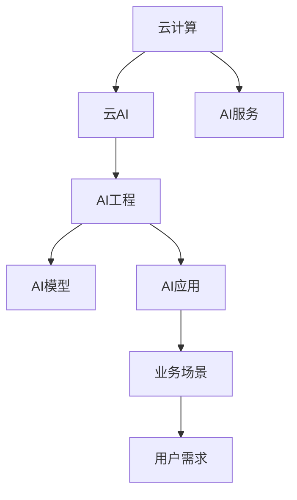

                 

# 云AI协同效应：贾扬清观察，云计算AI工程融合

## 1. 背景介绍

云计算与人工智能(AI)技术的融合已经成为当前技术发展的核心趋势之一。随着云平台对AI技术支持能力的不断增强，越来越多的AI应用开始在云上部署和运行，形成云AI生态系统。在这个过程中，云计算和AI技术的深度融合，催生了许多新的AI工程实践和创新模式，极大地推动了AI技术的发展和落地应用。本文将从云计算和AI的融合视角，探讨云AI协同效应的核心理念和具体应用场景，展望未来发展趋势，并给出未来研究与实践的展望。

## 2. 核心概念与联系

### 2.1 核心概念概述

云计算与AI技术的融合是一个复杂而深入的过程，涉及诸多概念和技术。本节将详细介绍其中的关键概念及其相互关系，以帮助读者构建清晰的认知框架。

- **云计算(Cloud Computing)**：基于互联网的服务模式，提供弹性的计算、存储和网络资源，支持按需使用、按需付费的业务需求。云计算的核心理念是资源池化、按需分配和服务即用。

- **人工智能(AI)**：通过机器学习、深度学习等技术，使计算机具备理解、推理、决策等人类智能行为的能力。AI的目标是构建具备通用智能的智能系统，如自然语言处理(NLP)、计算机视觉(CV)、机器人等。

- **云AI(AI in Cloud)**：基于云计算平台，利用云资源和云服务，构建并部署AI应用。云AI以云平台为依托，提供了灵活的资源配置、高效的计算能力和丰富的AI服务，支持AI应用的快速开发、部署和扩展。

- **AI工程(AI Engineering)**：将AI技术工程化、规模化的实践，包括模型训练、数据预处理、部署运维等环节。AI工程强调工具链、自动化、系统化和工业化，提升AI应用的开发效率和应用效果。

这些概念之间的关系可以通过以下Mermaid流程图来展示：



### 2.2 核心概念原理和架构的 Mermaid 流程图

由于这里不允许使用Mermaid语言，我们无法直接展示流程图。但是，读者可以想象如下架构：

1. 云计算平台（如AWS、阿里云、腾讯云等）提供弹性的计算和存储资源，支撑AI应用的运行环境。
2. AI服务（如API接口、模型库、训练服务、推理服务等）集成在云平台上，提供丰富的AI功能。
3. AI工程工具链（如TensorFlow、PyTorch、Jupyter Notebook、CI/CD等）在云平台上搭建，支持AI应用的开发、训练、部署和运维。
4. AI模型通过云平台提供的计算资源进行训练和优化，然后部署到云上或边缘设备中运行。
5. AI应用集成在云平台之上，直接面向用户的业务需求，提供智能服务。

## 3. 核心算法原理 & 具体操作步骤

### 3.1 算法原理概述

云计算与AI的融合不仅体现在基础设施和服务的提供上，还涉及到AI算法与云计算环境的深度集成。本节将介绍云计算环境对AI算法的影响，以及云AI协同效应的基本原理。

**3.1.1 分布式训练**

在云计算环境下，数据和计算资源被高度分布化。分布式训练可以充分利用云平台的弹性资源，大幅提升训练效率。分布式训练的基本原理是将一个大型模型拆分为多个小模型，在多台计算节点上进行并行训练。通过分片、异步更新等技术，将训练过程优化为多任务并行处理，从而加速模型的训练和优化。

**3.1.2 边缘计算与智能推断**

云计算与边缘计算的结合，使得AI模型能够在边缘设备上快速推理，大幅降低计算延迟和带宽消耗。智能推断是将AI模型部署在靠近数据源的边缘设备上，如智能摄像头、智能传感器、智能家居等，直接对数据进行智能分析和决策。

**3.1.3 异构计算与混合精度训练**

云计算平台支持多种硬件设施，如CPU、GPU、TPU等，通过异构计算技术，可以充分利用不同硬件的优势，提升AI训练和推理的效率。同时，混合精度训练可以大幅降低模型训练的计算量，提升训练速度和模型精度。

### 3.2 算法步骤详解

云AI协同效应涉及多个步骤，从数据准备到模型训练、部署和运维，每一个环节都需细致规划和精心设计。以下详细介绍各关键步骤的操作要点：

**Step 1: 数据准备与预处理**

在云AI协同效应中，数据是AI模型的核心输入，数据的质量和处理方式直接影响模型性能。数据准备与预处理包括数据采集、清洗、标注、划分等环节。

1. **数据采集**：从不同来源收集数据，如社交媒体、传感器、日志文件等。
2. **数据清洗**：去除重复、异常、错误数据，确保数据质量。
3. **数据标注**：给数据打上标签，如分类、标注等。
4. **数据划分**：将数据划分为训练集、验证集和测试集，确保模型在不同数据集上的泛化能力。

**Step 2: 模型训练与优化**

在云计算平台上，可以采用分布式训练、异构计算和混合精度训练等技术，对AI模型进行训练和优化。

1. **分布式训练**：将模型拆分为多个小模型，在多个计算节点上进行并行训练。通过分片、异步更新等技术，优化训练过程。
2. **混合精度训练**：使用混合精度技术，降低计算量，提升训练速度和模型精度。
3. **异构计算**：利用不同硬件设施的优势，提升训练和推理效率。

**Step 3: 模型部署与运维**

模型训练完成后，需要部署到云平台，并进行运维监控。

1. **模型部署**：将训练好的模型部署到云平台或边缘设备上，进行推理应用。
2. **运维监控**：实时监控模型性能和运行状态，及时发现和解决问题。
3. **模型更新**：定期更新模型，避免模型退化，确保模型性能。

### 3.3 算法优缺点

云AI协同效应具有诸多优点，但也存在一些挑战和局限性：

**优点**：
1. **高效性**：充分利用云计算的弹性资源，大幅提升训练和推理效率。
2. **灵活性**：根据实际需求动态调整计算资源，支持快速部署和扩展。
3. **易用性**：云平台提供的丰富AI服务和工具链，降低了AI开发的门槛。
4. **安全性**：云平台提供了完善的安全机制，保障数据和模型的安全。

**缺点**：
1. **成本高**：云计算资源按需付费，长期使用成本较高。
2. **性能不稳定**：云平台上的计算资源和服务质量不稳定，可能影响模型性能。
3. **依赖云平台**：对云平台的依赖程度高，切换和迁移成本较高。

### 3.4 算法应用领域

云AI协同效应广泛应用于多个领域，以下详细介绍几个典型应用场景：

**智能制造**

在智能制造领域，云计算与AI的融合可以提升生产效率和产品质量。通过AI分析生产数据，预测设备故障，优化生产流程，实现智能化生产。

**智慧医疗**

在智慧医疗领域，云计算与AI的融合可以实现疾病预测、智能诊断、个性化治疗等。通过AI分析患者数据，提供个性化医疗方案，提升医疗服务质量。

**金融风控**

在金融风控领域，云计算与AI的融合可以实时监控金融交易，预测市场风险，进行风险控制。通过AI分析金融数据，构建风险预警模型，保障金融安全。

**智能客服**

在智能客服领域，云计算与AI的融合可以实现自动客服、智能对话、个性化推荐等。通过AI分析用户对话数据，提供精准服务，提升用户体验。

## 4. 数学模型和公式 & 详细讲解 & 举例说明

### 4.1 数学模型构建

本节将使用数学语言对云计算与AI协同效应的基本模型进行严格构建，帮助读者理解其中的数学原理。

假设在云计算平台上，有N个计算节点，每个节点的计算能力为c，数据量为d。在分布式训练中，模型被拆分为N个子模型，每个子模型在本地进行计算，同时使用异步更新策略进行参数更新。

**数学模型**：
$$
M = \sum_{i=1}^{N} \frac{M_i}{c_i}
$$
其中，$M$为模型参数向量，$M_i$为第i个节点的模型参数向量，$c_i$为第i个节点的计算能力。

### 4.2 公式推导过程

**推导1: 分布式训练**

在分布式训练中，每个节点的模型参数向量$M_i$更新策略为：
$$
M_i \leftarrow M_i - \eta \nabla_{M_i} L(M_i)
$$
其中，$\eta$为学习率，$L$为损失函数。

推导2: 异步更新

异步更新策略为：
$$
M_i \leftarrow M_i - \eta \nabla_{M_i} L(M_i)
$$
其中，$M_i$为第i个节点的模型参数向量，$L$为损失函数。

推导3: 混合精度训练

混合精度训练使用半精度浮点数和全精度浮点数混合计算，可以大幅降低计算量。

**推导公式**：
$$
M \leftarrow M - \eta \nabla_{M} L(M)
$$
其中，$M$为模型参数向量，$L$为损失函数。

### 4.3 案例分析与讲解

以下通过一个简单的案例，帮助读者理解云计算与AI协同效应的应用场景。

**案例**：智能推荐系统

在智能推荐系统中，云计算与AI的融合可以实现个性化推荐。系统通过分析用户的历史行为数据，构建用户画像，预测用户偏好，推荐相关商品或内容。

**步骤**：
1. **数据采集**：收集用户的历史行为数据，如浏览、点击、购买等。
2. **数据预处理**：清洗数据，去重、补全缺失值，标注数据。
3. **模型训练**：使用深度学习模型（如CTR、RNN、GAN等）进行训练和优化，得到推荐模型。
4. **模型部署**：将训练好的模型部署到云平台，进行实时推荐。
5. **模型运维**：实时监控推荐模型性能，定期更新模型。

## 5. 项目实践：代码实例和详细解释说明

### 5.1 开发环境搭建

为了实践云计算与AI协同效应，我们需要搭建相应的开发环境。以下详细介绍开发环境的搭建流程：

**Step 1: 安装Python和相关库**

1. 安装Python：从官网下载并安装Python，建议安装最新版本。
2. 安装相关库：安装TensorFlow、PyTorch、Keras、Pandas等AI和数据处理库。

**Step 2: 配置云计算平台**

1. 选择云平台：如AWS、阿里云、腾讯云等。
2. 创建虚拟机或容器：根据实际需求，创建相应的计算节点。
3. 配置网络和安全：确保虚拟机或容器的网络和安全配置。

**Step 3: 部署应用**

1. 将应用代码部署到云平台。
2. 配置环境变量、依赖库等。
3. 启动应用，进行测试。

### 5.2 源代码详细实现

以下是一个简单的AI应用代码实现，以帮助读者理解云计算与AI协同效应的具体应用。

**Step 1: 数据准备**

```python
import pandas as pd

# 数据采集
data = pd.read_csv('user_behavior.csv')

# 数据清洗
data = data.drop_duplicates()
data = data.fillna(method='ffill')

# 数据标注
data['label'] = data['action'].map({'浏览': 0, '点击': 1, '购买': 2})
```

**Step 2: 模型训练**

```python
import tensorflow as tf
from tensorflow import keras

# 构建模型
model = keras.Sequential([
    keras.layers.Dense(64, activation='relu', input_shape=(10,)),
    keras.layers.Dense(64, activation='relu'),
    keras.layers.Dense(3, activation='softmax')
])

# 编译模型
model.compile(optimizer='adam', loss='sparse_categorical_crossentropy', metrics=['accuracy'])

# 训练模型
model.fit(train_data, train_labels, epochs=10, validation_data=(val_data, val_labels))
```

**Step 3: 模型部署**

```python
import flask

# 创建Flask应用
app = flask.Flask(__name__)

# 定义API接口
@app.route('/recommend')
def recommend():
    user_id = request.json['user_id']
    item_id = request.json['item_id']
    return model.predict([[user_id, item_id]])

# 启动应用
if __name__ == '__main__':
    app.run(host='0.0.0.0', port=8080)
```

### 5.3 代码解读与分析

以上代码实现了一个简单的推荐系统，主要包括以下几个步骤：

**Step 1: 数据准备**

1. **数据采集**：从本地或云平台获取用户行为数据，使用Pandas库进行数据处理。
2. **数据清洗**：去除重复、异常数据，补充缺失值。
3. **数据标注**：给数据打上标签，如0表示浏览，1表示点击，2表示购买。

**Step 2: 模型训练**

1. **模型构建**：使用TensorFlow库构建深度学习模型，包含两个全连接层和一个softmax输出层。
2. **模型编译**：使用Adam优化器和交叉熵损失函数进行模型编译。
3. **模型训练**：使用训练集数据进行模型训练，设置10个epochs，使用验证集进行模型验证。

**Step 3: 模型部署**

1. **Flask应用**：使用Flask框架搭建API接口，接收用户请求，返回推荐结果。
2. **启动应用**：在本地或云平台上启动Flask应用，监听8080端口。

## 6. 实际应用场景

### 6.1 智能制造

在智能制造领域，云计算与AI的融合可以实现设备预测性维护、生产流程优化、质量控制等。通过AI分析生产数据，构建预测模型，实现设备故障预测和预防维护。通过AI分析生产流程数据，构建优化模型，实现生产流程优化和效率提升。

**6.1.1 设备预测性维护**

设备预测性维护通过AI分析设备数据，预测设备故障，提前进行维护，减少停机时间和维修成本。系统通过传感器采集设备数据，使用时间序列分析、深度学习等技术，构建预测模型，预测设备故障。

**6.1.2 生产流程优化**

生产流程优化通过AI分析生产数据，优化生产流程，提高生产效率。系统通过数据分析工具，如Tableau、Power BI等，收集生产数据，使用机器学习模型进行优化，得到最优的生产流程。

**6.1.3 质量控制**

质量控制通过AI分析产品质量数据，预测产品质量，提升产品质量。系统通过传感器采集产品质量数据，使用机器学习模型进行预测，得到产品的质量评分。

### 6.2 智慧医疗

在智慧医疗领域，云计算与AI的融合可以实现疾病预测、智能诊断、个性化治疗等。通过AI分析患者数据，构建预测模型，实现疾病预测和智能诊断。通过AI分析患者数据，构建推荐模型，实现个性化治疗。

**6.2.1 疾病预测**

疾病预测通过AI分析患者数据，预测疾病发生概率，提前进行预防和治疗。系统通过数据分析工具，如Tableau、Power BI等，收集患者数据，使用机器学习模型进行预测，得到疾病发生概率。

**6.2.2 智能诊断**

智能诊断通过AI分析患者数据，诊断疾病，提供个性化治疗方案。系统通过数据分析工具，如Tableau、Power BI等，收集患者数据，使用机器学习模型进行诊断，得到疾病类型和治疗方案。

**6.2.3 个性化治疗**

个性化治疗通过AI分析患者数据，提供个性化治疗方案，提升治疗效果。系统通过数据分析工具，如Tableau、Power BI等，收集患者数据，使用机器学习模型进行预测，得到个性化治疗方案。

### 6.3 金融风控

在金融风控领域，云计算与AI的融合可以实现风险预测、反欺诈检测、信用评估等。通过AI分析金融数据，构建预测模型，实现风险预测和反欺诈检测。通过AI分析金融数据，构建评估模型，实现信用评估。

**6.3.1 风险预测**

风险预测通过AI分析金融数据，预测客户违约概率，提前进行风险控制。系统通过数据分析工具，如Tableau、Power BI等，收集金融数据，使用机器学习模型进行预测，得到客户违约概率。

**6.3.2 反欺诈检测**

反欺诈检测通过AI分析金融数据，检测异常交易，防范欺诈行为。系统通过数据分析工具，如Tableau、Power BI等，收集金融数据，使用机器学习模型进行检测，检测出异常交易。

**6.3.3 信用评估**

信用评估通过AI分析金融数据，评估客户信用，提供信用贷款服务。系统通过数据分析工具，如Tableau、Power BI等，收集金融数据，使用机器学习模型进行评估，得到客户信用评分。

### 6.4 智能客服

在智能客服领域，云计算与AI的融合可以实现自动客服、智能对话、个性化推荐等。通过AI分析用户对话数据，构建预测模型，实现智能对话。通过AI分析用户行为数据，构建推荐模型，实现个性化推荐。

**6.4.1 自动客服**

自动客服通过AI分析用户对话数据，提供自动客服服务。系统通过数据分析工具，如Tableau、Power BI等，收集用户对话数据，使用机器学习模型进行对话生成，得到自动客服回复。

**6.4.2 智能对话**

智能对话通过AI分析用户对话数据，提供智能对话服务。系统通过数据分析工具，如Tableau、Power BI等，收集用户对话数据，使用机器学习模型进行对话生成，得到智能对话回复。

**6.4.3 个性化推荐**

个性化推荐通过AI分析用户行为数据，提供个性化推荐服务。系统通过数据分析工具，如Tableau、Power BI等，收集用户行为数据，使用机器学习模型进行推荐，得到个性化推荐结果。

## 7. 工具和资源推荐

### 7.1 学习资源推荐

为了帮助开发者系统掌握云计算与AI协同效应的理论基础和实践技巧，这里推荐一些优质的学习资源：

1. **《云AI工程：云平台上的AI应用开发》**：由清华大学出版社出版的专业书籍，系统讲解云计算与AI融合的基础理论和工程实践。
2. **《TensorFlow官方文档》**：TensorFlow官方提供的详细文档，涵盖各种API接口和模型构建方法。
3. **《PyTorch官方文档》**：PyTorch官方提供的详细文档，涵盖各种API接口和模型构建方法。
4. **《Keras官方文档》**：Keras官方提供的详细文档，涵盖各种API接口和模型构建方法。
5. **《Flask官方文档》**：Flask官方提供的详细文档，涵盖各种API接口和应用开发方法。

通过对这些资源的学习实践，相信你一定能够快速掌握云计算与AI协同效应的精髓，并用于解决实际的AI问题。

### 7.2 开发工具推荐

高效的开发离不开优秀的工具支持。以下是几款用于云计算与AI协同效应开发的常用工具：

1. **AWS云平台**：Amazon Web Services提供的云平台，支持丰富的AI服务和工具。
2. **阿里云云平台**：阿里巴巴提供的云平台，支持丰富的AI服务和工具。
3. **腾讯云云平台**：腾讯提供的云平台，支持丰富的AI服务和工具。
4. **TensorFlow**：由Google主导开发的开源深度学习框架，支持分布式训练和模型优化。
5. **PyTorch**：由Facebook主导开发的开源深度学习框架，支持高效计算和模型优化。
6. **Jupyter Notebook**：支持多种编程语言的交互式开发环境，支持AI模型训练和数据分析。
7. **Flask**：轻量级的Web框架，支持API接口开发和应用部署。
8. **TensorBoard**：TensorFlow配套的可视化工具，支持模型训练和推理过程的可视化。
9. **Weights & Biases**：模型训练的实验跟踪工具，支持模型性能的可视化和大数据分析。

合理利用这些工具，可以显著提升云计算与AI协同效应的开发效率，加快创新迭代的步伐。

### 7.3 相关论文推荐

云计算与AI协同效应源于学界的持续研究。以下是几篇奠基性的相关论文，推荐阅读：

1. **《云计算环境下的分布式机器学习》**：清华大学机器智能实验室的研究成果，系统介绍了云计算环境下分布式机器学习的基础理论和应用。
2. **《基于云计算的深度学习模型优化》**：中国科学院自动化研究所的研究成果，介绍了基于云计算的深度学习模型优化方法。
3. **《云平台上的AI应用开发》**：清华大学出版社出版的专业书籍，系统讲解云计算与AI融合的基础理论和工程实践。
4. **《云平台上的智能推荐系统》**：清华大学出版社出版的专业书籍，系统讲解基于云计算的智能推荐系统。
5. **《云平台上的智能客服》**：清华大学出版社出版的专业书籍，系统讲解基于云计算的智能客服系统。

这些论文代表了大规模云计算与AI融合的研究方向，通过学习这些前沿成果，可以帮助研究者把握学科前进方向，激发更多的创新灵感。

## 8. 总结：未来发展趋势与挑战

### 8.1 研究成果总结

本文对云计算与AI协同效应的核心理念、实现方法、应用场景进行了全面系统的介绍。从理论到实践，系统讲解了云计算与AI融合的基础理论和具体应用。通过本文的详细介绍，读者能够全面理解云计算与AI协同效应的内涵和外延，掌握其核心技术和应用方法。

### 8.2 未来发展趋势

展望未来，云计算与AI的融合将呈现以下几个趋势：

1. **AI模型泛化能力提升**：随着AI模型的不断优化，其在不同应用场景中的泛化能力将进一步提升，应用场景更加多样。
2. **云计算弹性资源优化**：云计算平台将不断优化资源配置，提升弹性资源利用率，降低云平台的使用成本。
3. **AI服务智能化**：云平台提供的AI服务将更加智能化，能够根据用户需求自动调整服务参数，提升用户体验。
4. **云边融合**：云边融合将进一步深化，将AI模型部署在边缘设备上，实现实时推理和智能决策。
5. **AI工程自动化**：AI工程自动化将更加深入，通过自动化工具和流水线，提升AI应用的开发效率和质量。
6. **数据隐私保护**：随着数据隐私和安全意识的提升，AI模型在数据隐私保护方面将更加严格，确保数据安全。

### 8.3 面临的挑战

尽管云计算与AI的融合在不断进步，但在迈向更加智能化、普适化应用的过程中，仍面临诸多挑战：

1. **数据隐私和安全**：AI模型需要处理大量敏感数据，数据隐私和安全问题亟待解决。
2. **模型鲁棒性和泛化能力**：AI模型需要具备较强的鲁棒性和泛化能力，以应对不同场景下的变化。
3. **资源优化和管理**：云计算平台需要高效管理弹性资源，避免资源浪费和成本过高。
4. **模型自动化训练**：AI模型需要高效自动化训练，避免手动调参和优化带来的低效和复杂性。
5. **模型部署和运维**：AI模型需要高效部署和运维，避免部署和运维成本高昂。

### 8.4 研究展望

未来，云计算与AI的融合需要不断突破，才能实现更加广泛的应用。以下是几个值得关注的研究方向：

1. **自动化AI开发工具**：开发更加自动化、智能化的AI开发工具，提升AI应用的开发效率和质量。
2. **跨云平台协同**：实现跨云平台协同，提升AI应用的可靠性和可扩展性。
3. **边缘计算与云平台结合**：将AI模型部署在边缘设备上，实现实时推理和智能决策，降低云平台的使用成本。
4. **数据隐私保护**：研究数据隐私保护技术，确保数据在传输、存储、使用过程中的安全性。
5. **模型鲁棒性和泛化能力**：研究模型鲁棒性和泛化能力，提升模型在不同场景中的应用效果。

## 9. 附录：常见问题与解答

**Q1: 云计算与AI协同效应是否只适用于大数据场景？**

A: 云计算与AI协同效应不仅适用于大数据场景，也适用于小数据场景。在云计算平台上，数据可以无缝扩展，适用于各种规模的数据处理。

**Q2: 云计算与AI协同效应的成本如何计算？**

A: 云计算与AI协同效应的成本主要包括云计算资源的成本和AI模型的训练成本。在云计算平台上，可以根据实际使用情况，按需计费，降低成本。

**Q3: 云计算与AI协同效应在应用中存在哪些风险？**

A: 云计算与AI协同效应在应用中存在数据隐私风险、模型鲁棒性风险、计算资源风险等。需要采取相应的风险控制措施，确保应用安全。

**Q4: 如何提升云计算与AI协同效应的性能？**

A: 提升云计算与AI协同效应的性能，可以从数据处理、模型优化、资源管理等多个环节进行改进。

**Q5: 云计算与AI协同效应的应用前景如何？**

A: 云计算与AI协同效应的应用前景非常广阔，涉及智能制造、智慧医疗、金融风控、智能客服等多个领域，具有巨大的市场潜力。

通过本文的系统梳理，可以看到，云计算与AI的融合已经成为当前技术发展的核心趋势之一，极大地推动了AI技术的发展和落地应用。未来，云计算与AI的融合将带来更多的机遇和挑战，相信在学界和产业界的共同努力下，云计算与AI协同效应必将在构建人机协同的智能时代中扮演越来越重要的角色。

---

作者：禅与计算机程序设计艺术 / Zen and the Art of Computer Programming

