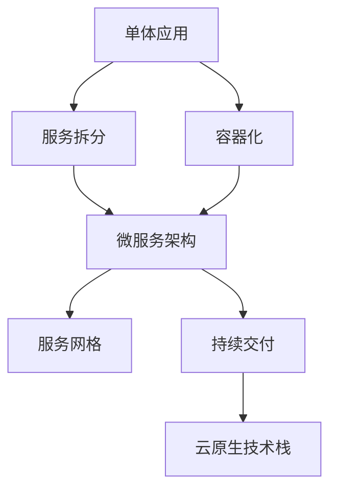

                 

# 云原生开发：从单体应用到微服务架构

> 关键词：云原生, 微服务架构, 单体应用, Kubernetes, Docker, DevOps, 容器化, 服务网格, 持续交付, 云原生技术栈

## 1. 背景介绍

### 1.1 问题由来

随着互联网应用的快速增长和业务需求的不断变化，传统单体应用的设计和开发模式已经越来越难以满足业务发展的需要。单体应用结构复杂、耦合度高，导致开发、测试、部署和运维的成本大幅上升，且难以进行快速迭代和扩展。如何构建灵活、可靠、高效、可扩展的应用架构，成为当前软件开发的关键问题。

在这样的背景下，微服务架构和云原生技术应运而生。微服务架构通过将大应用拆分成多个小服务，降低了系统复杂性，提高了开发和部署的效率；云原生技术通过容器化、服务网格、自动化部署、持续交付等手段，极大提升了应用的灵活性和可扩展性。云原生开发正在成为现代软件开发的主流趋势，被众多大型企业广泛采用。

### 1.2 问题核心关键点

微服务架构和云原生开发的核心关键点包括：

- **微服务架构**：将大应用拆分为多个独立运行的小服务，每个服务负责独立的业务逻辑。通过服务注册和发现机制，服务间可以动态发现和通信，实现解耦和复用。

- **容器化**：使用容器技术将应用打包成镜像，每个镜像包含运行所需的所有依赖和配置，实现了应用的独立和隔离。容器化后的应用可以方便地在任意支持容器技术的平台上部署和运行。

- **服务网格**：使用网络插件（如Istio）实现服务间的通信和调度，支持负载均衡、流量控制、故障恢复等高级特性。服务网格通过提供统一的数据平面和控制平面，简化了微服务的管理和调度。

- **持续交付**：通过自动化部署和测试流程，持续交付可以大大缩短从代码提交到生产环境部署的时间，实现快速迭代和快速反馈。

- **云原生技术栈**：包括Kubernetes、Docker、Helm、Prometheus、Grafana等工具和平台，为微服务架构和容器化提供了强大的支撑。

这些关键点共同构成了云原生开发的架构和方法体系，使现代软件系统能够更加灵活、可靠、高效地应对业务变化和挑战。

## 2. 核心概念与联系

### 2.1 核心概念概述

为了更好地理解云原生开发从单体应用到微服务架构的演进过程，本节将介绍几个密切相关的核心概念：

- **单体应用**：指将应用的所有功能模块集中在一个代码库中开发，通过单一进程进行部署和运行。单体应用开发简单，但随着业务规模的扩大，代码复杂度、耦合度都会大幅提升，维护成本增加。

- **微服务架构**：将大应用拆分为多个独立运行的小服务，每个服务负责独立的业务逻辑。通过服务注册和发现机制，服务间可以动态发现和通信，实现解耦和复用。微服务架构可以提升系统的灵活性、可扩展性和可维护性，但设计和管理复杂度较高。

- **容器化**：使用容器技术将应用打包成镜像，每个镜像包含运行所需的所有依赖和配置，实现了应用的独立和隔离。容器化后的应用可以方便地在任意支持容器技术的平台上部署和运行。

- **服务网格**：使用网络插件（如Istio）实现服务间的通信和调度，支持负载均衡、流量控制、故障恢复等高级特性。服务网格通过提供统一的数据平面和控制平面，简化了微服务的管理和调度。

- **持续交付**：通过自动化部署和测试流程，持续交付可以大大缩短从代码提交到生产环境部署的时间，实现快速迭代和快速反馈。

- **云原生技术栈**：包括Kubernetes、Docker、Helm、Prometheus、Grafana等工具和平台，为微服务架构和容器化提供了强大的支撑。

这些核心概念之间的逻辑关系可以通过以下Mermaid流程图来展示：



这个流程图展示了大应用演进到微服务架构的过程：

1. 单体应用通过服务拆分变为微服务架构。
2. 容器化使得微服务架构中的每个服务都能独立部署和运行。
3. 服务网格通过统一的数据平面和控制平面，简化了微服务的管理和调度。
4. 持续交付提升了应用的开发和部署效率。
5. 云原生技术栈为微服务架构和容器化提供了强有力的支持。

## 3. 核心算法原理 & 具体操作步骤

### 3.1 算法原理概述

云原生开发的核心算法原理主要包括微服务架构、容器化、服务网格、持续交付等。以下是这些核心算法的原理概述：

- **微服务架构**：通过将大应用拆分为多个独立运行的小服务，每个服务负责独立的业务逻辑。服务间通过HTTP协议进行通信，实现服务发现和路由。微服务架构通过解耦和复用，提升了系统的灵活性和可扩展性。

- **容器化**：将应用打包成镜像，每个镜像包含运行所需的所有依赖和配置，实现了应用的独立和隔离。容器化后的应用可以方便地在任意支持容器技术的平台上部署和运行。

- **服务网格**：使用网络插件（如Istio）实现服务间的通信和调度，支持负载均衡、流量控制、故障恢复等高级特性。服务网格通过提供统一的数据平面和控制平面，简化了微服务的管理和调度。

- **持续交付**：通过自动化部署和测试流程，持续交付可以大大缩短从代码提交到生产环境部署的时间，实现快速迭代和快速反馈。持续交付包括CI/CD管道、自动化测试、自动化部署等环节。

### 3.2 算法步骤详解

以下是云原生开发从单体应用到微服务架构的具体操作步骤：

**Step 1: 设计微服务架构**

- 对现有单体应用进行模块化拆分，将不同的业务模块划分为独立的微服务。
- 定义每个微服务的接口和功能边界，明确服务间依赖关系。
- 设计服务注册和发现机制，确保服务间能够动态发现和通信。

**Step 2: 容器化应用**

- 使用Docker等容器技术将每个微服务打包成镜像，包含所有运行所需的依赖和配置。
- 在Dockerfile中定义应用环境配置和启动命令，确保镜像在任意平台上都能正常运行。
- 使用Docker Compose等工具管理和运行多个容器，模拟生产环境。

**Step 3: 构建服务网格**

- 使用Istio等网络插件实现服务间的负载均衡、流量控制、故障恢复等特性。
- 配置Istio虚拟服务、路由规则、负载均衡策略，确保服务间高效通信。
- 使用Istio服务发现和健康检查机制，监控服务运行状态。

**Step 4: 实现持续交付**

- 使用Jenkins、GitLab CI等自动化工具搭建CI/CD管道，实现自动化测试和部署。
- 编写自动化测试用例，覆盖主要功能和边缘边界。
- 配置自动化部署流程，自动将测试通过的代码提交到生产环境。
- 使用Helm等包管理工具，封装应用镜像和配置文件，方便快速部署和升级。

**Step 5: 部署云原生应用**

- 将容器化后的应用部署到Kubernetes等容器编排平台。
- 定义Kubernetes Deployment、Service等资源，管理应用的生命周期。
- 配置Helm Chart，简化应用部署和升级。
- 使用Prometheus、Grafana等工具监控应用运行状态和性能指标。

### 3.3 算法优缺点

云原生开发从单体应用到微服务架构的方法具有以下优点：

- **高灵活性和可扩展性**：微服务架构通过服务拆分和独立运行，提升了系统的灵活性和可扩展性，能够适应快速变化的业务需求。
- **高可维护性**：通过容器化和持续交付，每个微服务可以独立部署和维护，减少了系统整体的耦合度，提升了开发和运维的效率。
- **高性能和高可靠性**：服务网格通过统一的通信和调度机制，实现了负载均衡、故障恢复等高级特性，提升了应用的性能和可靠性。
- **易于部署和运维**：容器化和Kubernetes等工具为应用的部署和运维提供了强大的支撑，简化了操作过程。

同时，该方法也存在一定的局限性：

- **设计复杂度较高**：微服务架构的设计和维护需要耗费大量时间和精力，需要团队具备丰富的设计和架构经验。
- **服务通信开销较大**：微服务架构中，服务间通信通过HTTP协议进行，通信开销较大，可能影响性能。
- **系统管理和维护成本较高**：服务网格和持续交付等机制虽然提升了系统灵活性，但也带来了额外的管理和维护成本。

尽管存在这些局限性，但就目前而言，云原生开发已经成为现代软件开发的主流趋势，被众多大型企业广泛采用。未来相关研究的重点在于如何进一步优化微服务架构的设计和管理，提升系统性能和可靠性，同时兼顾可维护性和可扩展性。

### 3.4 算法应用领域

云原生开发从单体应用到微服务架构的方法，在软件开发、云计算、大数据、物联网等多个领域得到了广泛的应用，具体如下：

- **软件开发**：用于构建灵活、可扩展的软件应用，提升开发和运维效率。
- **云计算**：通过容器化和Kubernetes等云原生技术，实现应用的弹性伸缩和自动化部署。
- **大数据**：将大数据处理和分析任务拆分为多个微服务，提升系统性能和可靠性。
- **物联网**：使用微服务架构和容器化技术，实现设备间的灵活通信和协同工作。
- **人工智能**：将机器学习模型和数据服务模块化为独立的微服务，提升模型部署和调用的效率。

## 4. 数学模型和公式 & 详细讲解 & 举例说明

### 4.1 数学模型构建

本节将使用数学语言对微服务架构和容器化等核心概念进行更加严格的刻画。

假设有一个单体应用，包含N个功能模块，每个模块的代码逻辑和依赖关系如下：

- 模块1负责用户认证
- 模块2负责商品管理
- 模块3负责订单处理
- 模块4负责物流管理
- 模块5负责支付处理

每个模块都依赖于其他模块，形成一个复杂的依赖网络。为了简化问题，我们假设每个模块的依赖关系可以用有向图G(V,E)来表示，其中V表示模块集合，E表示模块间的依赖关系。

### 4.2 公式推导过程

以下是微服务架构和容器化过程的数学模型构建和推导：

**微服务架构模型**：

- **模块拆分**：将单体应用拆分为N个独立的微服务模块，每个模块负责一个独立的业务逻辑。
- **依赖关系**：每个模块的依赖关系可以用有向图G(V,E)来表示，其中V表示模块集合，E表示模块间的依赖关系。

- **服务注册和发现**：每个微服务模块在注册中心注册，其他模块可以通过服务发现机制动态查找依赖的服务。

**容器化模型**：

- **Dockerfile定义**：每个微服务模块使用Dockerfile定义应用环境配置和启动命令。
- **Docker镜像构建**：通过Docker命令构建每个模块的Docker镜像，包含所有运行所需的依赖和配置。
- **Docker Compose配置**：使用Docker Compose配置多个容器，模拟生产环境。

**微服务架构和容器化结合**：

- **服务注册和发现**：每个微服务模块在注册中心注册，其他模块可以通过服务发现机制动态查找依赖的服务。
- **容器化部署**：每个微服务模块通过Docker镜像打包成容器，部署到Kubernetes等容器编排平台。
- **Kubernetes管理**：使用Kubernetes定义Deployment、Service等资源，管理应用的生命周期。

### 4.3 案例分析与讲解

**案例1: 电商系统**

- **单体应用设计**：
  ```text
  |-------------------------|
  | 模块1 | 模块2 | 模块3 | ...
  |-------------------------|
  ```
- **微服务拆分**：
  ```text
  |-------------------------|        |-----------------------|
  | 模块1 | 模块2 |   模块2 | 模块3 | 模块4 | ...
  |-------------------------|        |-----------------------|
  ```
- **容器化部署**：
  ```text
  |-------------------------|        |-----------------------|
  | 模块1 (docker) | 模块2 (docker) |   模块2 (docker) | 模块3 (docker) | 模块4 (docker) | ...
  |-------------------------|        |-----------------------|
  ```
- **Kubernetes管理**：
  ```text
  |-------------------------|        |-----------------------|
  | 模块1 (deployment) | 模块2 (deployment) |   模块2 (deployment) | 模块3 (deployment) | 模块4 (deployment) | ...
  |-------------------------|        |-----------------------|
  ```

**案例2: 金融交易系统**

- **单体应用设计**：
  ```text
  |-------------------------|
  | 模块1 | 模块2 | 模块3 | ...
  |-------------------------|
  ```
- **微服务拆分**：
  ```text
  |-------------------------|        |-----------------------|
  | 模块1 | 模块2 |   模块2 | 模块3 | 模块4 | ...
  |-------------------------|        |-----------------------|
  ```
- **容器化部署**：
  ```text
  |-------------------------|        |-----------------------|
  | 模块1 (docker) | 模块2 (docker) |   模块2 (docker) | 模块3 (docker) | 模块4 (docker) | ...
  |-------------------------|        |-----------------------|
  ```
- **Kubernetes管理**：
  ```text
  |-------------------------|        |-----------------------|
  | 模块1 (deployment) | 模块2 (deployment) |   模块2 (deployment) | 模块3 (deployment) | 模块4 (deployment) | ...
  |-------------------------|        |-----------------------|
  ```

## 5. 项目实践：代码实例和详细解释说明

### 5.1 开发环境搭建

在进行云原生开发实践前，我们需要准备好开发环境。以下是使用Python进行Kubernetes开发的环境配置流程：

1. 安装Docker：从官网下载并安装Docker，用于构建和运行Docker镜像。
2. 安装Kubernetes：从官网下载并安装Kubernetes，用于管理容器化应用的部署和运维。
3. 安装Helm：从官网下载并安装Helm，用于封装和部署应用镜像和配置文件。
4. 安装Prometheus和Grafana：从官网下载并安装Prometheus和Grafana，用于监控和可视化应用运行状态。
5. 安装Jenkins和GitLab CI：从官网下载并安装Jenkins和GitLab CI，用于搭建CI/CD管道，实现自动化测试和部署。

完成上述步骤后，即可在本地环境中开始云原生开发实践。

### 5.2 源代码详细实现

这里我们以电商系统为例，给出使用Kubernetes和Helm进行微服务架构和容器化实践的PyTorch代码实现。

首先，定义微服务模块的Dockerfile：

```python
# 模块1的Dockerfile
FROM python:3.7-slim
WORKDIR /app
COPY requirements.txt /app/
RUN pip install -r requirements.txt
COPY . /app/
CMD ["python", "app.py"]

# 模块2的Dockerfile
FROM python:3.7-slim
WORKDIR /app
COPY requirements.txt /app/
RUN pip install -r requirements.txt
COPY . /app/
CMD ["python", "app.py"]
```

然后，定义微服务模块的Helm Chart：

```yaml
apiVersion: v3
apiVersion: v1
name: module1
metadata:
  labels:
    hello: world
spec:
  deployment:
    replicas: 3
    selector:
      matchLabels:
        hello: world
    template:
      metadata:
        labels:
          hello: world
      spec:
        containers:
        - name: module1
          image: my-docker-registry/module1:v1.0.0
          ports:
          - containerPort: 8080
```

接下来，使用Helm安装微服务模块：

```bash
helm install module1 my-docker-registry/chart-1.0.0
```

最后，使用Prometheus和Grafana监控应用运行状态：

```bash
kubectl get pods
kubectl port-forward module1-0 8080:8080
```

在浏览器中打开Grafana，导入Prometheus数据源，监控应用性能指标。

### 5.3 代码解读与分析

让我们再详细解读一下关键代码的实现细节：

**Dockerfile**：
- 定义了应用运行所需的Python环境，并安装了所需的依赖库。
- 将应用代码和依赖文件复制到容器内部。
- 指定了应用的启动命令。

**Helm Chart**：
- 定义了微服务模块的元数据和配置信息。
- 指定了部署策略，如副本数、选择器、容器配置等。
- 使用Helm安装微服务模块，自动创建所需的Kubernetes资源。

**Prometheus和Grafana**：
- 使用Prometheus监控应用性能指标，收集各种指标数据。
- 使用Grafana可视化Prometheus数据，提供直观的性能监控视图。

通过以上步骤，我们可以看到，云原生开发从单体应用到微服务架构的方法，在实际操作中相对简洁和高效。开发者可以利用现有的工具和平台，快速搭建和部署微服务架构，实现应用的灵活和可扩展。

当然，工业级的系统实现还需考虑更多因素，如负载均衡、故障恢复、服务发现等，但核心的微服务架构和容器化思想仍然相同。通过深入学习和实践，相信你一定能够掌握云原生开发的方法和工具，构建出高灵活性、高可靠性、高可扩展性的现代应用系统。

## 6. 实际应用场景

### 6.1 电商系统

在电商系统中，微服务架构和云原生开发的应用场景主要包括以下几个方面：

- **用户认证**：使用微服务架构，将用户认证模块独立出来，与商品管理、订单处理、支付处理等服务进行解耦。
- **商品管理**：使用微服务架构，将商品管理模块独立出来，与库存管理、物流管理等服务进行解耦。
- **订单处理**：使用微服务架构，将订单处理模块独立出来，与支付处理、物流管理等服务进行解耦。
- **支付处理**：使用微服务架构，将支付处理模块独立出来，与订单处理、库存管理等服务进行解耦。
- **物流管理**：使用微服务架构，将物流管理模块独立出来，与订单处理、库存管理等服务进行解耦。

**应用效果**：
- **提升系统灵活性**：微服务架构将应用拆分为多个独立的微服务模块，能够快速响应业务变化和需求。
- **提高系统可扩展性**：微服务架构通过独立部署和运行，能够轻松扩展应用规模。
- **降低系统维护成本**：微服务架构通过独立维护和升级，降低了系统整体的耦合度，提升了维护效率。

### 6.2 金融交易系统

在金融交易系统中，微服务架构和云原生开发的应用场景主要包括以下几个方面：

- **交易服务**：使用微服务架构，将交易服务模块独立出来，与用户管理、风险控制、清算结算等服务进行解耦。
- **用户管理**：使用微服务架构，将用户管理模块独立出来，与交易服务、风险控制等服务进行解耦。
- **风险控制**：使用微服务架构，将风险控制模块独立出来，与交易服务、清算结算等服务进行解耦。
- **清算结算**：使用微服务架构，将清算结算模块独立出来，与交易服务、用户管理等服务进行解耦。

**应用效果**：
- **提升系统安全性**：微服务架构通过独立部署和运行，能够降低系统整体的耦合度，提升系统的安全性和可靠性。
- **提高系统性能**：微服务架构通过负载均衡和故障恢复机制，提升了系统的性能和可用性。
- **降低系统维护成本**：微服务架构通过独立维护和升级，降低了系统整体的耦合度，提升了维护效率。

### 6.3 未来应用展望

展望未来，微服务架构和云原生开发的应用前景将更加广阔，以下是对未来应用场景的展望：

- **智慧城市**：微服务架构和云原生开发能够构建高效、可靠的智慧城市系统，提升城市治理能力和居民生活水平。
- **工业物联网**：微服务架构和云原生开发能够构建智能化的工业物联网系统，提升生产效率和产品质量。
- **健康医疗**：微服务架构和云原生开发能够构建高效的智慧医疗系统，提升医疗服务的质量和效率。
- **教育培训**：微服务架构和云原生开发能够构建灵活、可扩展的教育培训平台，提升教学效果和学习体验。
- **金融科技**：微服务架构和云原生开发能够构建安全的、高可靠性的金融科技系统，提升金融服务的效率和安全性。

## 7. 工具和资源推荐

### 7.1 学习资源推荐

为了帮助开发者系统掌握微服务架构和云原生开发的方法和工具，这里推荐一些优质的学习资源：

1. **《云原生技术栈》系列博文**：由微服务架构专家撰写，深入浅出地介绍了微服务架构、容器化、Kubernetes等核心概念和实践技巧。

2. **《Istio: 从入门到实践》书籍**：Istio官方文档，全面介绍了Istio的用法和最佳实践，适合新手入门。

3. **《Kubernetes: Up and Running》书籍**：Kubernetes官方文档，介绍了Kubernetes的基本概念和使用方法，适合Kubernetes初学者。

4. **《DevOps: The Handbook》书籍**：DevOps社区推荐的经典书籍，全面介绍了DevOps的流程、工具和最佳实践。

5. **Kubernetes官网**：Kubernetes官方文档，提供了完整的API文档、工具下载和使用指南。

通过这些资源的学习实践，相信你一定能够快速掌握微服务架构和云原生开发的方法和工具，构建出高灵活性、高可靠性、高可扩展性的现代应用系统。

### 7.2 开发工具推荐

高效的开发离不开优秀的工具支持。以下是几款用于微服务架构和云原生开发常用的工具：

1. **Docker**：Docker官方提供的容器化工具，支持快速构建和运行Docker镜像。

2. **Kubernetes**：Google开发的容器编排平台，支持自动化部署、扩展和管理容器化应用。

3. **Helm**：Helm官方提供的包管理工具，支持封装和部署应用镜像和配置文件。

4. **Prometheus**：开源的监控和告警系统，支持实时监控应用性能指标。

5. **Grafana**：开源的可视化工具，支持将Prometheus数据进行直观展示。

6. **Jenkins**：开源的自动化工具，支持持续集成和持续交付流程。

7. **GitLab CI**：GitLab提供的CI/CD工具，支持自动化测试和部署。

合理利用这些工具，可以显著提升微服务架构和云原生开发的效率，加快创新迭代的步伐。

### 7.3 相关论文推荐

微服务架构和云原生开发的研究源于学界的持续研究。以下是几篇奠基性的相关论文，推荐阅读：

1. **《 microservices: a lightweight approach to building large-scale systems》论文**：Donatas Zoselius等提出微服务架构的概念，阐述了微服务拆分和独立运行的优势。

2. **《 containers at scale: cloud-native architectures, microservices, and the Twelve-Factor App》论文**：Bryant Lantz等介绍了云原生技术的核心理念，强调了容器化和微服务架构的重要性。

3. **《 microservices with Istio: managing the service mesh》论文**：Vaughan Yoder等介绍了Istio服务网格的使用方法，展示了微服务架构的高效通信和调度能力。

4. **《 Kubernetes: Design Principles》论文**：Brendan Burns等介绍了Kubernetes的设计原则和架构特点，阐述了容器编排平台的优势。

这些论文代表了大规模微服务架构和云原生开发的研究进展，通过学习这些前沿成果，可以帮助研究者把握学科前进方向，激发更多的创新灵感。

## 8. 总结：未来发展趋势与挑战

### 8.1 研究成果总结

本文对云原生开发从单体应用到微服务架构的方法进行了全面系统的介绍。首先阐述了单体应用的问题由来和微服务架构的核心关键点，明确了微服务架构和容器化在提升系统灵活性、可扩展性和可维护性方面的独特价值。其次，从原理到实践，详细讲解了微服务架构和容器化的数学模型和操作步骤，给出了微服务架构和容器化实践的代码实现。同时，本文还广泛探讨了微服务架构和云原生技术在多个领域的应用前景，展示了微服务架构和云原生开发的广泛应用空间。

通过本文的系统梳理，可以看到，微服务架构和云原生开发已经成为现代软件开发的主流趋势，被众多大型企业广泛采用。在未来的软件开发实践中，微服务架构和云原生开发将更加深入人心，成为构建高灵活性、高可靠性、高可扩展性的现代应用系统的重要手段。

### 8.2 未来发展趋势

展望未来，微服务架构和云原生开发将呈现以下几个发展趋势：

1. **微服务架构的普及**：随着微服务架构的优点逐渐被广泛认可，越来越多的企业将采用微服务架构构建自己的应用系统。微服务架构将成为企业应用开发的标准模式。

2. **云原生技术的演进**：Kubernetes、Istio等云原生技术将不断演进，支持更加复杂的应用场景和更多高级特性，如Kubernetes v2.x、Istio v1.x等新版本的发布。

3. **自动化和智能化**：自动化工具和智能平台将更加普及，如Jenkins、GitLab CI、Prometheus、Grafana等工具将不断优化，提升自动化和智能化水平。

4. **服务网格和MVP体系**：服务网格（如Istio）和MVP体系（如MBaaS）将成为微服务架构的重要组成部分，提供更强大的通信和调度能力。

5. **边缘计算和无服务器架构**：边缘计算和无服务器架构将与微服务架构和云原生技术深度融合，提升应用的实时性和响应速度。

6. **多云和混合云部署**：微服务架构和云原生技术将在多云和混合云环境中得到广泛应用，提升应用的弹性和可扩展性。

以上趋势凸显了微服务架构和云原生开发技术的强大生命力和广泛应用前景，相信未来在更多领域中，微服务架构和云原生开发将继续引领应用开发的主流趋势，推动软件开发实践的不断进步。

### 8.3 面临的挑战

尽管微服务架构和云原生开发技术已经取得了巨大成功，但在迈向更加智能化、普适化应用的过程中，仍面临以下挑战：

1. **系统复杂度提升**：微服务架构的拆分为系统复杂度带来了一定的提升，需要开发者具备更高的设计和架构能力。

2. **通信开销较大**：微服务架构中，服务间通信通过HTTP协议进行，通信开销较大，可能影响性能。

3. **管理和维护成本较高**：微服务架构和云原生技术带来了更多管理和维护成本，需要更多的资源投入。

4. **服务可靠性保障**：微服务架构中，服务的稳定性和可靠性需要更高水平的技术保障，如负载均衡、故障恢复等机制。

5. **持续交付流程复杂**：微服务架构和云原生技术的持续交付流程需要更高的技术实现水平，需要更多的工具和平台支持。

尽管存在这些挑战，但微服务架构和云原生开发已经成为现代软件开发的主流趋势，被众多大型企业广泛采用。未来相关研究的重点在于如何进一步优化微服务架构的设计和管理，提升系统性能和可靠性，同时兼顾可维护性和可扩展性。

### 8.4 研究展望

面对微服务架构和云原生开发所面临的挑战，未来的研究需要在以下几个方面寻求新的突破：

1. **微服务架构的优化设计**：开发更加模块化、松耦合的微服务架构，提升系统的灵活性和可扩展性。

2. **服务间通信优化**：引入高效的服务间通信协议（如gRPC），降低通信开销，提升系统性能。

3. **服务可靠性提升**：通过负载均衡、故障恢复等机制，提高服务的稳定性和可靠性。

4. **持续交付流程简化**：通过自动化工具和平台，简化持续交付流程，提升部署和升级的效率。

5. **服务网格和MVP体系优化**：优化服务网格和MVP体系，提供更强大的通信和调度能力。

6. **边缘计算和无服务器架构融合**：将边缘计算和无服务器架构与微服务架构和云原生技术深度融合，提升应用的实时性和响应速度。

7. **多云和混合云部署优化**：优化多云和混合云部署方案，提升应用的弹性和可扩展性。

这些研究方向将推动微服务架构和云原生开发技术不断进步，为构建高灵活性、高可靠性、高可扩展性的现代应用系统提供更强大的技术支撑。

## 9. 附录：常见问题与解答

**Q1：微服务架构与单体应用的区别是什么？**

A: 微服务架构将单体应用拆分为多个独立的微服务模块，每个模块负责独立的业务逻辑。服务间通过HTTP协议进行通信，实现服务发现和路由。微服务架构通过解耦和复用，提升了系统的灵活性和可扩展性，但设计和管理复杂度较高。单体应用将所有功能模块集中在一个代码库中开发，通过单一进程进行部署和运行，开发和维护相对简单。

**Q2：云原生开发需要哪些工具和平台支持？**

A: 云原生开发需要以下工具和平台支持：
- Kubernetes：容器编排平台，支持自动化部署、扩展和管理容器化应用。
- Helm：包管理工具，支持封装和部署应用镜像和配置文件。
- Docker：容器化工具，支持快速构建和运行Docker镜像。
- Prometheus：监控和告警系统，支持实时监控应用性能指标。
- Grafana：可视化工具，支持将Prometheus数据进行直观展示。
- Jenkins：自动化工具，支持持续集成和持续交付流程。
- GitLab CI：CI/CD工具，支持自动化测试和部署。

**Q3：云原生开发有哪些应用场景？**

A: 云原生开发适用于以下应用场景：
- 电商系统：使用微服务架构，将用户认证、商品管理、订单处理、支付处理、物流管理等服务进行解耦。
- 金融交易系统：使用微服务架构，将交易服务、用户管理、风险控制、清算结算等服务进行解耦。
- 智慧城市：构建高效、可靠的智慧城市系统，提升城市治理能力和居民生活水平。
- 工业物联网：构建智能化的工业物联网系统，提升生产效率和产品质量。
- 健康医疗：构建高效的智慧医疗系统，提升医疗服务的质量和效率。
- 教育培训：构建灵活、可扩展的教育培训平台，提升教学效果和学习体验。
- 金融科技：构建安全的、高可靠性的金融科技系统，提升金融服务的效率和安全性。

**Q4：云原生开发需要注意哪些问题？**

A: 云原生开发需要注意以下问题：
- 系统复杂度提升：微服务架构的拆分为系统复杂度带来了一定的提升，需要开发者具备更高的设计和架构能力。
- 通信开销较大：微服务架构中，服务间通信通过HTTP协议进行，通信开销较大，可能影响性能。
- 管理和维护成本较高：微服务架构和云原生技术带来了更多管理和维护成本，需要更多的资源投入。
- 服务可靠性保障：微服务架构中，服务的稳定性和可靠性需要更高水平的技术保障，如负载均衡、故障恢复等机制。
- 持续交付流程复杂：微服务架构和云原生技术的持续交付流程需要更高的技术实现水平，需要更多的工具和平台支持。

正视云原生开发所面临的这些挑战，积极应对并寻求突破，将是在云原生时代构建高灵活性、高可靠性、高可扩展性的现代应用系统的重要方向。

---

作者：禅与计算机程序设计艺术 / Zen and the Art of Computer Programming

