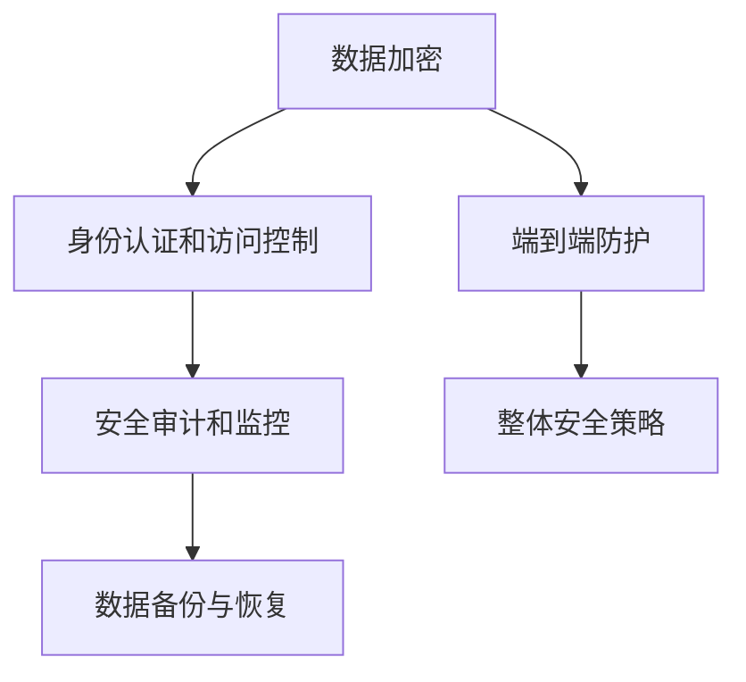

                 

# 云安全策略：保护云端数据和应用程序

## 1. 背景介绍

### 1.1 问题由来

随着云计算的广泛应用，企业、政府和个人的许多业务和服务都迁移到了云平台，带来便捷高效的同时，也带来了新的安全挑战。云端数据和应用程序的安全防护，成为了云计算环境下亟需解决的重大问题。从数据泄露、账号劫持、DDoS攻击到系统入侵，云端安全事故频发，给企业和用户带来了巨大的经济损失和信誉风险。

### 1.2 问题核心关键点

要有效保护云端数据和应用程序的安全，需要从多个层面进行防护。核心关键点包括：

- **数据加密**：保证数据的机密性和完整性，防止数据泄露和篡改。
- **身份认证和访问控制**：确保只有授权用户能够访问敏感数据和应用程序。
- **安全审计和监控**：实时监控云环境中的异常行为，及时发现和响应安全威胁。
- **数据备份与恢复**：建立可靠的数据备份机制，确保在安全事故发生时能够快速恢复业务。
- **端到端防护**：从数据存储、传输、访问到应用的各个环节，实现全链路的安全防护。

## 2. 核心概念与联系

### 2.1 核心概念概述

为更好地理解云端数据和应用程序的安全策略，本节将介绍几个核心概念及其相互联系：

- **数据加密**：通过将数据转换为不可读格式，确保数据在存储和传输过程中的机密性。
- **身份认证和访问控制**：使用密码、双因素认证、权限管理等技术手段，验证用户身份并控制其访问权限。
- **安全审计和监控**：实时监控和记录云环境中的操作行为，进行安全事件分析，帮助快速定位和应对安全威胁。
- **数据备份与恢复**：建立可靠的数据备份和恢复机制，确保数据丢失或被破坏时能够快速恢复。
- **端到端防护**：在数据存储、传输、访问和应用程序的各个环节实施多层次的安全防护措施。

这些概念之间的逻辑关系可以通过以下Mermaid流程图来展示：



这个流程图展示了几大安全概念及其之间的关系：

1. 数据加密是保护数据机密性的基础措施。
2. 身份认证和访问控制用于验证和授权用户，保证数据的安全访问。
3. 安全审计和监控用于实时监控云环境，及时发现并应对安全威胁。
4. 数据备份与恢复提供数据丢失或破坏时的快速恢复机制。
5. 端到端防护实现数据和应用程序的全链路安全保护。
6. 整体安全策略将这些措施有机整合，形成一套全面的云安全解决方案。

## 3. 核心算法原理 & 具体操作步骤

### 3.1 算法原理概述

云安全策略的核心算法原理包括数据加密、身份认证、访问控制、安全审计和监控、数据备份与恢复以及端到端防护等。以下是各个核心算法的简要概述：

- **数据加密**：常用的加密算法包括对称加密（如AES）和非对称加密（如RSA）。对称加密速度快，但密钥管理复杂；非对称加密安全性高，但速度较慢。
- **身份认证和访问控制**：常用的身份认证方式包括用户名密码、双因素认证、单点登录等。访问控制通过权限管理系统实现，如基于角色的访问控制（RBAC）。
- **安全审计和监控**：常用的审计技术包括日志记录、行为分析、异常检测等。监控工具如SIEM（安全信息和事件管理）系统，可以实时分析日志数据，发现异常行为。
- **数据备份与恢复**：常用的备份策略包括全量备份和增量备份。数据恢复通常通过云平台提供的API实现。
- **端到端防护**：端到端防护包括数据传输加密、网络入侵检测、应用程序防火墙等技术手段。

### 3.2 算法步骤详解

以下是各核心算法的操作步骤详解：

#### 数据加密

1. **密钥生成**：使用随机数生成算法生成加密密钥。
2. **数据加密**：使用对称加密算法（如AES）对数据进行加密。
3. **密钥交换**：使用非对称加密算法（如RSA）将加密密钥安全传输给接收方。
4. **数据解密**：接收方使用对称密钥对数据进行解密。

#### 身份认证和访问控制

1. **用户登录**：用户输入用户名和密码。
2. **身份验证**：服务器验证用户身份，返回验证结果。
3. **权限检查**：系统根据用户的身份和角色，检查其访问权限。
4. **资源访问**：用户根据权限访问相应资源。

#### 安全审计和监控

1. **日志记录**：系统记录所有用户的操作行为。
2. **行为分析**：分析日志数据，识别异常行为。
3. **异常检测**：使用机器学习算法识别潜在的安全威胁。
4. **威胁响应**：根据异常检测结果，采取相应的威胁响应措施。

#### 数据备份与恢复

1. **备份配置**：配置备份策略，定义备份频率和存储位置。
2. **数据备份**：根据备份策略，自动备份数据。
3. **数据恢复**：在需要时，使用备份数据恢复数据。

#### 端到端防护

1. **数据传输加密**：使用SSL/TLS协议加密数据传输。
2. **网络入侵检测**：部署入侵检测系统（IDS），实时监控网络流量。
3. **应用程序防火墙**：使用Web应用程序防火墙（WAF），防护Web应用程序的安全。

### 3.3 算法优缺点

各核心算法的优缺点如下：

- **数据加密**
  - 优点：保证数据机密性，防止数据泄露和篡改。
  - 缺点：加密和解密过程较慢，密钥管理复杂。
  
- **身份认证和访问控制**
  - 优点：验证用户身份，控制访问权限，提高安全性。
  - 缺点：用户输入复杂，登录过程繁琐。
  
- **安全审计和监控**
  - 优点：实时监控和记录操作行为，及时发现和应对安全威胁。
  - 缺点：日志存储量大，分析复杂。
  
- **数据备份与恢复**
  - 优点：确保数据丢失或破坏时的快速恢复。
  - 缺点：备份和恢复过程复杂，需要定期维护。
  
- **端到端防护**
  - 优点：实现全链路的安全保护，提升整体安全性。
  - 缺点：部署和管理复杂，成本较高。

### 3.4 算法应用领域

云安全策略的核心算法广泛应用于各类云计算环境，包括公共云、私有云和混合云。不同云环境下的具体应用如下：

- **公共云**：主要应用于多租户环境，需考虑跨租户的安全防护。
- **私有云**：主要应用于企业内部网络，需重点关注数据泄露和内网攻击。
- **混合云**：需实现跨云平台的安全防护和数据同步。

## 4. 数学模型和公式 & 详细讲解 & 举例说明

### 4.1 数学模型构建

云安全策略中的数学模型主要涉及加密算法、身份认证、访问控制等核心算法。

以AES加密算法为例，其数学模型可以表示为：

$$
C = E_k(P) = M \oplus k
$$

其中，$P$为明文，$C$为密文，$E_k$为加密函数，$M$为密文，$k$为密钥，$\oplus$为异或运算。

### 4.2 公式推导过程

以RSA加密算法为例，其数学模型可以表示为：

$$
C \equiv M^e \pmod{n}
$$

其中，$M$为明文，$C$为密文，$e$为公钥指数，$n$为模数，$ \equiv $为模运算。

解密公式为：

$$
M \equiv C^d \pmod{n}
$$

其中，$d$为私钥指数。

### 4.3 案例分析与讲解

以单点登录（SSO）为例，其数学模型可以表示为：

1. **登录过程**：用户输入用户名和密码，验证通过后获取登录票据（Token）。
2. **访问控制**：使用Token进行身份验证，系统根据Token中的信息判断用户权限。
3. **资源访问**：用户根据权限访问相应资源。

通过单点登录，可以简化用户登录过程，提升用户体验，同时提高系统安全性。

## 5. 项目实践：代码实例和详细解释说明

### 5.1 开发环境搭建

在进行云安全策略开发前，我们需要准备好开发环境。以下是使用Python进行云安全开发的常见环境配置流程：

1. 安装Anaconda：从官网下载并安装Anaconda，用于创建独立的Python环境。

2. 创建并激活虚拟环境：
```bash
conda create -n cloud-env python=3.8 
conda activate cloud-env
```

3. 安装云安全相关库：
```bash
conda install pycrypto requests
```

4. 安装各类工具包：
```bash
pip install numpy pandas scikit-learn matplotlib tqdm jupyter notebook ipython
```

完成上述步骤后，即可在`cloud-env`环境中开始云安全开发的实践。

### 5.2 源代码详细实现

这里我们以使用RSA加密算法对数据进行加密和解密为例，给出Python代码实现。

```python
from Crypto.Cipher import PKCS1_OAEP
from Crypto.PublicKey import RSA
from Crypto.Random import get_random_bytes

# 生成RSA密钥对
private_key = RSA.generate(2048)
public_key = private_key.publickey()

# 加密数据
data = b"Hello, world!"
padding = PKCS1_OAEP.new(public_key)
ciphertext = padding.encrypt(data)

# 解密数据
plaintext = padding.decrypt(ciphertext)
```

### 5.3 代码解读与分析

让我们再详细解读一下关键代码的实现细节：

- `RSA.generate(2048)`：生成一个2048位的RSA密钥对。
- `private_key.publickey()`：获取公钥。
- `PKCS1_OAEP.new(public_key)`：创建一个PKCS1_OAEP加密器，使用公钥进行加密。
- `padding.encrypt(data)`：使用加密器加密数据。
- `PKCS1_OAEP.new(private_key)`：创建一个PKCS1_OAEP解密器，使用私钥进行解密。
- `padding.decrypt(ciphertext)`：使用解密器解密数据。

以上代码实现了RSA加密算法的基本功能。实际应用中，还需要考虑密钥管理、加密模式、加密强度等因素。

## 6. 实际应用场景

### 6.1 云存储加密

在云存储环境中，使用AES加密算法对存储的数据进行加密，可以有效保护数据的机密性和完整性。

在实际应用中，可以通过API接口将加密密钥和加密算法参数传入云存储服务，实现数据加密存储。数据读取时，使用同样的密钥和算法进行解密，确保数据的机密性和完整性。

### 6.2 云应用身份认证

在云应用中，使用双因素认证（2FA）和单点登录（SSO）技术，可以有效验证用户身份，控制访问权限。

在实际应用中，用户输入用户名和密码，系统验证通过后，生成登录票据（Token），用户使用Token进行后续操作。系统根据Token中的信息，判断用户的访问权限，实现细粒度的访问控制。

### 6.3 云平台安全审计

在云平台上，使用SIEM系统实时监控和记录操作行为，进行安全事件分析，及时发现和应对安全威胁。

在实际应用中，系统收集所有操作日志，使用机器学习算法进行行为分析，识别异常行为。系统根据异常检测结果，采取相应的威胁响应措施，如封锁IP、删除恶意数据等。

### 6.4 云备份与恢复

在云环境中，建立可靠的数据备份和恢复机制，确保数据丢失或破坏时的快速恢复。

在实际应用中，配置备份策略，定期备份数据。在数据丢失或破坏时，使用备份数据进行恢复，确保业务的连续性和数据的安全性。

## 7. 工具和资源推荐

### 7.1 学习资源推荐

为了帮助开发者系统掌握云安全技术，这里推荐一些优质的学习资源：

1. 《云安全之道》系列博文：由云安全技术专家撰写，深入浅出地介绍了云安全的基本概念和实际应用。

2. CSX Cloud Security Certification课程：谷歌云平台开设的云安全认证课程，涵盖云安全的基础知识和实战技巧。

3. 《Cloud Security》书籍：深度讲解云安全的核心技术和实际应用，是学习云安全理论的绝佳资料。

4. NIST云安全参考框架：由美国国家标准与技术研究院（NIST）发布的云安全标准，提供系统的云安全指南。

5. OWASP Cloud Security Project：开源Web应用程序安全项目（OWASP）发布的云安全项目，涵盖云平台的安全评估和管理。

通过对这些资源的学习实践，相信你一定能够快速掌握云安全技术的精髓，并用于解决实际的云安全问题。

### 7.2 开发工具推荐

高效的云安全开发离不开优秀的工具支持。以下是几款用于云安全开发的常用工具：

1. AWS CloudTrail：Amazon Web Services（AWS）提供的云审计服务，记录和管理云环境中的操作日志。
2. Azure Monitor：Microsoft Azure提供的云监控服务，实时监控云环境中的性能指标和安全事件。
3. Google Cloud Security Command Center：Google Cloud提供的云安全管理中心，提供全面的云安全分析和防护。
4. Splunk：日志管理与分析平台，支持多数据源的实时监控和日志分析。
5. Elastic Stack：开源日志管理系统，支持数据收集、存储、搜索和可视化。

合理利用这些工具，可以显著提升云安全开发的效率，加快创新迭代的步伐。

### 7.3 相关论文推荐

云安全技术的发展源于学界的持续研究。以下是几篇奠基性的相关论文，推荐阅读：

1. "Cloud Computing: Principles and Paradigms"论文：由Google和Microsoft的研究人员撰写，介绍了云计算的基本原理和主要架构。
2. "A Survey on Security and Privacy Challenges in Cloud Computing"论文：总结了云计算环境下的主要安全威胁和防护措施。
3. "Data Encryption and Secure Communications on the Cloud"论文：探讨了在云环境中实现数据加密和安全的挑战与解决方案。
4. "An Overview of Access Control Mechanisms in the Cloud"论文：介绍了云环境中的访问控制机制及其应用。
5. "Cloud Security Analysis and Monitoring Techniques"论文：提出了云平台安全审计和监控的新方法，提供了详细的技术和工具实现。

这些论文代表了大数据安全技术的演进脉络，通过学习这些前沿成果，可以帮助研究者把握学科前进方向，激发更多的创新灵感。

## 8. 总结：未来发展趋势与挑战

### 8.1 总结

本文对云安全策略进行了全面系统的介绍。首先阐述了云安全策略的研究背景和意义，明确了数据加密、身份认证和访问控制、安全审计和监控、数据备份与恢复以及端到端防护等核心技术对保护云端数据和应用程序的重要性。其次，从原理到实践，详细讲解了云安全核心算法的数学模型和操作步骤，给出了云安全策略开发的完整代码实例。同时，本文还探讨了云安全策略在云存储加密、云应用身份认证、云平台安全审计和云备份与恢复等实际应用场景中的应用，展示了云安全策略的广泛适用性。

通过本文的系统梳理，可以看到，云安全策略为云环境中的数据和应用程序提供了全面的安全保障，极大地提升了云平台的安全性和可靠性。随着云计算技术的不断进步，云安全策略也将随着技术的演进而不断发展和完善。未来，伴随云安全技术的持续创新，云平台将能够提供更加安全、稳定、可靠的服务，满足更多用户的需求。

### 8.2 未来发展趋势

展望未来，云安全策略的发展将呈现以下几个趋势：

1. **云原生安全**：随着微服务、容器化和DevOps等云原生技术的应用，云原生安全将成为云安全的重要组成部分。云原生安全将与云平台无缝集成，提供更灵活、高效的防护措施。

2. **零信任架构**：零信任架构是当前安全领域的最新趋势，通过最小权限访问、持续验证等方式，保障云环境的安全性。未来云安全策略将更多地采用零信任架构，实现更细粒度的访问控制。

3. **人工智能辅助安全**：人工智能技术可以用于分析云环境中的日志数据，识别异常行为和潜在威胁。未来云安全策略将更多地利用人工智能技术，提升安全分析和响应能力。

4. **大数据安全**：随着大数据技术的广泛应用，数据安全将成为云安全的重要组成部分。未来云安全策略将更多地关注数据隐私保护、数据泄露防护等大数据安全问题。

5. **跨云安全**：云计算环境中的数据和应用常常跨多个云平台，如何实现跨云平台的安全防护，将是未来云安全策略的重要研究方向。

这些趋势凸显了云安全策略的广阔前景。这些方向的探索发展，将进一步提升云平台的安全性，为云计算技术的应用奠定坚实基础。

### 8.3 面临的挑战

尽管云安全策略已经取得了不小的进展，但在迈向更加智能化、普适化应用的过程中，仍面临诸多挑战：

1. **云安全架构复杂**：随着云平台的功能越来越丰富，云安全架构也变得越来越复杂。如何在复杂环境中实现统一管理和协调，是一个重要挑战。

2. **安全事件响应速度慢**：云平台中的安全事件响应速度需要快速高效，以应对各种突发安全事件。如何在云平台中部署高效的安全事件响应机制，是一个重要课题。

3. **数据隐私保护难度大**：云平台中的数据隐私保护涉及数据加密、数据匿名化等多个环节。如何在确保数据隐私的同时，提供高效的服务体验，是一个重要挑战。

4. **跨云安全管理难**：云平台中的数据和应用常常跨多个云平台，如何实现跨云平台的安全防护和数据同步，是一个重要挑战。

5. **持续安全改进难**：云平台中的安全威胁和攻击手段不断变化，如何在不断变化的环境中持续改进安全策略，是一个重要挑战。

### 8.4 研究展望

面对云安全策略所面临的种种挑战，未来的研究需要在以下几个方面寻求新的突破：

1. **云原生安全技术**：开发更灵活、高效的云原生安全技术，提升云原生环境的安全防护能力。

2. **零信任架构设计**：研究零信任架构的设计和实现，提升云环境的安全性和可靠性。

3. **人工智能辅助安全分析**：开发基于人工智能的安全分析工具，提升安全事件检测和响应的速度和准确性。

4. **跨云安全防护**：研究跨云平台的安全防护机制，实现更高效、更可靠的数据同步和保护。

5. **持续安全改进方法**：研究持续改进安全策略的方法，适应云平台中的安全威胁和攻击手段的变化。

这些研究方向将引领云安全策略技术迈向更高的台阶，为构建安全、可靠、可控的云平台提供新的技术路径。唯有勇于创新、敢于突破，才能不断拓展云安全策略的边界，让云平台更好地服务用户。

## 9. 附录：常见问题与解答

**Q1：云安全策略是否适用于所有云计算环境？**

A: 云安全策略适用于大多数云计算环境，包括公共云、私有云和混合云。不同云环境下的具体实施方式略有不同，但基本原理和技术手段是一致的。

**Q2：如何确保云环境中的数据隐私保护？**

A: 确保云环境中的数据隐私保护，主要通过以下方式实现：
1. 数据加密：使用AES、RSA等加密算法对数据进行加密存储和传输。
2. 数据匿名化：对敏感数据进行去标识化处理，降低数据泄露风险。
3. 访问控制：使用RBAC等权限管理技术，严格控制数据访问权限。
4. 数据审计：记录和监控数据访问日志，发现和应对数据泄露事件。

**Q3：云安全策略在云平台中的应用难点有哪些？**

A: 云安全策略在云平台中的应用难点主要包括以下几点：
1. 复杂架构：云平台功能丰富，安全架构复杂，难以实现统一管理和协调。
2. 响应速度：云平台中的安全事件响应速度需要快速高效，以应对各种突发安全事件。
3. 数据隐私：在确保数据隐私的同时，提供高效的服务体验，是一个重要挑战。
4. 跨云安全：实现跨云平台的安全防护和数据同步，是一个重要挑战。
5. 持续改进：在不断变化的环境中持续改进安全策略，是一个重要挑战。

**Q4：云安全策略的部署和管理需要注意哪些问题？**

A: 云安全策略的部署和管理需要注意以下问题：
1. 统一管理：实现云平台的安全统一管理和协调，确保各项安全措施有效实施。
2. 高效响应：部署高效的安全事件响应机制，快速应对各种安全威胁。
3. 隐私保护：在确保数据隐私的同时，提供高效的服务体验。
4. 跨云管理：实现跨云平台的安全防护和数据同步，确保数据的安全性。
5. 持续改进：在不断变化的环境中持续改进安全策略，提升云平台的安全性。

以上问题需要在云安全策略的实施过程中予以充分考虑和解决，才能确保云平台的安全性和可靠性。

---

作者：禅与计算机程序设计艺术 / Zen and the Art of Computer Programming

