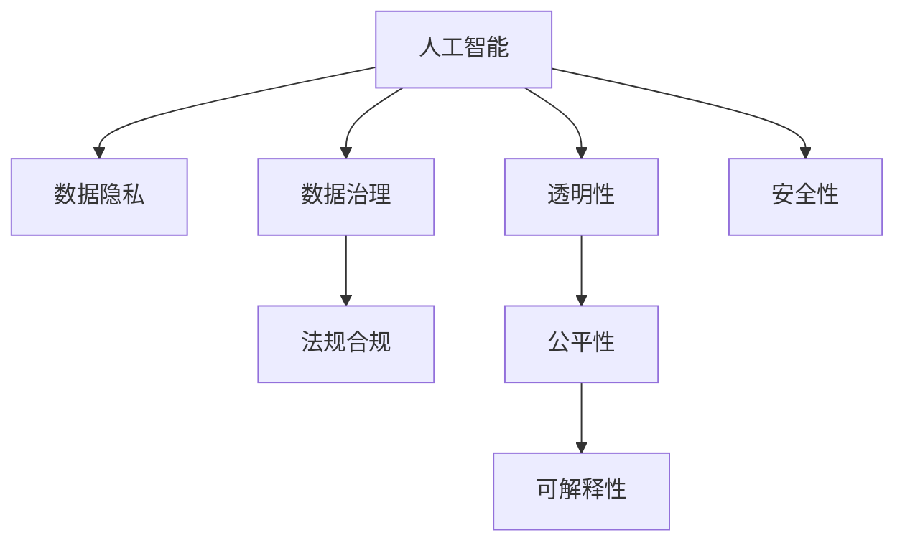

                 

# 人工智能伦理和隐私考虑

> 关键词：人工智能, 伦理, 隐私保护, 数据治理, 法规合规, 透明性, 公平性, 可解释性

## 1. 背景介绍

### 1.1 问题由来
随着人工智能（AI）技术的快速发展，其在医疗、金融、教育、安全等各个领域的应用日益广泛。AI技术在提升效率、优化决策的同时，也引发了一系列伦理和隐私问题。例如，面部识别技术在公共安全领域的应用可能导致隐私泄露和歧视性风险；无人驾驶系统在道德决策时面临伦理困境；机器学习模型的偏见和歧视等问题也逐渐引起公众关注。这些问题不仅影响了技术应用的接受度，也威胁到社会的公平和稳定。

### 1.2 问题核心关键点
人工智能伦理和隐私问题涉及多个方面，包括但不限于：
- 数据隐私：如何保护个人数据不被滥用和泄露。
- 数据治理：如何在数据收集、存储和使用过程中进行有效的管理。
- 法规合规：如何在全球范围内遵守各国数据保护和隐私法规。
- 透明性：如何确保AI模型的决策过程和结果透明可解释。
- 公平性：如何避免AI模型在决策过程中的偏见和歧视。
- 可解释性：如何让非专家也能理解AI模型的决策依据。
- 安全性：如何确保AI系统在面对恶意攻击时具备鲁棒性和抗干扰能力。

这些问题随着AI技术的深入应用，逐渐成为制约其发展的重要因素。本文将从伦理和隐私的角度，探讨AI技术在各个领域的应用中需要考虑的关键问题，并提出相应的解决方案。

## 2. 核心概念与联系

### 2.1 核心概念概述

为更好地理解AI伦理和隐私问题，本节将介绍几个密切相关的核心概念：

- 人工智能（AI）：一种能够模拟人类智能行为的计算机技术，包括机器学习、自然语言处理、计算机视觉等。
- 数据隐私：指个人数据的保密性、完整性和可用性，是数据治理的重要组成部分。
- 数据治理：指在数据生命周期中，对数据的收集、存储、使用和共享进行管理，确保数据的质量和安全。
- 法规合规：指遵循各国和地区的数据保护法规，确保AI系统的合法使用。
- 透明性：指AI系统的工作过程和决策依据应公开透明，便于监督和理解。
- 公平性：指AI系统在决策过程中应避免歧视和偏见，确保公平对待所有人。
- 可解释性：指AI模型的决策过程应可解释、可理解，便于非专家理解和使用。
- 安全性：指AI系统应具备鲁棒性和抗干扰能力，避免被恶意攻击和操纵。

这些核心概念之间的逻辑关系可以通过以下Mermaid流程图来展示：



这个流程图展示了一系列与AI相关的伦理和隐私概念，并展示了它们之间的相互联系。

## 3. 核心算法原理 & 具体操作步骤
### 3.1 算法原理概述

人工智能伦理和隐私问题的解决，主要依赖于以下几个方面：

1. **数据隐私保护**：通过差分隐私、联邦学习等技术，在保护数据隐私的同时，进行有效的数据分析和模型训练。
2. **法规合规**：利用自动化合规工具，确保AI系统在数据处理和应用过程中，符合各国和地区的法律法规。
3. **透明性**：通过可解释模型、模型可视化等技术，提高AI模型的透明性，使决策过程和结果更易于理解和接受。
4. **公平性**：通过偏差检测和消除技术，如重新加权、对抗性训练等，确保AI模型在决策中不产生偏见和歧视。
5. **安全性**：利用鲁棒性训练、对抗性攻击检测等技术，提高AI系统的安全性，避免被恶意攻击和操纵。

### 3.2 算法步骤详解

#### 3.2.1 数据隐私保护

**差分隐私**是一种保护个体隐私的技术，通过添加噪声扰动，使得单个样本的披露无法导致其他样本的隐私泄露。其核心思想是在数据分析和模型训练中，限制个体数据的可见性，确保数据的匿名化。

**联邦学习**是一种分布式机器学习技术，通过在多个本地设备上分布式训练模型，避免将数据集中存储和传输，从而保护数据隐私。其核心思想是将模型参数分布在多个设备上，各设备仅在本地训练部分参数，并通过聚合得到全局模型参数。

**隐私保留技术**包括数据脱敏、数据加密等，通过数据变形、加密等手段，确保数据在传输和存储过程中的隐私保护。

#### 3.2.2 法规合规

**自动化合规工具**通过构建合规图谱、法规知识库，自动检测和纠正AI系统在数据处理和应用过程中的合规问题。其主要流程包括：
1. 法规收集：收集和整理各国的隐私保护法规。
2. 合规检测：通过自动化工具检测AI系统是否符合相关法规。
3. 合规报告：生成合规报告，指出系统中的合规问题和改进建议。

#### 3.2.3 透明性

**可解释模型**通过简化模型结构、降低复杂度，使得模型的决策过程和结果更易于理解和解释。常见的可解释模型包括决策树、线性回归等。

**模型可视化**通过可视化技术，如热力图、注意力图等，展示模型在不同输入下的特征和决策路径，使得决策过程更透明。

#### 3.2.4 公平性

**偏差检测**通过统计分析和模型诊断，检测AI模型在决策过程中是否存在偏见和歧视。常见的偏差检测方法包括样本平衡、类别加权等。

**偏差消除**通过重新加权、对抗性训练等技术，消除模型中的偏见和歧视。例如，通过重新加权平衡训练数据，确保各类别样本在训练中得到平等的关注。

#### 3.2.5 安全性

**鲁棒性训练**通过在模型训练中引入噪声和扰动，增强模型的鲁棒性，使其在面对各种异常和攻击时具备抗干扰能力。

**对抗性攻击检测**通过识别和防御对抗性攻击，确保AI系统在面对恶意攻击时具备鲁棒性和抗干扰能力。常见的对抗性攻击检测方法包括对抗性生成网络、对抗性样本检测等。

### 3.3 算法优缺点

**优点**：
- 数据隐私保护和法规合规技术，确保了AI系统的安全和合规性，增强了公众的信任和接受度。
- 透明性和公平性技术，提高了AI系统的可解释性和公平性，提升了系统的可信度和可靠性。
- 安全性技术，增强了AI系统的鲁棒性和抗干扰能力，减少了恶意攻击和操纵的风险。

**缺点**：
- 技术复杂，实施成本较高，需要专业的技术支持和资源投入。
- 部分技术（如差分隐私、联邦学习）可能牺牲部分精度，影响模型性能。
- 法规合规涉及多国法律，实施过程中可能面临复杂的法律环境和合规挑战。

## 4. 数学模型和公式 & 详细讲解 & 举例说明（备注：数学公式请使用latex格式，latex嵌入文中独立段落使用 $$，段落内使用 $)
### 4.1 数学模型构建

本节将使用数学语言对AI伦理和隐私问题进行更加严格的刻画。

设AI系统接收输入数据 $x$，输出决策结果 $y$，决策函数为 $f(x)$。假设存在一个敏感属性 $a$，其取值对决策结果有影响。为了保护隐私，需要确保 $a$ 在模型中的可见性最小化。

**差分隐私**的目标是确保任意两个相邻样本 $x$ 和 $x'$ 的决策结果 $f(x)$ 和 $f(x')$ 之间的差异，满足一定的概率限制 $\epsilon$。具体来说，差分隐私的目标函数为：

$$
\min_{f} \mathbb{E}[f(x)] \text{ subject to } \mathbb{P}(f(x) \neq f(x')) \leq \epsilon
$$

其中 $\mathbb{E}[f(x)]$ 表示决策函数在输入 $x$ 下的期望，$\mathbb{P}(f(x) \neq f(x'))$ 表示两个相邻样本决策结果不同的概率。

**联邦学习**的目标是在多个本地设备上分布式训练模型 $f(x)$，使得模型参数 $\theta$ 满足全局最优：

$$
\min_{\theta} \frac{1}{n}\sum_{i=1}^n L_i(x_i, f(x_i; \theta)) + \lambda ||\theta||^2
$$

其中 $L_i(x_i, f(x_i; \theta))$ 表示第 $i$ 个本地设备上样本 $x_i$ 的损失函数，$||\theta||^2$ 表示正则化项，$\lambda$ 为正则化系数。

### 4.2 公式推导过程

#### 4.2.1 差分隐私

差分隐私的目标函数 $\min_{f} \mathbb{E}[f(x)] \text{ subject to } \mathbb{P}(f(x) \neq f(x')) \leq \epsilon$ 可以通过拉格朗日乘数法进行求解。构造拉格朗日函数：

$$
\mathcal{L}(\theta, \alpha) = \mathbb{E}[f(x)] + \alpha(\mathbb{P}(f(x) \neq f(x')) - \epsilon)
$$

对 $\theta$ 和 $\alpha$ 求偏导数，并令偏导数为零，得到优化条件：

$$
\nabla_{\theta}\mathcal{L}(\theta, \alpha) = 0 \quad \text{and} \quad \nabla_{\alpha}\mathcal{L}(\theta, \alpha) = 0
$$

其中 $\nabla_{\theta}\mathcal{L}(\theta, \alpha) = \nabla_{\theta}f(x)$，$\nabla_{\alpha}\mathcal{L}(\theta, \alpha) = \mathbb{P}(f(x) \neq f(x')) - \epsilon$。

解上述优化问题，可以得到差分隐私的模型参数 $\theta$。

#### 4.2.2 联邦学习

联邦学习的目标是通过分布式训练，优化全局模型参数 $\theta$。根据梯度下降算法，可以得到全局模型参数的更新公式：

$$
\theta_{k+1} = \theta_k - \frac{\eta}{n}\sum_{i=1}^n \nabla_{\theta}L_i(x_i, f(x_i; \theta))
$$

其中 $\eta$ 为学习率，$\nabla_{\theta}L_i(x_i, f(x_i; \theta))$ 表示第 $i$ 个本地设备上样本 $x_i$ 的梯度。

### 4.3 案例分析与讲解

假设有一个面部识别系统，用于识别和追踪犯罪嫌疑人。系统接收输入的面部图像 $x$，输出嫌疑人识别结果 $y$。

**差分隐私**的实现步骤：
1. 收集大量犯罪嫌疑人的面部图像数据 $D$。
2. 在模型训练中，对每个样本 $x_i$ 添加噪声扰动，使其对其他样本的决策结果 $f(x_i')$ 不产生影响。
3. 通过差分隐私的优化条件，求解模型参数 $\theta$，使得任意两个相邻样本的决策结果之间的差异小于 $\epsilon$。

**联邦学习**的实现步骤：
1. 在多个本地设备上，分别收集犯罪嫌疑人的面部图像数据 $D_i$。
2. 在本地设备上分别训练模型 $f_i(x)$，得到本地模型参数 $\theta_i$。
3. 通过聚合策略，如平均、加权平均等，得到全局模型参数 $\theta$。
4. 在全局模型上进行优化，得到最终的面部识别系统。

## 5. 项目实践：代码实例和详细解释说明
### 5.1 开发环境搭建

在进行AI伦理和隐私问题实践前，我们需要准备好开发环境。以下是使用Python进行TensorFlow和PyTorch开发的环境配置流程：

1. 安装Anaconda：从官网下载并安装Anaconda，用于创建独立的Python环境。

2. 创建并激活虚拟环境：
```bash
conda create -n ai-env python=3.8 
conda activate ai-env
```

3. 安装TensorFlow和PyTorch：根据CUDA版本，从官网获取对应的安装命令。例如：
```bash
conda install tensorflow -c tf
conda install torch torchvision torchaudio -c pytorch -c conda-forge
```

4. 安装各类工具包：
```bash
pip install numpy pandas scikit-learn matplotlib tqdm jupyter notebook ipython
```

完成上述步骤后，即可在`ai-env`环境中开始实践。

### 5.2 源代码详细实现

这里我们以数据隐私保护和模型可视化为例，给出使用TensorFlow和PyTorch进行差分隐私保护和模型可视化的PyTorch代码实现。

**差分隐私实现代码**：

```python
import tensorflow as tf
from tensorflow.keras.datasets import mnist
from tensorflow.keras.layers import Flatten, Dense
from differential_privacy import DifferentialPrivacyOptimizer

# 加载MNIST数据集
(x_train, y_train), (x_test, y_test) = mnist.load_data()

# 数据预处理
x_train = x_train / 255.0
x_test = x_test / 255.0

# 定义模型
model = tf.keras.Sequential([
    Flatten(input_shape=(28, 28)),
    Dense(128, activation='relu'),
    Dense(10, activation='softmax')
])

# 定义差分隐私优化器
dp_optimizer = DifferentialPrivacyOptimizer(epsilon=1.0, delta=0.1)

# 编译模型
model.compile(optimizer=dp_optimizer, loss='sparse_categorical_crossentropy', metrics=['accuracy'])

# 训练模型
model.fit(x_train, y_train, epochs=10, validation_data=(x_test, y_test))
```

**模型可视化实现代码**：

```python
import tensorflow as tf
from tensorflow.keras.datasets import mnist
from tensorflow.keras.layers import Flatten, Dense
from tensorflow.keras.models import Sequential
import matplotlib.pyplot as plt

# 加载MNIST数据集
(x_train, y_train), (x_test, y_test) = mnist.load_data()

# 数据预处理
x_train = x_train / 255.0
x_test = x_test / 255.0

# 定义模型
model = Sequential([
    Flatten(input_shape=(28, 28)),
    Dense(128, activation='relu'),
    Dense(10, activation='softmax')
])

# 训练模型
model.fit(x_train, y_train, epochs=10, validation_data=(x_test, y_test))

# 可视化模型权重
weights = model.layers[0].get_weights()[0]
plt.imshow(weights, cmap='viridis', interpolation='nearest')
plt.colorbar()
plt.show()
```

**代码解读与分析**：

**差分隐私实现代码**：
- 使用TensorFlow加载MNIST数据集，并进行数据预处理。
- 定义一个简单的神经网络模型，使用Flatten层将输入数据展开，两个Dense层进行特征提取和分类。
- 使用DifferentialPrivacyOptimizer实现差分隐私保护，设置epsilon和delta参数。
- 编译模型，并使用差分隐私优化器进行训练。

**模型可视化实现代码**：
- 使用TensorFlow加载MNIST数据集，并进行数据预处理。
- 定义一个简单的神经网络模型，使用Flatten层将输入数据展开，两个Dense层进行特征提取和分类。
- 训练模型，并使用Matplotlib可视化模型权重。

## 6. 实际应用场景
### 6.1 智能医疗

在智能医疗领域，AI系统需要处理大量敏感的个人健康数据，如病历、基因数据等。如何保护这些数据的隐私性，确保数据的安全和合规性，是实现AI医疗应用的关键。

具体措施包括：
- 采用差分隐私技术，保护病历等敏感数据的隐私性。
- 在模型训练和应用过程中，遵守各国和地区的隐私保护法规。
- 使用可解释模型，提高AI系统在医疗诊断和治疗过程中的透明性和可信度。

### 6.2 金融风险管理

在金融领域，AI系统需要处理大量的交易数据、客户数据等敏感信息。如何保护这些数据的隐私性，确保数据的安全和合规性，是实现AI金融应用的关键。

具体措施包括：
- 采用联邦学习技术，在保护数据隐私的同时，进行有效的模型训练和预测。
- 在模型训练和应用过程中，遵守各国和地区的隐私保护法规。
- 使用可解释模型，提高AI系统在风险评估和欺诈检测过程中的透明性和可信度。

### 6.3 智能安防

在智能安防领域，AI系统需要处理大量的人脸、行人轨迹等敏感数据。如何保护这些数据的隐私性，确保数据的安全和合规性，是实现AI安防应用的关键。

具体措施包括：
- 采用差分隐私技术，保护人脸等敏感数据的隐私性。
- 在模型训练和应用过程中，遵守各国和地区的隐私保护法规。
- 使用可解释模型，提高AI系统在视频监控和行为分析过程中的透明性和可信度。

### 6.4 未来应用展望

随着AI技术的不断发展和应用场景的不断扩展，AI伦理和隐私问题将更加复杂和多样化。未来，AI系统需要在全球范围内遵守各国的隐私保护法规，同时保证数据的隐私和安全。AI系统的透明性和可解释性也将变得更加重要，以便更好地满足公众的需求和信任。

## 7. 工具和资源推荐
### 7.1 学习资源推荐

为了帮助开发者系统掌握AI伦理和隐私问题的理论基础和实践技巧，这里推荐一些优质的学习资源：

1. 《人工智能伦理和隐私保护》书籍：由AI伦理专家撰写，全面介绍了AI伦理和隐私保护的理论基础和实际应用。

2. 《数据隐私保护技术》课程：由知名大学开设的隐私保护技术课程，深入浅出地讲解了差分隐私、联邦学习等关键技术。

3. 《数据治理实践指南》白皮书：由数据治理领域的权威机构发布，提供了全面的数据治理实践建议和案例。

4. 《人工智能法律合规》报告：由知名律师事务所发布，梳理了全球主要国家的AI法律和合规要求，提供了实用的合规建议。

5. 《模型可解释性》书籍：详细介绍了模型可解释性的原理和方法，提供了丰富的实际应用案例。

通过对这些资源的学习实践，相信你一定能够全面掌握AI伦理和隐私问题的关键点，并用于解决实际的AI应用问题。

### 7.2 开发工具推荐

高效的开发离不开优秀的工具支持。以下是几款用于AI伦理和隐私问题开发的常用工具：

1. TensorFlow：基于Python的开源深度学习框架，提供了丰富的隐私保护和模型可视化功能。

2. PyTorch：基于Python的开源深度学习框架，灵活的计算图，适合快速迭代研究。

3. Scikit-learn：基于Python的机器学习库，提供了多种隐私保护算法和模型评估工具。

4. Jupyter Notebook：免费在线的Jupyter Notebook环境，支持Python和其他语言的开发和实验，方便共享和协作。

5. TensorBoard：TensorFlow配套的可视化工具，可实时监测模型训练状态，提供丰富的图表呈现方式，方便调试和分析。

6. Scikit-learn：基于Python的机器学习库，提供了多种隐私保护算法和模型评估工具。

7. OpenCV：开源计算机视觉库，提供了多种人脸识别和轨迹分析工具，支持差分隐私和联邦学习等技术。

合理利用这些工具，可以显著提升AI伦理和隐私问题的开发效率，加快创新迭代的步伐。

### 7.3 相关论文推荐

AI伦理和隐私问题的发展源于学界的持续研究。以下是几篇奠基性的相关论文，推荐阅读：

1. "The Ethics of Artificial Intelligence"：探讨了AI伦理的基本问题，包括公正性、透明性、责任性等。

2. "Privacy Preserving Machine Learning"：介绍了差分隐私、联邦学习等隐私保护技术，并讨论了其在实际应用中的挑战和解决方案。

3. "Fairness and Interpretability of Machine Learning Models"：讨论了AI模型在决策过程中可能出现的偏见和歧视问题，提出了多种解决策略。

4. "Adversarial Machine Learning"：探讨了对抗性攻击对AI系统的影响，提出了多种防御方法和技术。

这些论文代表了大数据和AI技术发展中的重要方向，为未来的AI伦理和隐私问题研究提供了理论和实践的指导。

## 8. 总结：未来发展趋势与挑战
### 8.1 总结

本文对AI伦理和隐私问题进行了全面系统的介绍。首先阐述了AI伦理和隐私问题在各领域的应用背景和意义，明确了其对技术应用和社会公平的影响。其次，从原理到实践，详细讲解了AI伦理和隐私问题的核心概念和关键技术，给出了实现方案的代码实例。同时，本文还探讨了AI伦理和隐私问题在实际应用中的多个场景，展示了其在推动技术落地和社会进步中的重要作用。此外，本文精选了相关学习资源和开发工具，力求为读者提供全方位的技术指引。

通过本文的系统梳理，可以看到，AI伦理和隐私问题是大数据和AI技术发展中的重要课题，关系到技术应用的接受度和社会的公平与稳定。如何在数据隐私保护和法规合规的同时，保证AI系统的透明性和公平性，是未来技术发展的关键方向。

### 8.2 未来发展趋势

展望未来，AI伦理和隐私问题将呈现以下几个发展趋势：

1. **隐私保护技术的发展**：差分隐私、联邦学习等隐私保护技术将不断发展和完善，增强数据的隐私保护能力。
2. **法规合规的全球化**：各国和地区的隐私保护法规将更加严格和多样化，AI系统需要在全球范围内遵守合规要求。
3. **透明性和可解释性**：AI系统的透明性和可解释性将变得更加重要，便于公众理解和接受。
4. **公平性和偏见检测**：AI系统的公平性和偏见检测技术将不断提升，避免在决策过程中出现偏见和歧视。
5. **安全性**：AI系统的安全性将受到更多关注，防御对抗性攻击和恶意攻击的技术将不断完善。
6. **跨领域应用**：AI伦理和隐私问题将更多地应用于跨领域的数据共享和合作中，推动数据的共享和协同创新。

以上趋势凸显了AI伦理和隐私问题的广泛影响和重要性。这些方向的探索发展，必将进一步提升AI系统的可信度和可靠性，推动AI技术在各个领域的应用。

### 8.3 面临的挑战

尽管AI伦理和隐私问题已经引起了广泛关注，但在技术应用过程中，仍然面临诸多挑战：

1. **隐私保护技术的复杂性**：差分隐私、联邦学习等隐私保护技术涉及复杂的数学和算法，实施成本较高。
2. **法规合规的多样性**：各国和地区的隐私保护法规差异较大，AI系统需要在全球范围内遵守合规要求，面临复杂性和挑战性。
3. **模型透明性和可解释性的挑战**：一些复杂的AI模型难以解释，非专家难以理解其决策过程和结果。
4. **公平性和偏见的处理**：AI系统在决策过程中可能出现偏见和歧视，处理这些问题需要复杂的算法和模型。
5. **对抗性攻击的防御**：AI系统面临对抗性攻击的威胁，防御这些攻击需要不断提升模型鲁棒性和安全性。
6. **跨领域数据共享的复杂性**：跨领域数据共享和协同创新过程中，隐私保护和合规问题更加复杂。

正视AI伦理和隐私问题面临的这些挑战，积极应对并寻求突破，将是大数据和AI技术健康发展的重要保障。相信随着学界和产业界的共同努力，这些挑战终将一一被克服，AI伦理和隐私问题必将在未来技术发展中得到更全面和深入的研究和应用。

### 8.4 研究展望

面对AI伦理和隐私问题所面临的种种挑战，未来的研究需要在以下几个方面寻求新的突破：

1. **隐私保护技术的提升**：开发更加高效和实用的隐私保护技术，增强数据的隐私保护能力。
2. **法规合规的标准化**：推动全球范围内隐私保护法规的标准化和协调，减少合规成本和复杂性。
3. **透明性和可解释性的增强**：通过模型简化和解释技术，提高AI模型的透明性和可解释性，增强公众的信任和接受度。
4. **公平性和偏见检测的改进**：开发更加高效和精准的公平性和偏见检测技术，确保AI系统在决策中的公平性。
5. **安全性技术的增强**：开发更加鲁棒和安全的AI系统，防御对抗性攻击和恶意攻击。
6. **跨领域数据共享的协同创新**：推动跨领域数据共享和协同创新，促进数据的共享和利用。

这些研究方向的探索，必将引领AI伦理和隐私问题向更高的台阶，为构建可信、可靠、公平的AI系统铺平道路。面向未来，AI伦理和隐私问题需要与其他AI技术进行更深入的融合，如知识表示、因果推理、强化学习等，多路径协同发力，共同推动AI技术的发展和应用。只有勇于创新、敢于突破，才能不断拓展AI技术的边界，让技术更好地造福人类社会。

## 9. 附录：常见问题与解答

**Q1：AI系统如何进行隐私保护？**

A: AI系统可以通过差分隐私、联邦学习等技术进行隐私保护。差分隐私通过在数据中引入噪声扰动，确保个体数据的可见性最小化。联邦学习通过在多个本地设备上分布式训练模型，避免将数据集中存储和传输，保护数据隐私。

**Q2：AI系统如何进行法规合规？**

A: AI系统可以通过自动化合规工具进行法规合规。这些工具通过构建合规图谱、法规知识库，自动检测和纠正系统在数据处理和应用过程中的合规问题。例如，自动检测是否符合GDPR等隐私保护法规，并生成合规报告。

**Q3：AI系统如何进行模型透明性？**

A: AI系统可以通过可解释模型和模型可视化技术进行透明性。可解释模型通过简化模型结构，降低复杂度，使得模型的决策过程和结果更易于理解和解释。模型可视化通过可视化技术，展示模型在不同输入下的特征和决策路径，使得决策过程更透明。

**Q4：AI系统如何进行公平性？**

A: AI系统可以通过偏差检测和消除技术进行公平性。偏差检测通过统计分析和模型诊断，检测模型在决策过程中是否存在偏见和歧视。偏差消除通过重新加权、对抗性训练等技术，消除模型中的偏见和歧视。

**Q5：AI系统如何进行安全性？**

A: AI系统可以通过鲁棒性训练和对抗性攻击检测进行安全性。鲁棒性训练通过在模型训练中引入噪声和扰动，增强模型的鲁棒性。对抗性攻击检测通过识别和防御对抗性攻击，确保系统在面对恶意攻击时具备抗干扰能力。

通过回答这些问题，可以帮助读者更好地理解AI伦理和隐私问题的关键点，并应用于实际的AI系统设计和应用中。

---

作者：禅与计算机程序设计艺术 / Zen and the Art of Computer Programming

