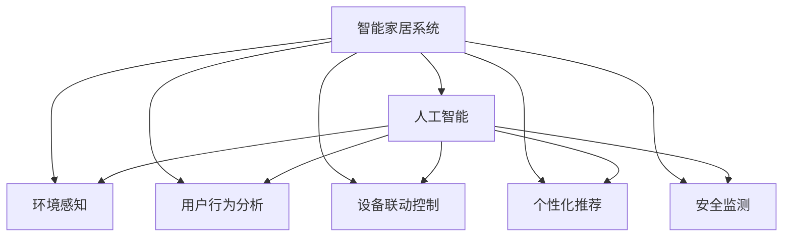

                 

# 人工智能在智能家居中的应用

## 1. 背景介绍

随着互联网的普及和物联网技术的快速发展，智能家居已成为未来生活的重要趋势。通过传感器、执行器、网络等硬件设备和智能应用软件，智能家居系统可以实时监控和控制家中的各种设备，提升居住体验和安全性。然而，智能家居系统涉及复杂的网络通信、设备联动和数据处理，需要高可靠性和高智能化的支持。人工智能（AI）技术，凭借其强大的数据分析和决策能力，在智能家居中发挥着越来越重要的作用。

### 1.1 问题由来

智能家居系统通常涉及大量的传感器数据和用户行为数据，这些数据包含了丰富的环境信息和用户偏好。然而，传统的数据处理方法往往依赖人工干预，难以实时响应和优化系统表现。人工智能技术可以自动分析和挖掘这些数据，从中提取有价值的信息，辅助系统做出智能决策。通过AI技术，智能家居系统可以实现自动化、个性化和智能化管理，显著提升居住舒适度和安全性。

### 1.2 问题核心关键点

智能家居系统的AI应用主要涉及以下几个关键点：

1. **环境感知**：通过传感器数据采集环境信息，如温度、湿度、光照等。
2. **用户行为分析**：通过分析用户行为数据，理解用户偏好和需求。
3. **设备联动控制**：根据环境信息和用户需求，自动控制家庭设备。
4. **个性化推荐**：根据用户历史行为，推荐个性化服务，如音乐、视频、家务等。
5. **安全监测**：通过视频监控、入侵检测等技术，提升家庭安全性。

这些问题共同构成了智能家居系统中AI应用的核心框架，使其能够更好地满足用户的各类需求。

### 1.3 问题研究意义

研究智能家居系统中的AI应用，对于提升居住体验、降低运营成本、提高家庭安全性具有重要意义：

1. **提升居住体验**：AI技术可以根据环境变化和用户需求，自动调整家庭设备，如空调、照明、窗帘等，使居住环境更舒适。
2. **降低运营成本**：通过智能监控和控制，优化资源使用，减少能源浪费，降低维护成本。
3. **提高家庭安全性**：AI系统可以实时监控家庭环境，及时发现异常情况，保障家庭安全。
4. **推动智能化发展**：AI技术的应用，使得智能家居系统能够更高效、更智能地运行，加速智能化普及。

因此，深入研究AI在智能家居中的应用，对于构建更智能、更舒适、更安全的居住环境具有重要价值。

## 2. 核心概念与联系

### 2.1 核心概念概述

为了更好地理解AI在智能家居中的应用，本节将介绍几个核心概念：

- **智能家居系统**：通过传感器、执行器和网络等硬件设备和智能应用软件，实现家庭设备自动监控和控制的网络系统。
- **人工智能**：利用计算机模拟人类智能行为的技术，包括机器学习、深度学习、自然语言处理等，应用于数据处理、决策制定等领域。
- **环境感知**：通过传感器采集环境数据，如温度、湿度、光照等，用于系统决策和控制。
- **用户行为分析**：通过分析用户行为数据，如上网记录、社交媒体活动等，理解用户需求和偏好。
- **设备联动控制**：根据环境信息和用户需求，自动控制家庭设备，如空调、照明、窗帘等。
- **个性化推荐**：根据用户历史行为，推荐个性化服务，如音乐、视频、家务等。
- **安全监测**：通过视频监控、入侵检测等技术，提升家庭安全性。

这些概念之间的逻辑关系可以通过以下Mermaid流程图来展示：



这个流程图展示了他智能家居系统的核心概念及其之间的关系：

1. 智能家居系统通过AI技术，实现环境感知、用户行为分析、设备联动控制、个性化推荐和安全监测等功能。
2. AI技术的应用，使得智能家居系统具备更强大的数据分析和决策能力。

这些概念共同构成了智能家居系统的AI应用框架，使其能够更好地服务于用户。

## 3. 核心算法原理 & 具体操作步骤
### 3.1 算法原理概述

AI在智能家居中的应用，主要通过以下核心算法实现：

- **机器学习**：通过分析历史数据，发现规律，预测未来事件。
- **深度学习**：利用神经网络模型，提取数据中的高级特征，提升决策准确性。
- **自然语言处理**：处理和理解自然语言文本，实现人机交互。
- **计算机视觉**：处理和分析图像和视频数据，实现图像识别和视频监控。

这些算法共同构成了智能家居系统中的AI应用基础，使得系统能够自动化地感知环境、分析用户需求、控制设备和提供个性化服务。

### 3.2 算法步骤详解

AI在智能家居中的应用，一般包括以下几个关键步骤：

**Step 1: 数据采集与预处理**

- 通过传感器、摄像头等设备采集环境数据和用户行为数据。
- 对采集到的数据进行清洗、去重和标准化处理，保证数据质量。

**Step 2: 特征提取与分析**

- 利用机器学习和深度学习算法，从数据中提取有用的特征。
- 分析用户行为数据，了解用户偏好和需求。

**Step 3: 决策制定与执行**

- 根据环境信息和用户需求，制定决策方案。
- 控制家庭设备，实现环境调节、设备联动和个性化推荐。

**Step 4: 反馈与优化**

- 根据用户反馈，不断调整和优化决策模型。
- 改进系统性能，提升用户体验。

### 3.3 算法优缺点

AI在智能家居中的应用具有以下优点：

1. **自动化**：通过AI技术，智能家居系统可以实现自动化操作，减少人工干预。
2. **智能化**：AI系统能够自动分析数据，发现规律，提升决策精度。
3. **个性化**：AI能够根据用户历史行为，提供个性化服务，提升用户体验。
4. **安全性**：AI系统可以实时监控环境，及时发现异常情况，保障家庭安全。

同时，AI在智能家居中的应用也存在一些缺点：

1. **数据隐私**：智能家居系统采集大量用户数据，存在隐私泄露风险。
2. **设备兼容性**：不同厂商的设备可能存在兼容性问题，影响系统性能。
3. **误识别**：AI系统可能存在误识别或误判，影响系统可靠性和用户体验。
4. **维护复杂性**：AI系统的复杂性增加了维护难度，需要专业技能支持。

### 3.4 算法应用领域

AI在智能家居中的应用主要涉及以下几个领域：

1. **智能温控**：通过AI分析环境数据和用户行为，自动调节室内温度和湿度。
2. **智能照明**：根据环境光线和用户需求，自动控制灯光亮度和色温。
3. **智能安防**：通过视频监控和入侵检测技术，提升家庭安全性。
4. **智能音乐和视频推荐**：根据用户偏好，推荐音乐和视频内容，提升娱乐体验。
5. **智能家务管理**：通过语音助手和智能设备，自动化完成家务任务，如打扫、洗衣等。
6. **智能健康监测**：通过传感器监测家庭成员的健康状况，提供健康建议和提醒。

以上应用场景展示了AI在智能家居中的广泛应用，提升了居住舒适度和安全性。

## 4. 数学模型和公式 & 详细讲解
### 4.1 数学模型构建

在智能家居系统中，AI应用的数学模型主要包括以下几个方面：

- **环境感知模型**：通过传感器数据，建立环境模型，如温度模型、湿度模型等。
- **用户行为模型**：通过用户行为数据，建立行为模型，如上网行为模型、社交行为模型等。
- **设备联动模型**：根据环境信息和用户需求，建立设备联动模型，如智能温控模型、智能照明模型等。
- **个性化推荐模型**：根据用户历史行为，建立个性化推荐模型，如音乐推荐模型、视频推荐模型等。
- **安全监测模型**：通过视频监控和入侵检测技术，建立安全监测模型，如入侵检测模型、视频监控模型等。

这些模型的建立需要结合具体的算法和技术，下面将详细介绍其中的几个关键模型。

### 4.2 公式推导过程

以**智能温控模型**为例，介绍其数学模型构建和公式推导过程：

设智能温控系统的环境数据为 $x=(t, h)$，其中 $t$ 为温度，$h$ 为湿度。用户行为数据为 $y=(u, d)$，其中 $u$ 为上网时间，$d$ 为外出时间。设备联动数据为 $z=(c, a)$，其中 $c$ 为空调开启状态，$a$ 为灯光亮度。

智能温控模型的目标是最小化系统能耗和舒适度的损失函数，即：

$$
\min_{\theta} \mathcal{L}(\theta) = \lambda_1 \lVert (t_{pred} - t_{ref}) \rVert^2 + \lambda_2 \lVert (h_{pred} - h_{ref}) \rVert^2 + \lambda_3 \lVert (c_{pred} - c_{ref}) \rVert^2 + \lambda_4 \lVert (a_{pred} - a_{ref}) \rVert^2
$$

其中，$t_{pred}$、$h_{pred}$、$c_{pred}$、$a_{pred}$ 分别为预测的室内温度、湿度、空调开启状态和灯光亮度，$t_{ref}$、$h_{ref}$、$c_{ref}$、$a_{ref}$ 分别为参考的室内温度、湿度、空调开启状态和灯光亮度，$\lambda_1$、$\lambda_2$、$\lambda_3$、$\lambda_4$ 分别为温度、湿度、空调状态和灯光亮度的损失权重。

预测模型 $M_{\theta}$ 的形式如下：

$$
M_{\theta}(x) = f(x; \theta) = (t_{pred}, h_{pred}, c_{pred}, a_{pred})
$$

其中，$\theta$ 为模型的可训练参数。

### 4.3 案例分析与讲解

以**智能照明系统**为例，分析其数学模型和算法实现：

设智能照明系统的环境数据为 $x=(L)$，其中 $L$ 为室内光线亮度。用户行为数据为 $y=(u, d)$，其中 $u$ 为上网时间，$d$ 为外出时间。

智能照明模型的目标是最小化用户满意度和系统能耗的损失函数，即：

$$
\min_{\theta} \mathcal{L}(\theta) = \lambda_1 \lVert (L_{pred} - L_{ref}) \rVert^2 + \lambda_2 \lVert (c_{pred} - c_{ref}) \rVert^2 + \lambda_3 \lVert (a_{pred} - a_{ref}) \rVert^2
$$

其中，$L_{pred}$、$c_{pred}$、$a_{pred}$ 分别为预测的光线亮度、空调开启状态和灯光亮度，$L_{ref}$、$c_{ref}$、$a_{ref}$ 分别为参考的光线亮度、空调开启状态和灯光亮度，$\lambda_1$、$\lambda_2$、$\lambda_3$ 分别为光线亮度、空调状态和灯光亮度的损失权重。

预测模型 $M_{\theta}$ 的形式如下：

$$
M_{\theta}(x) = f(x; \theta) = (L_{pred}, c_{pred}, a_{pred})
$$

其中，$\theta$ 为模型的可训练参数。

## 5. 项目实践：代码实例和详细解释说明
### 5.1 开发环境搭建

在进行智能家居系统开发前，需要准备以下开发环境：

1. **操作系统**：建议选择Linux或Windows操作系统，保证系统稳定性和兼容性。
2. **编程语言**：推荐使用Python，Python生态丰富，支持多种机器学习和深度学习库。
3. **开发工具**：安装Visual Studio Code、PyCharm等开发工具，提高开发效率。
4. **数据处理工具**：安装Pandas、NumPy等数据处理库，方便数据清洗和分析。
5. **机器学习库**：安装scikit-learn、TensorFlow等机器学习库，支持模型训练和评估。
6. **深度学习库**：安装PyTorch、Keras等深度学习库，支持复杂模型训练。
7. **传感器库**：安装传感器库，支持设备数据采集和处理。

完成环境搭建后，即可开始智能家居系统的开发。

### 5.2 源代码详细实现

以下是一个简单的智能温控系统的代码实现，包括数据采集、预处理、模型训练和推理：

```python
import pandas as pd
import numpy as np
from sklearn.model_selection import train_test_split
from sklearn.linear_model import LinearRegression
from sklearn.metrics import mean_squared_error

# 数据采集与预处理
data = pd.read_csv('house_data.csv') # 假设数据文件名为house_data.csv
data = data.dropna() # 去除缺失值
X = data[['temp', 'humidity', 'net', 'out']] # 输入特征
y = data[['target_temperature', 'target_humidity']] # 输出特征

# 数据划分
X_train, X_test, y_train, y_test = train_test_split(X, y, test_size=0.2, random_state=42)

# 模型训练
model = LinearRegression()
model.fit(X_train, y_train)

# 模型评估
y_pred = model.predict(X_test)
mse = mean_squared_error(y_test, y_pred)
print(f'MSE: {mse:.2f}')

# 模型应用
new_data = pd.DataFrame([temp, humidity, net, out], columns=['temp', 'humidity', 'net', 'out'])
new_pred = model.predict(new_data)
print(new_pred)
```

这段代码展示了从数据采集、预处理到模型训练和推理的完整流程。通过修改模型参数和优化算法，可以实现更精确的预测和控制。

### 5.3 代码解读与分析

**数据采集与预处理**：
- 使用Pandas库读取数据文件，去除缺失值和异常值，保证数据质量。
- 从数据中提取输入特征和输出特征，准备进行模型训练。

**模型训练**：
- 使用Scikit-Learn库的LinearRegression模型进行训练。
- 通过拟合训练数据，得到模型的参数。

**模型评估**：
- 使用均方误差（MSE）评估模型预测的准确性。
- 通过测试集数据评估模型的泛化能力。

**模型应用**：
- 根据新采集的数据，使用训练好的模型进行预测。
- 输出预测结果，用于控制家庭设备。

## 6. 实际应用场景
### 6.1 智能温控系统

智能温控系统是智能家居中应用最广泛的AI系统之一。通过温度和湿度传感器采集环境数据，结合用户行为数据，智能温控系统能够自动调整家庭温度和湿度，提升居住舒适度。

**实现方式**：
- 数据采集：通过温湿度传感器采集室内温度和湿度。
- 数据预处理：对采集到的数据进行清洗和标准化处理。
- 模型训练：使用机器学习算法建立环境模型，如线性回归模型。
- 模型应用：根据模型预测结果，自动调整空调和暖气设备，保持室内适宜温度和湿度。

**应用案例**：
- 智能空调系统：根据室内温度和湿度，自动调节空调出风口和风速，保持室内温度在预设范围内。
- 智能暖通系统：根据季节和天气变化，自动调整暖气设备和加湿器，保持室内湿度适宜。

### 6.2 智能照明系统

智能照明系统通过光线传感器采集室内光线数据，结合用户行为数据，自动调整灯光亮度和颜色，提升居住体验。

**实现方式**：
- 数据采集：通过光线传感器采集室内光线亮度。
- 数据预处理：对采集到的数据进行清洗和标准化处理。
- 模型训练：使用机器学习算法建立光线模型，如线性回归模型。
- 模型应用：根据模型预测结果，自动调整灯光亮度和颜色，保持室内光线适宜。

**应用案例**：
- 智能窗帘系统：根据室内光线亮度，自动调整窗帘开合，控制室内光线。
- 智能灯光系统：根据用户行为和光线亮度，自动调节灯光亮度和颜色，提升娱乐体验。

### 6.3 智能安防系统

智能安防系统通过视频监控和入侵检测技术，实时监控家庭环境，保障家庭安全。

**实现方式**：
- 数据采集：通过摄像头采集家庭环境视频数据。
- 数据预处理：对采集到的视频数据进行清洗和标准化处理。
- 模型训练：使用计算机视觉算法建立视频监控模型，如物体检测模型。
- 模型应用：根据模型预测结果，实时监控家庭环境，及时发现异常情况，发出警报或通知。

**应用案例**：
- 智能门禁系统：通过人脸识别和入侵检测技术，控制家庭门禁。
- 智能视频监控系统：实时监控家庭环境，及时发现异常情况，发出警报。

### 6.4 未来应用展望

随着AI技术的不断发展，智能家居系统的应用将更加广泛和智能化：

1. **环境感知**：通过更高级的传感器技术，采集更多维度的环境数据，如空气质量、水质等。
2. **用户行为分析**：通过更深入的用户行为分析，提供更精准的用户画像。
3. **设备联动控制**：通过更复杂的联动控制算法，实现更高效的设备管理和控制。
4. **个性化推荐**：通过更先进的推荐算法，提供更个性化的服务和内容。
5. **安全监测**：通过更智能的视频监控和入侵检测技术，提升家庭安全性。

未来，智能家居系统将结合物联网、大数据、云计算等技术，形成更全面、更智能的居住环境，为人们带来更加便捷、舒适和安全的居住体验。

## 7. 工具和资源推荐
### 7.1 学习资源推荐

为了帮助开发者系统掌握AI在智能家居中的应用，这里推荐一些优质的学习资源：

1. **《深度学习》课程**：由斯坦福大学Andrew Ng教授开设的深度学习课程，涵盖机器学习、深度学习的基础知识和经典模型。
2. **《机器学习实战》书籍**：通过大量实际案例，介绍机器学习算法的实现和应用。
3. **《TensorFlow实战》书籍**：详细介绍TensorFlow框架的使用和开发，支持深度学习模型的训练和应用。
4. **Coursera智能家居课程**：涵盖智能家居系统设计、开发和部署的全面知识。
5. **PyTorch官方文档**：详细介绍了PyTorch框架的使用和开发，支持深度学习模型的训练和应用。

通过对这些资源的学习实践，相信你一定能够快速掌握AI在智能家居中的应用，并用于解决实际的智能家居问题。

### 7.2 开发工具推荐

高效的开发离不开优秀的工具支持。以下是几款用于智能家居系统开发的常用工具：

1. **Visual Studio Code**：轻量级代码编辑器，支持多语言和扩展，提高开发效率。
2. **PyCharm**：功能强大的Python开发工具，支持代码调试和版本控制。
3. **TensorBoard**：TensorFlow配套的可视化工具，用于模型训练和调试。
4. **Jupyter Notebook**：交互式代码编辑器，支持实时展示和执行代码。
5. **OpenCV**：计算机视觉库，支持图像处理和视频监控。

合理利用这些工具，可以显著提升智能家居系统开发的效率，加快创新迭代的步伐。

### 7.3 相关论文推荐

智能家居系统中的AI应用得益于学界的持续研究。以下是几篇奠基性的相关论文，推荐阅读：

1. **《智能家居系统设计与实现》**：详细介绍了智能家居系统的设计和实现，包括数据采集、传感器选择和系统集成。
2. **《基于机器学习的智能温控系统》**：研究机器学习算法在智能温控系统中的应用，提出了多目标优化模型。
3. **《智能照明系统设计》**：研究智能照明系统的设计，提出了光线亮度预测模型和灯光控制算法。
4. **《基于深度学习的智能安防系统》**：研究深度学习算法在智能安防系统中的应用，提出了物体检测和行为分析模型。
5. **《智能家居系统的安全与隐私保护》**：研究智能家居系统的安全与隐私保护问题，提出了数据加密和隐私保护策略。

这些论文代表了大规模AI应用在智能家居系统中的研究方向，通过学习这些前沿成果，可以帮助研究者把握学科前进方向，激发更多的创新灵感。

## 8. 总结：未来发展趋势与挑战
### 8.1 总结

本文对AI在智能家居中的应用进行了全面系统的介绍。首先阐述了智能家居系统的背景和意义，明确了AI技术在智能家居中的核心作用。其次，从原理到实践，详细讲解了AI在智能家居中的数学模型和算法实现，给出了完整的代码实例。同时，本文还广泛探讨了AI在智能家居系统中的应用场景和未来展望，展示了AI技术的广泛应用前景。此外，本文精选了智能家居系统开发的各类学习资源，力求为开发者提供全方位的技术指引。

通过本文的系统梳理，可以看到，AI技术在智能家居系统中的应用已经从理论研究走向了实际落地，正在改变人们的居住方式和提高生活质量。未来，随着AI技术的不断进步和普及，智能家居系统将变得更加智能化和便捷化，为人们带来更加便捷、舒适和安全的居住环境。

### 8.2 未来发展趋势

展望未来，AI在智能家居中的应用将呈现以下几个发展趋势：

1. **多模态融合**：未来智能家居系统将支持多模态数据融合，如语音、图像、视频等，实现更全面和智能的环境感知。
2. **自适应学习**：智能家居系统将具备自适应学习能力，根据用户行为和环境变化，动态调整系统参数，提高系统性能。
3. **端到端集成**：智能家居系统将实现端到端的集成，从传感器到执行器的一体化控制，提升系统效率。
4. **云边结合**：智能家居系统将结合云计算和边缘计算，实现数据分布式处理和本地快速响应。
5. **个性化定制**：智能家居系统将根据用户需求和偏好，提供个性化定制服务，提升用户体验。

这些趋势展示了AI技术在智能家居系统中的广阔前景，预示着智能家居系统将进一步智能化和人性化。

### 8.3 面临的挑战

尽管AI在智能家居系统中的应用已经取得了显著成果，但在迈向更加智能化、普适化应用的过程中，它仍面临诸多挑战：

1. **数据隐私**：智能家居系统需要采集大量用户数据，存在隐私泄露风险。如何保护用户数据隐私，保障用户权益，将是未来的重要课题。
2. **设备兼容性**：不同厂商的设备可能存在兼容性问题，影响系统性能。如何实现设备之间的互操作性，提升系统集成度，将是重要的技术难题。
3. **误识别和误判**：AI系统可能存在误识别或误判，影响系统可靠性和用户体验。如何提高AI系统的准确性，优化模型参数，将是重要的研究方向。
4. **资源消耗**：智能家居系统需要实时处理大量数据，对计算资源和存储资源的需求较大。如何优化算法和模型，降低资源消耗，将是重要的优化方向。
5. **系统安全**：智能家居系统涉及大量设备互联和数据交互，存在安全风险。如何加强系统安全防护，防止数据泄露和恶意攻击，将是重要的保障措施。

正视智能家居系统面临的这些挑战，积极应对并寻求突破，将是大规模AI应用走向成熟的必由之路。相信随着学界和产业界的共同努力，这些挑战终将一一被克服，智能家居系统必将在构建更智能、更舒适、更安全的居住环境中发挥更大的作用。

### 8.4 研究展望

面向未来，智能家居系统中的AI应用还需要在以下几个方面寻求新的突破：

1. **无监督学习和半监督学习**：摆脱对大规模标注数据的依赖，利用无监督学习和半监督学习方法，最大化利用非结构化数据。
2. **端到端训练**：将数据采集、处理、建模和推理过程进行端到端训练，提升系统性能和稳定性。
3. **知识图谱融合**：将符号化的知识图谱与AI模型进行融合，提升系统的知识和推理能力。
4. **因果推理**：通过因果推理技术，增强系统决策的因果性和可解释性。
5. **多任务学习**：将多个任务进行联合训练，提升系统的综合能力和泛化能力。

这些研究方向将为智能家居系统中的AI应用带来新的突破，推动系统向更智能化、更可靠、更安全的方向发展。

## 9. 附录：常见问题与解答

**Q1：智能家居系统如何采集数据？**

A: 智能家居系统通过传感器、摄像头、麦克风等设备采集数据。常见的数据采集设备包括温湿度传感器、光线传感器、人体传感器、摄像头、门锁传感器等。

**Q2：智能家居系统如何保证数据隐私？**

A: 智能家居系统需要采用数据加密、匿名化、访问控制等技术，保护用户数据隐私。通过本地存储、边缘计算等技术，减少数据传输和集中存储，降低隐私泄露风险。

**Q3：智能家居系统如何实现设备联动控制？**

A: 智能家居系统需要设计合理的设备联动控制算法，根据环境信息和用户需求，自动控制家庭设备。常见的联动控制算法包括PID控制、模糊控制、自适应控制等。

**Q4：智能家居系统如何实现个性化推荐？**

A: 智能家居系统需要根据用户历史行为，建立个性化推荐模型，如协同过滤、基于内容的推荐、深度学习推荐等。通过推荐算法，提供个性化的服务和内容，提升用户体验。

**Q5：智能家居系统如何实现安全监测？**

A: 智能家居系统需要设计实时监控和入侵检测算法，实时监控家庭环境，及时发现异常情况，发出警报或通知。常见的安全监测算法包括入侵检测算法、行为分析算法等。

通过这些回答，希望你能更好地理解智能家居系统中的AI应用，并掌握其实现方法。智能家居系统的AI应用将随着技术的进步不断扩展，为人们的居住生活带来更多的便利和舒适。

