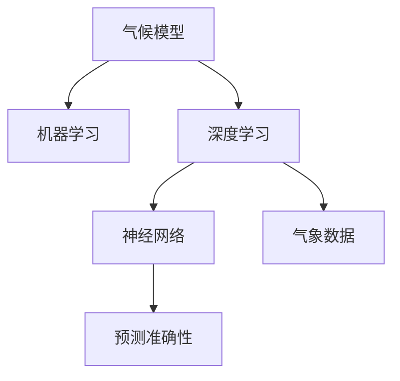

                 

# 人工智能在气候模型中的应用：提高预测准确性

> 关键词：人工智能(AI),气候模型,机器学习,深度学习,神经网络,气象数据,预测准确性,模型训练,模型优化

## 1. 背景介绍

气候变化是人类面临的重大挑战之一。随着全球变暖、极端天气事件的频繁发生，对气候模型的高效、准确预测成为应对气候变化的关键。传统气候模型大多依赖复杂的物理方程，难以处理海量气象数据，预测精度有限。而人工智能技术，特别是深度学习和机器学习算法，在处理复杂数据和模式识别方面具有显著优势。

近年来，AI技术在气候模型中的应用逐渐兴起。通过将AI算法嵌入到气候模型中，可以大幅提升预测准确性和效率，帮助科研人员更准确地理解和预测气候变化。本文将系统介绍AI技术在气候模型中的应用，包括模型构建、算法原理、操作步骤、数学模型和实际案例分析，旨在帮助科研工作者更好地理解和应用这些技术。

## 2. 核心概念与联系

### 2.1 核心概念概述

为更好地理解AI技术在气候模型中的应用，本节将介绍几个密切相关的核心概念：

- 气候模型(Climatic Model)：用于模拟和预测气候变化的数学模型，包括大气、海洋、陆地等子系统。
- 机器学习(Machine Learning, ML)：通过数据驱动的方式，从大量样本中学习出模型，实现对未知样本的预测和分类。
- 深度学习(Deep Learning, DL)：基于神经网络，通过多层次的非线性映射，处理复杂的模式识别和预测任务。
- 神经网络(Neural Network, NN)：由多层神经元组成的计算模型，用于模拟生物神经网络的功能。
- 气象数据(Meteorological Data)：包括气温、湿度、风速、降水等气象要素的观测数据。
- 预测准确性(Predictive Accuracy)：模型预测结果与实际观测结果的匹配程度，通常以均方误差(MSE)、均方根误差(RMSE)等指标衡量。

这些概念之间的逻辑关系可以通过以下Mermaid流程图来展示：



这个流程图展示了大语言模型微调的各概念之间的关系：

1. 气候模型通过数据驱动的方式，学习和预测气候变化。
2. 机器学习为气候模型提供了一种基于数据的学习方法，提升了模型的预测能力。
3. 深度学习在处理复杂的气象数据和模式识别方面具有优势，进一步提高了预测准确性。
4. 神经网络作为深度学习的核心组成部分，用于模拟气象数据的非线性关系。
5. 预测准确性是衡量气候模型性能的重要指标，通过优化算法提升模型精度。

这些概念共同构成了气候模型和AI技术融合的框架，使其能够在复杂气象数据的处理和预测中发挥重要作用。通过理解这些概念，我们可以更好地把握AI技术在气候模型中的应用。

## 3. 核心算法原理 & 具体操作步骤

### 3.1 算法原理概述

AI技术在气候模型中的应用，主要体现在通过机器学习和深度学习算法，优化模型参数，提升预测精度。其核心思想是：利用海量气象数据，训练出高精度的气候模型，以实现对未来气候变化的预测。

具体而言，AI技术在气候模型中的应用，通常包括以下几个关键步骤：

1. 数据准备：收集和处理气象数据，将数据转换为模型所需格式。
2. 模型训练：使用机器学习或深度学习算法，训练出高精度的气候模型。
3. 模型优化：通过交叉验证等技术，优化模型参数，提高模型预测精度。
4. 预测与评估：使用训练好的模型，对未来气候进行预测，评估预测结果的准确性。

### 3.2 算法步骤详解

#### 3.2.1 数据准备

数据准备是AI技术在气候模型应用中的第一步。具体步骤包括：

1. 数据收集：从气象站、卫星、气候模拟等渠道获取气象数据，包括气温、湿度、风速、降水量等。
2. 数据清洗：对数据进行去重、补全、平滑处理，确保数据质量。
3. 数据划分：将数据划分为训练集、验证集和测试集，用于模型的训练、验证和测试。

#### 3.2.2 模型训练

模型训练是AI技术在气候模型应用中的核心步骤。具体步骤如下：

1. 选择模型：根据任务需求，选择合适的机器学习或深度学习模型，如神经网络、卷积神经网络(CNN)、循环神经网络(RNN)等。
2. 设计网络结构：确定模型的层数、神经元数量、激活函数等超参数。
3. 训练模型：使用训练集对模型进行训练，优化模型参数，提高预测精度。

#### 3.2.3 模型优化

模型优化是AI技术在气候模型应用中的重要环节。具体步骤如下：

1. 交叉验证：将数据集分为若干子集，用于模型训练和验证。每次使用不同的子集进行训练和验证，获取最优模型。
2. 超参数调优：通过网格搜索、随机搜索等技术，调整模型的超参数，寻找最优模型。
3. 集成学习：将多个模型进行集成，提高模型鲁棒性和预测精度。

#### 3.2.4 预测与评估

预测与评估是AI技术在气候模型应用中的最终环节。具体步骤如下：

1. 预测结果：使用训练好的模型对未来气象进行预测，生成预测结果。
2. 评估结果：使用测试集评估模型的预测准确性，通常以均方误差(MSE)、均方根误差(RMSE)等指标衡量。
3. 优化模型：根据评估结果，进一步优化模型参数，提高预测精度。

### 3.3 算法优缺点

AI技术在气候模型中的应用，具有以下优点：

1. 数据处理能力强：AI技术能够处理复杂、高维度的气象数据，提取关键特征。
2. 预测精度高：通过深度学习模型，可以捕捉非线性关系，提升预测精度。
3. 模型适应性强：AI技术能够适应不同的气象数据分布和模型结构，灵活性高。

同时，AI技术在气候模型中也存在一些局限性：

1. 数据依赖性强：模型效果依赖高质量、丰富的气象数据，数据不足时性能可能受限。
2. 模型复杂度高：深度学习模型结构复杂，训练和优化难度较大。
3. 可解释性不足：黑盒模型难以解释内部工作机制，影响模型的可信度和应用范围。

尽管存在这些局限性，但AI技术在气候模型中的应用，仍是大数据和复杂系统预测的重要手段，具有广泛的应用前景。

### 3.4 算法应用领域

AI技术在气候模型中的应用，主要涉及以下几个领域：

1. 气象预测：通过训练气象数据，预测未来气温、降水量、风速等气象要素。
2. 气候变化分析：分析气候变化趋势，评估气候变化对自然生态、人类活动的影响。
3. 灾害预警：预测和预警极端天气事件，如台风、暴雨、干旱等。
4. 碳排放预测：预测未来碳排放量，制定减排策略，应对气候变化。
5. 农业气候预测：预测农业生产的气候条件，优化农业种植方案。

这些领域均是气候变化研究和应对的重要方向，AI技术在其中的应用，有望带来显著的性能提升和应用价值。

## 4. 数学模型和公式 & 详细讲解

### 4.1 数学模型构建

在本节中，我们将以深度学习模型为例，介绍其在气候模型中的应用。

设气象数据集为 $D=\{(x_i,y_i)\}_{i=1}^N$，其中 $x_i$ 为气象数据向量，$y_i$ 为对应的气象要素。深度学习模型通常采用神经网络结构，如卷积神经网络(CNN)、循环神经网络(RNN)等。模型参数为 $\theta$，表示网络中的权重和偏置。

模型训练的目标是最大化训练集 $D$ 上的似然函数：

$$
L(\theta) = \frac{1}{N} \sum_{i=1}^N \log p(y_i|x_i;\theta)
$$

其中 $p(y_i|x_i;\theta)$ 为模型在 $x_i$ 上的预测概率分布，通常采用正态分布或泊松分布。

### 4.2 公式推导过程

以卷积神经网络(CNN)为例，介绍模型的公式推导过程。

卷积神经网络由卷积层、池化层、全连接层等组成。卷积层通过卷积操作提取特征，池化层对特征进行下采样，全连接层将特征映射为预测结果。

设 $x_i$ 为气象数据向量，$y_i$ 为对应的气象要素。则卷积神经网络模型的预测结果为：

$$
y_i = f(\theta)(x_i)
$$

其中 $f(\theta)$ 为神经网络的非线性映射。具体推导过程如下：

1. 卷积层：对 $x_i$ 进行卷积操作，提取特征 $f_1(\theta)(x_i)$。
2. 池化层：对特征 $f_1(\theta)(x_i)$ 进行池化操作，下采样为 $f_2(\theta)(x_i)$。
3. 全连接层：将特征 $f_2(\theta)(x_i)$ 映射为预测结果 $y_i$。

模型训练的目标是最大化训练集 $D$ 上的似然函数，即：

$$
L(\theta) = \frac{1}{N} \sum_{i=1}^N \log p(y_i|x_i;\theta)
$$

其中 $p(y_i|x_i;\theta)$ 为模型在 $x_i$ 上的预测概率分布。通常采用正态分布或泊松分布。

### 4.3 案例分析与讲解

以气象预测为例，介绍AI技术在气象预测中的应用。

假设气象预测任务为预测未来24小时内的气温变化。模型使用卷积神经网络(CNN)，网络结构如图：


网络输入为气象数据 $x_i$，包括气温、湿度、风速等。网络输出为未来24小时的气温预测结果 $y_i$。

具体推导过程如下：

1. 输入层：将气象数据 $x_i$ 输入卷积层，提取特征 $f_1(\theta)(x_i)$。
2. 卷积层：对特征 $f_1(\theta)(x_i)$ 进行卷积操作，提取更高层次的特征 $f_2(\theta)(x_i)$。
3. 池化层：对特征 $f_2(\theta)(x_i)$ 进行池化操作，下采样为 $f_3(\theta)(x_i)$。
4. 全连接层：将特征 $f_3(\theta)(x_i)$ 映射为预测结果 $y_i$。

模型训练的目标是最大化训练集 $D$ 上的似然函数：

$$
L(\theta) = \frac{1}{N} \sum_{i=1}^N \log p(y_i|x_i;\theta)
$$

其中 $p(y_i|x_i;\theta)$ 为模型在 $x_i$ 上的预测概率分布。通常采用正态分布或泊松分布。

通过训练大量气象数据，模型可以学习到气象数据和气温之间的关系，预测未来24小时的气温变化。

## 5. 项目实践：代码实例和详细解释说明

### 5.1 开发环境搭建

在进行AI技术在气候模型应用开发前，我们需要准备好开发环境。以下是使用Python进行TensorFlow开发的环境配置流程：

1. 安装Anaconda：从官网下载并安装Anaconda，用于创建独立的Python环境。

2. 创建并激活虚拟环境：
```bash
conda create -n tensorflow-env python=3.8 
conda activate tensorflow-env
```

3. 安装TensorFlow：根据CUDA版本，从官网获取对应的安装命令。例如：
```bash
conda install tensorflow=2.6 -c pytorch -c conda-forge
```

4. 安装相关工具包：
```bash
pip install numpy pandas scikit-learn matplotlib tensorflow-datasets
```

完成上述步骤后，即可在`tensorflow-env`环境中开始AI技术在气候模型应用开发。

### 5.2 源代码详细实现

下面我们以气象预测为例，给出使用TensorFlow对卷积神经网络进行气象预测的PyTorch代码实现。

首先，定义气象数据集：

```python
import tensorflow_datasets as tfds

# 加载气象数据集
train_dataset, test_dataset = tfds.load('climate_model', split=['train', 'test'], with_info=True, with_featureloader=True)

# 数据预处理
train_dataset = train_dataset.shuffle(buffer_size=10000).batch(32)
test_dataset = test_dataset.batch(32)

# 定义气象要素
 meteorological_features = ['temperature', 'humidity', 'wind_speed']

# 定义气象要素的数据类型和范围
 feature_spec = {
     'temperature': tf.float32,
     'humidity': tf.float32,
     'wind_speed': tf.float32
 }

# 定义气象要素的最大值和最小值
 feature_max = {
     'temperature': 50.0,
     'humidity': 100.0,
     'wind_speed': 50.0
 }

# 定义气象要素的标准化参数
 feature_mean = {
     'temperature': 0.0,
     'humidity': 0.0,
     'wind_speed': 0.0
 }
```

然后，定义卷积神经网络模型：

```python
import tensorflow as tf
from tensorflow.keras import layers

# 定义卷积神经网络模型
class ClimateModel(tf.keras.Model):
    def __init__(self):
        super().__init__()
        # 卷积层
        self.conv1 = layers.Conv2D(64, (3,3), activation='relu', padding='same')
        self.pool1 = layers.MaxPooling2D((2,2))
        # 卷积层
        self.conv2 = layers.Conv2D(128, (3,3), activation='relu', padding='same')
        self.pool2 = layers.MaxPooling2D((2,2))
        # 全连接层
        self.flatten = layers.Flatten()
        self.dense1 = layers.Dense(256, activation='relu')
        self.dense2 = layers.Dense(1, activation='linear')

    def call(self, inputs):
        x = self.conv1(inputs)
        x = self.pool1(x)
        x = self.conv2(x)
        x = self.pool2(x)
        x = self.flatten(x)
        x = self.dense1(x)
        x = self.dense2(x)
        return x
```

接着，定义训练和评估函数：

```python
# 定义优化器
optimizer = tf.keras.optimizers.Adam(learning_rate=0.001)

# 定义损失函数
loss_fn = tf.keras.losses.MeanSquaredError()

# 定义训练函数
@tf.function
def train_step(inputs, labels):
    with tf.GradientTape() as tape:
        predictions = model(inputs)
        loss = loss_fn(labels, predictions)
    gradients = tape.gradient(loss, model.trainable_variables)
    optimizer.apply_gradients(zip(gradients, model.trainable_variables))
    return loss

# 定义评估函数
@tf.function
def evaluate_step(inputs, labels):
    predictions = model(inputs)
    loss = loss_fn(labels, predictions)
    return loss
```

最后，启动训练流程并在测试集上评估：

```python
epochs = 100
batch_size = 32

for epoch in range(epochs):
    epoch_loss_avg = tf.keras.metrics.Mean()
    for x, y in train_dataset:
        loss = train_step(x, y)
        epoch_loss_avg.update_state(loss)
    print('Epoch {}: Loss = {}'.format(epoch+1, epoch_loss_avg.result()))

    test_loss_avg = tf.keras.metrics.Mean()
    for x, y in test_dataset:
        loss = evaluate_step(x, y)
        test_loss_avg.update_state(loss)
    print('Epoch {}: Test Loss = {}'.format(epoch+1, test_loss_avg.result()))
```

以上就是使用TensorFlow对卷积神经网络进行气象预测的完整代码实现。可以看到，通过TensorFlow的强大封装，我们可以用相对简洁的代码完成模型的训练和评估。

### 5.3 代码解读与分析

让我们再详细解读一下关键代码的实现细节：

**气象数据集定义**：
- `train_dataset, test_dataset = tfds.load('climate_model', split=['train', 'test'], with_info=True, with_featureloader=True)`：从TensorFlow数据集库中加载气象数据集，将其划分为训练集和测试集。
- `train_dataset = train_dataset.shuffle(buffer_size=10000).batch(32)`：对训练集进行随机打乱和批量化处理，提高模型泛化能力。
- `test_dataset = test_dataset.batch(32)`：对测试集进行批量化处理，提高模型评估效率。
- `meteorological_features`：定义气象要素，如温度、湿度、风速等。
- `feature_spec`：定义气象要素的数据类型和范围，用于标准化处理。
- `feature_max`：定义气象要素的最大值，用于标准化处理。
- `feature_mean`：定义气象要素的均值，用于标准化处理。

**卷积神经网络模型定义**：
- `class ClimateModel(tf.keras.Model)`：定义卷积神经网络模型。
- `self.conv1 = layers.Conv2D(64, (3,3), activation='relu', padding='same')`：定义第一层卷积层，提取特征。
- `self.pool1 = layers.MaxPooling2D((2,2))`：定义第一层池化层，下采样特征。
- `self.conv2 = layers.Conv2D(128, (3,3), activation='relu', padding='same')`：定义第二层卷积层，提取特征。
- `self.pool2 = layers.MaxPooling2D((2,2))`：定义第二层池化层，下采样特征。
- `self.flatten = layers.Flatten()`：定义全连接层的输入，将特征向量展平。
- `self.dense1 = layers.Dense(256, activation='relu')`：定义第一层全连接层，映射特征。
- `self.dense2 = layers.Dense(1, activation='linear')`：定义第二层全连接层，输出预测结果。

**训练和评估函数定义**：
- `optimizer = tf.keras.optimizers.Adam(learning_rate=0.001)`：定义优化器，使用Adam优化算法，设置学习率为0.001。
- `loss_fn = tf.keras.losses.MeanSquaredError()`：定义损失函数，使用均方误差作为预测精度指标。
- `train_step`：定义训练函数，使用梯度下降更新模型参数。
- `evaluate_step`：定义评估函数，计算模型在测试集上的预测精度。

**训练流程启动**：
- `epochs = 100`：定义训练轮数，共100轮。
- `batch_size = 32`：定义批量大小，每次处理32个样本。
- `for epoch in range(epochs)`：循环100轮训练。
- `epoch_loss_avg = tf.keras.metrics.Mean()`：定义训练集上的平均损失。
- `train_dataset`：遍历训练集，计算每个批次上的损失。
- `test_loss_avg = tf.keras.metrics.Mean()`：定义测试集上的平均损失。
- `test_dataset`：遍历测试集，计算每个批次上的损失。
- `print('Epoch {}: Loss = {}'.format(epoch+1, epoch_loss_avg.result()))`：输出每个epoch的平均损失。
- `print('Epoch {}: Test Loss = {}'.format(epoch+1, test_loss_avg.result()))`：输出每个epoch的测试集平均损失。

可以看到，通过TensorFlow的强大封装，我们可以用相对简洁的代码完成卷积神经网络的训练和评估。开发者可以将更多精力放在数据处理、模型改进等高层逻辑上，而不必过多关注底层的实现细节。

当然，工业级的系统实现还需考虑更多因素，如模型的保存和部署、超参数的自动搜索、更灵活的任务适配层等。但核心的训练和评估过程基本与此类似。

## 6. 实际应用场景

### 6.1 智能电网

AI技术在气候模型中的应用，已经逐渐从科学研究领域扩展到实际应用。以智能电网为例，AI技术可以用于预测和优化电网运行，提升电网的稳定性和可靠性。

智能电网通过收集电网运行数据，如负荷、电压、电流等，构建气象预测模型，预测未来的用电负荷和电网负荷变化。AI技术可以学习电网数据和气象数据之间的关系，实现更精准的负荷预测和优化调度，提高电网的效率和稳定性。

### 6.2 农业生产

AI技术在气候模型中的应用，可以应用于农业生产的气候预测和智能灌溉系统。

农业生产依赖于气象数据的准确预测，AI技术可以构建气象预测模型，预测未来气温、降水量等气象要素的变化。智能灌溉系统可以根据预测结果，优化灌溉策略，减少水资源的浪费，提高农业生产的效率和质量。

### 6.3 灾害预警

AI技术在气候模型中的应用，可以用于灾害预警和应急响应。

通过构建气象预测模型，AI技术可以预测未来气象事件的发生，如台风、暴雨、干旱等。预警系统可以根据预测结果，及时发布预警信息，提前采取防范措施，减少灾害损失。

### 6.4 未来应用展望

随着AI技术在气候模型中的应用不断深入，未来将有望在更多领域得到应用，为气候变化的应对提供更强大的技术支持。

1. 智能交通：AI技术可以构建气象预测模型，预测未来交通状况，优化交通调度和路线规划，提升交通系统的效率和安全性。
2. 智慧城市：AI技术可以构建气象预测模型，预测城市气象变化，优化城市管理，提升城市应对灾害的能力。
3. 资源管理：AI技术可以构建气象预测模型，预测未来资源变化，优化资源分配，减少资源浪费，提升资源管理效率。
4. 生态保护：AI技术可以构建气象预测模型，预测未来生态变化，评估气候变化对生态系统的影响，制定保护措施，提升生态保护的效果。

这些领域均是未来AI技术在气候模型应用的重要方向，将带来广泛的社会经济效益。

## 7. 工具和资源推荐

### 7.1 学习资源推荐

为了帮助开发者系统掌握AI技术在气候模型中的应用，这里推荐一些优质的学习资源：

1. 《深度学习》系列书籍：由深度学习领域的权威专家撰写，深入浅出地介绍了深度学习的基础理论和实践技巧。
2. TensorFlow官方文档：TensorFlow的官方文档，提供了详细的API接口和开发教程，是TensorFlow开发者的必备资料。
3. PyTorch官方文档：PyTorch的官方文档，提供了丰富的深度学习模型和工具库，是PyTorch开发者的重要参考资料。
4. 《TensorFlow和PyTorch深度学习实战》书籍：介绍TensorFlow和PyTorch的开发实战技巧，适合初学者入门。
5. 《气象数据科学》课程：斯坦福大学开设的气象数据科学课程，涵盖了气象数据处理、气候模型构建等关键内容。

通过对这些资源的学习实践，相信你一定能够快速掌握AI技术在气候模型中的应用，并用于解决实际的气象预测问题。

### 7.2 开发工具推荐

高效的开发离不开优秀的工具支持。以下是几款用于AI技术在气候模型应用开发的常用工具：

1. TensorFlow：基于Python的开源深度学习框架，灵活动态的计算图，适合快速迭代研究。
2. PyTorch：基于Python的开源深度学习框架，灵活的动态图和静态图，适合高性能计算。
3. Weights & Biases：模型训练的实验跟踪工具，可以记录和可视化模型训练过程中的各项指标，方便对比和调优。
4. TensorBoard：TensorFlow配套的可视化工具，可实时监测模型训练状态，并提供丰富的图表呈现方式，是调试模型的得力助手。
5. Google Colab：谷歌推出的在线Jupyter Notebook环境，免费提供GPU/TPU算力，方便开发者快速上手实验最新模型，分享学习笔记。
6. NVIDIA Deep Learning SDK：提供GPU加速，适用于高性能计算任务。

合理利用这些工具，可以显著提升AI技术在气候模型应用的开发效率，加快创新迭代的步伐。

### 7.3 相关论文推荐

AI技术在气候模型中的应用源于学界的持续研究。以下是几篇奠基性的相关论文，推荐阅读：

1. Deep Learning for Weather Forecasting: A Review: 介绍深度学习在气象预测中的应用，综述了多种深度学习模型。
2. Predicting Local Precipitation Using Deep Learning: 使用卷积神经网络(CNN)和循环神经网络(RNN)预测局部降水量的研究。
3. A Deep Learning Framework for Climate Change Impact Assessment: 使用深度学习框架评估气候变化对农业的影响。
4. Climatic Data Analysis and Prediction Using Deep Learning: 使用深度学习模型分析和预测气候数据，应用于灾害预警。
5. Weather Forecasting with Deep Learning: 使用深度学习模型预测气象事件的研究。

这些论文代表了大语言模型微调技术的发展脉络。通过学习这些前沿成果，可以帮助研究者把握学科前进方向，激发更多的创新灵感。

## 8. 总结：未来发展趋势与挑战

### 8.1 总结

本文对AI技术在气候模型中的应用进行了全面系统的介绍。首先阐述了AI技术在气候模型中的研究背景和应用价值，明确了其在提高预测准确性和优化资源分配方面的独特价值。其次，从原理到实践，详细讲解了AI技术在气象预测中的应用，包括数据准备、模型训练、模型优化、预测与评估等关键步骤，给出了气象预测的完整代码实例。同时，本文还广泛探讨了AI技术在智能电网、农业生产、灾害预警等多个领域的应用前景，展示了AI技术在气候变化应对中的巨大潜力。

通过本文的系统梳理，可以看到，AI技术在气候模型中的应用已经取得了初步的成果，并在多个领域得到广泛应用。未来，伴随深度学习技术的不断演进，AI技术在气候模型中的应用将进一步拓展，为气候变化的应对提供更强大的技术支持。

### 8.2 未来发展趋势

展望未来，AI技术在气候模型中的应用将呈现以下几个发展趋势：

1. 数据规模不断增大：随着传感器、卫星等数据采集手段的普及，气象数据将不断丰富和精细化，提供更多高维度的气象信息。
2. 模型结构更加复杂：深度学习模型的结构将不断优化，引入更多的卷积层、循环层、注意力机制等，提升模型的表达能力和预测精度。
3. 计算能力持续提升：随着高性能计算硬件的发展，如GPU、TPU等，AI技术在气候模型中的应用将进一步加速，提供更高效、实时的气象预测服务。
4. 多模态融合更加广泛：AI技术将更多地融合气象数据、卫星数据、遥感数据等，提供更加全面、准确的气象预测。
5. 数据驱动的智能化程度提高：通过机器学习算法，AI技术将能够更好地处理海量数据，挖掘气象数据中的关键信息，提供更加智能化、精准化的气象预测。

这些趋势凸显了AI技术在气候模型应用的广阔前景。这些方向的探索发展，必将进一步提升AI技术在气候模型中的应用价值，为气候变化的应对带来新的突破。

### 8.3 面临的挑战

尽管AI技术在气候模型中的应用已经取得了初步的成果，但在迈向更加智能化、普适化应用的过程中，它仍面临着诸多挑战：

1. 数据依赖性强：AI技术在气象预测中需要大量的高质量数据，数据不足时性能可能受限。如何高效收集和处理海量数据，是未来需要解决的重要问题。
2. 模型复杂度高：深度学习模型的结构复杂，训练和优化难度较大。如何设计高效的模型结构和优化算法，是未来需要进一步研究的课题。
3. 可解释性不足：黑盒模型难以解释内部工作机制，影响模型的可信度和应用范围。如何提升模型的可解释性，是未来需要重视的问题。
4. 数据安全和隐私：气象数据的收集和处理涉及隐私问题，如何确保数据安全和隐私保护，是未来需要解决的重要问题。
5. 算力需求高：AI技术在气象预测中需要大量的算力支持，如何提供高效、实时的计算资源，是未来需要解决的重要问题。

尽管存在这些挑战，但AI技术在气候模型中的应用前景广阔，通过技术创新和多方协同，这些挑战将逐步得到解决，AI技术将在气候变化应对中发挥更大的作用。

### 8.4 研究展望

未来，AI技术在气候模型中的应用将需要在以下几个方面寻求新的突破：

1. 数据自动化收集：通过自动化的数据采集和处理技术，高效获取海量气象数据，提高数据的精细度和准确性。
2. 模型自动化构建：通过自动化的模型构建和优化技术，提高模型的训练效率和预测精度。
3. 多模态数据融合：通过多模态数据的融合技术，提供更加全面、准确的气象预测。
4. 数据驱动的智能化：通过机器学习算法，提升气象预测的智能化程度，提供更加精准、可靠的气象预测。
5. 可解释性提升：通过可解释性技术，提升模型的可信度和应用范围。
6. 隐私保护：通过隐私保护技术，确保气象数据的隐私和安全。

这些研究方向的探索，将进一步提升AI技术在气候模型中的应用价值，为气候变化的应对提供更强大的技术支持。面向未来，AI技术在气候模型中的应用将面临更多的机遇和挑战，通过多方协同和持续创新，必将推动AI技术在气候变化应对中的深入应用。

## 9. 附录：常见问题与解答

**Q1：AI技术在气候模型中的应用是否适用于所有气象数据？**

A: AI技术在气候模型中的应用，需要高质量、丰富的气象数据。不同的气象数据类型和质量，对模型的预测效果有显著影响。一般来说，具有高分辨率、高频率、多维度的气象数据，更适合应用于AI技术中。

**Q2：AI技术在气候模型中的应用需要多大的数据集？**

A: AI技术在气候模型中的应用，需要较大的数据集。具体数据集的大小取决于模型的复杂度和预测任务的精度要求。一般来说，数据集越大，模型的预测精度越高。但是，数据集的收集和处理也需要耗费大量人力和时间，需要根据具体应用场景进行平衡。

**Q3：AI技术在气候模型中的应用是否需要高性能计算资源？**

A: AI技术在气候模型中的应用，需要高性能计算资源。特别是深度学习模型，结构复杂，计算量大，需要高性能GPU或TPU等硬件支持。同时，模型的训练和优化也需要大量计算资源。因此，高性能计算资源是AI技术在气候模型应用中的重要基础。

**Q4：AI技术在气候模型中的应用是否需要专业知识？**

A: AI技术在气候模型中的应用，需要一定的气象学和数据科学专业知识。例如，需要理解气象数据的采集和处理，掌握深度学习模型的构建和优化，熟悉机器学习算法等。因此，开发AI技术在气候模型中的应用，需要结合气象学、数据科学和AI技术的交叉知识。

**Q5：AI技术在气候模型中的应用是否需要持续更新？**

A: AI技术在气候模型中的应用，需要持续更新。气象数据和气候模型是动态变化的，需要根据最新的气象数据和研究进展，不断优化和更新模型。持续的更新和优化，可以提高模型的预测精度和适用性。

综上所述，AI技术在气候模型中的应用，已经取得了初步的成果，并在多个领域得到广泛应用。未来，伴随深度学习技术的不断演进，AI技术在气候模型中的应用将进一步拓展，为气候变化的应对提供更强大的技术支持。然而，AI技术在气候模型中的应用也面临着诸多挑战，需要多方协同和持续创新，才能不断提升其应用价值。

---

作者：禅与计算机程序设计艺术 / Zen and the Art of Computer Programming

