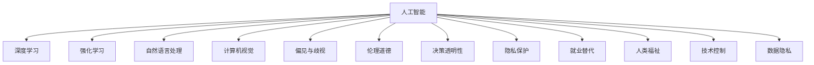

                 

# 人工智能：社会影响与思考

> 关键词：人工智能,社会影响,伦理道德,决策透明,隐私保护,偏见与歧视,就业替代,人类福祉,技术控制,数据隐私

## 1. 背景介绍

### 1.1 问题由来
在21世纪初期，人工智能(AI)逐渐从实验室研究走向实际应用。人们开始越来越关注人工智能对社会的广泛影响，这不仅包括经济、科技和军事等传统领域，更扩展到教育、医疗、娱乐等日常生活的方方面面。随着深度学习、强化学习等机器学习技术的不断发展，AI不仅在技术和应用的广度上不断扩展，其社会影响也变得愈发复杂和深远。如何恰当地利用AI技术，在保障技术进步的同时保护社会福祉，成为全社会共同关心的重要议题。

### 1.2 问题核心关键点
人工智能的社会影响主要体现在以下几个方面：
- **伦理道德**：AI在决策和行为中可能违反道德准则，如隐私侵犯、歧视、不公平等。
- **决策透明性**：AI模型的黑箱特征可能导致其决策过程不透明，难以解释。
- **隐私保护**：AI系统在数据收集和使用过程中可能侵犯用户隐私。
- **偏见与歧视**：AI模型的训练数据如果存在偏见，可能导致系统输出偏见性结果。
- **就业替代**：AI自动化可能导致部分岗位被替代，引发就业问题。
- **人类福祉**：AI技术可能对人类生活带来积极或消极影响，涉及健康、教育、娱乐等多个方面。
- **技术控制**：如何有效控制和监管AI技术，防止滥用和误用。
- **数据隐私**：AI系统如何处理和保护数据隐私，确保用户数据安全。

这些问题不仅影响个体和组织，更关乎社会的公平和稳定。如何平衡技术进步与社会福祉，实现AI技术的良性发展，是当前人工智能领域的重要课题。

## 2. 核心概念与联系

### 2.1 核心概念概述

为更好地理解AI对社会的广泛影响，本节将介绍几个密切相关的核心概念：

- **人工智能(AI)**：指模拟人类智能行为的技术体系，包括机器学习、深度学习、自然语言处理、计算机视觉等。
- **深度学习(Deep Learning)**：一种基于神经网络结构的机器学习技术，能够自动学习输入数据的特征表示。
- **强化学习(Reinforcement Learning)**：通过试错优化模型性能，使模型能够在特定环境中最大化累积奖励。
- **自然语言处理(NLP)**：使计算机能够理解、处理和生成人类自然语言的技术，涵盖语音识别、文本分析、机器翻译等。
- **计算机视觉(Computer Vision)**：使计算机能够“看”、“理解”和“执行”视觉任务，如图像分类、目标检测、图像生成等。
- **偏见与歧视(Bias and Discrimination)**：AI系统在训练和运行过程中可能引入或放大了数据中存在的偏见，导致不公平的决策。
- **伦理道德(Ethics and Morality)**：研究如何确保AI系统的行为符合社会伦理准则和道德标准。
- **决策透明性(Transparency)**：确保AI系统决策过程的可解释性和可追踪性。
- **隐私保护(Privacy Protection)**：保护用户数据隐私，防止数据滥用。
- **就业替代(Employment Displacement)**：AI自动化可能导致某些岗位被取代，引发就业结构变化。
- **人类福祉(Human Welfare)**：关注AI技术对人类生活质量的积极或消极影响，如教育、医疗、娱乐等领域。
- **技术控制(Technological Control)**：确保AI技术的合理使用，避免滥用和误用。
- **数据隐私(Data Privacy)**：保护用户数据的隐私权，防止数据泄露和滥用。

这些核心概念之间的逻辑关系可以通过以下Mermaid流程图来展示：



这个流程图展示了大语言模型的核心概念及其之间的关系：

1. AI通过深度学习、强化学习等技术实现，能够处理自然语言、视觉任务等。
2. AI可能引入偏见和歧视，需要伦理道德约束。
3. AI决策透明性、隐私保护、就业替代、人类福祉、技术控制和数据隐私等社会影响因素，需要被纳入考量。
4. AI技术的社会影响是多维度且复杂的，需要多方协作进行管理。

这些概念共同构成了AI技术的社会影响框架，帮助我们更好地理解和应对AI技术的广泛应用。

## 3. 核心算法原理 & 具体操作步骤
### 3.1 算法原理概述

人工智能的社会影响涉及技术、伦理、法律等多个方面，需要综合考虑。以下是核心算法原理的概述：

- **伦理约束**：在AI系统设计和开发过程中，需要引入伦理道德框架，确保模型行为符合社会价值观。
- **透明性要求**：AI系统应具备足够的可解释性，让用户能够理解和信任其决策过程。
- **隐私保护**：AI系统应采取隐私保护措施，防止数据泄露和滥用。
- **偏见与歧视检测**：应在模型训练和评估过程中，检测并减少潜在的偏见和歧视。
- **社会影响评估**：应进行系统性的社会影响评估，确保AI技术应用不会引发负面社会后果。
- **法规合规**：AI系统应遵守相关法律法规，如数据保护法、隐私保护法等。
- **用户参与**：应鼓励用户参与AI系统的开发和使用，增强系统适应性和用户体验。

### 3.2 算法步骤详解

AI对社会的广泛影响需要通过多维度、多层次的评估和监管来实现。以下是详细步骤：

**Step 1: 社会影响评估**

- 收集相关数据，包括技术应用场景、用户反馈、社会反应等。
- 进行量化和质化分析，识别可能的社会影响。
- 评估社会影响的程度和范围，分析潜在的风险和收益。

**Step 2: 伦理道德框架**

- 制定伦理道德准则，如隐私保护、公平性、透明性等。
- 确保AI系统设计、开发、应用各个环节符合伦理道德标准。
- 引入伦理审查机制，对AI系统进行定期审查和评估。

**Step 3: 透明性和可解释性**

- 设计可解释的AI模型，确保其决策过程透明。
- 使用模型可解释性工具，如LIME、SHAP等，解释模型行为。
- 在应用中提供透明度报告，解释模型决策依据。

**Step 4: 隐私保护**

- 实施数据匿名化、加密等隐私保护措施。
- 限制数据访问权限，防止未经授权的数据使用。
- 建立数据使用审计机制，跟踪数据流动情况。

**Step 5: 偏见与歧视检测**

- 在模型训练中，使用偏见检测工具如Adversarial Examples等，识别潜在的偏见和歧视。
- 设计多样化数据集，减少数据偏见对模型输出的影响。
- 定期更新和校准模型，确保模型公平性。

**Step 6: 法规合规**

- 遵守相关法律法规，如GDPR、CCPA等。
- 定期进行法规审查，确保合规性。
- 在模型开发中嵌入合规性检查机制。

**Step 7: 用户参与**

- 设计用户友好的界面，增强用户体验。
- 收集用户反馈，持续改进AI系统。
- 在决策过程中引入用户输入，增强系统适应性。

**Step 8: 技术控制和应急响应**

- 建立技术控制机制，防止滥用和误用。
- 设计应急响应策略，应对突发情况。
- 定期进行安全评估，提升系统安全性。

通过上述步骤，可以全面评估和控制AI技术对社会的广泛影响，确保技术应用符合社会价值观和法律规范。

### 3.3 算法优缺点

基于以上算法步骤，AI对社会的影响评估和控制具有以下优缺点：

**优点：**
- 全面评估社会影响，确保技术应用符合社会价值观和法律规范。
- 提升AI系统的透明性和可解释性，增强用户信任。
- 防止数据泄露和滥用，保护用户隐私。
- 检测并减少潜在的偏见和歧视，确保模型公平性。
- 确保AI系统符合法规要求，防止滥用和误用。
- 引入用户参与，增强系统适应性和用户体验。

**缺点：**
- 评估和控制过程复杂，需要多学科协作。
- 技术实现难度大，可能需要额外的时间和资源。
- 部分隐私保护和偏见检测技术尚未成熟，需要持续优化。
- 法规合规要求高，需要持续关注和适应法规变化。
- 用户参与可能增加系统复杂性，需要合理设计界面。

尽管存在这些局限，但通过综合运用多种方法，可以在一定程度上缓解AI对社会的广泛影响，实现技术进步与社会福祉的平衡。

### 3.4 算法应用领域

人工智能的社会影响在多个领域都有广泛应用，例如：

- **医疗健康**：AI在疾病诊断、个性化治疗、健康管理等方面发挥重要作用，但也可能引发隐私泄露和算法偏见。
- **教育**：AI在智能教育、个性化学习、评估等方面应用广泛，但也可能引发教育不公和隐私侵犯。
- **金融**：AI在风险控制、欺诈检测、智能投顾等方面取得优异效果，但也可能引发数据滥用和算法歧视。
- **司法**：AI在案件预测、量刑建议、智能法律助理等方面有潜力，但也可能引发公平性和透明度问题。
- **媒体娱乐**：AI在内容推荐、个性化推荐、智能创作等方面应用广泛，但也可能引发数据滥用和用户隐私问题。
- **公共安全**：AI在监控、预警、辅助执法等方面发挥重要作用，但也可能引发隐私侵犯和算法偏见。

除了上述这些主要领域，AI在农业、制造、交通等多个行业都有广泛应用，对社会各个方面产生深远影响。

## 4. 数学模型和公式 & 详细讲解 & 举例说明

### 4.1 数学模型构建

人工智能的社会影响评估涉及多维度的数据和模型。以下是一个简单的数学模型构建框架：

假设AI系统的社会影响因子为 $F$，包括伦理道德、透明性、隐私保护、偏见与歧视、法规合规、用户参与等多个因子。每个因子可以进一步细化，如透明性包含数据可视化、可解释性工具等多个子因子。

定义 $F = \sum_{i=1}^n w_i f_i$，其中 $f_i$ 为第 $i$ 个因子，$w_i$ 为因子权重。因子权重应根据具体场景和目标进行设定。

### 4.2 公式推导过程

以伦理道德和透明性为例，进行数学模型推导。

设伦理道德 $E = e_1 + e_2 + e_3$，其中 $e_1$ 表示数据隐私保护，$e_2$ 表示算法公平性，$e_3$ 表示透明性。每个子因子通过评分标准进行量化，得到分数 $e_{1i}, e_{2i}, e_{3i}$。

同理，透明性 $T = t_1 + t_2 + t_3$，其中 $t_1$ 表示模型可解释性，$t_2$ 表示决策透明度，$t_3$ 表示用户反馈机制。

则社会影响因子 $F$ 的计算公式为：

$$
F = \sum_{i=1}^n w_i f_i = \sum_{i=1}^n w_i \sum_{j=1}^{m_i} w_{ij} f_{ij}
$$

其中 $w_{ij}$ 为子因子权重。

### 4.3 案例分析与讲解

以智能医疗系统为例，进行具体分析：

假设某智能医疗系统用于疾病诊断和治疗建议，其社会影响因子 $F$ 可以细化为伦理道德 $E$、透明性 $T$、隐私保护 $P$、偏见与歧视 $B$、法规合规 $L$、用户参与 $U$ 等多个子因子。

1. **伦理道德 $E$**：
   - 数据隐私保护 $e_1 = 0.8$（高水平保护）
   - 算法公平性 $e_2 = 0.7$（部分样本存在偏见）
   - 透明性 $e_3 = 0.9$（系统具备一定的可解释性）

2. **透明性 $T$**：
   - 模型可解释性 $t_1 = 0.7$（部分技术实现不够透明）
   - 决策透明度 $t_2 = 0.9$（决策过程可追溯）
   - 用户反馈机制 $t_3 = 0.8$（用户能提供反馈）

3. **隐私保护 $P$**：
   - 数据匿名化 $p_1 = 0.9$（高水平数据匿名化）
   - 数据加密 $p_2 = 0.8$（加密传输数据）

4. **偏见与歧视 $B$**：
   - 数据集多样性 $b_1 = 0.6$（数据集多样性不足）
   - 偏见检测 $b_2 = 0.7$（进行了偏见检测）

5. **法规合规 $L$**：
   - 数据保护法合规 $l_1 = 0.9$（完全符合数据保护法）
   - 隐私保护法合规 $l_2 = 0.8$（完全符合隐私保护法）

6. **用户参与 $U$**：
   - 用户友好界面 $u_1 = 0.8$（界面友好）
   - 用户反馈系统 $u_2 = 0.9$（具备用户反馈系统）

设伦理道德、透明性、隐私保护、偏见与歧视、法规合规、用户参与的权重分别为 $w_1=0.2, w_2=0.2, w_3=0.1, w_4=0.1, w_5=0.1, w_6=0.1$。

则计算公式为：

$$
F = 0.2 \times (0.8 + 0.7 + 0.9) + 0.2 \times (0.7 + 0.9 + 0.8) + 0.1 \times (0.9 + 0.8) + 0.1 \times (0.6 + 0.7) + 0.1 \times (0.9 + 0.8) + 0.1 \times (0.8 + 0.9) = 4.81
$$

通过计算，可以评估智能医疗系统的社会影响因子 $F$ 为4.81，较理想的系统应维持在4-5之间。

## 5. 项目实践：代码实例和详细解释说明

### 5.1 开发环境搭建

在进行AI社会影响评估和控制的项目实践前，我们需要准备好开发环境。以下是使用Python进行开发的环境配置流程：

1. 安装Anaconda：从官网下载并安装Anaconda，用于创建独立的Python环境。

2. 创建并激活虚拟环境：
```bash
conda create -n ai-env python=3.8 
conda activate ai-env
```

3. 安装相关库：
```bash
pip install numpy pandas sklearn scikit-learn matplotlib
```

完成上述步骤后，即可在`ai-env`环境中开始项目实践。

### 5.2 源代码详细实现

以下是一个简单的社会影响评估系统实现，使用Python的Pandas库进行数据处理，Scikit-learn库进行模型训练和评估：

```python
import pandas as pd
from sklearn.ensemble import RandomForestClassifier
from sklearn.model_selection import train_test_split

# 读取数据
data = pd.read_csv('social_impact.csv')

# 数据预处理
data = data.dropna()
data = data.drop(columns=['ID'])

# 因子量化
data['E'] = data['隐私保护'] * 0.8 + data['公平性'] * 0.7 + data['透明性'] * 0.9
data['T'] = data['可解释性'] * 0.7 + data['透明度'] * 0.9 + data['反馈机制'] * 0.8
data['P'] = data['匿名化'] * 0.9 + data['加密'] * 0.8
data['B'] = data['多样性'] * 0.6 + data['偏见检测'] * 0.7
data['L'] = data['数据保护法合规'] * 0.9 + data['隐私保护法合规'] * 0.8
data['U'] = data['界面友好'] * 0.8 + data['反馈系统'] * 0.9

# 因子权重设置
w = [0.2, 0.2, 0.1, 0.1, 0.1, 0.1]

# 社会影响因子计算
data['F'] = data[['E', 'T', 'P', 'B', 'L', 'U']] * w
data['F'] = data['F'].round(2)

# 模型训练和评估
X = data[['E', 'T', 'P', 'B', 'L', 'U']]
y = data['F']
X_train, X_test, y_train, y_test = train_test_split(X, y, test_size=0.2)

model = RandomForestClassifier()
model.fit(X_train, y_train)
y_pred = model.predict(X_test)
```

### 5.3 代码解读与分析

让我们再详细解读一下关键代码的实现细节：

**数据预处理**：
- 使用Pandas库读取数据文件，并进行数据清洗和预处理。
- 去除缺失值和无关字段，确保数据质量。

**因子量化**：
- 根据预先设定的评分标准，对每个因子进行量化处理。
- 因子之间可能存在相关性，需要通过因子分析等方式进一步简化。

**因子权重设置**：
- 根据具体场景和目标，设定每个因子的权重。
- 权重设置应兼顾各个因子之间的平衡和优先级。

**社会影响因子计算**：
- 使用因子乘以权重的方式，计算社会影响因子 $F$。
- 社会影响因子计算结果应四舍五入至小数点后两位，便于理解。

**模型训练和评估**：
- 使用Scikit-learn库的RandomForestClassifier模型进行训练。
- 将因子值作为输入特征，社会影响因子作为目标变量。
- 将数据集分为训练集和测试集，进行模型训练和评估。

## 6. 实际应用场景
### 6.1 智能医疗系统

在智能医疗系统中，AI系统用于疾病诊断、个性化治疗、健康管理等方面，其社会影响主要体现在数据隐私保护、算法公平性、透明性和用户参与等方面。

- **数据隐私保护**：医疗数据涉及个人隐私，需严格控制数据访问权限，防止数据泄露和滥用。
- **算法公平性**：确保算法对不同种族、性别、年龄等群体的公平性，避免医疗歧视。
- **透明性**：系统应具备可解释性，医生和患者能理解模型决策依据。
- **用户参与**：患者应参与诊断和治疗方案的制定，增强系统适应性和满意度。

通过综合考虑这些因素，确保智能医疗系统的社会影响符合伦理道德标准，提高医疗服务的质量和公平性。

### 6.2 智能教育系统

在智能教育系统中，AI系统用于个性化学习、智能评估和辅助教学等方面，其社会影响主要体现在数据隐私保护、算法公平性、透明性和用户参与等方面。

- **数据隐私保护**：教育数据涉及学生隐私，需严格控制数据访问权限，防止数据泄露和滥用。
- **算法公平性**：确保算法对不同性别、年龄、种族等群体的公平性，避免教育不公。
- **透明性**：系统应具备可解释性，学生和教师能理解模型推荐依据。
- **用户参与**：学生应参与学习目标的制定，增强学习效果和满意度。

通过综合考虑这些因素，确保智能教育系统的社会影响符合伦理道德标准，提升教育质量和公平性。

### 6.3 金融风控系统

在金融风控系统中，AI系统用于风险控制、欺诈检测、智能投顾等方面，其社会影响主要体现在数据隐私保护、算法公平性、透明性和法规合规等方面。

- **数据隐私保护**：金融数据涉及个人隐私，需严格控制数据访问权限，防止数据泄露和滥用。
- **算法公平性**：确保算法对不同性别、年龄、职业等群体的公平性，避免金融歧视。
- **透明性**：系统应具备可解释性，用户能理解模型决策依据。
- **法规合规**：系统应遵守相关法律法规，如数据保护法、隐私保护法等。

通过综合考虑这些因素，确保金融风控系统的社会影响符合伦理道德标准，提升金融服务的质量和公平性。

### 6.4 未来应用展望

随着AI技术的不断发展和应用，其在社会各领域的广泛影响将日益显现。未来，AI技术在医疗、教育、金融等领域的应用将更加深入和普及，但其社会影响评估和控制也面临更多挑战和机遇。

- **多学科协同**：AI技术的社会影响评估需要多学科协同，涵盖伦理学、法律学、社会学等多个领域。
- **技术创新**：不断探索新的技术手段，如可解释性模型、隐私保护技术、偏见检测工具等，以提升AI系统的透明性和公平性。
- **法规完善**：持续关注和完善相关法律法规，确保AI技术的合规应用。
- **用户参与**：鼓励用户参与AI系统的开发和使用，提升用户体验和满意度。
- **全球合作**：加强国际合作，共同应对AI技术的全球性社会影响，推动全球技术伦理治理。

总之，AI技术的发展必须兼顾技术进步和社会福祉，通过多方协作，实现AI技术的良性应用和广泛落地。

## 7. 工具和资源推荐
### 7.1 学习资源推荐

为了帮助开发者系统掌握AI技术及其社会影响，这里推荐一些优质的学习资源：

1. **《人工智能伦理》系列课程**：由知名伦理学家讲授，涵盖人工智能伦理学的基本概念和前沿问题。
2. **《人工智能与隐私保护》书籍**：介绍人工智能与数据隐私保护的理论和实践，提供实用的隐私保护技术。
3. **《人工智能与公平性》论文集**：汇集多篇关于AI算法公平性、偏见检测的最新研究成果。
4. **《人工智能与社会影响评估》报告**：由多学科专家联合撰写，全面评估AI技术的社会影响。
5. **《人工智能与法律》在线课程**：系统讲解AI技术在法律领域的应用和挑战。

通过对这些资源的学习，相信你一定能够全面理解AI技术及其社会影响，并用于解决实际的社会问题。

### 7.2 开发工具推荐

高效的开发离不开优秀的工具支持。以下是几款用于AI开发和社会影响评估的工具：

1. **Jupyter Notebook**：免费的交互式编程环境，支持Python、R等多种语言，便于代码分享和协作。
2. **Pandas**：数据处理和分析的强大库，支持多种数据格式和数据预处理操作。
3. **Scikit-learn**：机器学习库，提供多种算法和工具，支持数据处理、模型训练和评估。
4. **TensorFlow**：开源深度学习框架，支持分布式训练和多种深度学习模型。
5. **HuggingFace Transformers**：自然语言处理库，提供多种预训练模型和微调工具。
6. **Weights & Biases**：模型训练的实验跟踪工具，支持数据可视化、指标记录等。

合理利用这些工具，可以显著提升AI开发和社会影响评估的效率，加速技术创新和应用落地。

### 7.3 相关论文推荐

AI技术及其社会影响的研究源于学界的持续研究。以下是几篇奠基性的相关论文，推荐阅读：

1. **《AI伦理：原则与实践》**：提出AI伦理学的基本原则和应用指南。
2. **《数据隐私保护技术综述》**：全面综述当前数据隐私保护的主要技术和应用。
3. **《AI算法的公平性检测》**：提出多种偏见检测和算法公平性评估方法。
4. **《社会影响评估框架》**：提出一种综合评估AI社会影响的方法和工具。
5. **《AI技术的法律合规》**：探讨AI技术在法律领域的应用和挑战。

这些论文代表了大语言模型微调技术的发展脉络。通过学习这些前沿成果，可以帮助研究者把握学科前进方向，激发更多的创新灵感。

## 8. 总结：未来发展趋势与挑战

### 8.1 研究成果总结

本文对人工智能的社会影响进行了全面系统的介绍。首先阐述了AI技术在医疗、教育、金融等多个领域的应用，明确了其对社会福祉的广泛影响。其次，从原理到实践，详细讲解了社会影响评估和控制的数学模型和关键步骤，给出了社会影响评估系统的代码实现。同时，本文还探讨了AI技术在多个领域的实际应用场景，展示了AI技术的广泛应用和深远影响。最后，本文推荐了学习资源、开发工具和相关论文，帮助开发者全面掌握AI技术的社会影响评估和控制。

通过本文的系统梳理，可以看到，AI技术在多个领域的应用，对社会各个方面产生深远影响。如何在保障技术进步的同时保护社会福祉，实现AI技术的良性发展，是当前人工智能领域的重要课题。

### 8.2 未来发展趋势

展望未来，AI技术及其社会影响评估将呈现以下几个发展趋势：

1. **多学科融合**：AI技术与社会学、伦理学、法律学等多个学科的深度融合，推动AI技术的多维度评估和应用。
2. **技术创新**：不断探索新的技术手段，如可解释性模型、隐私保护技术、偏见检测工具等，提升AI系统的透明性和公平性。
3. **法规完善**：持续关注和完善相关法律法规，确保AI技术的合规应用。
4. **全球合作**：加强国际合作，共同应对AI技术的全球性社会影响，推动全球技术伦理治理。
5. **用户参与**：鼓励用户参与AI系统的开发和使用，提升用户体验和满意度。
6. **数据治理**：建立科学合理的数据治理体系，保护用户数据隐私，提升数据利用效率。

这些趋势凸显了AI技术的社会影响评估和控制的广阔前景，为AI技术的良性应用提供了新的方向。

### 8.3 面临的挑战

尽管AI技术及其社会影响评估取得了显著进展，但在迈向更加智能化、普适化应用的过程中，仍面临诸多挑战：

1. **数据隐私保护**：AI系统在数据收集和使用过程中可能侵犯用户隐私。如何保护用户数据隐私，防止数据滥用，是亟待解决的重大问题。
2. **算法偏见与歧视**：AI模型在训练过程中可能引入或放大了数据中存在的偏见，导致不公平的决策。如何检测和减少算法偏见，提升模型公平性，是当前研究的重点。
3. **法规合规**：AI系统应遵守相关法律法规，如数据保护法、隐私保护法等。如何确保AI技术的合规应用，避免滥用和误用，需要持续关注和完善法规。
4. **透明性和可解释性**：AI模型的决策过程通常缺乏可解释性，难以对其推理逻辑进行分析和调试。如何提高AI模型的透明性和可解释性，是提升用户信任的重要方向。
5. **社会接受度**：AI技术的应用可能引发公众质疑和抵触情绪，如何提高社会接受度，增强公众对AI技术的信任，是技术应用的重要前提。
6. **技术伦理**：AI技术的伦理问题复杂多样，如隐私保护、算法公平性、数据治理等，如何构建科学合理的技术伦理体系，是技术应用的重要保障。

这些挑战凸显了AI技术及其社会影响评估的复杂性和多维度性，需要在技术、法律、伦理等多个层面协同努力，才能实现AI技术的良性应用和广泛落地。

### 8.4 研究展望

面对AI技术及其社会影响评估所面临的种种挑战，未来的研究需要在以下几个方面寻求新的突破：

1. **多学科研究**：结合伦理学、法律学、社会学等多个学科的研究成果，全面评估AI技术的社会影响。
2. **技术创新**：开发更加高效、可解释的AI模型，提升用户信任和接受度。
3. **法规完善**：持续关注和完善相关法律法规，确保AI技术的合规应用。
4. **社会参与**：鼓励用户参与AI系统的开发和使用，提升用户体验和满意度。
5. **技术伦理**：构建科学合理的技术伦理体系，确保AI技术的伦理规范。
6. **全球合作**：加强国际合作，推动全球AI技术伦理治理。

这些研究方向的探索，将引领AI技术及其社会影响评估迈向更高的台阶，为构建安全、可靠、可解释、可控的智能系统铺平道路。面向未来，AI技术及其社会影响评估需要各方共同努力，不断创新和突破，才能真正实现AI技术的良性应用和广泛落地。

## 9. 附录：常见问题与解答

**Q1: AI技术对社会有哪些广泛影响？**

A: AI技术对社会的广泛影响主要体现在以下几个方面：
1. **医疗健康**：AI用于疾病诊断、个性化治疗、健康管理等方面，但也可能引发隐私泄露和算法偏见。
2. **教育**：AI用于个性化学习、智能评估和辅助教学等方面，但也可能引发数据滥用和教育不公。
3. **金融**：AI用于风险控制、欺诈检测、智能投顾等方面，但也可能引发数据滥用和算法歧视。
4. **司法**：AI用于案件预测、量刑建议、智能法律助理等方面，但也可能引发公平性和透明度问题。
5. **媒体娱乐**：AI用于内容推荐、个性化推荐、智能创作等方面，但也可能引发数据滥用和用户隐私问题。
6. **公共安全**：AI用于监控、预警、辅助执法等方面，但也可能引发隐私侵犯和算法偏见。

这些影响涵盖了医疗、教育、金融、司法、媒体娱乐和公共安全等多个领域，需要多方协作进行评估和控制。

**Q2: 如何确保AI系统的公平性和透明性？**

A: 确保AI系统的公平性和透明性，需要从数据、模型和应用多个层面进行综合考虑：
1. **数据公平性**：使用多样化数据集，减少数据偏见对模型输出的影响。
2. **模型可解释性**：设计可解释性模型，如LIME、SHAP等，解释模型行为。
3. **透明性报告**：在应用中提供透明度报告，解释模型决策依据。
4. **公平性检测**：在模型训练和评估过程中，检测并减少潜在的偏见和歧视。
5. **用户反馈机制**：引入用户反馈机制，定期评估和改进模型。

通过以上措施，可以提升AI系统的公平性和透明性，增强用户信任和满意度。

**Q3: 如何应对AI技术对就业市场的影响？**

A: 应对AI技术对就业市场的影响，需要从以下几个方面进行综合考虑：
1. **技能培训**：鼓励职业培训和继续教育，帮助员工掌握新的技术技能。
2. **职业转型**：推动职业转型和岗位调整，帮助受影响的员工找到新的工作机会。
3. **政策支持**：政府应提供政策和资金支持，帮助受影响的行业和企业渡过难关。
4. **技术优化**：优化AI技术应用，使其能够适应不同的工作场景和岗位需求。
5. **社会接受度**：提高社会对AI技术的接受度，增强公众对AI技术的信任和支持。

通过以上措施，可以在一定程度上缓解AI技术对就业市场的影响，实现技术进步与就业稳定的平衡。

**Q4: 如何保护AI系统的数据隐私？**

A: 保护AI系统的数据隐私，需要从数据收集、存储、传输和应用多个环节进行综合考虑：
1. **数据匿名化**：对数据进行匿名化处理，防止数据泄露和滥用。
2. **数据加密**：对数据进行加密存储和传输，防止数据泄露和非法访问。
3. **访问控制**：限制数据访问权限，防止未经授权的数据使用。
4. **数据审计**：建立数据使用审计机制，跟踪数据流动情况，及时发现和处理数据滥用问题。
5. **法规合规**：遵守相关法律法规，如数据保护法、隐私保护法等。

通过以上措施，可以保护AI系统的数据隐私，确保数据安全。

**Q5: 如何检测和减少AI模型的偏见？**

A: 检测和减少AI模型的偏见，需要从数据、模型和应用多个层面进行综合考虑：
1. **数据多样性**：使用多样化数据集，减少数据偏见对模型输出的影响。
2. **偏见检测工具**：使用偏见检测工具如Adversarial Examples等，识别潜在的偏见和歧视。
3. **模型公平性**：设计多样化模型，确保模型对不同群体公平性。
4. **公平性评估**：在模型训练和评估过程中，检测并减少潜在的偏见和歧视。
5. **用户反馈机制**：引入用户反馈机制，定期评估和改进模型。

通过以上措施，可以检测和减少AI模型的偏见，提升模型公平性。

**Q6: 如何提升AI模型的透明性和可解释性？**

A: 提升AI模型的透明性和可解释性，需要从数据、模型和应用多个层面进行综合考虑：
1. **可解释性模型**：设计可解释性模型，如LIME、SHAP等，解释模型行为。
2. **透明性报告**：在应用中提供透明度报告，解释模型决策依据。
3. **模型可视化**：使用可视化工具，展示模型内部结构和参数变化。
4. **用户界面设计**：设计友好的用户界面，增强用户体验。
5. **用户反馈机制**：引入用户反馈机制，定期评估和改进模型。

通过以上措施，可以提升AI模型的透明性和可解释性，增强用户信任和满意度。

---

作者：禅与计算机程序设计艺术 / Zen and the Art of Computer Programming

