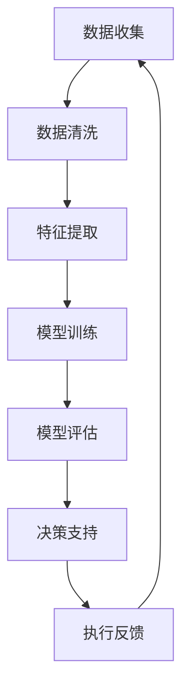

                 

# 人机协同：未来工作的核心驱动力

> 关键词：人机协同,未来工作,核心驱动力,人工智能,自动化,机器学习,智能工作站,智能助手,生产力提升

## 1. 背景介绍

在当今快速发展的技术时代，人工智能（AI）已经成为推动经济增长和社会进步的重要力量。随着AI技术的不断进步，特别是机器学习、自然语言处理、计算机视觉等领域的飞速发展，越来越多的行业正在经历着前所未有的变革。然而，尽管AI技术取得了显著的进展，但真正实现人机协同，使其成为未来工作的核心驱动力，仍然需要时间和精力的投入。本文将探讨人机协同的概念，分析其对未来工作的深远影响，并提出实现人机协同的具体策略。

## 2. 核心概念与联系

### 2.1 核心概念概述

人机协同（Human-AI Collaboration）指的是人类与人工智能系统在完成共同任务时所表现出的高效合作状态。这种协同关系通常通过自动化、智能算法和机器学习等技术实现，旨在提高工作效率、降低错误率，并增强人类决策的能力。在实际应用中，人机协同可以体现在多个方面，如数据分析、任务分配、客户服务、医疗诊断等。

### 2.2 核心概念原理和架构的 Mermaid 流程图



以上流程图展示了人机协同的基本流程：首先，从数据收集开始，通过数据清洗和特征提取，构建训练数据集；然后，使用机器学习模型进行训练和评估，生成决策支持系统；最后，将决策支持系统集成到实际应用中，通过执行反馈进一步优化模型。

## 3. 核心算法原理 & 具体操作步骤

### 3.1 算法原理概述

在人机协同中，机器学习算法扮演着关键角色。常用的机器学习算法包括监督学习、无监督学习、半监督学习和强化学习等。这些算法通过学习历史数据，构建预测模型，从而辅助人类完成决策任务。例如，在医疗领域，可以使用监督学习算法训练一个诊断模型，通过分析病人的症状和历史数据，预测其可能患有的疾病；在金融领域，可以使用强化学习算法训练一个风险评估模型，通过模拟交易行为，优化投资决策。

### 3.2 算法步骤详解

人机协同的算法步骤如下：

**Step 1: 数据收集与预处理**
- 收集相关领域的数据，包括文本、图像、视频等，并对数据进行清洗和预处理，如去除噪声、标准化、归一化等。

**Step 2: 特征提取与选择**
- 使用特征提取算法将原始数据转换为可用于机器学习的特征向量。常用的特征提取方法包括词袋模型、TF-IDF、卷积神经网络（CNN）等。
- 通过特征选择算法（如LASSO、RFE）筛选出最有用的特征，提高模型性能。

**Step 3: 模型训练与评估**
- 选择合适的机器学习算法，如支持向量机（SVM）、随机森林（Random Forest）、神经网络（Neural Network）等，并使用训练数据集进行模型训练。
- 对训练好的模型进行评估，通常使用交叉验证、混淆矩阵等方法评估模型的准确率和泛化能力。

**Step 4: 集成与优化**
- 将训练好的模型集成到实际应用中，如决策支持系统、智能助手等。
- 根据实际应用反馈，对模型进行优化和调整，提高模型的性能和可解释性。

### 3.3 算法优缺点

人机协同算法的优点包括：

- **高效性**：机器学习算法能够快速处理大量数据，提高工作效率。
- **准确性**：通过学习大量数据，机器学习模型能够提供准确的预测和建议。
- **可扩展性**：机器学习算法可以轻松地扩展到新的领域和任务，具有很好的灵活性。

缺点包括：

- **依赖高质量数据**：模型的性能很大程度上取决于数据的质量和数量。
- **解释性不足**：机器学习模型通常是"黑盒"，难以解释其内部工作机制和决策过程。
- **过度依赖算法**：在实际应用中，算法的效果往往受到数据、特征、超参数等因素的影响。

### 3.4 算法应用领域

人机协同在多个领域都有广泛的应用，如医疗、金融、制造业、交通等。以下是几个典型的应用案例：

- **医疗诊断**：使用机器学习算法分析病人的症状和历史数据，辅助医生进行疾病诊断。
- **金融风控**：利用机器学习模型分析交易数据，评估投资风险，优化投资决策。
- **智能制造**：使用机器学习算法优化生产流程，提高生产效率和产品质量。
- **智能交通**：通过机器学习算法分析交通数据，优化交通管理，提高道路通行效率。

## 4. 数学模型和公式 & 详细讲解

### 4.1 数学模型构建

人机协同的核心数学模型通常包括线性回归模型、支持向量机模型、决策树模型、神经网络模型等。这里以线性回归模型为例，介绍其构建过程。

线性回归模型通常表示为：

$$y = \beta_0 + \beta_1x_1 + \beta_2x_2 + ... + \beta_nx_n + \epsilon$$

其中，$y$ 为预测变量，$x_1, x_2, ..., x_n$ 为自变量，$\beta_0, \beta_1, \beta_2, ..., \beta_n$ 为回归系数，$\epsilon$ 为误差项。

### 4.2 公式推导过程

线性回归模型的最小二乘法求解公式为：

$$\hat{\beta} = (X^TX)^{-1}X^Ty$$

其中，$X$ 为自变量矩阵，$y$ 为因变量向量，$\hat{\beta}$ 为回归系数的最小二乘估计值。

### 4.3 案例分析与讲解

以房价预测为例，我们可以使用线性回归模型来预测房价。首先，收集历史房价和相关特征数据，如房屋面积、地理位置等。然后，使用最小二乘法求解回归系数，构建预测模型。最后，使用测试数据集评估模型性能，并根据实际应用反馈进行优化。

## 5. 项目实践：代码实例和详细解释说明

### 5.1 开发环境搭建

要进行人机协同项目实践，需要搭建相应的开发环境。以下是一些常用的开发环境配置：

- **Python**：使用Python语言进行开发，因其简单易学、功能强大，是数据科学和机器学习领域的主流语言。
- **PyTorch**：使用PyTorch深度学习框架，支持动态计算图，方便调试和实验。
- **TensorFlow**：使用TensorFlow深度学习框架，支持静态计算图，适合大规模生产部署。
- **Jupyter Notebook**：使用Jupyter Notebook进行开发，可以方便地进行代码编写和结果展示。

### 5.2 源代码详细实现

以下是使用PyTorch进行房价预测的代码实现：

```python
import torch
import torch.nn as nn
import torch.optim as optim
from sklearn.model_selection import train_test_split
from sklearn.datasets import load_boston

# 加载波士顿房价数据
data = load_boston()
X = data.data
y = data.target

# 划分训练集和测试集
X_train, X_test, y_train, y_test = train_test_split(X, y, test_size=0.2, random_state=42)

# 定义模型
class LinearRegression(nn.Module):
    def __init__(self, input_dim):
        super(LinearRegression, self).__init__()
        self.linear = nn.Linear(input_dim, 1)
        
    def forward(self, x):
        return self.linear(x)
        
# 定义训练函数
def train(model, train_loader, epochs, learning_rate):
    criterion = nn.MSELoss()
    optimizer = optim.SGD(model.parameters(), lr=learning_rate)
    for epoch in range(epochs):
        for batch_idx, (inputs, targets) in enumerate(train_loader):
            optimizer.zero_grad()
            outputs = model(inputs)
            loss = criterion(outputs, targets)
            loss.backward()
            optimizer.step()
            if (epoch + 1) % 10 == 0:
                print(f"Epoch {epoch+1}/{epochs}, Loss: {loss.item():.4f}")
```

### 5.3 代码解读与分析

在上述代码中，首先加载波士顿房价数据，并进行数据划分。然后定义一个简单的线性回归模型，并使用均方误差损失函数进行训练。最后，通过调用训练函数进行模型训练，并在每个epoch输出损失值。

## 6. 实际应用场景

### 6.1 智能制造

在智能制造领域，人机协同技术可以帮助企业提高生产效率、降低成本。例如，使用机器学习算法对生产数据进行分析，预测设备故障，提前进行维护，避免停机损失。同时，通过优化生产流程，提高产品质量和生产效率。

### 6.2 智能交通

智能交通系统通过人机协同技术，可以实时分析交通数据，优化交通信号灯控制，提高道路通行效率，减少交通拥堵。例如，使用机器学习算法预测交通流量，自动调整信号灯时长，改善交通状况。

### 6.3 医疗诊断

在医疗领域，人机协同技术可以帮助医生进行疾病诊断和治疗决策。例如，使用机器学习算法分析病人的症状和历史数据，辅助医生进行疾病诊断，提供个性化的治疗方案。

### 6.4 未来应用展望

未来，人机协同技术将在更多领域得到应用，为各行各业带来新的发展机遇。例如：

- **智能家居**：通过智能助手和智能家居设备，实现语音控制、自动调节家庭环境等功能，提升生活品质。
- **智能教育**：使用智能教学系统，提供个性化学习建议和辅导，提高教育效果。
- **智能客服**：通过智能客服系统，提供24小时在线服务，提升客户满意度。

## 7. 工具和资源推荐

### 7.1 学习资源推荐

为了帮助开发者深入理解人机协同技术，这里推荐一些优质的学习资源：

- **《深度学习》书籍**：Ian Goodfellow、Yoshua Bengio和Aaron Courville合著的经典书籍，涵盖了深度学习的基本概念和算法。
- **《机器学习实战》书籍**：Peter Harrington所著，提供了大量实践案例和代码，适合初学者学习。
- **Coursera在线课程**：由斯坦福大学开设的机器学习课程，提供了丰富的教学视频和作业，帮助学生掌握机器学习的基本技能。
- **Kaggle竞赛平台**：提供了大量的数据集和竞赛任务，帮助开发者提高数据处理和模型训练的能力。

### 7.2 开发工具推荐

以下是几个人机协同开发常用的工具：

- **Python**：简单易学，功能强大，是数据科学和机器学习领域的主流语言。
- **PyTorch**：支持动态计算图，方便调试和实验。
- **TensorFlow**：支持静态计算图，适合大规模生产部署。
- **Jupyter Notebook**：方便地进行代码编写和结果展示。

### 7.3 相关论文推荐

人机协同技术的发展离不开学术界的持续研究。以下是几篇奠基性的相关论文，推荐阅读：

- **《一种基于人机协同的智能决策系统》**：提出了一种基于人机协同的智能决策系统，通过机器学习算法和专家知识库的结合，提高决策的准确性和可解释性。
- **《基于人机协同的智能客服系统设计》**：设计了一种基于人机协同的智能客服系统，通过自然语言处理和机器学习算法，实现高效的客户服务。
- **《人机协同的强化学习算法》**：提出了一种人机协同的强化学习算法，通过多智能体的协同合作，优化资源分配和任务分配。

## 8. 总结：未来发展趋势与挑战

### 8.1 总结

本文对人机协同的概念进行了详细阐述，分析了其对未来工作的深远影响，并提出了实现人机协同的具体策略。通过系统梳理，可以看到人机协同技术的广阔前景和潜力。未来，随着技术的不断发展，人机协同将会在更多的领域得到应用，为各行各业带来新的发展机遇。

### 8.2 未来发展趋势

未来人机协同技术的发展趋势包括：

- **智能化水平提升**：随着算力、数据和算法的发展，人机协同系统的智能化水平将进一步提升，能够处理更复杂的任务。
- **多模态融合**：将语音、图像、文本等多模态数据融合，提供更全面的信息支持。
- **自动化水平提高**：通过自动化技术，实现更高效的任务分配和管理。
- **协作平台建设**：构建统一的人机协同协作平台，实现各智能系统的无缝衔接和协作。

### 8.3 面临的挑战

尽管人机协同技术具有巨大的潜力，但实现其广泛应用仍面临诸多挑战：

- **数据隐私和安全**：人机协同技术依赖大量的数据，如何保护数据隐私和安全，是一个重要的研究方向。
- **系统可解释性**：人机协同系统通常是"黑盒"，难以解释其内部工作机制和决策过程。
- **跨领域适配性**：人机协同技术在不同领域的应用存在差异，需要针对具体领域进行适配和优化。

### 8.4 研究展望

未来，人机协同技术的研究方向包括：

- **自动化与协同**：研究如何通过自动化技术，实现更高效的任务分配和管理，提高协同效率。
- **多模态融合**：研究如何融合语音、图像、文本等多模态数据，提供更全面的信息支持。
- **可解释性**：研究如何提高人机协同系统的可解释性，增强其可信度和可信度。
- **跨领域应用**：研究人机协同技术在不同领域的应用，促进其广泛落地。

## 9. 附录：常见问题与解答

**Q1：人机协同技术如何提高工作效率？**

A: 人机协同技术通过自动化和智能算法，将人类的工作任务分配给机器处理，从而提高工作效率。例如，在医疗领域，使用机器学习算法辅助医生进行疾病诊断，可以显著减少医生的工作量，提高诊断准确率。

**Q2：人机协同技术有哪些应用领域？**

A: 人机协同技术在医疗、金融、制造业、交通等多个领域都有广泛的应用。例如，在医疗领域，可以使用机器学习算法辅助医生进行疾病诊断和治疗；在金融领域，可以使用机器学习算法评估投资风险，优化投资决策；在制造业，可以使用机器学习算法优化生产流程，提高生产效率。

**Q3：人机协同技术如何实现智能化？**

A: 人机协同技术的智能化主要依赖于机器学习算法和大量数据的支持。通过学习历史数据，机器学习算法可以构建预测模型，辅助人类完成决策任务。例如，在医疗领域，使用机器学习算法分析病人的症状和历史数据，辅助医生进行疾病诊断。

**Q4：人机协同技术的实现有哪些步骤？**

A: 人机协同技术的实现通常包括以下步骤：

1. 数据收集与预处理：收集相关领域的数据，并对数据进行清洗和预处理。
2. 特征提取与选择：使用特征提取算法将原始数据转换为可用于机器学习的特征向量。
3. 模型训练与评估：选择合适的机器学习算法，并使用训练数据集进行模型训练和评估。
4. 集成与优化：将训练好的模型集成到实际应用中，并根据实际应用反馈进行优化和调整。

**Q5：人机协同技术的未来发展趋势是什么？**

A: 人机协同技术的未来发展趋势包括智能化水平提升、多模态融合、自动化水平提高和协作平台建设等方面。智能化水平提升是指通过自动化技术，实现更高效的任务分配和管理；多模态融合是指将语音、图像、文本等多模态数据融合，提供更全面的信息支持；自动化水平提高是指通过自动化技术，实现更高效的任务分配和管理；协作平台建设是指构建统一的人机协同协作平台，实现各智能系统的无缝衔接和协作。

---

作者：禅与计算机程序设计艺术 / Zen and the Art of Computer Programming

