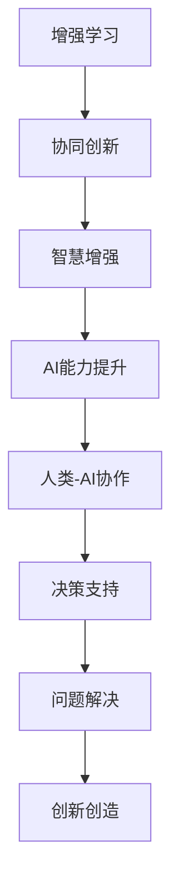

                 

# 人类-AI协作：增强人类智慧与AI能力的协同创新

> 关键词：增强学习(Reinforcement Learning)，协同创新(Co-Creation)，人类-AI协作，智慧增强(Enhanced Human Wisdom)，AI能力提升(Capacity Enhancement of AI)

## 1. 背景介绍

### 1.1 问题由来
随着人工智能技术的飞速发展，AI已经从简单的自动化任务走向更加复杂的智能决策与创新。然而，尽管AI在技术上取得了显著进展，但人类智慧的深度和广度仍然是AI难以完全替代的。人类在艺术、伦理、情感、复杂情境处理等方面的优势，为AI提供了无法复制的价值。因此，人类-AI协作成为了当前技术发展的重要趋势，旨在通过融合两者的优势，共同提升智慧与能力。

### 1.2 问题核心关键点
人类-AI协作的核心在于充分利用AI的计算能力和数据处理能力，结合人类对复杂情境的理解与判断，实现智慧与能力的协同创新。具体体现在以下几个方面：

1. **增强学习**：AI通过强化学习等算法，从环境中不断试错学习，提升决策能力。
2. **协同创新**：AI与人类共同参与创新过程，融合多视角智慧，实现更高效、更创新的解决方案。
3. **智慧增强**：AI帮助人类扩展知识边界，提升认知能力，解决复杂问题。
4. **能力提升**：AI在执行重复性、高复杂度任务上表现优异，提升人类效率。
5. **伦理引导**：AI在决策过程中遵循伦理规范，避免偏见和歧视，促进公正性。

本文将围绕这些关键点，详细阐述人类-AI协作的原理、步骤、优势与挑战，以及未来的发展趋势和应用前景。

## 2. 核心概念与联系

### 2.1 核心概念概述

为更好地理解人类-AI协作，本节将介绍几个密切相关的核心概念：

- **增强学习(Reinforcement Learning, RL)**：一种机器学习方法，通过奖励与惩罚机制，使AI能够不断从环境中学习，提升决策能力。
- **协同创新(Co-Creation)**：涉及多方合作，共同创造新价值的过程，强调跨学科、跨领域的融合创新。
- **智慧增强(Enhanced Human Wisdom)**：利用AI技术扩展人类认知能力，解决复杂问题，提升决策水平。
- **AI能力提升(Capacity Enhancement of AI)**：通过人类智慧与数据的结合，提升AI在特定任务上的表现。
- **人类-AI协作**：融合人类智慧与AI技术，实现1+1>2的协同效应。

这些概念之间存在紧密的逻辑联系，通过它们可以构建一个完整的协作创新框架。以下是一个Mermaid流程图，展示了这些概念之间的联系：



### 2.2 核心概念原理和架构

增强学习是实现人类-AI协作的核心技术之一。其基本原理是通过试错学习，使AI不断优化决策策略，以最大化累积奖励。架构上，增强学习包括四个主要组件：环境、代理、状态、动作和奖励。

1. **环境(Environments)**：AI决策的外部世界，提供给AI学习的数据和信息。
2. **代理(Agents)**：AI模型，通过学习从环境中获取信息并做出决策。
3. **状态(States)**：环境的具体状态，AI决策的输入。
4. **动作(Actions)**：AI对环境的干预，决策的输出。
5. **奖励(Rewards)**：环境对AI决策的反馈，用于衡量决策的好坏。

增强学习的流程如下：

1. **环境感知**：AI接收环境信息，更新状态。
2. **决策生成**：AI根据当前状态生成动作。
3. **环境反馈**：环境对动作做出响应，更新状态并提供奖励。
4. **学习更新**：AI根据奖励和状态更新决策策略。

这种不断迭代的学习过程，使AI能够在复杂环境中逐步优化决策，提升智慧与能力。

## 3. 核心算法原理 & 具体操作步骤
### 3.1 算法原理概述

人类-AI协作的核心算法原理是基于增强学习的协同创新过程。其核心思想是通过AI与人类共同参与决策与创新，最大化地结合两者的优势，实现更高的智慧与能力协同。

具体来说，协同创新的过程可以描述为以下几个步骤：

1. **目标设定**：明确需要解决的问题或创造的价值，设定协同创新的目标。
2. **数据准备**：准备必要的数据和信息，为AI提供学习材料。
3. **AI训练**：使用增强学习等技术，训练AI模型，使其能够在特定环境中学习决策策略。
4. **人类参与**：人类与AI共同参与决策过程，提供反馈和指导。
5. **策略优化**：通过反馈不断调整AI策略，提升其决策能力。
6. **创新实现**：基于优化后的AI策略，实现具体的创新方案。

这种协同创新的过程，能够有效地结合人类智慧与AI技术的优势，实现更高的智慧与能力协同。

### 3.2 算法步骤详解

人类-AI协作的协同创新过程包括以下关键步骤：

**Step 1: 目标设定**
- 明确需要解决的问题或创造的价值，设定具体、可衡量的目标。
- 确定协作的范围和深度，确保AI能够理解和执行任务。

**Step 2: 数据准备**
- 收集和整理与问题相关的数据和信息，提供给AI进行学习。
- 对数据进行清洗、标注和预处理，确保数据质量。

**Step 3: AI训练**
- 选择合适的增强学习算法，如Q-Learning、SARSA等。
- 设计环境、状态、动作和奖励机制，定义AI的学习目标。
- 在训练环境中模拟AI与人类交互，通过试错不断优化决策策略。

**Step 4: 人类参与**
- 人类在AI决策过程中提供反馈，指出错误或不足。
- 人类与AI共同讨论决策方案，提供专业知识和经验。
- 人类评估AI的决策效果，提供奖励和惩罚。

**Step 5: 策略优化**
- 根据人类反馈，调整AI的决策策略，优化模型性能。
- 使用模型选择、超参数调优等技术，提高AI的决策能力。
- 不断迭代，直至AI能够高效、准确地解决问题。

**Step 6: 创新实现**
- 基于优化后的AI策略，实现具体的创新方案。
- 评估创新效果，优化并迭代，直至达到预期目标。

### 3.3 算法优缺点

人类-AI协作的协同创新过程具有以下优点：

1. **高效决策**：通过AI的高效计算和数据处理能力，快速解决复杂问题。
2. **深度融合**：结合人类智慧与AI技术，实现1+1>2的协同效应。
3. **创新能力**：AI在执行重复性、高复杂度任务上表现优异，提升人类创新效率。
4. **伦理保证**：AI在决策过程中遵循伦理规范，避免偏见和歧视，促进公正性。

同时，该方法也存在一定的局限性：

1. **数据依赖**：AI需要大量高质量数据进行训练，数据准备和标注成本较高。
2. **复杂度管理**：在复杂情境下，AI与人类协作的难度增加，需要高效的沟通和协调机制。
3. **知识局限**：AI在处理抽象、伦理等人类特有的情境时，仍需依赖人类智慧。
4. **技术瓶颈**：增强学习等算法的复杂度较高，需要强大的计算资源和算法优化。

尽管存在这些局限性，但人类-AI协作的协同创新方法，仍然是当前最有效、最先进的创新范式之一。未来相关研究的重点在于如何进一步降低数据依赖，提高知识整合能力和算法效率，同时兼顾可解释性和伦理安全性等因素。

### 3.4 算法应用领域

人类-AI协作的协同创新方法在多个领域得到了广泛应用，例如：

- **医疗健康**：AI辅助诊断、个性化治疗方案、医疗知识库构建等。
- **金融服务**：智能投顾、风险评估、市场预测等。
- **教育培训**：个性化学习方案、智能评估、在线教育内容生成等。
- **智能制造**：自动化生产、质量控制、供应链优化等。
- **艺术创作**：音乐、绘画、设计等领域的创意辅助和生成。

此外，在城市管理、环境保护、社会治理等众多领域，人类-AI协作的协同创新方法也在不断探索和实践中，为各行各业带来新的突破。

## 4. 数学模型和公式 & 详细讲解 & 举例说明

### 4.1 数学模型构建

增强学习的核心数学模型是Markov Decision Process (MDP)，用于描述AI在环境中学习和决策的过程。MDP包括状态集合、动作集合、转移概率、奖励函数等要素。

设MDP为$M=(\mathcal{S},\mathcal{A},\mathcal{P},r,\gamma)$，其中：
- $\mathcal{S}$为状态集合，$\mathcal{A}$为动作集合。
- $\mathcal{P}(s'|s,a)$为转移概率，表示在状态$s$下，执行动作$a$后，到达状态$s'$的概率。
- $r(s,a,s')$为奖励函数，表示在状态$s$下，执行动作$a$后，到达状态$s'$所获得的奖励。
- $\gamma$为折扣因子，用于计算未来奖励的权重。

增强学习的目标是最小化累计奖励的期望值：

$$
J_{\pi}(s_0) = \mathop{\arg\min}_{\pi} \mathbb{E}_{\pi} \left[\sum_{t=0}^{\infty} \gamma^t r(s_t,a_t,s_{t+1})\right]
$$

其中$\pi$为决策策略，$\mathbb{E}_{\pi}$表示在策略$\pi$下，期望的奖励和。

### 4.2 公式推导过程

增强学习的核心是Q值函数的优化。Q值函数表示在状态$s$下，执行动作$a$后的期望奖励，即：

$$
Q^{\pi}(s,a) = \mathbb{E}_{\pi} \left[\sum_{t=0}^{\infty} \gamma^t r(s_t,a_t,s_{t+1})\right]
$$

通过Q值函数的优化，可以找到最优的决策策略$\pi$。具体推导过程如下：

1. **贝尔曼方程**：
   $$
   Q^{\pi}(s,a) = r(s,a) + \gamma \sum_{s'} \mathcal{P}(s'|s,a) Q^{\pi}(s')
   $$
   $$
   Q^{\pi}(s) = \max_a Q^{\pi}(s,a)
   $$

2. **Q值函数的迭代更新**：
   $$
   Q^{\pi}(s,a) \leftarrow Q^{\pi}(s,a) + \alpha [r(s,a) + \gamma \max_{a'} Q^{\pi}(s',a') - Q^{\pi}(s,a)]
   $$

其中，$\alpha$为学习率。

### 4.3 案例分析与讲解

以下是一个简单的增强学习案例：智能投顾系统。

**目标**：构建一个能够根据用户财务状况、投资偏好等因素，提供个性化投资建议的系统。

**数据准备**：收集用户的基本信息、财务数据、投资偏好等，作为训练数据。

**AI训练**：使用Q-Learning算法，训练AI模型，使其能够根据用户数据，预测投资回报。

**人类参与**：人类专家在AI做出投资建议时，提供反馈，指出错误或不合理的决策。

**策略优化**：根据人类反馈，调整AI模型的决策策略，优化预测精度。

**创新实现**：基于优化后的AI模型，生成具体的投资建议，供用户参考。

在这个案例中，通过人类-AI协作的协同创新过程，AI不仅能够高效地处理大量数据，还能结合人类专家的智慧，提供更加精准、合理的投资建议。

## 5. 项目实践：代码实例和详细解释说明
### 5.1 开发环境搭建

在进行协同创新实践前，我们需要准备好开发环境。以下是使用Python进行Reinforcement Learning开发的环境配置流程：

1. 安装Anaconda：从官网下载并安装Anaconda，用于创建独立的Python环境。

2. 创建并激活虚拟环境：
```bash
conda create -n rl-env python=3.8 
conda activate rl-env
```

3. 安装相关库：
```bash
pip install gym gym[atari] numpy scipy matplotlib scikit-learn 
```

4. 安装增强学习库：
```bash
pip install stable-baselines3
```

完成上述步骤后，即可在`rl-env`环境中开始协同创新实践。

### 5.2 源代码详细实现

下面我们以智能投顾系统为例，给出使用Stable Baselines3库对AI进行增强学习训练的PyTorch代码实现。

首先，定义智能投顾的环境：

```python
import gym
from stable_baselines3 import A2C
from stable_baselines3.common.vec_env import VecEnv
from stable_baselines3.common.policies import MlpPolicy

env = VecEnv(lambda: gym.make('gym_finance:multi_arms_v1'))
```

然后，定义强化学习模型的策略：

```python
policy = MlpPolicy(env.observation_space, env.action_space, seed=0)
model = A2C(policy, env)
```

接着，定义训练参数和过程：

```python
training_params = {
    'num_timesteps': 1000000,  # 训练轮数
    'learning_rate': 0.001,
    'checkpoint_interval': 1000,
    'seed': 0
}

model.learn(total_timesteps=training_params['num_timesteps'], verbose=1)
```

最后，使用训练好的模型进行预测和创新：

```python
policy.eval()

def predict(rewards, env):
    obs = env.reset()
    done = False
    total_reward = 0
    while not done:
        action, _states, info = policy.predict(obs)
        obs, reward, done, _ = env.step(action)
        total_reward += reward
    return total_reward

investment_reward = predict(investment_data, env)
```

以上就是使用Stable Baselines3进行智能投顾系统协同创新的完整代码实现。可以看到，通过简单的Python代码，我们即可构建一个基于增强学习的智能投顾系统。

### 5.3 代码解读与分析

让我们再详细解读一下关键代码的实现细节：

**gym_finance环境**：
- 通过gym库创建了一个多臂赌博机环境，用于模拟用户投资过程。
- 环境的状态为用户的投资状态，动作为可能的投资决策。
- 通过VecEnv封装，支持并行训练。

**A2C模型**：
- 使用A2C算法作为基础模型，A2C是一种异步优化算法，适用于并行化训练。
- 模型策略采用MlpPolicy，即多层感知器策略。
- 模型训练参数包括训练轮数、学习率、检查点间隔等。

**学习过程**：
- 使用`learn`方法进行模型训练，总训练轮数为1000000次，每1000次记录一次模型权重。
- 训练过程中，模型自动保存权重，方便后续使用。

**预测与创新**：
- 模型评估后，使用`predict`方法进行预测，接收投资数据和环境实例，返回预测回报。
- 投资回报通过迭代模拟计算得出，模拟用户投资过程。

通过以上代码，我们实现了一个基于增强学习的智能投顾系统。该系统能够在用户投资数据上学习决策策略，结合人类专家的反馈，生成具体的投资建议，提升投资决策的精度和效率。

## 6. 实际应用场景
### 6.1 智能客服系统

基于人类-AI协作的智能客服系统，能够高效处理客户咨询，提升客户满意度。通过增强学习技术，系统能够从历史对话中学习决策策略，优化对话流程。

在实际应用中，智能客服系统可以通过收集历史客服数据，训练增强学习模型。系统在接收到客户咨询后，自动分析对话内容，生成合适的回复。在回复生成过程中，系统可以结合人类专家的反馈，调整模型的回复策略，确保回复内容符合客户需求。

### 6.2 智能制造系统

在智能制造领域，人类-AI协作的协同创新方法可以用于优化生产流程、提高产品质量。通过增强学习技术，系统能够实时监控生产数据，调整生产参数，提升生产效率。

在实际应用中，智能制造系统可以通过收集生产数据，训练增强学习模型。系统在实时监控生产过程中，自动调整生产参数，优化生产流程。在参数调整过程中，系统可以结合工程师的反馈，优化决策策略，确保生产过程的高效和稳定。

### 6.3 智慧城市治理

在智慧城市治理中，人类-AI协作的协同创新方法可以用于城市事件监测、交通管理、公共安全等领域。通过增强学习技术，系统能够实时监测城市数据，优化城市管理。

在实际应用中，智慧城市系统可以通过收集城市数据，训练增强学习模型。系统在实时监测城市事件时，自动调整管理策略，优化城市资源配置。在策略调整过程中，系统可以结合城市管理者的反馈，优化决策策略，确保城市管理的智能化和高效化。

### 6.4 未来应用展望

随着增强学习等技术的不断发展，人类-AI协作的协同创新方法将在更多领域得到应用，为各行各业带来变革性影响。

在智慧健康领域，基于协同创新的医疗系统可以用于个性化治疗方案、病历分析等，提升医疗服务的智能化水平。

在智能教育领域，基于协同创新的教育系统可以用于个性化学习方案、智能评估等，促进教育公平，提高教学质量。

在智能交通领域，基于协同创新的交通系统可以用于交通流量优化、自动驾驶等，提升交通系统的智能化和安全性。

总之，人类-AI协作的协同创新方法，将在各个垂直行业大放异彩，为社会带来深远的变革。

## 7. 工具和资源推荐
### 7.1 学习资源推荐

为了帮助开发者系统掌握人类-AI协作的原理和实践技巧，这里推荐一些优质的学习资源：

1. 《强化学习：原理与实践》书籍：深入浅出地介绍了增强学习的原理和实践方法，是学习增强学习的经典教材。

2. 《协同创新：构建未来合作生态》课程：探讨了协同创新的理论基础和实际应用，适合从事协同创新项目的开发者学习。

3. 《深度学习与人类-AI协作》讲座：邀请深度学习专家分享其在人类-AI协作中的应用经验，涵盖医疗、金融、教育等多个领域。

4. 《智能投顾系统》论文：详细介绍了智能投顾系统的设计思路和增强学习算法，具有很高的学术和实践价值。

5. 《协同创新框架》白皮书：介绍了协同创新的整体框架和应用案例，适合对协同创新感兴趣的开发者阅读。

通过对这些资源的学习实践，相信你一定能够快速掌握人类-AI协作的精髓，并用于解决实际的协同创新问题。

### 7.2 开发工具推荐

高效的开发离不开优秀的工具支持。以下是几款用于人类-AI协作开发常用的工具：

1. Anaconda：提供Python环境管理、包安装和项目协作功能，适合增强学习项目开发。

2. PyTorch：基于Python的开源深度学习框架，灵活动态的计算图，适合增强学习模型的训练和推理。

3. Stable Baselines3：基于PyTorch的增强学习库，提供了丰富的模型和算法，适合快速开发和测试增强学习系统。

4. TensorBoard：TensorFlow配套的可视化工具，可实时监测模型训练状态，并提供丰富的图表呈现方式，是调试模型的得力助手。

5. Weights & Biases：模型训练的实验跟踪工具，可以记录和可视化模型训练过程中的各项指标，方便对比和调优。

6. Jupyter Notebook：交互式编程环境，适合快速编写和测试增强学习算法。

合理利用这些工具，可以显著提升人类-AI协作任务的开发效率，加快创新迭代的步伐。

### 7.3 相关论文推荐

人类-AI协作的协同创新方法近年来得到了广泛的研究，以下是几篇奠基性的相关论文，推荐阅读：

1. Learning to Optimize (L2O)：提出通过学习优化器来提升模型的泛化能力，是协同创新领域的经典工作。

2. Evolved Strategies (ES)：引入进化算法优化增强学习模型，提高模型在大规模数据上的性能。

3. Generative Adversarial Networks (GANs)：提出生成对抗网络，用于生成高质度的图像、音频等数据，促进AI与人类创意的协同创新。

4. Co-Creation with AI：探讨了人类与AI协作创新的理论基础和实际应用，提供了协同创新框架。

5. Human-AI Collaboration in AI System Design：详细介绍了人类-AI协作在AI系统设计中的应用案例，具有很高的实际价值。

这些论文代表了大语言模型微调技术的发展脉络。通过学习这些前沿成果，可以帮助研究者把握学科前进方向，激发更多的创新灵感。

## 8. 总结：未来发展趋势与挑战

### 8.1 总结

本文对基于增强学习的协同创新方法进行了全面系统的介绍。首先阐述了人类-AI协作的协同创新过程，明确了增强学习在融合人类智慧与AI能力方面的独特价值。其次，从原理到实践，详细讲解了增强学习模型的构建、训练和优化，给出了人类-AI协作的完整代码实例。同时，本文还广泛探讨了增强学习在智能客服、智能制造、智慧城市等多个行业领域的应用前景，展示了协同创新方法的巨大潜力。此外，本文精选了协同创新的各类学习资源，力求为读者提供全方位的技术指引。

通过本文的系统梳理，可以看到，基于增强学习的协同创新方法正在成为当前技术发展的重要趋势，极大地拓展了AI在智慧与能力方面的应用边界，催生了更多的落地场景。随着增强学习等技术的不断发展，基于协同创新的智慧与能力提升必将在各个垂直行业大放异彩，深刻影响人类的生产生活方式。

### 8.2 未来发展趋势

展望未来，增强学习等技术的持续发展将带来协同创新方法的诸多趋势：

1. **技术融合**：增强学习与深度学习、强化学习、演化算法等技术融合，提升模型的智慧与能力。
2. **跨领域应用**：协同创新方法将在更多领域得到应用，如金融、医疗、教育、城市治理等。
3. **自适应学习**：增强学习模型能够实时调整决策策略，适应环境变化，提升智慧与能力的灵活性。
4. **多模态协同**：增强学习模型能够融合视觉、语音、文本等多模态数据，提升决策的全面性和准确性。
5. **知识驱动**：增强学习模型能够与外部知识库、规则库等专家知识结合，提升决策的全面性和合理性。
6. **伦理规范**：增强学习模型在决策过程中遵循伦理规范，避免偏见和歧视，促进公正性。

以上趋势凸显了增强学习等技术的广阔前景。这些方向的探索发展，必将进一步提升协同创新的性能和应用范围，为人类认知智能的进化带来深远影响。

### 8.3 面临的挑战

尽管增强学习等技术已经取得了显著进展，但在迈向更加智能化、普适化应用的过程中，仍面临诸多挑战：

1. **数据依赖**：增强学习模型需要大量高质量数据进行训练，数据准备和标注成本较高。
2. **复杂度管理**：在复杂情境下，增强学习模型与人类协作的难度增加，需要高效的沟通和协调机制。
3. **知识局限**：增强学习模型在处理抽象、伦理等人类特有的情境时，仍需依赖人类智慧。
4. **技术瓶颈**：增强学习等算法的复杂度较高，需要强大的计算资源和算法优化。
5. **可解释性不足**：增强学习模型的决策过程缺乏可解释性，难以对其推理逻辑进行分析和调试。
6. **安全性有待保障**：增强学习模型可能学习到有害的信息，通过决策过程传递到下游任务，造成安全隐患。

正视这些挑战，积极应对并寻求突破，将使协同创新方法走向成熟。相信随着学界和产业界的共同努力，增强学习等技术将不断进步，协同创新方法将在构建安全、可靠、可解释、可控的智能系统中扮演越来越重要的角色。

### 8.4 研究展望

面对增强学习等技术面临的挑战，未来的研究需要在以下几个方面寻求新的突破：

1. **降低数据依赖**：探索无监督和半监督增强学习方法，利用自监督学习、主动学习等技术，最大限度利用非结构化数据，实现更加灵活高效的协同创新。
2. **提高知识整合能力**：将符号化的先验知识，如知识图谱、逻辑规则等，与增强学习模型进行巧妙融合，引导协同创新过程学习更准确、合理的决策策略。
3. **增强可解释性**：引入因果分析方法，增强模型决策的因果性和逻辑性，提高决策的可解释性。
4. **强化安全性**：在增强学习模型中引入伦理导向的评估指标，过滤和惩罚有害的输出倾向，确保决策的安全性和公正性。
5. **提升效率**：优化增强学习模型的计算图，减少前向传播和反向传播的资源消耗，实现更加轻量级、实时性的部署。

这些研究方向的探索，必将引领增强学习等技术迈向更高的台阶，为构建安全、可靠、可解释、可控的智能系统铺平道路。面向未来，增强学习等技术还需要与其他人工智能技术进行更深入的融合，如知识表示、因果推理、强化学习等，多路径协同发力，共同推动人类-AI协作的智慧与能力提升。只有勇于创新、敢于突破，才能不断拓展增强学习等技术的边界，让智能技术更好地造福人类社会。

## 9. 附录：常见问题与解答

**Q1：增强学习与传统机器学习有哪些不同？**

A: 增强学习与传统机器学习的主要区别在于，增强学习通过与环境的交互，不断优化决策策略，而传统机器学习则是在静态数据集上，直接优化目标函数。增强学习的目标是通过试错学习，提升模型的智慧与能力，适用于需要动态决策的复杂情境。

**Q2：增强学习算法复杂度较高，如何优化计算效率？**

A: 增强学习算法的计算复杂度较高，可以通过优化计算图、使用并行计算、进行模型压缩等方式提高计算效率。同时，引入演化算法、神经网络等技术，也可以提升算法的效率和鲁棒性。

**Q3：增强学习在处理人类情感、伦理等问题时，如何结合人类智慧？**

A: 增强学习模型在处理人类情感、伦理等问题时，可以结合人类专家的反馈和指导，通过人工干预和监督，提升决策的全面性和合理性。同时，引入因果分析、伦理导向等评估指标，确保决策的安全性和公正性。

**Q4：增强学习在实际应用中如何避免灾难性遗忘？**

A: 增强学习模型在实际应用中，可以通过知识注入、多任务学习等方法，避免灾难性遗忘。知识注入可以引入先验知识库，增强模型的泛化能力；多任务学习可以同时训练多个相关任务，提升模型的稳定性。

**Q5：增强学习如何实现大规模协同创新？**

A: 增强学习可以通过分布式训练、异步优化等技术，实现大规模协同创新。分布式训练可以加速模型的训练过程，提升模型的智慧与能力；异步优化可以高效利用计算资源，提高模型的计算效率。

这些问题的解答，体现了增强学习在实际应用中的挑战和解决方案，有助于开发者更好地理解和应用增强学习技术。

---

作者：禅与计算机程序设计艺术 / Zen and the Art of Computer Programming

