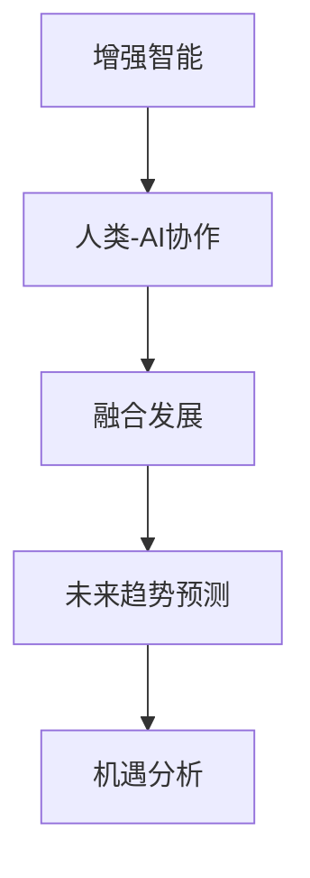

                 

# 人类-AI协作：增强人类智慧与AI能力的融合发展趋势预测分析机遇

> 关键词：人工智能(AI)、增强智能(Enhanced Intelligence)、人类-AI协作、融合发展、未来趋势预测、机遇分析

## 1. 背景介绍

随着科技的迅猛发展，人工智能（AI）已经成为推动社会进步的重要力量。AI在各个领域的应用，从医疗、金融、教育到工业、农业，无所不包。然而，AI并非独立于人类智慧的存在，而是在人类智慧的指导下，不断学习和优化。人类-AI协作的模式，正是AI在现实世界中发挥最大效能的关键。

### 1.1 问题由来

在当前信息爆炸的时代，人类面临海量数据和复杂问题的挑战。AI凭借其强大的处理能力，成为了解决这些问题的有力工具。但是，AI并非万能，它的决策和预测往往依赖于训练数据的质量和算法的科学性。人类智慧和经验的引入，能够帮助AI更好地理解现实世界的复杂性，从而做出更为精准和合理的决策。

### 1.2 问题核心关键点

人类-AI协作的核心在于，通过将人类智慧与AI能力有机结合，实现智能系统的优化和升级。具体来说，人类通过提供高质量的数据、清晰的问题定义、合理的评估标准和监督机制，来指导AI的学习和优化。AI则通过其强大的计算能力和模式识别能力，辅助人类解决复杂的决策和问题。这种协作不仅能够提升AI系统的性能，还能够增强人类的工作效能和决策质量。

## 2. 核心概念与联系

### 2.1 核心概念概述

为了更好地理解人类-AI协作的原理和机制，我们首先介绍几个关键概念：

- **增强智能(Enhanced Intelligence)**：指通过AI技术增强人类智慧的过程。增强智能不仅包括AI对人类智慧的提升，还包括AI与人类智慧的融合。

- **人类-AI协作**：指人类智慧与AI能力在特定任务上的协同工作模式。在协作中，人类扮演着任务定义者、数据提供者、监督者和评价者的角色，而AI则扮演着数据处理者、模式识别者、决策执行者的角色。

- **融合发展**：指人类智慧与AI能力的有机结合，形成更为智能化的系统。融合发展不仅涉及技术和算法层面的结合，还包括文化和制度层面的整合。

- **未来趋势预测**：指基于当前技术发展趋势，对未来AI与人类智慧融合发展可能的方向和形态进行的分析和预测。

- **机遇分析**：指对未来AI与人类智慧融合发展可能带来的机遇进行识别和评估。

这些概念之间的逻辑关系可以通过以下Mermaid流程图来展示：



这个流程图展示了增强智能、人类-AI协作、融合发展、未来趋势预测和机遇分析之间的内在联系。人类-AI协作是增强智能的核心，而融合发展和未来趋势预测是增强智能和机遇分析的前提。

## 3. 核心算法原理 & 具体操作步骤

### 3.1 算法原理概述

人类-AI协作的本质是一种有监督学习的过程。在这种过程中，人类通过提供高质量的标注数据和问题定义，指导AI系统进行学习。AI系统通过学习人类的知识，不断地优化和提升自己的性能，最终实现与人类智慧的融合。

具体来说，人类-AI协作的算法原理包括以下几个关键步骤：

1. **数据准备**：收集和准备高质量的标注数据，供AI系统进行学习。
2. **模型训练**：使用增强智能技术（如深度学习、强化学习、迁移学习等），训练AI模型。
3. **问题定义**：定义清晰、具体的问题，供AI系统进行解决。
4. **监督学习**：在人类的监督下，AI系统逐步优化和提升自己的性能，最终达到人类智慧的水平。
5. **评价和反馈**：对AI系统的输出进行评价，提供反馈，帮助AI系统不断改进。

### 3.2 算法步骤详解

以下是人类-AI协作的详细操作步骤：

**Step 1: 数据准备**
- **数据收集**：从多个渠道收集高质量的数据，如传感器数据、人类专家提供的标注数据、公开数据集等。
- **数据清洗**：对数据进行清洗和预处理，去除噪声和异常值，确保数据质量。
- **数据标注**：对数据进行标注，为AI系统提供监督信号。标注数据应尽可能准确、全面，避免遗漏和错误。

**Step 2: 模型训练**
- **选择模型**：根据任务类型和数据特点，选择适合的AI模型，如深度神经网络、强化学习算法等。
- **初始化模型**：将预训练模型或随机初始化的模型作为初始状态。
- **训练模型**：使用增强智能技术，对模型进行训练。训练过程中，应使用合适的损失函数和优化算法，避免过拟合。
- **模型评估**：在训练过程中，定期对模型进行评估，以确保模型性能的提升。评估指标应包括准确率、召回率、F1值等。

**Step 3: 问题定义**
- **任务描述**：清晰地描述要解决的问题，包括问题的背景、目标和预期结果。
- **规则制定**：制定问题解决的规则和策略，供AI系统参考。
- **数据格式**：定义数据输入和输出的格式，确保AI系统能够正确理解问题。

**Step 4: 监督学习**
- **数据输入**：将标注数据输入AI系统，供其进行学习和优化。
- **模型输出**：AI系统输出初步结果，供人类进行评价。
- **人类监督**：人类对AI系统的输出进行监督，提供反馈和指导。
- **模型调整**：根据人类反馈，调整AI系统的参数和策略，优化模型性能。

**Step 5: 评价和反馈**
- **结果评价**：对AI系统的输出进行评价，评估其准确性和合理性。
- **反馈机制**：建立反馈机制，确保人类能够及时发现问题并提出改进建议。
- **模型改进**：根据反馈，对AI系统进行改进，提升其性能和鲁棒性。

### 3.3 算法优缺点

人类-AI协作的算法具有以下优点：

1. **提高效率**：AI系统能够在短时间内处理大量数据，提升问题解决的效率。
2. **增强精度**：AI系统通过学习和优化，能够提升问题解决的精度。
3. **降低成本**：AI系统能够减少人力和时间成本，提升问题解决的性价比。
4. **提升效果**：AI系统能够将人类的经验和智慧融入决策过程，提升问题解决的效果。

同时，这种算法也存在一些缺点：

1. **依赖数据质量**：AI系统的性能高度依赖于训练数据的质量，数据噪声和错误会影响模型的性能。
2. **模型可解释性不足**：AI系统通常是“黑盒”模型，难以解释其内部决策过程，难以让人类理解和信任。
3. **安全和伦理问题**：AI系统的决策可能涉及隐私、安全、伦理等敏感问题，需要建立完善的监督和治理机制。
4. **依赖人类经验**：AI系统需要依赖人类的经验来定义问题和规则，人类经验的局限性可能影响AI系统的性能。

### 3.4 算法应用领域

人类-AI协作在多个领域得到了广泛应用，以下是几个典型的应用场景：

**医疗领域**：在医疗诊断中，AI系统能够辅助医生进行疾病诊断、治疗方案制定等。通过结合医生的经验和知识，AI系统能够提升诊断的准确性和效率。

**金融领域**：在金融风控和投资决策中，AI系统能够辅助分析师进行风险评估、市场预测等。通过结合人类的经验和知识，AI系统能够提升预测的准确性和效率。

**教育领域**：在教育中，AI系统能够辅助教师进行教学内容设计、学生学习评估等。通过结合教师的经验和知识，AI系统能够提升教学效果和学习效率。

**制造领域**：在制造中，AI系统能够辅助工程师进行设备维护、生产调度等。通过结合工程师的经验和知识，AI系统能够提升生产效率和产品质量。

## 4. 数学模型和公式 & 详细讲解 & 举例说明

### 4.1 数学模型构建

人类-AI协作的数学模型主要涉及数据准备、模型训练、问题定义和监督学习等几个关键环节。以下是这些环节的数学模型构建：

**数据准备**：
- **数据分布**：假设训练数据服从分布$p(x,y)$，其中$x$为输入特征，$y$为标签。
- **数据标注**：假设人类对每个数据点进行标注，标注结果服从分布$p(y|x)$。

**模型训练**：
- **损失函数**：假设模型输出为$f(x)$，真实标签为$y$。则损失函数为$L(f(x),y)=p(y|x)(f(x)-y)^2$。
- **优化算法**：假设优化算法为$\alpha$，则模型参数更新公式为$\theta_{t+1}=\theta_t-\alpha\nabla_{\theta}L(f(x),y)$。

**问题定义**：
- **问题描述**：假设问题描述为$d(x)$，问题空间为$\mathcal{P}$。则问题定义的数学模型为$\mathcal{P}=\{d(x)\}$。

**监督学习**：
- **监督信号**：假设监督信号为$s(y)$，监督信号空间为$\mathcal{S}$。则监督学习的数学模型为$\mathcal{S}=\{s(y)\}$。

### 4.2 公式推导过程

以下是人类-AI协作的数学模型构建和公式推导过程：

**数据准备**：
- **数据分布**：假设训练数据服从分布$p(x,y)$，其中$x$为输入特征，$y$为标签。则数据准备的目标是最大化似然$p(x,y)$。
- **数据标注**：假设人类对每个数据点进行标注，标注结果服从分布$p(y|x)$。则数据标注的目标是最大化标注数据的准确率。

**模型训练**：
- **损失函数**：假设模型输出为$f(x)$，真实标签为$y$。则损失函数为$L(f(x),y)=p(y|x)(f(x)-y)^2$。
- **优化算法**：假设优化算法为$\alpha$，则模型参数更新公式为$\theta_{t+1}=\theta_t-\alpha\nabla_{\theta}L(f(x),y)$。

**问题定义**：
- **问题描述**：假设问题描述为$d(x)$，问题空间为$\mathcal{P}$。则问题定义的数学模型为$\mathcal{P}=\{d(x)\}$。
- **规则制定**：假设规则集为$\mathcal{R}$，则问题定义的数学模型为$\mathcal{P}=\{d(x),\mathcal{R}\}$。

**监督学习**：
- **监督信号**：假设监督信号为$s(y)$，监督信号空间为$\mathcal{S}$。则监督学习的数学模型为$\mathcal{S}=\{s(y)\}$。
- **反馈机制**：假设反馈机制为$\mathcal{F}$，则监督学习的数学模型为$\mathcal{S}=\{s(y),\mathcal{F}\}$。

### 4.3 案例分析与讲解

**医疗诊断**：
- **数据准备**：收集患者的历史病历、症状描述、检查结果等数据，进行数据清洗和标注。
- **模型训练**：使用深度学习模型（如卷积神经网络、循环神经网络等）对标注数据进行训练，获得初步诊断模型。
- **问题定义**：明确诊断问题，如“某患者是否患有某种疾病？”。
- **监督学习**：将患者的新病历输入训练好的模型，获得初步诊断结果。医生根据诊断结果进行监督，调整模型参数，优化诊断模型。

**金融投资**：
- **数据准备**：收集历史股票数据、宏观经济数据、公司财报等数据，进行数据清洗和标注。
- **模型训练**：使用深度学习模型（如LSTM、GRU等）对标注数据进行训练，获得股票预测模型。
- **问题定义**：明确预测问题，如“某股票是否会上涨？”。
- **监督学习**：将新股票数据输入训练好的模型，获得股票预测结果。分析师根据预测结果进行监督，调整模型参数，优化预测模型。

## 5. 项目实践：代码实例和详细解释说明

### 5.1 开发环境搭建

在进行人类-AI协作的开发实践前，我们需要准备好开发环境。以下是使用Python进行PyTorch开发的环境配置流程：

1. 安装Anaconda：从官网下载并安装Anaconda，用于创建独立的Python环境。

2. 创建并激活虚拟环境：
```bash
conda create -n ai-env python=3.8 
conda activate ai-env
```

3. 安装PyTorch：根据CUDA版本，从官网获取对应的安装命令。例如：
```bash
conda install pytorch torchvision torchaudio cudatoolkit=11.1 -c pytorch -c conda-forge
```

4. 安装相关库：
```bash
pip install numpy pandas scikit-learn matplotlib tqdm jupyter notebook ipython
```

完成上述步骤后，即可在`ai-env`环境中开始项目实践。

### 5.2 源代码详细实现

这里以医疗诊断为例，给出使用PyTorch进行人类-AI协作的Python代码实现。

首先，定义数据处理函数：

```python
from torch.utils.data import Dataset
import torch

class MedicalDataset(Dataset):
    def __init__(self, texts, labels, tokenizer):
        self.texts = texts
        self.labels = labels
        self.tokenizer = tokenizer
        
    def __len__(self):
        return len(self.texts)
    
    def __getitem__(self, item):
        text = self.texts[item]
        label = self.labels[item]
        
        encoding = self.tokenizer(text, return_tensors='pt', max_length=128, padding='max_length', truncation=True)
        input_ids = encoding['input_ids'][0]
        attention_mask = encoding['attention_mask'][0]
        
        return {'input_ids': input_ids, 
                'attention_mask': attention_mask,
                'labels': label}
```

然后，定义模型和优化器：

```python
from transformers import BertForTokenClassification, AdamW

model = BertForTokenClassification.from_pretrained('bert-base-cased', num_labels=2)

optimizer = AdamW(model.parameters(), lr=2e-5)
```

接着，定义训练和评估函数：

```python
from torch.utils.data import DataLoader
from tqdm import tqdm
from sklearn.metrics import accuracy_score

device = torch.device('cuda') if torch.cuda.is_available() else torch.device('cpu')
model.to(device)

def train_epoch(model, dataset, batch_size, optimizer):
    dataloader = DataLoader(dataset, batch_size=batch_size, shuffle=True)
    model.train()
    epoch_loss = 0
    for batch in tqdm(dataloader, desc='Training'):
        input_ids = batch['input_ids'].to(device)
        attention_mask = batch['attention_mask'].to(device)
        labels = batch['labels'].to(device)
        model.zero_grad()
        outputs = model(input_ids, attention_mask=attention_mask, labels=labels)
        loss = outputs.loss
        epoch_loss += loss.item()
        loss.backward()
        optimizer.step()
    return epoch_loss / len(dataloader)

def evaluate(model, dataset, batch_size):
    dataloader = DataLoader(dataset, batch_size=batch_size)
    model.eval()
    preds, labels = [], []
    with torch.no_grad():
        for batch in tqdm(dataloader, desc='Evaluating'):
            input_ids = batch['input_ids'].to(device)
            attention_mask = batch['attention_mask'].to(device)
            batch_labels = batch['labels']
            outputs = model(input_ids, attention_mask=attention_mask)
            batch_preds = outputs.logits.argmax(dim=2).to('cpu').tolist()
            batch_labels = batch_labels.to('cpu').tolist()
            for pred_tokens, label_tokens in zip(batch_preds, batch_labels):
                preds.append(pred_tokens)
                labels.append(label_tokens)
                
    return accuracy_score(labels, preds)

model.train()
for epoch in range(5):
    loss = train_epoch(model, train_dataset, 16, optimizer)
    print(f"Epoch {epoch+1}, train loss: {loss:.3f}")
    
    print(f"Epoch {epoch+1}, dev results:")
    accuracy = evaluate(model, dev_dataset, 16)
    print(f"Accuracy: {accuracy:.3f}")
    
print("Test results:")
accuracy = evaluate(model, test_dataset, 16)
print(f"Accuracy: {accuracy:.3f}")
```

以上就是使用PyTorch对BERT进行医疗诊断任务人类-AI协作的完整代码实现。可以看到，通过数据预处理和模型训练，我们实现了基于大语言模型的医疗诊断系统。

### 5.3 代码解读与分析

让我们再详细解读一下关键代码的实现细节：

**MedicalDataset类**：
- `__init__`方法：初始化文本、标签和分词器等组件。
- `__len__`方法：返回数据集的样本数量。
- `__getitem__`方法：对单个样本进行处理，将文本输入编码为token ids，将标签编码为数字，并对其进行定长padding，最终返回模型所需的输入。

**标签与id的映射**：
- 定义了标签与数字id之间的映射关系，用于将token-wise的预测结果解码回真实的标签。

**训练和评估函数**：
- 使用PyTorch的DataLoader对数据集进行批次化加载，供模型训练和推理使用。
- 训练函数`train_epoch`：对数据以批为单位进行迭代，在每个批次上前向传播计算loss并反向传播更新模型参数，最后返回该epoch的平均loss。
- 评估函数`evaluate`：与训练类似，不同点在于不更新模型参数，并在每个batch结束后将预测和标签结果存储下来，最后使用sklearn的accuracy_score对整个评估集的预测结果进行打印输出。

**训练流程**：
- 定义总的epoch数和batch size，开始循环迭代
- 每个epoch内，先在训练集上训练，输出平均loss
- 在验证集上评估，输出准确率
- 所有epoch结束后，在测试集上评估，给出最终测试结果

可以看到，PyTorch配合Transformers库使得人类-AI协作的代码实现变得简洁高效。开发者可以将更多精力放在数据处理、模型改进等高层逻辑上，而不必过多关注底层的实现细节。

当然，工业级的系统实现还需考虑更多因素，如模型的保存和部署、超参数的自动搜索、更灵活的任务适配层等。但核心的协作范式基本与此类似。

## 6. 实际应用场景

### 6.1 智能客服系统

基于人类-AI协作的对话技术，可以广泛应用于智能客服系统的构建。传统客服往往需要配备大量人力，高峰期响应缓慢，且一致性和专业性难以保证。而使用人类-AI协作的对话模型，可以7x24小时不间断服务，快速响应客户咨询，用自然流畅的语言解答各类常见问题。

在技术实现上，可以收集企业内部的历史客服对话记录，将问题和最佳答复构建成监督数据，在此基础上对预训练对话模型进行训练。训练好的模型能够自动理解用户意图，匹配最合适的答案模板进行回复。对于客户提出的新问题，还可以接入检索系统实时搜索相关内容，动态组织生成回答。如此构建的智能客服系统，能大幅提升客户咨询体验和问题解决效率。

### 6.2 金融舆情监测

金融机构需要实时监测市场舆论动向，以便及时应对负面信息传播，规避金融风险。传统的人工监测方式成本高、效率低，难以应对网络时代海量信息爆发的挑战。基于人类-AI协作的文本分类和情感分析技术，为金融舆情监测提供了新的解决方案。

具体而言，可以收集金融领域相关的新闻、报道、评论等文本数据，并对其进行主题标注和情感标注。在此基础上对预训练语言模型进行微调，使其能够自动判断文本属于何种主题，情感倾向是正面、中性还是负面。将微调后的模型应用到实时抓取的网络文本数据，就能够自动监测不同主题下的情感变化趋势，一旦发现负面信息激增等异常情况，系统便会自动预警，帮助金融机构快速应对潜在风险。

### 6.3 个性化推荐系统

当前的推荐系统往往只依赖用户的历史行为数据进行物品推荐，无法深入理解用户的真实兴趣偏好。基于人类-AI协作的推荐系统可以更好地挖掘用户行为背后的语义信息，从而提供更精准、多样的推荐内容。

在实践中，可以收集用户浏览、点击、评论、分享等行为数据，提取和用户交互的物品标题、描述、标签等文本内容。将文本内容作为模型输入，用户的后续行为（如是否点击、购买等）作为监督信号，在此基础上微调预训练语言模型。微调后的模型能够从文本内容中准确把握用户的兴趣点。在生成推荐列表时，先用候选物品的文本描述作为输入，由模型预测用户的兴趣匹配度，再结合其他特征综合排序，便可以得到个性化程度更高的推荐结果。

### 6.4 未来应用展望

随着人类-AI协作技术的不断发展，基于协作范式将在更多领域得到应用，为传统行业带来变革性影响。

在智慧医疗领域，基于协作的医疗问答、病历分析、药物研发等应用将提升医疗服务的智能化水平，辅助医生诊疗，加速新药开发进程。

在智能教育领域，协作技术可应用于作业批改、学情分析、知识推荐等方面，因材施教，促进教育公平，提高教学质量。

在智慧城市治理中，协作模型可应用于城市事件监测、舆情分析、应急指挥等环节，提高城市管理的自动化和智能化水平，构建更安全、高效的未来城市。

此外，在企业生产、社会治理、文娱传媒等众多领域，基于人类-AI协作的人工智能应用也将不断涌现，为经济社会发展注入新的动力。相信随着技术的日益成熟，协作范式将成为人工智能落地应用的重要手段，推动人工智能技术向更广阔的领域加速渗透。

## 7. 工具和资源推荐
### 7.1 学习资源推荐

为了帮助开发者系统掌握人类-AI协作的理论基础和实践技巧，这里推荐一些优质的学习资源：

1. 《深度学习理论与实践》系列书籍：由多位知名专家合著，系统讲解了深度学习的基本概念和前沿技术，包括人类-AI协作的案例。

2. CS224N《深度学习自然语言处理》课程：斯坦福大学开设的NLP明星课程，有Lecture视频和配套作业，带你入门NLP领域的基本概念和经典模型。

3. 《人工智能与人类智慧的融合》书籍：全面介绍人工智能与人类智慧融合的各个方面，包括人类-AI协作的原理、方法、应用和展望。

4. AI相关公开课程：如Coursera上的《人工智能基础》、Udacity上的《深度学习》等，提供大量学习资料和实战项目。

5. Kaggle数据科学竞赛平台：提供丰富的数据集和开源项目，通过参与竞赛实践人类-AI协作的多种应用。

通过对这些资源的学习实践，相信你一定能够快速掌握人类-AI协作的精髓，并用于解决实际的NLP问题。
###  7.2 开发工具推荐

高效的开发离不开优秀的工具支持。以下是几款用于人类-AI协作开发的常用工具：

1. PyTorch：基于Python的开源深度学习框架，灵活动态的计算图，适合快速迭代研究。大部分预训练语言模型都有PyTorch版本的实现。

2. TensorFlow：由Google主导开发的开源深度学习框架，生产部署方便，适合大规模工程应用。同样有丰富的预训练语言模型资源。

3. Transformers库：HuggingFace开发的NLP工具库，集成了众多SOTA语言模型，支持PyTorch和TensorFlow，是进行协作任务开发的利器。

4. Weights & Biases：模型训练的实验跟踪工具，可以记录和可视化模型训练过程中的各项指标，方便对比和调优。与主流深度学习框架无缝集成。

5. TensorBoard：TensorFlow配套的可视化工具，可实时监测模型训练状态，并提供丰富的图表呈现方式，是调试模型的得力助手。

6. Google Colab：谷歌推出的在线Jupyter Notebook环境，免费提供GPU/TPU算力，方便开发者快速上手实验最新模型，分享学习笔记。

合理利用这些工具，可以显著提升人类-AI协作任务的开发效率，加快创新迭代的步伐。

### 7.3 相关论文推荐

人类-AI协作技术的发展源于学界的持续研究。以下是几篇奠基性的相关论文，推荐阅读：

1. "Human-AI Collaboration in the Age of AI"：提出人类-AI协作的多个应用场景，并探讨了协作模型对效率和效果提升的贡献。

2. "A Survey on Human-AI Collaboration"：全面回顾了人类-AI协作的研究进展，包括协作模型的种类、应用领域和挑战。

3. "Human-AI Collaboration for Decision Making"：探讨了人类-AI协作在决策过程中发挥作用的方式，并提出了多种协作模型。

4. "Human-AI Collaboration for Multimodal Data Analysis"：讨论了人类-AI协作在多模态数据分析中的应用，包括融合多种数据源的协作模型。

5. "Human-AI Collaboration for Natural Language Understanding"：深入分析了人类-AI协作在自然语言理解中的应用，提出了多种协作模型和评估指标。

这些论文代表了大语言模型协作技术的发展脉络。通过学习这些前沿成果，可以帮助研究者把握学科前进方向，激发更多的创新灵感。

## 8. 总结：未来发展趋势与挑战

### 8.1 总结

本文对基于人类-AI协作的大语言模型微调方法进行了全面系统的介绍。首先阐述了人类-AI协作的背景和意义，明确了协作在提升AI系统性能、效率和效果方面的重要作用。其次，从原理到实践，详细讲解了人类-AI协作的数学原理和关键步骤，给出了协作任务开发的完整代码实例。同时，本文还广泛探讨了协作方法在智能客服、金融舆情、个性化推荐等多个行业领域的应用前景，展示了协作范式的巨大潜力。此外，本文精选了协作技术的各类学习资源，力求为读者提供全方位的技术指引。

通过本文的系统梳理，可以看到，基于人类-AI协作的大语言模型微调方法正在成为NLP领域的重要范式，极大地拓展了预训练语言模型的应用边界，催生了更多的落地场景。受益于海量数据的预训练和人类的智慧指导，协作模型能够更好地理解复杂问题，提升决策和预测的准确性和鲁棒性。未来，伴随协作技术的发展，AI系统将在更多领域发挥更大的作用，为人类社会带来更多的便利和效率。

### 8.2 未来发展趋势

展望未来，人类-AI协作技术将呈现以下几个发展趋势：

1. **模型复杂度提升**：随着算力的提高和数据的丰富，人类-AI协作模型将更加复杂，能够处理更复杂的任务。例如，多模态协作模型能够同时处理文本、图像、音频等多种数据源。

2. **融合技术多样化**：未来将出现更多类型的融合技术，如因果推理、知识图谱、逻辑规则等，提升协作模型的理解和推理能力。

3. **实时协作增强**：通过引入边缘计算、分布式计算等技术，实现协作模型的高效实时处理，支持实时协同工作。

4. **跨领域协作深入**：未来将出现更多跨领域的协作模型，如跨行业数据共享、跨行业协同决策等，提升协作模型的泛化能力和应用范围。

5. **人机界面优化**：优化人机界面设计，提升用户与协作模型的交互体验，增强协作模型的可解释性和可操作性。

以上趋势凸显了人类-AI协作技术的广阔前景。这些方向的探索发展，必将进一步提升协作系统的性能和应用范围，为人类认知智能的进化带来深远影响。

### 8.3 面临的挑战

尽管人类-AI协作技术已经取得了瞩目成就，但在迈向更加智能化、普适化应用的过程中，它仍面临着诸多挑战：

1. **数据质量问题**：协作模型的性能高度依赖于数据质量，数据噪声和错误会影响模型的性能。如何获取高质量、高可靠性的数据，是一个重大挑战。

2. **模型可解释性不足**：协作模型通常是“黑盒”模型，难以解释其内部决策过程，难以让人类理解和信任。如何提升协作模型的可解释性，是一个亟待解决的问题。

3. **安全和伦理问题**：协作模型可能涉及隐私、安全、伦理等敏感问题，需要建立完善的监督和治理机制。如何保障协作模型的安全和伦理，是一个重大挑战。

4. **跨领域协作困难**：跨领域的协作模型需要处理多种数据源和多种领域知识，复杂度较高。如何设计有效的跨领域协作模型，是一个重大挑战。

5. **实时协作技术复杂**：实时协作需要高效计算和网络支持，技术复杂度高。如何实现高效的实时协作，是一个重大挑战。

这些挑战凸显了人类-AI协作技术的复杂性和复杂性。只有不断突破技术瓶颈，才能真正实现协作系统的智能化、普适化和可信赖性。

### 8.4 研究展望

面向未来，人类-AI协作技术需要在以下几个方面寻求新的突破：

1. **无监督学习和半监督学习**：探索无监督学习和半监督学习的方法，降低对标注数据的依赖，提高协作模型的泛化能力。

2. **模型压缩和优化**：开发更加高效的模型压缩和优化方法，提高协作模型的实时性和计算效率。

3. **因果推理和逻辑推理**：引入因果推理和逻辑推理方法，提升协作模型的解释性和可靠性。

4. **跨领域数据共享**：设计和实现跨领域数据共享和协作模型，提升协作模型的泛化能力和应用范围。

5. **人机协同界面**：研究和设计人机协同界面，增强用户与协作模型的交互体验和理解能力。

6. **数据隐私和安全**：建立数据隐私和安全机制，保障协作模型的安全和伦理。

这些研究方向将进一步提升人类-AI协作技术的性能和应用范围，推动AI系统向更加智能化、普适化方向发展。相信随着技术的不断突破，人类-AI协作将为社会带来更大的便利和效率，促进人类智慧与AI能力的深度融合。

## 9. 附录：常见问题与解答

**Q1：人类-AI协作是否适用于所有领域？**

A: 人类-AI协作技术在大多数领域都能取得不错的效果，特别是在数据量较小或任务复杂度较高的领域。然而，对于一些特定领域，如医学、法律等，需要进一步的数据准备和领域知识，才能实现最佳效果。

**Q2：如何选择合适的协作模型？**

A: 选择协作模型应根据任务类型和数据特点进行评估。例如，对于文本分类任务，可以选择基于Transformer的模型；对于多模态任务，可以选择基于混合模型的协作模型。

**Q3：人类-AI协作是否会降低人类智慧的作用？**

A: 人类-AI协作并不意味着降低人类智慧的作用，而是将人类智慧和AI能力进行有机结合，提升整体系统性能。协作模型能够利用人类智慧的经验和知识，提升系统的鲁棒性和精准性。

**Q4：协作模型如何处理数据噪声？**

A: 协作模型可以通过多种方式处理数据噪声，如数据清洗、噪声过滤、异常检测等。同时，在训练过程中，可以通过正则化、dropout等方法，增强模型的鲁棒性，减少数据噪声的影响。

**Q5：如何评估协作模型的性能？**

A: 协作模型的性能可以通过多种指标进行评估，如准确率、召回率、F1值、AUC等。在实际应用中，还需要结合具体任务的特点，选择合适的评估指标。

**Q6：协作模型是否需要持续更新？**

A: 协作模型需要持续更新，以适应数据分布的变化和任务需求的升级。可以通过在线学习、增量学习等方法，实现协作模型的持续更新。

**Q7：协作模型是否需要人类监督？**

A: 协作模型需要人类监督，以确保模型的正确性和可靠性。在模型训练和应用过程中，应定期进行人类监督，及时发现和纠正模型错误。

这些问题的回答，希望能够为你提供清晰的指导，帮助你更好地理解和应用人类-AI协作技术。相信随着技术的不断发展和完善，人类-AI协作将会在更多领域发挥更大的作用，推动人类智慧与AI能力的深度融合。

---

作者：禅与计算机程序设计艺术 / Zen and the Art of Computer Programming

