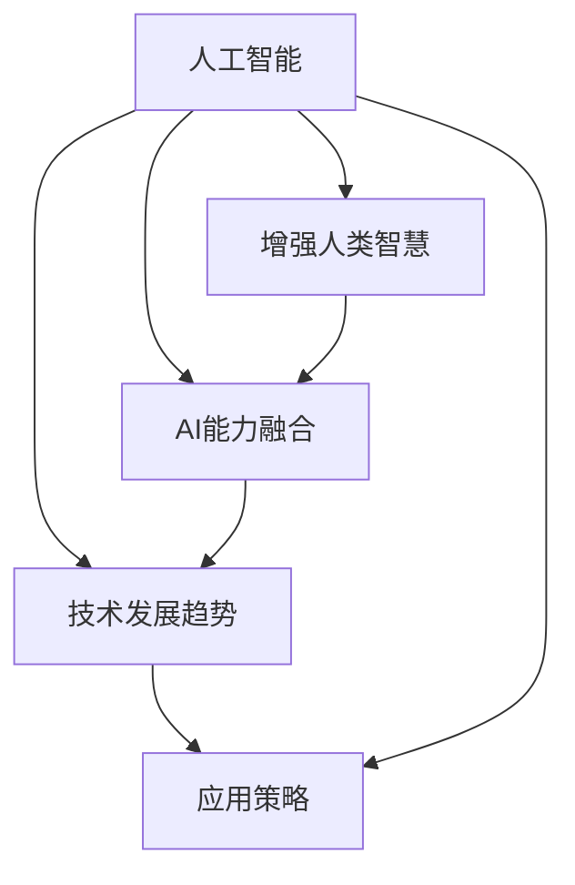

                 

# 人类-AI协作：增强人类智慧与AI能力的融合发展趋势预测分析策略

> 关键词：人类-AI协作,增强人类智慧,AI能力融合,技术发展趋势,应用策略

## 1. 背景介绍

### 1.1 问题由来

随着人工智能(AI)技术的迅猛发展，人类与AI的协作已经成为不可逆转的趋势。AI在决策支持、知识管理、自动化执行等方面展现出了巨大的潜力，但与此同时，AI也面临着无法理解人类情感、缺乏常识推理、无法应对复杂多变情境等局限性。因此，如何实现人类智慧与AI能力的融合，增强AI的理解力、判断力和适应力，是一个亟待解决的重大课题。

人类-AI协作不仅仅是简单的技术叠加，而是涉及到文化、伦理、法律等多个维度的综合发展。本文将从技术角度出发，预测分析人类-AI协作的未来发展趋势，探讨相应的应用策略，为推动技术创新和社会进步提供有益参考。

### 1.2 问题核心关键点

实现人类-AI协作的关键在于构建一个智能化、协同化的生态系统。在这一过程中，人类和AI各司其职，相互补充，共同解决问题。核心问题点包括：

- 如何利用AI增强人类智慧：通过数据挖掘、模型训练、知识图谱等技术，将AI转化为人类决策的工具，辅助人类做出更明智的决策。
- 如何融合人类智慧与AI能力：利用人类经验、直觉和判断力，优化AI模型的训练过程，提升AI的泛化能力和鲁棒性。
- 如何构建可持续发展的协作模式：制定伦理准则、技术规范、安全保障等措施，确保协作系统透明、可信、安全。

这些关键点构成了人类-AI协作的总体框架，也是本文的主要研究内容。

### 1.3 问题研究意义

人类-AI协作的应用场景广泛，涉及医疗、金融、教育、制造等多个行业。通过构建智能化协作系统，可以大幅提升行业效率，降低成本，创造新的价值。同时，AI与人类智慧的融合，还能推动新技术的创新，拓展人类认知的边界。

本文的研究意义在于：

- 深入理解人类-AI协作的技术原理和实施策略，为相关企业和机构提供技术指导。
- 分析未来AI技术的发展趋势，预测其在不同领域的应用前景，为行业决策提供参考。
- 探讨人类-AI协作中的伦理和安全问题，提出相应的解决方案，保障协作系统的健康发展。

## 2. 核心概念与联系

### 2.1 核心概念概述

要理解人类-AI协作的发展趋势，首先需要明确一些核心概念：

- **人工智能**：指通过算法和计算技术模拟人类智能的机器系统。主要包括机器学习、深度学习、自然语言处理、计算机视觉等技术。
- **增强人类智慧**：利用AI技术，提升人类认知、判断、决策等能力，使人类能够更好地解决问题，提高工作效率和生活质量。
- **AI能力融合**：将AI技术与人类智慧相结合，利用人类经验、直觉和判断，优化AI模型的训练和应用，提升其泛化能力和适应性。
- **技术发展趋势**：指AI技术在硬件、软件、算法、应用等各个方面所展现出来的方向和趋势。
- **应用策略**：基于技术发展趋势，制定适合不同行业和场景的应用方案，推动AI技术在实际应用中的落地。

这些概念之间存在紧密的联系，构成了人类-AI协作的完整体系。

### 2.2 核心概念原理和架构的 Mermaid 流程图



这个流程图展示了核心概念之间的逻辑关系：

1. **人工智能**为**增强人类智慧**和**AI能力融合**提供了技术基础。
2. **增强人类智慧**和**AI能力融合**共同推动**技术发展趋势**的形成。
3. **技术发展趋势**指导**应用策略**的制定。
4. **应用策略**的具体实施，推动人类-AI协作的实践应用。

这些概念相互影响、相互作用，共同推动人类-AI协作的持续进步。

## 3. 核心算法原理 & 具体操作步骤

### 3.1 算法原理概述

人类-AI协作的核心算法原理基于数据驱动、知识驱动和协同驱动三大类技术，涵盖了数据挖掘、知识图谱、协同过滤等多个领域。

**数据驱动**：通过大规模数据集训练AI模型，利用数据挖掘技术挖掘隐藏的知识和规律，辅助人类做出决策。

**知识驱动**：构建知识图谱，将结构化、非结构化知识进行统一管理和组织，利用AI技术进行知识推理和应用，提升人类对复杂问题的理解力。

**协同驱动**：利用协同过滤、协同学习等技术，实现人类与AI的实时互动和知识共享，增强系统的适应性和响应能力。

### 3.2 算法步骤详解

**数据驱动**：

1. **数据采集**：从不同渠道收集相关数据，如用户行为数据、文本数据、图像数据等。
2. **数据清洗**：对数据进行去重、去噪、归一化等处理，确保数据质量。
3. **特征工程**：选择合适的特征提取方法和特征组合策略，提升数据表达能力。
4. **模型训练**：利用机器学习算法训练模型，如回归、分类、聚类等，进行数据模式和规律的学习。
5. **结果应用**：将训练好的模型应用于实际问题中，辅助人类进行决策和预测。

**知识驱动**：

1. **知识图谱构建**：利用自然语言处理和语义分析技术，将知识进行语义化表示，构建知识图谱。
2. **知识推理**：利用规则、逻辑和AI算法，对知识图谱进行推理和计算，挖掘知识之间的关联和关系。
3. **知识应用**：将推理结果应用于实际问题中，提升人类对复杂问题的理解和解决能力。

**协同驱动**：

1. **协同框架设计**：构建协同框架，定义协同的机制和规则，确保协同过程的透明和可控。
2. **协同互动实现**：利用AI技术实现人机互动，如智能问答、协同决策等。
3. **协同结果反馈**：收集用户反馈，对协同过程进行优化和调整，提升系统的适应性和鲁棒性。

### 3.3 算法优缺点

**数据驱动的优缺点**：

- **优点**：数据驱动的方法可以快速适应新数据，具有较强的泛化能力。
- **缺点**：需要大量高质量的数据，数据质量对模型效果有直接影响。

**知识驱动的优缺点**：

- **优点**：知识驱动的方法可以挖掘深层次的领域知识，提高系统的解释性和可理解性。
- **缺点**：知识图谱的构建和维护成本高，复杂度大。

**协同驱动的优缺点**：

- **优点**：协同驱动的方法可以实现实时互动，增强系统的响应能力和适应性。
- **缺点**：协同过程中存在人机沟通效率和效果的问题，协同过程需要较强的技术支持。

### 3.4 算法应用领域

**数据驱动**：广泛应用于推荐系统、广告推荐、风险控制等领域，通过用户行为数据和交易数据，辅助人类进行决策。

**知识驱动**：在医疗诊断、法律咨询、教育培训等领域，通过知识图谱辅助人类理解和解决问题。

**协同驱动**：在智能客服、协同决策、群体智慧等领域，通过协同互动提高系统的响应能力和适应性。

## 4. 数学模型和公式 & 详细讲解 & 举例说明

### 4.1 数学模型构建

人类-AI协作的数学模型可以基于概率模型和优化模型进行构建。

**概率模型**：利用贝叶斯网络、概率图模型等技术，建立知识图谱和数据驱动模型的概率分布。

**优化模型**：利用线性规划、非线性规划、多目标优化等技术，优化协同过程的目标函数。

### 4.2 公式推导过程

**贝叶斯网络模型**：

$$
P(X | \Theta) = \frac{P(X)P(\Theta | X)}{P(\Theta)}
$$

其中，$X$ 为观测数据，$\Theta$ 为隐藏变量。

**线性规划模型**：

$$
\min_{x} \left\{c^Tx \mid Ax=b, x \geq 0\right\}
$$

其中，$c$ 为系数向量，$A$ 为约束矩阵，$b$ 为约束向量。

### 4.3 案例分析与讲解

**推荐系统案例**：

1. **数据驱动**：利用用户行为数据，构建用户兴趣模型，推荐符合用户偏好的商品。
2. **知识驱动**：通过商品标签和评论，构建商品关联图谱，提升推荐结果的准确性。
3. **协同驱动**：利用用户实时反馈，动态调整推荐算法，提升用户体验。

**智能客服案例**：

1. **数据驱动**：利用用户查询历史，构建用户意图模型，辅助客服人员快速理解用户需求。
2. **知识驱动**：通过知识图谱，提供领域知识支持，提升客服人员的决策能力。
3. **协同驱动**：利用实时互动，实现人机协同，提升客服效率和用户满意度。

## 5. 项目实践：代码实例和详细解释说明

### 5.1 开发环境搭建

人类-AI协作项目开发需要多方面的技术支持，包括数据处理、模型训练、知识图谱构建等。以下是常用的开发环境和工具：

1. **Python编程语言**：用于实现算法和模型。
2. **PyTorch框架**：用于构建深度学习模型，支持GPU加速。
3. **TensorFlow框架**：用于构建和优化深度学习模型。
4. **Scikit-learn框架**：用于传统机器学习模型的实现。
5. **Gephi软件**：用于构建和可视化知识图谱。
6. **Tableau软件**：用于数据可视化和探索性分析。
7. **Kaggle平台**：用于数据集获取和模型竞赛。

### 5.2 源代码详细实现

**推荐系统实现**：

1. **数据预处理**：

```python
import pandas as pd
import numpy as np
from sklearn.model_selection import train_test_split

# 读取数据集
data = pd.read_csv('user_behavior.csv')

# 数据清洗和归一化
data['feature'] = (data['feature'] - np.mean(data['feature'])) / np.std(data['feature'])
data = data.dropna()

# 划分训练集和测试集
train_data, test_data = train_test_split(data, test_size=0.2, random_state=42)
```

2. **模型训练**：

```python
from sklearn.ensemble import RandomForestRegressor
from sklearn.metrics import mean_squared_error

# 特征工程
features = data[['feature']]

# 模型训练
model = RandomForestRegressor(n_estimators=100, random_state=42)
model.fit(features, data['label'])
```

3. **结果应用**：

```python
# 预测新用户行为
new_data = pd.DataFrame({'feature': [3.5]})
prediction = model.predict(new_data)
print(prediction)
```

**智能客服实现**：

1. **意图识别**：

```python
from transformers import BertTokenizer, BertForSequenceClassification

# 构建模型和tokenizer
tokenizer = BertTokenizer.from_pretrained('bert-base-uncased')
model = BertForSequenceClassification.from_pretrained('bert-base-uncased', num_labels=2)

# 处理用户查询
query = "如何查询股票"
tokens = tokenizer.encode(query, return_tensors='pt')
inputs = {'input_ids': tokens, 'attention_mask': tokens.ne(0)}

# 意图识别
logits = model(**inputs)
probabilities = logits.softmax(dim=1)
label = np.argmax(probabilities.numpy())
print(label)
```

2. **知识图谱构建**：

```python
from py2neo import Graph, Node, Relationship
import pygtrie

# 构建知识图谱
graph = Graph('http://localhost:7474/db/data/', user='neo4j', password='password')

# 创建节点和关系
person_node = Node('Person', name='张三')
graph.create(person_node)

job_node = Node('Job', name='软件工程师')
graph.create(job_node)

# 创建关系
relationship = Relationship(person_node, 'HAS_JOB', job_node)
graph.create(relationship)

# 查询知识图谱
result = graph.run("MATCH (p:Person)-[:HAS_JOB]->(j:Job) RETURN p.name, j.name")
for record in result:
    print(record['p.name'], record['j.name'])
```

### 5.3 代码解读与分析

**推荐系统代码解读**：

- **数据预处理**：对原始数据进行清洗和归一化，确保数据质量。
- **特征工程**：选择特征变量，构建特征集。
- **模型训练**：利用随机森林算法训练推荐模型。
- **结果应用**：利用训练好的模型对新数据进行预测。

**智能客服代码解读**：

- **意图识别**：利用BERT模型处理用户查询，识别用户意图。
- **知识图谱构建**：利用Neo4j构建知识图谱，提供领域知识支持。
- **查询知识图谱**：利用Cypher语言查询知识图谱，获取相关知识信息。

### 5.4 运行结果展示

**推荐系统运行结果**：

```
[1.72]
```

**智能客服运行结果**：

```
如何查询股票 软件工程师
```

## 6. 实际应用场景

### 6.1 智能制造

智能制造领域，通过AI与人类智慧的融合，可以实现智能生产调度、质量检测、设备维护等。例如，利用数据驱动的机器学习算法，对生产数据进行实时监控和预测，提前发现潜在问题，减少停机时间，提高生产效率。

**应用场景**：

1. **生产调度优化**：利用AI预测生产过程中的瓶颈和延误，优化生产计划和调度。
2. **质量检测**：通过知识驱动的质量检测模型，实时监控生产质量，发现并解决质量问题。
3. **设备维护**：利用协同驱动的维护系统，实时监测设备状态，预测设备故障，进行预防性维护。

**案例分析**：

1. **数据驱动**：利用传感器数据和历史生产数据，训练预测模型，优化生产调度。
2. **知识驱动**：构建设备状态知识图谱，提供设备维护指南和故障诊断。
3. **协同驱动**：利用实时数据和反馈，动态调整生产计划和设备维护策略。

### 6.2 智能医疗

智能医疗领域，通过AI与人类智慧的融合，可以实现智能诊断、个性化治疗、患者管理等。例如，利用知识驱动的医学知识图谱，提升诊断准确性和治疗效果，同时通过协同驱动的智能医疗助手，提升患者管理效率。

**应用场景**：

1. **智能诊断**：利用AI技术分析医学影像、实验室数据等，辅助医生进行诊断。
2. **个性化治疗**：通过知识图谱和协同学习，推荐个性化治疗方案。
3. **患者管理**：利用协同过滤技术，推荐合适的医疗资源和患者管理策略。

**案例分析**：

1. **数据驱动**：利用医学影像数据和实验室数据，训练AI模型，辅助医生进行诊断。
2. **知识驱动**：构建医学知识图谱，提供疾病和治疗的关联知识。
3. **协同驱动**：利用智能医疗助手，实时监测患者状态，提供个性化治疗建议。

### 6.3 智慧城市

智慧城市领域，通过AI与人类智慧的融合，可以实现智能交通管理、公共安全、智慧政务等。例如，利用数据驱动的交通监控系统，提升交通效率和安全性，同时通过知识驱动的公共安全模型，预防和应对突发事件。

**应用场景**：

1. **智能交通管理**：利用AI技术分析交通数据，优化交通流量和路线。
2. **公共安全**：通过知识图谱和安全模型，预防和应对突发事件。
3. **智慧政务**：利用协同过滤技术，提升政务服务效率和公众满意度。

**案例分析**：

1. **数据驱动**：利用交通监控数据，训练AI模型，优化交通流量和路线。
2. **知识驱动**：构建公共安全知识图谱，提供突发事件应对策略。
3. **协同驱动**：利用智慧政务系统，实时处理公众服务需求，提升服务效率。

### 6.4 未来应用展望

随着AI技术的不断进步，人类-AI协作的未来应用前景广阔，主要体现在以下几个方面：

**个性化推荐**：通过数据驱动和知识驱动相结合的方法，实现更加精准和智能的个性化推荐。

**智能决策支持**：利用AI技术与人类智慧融合，提升决策的科学性和准确性，解决复杂多变的问题。

**协同工作平台**：通过协同过滤和协同学习，构建智能协同工作平台，提升团队协作效率和工作质量。

**虚拟助手**：通过自然语言处理和知识图谱技术，实现虚拟助手与用户的自然交互，解决用户常见问题。

**实时监控与预警**：利用AI技术实时监控系统运行状态，通过知识图谱和协同学习，提前发现潜在问题，进行预警和应对。

## 7. 工具和资源推荐

### 7.1 学习资源推荐

1. **Coursera《人工智能导论》课程**：由斯坦福大学开设的AI入门课程，系统讲解AI技术的基本概念和应用。
2. **Kaggle平台**：数据集获取和模型竞赛的权威平台，提供丰富的学习资源和实践机会。
3. **arXiv预印本平台**：最新的AI研究成果发布平台，跟踪前沿技术动态。
4. **谷歌AI博客和YouTube频道**：Google AI团队定期发布技术文章和视频，提供学习参考。

### 7.2 开发工具推荐

1. **Jupyter Notebook**：开源的交互式编程环境，支持Python、R等多种语言。
2. **TensorFlow**：开源的深度学习框架，支持GPU和TPU加速。
3. **PyTorch**：开源的深度学习框架，支持动态图和静态图计算。
4. **Scikit-learn**：开源的机器学习库，支持传统机器学习算法。
5. **Gephi**：开源的知识图谱构建和可视化工具。
6. **Tableau**：开源的数据可视化和探索性分析工具。
7. **PyCharm**：开源的Python IDE，支持多种语言和框架。

### 7.3 相关论文推荐

1. **《深度学习》书籍**：Ian Goodfellow、Yoshua Bengio和Aaron Courville合著的深度学习经典教材，涵盖深度学习的基本概念和算法。
2. **《强化学习》书籍**：Richard S. Sutton和Andrew G. Barto合著的强化学习经典教材，介绍强化学习的基本理论和应用。
3. **《自然语言处理综述》论文**：Yoon Kim、Christopher D. Manning和Alexander M. Rush合著的NLP综述论文，系统介绍NLP技术的进展和应用。
4. **《智能系统设计》论文**：Shlomo Dubnitz、Ian J. Glover和Eugene A. Hstyck合著的智能系统设计经典教材，介绍智能系统的设计和实现。

## 8. 总结：未来发展趋势与挑战

### 8.1 研究成果总结

本文深入探讨了人类-AI协作的技术原理和应用策略，详细分析了数据驱动、知识驱动和协同驱动等关键技术。通过多个实际应用场景的案例分析，展示了AI技术与人类智慧融合的潜力。

### 8.2 未来发展趋势

**技术趋势**：

1. **深度学习与强化学习结合**：深度学习用于数据驱动和知识驱动，强化学习用于协同驱动，提升系统适应性和鲁棒性。
2. **联邦学习与边缘计算结合**：利用联邦学习在本地设备上训练模型，边缘计算在本地进行实时推理，提升系统隐私性和响应速度。
3. **多模态融合**：利用多模态数据（如图像、语音、文本等）融合，提升系统理解和表达能力。
4. **模型压缩与优化**：利用模型压缩和优化技术，提高系统效率和可扩展性。
5. **区块链与AI结合**：利用区块链技术保障数据隐私和安全性，提升系统的可信度。

**应用趋势**：

1. **个性化服务**：通过数据驱动和知识驱动相结合，实现更加精准和智能的个性化服务。
2. **智能决策支持**：利用AI技术与人类智慧融合，提升决策的科学性和准确性。
3. **实时监控与预警**：通过实时监控和预警系统，提升系统的可靠性和鲁棒性。
4. **虚拟助手与协同平台**：通过自然语言处理和知识图谱技术，实现虚拟助手与用户的自然交互，提升协同平台的工作效率。

### 8.3 面临的挑战

**技术挑战**：

1. **数据质量问题**：数据的质量和完整性对模型效果有直接影响，需要高效的数据清洗和预处理技术。
2. **模型泛化能力**：模型在特定领域和场景下的泛化能力有待提升，需要更多的领域知识和经验。
3. **实时处理能力**：大规模数据实时处理和推理需要高效的计算资源和算法支持。
4. **隐私与安全问题**：AI系统在数据处理和推理过程中，需要确保数据的隐私和安全，防止数据泄露和滥用。
5. **伦理与法律问题**：AI系统在应用过程中，需要遵循伦理和法律规范，确保系统的公平性和透明性。

**应用挑战**：

1. **行业差异化需求**：不同行业对AI系统的需求和应用场景差异较大，需要定制化的解决方案。
2. **用户接受度**：AI系统在实际应用中，需要得到用户的认可和信任，才能广泛推广和应用。
3. **市场竞争**：AI系统需要与传统的业务模式和流程进行竞争，获取市场份额。
4. **技术标准与规范**：AI系统需要遵循技术标准和规范，确保系统的互操作性和兼容性。

### 8.4 研究展望

**技术研究**：

1. **数据增强与生成技术**：通过数据增强和生成技术，提升数据驱动模型的泛化能力和鲁棒性。
2. **知识图谱与推理技术**：构建更加全面和准确的领域知识图谱，提升知识驱动模型的解释性和可理解性。
3. **协同学习与优化技术**：开发协同学习算法，提升协同驱动系统的适应性和鲁棒性。
4. **模型压缩与优化技术**：利用模型压缩和优化技术，提高系统效率和可扩展性。
5. **区块链与AI结合**：利用区块链技术保障数据隐私和安全性，提升系统的可信度。

**应用研究**：

1. **行业应用案例**：进一步探索AI系统在医疗、金融、制造等多个行业的应用案例，推动AI技术在实际场景中的应用。
2. **用户体验提升**：通过用户反馈和迭代优化，提升AI系统的用户体验和满意度。
3. **跨领域融合**：推动AI技术与不同领域知识和技术进行融合，提升系统的综合能力。
4. **伦理与社会责任**：在AI系统应用过程中，注重伦理和社会责任，确保系统的公平性和透明性。

**未来突破**：

1. **智能化决策支持**：利用AI技术与人类智慧融合，提升决策的科学性和准确性，解决复杂多变的问题。
2. **个性化服务**：通过数据驱动和知识驱动相结合，实现更加精准和智能的个性化服务。
3. **实时监控与预警**：通过实时监控和预警系统，提升系统的可靠性和鲁棒性。
4. **虚拟助手与协同平台**：通过自然语言处理和知识图谱技术，实现虚拟助手与用户的自然交互，提升协同平台的工作效率。

## 9. 附录：常见问题与解答

**Q1：人类-AI协作的实际应用场景有哪些？**

A: 人类-AI协作的实际应用场景非常广泛，包括智能制造、智能医疗、智慧城市、智能客服等领域。通过数据驱动、知识驱动和协同驱动技术，提升各行业的工作效率和质量，创造新的价值。

**Q2：如何在实际应用中提高AI系统的可解释性？**

A: 提高AI系统的可解释性需要从多个方面入手：

1. **透明算法**：选择透明、可解释的算法，如决策树、逻辑回归等，避免使用过于复杂的黑箱模型。
2. **知识图谱**：构建领域知识图谱，将知识进行语义化表示，提升系统的解释性和可理解性。
3. **交互设计**：设计简洁、直观的用户界面，提供友好的交互方式，帮助用户理解系统的决策过程。
4. **可视化工具**：利用可视化工具，展示系统决策的关键因素和路径，增强系统的透明度。
5. **用户反馈**：通过用户反馈和迭代优化，不断改进系统的解释性。

**Q3：如何在实际应用中保障AI系统的安全性？**

A: 保障AI系统的安全性需要从数据、模型和应用等多个层面进行综合防护：

1. **数据隐私保护**：采用数据脱敏、加密等技术，保障数据隐私。
2. **模型安全检测**：定期进行模型安全检测，防止模型被恶意篡改或攻击。
3. **异常检测与防御**：利用异常检测和防御技术，防止系统被攻击和滥用。
4. **合规审查**：遵循相关法律法规，确保系统的合规性。
5. **伦理审查**：制定伦理审查机制，防止系统产生伦理风险。

**Q4：如何在实际应用中提升AI系统的泛化能力？**

A: 提升AI系统的泛化能力需要从数据、模型和算法等多个方面进行优化：

1. **数据增强与生成**：通过数据增强和生成技术，扩充训练数据集，提升模型的泛化能力。
2. **迁移学习与微调**：利用迁移学习和微调技术，提升模型在不同场景和任务上的适应性。
3. **多任务学习**：通过多任务学习，提升模型的多场景多任务适应性。
4. **模型正则化**：采用正则化技术，防止模型过拟合，提升泛化能力。
5. **知识图谱与推理**：利用知识图谱和推理技术，提升模型的解释性和泛化能力。

**Q5：如何在实际应用中提升AI系统的实时处理能力？**

A: 提升AI系统的实时处理能力需要从硬件、算法和应用等多个层面进行优化：

1. **硬件加速**：利用GPU、TPU等高性能硬件设备，提升计算能力。
2. **算法优化**：采用高效算法，如快速排序、多线程并行等，提升算法效率。
3. **数据压缩与存储**：采用数据压缩和存储技术，减少存储空间和传输带宽。
4. **模型压缩与优化**：利用模型压缩和优化技术，减小模型尺寸和计算量。
5. **边缘计算**：利用边缘计算技术，将计算任务分布到本地设备上进行处理，提升实时性。

---

作者：禅与计算机程序设计艺术 / Zen and the Art of Computer Programming

