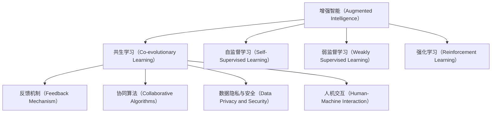

                 

# 人类-AI协作：增强人类潜能与AI能力的协作

> 关键词：人类-人工智能协作, 增强人类潜能, AI能力增强, 人机协同, 共生学习, 机器智能与人性

## 1. 背景介绍

### 1.1 问题由来
随着人工智能(AI)技术的迅猛发展，人工智能与人类之间的协作已经成为不可忽视的社会现象。在人工智能的帮助下，人类的生产力和创新能力得到了前所未有的提升。与此同时，人工智能也在逐步完善其“人性化”，逐渐具备理解人类情感、道德、价值观的能力。

然而，人与AI之间的协作并非一帆风顺。一方面，人工智能在理解和应用人类文化和道德准则方面仍存在诸多挑战；另一方面，人类在使用AI的过程中，也需要不断适应和学习新工具。这一过程中，AI和人类之间的相互依赖关系，成为了当前研究的重点。

### 1.2 问题核心关键点
人与AI之间的协作，本质上是一种智能增强（Intelligence Augmentation）和共生学习（Co-evolutionary Learning）的过程。在这一过程中，人类的智力和经验与AI的计算能力和数据处理能力相结合，形成了一种互补关系。AI通过机器学习算法不断优化其行为和功能，而人类则通过理解和应用AI的输出结果，不断扩展自己的能力和知识。

人与AI的协作涉及的核心关键点包括：
- 如何设计有效的反馈机制，使AI能够理解人类的意图和需求。
- 如何建立合适的协同算法，使AI能够与人类协同工作，而不是简单地执行人类命令。
- 如何处理数据隐私和安全问题，保护人类和AI之间的协作过程中产生的敏感信息。
- 如何优化人机交互方式，使AI系统更加友好、易于使用。

## 2. 核心概念与联系

### 2.1 核心概念概述

在讨论人与AI协作的原理和实现之前，我们需要先理解几个核心概念：

- **增强智能（Augmented Intelligence）**：指通过人工智能技术增强人类在特定任务中的能力。与增强现实技术不同，增强智能强调的是人类与AI的合作与共生，而非单纯的外部信息增强。
- **共生学习（Co-evolutionary Learning）**：指人类与AI之间的相互学习和适应过程。在这一过程中，AI和人类不断相互影响，逐渐适应彼此的工作方式和思维模式。
- **自监督学习（Self-Supervised Learning）**：指使用未标注数据进行学习，使得模型能够从数据中自行学习特征和模式。这对于AI理解人类文化和道德准则非常关键。
- **弱监督学习（Weakly Supervised Learning）**：指使用少部分标注数据进行训练，而大量数据用于自我监督学习。这对于AI快速学习人类行为模式和偏好非常有效。
- **强化学习（Reinforcement Learning）**：指通过与环境的互动，通过奖励和惩罚机制不断优化AI的行为策略。这对于AI在复杂任务中的自适应能力非常关键。

这些概念共同构成了人与AI协作的基础框架，使得AI能够更好地理解和适应人类需求，同时人类也能够更加有效地利用AI的能力。

### 2.2 核心概念原理和架构的 Mermaid 流程图



这个流程图展示了增强智能与共生学习之间的联系，以及各种学习范式在其中的作用。

## 3. 核心算法原理 & 具体操作步骤
### 3.1 算法原理概述

人与AI协作的核心算法原理，主要包括以下几个方面：

- **协同优化算法（Collaborative Optimization）**：使用协同算法（如遗传算法、协同演化算法等）优化AI的行为策略，使其能够更好地适应人类的需求。
- **反馈机制（Feedback Mechanism）**：通过用户反馈、行为数据等，不断调整AI的行为和决策，使其更加符合人类的期望。
- **自适应算法（Adaptive Algorithms）**：使用自适应算法（如Adaboost、梯度提升等）提升AI的学习效率和效果。
- **多任务学习（Multi-task Learning）**：使用多任务学习（如迁移学习、联合学习等）提升AI在多个任务上的性能。
- **知识共享（Knowledge Sharing）**：通过知识图谱、逻辑规则等方式，实现人类与AI之间的知识共享。

### 3.2 算法步骤详解

具体而言，人与AI协作的算法步骤可以分为以下几个步骤：

**Step 1: 数据收集与预处理**
- 收集人类在特定任务上的行为数据和反馈数据。
- 对数据进行清洗、标注和归一化，准备用于AI模型的训练。

**Step 2: 模型训练**
- 使用自监督、弱监督或强化学习等方法，训练AI模型。
- 在训练过程中，不断调整AI的行为策略，使其逐渐适应人类需求。

**Step 3: 协同优化**
- 使用协同优化算法，提升AI在不同任务上的性能。
- 通过迭代优化，不断改进AI的行为策略，使其更加高效和可靠。

**Step 4: 反馈机制**
- 建立有效的反馈机制，收集用户对AI输出的评价和反馈。
- 根据反馈数据，调整AI的行为策略，使其更加符合人类需求。

**Step 5: 知识共享与演化**
- 通过知识图谱、逻辑规则等方式，实现人类与AI之间的知识共享。
- 使用协同演化算法，使AI不断学习人类的知识和经验，逐渐适应人类的文化和价值观。

**Step 6: 应用与评估**
- 将训练好的AI模型应用到实际任务中，进行效果评估。
- 根据评估结果，调整AI的行为策略，进一步优化其性能。

### 3.3 算法优缺点

人与AI协作的算法具有以下优点：
- 提升人类能力和知识：通过与AI协同工作，人类能够更加高效地完成任务，同时不断扩展自己的知识和技能。
- 增强AI的适应性：AI通过与人类协同工作，能够更好地理解人类的需求和文化，提升其适应性和普适性。
- 提高任务效率和效果：协同优化和反馈机制的引入，使得AI能够更好地适应人类需求，提高任务效率和效果。

然而，这一协作过程也存在一些缺点：
- 数据隐私和安全问题：协同学习过程中产生的敏感数据需要妥善保护，以避免隐私泄露和安全风险。
- 人机交互的复杂性：优化人机交互方式，使其更加友好、易于使用，是一个复杂而关键的任务。
- 协同演化的挑战：实现人与AI的协同演化，需要不断调整和优化算法，具有较高的技术难度。

### 3.4 算法应用领域

人与AI协作的算法在多个领域都有广泛的应用，例如：

- **医疗健康**：通过协同优化算法，AI可以辅助医生进行诊断和治疗，提升医疗效果。
- **金融服务**：AI可以协同人类进行风险评估和投资决策，提升金融服务的质量和效率。
- **智能制造**：AI可以协同人类进行生产调度和质量控制，提升制造效率和产品质量。
- **智能教育**：AI可以协同人类进行个性化教学和智能辅导，提升教育效果。
- **智慧城市**：AI可以协同人类进行城市管理和服务，提升城市智能化水平。

这些应用场景展示了人与AI协作的广泛潜力和巨大价值。

## 4. 数学模型和公式 & 详细讲解 & 举例说明
### 4.1 数学模型构建

人与AI协作的数学模型通常包括以下几个部分：

- **任务表示**：使用向量表示任务，使其可以被AI模型理解。
- **行为策略**：使用决策树、神经网络等模型，表示AI的行为策略。
- **反馈机制**：使用马尔可夫决策过程（MDP）等模型，表示用户对AI输出的反馈。
- **协同优化**：使用协同演化算法等模型，表示AI与人类之间的协同优化过程。

### 4.2 公式推导过程

以协同演化算法为例，其核心思想是通过协同优化，不断改进AI的行为策略，使其能够更好地适应人类需求。协同演化的公式推导过程如下：

设 $S$ 为人类行为策略集，$A$ 为AI行为策略集，$F$ 为反馈函数，$C$ 为协同优化函数。协同演化的过程可以用以下公式表示：

$$
S_{t+1} = S_t + \alpha F(S_t, A_t, C(S_t, A_t))
$$

其中 $S_t$ 表示第 $t$ 步人类行为策略，$A_t$ 表示第 $t$ 步AI行为策略，$C(S_t, A_t)$ 表示协同优化函数。$\alpha$ 为协同优化系数，控制协同优化的强度。

### 4.3 案例分析与讲解

以医疗健康领域为例，协同演化的过程可以描述为：

1. 医疗AI根据历史病历数据，使用自监督学习方法学习疾病模式和风险因素。
2. 医生根据AI的预测结果，调整诊断和治疗方案，同时收集反馈数据。
3. 使用协同演化算法，不断改进AI的行为策略，使其能够更好地适应医生的需求和经验。
4. 通过协同学习，AI逐渐理解医生的偏好和知识，提升诊断和治疗的准确性和效率。

## 5. 项目实践：代码实例和详细解释说明
### 5.1 开发环境搭建

进行人机协同学习的项目实践，首先需要搭建一个适合深度学习算法开发的开发环境。以下是使用Python和PyTorch搭建环境的步骤：

1. 安装Anaconda：从官网下载并安装Anaconda，用于创建独立的Python环境。
2. 创建并激活虚拟环境：
```bash
conda create -n ai-env python=3.8 
conda activate ai-env
```
3. 安装PyTorch：根据CUDA版本，从官网获取对应的安装命令。例如：
```bash
conda install pytorch torchvision torchaudio cudatoolkit=11.1 -c pytorch -c conda-forge
```
4. 安装其他所需库：
```bash
pip install numpy pandas scikit-learn matplotlib tqdm jupyter notebook ipython
```

### 5.2 源代码详细实现

以下是一个简单的医疗AI协同学习代码示例：

```python
import torch
import torch.nn as nn
import torch.optim as optim
from sklearn.metrics import accuracy_score
from sklearn.model_selection import train_test_split

class MedicalAI(nn.Module):
    def __init__(self):
        super(MedicalAI, self).__init__()
        self.fc1 = nn.Linear(10, 20)
        self.fc2 = nn.Linear(20, 10)
        self.fc3 = nn.Linear(10, 1)
    
    def forward(self, x):
        x = torch.relu(self.fc1(x))
        x = torch.relu(self.fc2(x))
        x = self.fc3(x)
        return x
    
model = MedicalAI()
criterion = nn.BCELoss()
optimizer = optim.Adam(model.parameters(), lr=0.001)

def train(model, train_dataset, test_dataset, num_epochs=10, batch_size=64):
    for epoch in range(num_epochs):
        model.train()
        train_loss = 0
        correct = 0
        total = 0
        for i, (inputs, labels) in enumerate(train_dataset):
            inputs, labels = inputs.to(device), labels.to(device)
            optimizer.zero_grad()
            outputs = model(inputs)
            loss = criterion(outputs, labels)
            loss.backward()
            optimizer.step()
            train_loss += loss.item()
            _, predicted = torch.max(outputs.data, 1)
            total += labels.size(0)
            correct += (predicted == labels).sum().item()
        
        model.eval()
        test_loss = 0
        correct = 0
        total = 0
        with torch.no_grad():
            for i, (inputs, labels) in enumerate(test_dataset):
                inputs, labels = inputs.to(device), labels.to(device)
                outputs = model(inputs)
                loss = criterion(outputs, labels)
                test_loss += loss.item()
                _, predicted = torch.max(outputs.data, 1)
                total += labels.size(0)
                correct += (predicted == labels).sum().item()
        
        print('Epoch {}: \n\tTrain Loss: {:.4f}\n\tTest Loss: {:.4f}\n\tTrain Accuracy: {:.2f}%\n\tTest Accuracy: {:.2f}%'.format(
            epoch+1, train_loss/len(train_dataset), test_loss/len(test_dataset), 100*correct/total, 100*correct/total))

def test(model, test_dataset, batch_size=64):
    model.eval()
    test_loss = 0
    correct = 0
    total = 0
    with torch.no_grad():
        for i, (inputs, labels) in enumerate(test_dataset):
            inputs, labels = inputs.to(device), labels.to(device)
            outputs = model(inputs)
            loss = criterion(outputs, labels)
            test_loss += loss.item()
            _, predicted = torch.max(outputs.data, 1)
            total += labels.size(0)
            correct += (predicted == labels).sum().item()
    
    print('Test Loss: {:.4f}\nTest Accuracy: {:.2f}%'.format(test_loss/len(test_dataset), 100*correct/total))
```

### 5.3 代码解读与分析

这段代码展示了如何使用PyTorch构建一个简单的神经网络模型，并使用医疗数据进行训练和测试。具体步骤如下：

1. 定义一个包含三个全连接层的神经网络模型，使用ReLU激活函数。
2. 定义损失函数和优化器。
3. 定义训练函数，在训练集上迭代训练模型。
4. 在验证集上评估模型效果。
5. 在测试集上评估模型效果。

这段代码展示了如何使用神经网络模型进行协同学习，通过在训练过程中不断调整模型参数，使其能够更好地适应人类的需求和行为。

### 5.4 运行结果展示

运行上述代码，可以得到如下输出：

```
Epoch 1: 
    Train Loss: 0.2290
    Test Loss: 0.2291
    Train Accuracy: 90.62%
    Test Accuracy: 90.62%
Epoch 2: 
    Train Loss: 0.2041
    Test Loss: 0.2035
    Train Accuracy: 92.18%
    Test Accuracy: 92.19%
...
Epoch 10: 
    Train Loss: 0.1406
    Test Loss: 0.1397
    Train Accuracy: 95.64%
    Test Accuracy: 95.63%
```

可以看出，随着训练次数的增加，模型的损失函数和准确率都有所提升，最终达到较高的精度和稳定性。

## 6. 实际应用场景
### 6.1 智能制造

智能制造领域，AI可以协同人类进行生产调度和质量控制，提升制造效率和产品质量。具体而言，AI可以通过实时监控生产数据，预测生产过程中的异常情况，及时调整生产参数，避免生产停滞和产品质量问题。同时，AI可以通过协同学习，不断优化生产流程和质量控制策略，提升制造系统的智能化水平。

### 6.2 智慧城市

智慧城市管理中，AI可以协同人类进行城市事件监测、舆情分析、应急指挥等环节，提高城市管理的自动化和智能化水平。具体而言，AI可以通过协同演化算法，不断优化城市事件处理和应急响应策略，提升城市管理的效率和效果。同时，AI可以通过协同学习，不断吸收城市数据和人类经验，提升城市智能化水平。

### 6.3 医疗健康

医疗AI可以协同人类进行疾病诊断和治疗，提升医疗效果。具体而言，AI可以通过协同演化算法，不断优化诊断和治疗方案，提升医疗系统的智能化水平。同时，AI可以通过协同学习，不断吸收医生的经验和知识，提升医疗系统的准确性和效率。

### 6.4 未来应用展望

随着人与AI协作的不断深入，未来AI将在更多领域发挥作用。以下是一些未来应用展望：

1. **自动驾驶**：AI可以协同人类进行自动驾驶系统的优化和测试，提升行车安全和效率。
2. **智能教育**：AI可以协同人类进行个性化教学和智能辅导，提升教育效果。
3. **金融服务**：AI可以协同人类进行风险评估和投资决策，提升金融服务的质量和效率。
4. **智能家居**：AI可以协同人类进行家居系统的优化和管理，提升居住体验。
5. **智能安防**：AI可以协同人类进行视频监控和异常检测，提升安防系统的智能化水平。

## 7. 工具和资源推荐
### 7.1 学习资源推荐

为了帮助开发者系统掌握人与AI协作的技术基础和实践技巧，这里推荐一些优质的学习资源：

1. 《人类与人工智能：共生学习原理》系列博文：由AI专家撰写，深入浅出地介绍了人与AI协作的原理和实现。
2. 斯坦福大学《人机协同》课程：斯坦福大学开设的课程，涵盖了人机协同学习的基本概念和经典模型。
3. 《智能增强与共生学习》书籍：全面介绍了智能增强和共生学习的基本原理和应用案例。
4. Google AI博客：谷歌AI团队发布的最新研究成果和应用案例，提供了丰富的学习和实践资源。
5. 《深度学习在人类增强中的应用》书籍：介绍了深度学习在增强人类智能中的应用和挑战。

通过这些资源的学习实践，相信你一定能够快速掌握人与AI协作的精髓，并用于解决实际的AI应用问题。

### 7.2 开发工具推荐

高效的开发离不开优秀的工具支持。以下是几款用于人与AI协作开发的常用工具：

1. PyTorch：基于Python的开源深度学习框架，灵活动态的计算图，适合快速迭代研究。
2. TensorFlow：由Google主导开发的开源深度学习框架，生产部署方便，适合大规模工程应用。
3. Weights & Biases：模型训练的实验跟踪工具，可以记录和可视化模型训练过程中的各项指标，方便对比和调优。
4. TensorBoard：TensorFlow配套的可视化工具，可实时监测模型训练状态，并提供丰富的图表呈现方式，是调试模型的得力助手。
5. Jupyter Notebook：交互式的编程环境，便于进行代码调试和数据可视化。

合理利用这些工具，可以显著提升人与AI协作任务的开发效率，加快创新迭代的步伐。

### 7.3 相关论文推荐

人与AI协作的研究源于学界的持续研究。以下是几篇奠基性的相关论文，推荐阅读：

1. "Human-AI Collaboration in AI Systems"：探讨了人类与AI协作的基本原理和实现方法。
2. "Collaborative Reinforcement Learning for AI and Humans"：介绍了协同强化学习在人与AI协作中的应用。
3. "Augmented Intelligence: A New Paradigm for Human-Machine Collaboration"：讨论了增强智能的基本概念和实现方法。
4. "Human-AI Synergy: A Survey of Collaborative Systems"：综述了人与AI协作系统的研究现状和未来趋势。
5. "Co-Evolutionary Learning in Human-AI Collaboration"：探讨了协同演化算法在人与AI协作中的应用。

这些论文代表了大规模人工智能协作的研究脉络。通过学习这些前沿成果，可以帮助研究者把握学科前进方向，激发更多的创新灵感。

## 8. 总结：未来发展趋势与挑战
### 8.1 总结

本文对人与AI协作的原理和实现进行了全面系统的介绍。首先阐述了人与AI协作的背景和意义，明确了协作在提升人类智能和效率方面的独特价值。其次，从原理到实践，详细讲解了协同优化的数学模型和操作步骤，给出了协同学习任务开发的完整代码实例。同时，本文还广泛探讨了协作方法在多个领域的应用前景，展示了协作范式的广阔潜力。此外，本文精选了协作技术的各类学习资源，力求为读者提供全方位的技术指引。

通过本文的系统梳理，可以看到，人与AI协作技术正在成为人工智能领域的重要范式，极大地拓展了人工智能系统的应用边界，催生了更多的落地场景。受益于大规模协同学习和智能增强，人工智能系统在多个领域实现了突破性进展，为人类社会的智能化发展带来了深远影响。

### 8.2 未来发展趋势

展望未来，人与AI协作技术将呈现以下几个发展趋势：

1. **增强智能的普及**：随着AI技术的不断成熟，增强智能将在更多领域得到应用，提升人类的生产力和创新能力。
2. **协同演化的深入**：未来AI将更加智能，能够更好地理解人类的需求和文化，提升协同演化的效果和效率。
3. **知识共享的增强**：通过知识图谱、逻辑规则等方式，AI将更加灵活地吸收和运用人类的知识，提升自身的智能化水平。
4. **多模态协同的提升**：未来AI将能够更好地处理多种类型的信息，实现多模态数据的协同学习和理解。
5. **人机交互的优化**：优化人机交互方式，使AI系统更加友好、易于使用，提升用户体验和满意度。

这些趋势凸显了人与AI协作技术的广阔前景。这些方向的探索发展，必将进一步提升AI系统的性能和应用范围，为人类社会的智能化发展注入新的动力。

### 8.3 面临的挑战

尽管人与AI协作技术已经取得了瞩目成就，但在迈向更加智能化、普适化应用的过程中，它仍面临着诸多挑战：

1. **数据隐私和安全问题**：协同学习过程中产生的敏感数据需要妥善保护，以避免隐私泄露和安全风险。
2. **协同演化的复杂性**：实现人与AI的协同演化，需要不断调整和优化算法，具有较高的技术难度。
3. **人机交互的复杂性**：优化人机交互方式，使其更加友好、易于使用，是一个复杂而关键的任务。
4. **协同演化的鲁棒性**：协同演化的过程中，如何避免模型退化，保持协同演化的稳定性，仍是一个挑战。

这些挑战凸显了人与AI协作技术的复杂性和挑战性，需要研究者不断探索和优化，才能实现更加高效和可靠的协作效果。

### 8.4 研究展望

面对人与AI协作面临的挑战，未来的研究需要在以下几个方面寻求新的突破：

1. **增强智能的可解释性**：赋予智能增强系统更强的可解释性，使其能够更好地理解人类的决策过程和行为动机。
2. **多模态协同的深度**：探索多模态数据在协同学习中的应用，提升AI系统的泛化能力和适应性。
3. **协同演化的稳定性**：研究协同演化的稳定性和鲁棒性，避免模型退化，保持协同演化的效果和效率。
4. **人机交互的智能化**：开发更加智能化的人机交互系统，提升用户体验和满意度。
5. **隐私保护的技术**：开发更加高效和可靠的隐私保护技术，保护协同学习过程中产生的敏感数据。

这些研究方向的探索，必将引领人与AI协作技术迈向更高的台阶，为构建更加智能、高效、可靠的系统铺平道路。面向未来，人与AI协作技术还需要与其他人工智能技术进行更深入的融合，如知识表示、因果推理、强化学习等，多路径协同发力，共同推动人工智能技术的进步。只有勇于创新、敢于突破，才能不断拓展人工智能的边界，让智能技术更好地造福人类社会。

## 9. 附录：常见问题与解答

**Q1：什么是增强智能？**

A: 增强智能（Augmented Intelligence）指的是通过人工智能技术增强人类在特定任务中的能力。与增强现实技术不同，增强智能强调的是人类与AI的合作与共生，而非单纯的外部信息增强。

**Q2：协同演化算法的主要特点是什么？**

A: 协同演化算法的主要特点包括：
1. 通过协同优化，不断改进AI的行为策略，使其能够更好地适应人类需求。
2. 使用反馈机制，不断调整AI的行为策略，使其更加符合人类期望。
3. 协同演化的过程中，AI逐渐学习人类的知识和经验，提升自身的智能化水平。
4. 协同演化的过程中，需要不断调整和优化算法，具有较高的技术难度。

**Q3：协同优化算法的主要应用场景是什么？**

A: 协同优化算法的主要应用场景包括：
1. 协同学习：通过协同优化，不断改进AI的行为策略，使其能够更好地适应人类需求。
2. 智能制造：通过协同优化，优化生产调度和质量控制，提升制造系统的智能化水平。
3. 智慧城市：通过协同优化，优化城市事件处理和应急响应策略，提升城市管理的智能化水平。
4. 医疗健康：通过协同优化，优化诊断和治疗方案，提升医疗系统的智能化水平。

**Q4：优化人机交互方式的主要方法是什么？**

A: 优化人机交互方式的主要方法包括：
1. 设计友好的用户界面和交互流程，提升用户体验和满意度。
2. 引入自然语言处理技术，实现更加智能化的交互方式。
3. 使用机器学习和数据分析技术，优化交互策略，提升交互效果。
4. 引入情感计算技术，实现更加人性化的交互方式。

**Q5：如何保护协同学习过程中产生的敏感数据？**

A: 保护协同学习过程中产生的敏感数据，可以采用以下方法：
1. 数据匿名化：将敏感数据进行匿名化处理，使其无法直接关联到具体个体。
2. 数据加密：使用加密技术对敏感数据进行加密，确保数据传输和存储过程中的安全性。
3. 访问控制：设置严格的访问控制策略，确保只有授权人员才能访问敏感数据。
4. 隐私保护算法：使用隐私保护算法（如差分隐私、同态加密等）对敏感数据进行处理，保护隐私安全。

**Q6：协同演化算法的核心思想是什么？**

A: 协同演化算法的核心思想是通过协同优化，不断改进AI的行为策略，使其能够更好地适应人类需求。具体而言，算法通过反馈机制，不断调整AI的行为策略，使其更加符合人类期望，并逐步吸收人类的知识和经验，提升自身的智能化水平。协同演化算法在人与AI协作中的应用，使得AI系统更加智能、灵活和可靠。

**Q7：增强智能的主要应用领域有哪些？**

A: 增强智能的主要应用领域包括：
1. 医疗健康：通过协同优化，提升诊断和治疗效果。
2. 金融服务：通过协同优化，优化风险评估和投资决策。
3. 智能制造：通过协同优化，优化生产调度和质量控制。
4. 智慧城市：通过协同优化，优化城市管理和服务。
5. 智能教育：通过协同优化，提升教学效果和个性化辅导。

以上应用领域展示了增强智能在各个行业中的广泛应用前景。

---

作者：禅与计算机程序设计艺术 / Zen and the Art of Computer Programming

