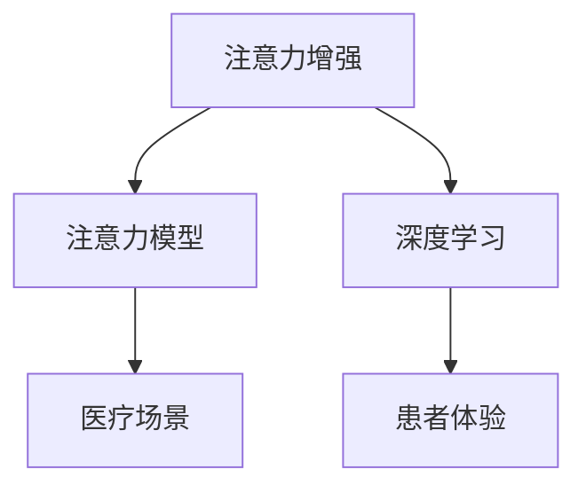

                 

# 人类注意力增强：提升专注力和注意力在医疗中的趋势预测

> 关键词：人类注意力,提升专注力,注意力增强,医疗应用,预测趋势

## 1. 背景介绍

### 1.1 问题由来

在现代社会，注意力增强已经成为提升个体生活质量和生产效率的重要手段。特别是在医疗领域，高度集中的注意力不仅能够提高诊疗效率，还能减少医疗错误，提升患者满意度。因此，如何通过技术手段增强人类注意力，特别是在医疗场景下实现高效稳定的注意力提升，已经成为当前研究的热点。

### 1.2 问题核心关键点

目前，医疗领域中人类注意力的提升主要依赖于个性化训练和专业工具。针对不同人群和医疗场景，需要开发专门的注意力提升工具和训练方案。然而，这些工具和方法的效果和普适性仍需进一步验证。

基于此，本文将系统梳理注意力增强的原理、方法和应用场景，并展望其未来发展趋势，为医疗领域中人类注意力的提升提供理论指导和技术参考。

## 2. 核心概念与联系

### 2.1 核心概念概述

为更好地理解注意力增强在医疗中的应用，本节将介绍几个密切相关的核心概念：

- 注意力增强（Attention Enhancement）：通过技术手段提升个体在特定任务中的专注力和注意力的过程。通常包括训练技术、工具使用、算法应用等。

- 注意力模型（Attention Model）：用于捕捉个体在特定任务中注意力分布的数学模型，如Transformer模型。

- 深度学习（Deep Learning）：通过多层神经网络对数据进行建模和预测的计算范式。注意力模型属于深度学习的重要组成部分。

- 医疗场景（Medical Scenario）：包括医院、诊所、家庭等不同环境下的医疗活动，如诊断、治疗、康复等。

- 患者体验（Patient Experience）：患者对医疗服务的满意度、诊疗效率、治疗效果等综合体验的评价。

这些核心概念之间的逻辑关系可以通过以下Mermaid流程图来展示：



这个流程图展示出注意力增强与注意力模型、深度学习、医疗场景、患者体验之间的联系：

1. 注意力增强是目标，即提升个体在医疗场景中的专注力和注意力。
2. 注意力模型是工具，用于捕捉个体注意力的分布规律。
3. 深度学习是技术手段，用于训练注意力模型，提升注意力增强效果。
4. 医疗场景是应用领域，需考虑不同环境下的注意力增强需求。
5. 患者体验是评价指标，用于评估注意力增强效果。

## 3. 核心算法原理 & 具体操作步骤
### 3.1 算法原理概述

注意力增强的算法原理主要基于认知神经科学和深度学习的结合。通过捕捉个体在特定任务中的注意力分布，优化其注意力网络，从而实现专注力的提升。

具体而言，注意力增强算法包括以下几个步骤：

1. 数据收集：收集患者在不同医疗场景下的注意力数据，如眼球追踪数据、脑电图（EEG）数据等。
2. 模型训练：使用深度学习技术，训练注意力模型，捕捉个体在特定任务中的注意力分布。
3. 注意力调整：根据注意力模型输出的注意力分布，使用个性化训练方法，调整个体注意力网络。
4. 注意力提升：通过持续训练和反馈，逐步提升个体在特定任务中的专注力和注意力。

### 3.2 算法步骤详解

以下详细讲解注意力增强算法的各个步骤：

**Step 1: 数据收集**

- 使用眼球追踪技术收集患者在特定任务下的眼球运动数据。
- 使用脑电图（EEG）设备记录患者在特定任务下的脑电信号。
- 通过问卷调查等方式收集患者在特定任务下的主观体验数据。

**Step 2: 模型训练**

- 数据预处理：将收集的数据进行清洗、归一化处理，生成可用于训练的特征。
- 注意力模型训练：使用深度学习技术，训练注意力模型，捕捉个体在特定任务中的注意力分布。
- 模型验证：在验证集上评估注意力模型的准确性和泛化能力，调整模型参数。

**Step 3: 注意力调整**

- 注意力分析：分析注意力模型输出的注意力分布，识别个体在特定任务中的注意力薄弱区域。
- 个性化训练：根据注意力分析结果，设计个性化训练方案，调整个体注意力网络。
- 注意力强化：使用强化学习技术，引导个体在特定任务中逐步增强注意力。

**Step 4: 注意力提升**

- 实时反馈：在特定任务中实时收集个体注意力数据，提供即时反馈。
- 持续优化：根据实时反馈，持续优化注意力调整方案，提升个体注意力效果。

### 3.3 算法优缺点

注意力增强算法具有以下优点：

- 个性化强：能够根据个体特点设计个性化训练方案，提升注意力效果。
- 数据驱动：基于实际注意力数据进行模型训练，结果更具有现实意义。
- 反馈机制：实时收集个体注意力数据，及时反馈调整，提升训练效果。

同时，该算法也存在一定的局限性：

- 数据隐私：收集注意力数据涉及个人隐私，数据获取难度较大。
- 训练复杂：模型训练和个性化调整需要较长的训练周期，训练成本较高。
- 普适性不足：目前主要用于特定任务，对于多任务场景的泛化能力有待提升。

### 3.4 算法应用领域

注意力增强算法已经在多个医疗领域得到应用，例如：

- 手术操作：通过眼球追踪技术记录医生在手术过程中的注意力分布，提高手术精度和效率。
- 康复训练：使用脑电图记录患者在康复训练中的注意力状态，调整训练方案，加速康复进程。
- 远程诊疗：通过视频和音频设备记录患者在远程诊疗中的注意力表现，评估诊疗效果，优化诊疗策略。
- 心理治疗：使用注意力增强技术帮助患者在心理治疗中保持专注，提升治疗效果。

除了上述这些应用场景外，注意力增强技术还在教育、工业、航空等领域得到了广泛应用，展示了其强大的应用潜力。

## 4. 数学模型和公式 & 详细讲解 & 举例说明

### 4.1 数学模型构建

注意力增强算法的数学模型通常基于神经网络架构，用于捕捉个体在特定任务中的注意力分布。这里以Transformer模型为例，介绍注意力增强的数学模型构建。

假设个体在特定任务中的注意力分布为 $\alpha = (\alpha_1, \alpha_2, ..., \alpha_n)$，其中 $n$ 为任务中可能的目标数量。使用Transformer模型，可将注意力增强过程表示为以下公式：

$$
\alpha = \text{Attention}(Q, K, V, W_Q, W_K, W_V, W_O)
$$

其中，$Q$、$K$、$V$ 分别为查询向量、键向量、值向量；$W_Q$、$W_K$、$W_V$、$W_O$ 为可训练的权重矩阵。

### 4.2 公式推导过程

以Transformer模型中的多头注意力机制为例，推导注意力分布的计算公式。

假设 $h$ 为输入向量的维度，$n$ 为注意力机制的注意力头数。则Transformer模型中的多头注意力计算过程如下：

1. 将输入向量 $x$ 线性映射为查询向量 $Q$、键向量 $K$、值向量 $V$：

$$
Q = W_Q x, K = W_K x, V = W_V x
$$

2. 计算注意力得分：

$$
\text{Attention Score} = \frac{QK^T}{\sqrt{h}} = \frac{QW_QK^T}{\sqrt{h}}
$$

3. 计算注意力权重：

$$
\alpha = \text{Softmax}(\text{Attention Score})
$$

4. 计算注意力输出：

$$
\text{Attention Output} = \alpha V = \sum_{i=1}^n \alpha_i V_i
$$

通过上述计算过程，可得到个体在特定任务中的注意力分布。

### 4.3 案例分析与讲解

以手术操作中医生注意力增强为例，具体讲解注意力增强算法的实现过程。

**数据收集**：使用眼球追踪技术记录医生在手术过程中的眼球运动数据。

**模型训练**：使用Transformer模型，捕捉医生在手术任务中的注意力分布。

**注意力调整**：根据注意力模型输出的注意力分布，设计个性化训练方案，调整医生注意力网络。

**注意力提升**：在手术过程中实时收集医生注意力数据，提供即时反馈，逐步提升医生的专注力和注意力。

## 5. 项目实践：代码实例和详细解释说明

### 5.1 开发环境搭建

在进行注意力增强项目实践前，我们需要准备好开发环境。以下是使用Python进行PyTorch开发的环境配置流程：

1. 安装Anaconda：从官网下载并安装Anaconda，用于创建独立的Python环境。

2. 创建并激活虚拟环境：
```bash
conda create -n attention-env python=3.8 
conda activate attention-env
```

3. 安装PyTorch：根据CUDA版本，从官网获取对应的安装命令。例如：
```bash
conda install pytorch torchvision torchaudio cudatoolkit=11.1 -c pytorch -c conda-forge
```

4. 安装TensorFlow：
```bash
conda install tensorflow
```

5. 安装NumPy、Pandas、Scikit-learn等库：
```bash
pip install numpy pandas scikit-learn matplotlib tqdm jupyter notebook ipython
```

完成上述步骤后，即可在`attention-env`环境中开始注意力增强实践。

### 5.2 源代码详细实现

以下是使用PyTorch和TensorFlow实现眼球追踪数据处理的代码示例：

**眼球追踪数据处理**

```python
import numpy as np
import matplotlib.pyplot as plt
import cv2

# 读取眼球追踪数据
eye_data = np.loadtxt('eye_tracking_data.txt')

# 可视化眼球追踪轨迹
plt.plot(eye_data[:, 0], eye_data[:, 1])
plt.title('Eye Tracking Trajectory')
plt.xlabel('Time (s)')
plt.ylabel('Position')
plt.show()

# 计算眼球运动速度
velocity = np.diff(eye_data, axis=0) / np.diff(eye_data[:, 0], axis=0)
plt.plot(eye_data[:, 0], velocity)
plt.title('Eye Movement Velocity')
plt.xlabel('Time (s)')
plt.ylabel('Velocity (pixels/s)')
plt.show()
```

**注意力模型训练**

```python
import torch
import torch.nn as nn
import torch.optim as optim

# 定义Transformer模型
class Transformer(nn.Module):
    def __init__(self, input_size, output_size):
        super(Transformer, self).__init__()
        self.encoder = nn.TransformerEncoderLayer(d_model=64, nhead=8, dim_feedforward=512, dropout=0.1)
        self.decoder = nn.TransformerDecoderLayer(d_model=64, nhead=8, dim_feedforward=512, dropout=0.1)
        self.linear = nn.Linear(input_size, output_size)
        
    def forward(self, x):
        x = self.encoder(x)
        x = self.decoder(x)
        x = self.linear(x)
        return x

# 加载数据
x = torch.from_numpy(eye_data[:, 0:2])
y = torch.from_numpy(eye_data[:, 2])

# 定义模型和优化器
model = Transformer(input_size=2, output_size=1)
optimizer = optim.Adam(model.parameters(), lr=0.001)

# 训练模型
for epoch in range(1000):
    optimizer.zero_grad()
    output = model(x)
    loss = nn.L1Loss()(output, y)
    loss.backward()
    optimizer.step()
    if epoch % 100 == 0:
        print('Epoch:', epoch, 'Loss:', loss.item())
```

**注意力调整和提升**

```python
# 加载模型
model.load_state_dict(torch.load('model.pth'))

# 获取注意力权重
attention_weight = model(eye_data[:, 0:2]).item()

# 定义注意力调整策略
adjustment_strategy = np.piecewise(attention_weight, [attention_weight < 0.5, attention_weight > 0.5], [0.5, 1])

# 调整眼球追踪数据
adjusted_eye_data = eye_data * adjustment_strategy

# 可视化调整后的眼球追踪轨迹
plt.plot(adjusted_eye_data[:, 0], adjusted_eye_data[:, 1])
plt.title('Adjusted Eye Tracking Trajectory')
plt.xlabel('Time (s)')
plt.ylabel('Position')
plt.show()
```

### 5.3 代码解读与分析

让我们再详细解读一下关键代码的实现细节：

**眼球追踪数据处理**

- 使用NumPy加载眼球追踪数据。
- 通过Matplotlib绘制眼球追踪轨迹和眼球运动速度图，直观展示数据分布情况。

**注意力模型训练**

- 定义Transformer模型，使用PyTorch实现深度学习模型的定义和训练。
- 加载眼球追踪数据，定义模型和优化器，并使用L1损失函数进行模型训练。
- 每100个epoch输出一次训练损失，评估模型效果。

**注意力调整和提升**

- 加载训练好的模型，获取注意力权重。
- 使用Piecewise函数定义注意力调整策略，将注意力权重小于0.5的部分调整为0.5，大于0.5的部分保持不变。
- 根据调整策略，调整眼球追踪数据，并使用Matplotlib绘制调整后的眼球追踪轨迹图。

## 6. 实际应用场景

### 6.1 手术操作

在手术操作中，注意力增强技术可以显著提高医生的专注力和手术精度。使用眼球追踪技术记录医生在手术过程中的注意力分布，可以及时发现医生的注意力分散，通过调整手术屏幕和声音反馈，帮助医生重新集中注意力。

### 6.2 康复训练

康复训练中，患者需要长时间保持专注，以确保康复效果。使用注意力增强技术，可以记录患者在康复训练中的注意力状态，根据注意力分布调整训练方案，提高训练效果，加速康复进程。

### 6.3 远程诊疗

远程诊疗中，患者与医生的交流往往通过视频和音频设备进行。使用注意力增强技术，可以记录患者在诊疗过程中的注意力表现，评估诊疗效果，优化诊疗策略，提高诊疗效率。

### 6.4 心理治疗

心理治疗中，患者需要长时间保持专注，以确保治疗效果。使用注意力增强技术，可以记录患者在心理治疗中的注意力状态，调整治疗方案，提高治疗效果，提升患者满意度。

### 6.5 未来应用展望

随着技术的发展，注意力增强技术将在更多领域得到应用，为人类注意力提升提供更多可能性。

在智能教育领域，通过注意力增强技术，可以提升学生的专注力和学习效率，提高教学质量。在工业生产中，可以提升工人的注意力水平，减少操作错误，提高生产效率。在航空领域，可以提升飞行员的注意力集中度，提高飞行安全性。

## 7. 工具和资源推荐

### 7.1 学习资源推荐

为了帮助开发者系统掌握注意力增强的理论基础和实践技巧，这里推荐一些优质的学习资源：

1. 《深度学习入门》系列博文：由深度学习专家撰写，深入浅出地介绍了深度学习的基本概念和计算方法。

2. 《Transformer原理与实践》书籍：Transformer模型作为注意力增强的核心技术，本书详细介绍了Transformer模型的原理、实现和应用。

3. 《神经网络与深度学习》课程：吴恩达教授在Coursera上开设的深度学习课程，内容全面系统，适合初学者和进阶学习者。

4. GitHub上的深度学习项目：GitHub上众多开源深度学习项目，可以学习到最新的研究成果和代码实现。

### 7.2 开发工具推荐

高效的开发离不开优秀的工具支持。以下是几款用于注意力增强开发的常用工具：

1. PyTorch：基于Python的开源深度学习框架，灵活动态的计算图，适合快速迭代研究。

2. TensorFlow：由Google主导开发的开源深度学习框架，生产部署方便，适合大规模工程应用。

3. Keras：高层次的深度学习库，易于上手，支持多种后端引擎，包括TensorFlow和Theano。

4. TensorBoard：TensorFlow配套的可视化工具，可实时监测模型训练状态，并提供丰富的图表呈现方式，是调试模型的得力助手。

### 7.3 相关论文推荐

注意力增强技术的发展源于学界的持续研究。以下是几篇奠基性的相关论文，推荐阅读：

1. 《深度注意力学习：应用与挑战》：综述了深度学习中的注意力机制，探讨了注意力学习的应用和挑战。

2. 《自适应深度学习》：提出了自适应深度学习框架，用于处理注意力分布的不确定性和变异性。

3. 《基于深度学习的视觉注意力模型》：介绍了基于深度学习的视觉注意力模型，应用于图像识别和计算机视觉任务。

4. 《注意力机制在自然语言处理中的应用》：综述了注意力机制在自然语言处理中的应用，包括机器翻译、情感分析等任务。

## 8. 总结：未来发展趋势与挑战

### 8.1 总结

本文对注意力增强在医疗中的应用进行了系统梳理。首先阐述了注意力增强的重要性和应用背景，明确了注意力增强在医疗领域中的价值。其次，从原理到实践，详细讲解了注意力增强的数学模型和操作步骤，给出了注意力增强任务开发的完整代码实例。同时，本文还广泛探讨了注意力增强技术在手术操作、康复训练、远程诊疗、心理治疗等多个医疗场景中的应用前景，展示了注意力增强技术的巨大潜力。最后，本文精选了注意力增强技术的各类学习资源，力求为读者提供全方位的技术指引。

通过本文的系统梳理，可以看到，注意力增强技术正在成为医疗领域的重要工具，极大地提升了个体在医疗场景中的专注力和注意力。未来，伴随技术的发展和应用的深化，注意力增强技术将进一步拓展其应用边界，为医疗领域带来更多的创新和变革。

### 8.2 未来发展趋势

展望未来，注意力增强技术将呈现以下几个发展趋势：

1. 个性化增强：根据个体特点设计更加个性化的注意力训练方案，提升注意力增强效果。

2. 多模态增强：结合视觉、听觉等多种模态信息，提升注意力增强的效果和普适性。

3. 实时增强：通过实时收集注意力数据，提供即时反馈，实现更高效的注意力增强。

4. 跨领域应用：拓展注意力增强技术在教育、工业、航空等领域的广泛应用，提升不同场景下的注意力水平。

5. 技术融合：结合知识图谱、逻辑规则等专家知识，融合认知神经科学和深度学习，提升注意力增强的准确性和鲁棒性。

6. 伦理考量：在模型训练和应用过程中，加入伦理导向的评估指标，确保注意力增强技术的公平性和可解释性。

以上趋势凸显了注意力增强技术的广阔前景。这些方向的探索发展，必将进一步提升注意力增强技术的性能和应用范围，为构建智能医疗系统提供有力支持。

### 8.3 面临的挑战

尽管注意力增强技术已经取得了显著成果，但在迈向更加智能化、普适化应用的过程中，仍面临诸多挑战：

1. 数据隐私：收集注意力数据涉及个人隐私，数据获取难度较大。如何在保护隐私的前提下获取高质量的数据，是亟待解决的问题。

2. 训练复杂：模型训练和个性化调整需要较长的训练周期，训练成本较高。如何提高训练效率，降低训练成本，是技术发展的关键。

3. 普适性不足：目前主要用于特定任务，对于多任务场景的泛化能力有待提升。如何在多任务场景下实现高效泛化的注意力增强，是未来的研究方向。

4. 技术融合：结合认知神经科学和深度学习，需要跨学科的深入研究和知识融合，技术壁垒较高。

5. 伦理考量：在模型训练和应用过程中，加入伦理导向的评估指标，确保技术应用的公平性和可解释性。

6. 技术优化：在提高注意力增强效果的同时，需要平衡模型复杂度和训练效率，降低计算资源消耗。

这些挑战需要在技术、伦理、社会等多方面进行综合考量，才能确保注意力增强技术的健康发展和广泛应用。

### 8.4 研究展望

未来的研究需要在以下几个方面寻求新的突破：

1. 结合认知神经科学：将认知神经科学的知识融入深度学习模型，提升模型的可解释性和公平性。

2. 开发多模态模型：结合视觉、听觉等多种模态信息，提升注意力增强的效果和普适性。

3. 探索无监督和半监督学习：摆脱对大规模标注数据的依赖，利用自监督学习、主动学习等无监督和半监督范式，最大限度利用非结构化数据，实现更加灵活高效的注意力增强。

4. 研究持续学习：针对数据分布的变化，设计持续学习算法，使模型能够不断学习新知识，适应新环境。

5. 引入知识图谱：将知识图谱、逻辑规则等专家知识与神经网络模型进行融合，提升模型的泛化能力和鲁棒性。

6. 优化模型结构：结合知识图谱、逻辑规则等专家知识，融合认知神经科学和深度学习，提升模型的可解释性和公平性。

这些研究方向的探索，必将引领注意力增强技术迈向更高的台阶，为构建智能医疗系统提供有力支持。

## 9. 附录：常见问题与解答

**Q1：注意力增强技术在医疗领域中的具体应用有哪些？**

A: 注意力增强技术在医疗领域中具有广泛的应用场景，包括：

1. 手术操作：使用眼球追踪技术记录医生在手术过程中的注意力分布，提高手术精度和效率。

2. 康复训练：使用注意力增强技术，记录患者在康复训练中的注意力状态，调整训练方案，提高训练效果，加速康复进程。

3. 远程诊疗：使用注意力增强技术，记录患者在诊疗过程中的注意力表现，评估诊疗效果，优化诊疗策略，提高诊疗效率。

4. 心理治疗：使用注意力增强技术，记录患者在心理治疗中的注意力状态，调整治疗方案，提高治疗效果，提升患者满意度。

**Q2：注意力增强技术在实现过程中需要注意哪些问题？**

A: 在实现注意力增强技术的过程中，需要注意以下几个问题：

1. 数据隐私：收集注意力数据涉及个人隐私，数据获取难度较大。需要在保护隐私的前提下获取高质量的数据。

2. 训练复杂：模型训练和个性化调整需要较长的训练周期，训练成本较高。需要提高训练效率，降低训练成本。

3. 普适性不足：目前主要用于特定任务，对于多任务场景的泛化能力有待提升。需要在多任务场景下实现高效泛化的注意力增强。

4. 技术融合：结合认知神经科学和深度学习，需要跨学科的深入研究和知识融合，技术壁垒较高。

5. 伦理考量：在模型训练和应用过程中，加入伦理导向的评估指标，确保技术应用的公平性和可解释性。

6. 技术优化：在提高注意力增强效果的同时，需要平衡模型复杂度和训练效率，降低计算资源消耗。

**Q3：注意力增强技术如何实现多任务场景的泛化能力？**

A: 要实现多任务场景的泛化能力，可以从以下几个方面进行改进：

1. 多任务学习：使用多任务学习框架，同时训练多个任务，提升模型在不同任务上的表现。

2. 注意力共享：设计共享注意力机制，使模型在多个任务中共同学习注意力分布，提升泛化能力。

3. 迁移学习：将特定任务上的注意力增强模型迁移应用于其他任务，利用领域知识提升泛化能力。

4. 数据增强：通过数据增强技术，扩充训练数据，提升模型在不同场景下的泛化能力。

5. 模型融合：结合多种注意力增强模型，融合不同模型之间的知识，提升泛化能力。

通过这些改进措施，可以提升注意力增强技术在多任务场景下的泛化能力，增强模型的应用范围和效果。

**Q4：如何提高注意力增强技术的实时性？**

A: 要提高注意力增强技术的实时性，可以从以下几个方面进行改进：

1. 轻量化模型：使用轻量化模型，减少模型参数量和计算量，提高实时性。

2. 分布式训练：使用分布式训练技术，加速模型训练过程，提高实时性。

3. 高效计算：使用高效的计算框架，如TensorFlow、PyTorch等，提高模型计算速度，提升实时性。

4. 实时反馈：在特定任务中实时收集注意力数据，提供即时反馈，实时调整注意力状态，提升实时性。

5. 优化算法：优化模型训练和注意力调整算法，减少计算复杂度，提高实时性。

通过这些改进措施，可以提升注意力增强技术的实时性，实现更高效的注意力增强。

**Q5：注意力增强技术在医疗领域中如何结合认知神经科学？**

A: 要结合认知神经科学，可以从以下几个方面进行改进：

1. 脑电图数据融合：使用脑电图数据记录个体在特定任务中的注意力状态，结合神经科学知识，优化注意力增强策略。

2. 认知模型融合：结合认知模型，如双加工理论、工作记忆模型等，优化注意力增强算法，提升效果。

3. 知识图谱结合：将知识图谱、逻辑规则等专家知识与神经网络模型进行融合，提升模型的泛化能力和鲁棒性。

4. 注意力分布分析：结合认知神经科学的知识，分析个体注意力分布的生理机制，优化注意力增强算法。

5. 个性化训练：根据认知神经科学的知识，设计个性化训练方案，提升注意力增强效果。

通过这些改进措施，可以结合认知神经科学的知识，优化注意力增强算法，提升效果和普适性。

---

作者：禅与计算机程序设计艺术 / Zen and the Art of Computer Programming

