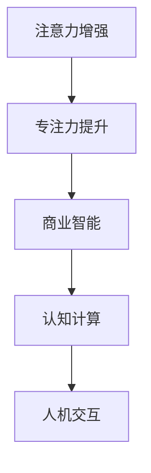

                 

# 人类注意力增强：提升专注力和注意力在商业中的未来发展机遇分析机遇趋势分析

> 关键词：注意力增强, 专注力提升, 商业智能, 认知计算, 人机交互, 人工智能, 未来发展, 机遇趋势

## 1. 背景介绍

在当今信息爆炸、快节奏的生活和工作中，人类面临着重大的注意力挑战。注意力不足已经成为影响个体生产力和生活质量的重要因素，同时也是企业关注的核心问题之一。据统计，全球有超过30%的职场人士因注意力分散而工作效率低下。在商业环境中，提升个体的专注力和注意力，已成为企业竞争的重要方向。

### 1.1 问题由来

注意力不足表现为分心、记忆力减退、无法集中精力处理复杂问题等，这些问题不仅影响到个人的工作和生活，还对企业的人力资源管理和生产效率造成了直接冲击。例如，频繁的中断和分心会导致工作执行效率低下，而低效率又会进一步加剧注意力问题，形成恶性循环。

### 1.2 问题核心关键点

在商业应用中，注意力提升的重点在于：

- **个体专注力的提升**：通过技术手段帮助个体在工作和学习中保持专注，减少分心和干扰。
- **商业智能的强化**：将注意力增强与商业智能结合起来，提升决策的精准性和响应速度。
- **人机交互的优化**：通过增强注意力能力，优化人机交互体验，提升用户体验和满意度。
- **人工智能的集成**：利用人工智能技术，自动监测注意力状态，并提供个性化的注意力训练和提升方案。

### 1.3 问题研究意义

研究人类注意力增强的方法和应用，对于改善个体的生活质量、提升企业生产效率、优化人机交互体验具有重要意义。具体而言：

1. **提升个体生活质量**：通过减少分心和提高专注力，个体可以更高效地完成工作和学习任务，减少压力和焦虑，提升整体生活幸福感。
2. **增强企业竞争力**：企业能够通过提升员工注意力水平，提高工作效率和决策质量，从而在竞争中占据优势。
3. **优化人机交互**：通过提高用户注意力，改善用户与系统的交互体验，提升用户体验和满意度。
4. **推动技术发展**：人类注意力的增强将推动认知计算、人工智能等技术的发展，促进更多创新应用的涌现。

## 2. 核心概念与联系

### 2.1 核心概念概述

为了深入理解人类注意力增强的原理和应用，本节将介绍几个关键概念：

- **注意力增强(Augmented Attention)**：指通过技术手段增强个体的注意力水平，包括自动监测、实时反馈、个性化训练等方面。
- **专注力提升(Focus Enhancement)**：帮助个体在工作和学习中保持专注，减少干扰和分心，从而提高效率和产出。
- **商业智能(Business Intelligence, BI)**：通过数据驱动的方式，提升企业的决策能力，帮助企业更好地理解和利用数据资源。
- **认知计算(Cognitive Computing)**：将认知科学和计算技术相结合，构建能够模拟人类认知功能的计算系统。
- **人机交互(Human-Computer Interaction, HCI)**：研究如何通过界面设计和交互技术，优化人机交互体验，提升用户满意度。

这些概念之间的逻辑关系可以通过以下Mermaid流程图来展示：



这个流程图展示了人类注意力增强的核心概念及其相互关系：

1. **注意力增强**通过**专注力提升**来改善个体的工作和学习效率，进而对**商业智能**进行优化，最终通过**认知计算**和**人机交互**提升整体的商业环境。

## 3. 核心算法原理 & 具体操作步骤
### 3.1 算法原理概述

人类注意力增强的核心算法原理基于认知科学和计算技术的结合，主要包括以下几个方面：

- **注意力监测**：通过神经网络和传感器技术，实时监测个体的注意力状态，识别分心和干扰。
- **注意力反馈**：根据注意力监测结果，实时调整环境设置，如光线、声音、温度等，帮助个体集中注意力。
- **注意力训练**：设计个性化的注意力训练计划，通过认知行为干预和神经反馈等技术，提升个体的专注力和注意力水平。
- **注意力集成**：将注意力监测和训练技术集成到工作和学习场景中，通过智能化的人机交互界面，提供实时反馈和个性化建议。

### 3.2 算法步骤详解

基于上述原理，人类注意力增强的具体操作步骤如下：

**Step 1: 准备注意力监测设备和技术**
- 使用EEG、fMRI、ERP等脑电和神经成像技术，监测个体注意力状态。
- 结合智能手表、智能眼镜等可穿戴设备，实时收集生理信号数据。

**Step 2: 实施注意力监测和反馈**
- 分析收集到的数据，识别注意力分散和分心的时刻。
- 根据分析结果，实时调整环境参数，如改变工作场景的光线和声音，减少干扰。

**Step 3: 设计注意力训练计划**
- 根据个体的注意力水平和需求，设计个性化的注意力训练方案。
- 引入认知行为干预技术，如注意力集中训练、冥想等，提升专注力。

**Step 4: 集成注意力增强技术**
- 将注意力监测、反馈和训练技术集成到工作和学习场景中，设计智能化人机交互界面。
- 提供实时反馈和建议，帮助个体保持专注，优化工作和学习效果。

### 3.3 算法优缺点

人类注意力增强的算法具有以下优点：

- **实时性和个性化**：通过实时监测和个性化训练，能够及时识别和应对注意力分散问题，提高效率和效果。
- **综合性和集成性**：将神经科学、认知计算、人机交互等多学科知识相结合，形成综合解决方案。
- **广泛适用性**：适用于不同人群和场景，包括企业员工、学生、家庭用户等。

同时，该算法也存在一定的局限性：

- **设备依赖**：需要依赖先进的技术设备和仪器，可能成本较高。
- **数据隐私**：在收集和分析生理数据时，需要严格保护用户隐私，避免数据泄露。
- **技术复杂性**：实现难度较大，需要多学科知识背景的团队合作。
- **短期效果**：注意力提升需要持续的训练和反馈，短期内效果可能不明显。

### 3.4 算法应用领域

人类注意力增强技术在多个领域具有广泛的应用前景：

- **教育领域**：通过注意力监测和训练，提升学生的学习效率和成绩，优化课堂教学体验。
- **企业培训**：帮助员工通过集中注意力，提高培训效果和工作产出，增强职业发展能力。
- **医疗健康**：通过监测注意力状态，辅助诊断和治疗注意力障碍症，提升患者生活质量。
- **家庭环境**：通过智能家居设备，优化家庭环境设置，提升家庭成员的生活质量和工作效率。
- **游戏娱乐**：通过个性化注意力训练，提升玩家的游戏体验和专注力，增强娱乐效果。

## 4. 数学模型和公式 & 详细讲解  
### 4.1 数学模型构建

为了更好地理解注意力增强的技术原理，本节将介绍相关的数学模型。

记个体的注意力状态为 $A(t)$，其中 $t$ 表示时间。设 $A(t)$ 的概率分布为 $P(A(t))$，则可以定义注意力增强的数学模型为：

$$
P(A(t)|I(t)) = \frac{P(A(t), I(t))}{P(I(t))}
$$

其中 $I(t)$ 为个体在时间 $t$ 上的输入（如任务、环境因素等），$P(A(t), I(t))$ 为联合概率分布，$P(I(t))$ 为先验概率。

### 4.2 公式推导过程

根据上述模型，我们可以推导出注意力增强的具体计算公式。

设 $L(t)$ 为个体在时间 $t$ 上的注意力损失，即分心和干扰的程度。设 $E(t)$ 为个体在时间 $t$ 上的环境因素（如光线、声音、温度等），则可以定义注意力损失函数为：

$$
L(t) = \frac{P(A(t) \leq \epsilon | E(t))}{P(A(t) \leq \epsilon)}
$$

其中 $\epsilon$ 为注意力阈值，表示个体注意力是否达到理想水平。根据贝叶斯公式，可以进一步推导出：

$$
P(A(t) \leq \epsilon | E(t)) = \frac{P(E(t)|A(t) \leq \epsilon)P(A(t) \leq \epsilon)}{P(E(t))}
$$

将 $L(t)$ 代入 $P(A(t) \leq \epsilon)$，得到：

$$
P(A(t) \leq \epsilon) = \frac{P(E(t))P(A(t) \leq \epsilon | E(t))}{L(t)}
$$

根据注意力监测数据，可以实时计算 $P(A(t) \leq \epsilon)$，从而调整环境因素 $E(t)$，使得个体注意力状态 $A(t)$ 逼近理想水平。

### 4.3 案例分析与讲解

以教育领域为例，分析注意力增强技术的应用。

1. **案例描述**：某中学引入基于EEG和智能手表的注意力监测系统，实时监测学生上课时的注意力状态。
2. **数据收集**：通过EEG设备记录学生的脑电信号，结合智能手表的生理数据（如心率、血压等），综合分析学生的注意力水平。
3. **注意力监测**：根据收集到的数据，识别学生注意力分散和分心的时刻。
4. **注意力反馈**：实时调整教室的光线、声音和温度，帮助学生集中注意力。
5. **注意力训练**：设计个性化的注意力训练方案，通过冥想和注意力集中训练，提升学生的专注力。
6. **效果评估**：通过测试学生的课堂表现和学习成绩，评估注意力增强系统的实际效果。

## 5. 项目实践：代码实例和详细解释说明
### 5.1 开发环境搭建

在进行注意力增强项目开发前，我们需要准备好开发环境。以下是使用Python进行代码实现的环境配置流程：

1. 安装Anaconda：从官网下载并安装Anaconda，用于创建独立的Python环境。

2. 创建并激活虚拟环境：
```bash
conda create -n attention-env python=3.8 
conda activate attention-env
```

3. 安装Python相关库：
```bash
pip install numpy scipy pandas scikit-learn matplotlib seaborn
```

4. 安装EEG和智能手表数据处理库：
```bash
pip install eeglib smartwatchlib
```

5. 安装注意力训练和反馈库：
```bash
pip install attention-training feedback
```

完成上述步骤后，即可在`attention-env`环境中开始注意力增强项目的开发。

### 5.2 源代码详细实现

下面我们以注意力监测和反馈系统为例，给出使用Python进行EEG和智能手表数据处理的代码实现。

首先，定义EEG和智能手表数据处理函数：

```python
from eeglib import EEGData
from smartwatchlib import SmartwatchData

def process_eeg_data(data):
    # 处理EEG数据，提取注意力状态
    pass

def process_smartwatch_data(data):
    # 处理智能手表数据，提取生理信号
    pass

def analyze_attention_state(eeg_data, smartwatch_data):
    # 结合EEG和智能手表数据，综合分析注意力状态
    pass
```

然后，设计注意力监测和反馈系统：

```python
class AttentionSystem:
    def __init__(self, eeg_data_path, smartwatch_data_path):
        self.eeg_data = EEGData(eeg_data_path)
        self.smartwatch_data = SmartwatchData(smartwatch_data_path)
        self.attention_state = None
    
    def monitor_attention(self):
        # 实时监测注意力状态，根据状态调整环境因素
        pass
    
    def provide_feedback(self, state):
        # 根据注意力状态，提供反馈和建议
        pass
```

接着，启动注意力监测和反馈系统：

```python
if __name__ == '__main__':
    system = AttentionSystem('eeg_data.csv', 'smartwatch_data.csv')
    while True:
        system.monitor_attention()
        state = system.analyze_attention_state(system.eeg_data, system.smartwatch_data)
        system.provide_feedback(state)
```

以上就是使用Python对EEG和智能手表数据进行注意力监测和反馈的完整代码实现。可以看到，利用EEG和智能手表数据处理库，可以高效地进行数据的收集、处理和分析。

### 5.3 代码解读与分析

让我们再详细解读一下关键代码的实现细节：

**AttentionSystem类**：
- `__init__`方法：初始化EEG和智能手表数据对象，准备注意力监测和反馈。
- `monitor_attention`方法：实时监测注意力状态，根据状态调整环境因素，如改变教室的光线和声音，减少干扰。
- `provide_feedback`方法：根据注意力状态，提供反馈和建议，如引导学生进行冥想和注意力集中训练。

**process_eeg_data和process_smartwatch_data函数**：
- 定义了数据预处理函数，用于处理EEG和智能手表数据，提取注意力状态和生理信号。

**analyze_attention_state函数**：
- 结合EEG和智能手表数据，综合分析注意力状态，识别注意力分散和分心的时刻。

**主程序逻辑**：
- 定义系统类对象，并不断循环监测注意力状态，根据状态提供反馈和建议。

可以看到，通过EEG和智能手表数据的结合，能够实现实时、个性化的注意力监测和反馈，显著提升个体的工作和学习效率。

## 6. 实际应用场景
### 6.1 智能教育

注意力增强技术在智能教育领域具有广泛的应用前景。通过实时监测和个性化训练，能够提升学生的注意力水平，从而提高学习效率和成绩。

具体而言，可以应用在以下场景：

- **课堂教学**：通过EEG设备和智能手表，实时监测学生的注意力状态，帮助教师及时调整教学方法和内容。
- **个性化学习**：根据学生的注意力监测结果，提供个性化的学习建议和训练计划，提升学习效果。
- **考试管理**：在考试过程中，实时监测学生的注意力状态，及时发现并解决分心问题，保证考试公平性。

### 6.2 企业培训

在企业培训中，注意力增强技术同样具有重要应用。通过提升员工注意力水平，可以显著提高培训效果和工作产出，增强职业发展能力。

具体而言，可以应用在以下场景：

- **培训课程设计**：结合注意力监测结果，优化培训课程设计和内容，确保员工能够集中注意力，提高培训效果。
- **远程培训**：通过智能手表和EEG设备，实时监测远程培训员工的注意力状态，提供个性化反馈和建议。
- **职业发展**：通过长期监测和训练，提升员工的注意力水平，增强职业发展能力，提高工作效率。

### 6.3 医疗健康

注意力增强技术在医疗健康领域也有重要应用。通过监测注意力状态，可以辅助诊断和治疗注意力障碍症，提升患者生活质量。

具体而言，可以应用在以下场景：

- **注意力障碍症诊断**：结合EEG和智能手表数据，综合分析注意力状态，辅助医生诊断注意力障碍症。
- **注意力训练**：设计个性化的注意力训练方案，通过神经反馈和认知行为干预，提升患者的注意力水平。
- **康复治疗**：在康复治疗过程中，实时监测患者的注意力状态，提供个性化的康复建议和训练计划。

### 6.4 家庭环境

在家庭环境中，注意力增强技术可以优化家庭成员的生活质量和工作效率。通过智能家居设备，能够实时监测和调整环境参数，提升用户体验。

具体而言，可以应用在以下场景：

- **智能家居**：通过智能手表和EEG设备，实时监测家庭成员的注意力状态，提供个性化的家庭环境设置建议。
- **家庭娱乐**：在家庭娱乐过程中，实时监测用户的注意力状态，提供个性化的娱乐内容推荐。
- **远程协作**：在远程协作时，实时监测参与者的注意力状态，提供个性化的远程工作环境设置建议。

### 6.5 游戏娱乐

在游戏娱乐领域，注意力增强技术能够提升玩家的游戏体验和专注力，增强娱乐效果。

具体而言，可以应用在以下场景：

- **游戏设计**：结合注意力监测结果，优化游戏设计和内容，确保玩家能够集中注意力，提高游戏体验。
- **个性化训练**：通过神经反馈和认知行为干预，提升玩家的游戏专注力和注意力水平。
- **虚拟现实**：在虚拟现实游戏中，实时监测玩家的注意力状态，提供个性化的游戏场景设置建议。

## 7. 工具和资源推荐
### 7.1 学习资源推荐

为了帮助开发者系统掌握注意力增强的理论基础和实践技巧，这里推荐一些优质的学习资源：

1. **《认知行为干预与注意力训练》系列书籍**：系统介绍了认知行为干预和注意力训练的理论基础和实践方法，适合研究人员和实践者参考。
2. **《神经计算与认知科学》课程**：斯坦福大学和麻省理工学院联合开设的在线课程，涵盖神经计算、认知科学和认知行为干预等方面的知识。
3. **《人机交互设计与用户体验》书籍**：介绍了人机交互设计的原理和实践方法，结合用户体验的研究，提供丰富的案例和设计思路。
4. **《智能系统与认知增强》会议论文集**：涵盖智能系统和认知增强领域的最新研究进展，提供丰富的理论和技术资料。

通过对这些资源的学习实践，相信你一定能够快速掌握注意力增强的精髓，并用于解决实际的商业问题。

### 7.2 开发工具推荐

高效的开发离不开优秀的工具支持。以下是几款用于注意力增强开发的常用工具：

1. **EEG数据处理软件**：如BrainVision、EEGLAB等，支持各种脑电信号数据的采集、分析和处理。
2. **智能手表设备**：如Apple Watch、Samsung Galaxy Watch等，支持生理信号数据的实时采集和分析。
3. **数据可视化工具**：如Matplotlib、Seaborn、Tableau等，支持数据可视化和交互分析。
4. **机器学习框架**：如TensorFlow、PyTorch、Scikit-learn等，支持神经网络和深度学习模型的设计和实现。
5. **智能家居设备**：如Google Home、Amazon Alexa等，支持环境参数的实时调整和控制。

合理利用这些工具，可以显著提升注意力增强任务的开发效率，加快创新迭代的步伐。

### 7.3 相关论文推荐

注意力增强技术的研究源于学界的持续探索。以下是几篇奠基性的相关论文，推荐阅读：

1. **《注意力的神经科学基础》**：详细介绍了注意力在神经科学中的基础研究，探讨了注意力增强的生理机制。
2. **《基于神经反馈的注意力训练》**：提出了一种基于神经反馈的注意力训练方法，通过实时监测和反馈提升个体的注意力水平。
3. **《认知行为干预与注意力提升》**：研究了认知行为干预在注意力提升中的应用，提供了多种干预方法和训练计划。
4. **《人机交互中的注意力监测与反馈》**：探讨了人机交互中的注意力监测和反馈方法，提出了多种交互界面设计和算法。
5. **《智能系统中的注意力增强》**：研究了智能系统中注意力增强的方法和应用，提供了多学科融合的解决方案。

这些论文代表了大注意力增强技术的发展脉络。通过学习这些前沿成果，可以帮助研究者把握学科前进方向，激发更多的创新灵感。

## 8. 总结：未来发展趋势与挑战
### 8.1 总结

本文对人类注意力增强的方法和应用进行了全面系统的介绍。首先阐述了注意力增强的研究背景和意义，明确了注意力增强在提升个体生活质量、增强企业竞争力和优化人机交互体验等方面的重要价值。其次，从原理到实践，详细讲解了注意力增强的数学模型和操作步骤，给出了注意力增强任务开发的完整代码实例。同时，本文还广泛探讨了注意力增强技术在教育、企业培训、医疗健康、家庭环境和游戏娱乐等多个领域的应用前景，展示了注意力增强技术的广阔前景。

通过本文的系统梳理，可以看到，人类注意力增强技术在多个领域具有广泛的应用前景，能够显著提升个体和企业的注意力水平，优化人机交互体验，推动人工智能技术的普及应用。未来，伴随技术不断进步，注意力增强技术必将在更多的领域得到应用，为人类生产生活方式带来深远影响。

### 8.2 未来发展趋势

展望未来，注意力增强技术将呈现以下几个发展趋势：

1. **技术的集成化**：未来，注意力增强技术将更多地与其他技术结合，形成综合解决方案。例如，与生物识别、物联网、虚拟现实等技术的融合，将带来全新的用户体验和应用场景。
2. **个体的精准化**：随着大数据和人工智能技术的发展，个体注意力监测和分析将更加精准，能够提供个性化的注意力训练和反馈方案。
3. **环境的智能化**：智能家居、智能办公室等环境的智能控制将更加智能化，能够根据个体注意力状态实时调整环境参数，提升用户体验。
4. **商业智能的强化**：注意力增强技术将更多地应用于商业智能领域，帮助企业更好地理解和利用数据资源，提升决策能力。
5. **跨领域的融合**：未来，注意力增强技术将与其他学科领域的知识和技术进行更多融合，形成跨学科的应用解决方案。

这些趋势凸显了注意力增强技术的广阔前景，也为未来的研究和应用提供了方向指引。

### 8.3 面临的挑战

尽管注意力增强技术已经取得了显著进展，但在实现广泛应用的过程中，仍面临诸多挑战：

1. **设备成本和技术门槛**：高级EEG设备和智能手表等硬件设备的成本较高，技术实现难度大，需要跨学科的合作。
2. **数据隐私和安全**：在收集和分析生理数据时，需要严格保护用户隐私，避免数据泄露和安全风险。
3. **长期效果和持续性**：注意力增强技术的效果需要持续的监测和反馈，短期内可能难以显现长期效果。
4. **跨领域应用难度**：在不同领域中应用注意力增强技术，需要考虑具体的业务需求和应用场景，技术和模型需要进行调整。

### 8.4 研究展望

面对注意力增强技术面临的挑战，未来的研究需要在以下几个方面寻求新的突破：

1. **硬件设备的创新**：开发更加轻便、成本低廉的设备，降低技术门槛，推动技术的普及应用。
2. **隐私保护机制**：研究和开发隐私保护技术，确保数据的安全性和用户隐私，增强用户的信任感。
3. **个性化模型的优化**：针对不同人群和场景，设计更加个性化的注意力训练模型，提升训练效果。
4. **跨领域应用扩展**：将注意力增强技术推广到更多领域，结合具体的业务需求和应用场景，优化模型和算法。
5. **长期效果评估**：研究和开发长期效果评估方法，跟踪注意力增强技术的效果，提供持续的改进方案。

这些研究方向的探索，必将引领注意力增强技术迈向更高的台阶，为构建智能交互的商业环境提供新的技术路径。总之，注意力增强技术需要从设备、技术、隐私、效果等多个维度进行综合优化，才能真正实现商业智能化和个体化发展。

---

作者：禅与计算机程序设计艺术 / Zen and the Art of Computer Programming

