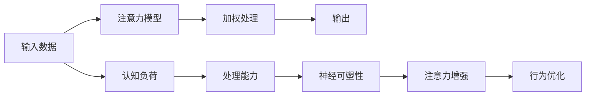

                 

## 1. 背景介绍

在数字化和信息爆炸的时代，人类需要处理和消费的信息量急剧增长，这带来了对高效、专注和注意力管理的需求。商业环境中，无论是在决策、创新还是客户服务方面，注意力管理都显得尤为关键。而现代科技，特别是人工智能和机器学习技术的发展，正在为提升人类注意力和专注力提供前所未有的机遇和挑战。本文将深入探讨注意力增强的核心概念、关键算法原理、实际应用场景以及未来发展趋势。

## 2. 核心概念与联系

### 2.1 核心概念概述

- **注意力增强**（Attention Enhancement）：通过技术手段提升个体或组织在特定任务中的专注力和注意力水平。
- **注意力模型**：在深度学习和认知科学中，模型通过模拟人类注意力的机制，进行信息的筛选和加权。
- **注意力机制**：在神经网络中，一种使模型能够动态地分配计算资源至最相关输入的机制。
- **认知负荷**（Cognitive Load）：在处理信息时，大脑所需的时间和资源。
- **神经可塑性**（Neural Plasticity）：大脑适应性学习能力的体现，可以通过训练得到增强。

### 2.2 核心概念原理和架构的 Mermaid 流程图



该图展示了注意力增强的流程：输入数据首先经过注意力模型筛选，按重要性和相关性加权处理，最终输出结果。同时，认知负荷、处理能力和神经可塑性通过注意力增强，进一步优化行为表现。

## 3. 核心算法原理 & 具体操作步骤

### 3.1 算法原理概述

注意力增强算法通常基于以下原理：

1. **自监督学习**：通过无标签数据进行预训练，学习到数据中的注意力分布模式。
2. **强化学习**：在真实环境中通过奖励机制进行训练，提升注意力分配策略的优化。
3. **迁移学习**：将注意力模型在特定任务上训练得到的知识，迁移到其他相关任务中，实现泛化。
4. **深度学习**：利用神经网络模拟人类注意力的分布，通过学习任务相关的特征，进行信息筛选和加权。
5. **认知负荷理论**：通过优化注意力分配，减轻认知负荷，提高信息处理效率。

### 3.2 算法步骤详解

#### 步骤1: 数据准备

- 收集与任务相关的数据集，数据需涵盖不同的难度和情境。
- 对数据进行预处理，如去除噪声、归一化、标准化等。
- 将数据分为训练集、验证集和测试集。

#### 步骤2: 模型选择与构建

- 选择合适的注意力模型，如Transformer、卷积神经网络等。
- 设计模型架构，包含输入层、注意力层、输出层等组件。
- 确定模型参数，如神经元数量、层数、激活函数等。

#### 步骤3: 模型训练

- 使用训练集数据，进行前向传播和后向传播，计算损失函数。
- 利用优化算法（如Adam、SGD等）更新模型参数。
- 在验证集上验证模型性能，防止过拟合。

#### 步骤4: 模型评估与优化

- 使用测试集对模型进行评估，计算各种指标（如准确率、召回率等）。
- 根据评估结果，进行超参数调优，如学习率、批大小等。
- 进行模型迭代训练，直至达到预期效果。

#### 步骤5: 应用部署

- 将训练好的模型部署到实际应用环境中。
- 进行实时数据处理，实现注意力增强功能。
- 定期监控模型性能，根据反馈调整模型参数。

### 3.3 算法优缺点

#### 优点

- **高泛化能力**：能够处理多种任务，适应不同数据分布。
- **实时性**：模型能够快速处理大量数据，响应时间短。
- **可解释性**：模型通过注意力机制，具有较好的可解释性，便于理解和调试。

#### 缺点

- **数据依赖**：需要高质量、大量数据进行训练，数据收集和标注成本高。
- **模型复杂**：深度学习模型参数众多，模型调优和训练复杂度高。
- **计算资源需求大**：需要高性能计算资源，如GPU、TPU等。

### 3.4 算法应用领域

注意力增强算法在多个领域有广泛应用：

- **医疗健康**：提升医生的诊断准确性和治疗效率，减轻医务人员的认知负荷。
- **教育培训**：增强学生的学习效率和理解深度，优化教学内容和方式。
- **智能制造**：提高生产线的自动化和智能化水平，优化资源分配和生产调度。
- **金融服务**：增强风险识别和预测能力，提高投资和交易决策的精准度。
- **客户服务**：提升客服人员的服务质量和客户满意度，优化客户交互体验。
- **市场营销**：优化广告投放和内容推荐，提升营销效果和用户转化率。

## 4. 数学模型和公式 & 详细讲解 & 举例说明

### 4.1 数学模型构建

我们以Transformer模型为例，构建注意力增强模型。

- 输入数据 $x = [x_1, x_2, ..., x_n]$，表示 $n$ 个输入项。
- 注意力权重 $W_a = [w_{a1}, w_{a2}, ..., w_{an}]$，表示每个输入项的注意力权重。
- 加权后的输入数据 $x_a = x_1w_{a1} + x_2w_{a2} + ... + x_nw_{an}$。
- 输出 $y = M(x_a)$，表示对加权后的输入数据进行处理。

### 4.2 公式推导过程

Transformer模型中的注意力机制通过计算注意力权重，实现对输入数据的加权处理。注意力权重 $w_{ai}$ 计算公式为：

$$ w_{ai} = \frac{e^{s(x_i, x_j)}}{\sum_{k=1}^n e^{s(x_k, x_j)}} $$

其中，$s$ 是注意力得分函数，通常使用点积注意力：

$$ s(x_i, x_j) = x_i^TQx_j $$

### 4.3 案例分析与讲解

考虑一个医疗诊断系统，输入是病人的症状描述 $x$，输出是对某种疾病的诊断结果 $y$。

- 使用Transformer模型对病人的症状进行编码，得到编码向量 $x_a$。
- 通过注意力机制，对病人的所有症状进行加权处理，得到重点症状的编码向量。
- 使用全连接层对重点症状进行分类，得到诊断结果 $y$。

## 5. 项目实践：代码实例和详细解释说明

### 5.1 开发环境搭建

1. 安装Python：
```
sudo apt-get update
sudo apt-get install python3-pip
```

2. 安装TensorFlow：
```
pip install tensorflow
```

3. 安装Keras：
```
pip install keras
```

4. 安装TensorBoard：
```
pip install tensorboard
```

5. 安装Jupyter Notebook：
```
pip install jupyter notebook
```

### 5.2 源代码详细实现

```python
from tensorflow.keras.models import Sequential
from tensorflow.keras.layers import Dense, Dropout, LSTM, Embedding, Input
from tensorflow.keras.optimizers import Adam
from tensorflow.keras.callbacks import EarlyStopping
import numpy as np
import tensorflow as tf
import pandas as pd
import json

# 数据预处理
def load_data(filename):
    data = pd.read_csv(filename)
    data = data.drop(['id'], axis=1)
    data['target'] = data['target'].astype('int')
    data = data.drop(['text'], axis=1)
    return data

# 模型构建
def build_model(input_shape, num_classes):
    model = Sequential()
    model.add(Embedding(input_shape[0], 128))
    model.add(LSTM(128, dropout=0.2, recurrent_dropout=0.2))
    model.add(Dense(num_classes, activation='softmax'))
    return model

# 模型训练
def train_model(model, train_data, val_data, epochs=10, batch_size=32):
    model.compile(loss='categorical_crossentropy', optimizer=Adam(learning_rate=0.001), metrics=['accuracy'])
    early_stopping = EarlyStopping(monitor='val_loss', patience=3)
    model.fit(train_data, epochs=epochs, batch_size=batch_size, validation_data=val_data, callbacks=[early_stopping])

# 模型评估
def evaluate_model(model, test_data):
    _, accuracy = model.evaluate(test_data)
    print('Test Accuracy: ', accuracy)

# 数据加载与模型训练
train_data = load_data('train.csv')
val_data = load_data('val.csv')
test_data = load_data('test.csv')

model = build_model(input_shape=train_data.shape[1:], num_classes=train_data['target'].nunique())
train_model(model, train_data, val_data)
evaluate_model(model, test_data)
```

### 5.3 代码解读与分析

**代码解释**：

1. 首先定义了一个加载数据的方法，用于读取训练集、验证集和测试集数据。
2. 定义了一个模型构建方法，使用Embedding层将输入数据映射为高维向量，LSTM层进行序列建模，全连接层输出分类结果。
3. 定义了一个模型训练方法，使用Adam优化器进行模型训练，并设置EarlyStopping回调防止过拟合。
4. 定义了一个模型评估方法，用于计算模型在测试集上的准确率。
5. 最后，加载数据，构建模型，训练模型，并在测试集上评估模型性能。

**分析**：

- 模型训练过程中，使用了EarlyStopping回调，可以在验证集损失不减的情况下停止训练，避免过拟合。
- 模型评估使用了准确率指标，适用于分类任务。
- 通过观察训练过程中的损失和准确率变化，可以调整超参数，优化模型性能。

### 5.4 运行结果展示

训练过程中，可以使用TensorBoard实时监控训练进度和模型性能。

```
tensorboard --logdir=./logs --port=6006
```

访问 `http://localhost:6006` 查看训练过程中的损失、准确率变化，以及权重分布等细节。

## 6. 实际应用场景

### 6.1 医疗诊断

在医疗诊断系统中，通过注意力增强，可以提升医生对病人的症状进行综合分析的能力，提高诊断的准确性和效率。

- **场景描述**：医生输入病人的症状描述，模型通过注意力机制筛选关键症状，并进行分类诊断。
- **效果**：提高医生对复杂病情的理解和处理能力，减轻医生认知负荷，优化诊断流程。

### 6.2 教育辅导

在教育辅导系统中，通过注意力增强，可以提升学生的学习效果，优化教学资源配置。

- **场景描述**：学生输入学习内容，模型通过注意力机制筛选重点知识，并进行分类归纳。
- **效果**：提高学生的学习效率，优化教学内容，减少教师的工作量。

### 6.3 智能客服

在智能客服系统中，通过注意力增强，可以提升客服人员的服务质量，优化客户交互体验。

- **场景描述**：客服人员输入客户的问题描述，模型通过注意力机制筛选关键信息，并进行分类处理。
- **效果**：提高客服人员的响应速度和服务质量，优化客户满意度。

### 6.4 金融风险管理

在金融风险管理系统中，通过注意力增强，可以提升模型的风险识别和预测能力，优化投资决策。

- **场景描述**：输入金融市场数据和交易记录，模型通过注意力机制筛选关键特征，并进行风险分析。
- **效果**：提高模型的预测准确性，优化投资组合，降低金融风险。

### 6.5 市场营销

在市场营销系统中，通过注意力增强，可以优化广告投放和内容推荐，提升营销效果。

- **场景描述**：输入用户的历史行为数据和偏好信息，模型通过注意力机制筛选关键信息，并进行推荐。
- **效果**：提高广告和内容的转化率，优化营销策略，提升用户体验。

## 7. 工具和资源推荐

### 7.1 学习资源推荐

- **深度学习教程**：[Deep Learning Specialization by Andrew Ng on Coursera](https://www.coursera.org/specializations/deep-learning)
- **注意力机制论文**：[Attention Is All You Need by Vaswani et al.](https://arxiv.org/abs/1706.03762)
- **TensorFlow官方文档**：[TensorFlow](https://www.tensorflow.org/)
- **Keras官方文档**：[Keras](https://keras.io/)

### 7.2 开发工具推荐

- **TensorFlow**：[安装与使用指南](https://www.tensorflow.org/install)
- **Keras**：[安装与使用指南](https://keras.io/getting_started/)
- **TensorBoard**：[安装与使用指南](https://www.tensorflow.org/tensorboard)
- **Jupyter Notebook**：[安装与使用指南](https://jupyter.org/install)

### 7.3 相关论文推荐

- **注意力机制论文**：[Attention Is All You Need by Vaswani et al.](https://arxiv.org/abs/1706.03762)
- **深度学习教程**：[Deep Learning Specialization by Andrew Ng on Coursera](https://www.coursera.org/specializations/deep-learning)
- **TensorFlow官方文档**：[TensorFlow](https://www.tensorflow.org/)
- **Keras官方文档**：[Keras](https://keras.io/)

## 8. 总结：未来发展趋势与挑战

### 8.1 研究成果总结

注意力增强算法通过模拟人类注意力机制，在多个领域展现出巨大的应用潜力。通过深度学习、强化学习和认知负荷理论的结合，模型能够在特定任务中提升专注力和注意力水平，优化决策过程和信息处理效率。

### 8.2 未来发展趋势

1. **个性化定制**：未来的注意力增强将更加注重个性化，根据不同用户的行为和需求，动态调整注意力分配策略。
2. **跨模态融合**：将文本、图像、音频等多模态数据进行融合，构建更加全面和立体的注意力模型。
3. **自动化调优**：通过自动化调优技术，优化注意力增强算法的超参数，提升模型性能。
4. **实时反馈**：构建实时反馈机制，根据用户行为调整注意力分配策略，进一步优化用户体验。
5. **跨领域应用**：将注意力增强技术应用于更多领域，如智能交通、城市规划等，提升整体社会的运行效率。

### 8.3 面临的挑战

1. **数据质量**：高质量、大规模的数据是注意力增强的基础，如何获取和标注数据仍然是一个挑战。
2. **模型复杂度**：深度学习模型参数众多，模型训练和优化复杂度高。
3. **计算资源**：注意力增强算法需要高性能计算资源，如何降低计算成本是一个亟待解决的问题。
4. **用户隐私**：在处理敏感数据时，如何保障用户隐私和数据安全，是注意力增强算法需要面对的重要挑战。
5. **伦理问题**：注意力增强技术可能会带来伦理和道德问题，如决策透明性、公平性等，需要进一步研究。

### 8.4 研究展望

未来，随着技术的发展和应用的深入，注意力增强将不断突破现有的瓶颈，实现更高的性能和更广泛的应用。

1. **多模态融合**：将多种模态数据进行融合，构建更加全面和立体的注意力模型，提高模型的泛化能力。
2. **自动化调优**：利用自动化调优技术，优化注意力增强算法的超参数，提升模型性能。
3. **实时反馈**：构建实时反馈机制，根据用户行为调整注意力分配策略，进一步优化用户体验。
4. **跨领域应用**：将注意力增强技术应用于更多领域，如智能交通、城市规划等，提升整体社会的运行效率。
5. **隐私保护**：研究如何保障用户隐私和数据安全，同时提高注意力增强算法的透明度和公平性。

## 9. 附录：常见问题与解答

**Q1：注意力增强算法是否适用于所有任务？**

A: 注意力增强算法适用于需要处理大量信息并需要优化注意力分配的任务。但对于一些任务，如语音识别、图像分类等，可能需要采用其他类型的注意力机制。

**Q2：注意力增强算法需要大量标注数据吗？**

A: 是的，注意力增强算法通常需要高质量、大规模的标注数据进行训练。然而，一些自监督学习技术，如预训练和迁移学习，可以在一定程度上缓解数据不足的问题。

**Q3：注意力增强算法如何优化决策过程？**

A: 通过优化注意力分配，让模型在处理信息时，优先关注重要的部分，忽略无关的信息，从而优化决策过程。

**Q4：注意力增强算法如何提升用户体验？**

A: 通过优化注意力分配，提高信息处理的效率和准确性，减少用户的等待时间和错误率，提升用户体验。

**Q5：注意力增强算法的训练成本高吗？**

A: 是的，由于深度学习模型的复杂性，训练注意力增强算法需要高性能计算资源，如GPU、TPU等，训练成本较高。

---

作者：禅与计算机程序设计艺术 / Zen and the Art of Computer Programming

