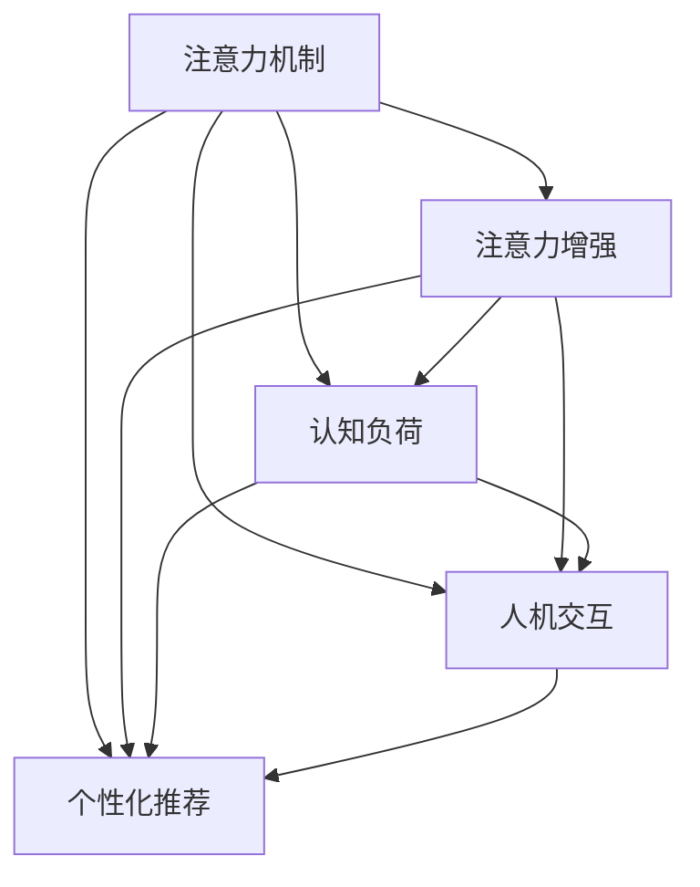

                 

# 人类注意力增强：提升专注力和注意力在商业中的未来发展机遇趋势分析

> 关键词：注意力增强, 专注力提升, 商业应用, 未来趋势, 人工智能, 机器学习, 注意力机制, 计算广告, 推荐系统, 人机交互

## 1. 背景介绍

### 1.1 问题由来
随着信息技术的飞速发展，人们生活和工作中的信息环境变得越来越复杂和多样化。无论是社交媒体上的海量信息、电子邮件中的繁琐邮件，还是在线广告中的密集干扰，都使得人们难以集中注意力，完成高效的工作。尤其是面对日益增长的海量数据，如何提升人类注意力，成为现代商业环境中亟需解决的问题。

现代商业中，企业的竞争不仅仅是产品和服务，而是依赖于对于目标消费者注意力的精准把握。企业需要借助先进的技术手段，提升消费者的注意力，进而提升品牌影响力、销售额和市场份额。因此，注意力增强技术在商业中具有重要应用价值。

### 1.2 问题核心关键点
提升专注力和注意力增强，一直是心理学和认知科学领域的研究热点，其核心问题可以概括为：

- **注意力分配**：在复杂的信息环境中，如何高效地分配注意力资源。
- **认知负荷**：如何在保证信息吸收效率的同时，减少认知负担。
- **信息过滤**：如何筛选关键信息，屏蔽干扰信息。
- **人机交互**：如何实现更自然、更高效的人机交互。

这些问题都可以通过注意力增强技术来解决，而注意力增强在商业中的应用，则聚焦于以下几个方面：

1. **个性化推荐**：基于用户行为和兴趣，提供更符合其需求的个性化信息。
2. **计算广告**：通过用户注意力的精准计量，实现更有效的广告投放。
3. **客户服务**：提升客户服务的互动性，提高客户满意度和忠诚度。
4. **智能办公**：通过智能化的工作环境，提升工作效率和质量。

## 2. 核心概念与联系

### 2.1 核心概念概述

为了更好地理解注意力增强技术及其在商业中的应用，本节将介绍几个密切相关的核心概念：

- **注意力机制**：指在处理序列数据时，通过计算每个时间步的注意力权重，动态地调整模型对不同时间步输入的关注程度。注意力机制常用于机器翻译、语音识别、图像生成等任务。
- **注意力增强**：指通过机器学习和人工智能技术，增强人类在复杂环境中的注意力分配能力。具体应用包括个性化推荐、计算广告等。
- **认知负荷**：指完成特定任务所需的精神努力和资源消耗。注意力增强技术通过优化信息结构和交互方式，降低认知负荷。
- **人机交互**：指人类与机器进行信息交互的过程。注意力增强通过提升交互质量，增强用户体验。
- **个性化推荐**：基于用户兴趣和行为，提供符合用户需求的信息推荐，减少用户的信息过载。

这些核心概念之间的逻辑关系可以通过以下Mermaid流程图来展示：



这个流程图展示了注意力增强技术在商业应用中的关键关联：

1. 注意力增强以注意力机制为核心，通过计算注意力权重，优化信息处理。
2. 认知负荷作为注意力增强的重要目标，通过减少认知负担提升用户体验。
3. 人机交互作为注意力增强的重要应用场景，通过提升互动性增强用户粘性。
4. 个性化推荐作为注意力增强的主要应用，通过精准匹配用户需求提升服务效果。

## 3. 核心算法原理 & 具体操作步骤
### 3.1 算法原理概述

注意力增强技术在商业中的核心在于通过计算注意力权重，优化信息处理和交互方式，提升用户体验。其基本原理如下：

1. **序列建模**：将信息序列输入到模型中，通过自注意力机制或交叉注意力机制，计算出每个时间步的注意力权重。
2. **动态过滤**：根据注意力权重，动态过滤关键和非关键信息，减少用户认知负荷。
3. **个性化推荐**：基于用户的历史行为和兴趣，计算注意力权重，生成个性化推荐结果。
4. **交互优化**：通过优化交互界面，增强用户与系统之间的互动性。

### 3.2 算法步骤详解

以下是对注意力增强技术在商业应用中常见算法步骤的详细讲解：

**Step 1: 数据准备与预处理**
- 收集用户行为数据、反馈数据、历史数据等。
- 对数据进行清洗、归一化、特征工程等预处理。
- 划分训练集、验证集和测试集。

**Step 2: 模型设计**
- 设计注意力机制，如自注意力、交叉注意力等。
- 设计目标函数，如最大化用户满意度、最大化点击率等。
- 设计评价指标，如准确率、召回率、点击率、转化率等。

**Step 3: 模型训练**
- 使用优化算法（如Adam、SGD等），最小化损失函数。
- 设置学习率、迭代次数、正则化参数等超参数。
- 使用交叉验证等方法进行模型调优。

**Step 4: 模型评估与优化**
- 在测试集上评估模型性能。
- 根据评估结果进行模型优化。
- 反复迭代训练和评估，直到模型达到满意效果。

**Step 5: 模型部署与应用**
- 将训练好的模型部署到生产环境中。
- 实时收集用户反馈，动态优化模型。
- 将注意力增强技术应用于个性化推荐、计算广告等场景。

### 3.3 算法优缺点

注意力增强技术在商业应用中具有以下优点：
1. **个性化推荐**：能够根据用户的历史行为和兴趣，生成个性化推荐结果，提升用户体验。
2. **计算广告**：通过精确计量用户注意力，实现更有效的广告投放，提高广告ROI。
3. **客户服务**：提升客户服务的互动性和响应速度，提高客户满意度和忠诚度。
4. **智能办公**：通过优化工作环境，提升工作效率和质量，减少人力成本。

同时，该技术也存在一定的局限性：
1. **数据依赖**：依赖高质量的用户数据，数据不足或质量较差，会严重影响模型性能。
2. **隐私风险**：大量收集用户行为数据，可能引发隐私问题。
3. **模型复杂度**：复杂的模型结构和算法，可能导致计算成本和存储成本较高。
4. **过拟合问题**：模型过度拟合训练数据，可能影响泛化性能。
5. **算法透明性**：部分算法的原理较为复杂，难以解释和调试。

尽管存在这些局限性，但注意力增强技术在商业中已经展现出了巨大的应用潜力，未来仍需通过更多的研究优化，以更好地服务商业需求。

### 3.4 算法应用领域

注意力增强技术在商业中广泛应用于以下几个领域：

1. **个性化推荐**：如电商平台的商品推荐、视频网站的个性化视频推荐等。
2. **计算广告**：如搜索引擎广告、社交媒体广告等。
3. **客户服务**：如智能客服、在线咨询等。
4. **智能办公**：如智能会议系统、智能文档处理等。

除了这些经典应用，未来注意力增强技术还将进一步拓展到更多领域，如智能家居、智慧城市等，为商业应用带来新的变革。

## 4. 数学模型和公式 & 详细讲解 & 举例说明

### 4.1 数学模型构建

在注意力增强技术中，通常采用Transformer结构进行序列建模，其核心在于计算每个时间步的注意力权重，并据此生成输出结果。以自注意力机制为例，其数学模型可以表示为：

$$
\text{Attention}(Q,K,V) = \text{Softmax}(QK^T / \sqrt{d_k})V
$$

其中，$Q$、$K$、$V$分别为查询、键和值向量，$d_k$为键向量的维度。

### 4.2 公式推导过程

假设输入序列为$x_1, x_2, ..., x_T$，目标为生成输出序列$y_1, y_2, ..., y_T$。通过自注意力机制计算注意力权重$\alpha_{ij}$，具体推导如下：

1. 计算查询向量：$Q = XW_Q$
2. 计算键向量：$K = XW_K$
3. 计算值向量：$V = XW_V$
4. 计算注意力权重：$\alpha_{ij} = \text{Softmax}(QK^T / \sqrt{d_k})$
5. 生成输出向量：$y_j = \sum_{i=1}^T \alpha_{ij}V_i$

其中，$X$为输入矩阵，$W_Q, W_K, W_V$为线性变换矩阵。

### 4.3 案例分析与讲解

以电商平台的个性化推荐为例，分析注意力增强技术的具体应用过程：

1. 数据准备：收集用户浏览、购买、评价等行为数据，提取特征如商品ID、评分、类别等。
2. 模型设计：设计注意力机制，计算用户对各个商品的注意力权重。
3. 模型训练：使用用户的历史行为数据训练模型，最小化预测结果与实际行为之间的差距。
4. 模型评估：在测试集上评估模型性能，调整模型参数。
5. 模型部署：将训练好的模型应用于实时推荐系统，提供个性化商品推荐。

具体推导如下：

假设用户的历史行为数据为$X = (x_1, x_2, ..., x_T)$，每个时间步$x_i$表示一个行为事件。商品库中商品的特征向量为$V = (v_1, v_2, ..., v_M)$。

1. 计算查询向量$Q = XW_Q$
2. 计算键向量$K = XW_K$
3. 计算值向量$V = XW_V$
4. 计算注意力权重$\alpha_{ij} = \text{Softmax}(QK^T / \sqrt{d_k})$
5. 生成推荐向量$y_j = \sum_{i=1}^T \alpha_{ij}v_i$
6. 将推荐向量映射到商品库，生成推荐结果。

## 5. 项目实践：代码实例和详细解释说明
### 5.1 开发环境搭建

在进行注意力增强技术项目实践前，需要准备相应的开发环境。以下是使用Python进行TensorFlow开发的详细流程：

1. 安装Anaconda：从官网下载并安装Anaconda，用于创建独立的Python环境。

2. 创建并激活虚拟环境：
```bash
conda create -n tf-env python=3.8 
conda activate tf-env
```

3. 安装TensorFlow：根据CUDA版本，从官网获取对应的安装命令。例如：
```bash
pip install tensorflow
```

4. 安装各类工具包：
```bash
pip install numpy pandas scikit-learn matplotlib tqdm jupyter notebook ipython
```

完成上述步骤后，即可在`tf-env`环境中开始注意力增强技术项目实践。

### 5.2 源代码详细实现

以下是一个简单的注意力增强技术在电商个性化推荐中的应用示例，使用TensorFlow实现。

```python
import tensorflow as tf
import numpy as np

# 假设用户行为数据
user_behavior = np.array([[1, 2, 3, 4, 5], [6, 7, 8, 9, 10]])

# 假设商品特征向量
item_features = np.array([[1, 2, 3], [4, 5, 6], [7, 8, 9], [10, 11, 12]])

# 定义模型参数
W_Q = tf.Variable(tf.random.normal([5, 10]))
W_K = tf.Variable(tf.random.normal([5, 10]))
W_V = tf.Variable(tf.random.normal([5, 10]))

# 定义注意力机制函数
def attention(X, W_Q, W_K, W_V):
    Q = tf.matmul(X, W_Q)
    K = tf.matmul(X, W_K)
    V = tf.matmul(X, W_V)
    attention_weights = tf.nn.softmax(tf.matmul(Q, K, transpose_b=True) / tf.math.sqrt(tf.cast(tf.shape(K)[-1], tf.float32)))
    attention_values = tf.matmul(attention_weights, V)
    return attention_values

# 调用注意力机制函数
attention_results = attention(user_behavior, W_Q, W_K, W_V)
print(attention_results)
```

以上代码实现了简单的自注意力机制，通过计算用户行为数据的注意力权重，生成推荐向量。

### 5.3 代码解读与分析

以下是关键代码的详细解读：

**attention函数**：
- 定义输入数据X，线性变换矩阵W_Q、W_K、W_V。
- 计算查询向量Q、键向量K、值向量V。
- 计算注意力权重$\alpha_{ij}$。
- 计算注意力值$\alpha_{ij}v_i$，生成推荐向量。

**模型参数**：
- W_Q、W_K、W_V为线性变换矩阵，用于将输入数据映射到高维空间。

**主程序**：
- 模拟用户行为数据和商品特征向量。
- 定义模型参数。
- 调用注意力机制函数，计算推荐向量。

注意，实际应用中，注意力增强技术通常需要更复杂的模型结构和优化算法，如基于Transformer的注意力机制、深度学习框架中的优化器、正则化等。

## 6. 实际应用场景
### 6.1 智能客服系统

基于注意力增强技术的智能客服系统，能够提升客户服务的互动性和响应速度，提高客户满意度和忠诚度。通过计算用户和客服交互中的注意力权重，智能客服系统能够自动理解用户问题，并根据历史数据和实时数据，动态调整回答策略。

### 6.2 金融舆情监测

金融领域需要实时监测市场舆论动向，以便及时应对负面信息传播，规避金融风险。通过计算金融领域相关的新闻、报道、评论等文本数据，并对其进行主题标注和情感标注，注意力增强技术能够自动判断文本属于何种主题，情感倾向是正面、中性还是负面。将注意力增强模型应用到实时抓取的网络文本数据，就能够自动监测不同主题下的情感变化趋势，一旦发现负面信息激增等异常情况，系统便会自动预警，帮助金融机构快速应对潜在风险。

### 6.3 个性化推荐系统

当前的推荐系统往往只依赖用户的历史行为数据进行物品推荐，无法深入理解用户的真实兴趣偏好。基于注意力增强技术的个性化推荐系统，能够从用户行为数据中准确把握用户的兴趣点，从而提供更加精准、多样的推荐内容。

在实践中，可以收集用户浏览、点击、评价等行为数据，提取和用户交互的物品标题、描述、标签等文本内容。将文本内容作为模型输入，用户的后续行为（如是否点击、购买等）作为监督信号，在此基础上训练注意力增强模型。训练后的模型能够从文本内容中准确把握用户的兴趣点，并在推荐时考虑这些兴趣点，提供个性化推荐结果。

### 6.4 未来应用展望

随着注意力增强技术的不断发展，未来的应用领域将更加广泛。

1. **智慧医疗**：通过计算患者的病历数据和医疗行为，生成个性化治疗方案，提升医疗服务质量。
2. **智能教育**：通过计算学生的学习数据和反馈信息，提供个性化的学习计划和辅导，提升教育效果。
3. **智慧城市**：通过计算城市运行数据，优化城市管理决策，提高城市运行效率和居民生活质量。
4. **智能交通**：通过计算交通数据和出行行为，优化交通流量，提升出行效率和安全性。

## 7. 工具和资源推荐
### 7.1 学习资源推荐

为了帮助开发者系统掌握注意力增强技术的理论基础和实践技巧，这里推荐一些优质的学习资源：

1. 《Attention is All You Need》系列博文：由大模型技术专家撰写，深入浅出地介绍了Transformer原理、注意力机制等前沿话题。

2. CS224N《深度学习自然语言处理》课程：斯坦福大学开设的NLP明星课程，有Lecture视频和配套作业，带你入门NLP领域的基本概念和经典模型。

3. 《Natural Language Processing with Attention》书籍：由注意力机制的提出者Yoshua Bengio所著，全面介绍了注意力机制在NLP中的各种应用。

4. HuggingFace官方文档：Transformer库的官方文档，提供了海量预训练模型和完整的注意力增强技术样例代码，是上手实践的必备资料。

5. CLUE开源项目：中文语言理解测评基准，涵盖大量不同类型的中文NLP数据集，并提供了基于注意力增强技术的baseline模型，助力中文NLP技术发展。

通过对这些资源的学习实践，相信你一定能够快速掌握注意力增强技术的精髓，并用于解决实际的NLP问题。

### 7.2 开发工具推荐

高效的开发离不开优秀的工具支持。以下是几款用于注意力增强技术开发的常用工具：

1. TensorFlow：由Google主导开发的开源深度学习框架，生产部署方便，适合大规模工程应用。同样有丰富的预训练语言模型资源。

2. PyTorch：基于Python的开源深度学习框架，灵活动态的计算图，适合快速迭代研究。大部分预训练语言模型都有PyTorch版本的实现。

3. Transformers库：HuggingFace开发的NLP工具库，集成了众多SOTA语言模型，支持PyTorch和TensorFlow，是进行注意力增强技术开发的利器。

4. Weights & Biases：模型训练的实验跟踪工具，可以记录和可视化模型训练过程中的各项指标，方便对比和调优。与主流深度学习框架无缝集成。

5. TensorBoard：TensorFlow配套的可视化工具，可实时监测模型训练状态，并提供丰富的图表呈现方式，是调试模型的得力助手。

6. Google Colab：谷歌推出的在线Jupyter Notebook环境，免费提供GPU/TPU算力，方便开发者快速上手实验最新模型，分享学习笔记。

合理利用这些工具，可以显著提升注意力增强技术的开发效率，加快创新迭代的步伐。

### 7.3 相关论文推荐

注意力增强技术的发展源于学界的持续研究。以下是几篇奠基性的相关论文，推荐阅读：

1. Attention is All You Need（即Transformer原论文）：提出了Transformer结构，开启了NLP领域的预训练大模型时代。

2. Self-Attention with Transformer Network（即Transformer论文）：提出Transformer结构，展示了其相较于LSTM和RNN等模型的优越性。

3. Learning Phrase Representations using RNN Encoder-Decoder for Statistical Machine Translation（即Seq2Seq模型）：提出了基于RNN的Seq2Seq模型，展示了其对NLP任务的强大能力。

4. Transformer-XL: Attentive Language Models Beyond a Fixed-Length Context（即Transformer-XL论文）：提出Transformer-XL模型，解决了长序列中的梯度消失问题，提升了模型性能。

5. Transformer-XL: Attentive Language Models Beyond a Fixed-Length Context（即Transformer-XL论文）：提出Transformer-XL模型，解决了长序列中的梯度消失问题，提升了模型性能。

这些论文代表了大模型注意力增强技术的发展脉络。通过学习这些前沿成果，可以帮助研究者把握学科前进方向，激发更多的创新灵感。

## 8. 总结：未来发展趋势与挑战
### 8.1 总结

本文对注意力增强技术在商业中的实践进行了全面系统的介绍。首先阐述了注意力增强技术的背景和应用场景，明确了其提升用户注意力、降低认知负荷的重要价值。其次，从原理到实践，详细讲解了注意力增强的数学模型和操作步骤，给出了注意力增强技术在电商推荐、智能客服、金融舆情等场景中的完整代码实现。同时，本文还探讨了注意力增强技术在未来智慧医疗、智能教育、智慧城市等领域的潜在应用，展示了其广阔的发展前景。最后，本文精选了注意力增强技术的各类学习资源，力求为读者提供全方位的技术指引。

通过本文的系统梳理，可以看到，注意力增强技术在商业中具有重要应用价值，通过计算注意力权重，优化信息处理和交互方式，提升用户体验。未来的研究需要进一步提升模型性能，降低计算成本，增强模型解释性，以更好地服务商业需求。

### 8.2 未来发展趋势

展望未来，注意力增强技术将呈现以下几个发展趋势：

1. **模型规模持续增大**：随着算力成本的下降和数据规模的扩张，预训练语言模型的参数量还将持续增长。超大规模语言模型蕴含的丰富语言知识，有望支撑更加复杂多变的下游任务注意力增强。

2. **多模态融合**：未来的注意力增强模型将不仅仅处理文本数据，还将拓展到图像、视频、语音等多模态数据。多模态信息的融合，将显著提升语言模型对现实世界的理解和建模能力。

3. **深度强化学习**：结合深度强化学习，实现更加智能的注意力增强机制，通过学习最优的交互策略，提升用户体验。

4. **跨领域迁移**：通过跨领域迁移技术，提升注意力增强模型在不同领域的泛化能力，实现更广泛的商业应用。

5. **人机协作**：通过人机协作技术，实现更加自然、高效的人机交互，提升系统的友好性和可操作性。

以上趋势凸显了注意力增强技术的广阔前景。这些方向的探索发展，必将进一步提升NLP系统的性能和应用范围，为商业应用带来新的变革。

### 8.3 面临的挑战

尽管注意力增强技术已经取得了瞩目成就，但在迈向更加智能化、普适化应用的过程中，它仍面临着诸多挑战：

1. **数据依赖**：依赖高质量的用户数据，数据不足或质量较差，会严重影响模型性能。
2. **隐私风险**：大量收集用户行为数据，可能引发隐私问题。
3. **模型复杂度**：复杂的模型结构和算法，可能导致计算成本和存储成本较高。
4. **过拟合问题**：模型过度拟合训练数据，可能影响泛化性能。
5. **算法透明性**：部分算法的原理较为复杂，难以解释和调试。

尽管存在这些局限性，但注意力增强技术在商业中已经展现出了巨大的应用潜力，未来仍需通过更多的研究优化，以更好地服务商业需求。

### 8.4 研究展望

面对注意力增强技术所面临的挑战，未来的研究需要在以下几个方面寻求新的突破：

1. **无监督和半监督学习**：摆脱对大规模标注数据的依赖，利用自监督学习、主动学习等无监督和半监督范式，最大限度利用非结构化数据，实现更加灵活高效的注意力增强。
2. **深度强化学习**：结合深度强化学习，实现更加智能的注意力增强机制，通过学习最优的交互策略，提升用户体验。
3. **多模态融合**：拓展注意力增强模型的处理范围，融合图像、视频、语音等多模态数据，实现更全面、准确的信息整合能力。
4. **跨领域迁移**：提升注意力增强模型的泛化能力，实现更广泛的商业应用。
5. **人机协作**：结合人机协作技术，实现更加自然、高效的人机交互，提升系统的友好性和可操作性。

这些研究方向将引领注意力增强技术迈向更高的台阶，为构建人机协同的智能系统铺平道路。面向未来，注意力增强技术需要与其他人工智能技术进行更深入的融合，如知识表示、因果推理、强化学习等，多路径协同发力，共同推动自然语言理解和智能交互系统的进步。只有勇于创新、敢于突破，才能不断拓展语言模型的边界，让智能技术更好地造福人类社会。

## 9. 附录：常见问题与解答

**Q1: 注意力增强技术如何实现个性化推荐？**

A: 通过计算用户对各个商品的注意力权重，生成推荐向量。具体步骤为：
1. 收集用户行为数据，提取特征如商品ID、评分、类别等。
2. 定义注意力机制，计算用户对各个商品的注意力权重。
3. 将注意力权重与商品特征向量结合，生成推荐向量。
4. 将推荐向量映射到商品库，生成推荐结果。

**Q2: 注意力增强技术在电商推荐中的应用效果如何？**

A: 注意力增强技术在电商推荐中的应用效果显著，主要体现在以下几个方面：
1. 能够根据用户的历史行为和兴趣，生成个性化推荐结果，提升用户体验。
2. 通过计算用户对各个商品的注意力权重，生成推荐向量，减少用户认知负荷。
3. 结合用户实时行为数据，动态调整推荐策略，提高推荐效果。
4. 能够处理长序列数据，提升推荐系统的性能和稳定性。

**Q3: 注意力增强技术在实际应用中需要哪些技术支持？**

A: 实际应用中，注意力增强技术需要以下技术支持：
1. 深度学习框架：如TensorFlow、PyTorch等。
2. 预训练语言模型：如BERT、GPT等。
3. 数据处理技术：如数据清洗、特征工程等。
4. 优化算法：如Adam、SGD等。
5. 模型评估技术：如交叉验证、性能指标等。
6. 可视化工具：如TensorBoard、Weights & Biases等。

合理利用这些技术支持，可以显著提升注意力增强技术的开发效率和应用效果。

**Q4: 注意力增强技术在电商推荐中如何实现实时推荐？**

A: 通过计算用户实时行为数据和历史行为数据的注意力权重，生成推荐向量。具体步骤为：
1. 收集用户实时行为数据。
2. 结合用户历史行为数据，计算注意力权重。
3. 将注意力权重与商品特征向量结合，生成推荐向量。
4. 将推荐向量映射到商品库，生成推荐结果。
5. 实时反馈用户行为，动态调整推荐策略。

**Q5: 注意力增强技术在金融舆情监测中的应用如何？**

A: 通过计算金融领域相关的新闻、报道、评论等文本数据，并对其进行主题标注和情感标注，注意力增强技术能够自动判断文本属于何种主题，情感倾向是正面、中性还是负面。将注意力增强模型应用到实时抓取的网络文本数据，就能够自动监测不同主题下的情感变化趋势，一旦发现负面信息激增等异常情况，系统便会自动预警，帮助金融机构快速应对潜在风险。

总之，注意力增强技术在商业中具有重要应用价值，通过计算注意力权重，优化信息处理和交互方式，提升用户体验。未来的研究需要在多个方向进行深入探索，以更好地服务商业需求。

