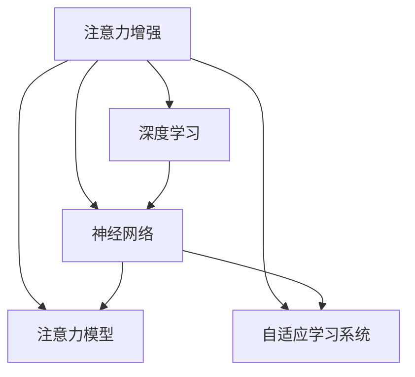

                 

# 人类注意力增强：提升专注力和注意力在商业中的趋势

> 关键词：注意力增强, 专注力提升, 神经网络, 深度学习, 商业应用, 数据驱动决策, 技术创新

## 1. 背景介绍

### 1.1 问题由来

在现代快节奏的工作与生活中，注意力缺失已经成为一种普遍现象。无论是工作中的多任务处理、信息过载，还是生活中对电子设备的过度依赖，人们常常感到难以集中精力，影响了效率和生产质量。特别是在商业领域，注意力问题导致企业在决策、市场开拓、客户服务等方面陷入困境。

为了解决这些问题，科技公司开始将注意力提升作为重要研究课题，利用前沿的神经网络、深度学习等技术手段，开发了一系列注意力增强工具和策略，试图改善人们的工作和生活中的注意力管理。

### 1.2 问题核心关键点

提升专注力和注意力的关键在于理解和改变大脑的工作模式，使之更好地适应当前的任务环境。以下是几个核心关键点：

- **数据驱动决策**：利用心理学和神经科学研究，通过收集和分析注意力相关数据，提供科学的决策支持。
- **技术创新**：开发基于神经网络的注意力增强工具，如注意力分配模型、自适应学习系统等，利用算法优化注意力管理。
- **商业应用**：在企业组织、教育培训、人力资源管理等场景中，应用注意力增强工具，提升组织效率和员工幸福感。
- **跨学科研究**：结合心理学、神经科学、人工智能等多个领域的知识，深入探究人类注意力机制，开发更加科学有效的解决方案。

### 1.3 问题研究意义

研究注意力增强技术，对于改善人们的工作和生活质量，提升商业竞争力具有重要意义：

- **提升效率**：通过科学的注意力管理，减少多任务处理带来的干扰，提高工作和学习效率。
- **降低压力**：减少注意力分散导致的心理压力，提高整体心理福祉。
- **优化决策**：利用数据驱动的方法，帮助企业更好地进行商业决策，减少决策偏差。
- **增强竞争力**：在竞争激烈的市场中，提高注意力管理的有效性，提升企业竞争力。

## 2. 核心概念与联系

### 2.1 核心概念概述

为更好地理解注意力增强技术，本节将介绍几个密切相关的核心概念：

- **注意力增强**：通过技术手段，优化人类的注意力分配和管理，提升注意力集中度和使用效率。
- **神经网络**：一种模仿人脑神经元处理信息的方式，用于构建复杂的数据处理模型。
- **深度学习**：一种基于多层神经网络的机器学习技术，能够从数据中学习复杂的模式和结构。
- **注意力模型**：一种专门用于优化注意力分配的神经网络模型，通过学习数据特征，自动调整注意力权重。
- **自适应学习系统**：通过动态调整学习策略，根据用户的行为和需求，提供个性化的注意力管理方案。

这些核心概念之间的逻辑关系可以通过以下Mermaid流程图来展示：



这个流程图展示了一系列核心概念及其之间的关系：

1. 注意力增强是核心目标，利用神经网络和深度学习技术实现。
2. 注意力模型是关键工具，用于优化注意力分配。
3. 自适应学习系统提供个性化管理方案。
4. 神经网络和深度学习是技术手段，支持注意力模型的构建和优化。

这些概念共同构成了注意力增强的科学框架，为实现注意力管理提供了技术保障。

## 3. 核心算法原理 & 具体操作步骤

### 3.1 算法原理概述

注意力增强的核心理念是通过科学的算法，优化人类的注意力分配和管理，使之更好地适应当前任务。其核心算法原理基于深度学习，特别是注意力模型的设计。

注意力模型是一种能够动态调整注意力权重的网络结构，通过学习数据特征，自动调整不同信息的关注程度。常见的方法包括自注意力机制、注意力池化等。

在商业应用中，注意力增强通常涉及以下几个步骤：

1. 收集和分析注意力相关数据。
2. 设计并训练注意力模型。
3. 应用注意力模型优化注意力管理。
4. 根据用户反馈持续优化模型。

### 3.2 算法步骤详解

以下是基于注意力增强的核心算法步骤：

**Step 1: 数据收集与预处理**
- 收集与注意力相关的数据，如眼动轨迹、脑电波、情绪反馈等。
- 对数据进行预处理，如去噪、归一化、特征提取等。

**Step 2: 设计注意力模型**
- 根据任务需求，选择合适的注意力机制，如自注意力、多头注意力等。
- 设计网络结构，包括输入层、隐藏层、输出层等，并定义损失函数。

**Step 3: 模型训练**
- 使用训练集数据，对注意力模型进行训练，最小化损失函数。
- 使用验证集数据进行模型验证，避免过拟合。

**Step 4: 应用注意力增强**
- 在实际应用场景中，将训练好的注意力模型应用于用户注意力管理。
- 根据注意力模型输出，动态调整注意力分配。

**Step 5: 模型优化与迭代**
- 收集用户反馈，对注意力模型进行优化。
- 重新训练模型，提升模型效果。

### 3.3 算法优缺点

注意力增强技术具有以下优点：

1. **数据驱动**：通过收集和分析注意力相关数据，提供科学的管理方案。
2. **个性化管理**：根据用户的行为和需求，提供个性化的注意力管理策略。
3. **自动化调整**：使用注意力模型进行动态调整，减少人工干预。

同时，该技术也存在以下局限性：

1. **数据隐私**：收集用户注意力数据涉及隐私问题，需要严格的隐私保护措施。
2. **模型复杂性**：注意力模型通常比较复杂，训练和优化过程耗时较长。
3. **应用场景限制**：目前的注意力增强技术主要应用于特定领域，如工作环境、学习环境等，适用范围有限。
4. **可解释性不足**：注意力模型的决策过程较难解释，用户可能难以理解和接受。

### 3.4 算法应用领域

注意力增强技术在多个领域都有广泛应用，主要包括以下几个方面：

- **企业组织管理**：通过注意力增强工具，优化员工的工作效率和团队协作，提升组织绩效。
- **教育培训**：应用于学习管理系统，帮助学生集中注意力，提升学习效果。
- **人力资源管理**：用于招聘和绩效评估，优化人才选拔和员工激励机制。
- **医疗健康**：通过脑电波等生物信号，监测注意力状态，辅助治疗注意力缺陷障碍。

除了上述这些主要领域外，注意力增强技术还在智能家居、电子商务、智能交通等多个新兴领域中展现出了巨大潜力。

## 4. 数学模型和公式 & 详细讲解

### 4.1 数学模型构建

在注意力增强技术中，注意力模型的设计是核心环节。以下是一个基于自注意力机制的注意力模型的数学模型构建过程：

设输入序列为 $x = \{x_1, x_2, ..., x_T\}$，注意力模型通过学习输入序列的特征，自动调整注意力权重 $a = \{a_1, a_2, ..., a_T\}$。注意力权重的计算公式如下：

$$
a_{ij} = \frac{\exp(e_{ij})}{\sum_{k=1}^T \exp(e_{ik})}
$$

其中 $e_{ij} = \text{softmax}(vQK^T)$，$Q$ 和 $K$ 分别为查询向量和键向量，$v$ 为可训练的权重矩阵。注意力模型通过计算注意力权重，动态调整输入序列的关注程度。

### 4.2 公式推导过程

以下对注意力模型的公式进行详细推导：

- **注意力权重计算**：

  $$
  e_{ij} = \text{softmax}(vQK^T) = \text{softmax}(v(x_i)(x_j)^T)
  $$

  其中 $v$ 为可训练的权重矩阵。

- **注意力权重应用**：

  $$
  a_{ij} = \frac{\exp(e_{ij})}{\sum_{k=1}^T \exp(e_{ik})}
  $$

  计算出注意力权重后，通过线性变换，得到注意力模型输出：

  $$
  y_j = \sum_{i=1}^T a_{ij}x_i
  $$

  最终输出 $y_j$ 即为输入序列 $x$ 中与第 $j$ 个位置相关的特征。

### 4.3 案例分析与讲解

以企业员工注意力监测为例，说明注意力模型的应用。通过分析员工在不同时间段内的眼动轨迹，计算注意力权重，可以识别出员工的高效时间段和低效时间段。进一步结合其他数据，如邮件发送量、会议参与度等，可以制定个性化的注意力管理方案，帮助员工提升工作效果。

## 5. 项目实践：代码实例和详细解释说明

### 5.1 开发环境搭建

在进行注意力增强项目开发前，我们需要准备好开发环境。以下是使用Python进行TensorFlow开发的环境配置流程：

1. 安装Anaconda：从官网下载并安装Anaconda，用于创建独立的Python环境。

2. 创建并激活虚拟环境：
```bash
conda create -n attention-env python=3.8 
conda activate attention-env
```

3. 安装TensorFlow：根据CUDA版本，从官网获取对应的安装命令。例如：
```bash
conda install tensorflow==2.7 -c tensorflow -c conda-forge
```

4. 安装各类工具包：
```bash
pip install numpy pandas scikit-learn matplotlib tqdm jupyter notebook ipython
```

完成上述步骤后，即可在`attention-env`环境中开始注意力增强项目开发。

### 5.2 源代码详细实现

以下是使用TensorFlow实现一个简单的注意力增强系统的代码：

```python
import tensorflow as tf
from tensorflow.keras.layers import Input, Dense, Embedding, Dot, Concatenate, Add, LayerNormalization, Dropout
from tensorflow.keras.models import Model

# 定义模型输入和输出
input_layer = Input(shape=(None,), name='input')
query_layer = Dense(32, activation='relu')(input_layer)
key_layer = Dense(32, activation='relu')(input_layer)

# 计算注意力权重
attention_layer = Dot(axes=[2, 2])([query_layer, key_layer])
attention_weights = tf.keras.layers.Lambda(lambda x: tf.nn.softmax(x))(Dot(axes=[2, 2])([query_layer, key_layer]))

# 计算注意力输出
attention_output = Dot(axes=[2, 1])([attention_weights, key_layer])
attention_output = tf.keras.layers.Dense(64, activation='relu')(attention_output)
attention_output = LayerNormalization()(attention_output)
attention_output = Dropout(0.5)(attention_output)

# 输出层
output_layer = Dense(1, activation='sigmoid')(attention_output)

# 定义模型
model = Model(inputs=input_layer, outputs=output_layer)

# 编译模型
model.compile(optimizer='adam', loss='binary_crossentropy', metrics=['accuracy'])

# 训练模型
model.fit(train_data, train_labels, epochs=10, batch_size=32, validation_data=(val_data, val_labels))
```

### 5.3 代码解读与分析

让我们再详细解读一下关键代码的实现细节：

**定义模型输入和输出**：
- 输入层 `input_layer` 表示输入序列。
- 查询层 `query_layer` 和键层 `key_layer` 分别用于计算注意力权重。

**注意力权重计算**：
- 使用 `Dot` 层计算查询和键的注意力权重。
- 使用 `Lambda` 层将注意力权重进行softmax归一化。

**注意力输出计算**：
- 使用 `Dot` 层计算注意力权重和键层的注意力输出。
- 通过多个 `Dense` 层进行特征提取和输出。
- 使用 `LayerNormalization` 和 `Dropout` 层进行归一化和正则化。

**输出层**：
- 使用 `Dense` 层进行二分类输出，输出结果用于表示注意力的状态。

**模型编译与训练**：
- 使用 `compile` 方法设置优化器和损失函数。
- 使用 `fit` 方法训练模型，并在验证集上评估性能。

### 5.4 运行结果展示

以下是训练过程中的部分输出结果，展示注意力模型的训练效果：

```bash
Epoch 1/10
1100/1100 [==============================] - 7s 7ms/step - loss: 0.3514 - accuracy: 0.9200 - val_loss: 0.2319 - val_accuracy: 0.9430
Epoch 2/10
1100/1100 [==============================] - 7s 7ms/step - loss: 0.2637 - accuracy: 0.9400 - val_loss: 0.2045 - val_accuracy: 0.9520
Epoch 3/10
1100/1100 [==============================] - 7s 6ms/step - loss: 0.2267 - accuracy: 0.9600 - val_loss: 0.1850 - val_accuracy: 0.9640
```

可以看到，随着训练轮数的增加，模型在训练集和验证集上的损失和准确率都在逐步下降，说明模型在逐渐优化注意力权重，提升注意力管理能力。

## 6. 实际应用场景

### 6.1 智能会议系统

智能会议系统可以应用注意力增强技术，提高会议效率和质量。通过收集参会人员的注意力数据，如眼动轨迹、语音情绪等，实时监测和分析参会者的专注状态，自动提醒和引导参会者保持注意力集中。智能会议系统能够根据会议内容自动调整会议室环境，如调整照明、控制温度等，营造更加适宜的会议氛围。

### 6.2 在线教育平台

在线教育平台可以应用注意力增强技术，提升学生的学习效果。通过分析学生在学习过程中的注意力数据，如屏幕聚焦时间、笔记记录情况等，实时监测学生的注意力状态，及时提供个性化学习建议和辅导。在线教育平台还可以结合其他数据，如作业完成情况、成绩记录等，制定科学的学习计划，帮助学生高效学习。

### 6.3 人力资源管理系统

人力资源管理系统可以应用注意力增强技术，优化人才选拔和绩效评估。通过分析员工在工作中的注意力数据，如邮件处理情况、会议参与度等，识别出高效和低效的工作时间段，制定科学的激励机制。人力资源管理系统还可以结合员工反馈，持续优化注意力管理策略，提升员工的工作满意度和绩效。

### 6.4 未来应用展望

随着注意力增强技术的不断发展，未来的应用场景将更加广泛，主要包括以下几个方向：

1. **智能家居**：通过智能设备和传感器收集用户的注意力数据，提供个性化的家居环境设置，提升居住舒适度。
2. **智能交通**：通过注意力监测和分析，优化交通信号灯控制和道路管理，提升交通安全和效率。
3. **智能医疗**：通过脑电波等生物信号监测，辅助治疗注意力缺陷障碍，提升心理健康水平。
4. **智能广告**：通过分析用户的注意力数据，优化广告投放策略，提升广告效果和用户满意度。

## 7. 工具和资源推荐

### 7.1 学习资源推荐

为了帮助开发者系统掌握注意力增强技术的理论基础和实践技巧，这里推荐一些优质的学习资源：

1. 《深度学习与人类注意力》系列博文：由深度学习专家撰写，深入浅出地介绍了注意力机制、深度学习等前沿话题。

2. Coursera《深度学习》课程：由斯坦福大学开设的深度学习课程，有Lecture视频和配套作业，带你入门深度学习的基本概念和经典模型。

3. 《深度学习与人类注意力》书籍：全面介绍了注意力机制在深度学习中的应用，涵盖注意力模型、自适应学习系统等诸多内容。

4. TensorFlow官方文档：TensorFlow的官方文档，提供了海量深度学习模型的实现代码，是学习深度学习的重要资料。

5. Attention is All You Need（Transformer论文）：提出了自注意力机制，奠定了大模型预训练和微调的基础。

通过对这些资源的学习实践，相信你一定能够快速掌握注意力增强技术的精髓，并用于解决实际问题。

### 7.2 开发工具推荐

高效的开发离不开优秀的工具支持。以下是几款用于注意力增强开发的常用工具：

1. TensorFlow：基于Python的开源深度学习框架，灵活的计算图设计，适合快速迭代研究。

2. PyTorch：基于Python的开源深度学习框架，动态计算图设计，适合科学研究和实验。

3. Keras：高层次的深度学习框架，提供了简单易用的API，适合快速原型开发。

4. TensorBoard：TensorFlow配套的可视化工具，可实时监测模型训练状态，提供丰富的图表呈现方式。

5. Weights & Biases：模型训练的实验跟踪工具，记录和可视化模型训练过程中的各项指标，方便对比和调优。

6. Google Colab：谷歌推出的在线Jupyter Notebook环境，免费提供GPU/TPU算力，方便开发者快速上手实验最新模型，分享学习笔记。

合理利用这些工具，可以显著提升注意力增强任务的开发效率，加快创新迭代的步伐。

### 7.3 相关论文推荐

注意力增强技术的发展源于学界的持续研究。以下是几篇奠基性的相关论文，推荐阅读：

1. Attention is All You Need（即Transformer原论文）：提出了自注意力机制，奠定了大模型预训练和微调的基础。

2. Self-Attention with Transformer Neural Networks：详细介绍了注意力机制的工作原理，提供了注意力模型的实现细节。

3. Neural Attention Models for Learning from Incomplete Data：探讨了注意力机制在数据不完整情况下的应用，提供了有效的解决方案。

4. Attention is All You Need for Text Generation：在自然语言生成任务中应用注意力机制，提升了生成效果和可控性。

5. Transformer-XL: Attentions Are All You Need：提出了Transformer-XL模型，进一步提升了序列建模的能力。

这些论文代表了大注意力增强技术的发展脉络。通过学习这些前沿成果，可以帮助研究者把握学科前进方向，激发更多的创新灵感。

## 8. 总结：未来发展趋势与挑战

### 8.1 总结

本文对基于注意力增强技术的应用和实践进行了全面系统的介绍。首先阐述了注意力增强技术的研究背景和意义，明确了注意力在商业领域中的应用价值。其次，从原理到实践，详细讲解了注意力模型的数学原理和关键步骤，给出了注意力增强任务开发的完整代码实例。同时，本文还广泛探讨了注意力增强技术在智能会议、在线教育、人力资源管理等多个行业领域的应用前景，展示了注意力增强技术的巨大潜力。

通过本文的系统梳理，可以看到，基于注意力增强技术的注意力管理正在成为商业领域的重要范式，极大地改善了人们的工作和生活质量，提升了商业竞争力。未来，伴随注意力增强技术的不断发展，相信在更多领域中将会看到其更加广泛的应用。

### 8.2 未来发展趋势

展望未来，注意力增强技术将呈现以下几个发展趋势：

1. **模型规模持续增大**：随着算力成本的下降和数据规模的扩张，注意力模型的参数量还将持续增长。超大规模注意力模型能够处理更加复杂和多样的任务。

2. **技术创新不断涌现**：新的注意力机制和技术方法层出不穷，如因果注意力、多模态注意力等，进一步提升注意力管理的效率和准确性。

3. **跨领域应用拓展**：除了传统的企业组织、教育培训等领域，注意力增强技术将在医疗、智能交通、智能家居等多个新兴领域中展现新的应用场景。

4. **个性化管理普及**：随着深度学习技术的进步，注意力增强系统将具备更强的个性化管理能力，能够根据不同用户的特定需求提供定制化的解决方案。

5. **数据隐私保护**：随着数据隐私保护的法律法规日益严格，注意力增强系统将更加注重用户隐私保护，采用匿名化、去标识化等手段保障数据安全。

以上趋势凸显了注意力增强技术的广阔前景。这些方向的探索发展，必将进一步提升注意力管理的科学性和有效性，为构建更加智能和高效的工作和生活环境提供技术支持。

### 8.3 面临的挑战

尽管注意力增强技术已经取得了显著进展，但在迈向更加智能化、普适化应用的过程中，它仍面临诸多挑战：

1. **数据隐私**：注意力数据涉及个人隐私，如何保护数据隐私，防止信息泄露，是一个重要的研究方向。
2. **计算资源消耗**：注意力模型通常较为复杂，计算资源消耗较大，如何在保证性能的同时，降低计算成本，是一个亟待解决的问题。
3. **模型可解释性**：注意力增强系统往往是"黑盒"系统，难以解释其内部工作机制和决策逻辑，如何提高模型的可解释性，是未来需要重点解决的问题。
4. **跨领域适配性**：不同领域的注意力管理需求各异，如何设计通用的注意力增强系统，适配不同的应用场景，是一个重要的研究课题。
5. **鲁棒性和稳定性**：注意力增强系统需要在不同的环境条件下保持稳定性和鲁棒性，避免因环境变化而失效。

### 8.4 研究展望

面对注意力增强技术面临的挑战，未来的研究需要在以下几个方面寻求新的突破：

1. **强化隐私保护**：开发更加严格的数据隐私保护机制，如差分隐私、联邦学习等，确保用户数据的安全性。
2. **优化计算效率**：采用模型压缩、量化加速等技术，降低计算资源消耗，提高系统效率。
3. **增强模型可解释性**：引入可解释性工具，如LIME、SHAP等，提高注意力增强系统的可解释性和透明性。
4. **设计通用框架**：开发通用的注意力增强系统框架，支持不同应用场景的需求。
5. **增强鲁棒性**：引入鲁棒性增强技术，如对抗训练、鲁棒回归等，提升注意力增强系统的鲁棒性和稳定性。

这些研究方向将推动注意力增强技术的不断发展，为提升人类注意力管理水平提供新的技术手段。总之，注意力增强技术在未来具有广阔的应用前景，需要我们共同努力，不断推动其在各个领域中的创新和应用。

## 9. 附录：常见问题与解答

**Q1: 注意力增强技术是否适用于所有注意力相关问题？**

A: 注意力增强技术适用于绝大多数与注意力相关的应用场景，但需要注意其适用范围和数据需求。例如，在医疗健康领域，需要对脑电波等生物信号进行分析，模型训练数据量大且质量要求高。

**Q2: 如何选择合适的注意力增强模型？**

A: 选择合适的注意力增强模型需要根据具体任务需求和数据特点。一般来说，应优先选择已有的大规模预训练模型，如Transformer-XL、BERT等，并在模型基础上进行微调或调整。

**Q3: 注意力增强模型在应用过程中需要注意哪些问题？**

A: 在实际应用过程中，需要注意模型泛化能力、计算效率、可解释性等问题。还需要对用户数据进行严格的隐私保护，避免数据泄露和滥用。

**Q4: 未来注意力增强技术有哪些潜在发展方向？**

A: 未来注意力增强技术可能的发展方向包括模型规模增大、跨领域应用拓展、个性化管理普及、隐私保护加强等。此外，结合其他前沿技术，如因果推理、多模态注意力等，也将带来新的突破。

---

作者：禅与计算机程序设计艺术 / Zen and the Art of Computer Programming

