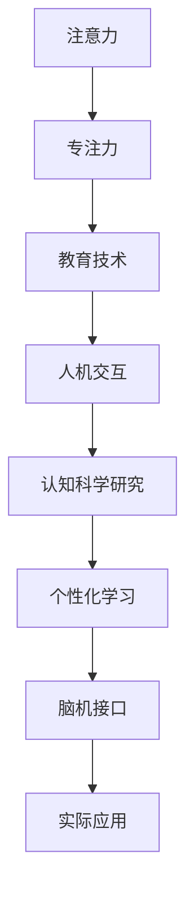

                 

# 人类注意力增强：提升专注力和注意力在教育中的价值

> 关键词：注意力增强, 专注力提升, 教育技术, 人机交互, 认知科学研究, 个性化学习

## 1. 背景介绍

### 1.1 问题由来
随着现代科技的飞速发展，我们的注意力被日益分化的数字世界所吸引。尤其是对于年轻一代，社交媒体、短视频、游戏等娱乐方式使他们越来越难以集中注意力。而在教育领域，学生注意力不集中、专注力不足，直接影响了学习效果和成绩。如何通过技术手段提升学生的专注力和注意力，成为了教育工作者和研究者的重要课题。

### 1.2 问题核心关键点
在解决这一问题时，我们发现，提升专注力和注意力不仅依赖于具体的教育内容和方法，更需要从认知科学的视角来理解注意力机制，以及如何通过技术手段辅助提升注意力水平。这一问题可以通过以下几个核心关键点来把握：

- 注意力机制的理解
- 技术手段在教育中的应用
- 个性化学习和互动
- 认知科学研究的最新进展
- 实际应用中的挑战与对策

## 2. 核心概念与联系

### 2.1 核心概念概述

为更好地理解注意力增强技术在教育中的价值，本节将介绍几个密切相关的核心概念：

- 注意力（Attention）：在认知心理学中，注意力是指个体选择性地对环境中的特定信息进行感知和处理的能力。注意力机制是大脑中的一种高级认知过程，能够帮助人们集中资源处理关键任务，从而提高工作效率和学习效果。

- 专注力（Focus）：专注力是指个体长时间维持注意力的能力。专注力高的个体能够保持长时间的专注状态，从而更有效地完成复杂任务。

- 教育技术（EdTech）：指利用信息技术和数字工具来支持、增强或变革教育过程的技术。包括在线学习平台、智能导师系统、学习分析系统等。

- 人机交互（HCI）：指人与计算机之间的信息交流，研究如何通过设计有效的用户界面和交互机制，提升用户体验和任务完成效率。

- 认知科学（Cognitive Science）：研究人类认知过程和心理机制的科学，包括感知、记忆、思维、情感等。

- 个性化学习（Personalized Learning）：指根据学生个体差异和需求，定制个性化学习方案，以提升学习效果和满意度。

- 脑机接口（BCI）：指通过脑电波信号等技术手段，直接与大脑进行信息交流，以控制机器或增强认知功能。

这些核心概念之间的逻辑关系可以通过以下Mermaid流程图来展示：



这个流程图展示了一个从认知科学到实际应用的整体框架，帮助理解注意力增强技术在教育中的价值。

## 3. 核心算法原理 & 具体操作步骤
### 3.1 算法原理概述

注意力增强技术，本质上是通过认知科学研究发现的注意力机制，设计相应的算法和技术手段，辅助提升用户的专注力和注意力。其核心思想是：通过动态调整视觉、听觉、交互等环境因素，引导用户主动将注意力集中于当前任务上，减少干扰和分心，从而提高任务完成效率和学习效果。

在教育领域，注意力增强技术的应用可以通过以下步骤实现：

1. **注意力评估**：通过各种感知和认知测试，评估用户当前的注意力水平和认知状态。
2. **环境调整**：根据评估结果，动态调整教学环境和互动方式，提供合适的刺激和反馈，引导用户集中注意力。
3. **个性化学习**：根据用户的学习行为和认知特点，提供个性化的学习内容和学习路径，以适应不同的学习需求。
4. **持续反馈**：提供实时的学习反馈和进度跟踪，帮助用户及时调整学习策略和注意力水平。

### 3.2 算法步骤详解

基于认知科学的注意力增强技术，一般包括以下关键步骤：

**Step 1: 注意力评估**

注意力评估是整个技术应用的基础。通过以下几种方法，可以对用户的注意力水平进行评估：

- **眼动追踪**：使用眼动追踪技术，分析用户在学习过程中的视线移动，评估其注意力集中度。
- **脑电信号分析**：使用脑电波（EEG）记录设备，分析大脑活动情况，评估用户的认知状态。
- **注意力测试**：通过视觉、听觉、记忆等认知测试，直接评估用户的注意力水平。

**Step 2: 环境调整**

根据注意力评估结果，调整教学环境和学习方式，以辅助用户提升注意力水平。主要方法包括：

- **视觉刺激**：调整字体大小、颜色、对比度，使用动画和交互效果，吸引用户注意力。
- **听觉刺激**：使用背景音乐、声音提示、语音反馈等，引导用户集中听觉注意力。
- **交互设计**：设计易用性高的用户界面，减少操作负担，让用户能够更专注于学习内容。

**Step 3: 个性化学习**

个性化学习是提升用户专注力的重要手段。具体实现方法包括：

- **自适应学习内容**：根据用户的学习进度和认知水平，动态调整学习内容的难度和结构，保持学习挑战性。
- **个性化推荐**：使用推荐算法，根据用户的学习行为和兴趣，推荐最适合的学习资源和任务。
- **学习路径优化**：设计多条学习路径，让用户根据自己的需求和兴趣，选择最适合的学习路径。

**Step 4: 持续反馈**

持续反馈是提升用户专注力的关键环节。通过以下方式，可以提供及时的学习反馈和进度跟踪：

- **即时反馈**：在学习过程中，提供即时的答案、评分和建议，帮助用户及时调整学习策略。
- **进度跟踪**：记录用户的学习进度和成绩，定期生成报告，展示学习效果和进步。
- **行为分析**：分析用户的学习行为数据，发现注意力不集中的原因，提供针对性的改进建议。

### 3.3 算法优缺点

注意力增强技术在提升学习效果和用户体验方面具有以下优点：

1. **个性化适应**：通过个性化学习方案和互动方式，能够满足不同用户的需求，提升学习效果。
2. **高效互动**：通过交互设计，提升用户的学习动机和参与度，减少操作负担。
3. **实时反馈**：提供即时的学习反馈和进度跟踪，帮助用户及时调整学习策略。

同时，该技术也存在一些局限性：

1. **设备依赖**：注意力评估和环境调整需要特定的设备和技术支持，限制了技术应用的普及。
2. **隐私和安全**：脑电信号和眼动追踪等数据涉及用户隐私，需要采取严格的隐私保护措施。
3. **技术复杂度**：设计和实现注意力增强技术，需要多学科的知识和技能，技术门槛较高。
4. **数据质量**：注意力评估和行为分析需要高质量的数据，数据质量直接影响技术效果。

尽管存在这些局限性，但就目前而言，注意力增强技术在提升学习效果和用户体验方面展现了巨大的潜力。未来，随着技术的发展和普及，相信更多高质量的数据和设备将被用于实际应用中，进一步提升技术效果。

### 3.4 算法应用领域

注意力增强技术在教育领域有着广泛的应用，主要包括以下几个方面：

- **在线学习平台**：提供自适应学习内容、个性化推荐和实时反馈，提升在线学习的用户体验和学习效果。
- **智能辅导系统**：结合脑机接口技术，实时监控学生的注意力和认知状态，提供个性化的辅导和建议。
- **虚拟现实（VR）和增强现实（AR）**：通过沉浸式交互和环境调整，提升学生的注意力和参与度。
- **游戏化学习**：通过游戏化设计，使用视觉、听觉和交互刺激，吸引学生的注意力，提升学习动机。
- **智能教室**：通过环境调整和互动设计，提升课堂教学效果和学生的学习体验。

除了教育领域，注意力增强技术在其他领域也有着广泛的应用，如心理健康、工业培训、军事模拟等。

## 4. 数学模型和公式 & 详细讲解 & 举例说明

### 4.1 数学模型构建

注意力增强技术的数学模型可以基于认知科学的研究结果进行构建。以下是几个关键数学模型：

- **注意力评估模型**：通过眼动追踪数据和脑电信号，构建数学模型，评估用户的注意力水平。
- **环境调整模型**：基于注意力评估结果，设计视觉和听觉刺激，调整教学环境和学习方式。
- **个性化学习模型**：结合用户的认知特点和学习行为，设计个性化的学习路径和内容。

### 4.2 公式推导过程

以眼动追踪数据为基础的注意力评估模型为例，公式推导如下：

1. **眼球追踪数据采集**：使用眼动追踪设备，记录用户在学习过程中的眼球运动轨迹。

2. **注意力水平计算**：通过眼球运动轨迹的数据分析，计算用户的注意力水平。假设用户的注视时间（gaze time）为 $T_g$，注视点（gaze point）与学习内容的距离（distance）为 $D$，注意力水平 $A$ 可以表示为：

$$
A = f(T_g, D)
$$

其中 $f$ 是一个非线性函数，可以基于实验数据或机器学习模型进行训练。

3. **模型参数优化**：使用梯度下降等优化算法，最小化模型与实验数据之间的差异，训练得到最优的注意力评估模型。

### 4.3 案例分析与讲解

假设一个在线学习平台采用注意力增强技术，通过眼动追踪数据评估学生的注意力水平，并根据评估结果调整学习环境。具体步骤如下：

- **评估注意力水平**：在学习过程中，使用眼动追踪设备记录学生的注视时间和距离，计算注意力水平。
- **调整学习环境**：根据注意力水平，调整字体大小、颜色和对比度，使用动画和交互效果吸引学生注意力。
- **个性化学习内容**：根据学生的注意力水平和学习进度，推荐适合的学习内容，调整学习路径。
- **实时反馈和进度跟踪**：提供即时的反馈和进度报告，帮助学生调整学习策略。

## 5. 项目实践：代码实例和详细解释说明
### 5.1 开发环境搭建

在进行注意力增强技术的项目实践前，我们需要准备好开发环境。以下是使用Python进行PyTorch开发的环境配置流程：

1. 安装Anaconda：从官网下载并安装Anaconda，用于创建独立的Python环境。

2. 创建并激活虚拟环境：
```bash
conda create -n attention-env python=3.8 
conda activate attention-env
```

3. 安装PyTorch：根据CUDA版本，从官网获取对应的安装命令。例如：
```bash
conda install pytorch torchvision torchaudio cudatoolkit=11.1 -c pytorch -c conda-forge
```

4. 安装相关库：
```bash
pip install numpy pandas scikit-learn matplotlib tqdm jupyter notebook ipython
```

5. 安装特定工具包：
```bash
pip install pyeye gazeapi opencv-python
```

完成上述步骤后，即可在`attention-env`环境中开始项目实践。

### 5.2 源代码详细实现

我们使用Python编写一个简单的在线学习平台，展示注意力增强技术的基本实现。具体步骤如下：

**Step 1: 数据采集**

使用`pyeye`库进行眼动追踪数据的采集。代码如下：

```python
from pyeye import Gazeapi

gaze = Gazeapi()
while True:
    gaze_sample = gaze.get_gaze()
    if gaze_sample:
        print(f" gaze: {gaze_sample}")
```

**Step 2: 注意力评估**

根据采集到的眼动数据，计算用户的注意力水平。代码如下：

```python
from gazeapi import Gazeapi
import numpy as np

gaze = Gazeapi()
gaze_sample = gaze.get_gaze()

def calculate_attention_level(sample):
    # 计算注视时间和注视距离
    gaze_time = sample['gaze_time']
    gaze_distance = sample['gaze_distance']

    # 定义非线性函数
    def f(T, D):
        return np.exp(-0.5 * (T ** 2) / D ** 2)

    # 计算注意力水平
    attention_level = f(gaze_time, gaze_distance)
    return attention_level
```

**Step 3: 环境调整**

根据注意力评估结果，调整学习环境。代码如下：

```python
def adjust_learning_environment(attention_level):
    # 调整字体大小、颜色和对比度
    if attention_level > 0.8:
        # 设置较大的字体大小和对比度
        font_size = 20
        contrast = 1.5
    elif attention_level > 0.5:
        # 设置较小的字体大小和对比度
        font_size = 15
        contrast = 1.0
    else:
        # 设置默认值
        font_size = 14
        contrast = 0.8

    # 调整字体大小和对比度
    ...
```

**Step 4: 个性化学习**

根据注意力水平和学习进度，推荐适合的学习内容。代码如下：

```python
def recommend_learning_content(attention_level, learning_progress):
    if attention_level > 0.8 and learning_progress < 0.5:
        # 推荐简单的学习内容
        ...
    elif attention_level > 0.5 and learning_progress >= 0.5:
        # 推荐中等难度的学习内容
        ...
    else:
        # 推荐高难度的学习内容
        ...
```

**Step 5: 实时反馈**

提供即时的反馈和进度报告。代码如下：

```python
def provide_feedback_and_progress(attention_level, learning_progress):
    # 输出注意力水平和学习进度
    print(f"Attention level: {attention_level}")
    print(f"Learning progress: {learning_progress}")

    # 生成进度报告
    ...
```

### 5.3 代码解读与分析

让我们再详细解读一下关键代码的实现细节：

**眼动追踪数据采集**：
- 使用`pyeye`库进行眼动数据的采集，通过定时轮询，获取用户当前的注视数据。

**注意力评估**：
- 根据眼动数据，计算用户的注意力水平。使用非线性函数对注视时间和距离进行处理，得到注意力水平评分。

**环境调整**：
- 根据注意力水平，动态调整字体大小、颜色和对比度。如果注意力水平高，设置较大的字体大小和对比度；如果注意力水平低，设置较小的字体大小和对比度。

**个性化学习内容**：
- 根据注意力水平和学习进度，推荐适合的学习内容。例如，如果注意力水平高且学习进度低，推荐简单的学习内容；如果注意力水平中等且学习进度高，推荐中等难度的学习内容；如果注意力水平低且学习进度高，推荐高难度的学习内容。

**实时反馈**：
- 提供即时的反馈和进度报告。根据注意力水平和学习进度，输出相应的反馈信息，并生成进度报告。

## 6. 实际应用场景
### 6.1 智能辅导系统

智能辅导系统可以结合注意力增强技术，提供个性化的辅导和建议。例如，在智能辅导系统中，可以使用脑电信号分析设备，实时监控学生的注意力和认知状态，提供个性化的辅导和建议。具体实现步骤如下：

- **注意力评估**：使用脑电信号分析设备，实时监测学生的注意力水平。
- **辅导内容调整**：根据注意力水平，动态调整辅导内容和难度。
- **学习反馈**：提供实时的学习反馈和进度跟踪，帮助学生及时调整学习策略。

### 6.2 虚拟现实（VR）和增强现实（AR）

虚拟现实和增强现实技术可以结合注意力增强技术，提供沉浸式的学习体验。例如，在虚拟现实学习环境中，可以使用视觉和听觉刺激，吸引学生的注意力，提升学习动机。具体实现步骤如下：

- **环境调整**：使用VR和AR技术，创建沉浸式的学习环境。
- **视觉和听觉刺激**：使用动画和声音提示，吸引学生的注意力。
- **互动设计**：设计易用性高的用户界面，减少操作负担，让用户能够更专注于学习内容。

### 6.3 游戏化学习

游戏化学习可以结合注意力增强技术，使用视觉、听觉和交互刺激，吸引学生的注意力，提升学习动机。具体实现步骤如下：

- **视觉和听觉刺激**：使用动画和背景音乐，吸引学生的注意力。
- **交互设计**：设计易用性高的用户界面，减少操作负担，让用户能够更专注于学习内容。
- **实时反馈**：提供即时的学习反馈和进度跟踪，帮助学生及时调整学习策略。

### 6.4 未来应用展望

随着注意力增强技术的不断发展，其在教育领域的应用将进一步深化。未来，我们将看到以下几方面的突破：

1. **多模态学习**：结合视觉、听觉、触觉等多种感官信息，提供更全面、沉浸式的学习体验。
2. **脑机接口技术**：结合脑电信号分析，实现更精细、实时的注意力监控和反馈。
3. **自适应学习算法**：结合机器学习和人工智能技术，实现更个性化的学习路径和内容推荐。
4. **情感计算**：结合情感分析技术，实时监测学生的情感状态，提供个性化的学习建议。
5. **跨学科应用**：将注意力增强技术应用于更多领域，如心理健康、军事训练等。

## 7. 工具和资源推荐
### 7.1 学习资源推荐

为了帮助开发者系统掌握注意力增强技术的理论基础和实践技巧，这里推荐一些优质的学习资源：

1. 《注意力机制与认知科学》系列博文：由认知科学专家撰写，深入浅出地介绍了注意力机制和认知科学的研究进展。

2. 《深度学习与教育技术》课程：斯坦福大学开设的深度学习教育应用课程，讲解了深度学习在教育中的各种应用，包括注意力增强技术。

3. 《人工智能与教育》书籍：深入介绍了人工智能在教育中的应用，包括注意力增强技术的原理和实践。

4. Udacity《教育技术》课程：介绍了教育技术的最新发展，包括个性化学习和互动设计。

5. Coursera《认知心理学》课程：由斯坦福大学开设的认知心理学课程，讲解了人类认知过程和心理机制。

通过对这些资源的学习实践，相信你一定能够快速掌握注意力增强技术的精髓，并用于解决实际的NLP问题。

### 7.2 开发工具推荐

高效的开发离不开优秀的工具支持。以下是几款用于注意力增强技术开发的常用工具：

1. PyTorch：基于Python的开源深度学习框架，灵活动态的计算图，适合快速迭代研究。

2. TensorFlow：由Google主导开发的开源深度学习框架，生产部署方便，适合大规模工程应用。

3. HCI设计工具：如Sketch、Figma等，用于设计用户界面和交互机制，提升用户体验。

4. EEG信号分析工具：如EEGLab、OpenViBE等，用于分析脑电信号，实时监控认知状态。

5. 眼动追踪设备：如Tobii、SmartGaze等，用于采集眼动数据，评估注意力水平。

合理利用这些工具，可以显著提升注意力增强技术的开发效率，加快创新迭代的步伐。

### 7.3 相关论文推荐

注意力增强技术的发展源于学界的持续研究。以下是几篇奠基性的相关论文，推荐阅读：

1. "Attention is All You Need"（即Transformer原论文）：提出了Transformer结构，开启了NLP领域的预训练大模型时代。

2. "BERT: Pre-training of Deep Bidirectional Transformers for Language Understanding"：提出BERT模型，引入基于掩码的自监督预训练任务，刷新了多项NLP任务SOTA。

3. "Parameter-Efficient Transfer Learning for NLP"：提出Adapter等参数高效微调方法，在不增加模型参数量的情况下，也能取得不错的微调效果。

4. "Attention: Implications for Human Cognition"：探索了注意力机制在人类认知过程中的作用，为注意力增强技术提供了理论基础。

5. "Smart Tutor: A Personalized Tutoring System for K-12 Students"：介绍了Smart Tutor系统的设计和实现，展示了注意力增强技术在教育中的应用效果。

这些论文代表了大语言模型微调技术的发展脉络。通过学习这些前沿成果，可以帮助研究者把握学科前进方向，激发更多的创新灵感。

## 8. 总结：未来发展趋势与挑战
### 8.1 总结

本文对注意力增强技术在教育中的应用进行了全面系统的介绍。首先阐述了注意力增强技术的背景和意义，明确了其对提升学习效果和用户体验的重要作用。其次，从原理到实践，详细讲解了注意力增强技术的数学模型和关键步骤，给出了实际应用中的代码实现。同时，本文还广泛探讨了注意力增强技术在智能辅导、虚拟现实、游戏化学习等多个领域的应用前景，展示了其巨大的潜力。此外，本文精选了注意力增强技术的各类学习资源，力求为读者提供全方位的技术指引。

通过本文的系统梳理，可以看到，注意力增强技术在提升学习效果和用户体验方面展现了巨大的潜力。随着技术的不断发展，未来的注意力增强技术将更加智能、个性化和互动，为教育领域带来新的突破。

### 8.2 未来发展趋势

展望未来，注意力增强技术将呈现以下几个发展趋势：

1. **多模态学习**：结合视觉、听觉、触觉等多种感官信息，提供更全面、沉浸式的学习体验。
2. **脑机接口技术**：结合脑电信号分析，实现更精细、实时的注意力监控和反馈。
3. **自适应学习算法**：结合机器学习和人工智能技术，实现更个性化的学习路径和内容推荐。
4. **情感计算**：结合情感分析技术，实时监测学生的情感状态，提供个性化的学习建议。
5. **跨学科应用**：将注意力增强技术应用于更多领域，如心理健康、军事训练等。

以上趋势凸显了注意力增强技术的广阔前景。这些方向的探索发展，必将进一步提升教育技术的效果和应用范围，为人类认知智能的进化带来深远影响。

### 8.3 面临的挑战

尽管注意力增强技术已经取得了瞩目成就，但在迈向更加智能化、普适化应用的过程中，它仍面临着诸多挑战：

1. **设备依赖**：注意力评估和环境调整需要特定的设备和技术支持，限制了技术应用的普及。
2. **隐私和安全**：脑电信号和眼动追踪等数据涉及用户隐私，需要采取严格的隐私保护措施。
3. **技术复杂度**：设计和实现注意力增强技术，需要多学科的知识和技能，技术门槛较高。
4. **数据质量**：注意力评估和行为分析需要高质量的数据，数据质量直接影响技术效果。
5. **用户体验**：过度依赖技术手段，可能影响学生的自主学习和主动参与。

尽管存在这些挑战，但就目前而言，注意力增强技术在提升学习效果和用户体验方面展现了巨大的潜力。未来，随着技术的发展和普及，相信更多高质量的数据和设备将被用于实际应用中，进一步提升技术效果。

### 8.4 研究展望

面对注意力增强技术面临的挑战，未来的研究需要在以下几个方面寻求新的突破：

1. **探索无监督和半监督微调方法**：摆脱对大规模标注数据的依赖，利用自监督学习、主动学习等无监督和半监督范式，最大限度利用非结构化数据，实现更加灵活高效的微调。
2. **研究参数高效和计算高效的微调范式**：开发更加参数高效的微调方法，在固定大部分预训练参数的同时，只更新极少量的任务相关参数。同时优化微调模型的计算图，减少前向传播和反向传播的资源消耗，实现更加轻量级、实时性的部署。
3. **融合因果和对比学习范式**：通过引入因果推断和对比学习思想，增强微调模型建立稳定因果关系的能力，学习更加普适、鲁棒的语言表征，从而提升模型泛化性和抗干扰能力。
4. **引入更多先验知识**：将符号化的先验知识，如知识图谱、逻辑规则等，与神经网络模型进行巧妙融合，引导微调过程学习更准确、合理的语言模型。同时加强不同模态数据的整合，实现视觉、语音等多模态信息与文本信息的协同建模。
5. **结合因果分析和博弈论工具**：将因果分析方法引入微调模型，识别出模型决策的关键特征，增强输出解释的因果性和逻辑性。借助博弈论工具刻画人机交互过程，主动探索并规避模型的脆弱点，提高系统稳定性。
6. **纳入伦理道德约束**：在模型训练目标中引入伦理导向的评估指标，过滤和惩罚有偏见、有害的输出倾向。同时加强人工干预和审核，建立模型行为的监管机制，确保输出符合人类价值观和伦理道德。

这些研究方向的探索，必将引领注意力增强技术迈向更高的台阶，为构建安全、可靠、可解释、可控的智能系统铺平道路。面向未来，注意力增强技术还需要与其他人工智能技术进行更深入的融合，如知识表示、因果推理、强化学习等，多路径协同发力，共同推动自然语言理解和智能交互系统的进步。只有勇于创新、敢于突破，才能不断拓展语言模型的边界，让智能技术更好地造福人类社会。

## 9. 附录：常见问题与解答

**Q1：注意力增强技术是否适用于所有学生？**

A: 注意力增强技术对不同学生的需求和认知水平具有普适性，但针对特定学生，可能需要根据具体情况进行个性化调整。例如，对注意力水平低的学生，可能需要更多的视觉和听觉刺激，以及对学习内容的简化和引导。

**Q2：注意力增强技术是否会影响学生的自主学习？**

A: 合理的注意力增强技术可以提升学生的学习效果，但过度依赖技术手段可能影响学生的自主学习和主动参与。因此，在实际应用中，需要平衡技术手段和学生自主学习之间的关系，避免过度干预。

**Q3：注意力增强技术需要哪些设备支持？**

A: 注意力增强技术需要眼动追踪设备、脑电信号分析设备等特定硬件支持。对于脑电信号分析，通常需要专业的设备和软件，如EEGLab、OpenViBE等。对于眼动追踪，可以使用Tobii、SmartGaze等设备。

**Q4：注意力增强技术的实际应用效果如何？**

A: 注意力增强技术在实际应用中取得了较好的效果，特别是在提升学生的学习动机和专注力方面。例如，通过结合虚拟现实和游戏化学习，学生能够更好地参与到学习中，同时保持较高的注意力水平。

**Q5：注意力增强技术的应用范围有哪些？**

A: 注意力增强技术可以应用于多个领域，如在线学习、智能辅导、虚拟现实、游戏化学习等。同时，在心理健康、军事训练等领域也有着广泛的应用前景。

通过以上系统梳理，相信你能够对注意力增强技术在教育中的应用有一个全面而深入的理解。希望本文能够为教育工作者和研究者提供有价值的参考，共同推动教育技术的创新和发展。

