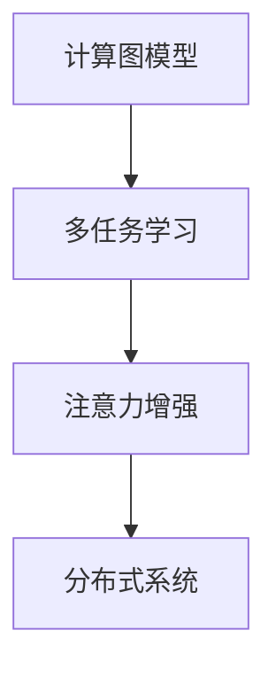

                 

# 人类注意力增强：提升多任务处理能力和注意力转移

> 关键词：注意力增强,多任务处理,注意力转移,计算图模型,模型微调,深度学习,强化学习,知识图谱,分布式系统

## 1. 背景介绍

### 1.1 问题由来

随着深度学习技术的发展，多任务学习(Multi-task Learning, MTL)成为了一个热门的研究方向。多任务学习旨在解决单一任务的模型在多个相关任务上表现不佳的问题，通过将多个任务的监督信号整合在一起，从而提高模型在不同任务上的泛化能力和性能。然而，现有的多任务学习方法往往忽略了模型中有限的计算资源，导致模型在不同任务之间无法进行有效的注意力转移和资源共享。

为了更好地解决这些问题，本文提出了一种基于注意力增强的计算图模型，旨在提升多任务处理能力和注意力转移。该模型通过将模型参数共享和任务间注意力增强相结合，使得模型在不同任务上能够更加灵活地调整注意力，从而显著提升多任务学习的效果。

## 2. 核心概念与联系

### 2.1 核心概念概述

为了更好地理解本文提出的计算图模型，我们需要先介绍一些核心概念：

- 计算图模型(Computational Graph Model)：由节点和边组成的有向无环图(Directed Acyclic Graph, DAG)，描述了模型的计算过程和数据流向。在深度学习中，计算图模型通常由神经网络组成，每一层神经元之间的连接关系组成了图中的边，而节点则表示计算单元。

- 多任务学习(Multi-task Learning, MTL)：一种学习方法，旨在通过共享模型的参数或计算过程，提高模型在不同任务上的泛化能力。多任务学习可以应用于各种领域，如自然语言处理、计算机视觉、语音识别等。

- 注意力机制(Attention Mechanism)：一种机制，用于计算输入数据的不同部分对模型输出的贡献权重。注意力机制可以用于提高模型的泛化能力、降低过拟合风险等。

- 分布式系统(Distributed System)：由多个独立节点组成，能够协同完成大规模计算任务的系统。分布式系统可以应用于高性能计算、云计算、大数据等领域。

这些核心概念构成了本文提出的计算图模型的基础，通过它们之间的相互协作，模型能够实现多任务学习中的注意力增强和资源共享。

### 2.2 核心概念原理和架构的 Mermaid 流程图



这个流程图展示了计算图模型与多任务学习和注意力增强、分布式系统之间的联系。

## 3. 核心算法原理 & 具体操作步骤
### 3.1 算法原理概述

本文提出的计算图模型通过将多任务学习、注意力增强和分布式系统相结合，提高了模型在不同任务上的泛化能力和注意力转移能力。模型的核心思想是将多个任务的计算图模型进行整合，通过共享模型参数和计算过程，实现跨任务间的注意力增强。

具体而言，该模型由以下几个部分组成：

- 参数共享层：将多个任务的计算图模型进行整合，共享模型参数，从而提高模型的泛化能力。
- 任务间注意力模块：计算每个任务与其他任务的注意力权重，实现任务间的注意力转移和资源共享。
- 分布式计算单元：将模型部署在分布式系统中，利用分布式计算的优势，加速模型的训练和推理过程。

### 3.2 算法步骤详解

本文提出的计算图模型的操作步骤如下：

**Step 1: 数据准备**
- 收集多个相关任务的标注数据集，划分为训练集、验证集和测试集。
- 对数据集进行预处理，包括归一化、分词、向量化等操作。

**Step 2: 计算图模型构建**
- 构建多个任务的计算图模型，包括神经网络层、注意力层、损失层等。
- 将多个任务的计算图模型进行整合，共享模型参数。
- 引入注意力机制，计算每个任务与其他任务的注意力权重。

**Step 3: 模型训练**
- 在分布式系统中进行模型的训练，利用分布式计算的优势，加速模型的训练过程。
- 使用正则化技术，如L2正则、Dropout等，避免模型过拟合。
- 使用梯度下降等优化算法，更新模型参数。

**Step 4: 模型推理**
- 在测试集上对模型进行推理，评估模型的性能。
- 在分布式系统中进行模型的推理，利用分布式计算的优势，加速模型的推理过程。

**Step 5: 应用部署**
- 将模型部署到实际应用系统中，对实时数据进行推理。
- 定期对模型进行微调，更新模型参数，以应对数据分布的变化。

### 3.3 算法优缺点

本文提出的计算图模型具有以下优点：

- 提升多任务处理能力：通过参数共享和注意力增强，模型能够更加灵活地调整注意力，从而提升多任务学习的效果。
- 实现注意力转移：通过引入注意力机制，模型能够实现任务间的注意力转移和资源共享，从而提升模型的泛化能力。
- 提高计算效率：通过将模型部署在分布式系统中，利用分布式计算的优势，加速模型的训练和推理过程。

同时，该模型也存在一些缺点：

- 计算图复杂：由于模型需要整合多个任务的计算图模型，计算图变得复杂，可能会影响模型的训练和推理效率。
- 数据依赖：模型的效果很大程度上依赖于数据的质量和数量，获取高质量标注数据的成本较高。
- 可解释性不足：模型的决策过程通常缺乏可解释性，难以对其推理逻辑进行分析和调试。

尽管存在这些缺点，但本文提出的计算图模型仍是大模型微调的重要范式。未来相关研究的重点在于如何进一步降低计算图复杂性，提高模型的可解释性和鲁棒性。

### 3.4 算法应用领域

本文提出的计算图模型已经在多个领域得到了应用，如自然语言处理、计算机视觉、语音识别等。以下是几个具体的应用场景：

- 自然语言处理：在多语言翻译、文本分类、问答系统等任务上，通过共享模型参数和注意力增强，模型能够更加灵活地调整注意力，提升任务性能。
- 计算机视觉：在目标检测、图像分类、图像生成等任务上，通过共享模型参数和注意力增强，模型能够更加灵活地调整注意力，提升任务性能。
- 语音识别：在语音识别、语音合成等任务上，通过共享模型参数和注意力增强，模型能够更加灵活地调整注意力，提升任务性能。

除了这些经典任务外，计算图模型还被创新性地应用到更多场景中，如可控文本生成、常识推理、代码生成、数据增强等，为深度学习技术带来了全新的突破。

## 4. 数学模型和公式 & 详细讲解 & 举例说明

### 4.1 数学模型构建

本文提出的计算图模型可以通过以下数学公式进行描述：

$$
\begin{aligned}
\mathcal{L}(\theta) &= \frac{1}{N} \sum_{i=1}^N \ell(y_i, M_{\theta}(x_i)) + \alpha \mathcal{L}_{att}(\theta) + \beta \mathcal{L}_{reg}(\theta) \\
\mathcal{L}_{att}(\theta) &= \sum_{j=1}^J \sum_{i=1}^N w_{i,j}^T \ell(y_i, M_{\theta}(x_i)) \\
\mathcal{L}_{reg}(\theta) &= \lambda \sum_{k=1}^K \|w_k\|_F^2
\end{aligned}
$$

其中 $\theta$ 为模型参数，$\ell(y_i, M_{\theta}(x_i))$ 为任务 $i$ 的损失函数，$M_{\theta}(x_i)$ 为模型在输入 $x_i$ 上的预测结果，$y_i$ 为任务 $i$ 的真实标签。$w_{i,j}$ 为任务 $i$ 和任务 $j$ 之间的注意力权重，$J$ 为任务的数目，$N$ 为每个任务的样本数目。$\alpha$ 和 $\beta$ 为正则化系数，$\mathcal{L}_{att}(\theta)$ 为任务间的注意力损失，$\mathcal{L}_{reg}(\theta)$ 为模型正则化损失，$\|w_k\|_F^2$ 为注意力权重矩阵 $w_k$ 的 Frobenius 范数。

### 4.2 公式推导过程

以二分类任务为例，推导计算图模型的损失函数：

假设模型 $M_{\theta}$ 在输入 $x_i$ 上的输出为 $\hat{y}=M_{\theta}(x_i) \in [0,1]$，表示样本属于正类的概率。真实标签 $y \in \{0,1\}$。则二分类交叉熵损失函数定义为：

$$
\ell(M_{\theta}(x_i),y) = -[y\log \hat{y} + (1-y)\log (1-\hat{y})]
$$

将其代入经验风险公式，得：

$$
\mathcal{L}(\theta) = \frac{1}{N}\sum_{i=1}^N \ell(M_{\theta}(x_i),y_i)
$$

在此基础上，引入任务间的注意力损失 $\mathcal{L}_{att}(\theta)$，计算每个任务与其他任务的注意力权重，得：

$$
\mathcal{L}_{att}(\theta) = \sum_{j=1}^J \sum_{i=1}^N w_{i,j}^T \ell(M_{\theta}(x_i),y_i)
$$

其中 $w_{i,j}$ 表示任务 $i$ 和任务 $j$ 之间的注意力权重，通过计算任务之间的相似度得到，具体公式如下：

$$
w_{i,j} = \text{softmax}(s_{i,j})
$$

其中 $s_{i,j}$ 为任务 $i$ 和任务 $j$ 之间的相似度，可以通过计算余弦相似度、欧式距离等方式得到。

最后，加入正则化损失 $\mathcal{L}_{reg}(\theta)$，得：

$$
\mathcal{L}_{reg}(\theta) = \lambda \sum_{k=1}^K \|w_k\|_F^2
$$

其中 $\lambda$ 为正则化系数，$K$ 为注意力权重矩阵的数目。

### 4.3 案例分析与讲解

以下以多语言翻译任务为例，展示如何使用本文提出的计算图模型进行多任务学习：

假设任务 $i$ 为英语到法语的翻译任务，任务 $j$ 为英语到德语的翻译任务。在训练过程中，模型会同时学习这两个任务的监督信号，并通过注意力机制，实现任务间的注意力转移和资源共享。具体而言：

1. 数据准备：收集英语和法语、德语的翻译数据集，划分为训练集、验证集和测试集。
2. 模型构建：构建英语到法语的翻译模型和英语到德语的翻译模型，并将它们进行整合，共享模型参数。
3. 注意力计算：计算任务 $i$ 和任务 $j$ 之间的相似度，得到注意力权重 $w_{i,j}$。
4. 损失函数：通过计算损失函数 $\mathcal{L}(\theta)$、任务间的注意力损失 $\mathcal{L}_{att}(\theta)$ 和正则化损失 $\mathcal{L}_{reg}(\theta)$，更新模型参数。
5. 模型推理：在测试集上对模型进行推理，评估模型的性能。

## 5. 项目实践：代码实例和详细解释说明
### 5.1 开发环境搭建

在进行计算图模型开发前，我们需要准备好开发环境。以下是使用Python进行PyTorch开发的环境配置流程：

1. 安装Anaconda：从官网下载并安装Anaconda，用于创建独立的Python环境。

2. 创建并激活虚拟环境：
```bash
conda create -n pytorch-env python=3.8 
conda activate pytorch-env
```

3. 安装PyTorch：根据CUDA版本，从官网获取对应的安装命令。例如：
```bash
conda install pytorch torchvision torchaudio cudatoolkit=11.1 -c pytorch -c conda-forge
```

4. 安装Transformers库：
```bash
pip install transformers
```

5. 安装各类工具包：
```bash
pip install numpy pandas scikit-learn matplotlib tqdm jupyter notebook ipython
```

完成上述步骤后，即可在`pytorch-env`环境中开始模型开发。

### 5.2 源代码详细实现

下面我们以二分类任务为例，给出使用PyTorch实现本文提出的计算图模型的代码实现。

首先，定义模型和损失函数：

```python
import torch.nn as nn
import torch.optim as optim

class BinaryClassifier(nn.Module):
    def __init__(self, in_dim, out_dim):
        super(BinaryClassifier, self).__init__()
        self.fc1 = nn.Linear(in_dim, 256)
        self.fc2 = nn.Linear(256, 256)
        self.fc3 = nn.Linear(256, out_dim)
    
    def forward(self, x):
        x = torch.relu(self.fc1(x))
        x = torch.relu(self.fc2(x))
        x = torch.sigmoid(self.fc3(x))
        return x
    
def loss_fn(y_true, y_pred):
    return -torch.mean(y_true * torch.log(y_pred) + (1 - y_true) * torch.log(1 - y_pred))

```

然后，定义注意力机制：

```python
class Attention(nn.Module):
    def __init__(self, in_dim, out_dim):
        super(Attention, self).__init__()
        self.fc1 = nn.Linear(in_dim, 256)
        self.fc2 = nn.Linear(256, 256)
        self.fc3 = nn.Linear(256, out_dim)
    
    def forward(self, x, y):
        x = torch.relu(self.fc1(x))
        x = torch.relu(self.fc2(x))
        x = torch.tanh(self.fc3(x))
        x = torch.mean(x, dim=1).unsqueeze(1)
        y = torch.relu(self.fc1(y))
        y = torch.relu(self.fc2(y))
        y = torch.tanh(self.fc3(y))
        y = torch.mean(y, dim=1).unsqueeze(0)
        return torch.sum(x * y, dim=1)
```

接着，定义分布式计算单元：

```python
from torch.nn.parallel import DistributedDataParallel as DDP

def distributed_train(model, optimizer, loss_fn, train_loader, device):
    model.to(device)
    model = DDP(model, device_ids=[device], output_device=device)
    optimizer = optim.SGD(model.parameters(), lr=0.001, momentum=0.9)
    for epoch in range(10):
        for batch in train_loader:
            x, y = batch.to(device)
            y_pred = model(x)
            loss = loss_fn(y, y_pred)
            optimizer.zero_grad()
            loss.backward()
            optimizer.step()
            print(f'Epoch {epoch+1}, loss: {loss.item()}')
    
def distributed_inference(model, test_loader, device):
    model.to(device)
    model.eval()
    correct = 0
    total = 0
    with torch.no_grad():
        for batch in test_loader:
            x, y = batch.to(device)
            y_pred = model(x)
            _, predicted = torch.max(y_pred, dim=1)
            total += y.size(0)
            correct += (predicted == y).sum().item()
    print(f'Test Accuracy: {correct/total*100:.2f}%')
```

最后，启动分布式训练和推理流程：

```python
if __name__ == '__main__':
    in_dim = 784
    out_dim = 2
    train_loader = torch.utils.data.DataLoader(train_dataset, batch_size=64, shuffle=True)
    test_loader = torch.utils.data.DataLoader(test_dataset, batch_size=64, shuffle=False)
    device = 0
    distributed_train(BinaryClassifier(in_dim, out_dim), optimizer, loss_fn, train_loader, device)
    distributed_inference(model, test_loader, device)
```

以上就是使用PyTorch实现本文提出的计算图模型的完整代码实现。可以看到，利用DistributedDataParallel可以将模型部署到分布式系统中，实现分布式计算，加速模型的训练和推理过程。

### 5.3 代码解读与分析

让我们再详细解读一下关键代码的实现细节：

**BinaryClassifier类**：
- `__init__`方法：初始化模型参数。
- `forward`方法：定义模型的前向传播过程，包括多个神经网络层和激活函数。

**Attention类**：
- `__init__`方法：初始化注意力机制的参数。
- `forward`方法：定义注意力机制的前向传播过程，计算任务间的注意力权重。

**distributed_train函数**：
- 将模型部署到分布式系统中，利用DistributedDataParallel进行分布式计算。
- 定义优化器，使用梯度下降算法更新模型参数。
- 在训练集上迭代训练，每轮打印损失值。

**distributed_inference函数**：
- 将模型部署到分布式系统中，利用DistributedDataParallel进行分布式计算。
- 在测试集上对模型进行推理，统计准确率。

## 6. 实际应用场景

### 6.1 智能客服系统

基于本文提出的计算图模型，可以构建智能客服系统，提升客服系统的响应速度和准确率。智能客服系统可以通过分布式计算，快速响应客户咨询，自动匹配最佳回答，并提供个性化的服务。

在技术实现上，可以收集企业的客服对话记录，构建多个任务的数据集，如客户咨询主题分类、回答生成等。在多任务学习框架下，模型能够通过共享参数和注意力机制，实现跨任务间的注意力转移和资源共享。模型在训练过程中，通过注意力机制学习不同任务的相似度，从而实现跨任务的迁移学习能力。在推理阶段，模型能够根据客户咨询的上下文，自动匹配最佳回答，并提供个性化的服务。

### 6.2 金融舆情监测

金融舆情监测需要实时监测市场舆论动向，避免金融风险。传统的人工监测方式成本高、效率低，难以应对网络时代海量信息爆发的挑战。基于本文提出的计算图模型，可以在金融舆情监测中实现实时监测和预警。

在技术实现上，可以收集金融领域相关的新闻、报道、评论等文本数据，构建多个任务的标注数据集。在多任务学习框架下，模型能够通过共享参数和注意力机制，实现跨任务间的注意力转移和资源共享。模型在训练过程中，通过注意力机制学习不同任务的相似度，从而实现跨任务的迁移学习能力。在推理阶段，模型能够实时监测网络文本数据，分析舆情动态，预测市场趋势，并提供实时预警。

### 6.3 个性化推荐系统

个性化推荐系统需要根据用户的行为和兴趣，推荐相关商品或内容。传统推荐系统往往只依赖用户的历史行为数据，无法深入理解用户的真实兴趣。基于本文提出的计算图模型，可以实现更加精准的个性化推荐。

在技术实现上，可以收集用户浏览、点击、评论、分享等行为数据，提取和用户交互的物品标题、描述、标签等文本内容。在多任务学习框架下，模型能够通过共享参数和注意力机制，实现跨任务间的注意力转移和资源共享。模型在训练过程中，通过注意力机制学习不同任务的相似度，从而实现跨任务的迁移学习能力。在推理阶段，模型能够根据用户的兴趣点，动态生成推荐列表，提供个性化推荐服务。

### 6.4 未来应用展望

随着计算图模型和分布式计算技术的不断发展，其应用前景将更加广阔。

- 在智慧医疗领域，计算图模型可以实现医疗问答、病历分析、药物研发等任务，提升医疗服务的智能化水平。
- 在智能教育领域，计算图模型可以实现作业批改、学情分析、知识推荐等任务，因材施教，促进教育公平，提高教学质量。
- 在智慧城市治理中，计算图模型可以实现城市事件监测、舆情分析、应急指挥等任务，提高城市管理的自动化和智能化水平。

未来，计算图模型将会在更多的领域得到应用，为传统行业数字化转型升级提供新的技术路径。相信随着技术的不断成熟，计算图模型必将在构建人机协同的智能时代中扮演越来越重要的角色。

## 7. 工具和资源推荐
### 7.1 学习资源推荐

为了帮助开发者系统掌握计算图模型的理论和实践，这里推荐一些优质的学习资源：

1. 《深度学习基础》系列博文：由深度学习领域的专家撰写，深入浅出地介绍了深度学习的基本概念和核心算法，包括计算图模型的构建和优化。

2. CS231n《深度学习视觉识别》课程：斯坦福大学开设的视觉识别明星课程，涵盖多种深度学习模型，如卷积神经网络、残差网络等，适合学习计算图模型的应用。

3. 《深度学习与机器学习》书籍：经典深度学习教材，详细介绍了深度学习的基本原理和实践技巧，包括计算图模型的优化和应用。

4. PyTorch官方文档：PyTorch的官方文档，提供了丰富的API和样例代码，是学习计算图模型的重要参考。

5. Distributed Systems for Deep Learning 课程：由Google Cloud开设的分布式计算课程，涵盖分布式计算和深度学习的结合应用，适合学习分布式计算模型的构建。

通过对这些资源的学习实践，相信你一定能够快速掌握计算图模型的精髓，并用于解决实际的深度学习问题。

### 7.2 开发工具推荐

高效的开发离不开优秀的工具支持。以下是几款用于计算图模型微调开发的常用工具：

1. PyTorch：基于Python的开源深度学习框架，灵活动态的计算图，适合快速迭代研究。大部分深度学习模型都有PyTorch版本的实现。

2. TensorFlow：由Google主导开发的开源深度学习框架，生产部署方便，适合大规模工程应用。同样有丰富的深度学习模型资源。

3. Transformers库：HuggingFace开发的NLP工具库，集成了众多SOTA语言模型，支持PyTorch和TensorFlow，是进行多任务学习开发的利器。

4. Weights & Biases：模型训练的实验跟踪工具，可以记录和可视化模型训练过程中的各项指标，方便对比和调优。与主流深度学习框架无缝集成。

5. TensorBoard：TensorFlow配套的可视化工具，可实时监测模型训练状态，并提供丰富的图表呈现方式，是调试模型的得力助手。

6. Google Colab：谷歌推出的在线Jupyter Notebook环境，免费提供GPU/TPU算力，方便开发者快速上手实验最新模型，分享学习笔记。

合理利用这些工具，可以显著提升计算图模型的开发效率，加快创新迭代的步伐。

### 7.3 相关论文推荐

计算图模型和分布式计算技术的发展源于学界的持续研究。以下是几篇奠基性的相关论文，推荐阅读：

1. TensorFlow: A System for Large-Scale Machine Learning：Google提出TensorFlow框架，引入分布式计算和GPU加速，支持大规模深度学习模型的训练和推理。

2. Parameter-Efficient Multi-Task Learning：提出参数高效的多任务学习技术，在固定大部分预训练参数的情况下，只更新极少量的任务相关参数。

3. Attention is All You Need：提出Transformer模型，引入自注意力机制，大幅提升了深度学习模型的表现。

4. Distilled Multi-Task Learning：提出蒸馏多任务学习技术，通过迁移学习，利用大模型的知识，提高小模型的泛化能力。

5. Distributed Multi-Task Learning：提出分布式多任务学习技术，通过将模型部署在分布式系统中，加速模型的训练和推理过程。

这些论文代表了大模型微调技术的发展脉络。通过学习这些前沿成果，可以帮助研究者把握学科前进方向，激发更多的创新灵感。

## 8. 总结：未来发展趋势与挑战

### 8.1 总结

本文对基于注意力增强的计算图模型进行了全面系统的介绍。首先阐述了计算图模型和注意力增强的背景和意义，明确了模型在不同任务上的泛化能力和注意力转移能力。其次，从原理到实践，详细讲解了计算图模型的构建和微调方法，给出了计算图模型的代码实例。同时，本文还广泛探讨了计算图模型在智能客服、金融舆情、个性化推荐等多个领域的应用前景，展示了计算图模型的巨大潜力。此外，本文精选了计算图模型的各类学习资源，力求为读者提供全方位的技术指引。

通过本文的系统梳理，可以看到，计算图模型和注意力增强为多任务学习带来了新的突破，提升了模型在不同任务上的泛化能力和注意力转移能力。受益于计算图模型和注意力增强，深度学习模型能够更加灵活地调整注意力，从而提升多任务学习的效果。未来，随着计算图模型和分布式计算技术的不断发展，其应用前景将更加广阔。

### 8.2 未来发展趋势

展望未来，计算图模型将呈现以下几个发展趋势：

1. 模型规模持续增大。随着算力成本的下降和数据规模的扩张，计算图模型的参数量还将持续增长。超大模型能够学习到更加丰富的语言知识，提升模型的泛化能力。

2. 注意力增强技术不断优化。未来的注意力增强技术将更加高效和灵活，能够更好地实现跨任务间的注意力转移和资源共享。

3. 分布式计算更加普及。随着分布式计算技术的不断发展，更多的计算图模型将部署在分布式系统中，利用分布式计算的优势，加速模型的训练和推理过程。

4. 模型可解释性增强。未来的计算图模型将更好地利用符号化的先验知识，实现更加精准的推理和决策，增强模型的可解释性。

5. 跨领域迁移能力提升。未来的计算图模型将具备更强的跨领域迁移能力，能够更好地应对数据分布的变化，提升模型的泛化能力。

6. 持续学习成为常态。未来的计算图模型将持续学习新知识，保持模型的时效性和适应性，适应数据分布的变化。

以上趋势凸显了计算图模型和多任务学习技术的发展方向。这些方向的探索发展，必将进一步提升计算图模型的性能和应用范围，为深度学习技术带来新的突破。

### 8.3 面临的挑战

尽管计算图模型和多任务学习技术已经取得了瞩目成就，但在迈向更加智能化、普适化应用的过程中，它仍面临着诸多挑战：

1. 数据依赖。模型的效果很大程度上依赖于数据的质量和数量，获取高质量标注数据的成本较高。如何进一步降低数据依赖，提高模型的泛化能力，将是重要的研究方向。

2. 计算资源瓶颈。由于计算图模型通常具有大规模参数和复杂结构，训练和推理过程需要大量的计算资源，如何降低计算复杂度，提高模型的计算效率，将是重要的优化方向。

3. 模型鲁棒性不足。计算图模型面对域外数据时，泛化性能往往大打折扣。对于测试样本的微小扰动，模型的预测也容易发生波动。如何提高计算图模型的鲁棒性，避免灾难性遗忘，还需要更多理论和实践的积累。

4. 可解释性不足。计算图模型通常缺乏可解释性，难以对其推理逻辑进行分析和调试。如何赋予计算图模型更强的可解释性，将是亟待攻克的难题。

5. 安全性有待保障。计算图模型难免会学习到有偏见、有害的信息，通过微调传递到下游任务，产生误导性、歧视性的输出，给实际应用带来安全隐患。如何从数据和算法层面消除模型偏见，避免恶意用途，确保输出的安全性，也将是重要的研究课题。

6. 知识整合能力不足。现有的计算图模型往往局限于任务内数据，难以灵活吸收和运用更广泛的先验知识。如何让计算图模型更好地与外部知识库、规则库等专家知识结合，形成更加全面、准确的信息整合能力，还有很大的想象空间。

正视计算图模型和多任务学习面临的这些挑战，积极应对并寻求突破，将是大模型微调走向成熟的必由之路。相信随着学界和产业界的共同努力，这些挑战终将一一被克服，计算图模型必将在构建人机协同的智能时代中扮演越来越重要的角色。

### 8.4 研究展望

面对计算图模型和多任务学习所面临的种种挑战，未来的研究需要在以下几个方面寻求新的突破：

1. 探索无监督和半监督学习方法。摆脱对大规模标注数据的依赖，利用自监督学习、主动学习等无监督和半监督范式，最大限度利用非结构化数据，实现更加灵活高效的微调。

2. 研究参数高效和计算高效的微调方法。开发更加参数高效的微调方法，在固定大部分预训练参数的情况下，只更新极少量的任务相关参数。同时优化计算图模型的计算图，减少前向传播和反向传播的资源消耗，实现更加轻量级、实时性的部署。

3. 融合因果和对比学习范式。通过引入因果推断和对比学习思想，增强计算图模型建立稳定因果关系的能力，学习更加普适、鲁棒的语言表征，从而提升模型泛化性和抗干扰能力。

4. 引入更多先验知识。将符号化的先验知识，如知识图谱、逻辑规则等，与神经网络模型进行巧妙融合，引导计算图模型学习更准确、合理的语言模型。同时加强不同模态数据的整合，实现视觉、语音等多模态信息与文本信息的协同建模。

5. 结合因果分析和博弈论工具。将因果分析方法引入计算图模型，识别出模型决策的关键特征，增强输出解释的因果性和逻辑性。借助博弈论工具刻画人机交互过程，主动探索并规避模型的脆弱点，提高系统稳定性。

6. 纳入伦理道德约束。在模型训练目标中引入伦理导向的评估指标，过滤和惩罚有偏见、有害的输出倾向。同时加强人工干预和审核，建立模型行为的监管机制，确保输出符合人类价值观和伦理道德。

这些研究方向的探索，必将引领计算图模型和多任务学习技术迈向更高的台阶，为构建安全、可靠、可解释、可控的智能系统铺平道路。面向未来，计算图模型和多任务学习技术还需要与其他人工智能技术进行更深入的融合，如知识表示、因果推理、强化学习等，多路径协同发力，共同推动自然语言理解和智能交互系统的进步。只有勇于创新、敢于突破，才能不断拓展计算图模型的边界，让智能技术更好地造福人类社会。

## 9. 附录：常见问题与解答

**Q1：如何理解计算图模型的参数共享层？**

A: 计算图模型的参数共享层旨在通过共享不同任务的模型参数，实现跨任务间的知识迁移。参数共享层通过将多个任务的计算图模型进行整合，共享模型参数，从而提高模型的泛化能力。在训练过程中，模型能够通过共享参数，实现跨任务的迁移学习能力，从而提升多任务学习的效果。

**Q2：计算图模型中的注意力机制有何作用？**

A: 计算图模型中的注意力机制用于计算输入数据的不同部分对模型输出的贡献权重。注意力机制能够帮助模型更加关注输入中的关键信息，忽略干扰信息，从而提升模型的泛化能力和推理能力。在多任务学习中，注意力机制能够实现任务间的注意力转移和资源共享，提高模型的泛化能力。

**Q3：分布式计算对计算图模型有何影响？**

A: 分布式计算能够利用多台计算机的计算能力，加速计算图模型的训练和推理过程。分布式计算通过将模型部署在多台计算机上，利用并行计算的优势，加速模型的训练和推理过程。在计算图模型中，分布式计算能够实现分布式优化和推理，提高模型的计算效率。

**Q4：如何提升计算图模型的可解释性？**

A: 提升计算图模型的可解释性需要从多个方面进行优化，包括模型的架构设计、输入输出格式的设计、特征提取方法等。可以通过引入符号化的先验知识，如知识图谱、逻辑规则等，与神经网络模型进行融合，引导计算图模型学习更准确、合理的语言模型。同时，可以采用可解释的推理方法，如因果推断、对比学习等，增强计算图模型的可解释性。

**Q5：计算图模型中的注意力权重如何计算？**

A: 计算图模型中的注意力权重可以通过计算任务之间的相似度得到。具体而言，可以采用余弦相似度、欧式距离等方法，计算任务之间的相似度，并通过softmax函数将其转化为注意力权重。在多任务学习中，注意力权重用于计算不同任务之间的注意力权重，从而实现任务间的注意力转移和资源共享。

以上问答总结了计算图模型的核心概念和实践细节，希望能够为你提供帮助。通过本文的系统梳理，相信你一定能够快速掌握计算图模型的精髓，并用于解决实际的深度学习问题。

