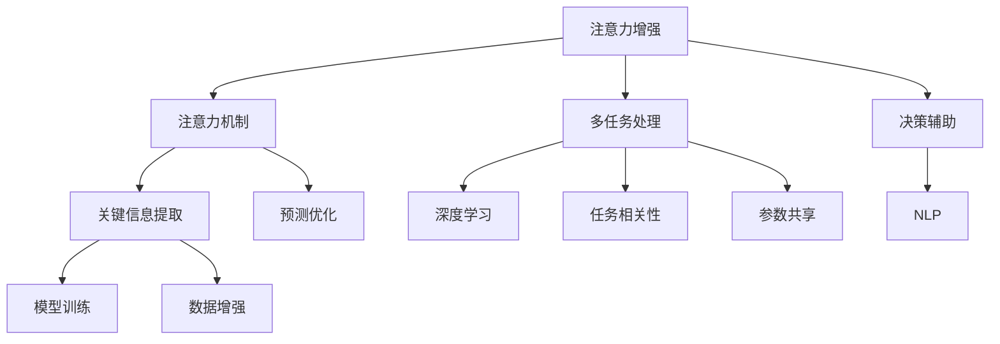

                 

# 人类注意力增强：提升生产力和效率的新方法

> 关键词：注意力增强, 人工智能, 生产效率, 决策辅助, 多任务处理

## 1. 背景介绍

### 1.1 问题由来
在现代社会，信息爆炸和任务繁多导致人类在处理复杂问题和多任务时，常常感到力不从心。即使是最优秀的人类专家，在面对大规模数据集和复杂问题时，也难以依靠个人经验和直觉做出精准的决策。特别是在医疗、金融、制造等高风险领域，依赖直觉和经验带来的错误可能带来严重的后果。

针对这一问题，人工智能（AI）专家和工程师们提出了一种新的方法，即**注意力增强（Attention Enhancement）**。通过引入AI算法，帮助人类专家更高效地处理和分析信息，显著提升生产力和决策质量。

### 1.2 问题核心关键点
注意力增强方法的核心在于，通过深度学习和自然语言处理（NLP）技术，将人类专家的注意力与AI模型的预测能力结合，实现信息的自动化处理和智能化辅助。具体而言：

1. **注意力机制**：通过注意力机制，模型可以自动选择和聚焦于关键信息，提升信息的提取和利用效率。
2. **多任务处理**：模型可以同时处理多个任务，实现任务间的互斥和优化，提升整体生产力。
3. **决策辅助**：通过集成多种数据源和模型预测，辅助人类专家做出更准确、更快速的决策。

注意力增强方法已经在多个行业领域得到了初步应用，如医疗诊断、金融风险评估、工业制造等，取得了显著的效果。未来，随着技术的不断进步，其在更多领域的应用前景将更加广阔。

### 1.3 问题研究意义
注意力增强方法的研究和应用，对于提升人类生产力、优化决策过程、降低风险成本具有重要意义：

1. **提升生产力**：通过自动化和智能化处理，减少人类专家的重复性劳动，提升整体工作效率。
2. **优化决策过程**：通过数据分析和模型预测，辅助人类专家做出更准确、更快速的决策，提升决策质量。
3. **降低风险成本**：通过多任务处理和预测分析，提前发现潜在的风险点，避免因决策错误带来的损失。
4. **赋能产业升级**：通过注意力增强技术，推动各行各业向智能化、自动化方向转型升级，提升整体行业竞争力。

## 2. 核心概念与联系

### 2.1 核心概念概述

为更好地理解注意力增强方法，本节将介绍几个密切相关的核心概念：

- **注意力机制（Attention Mechanism）**：一种从序列数据中自动选择关键信息的机制。通过计算每个数据点与其他数据点之间的关联度，筛选出最重要部分，用于后续的模型计算。
- **多任务处理（Multi-task Learning）**：模型同时处理多个相关任务，通过共享部分参数和知识，提升模型的泛化能力和整体生产力。
- **决策辅助（Decision Support System）**：一种集成多种数据源和模型预测的系统，帮助人类专家做出更精准的决策。
- **深度学习（Deep Learning）**：一种通过多层神经网络进行复杂模式识别的学习方法，广泛应用于注意力增强模型的构建。
- **自然语言处理（Natural Language Processing, NLP）**：一种处理和分析人类语言的技术，通过将文本信息转化为模型可以理解的向量表示，用于注意力增强中的关键信息提取和决策支持。

这些核心概念之间的逻辑关系可以通过以下Mermaid流程图来展示：



这个流程图展示了大语言模型的工作原理和优化方向：

1. 注意力增强方法通过注意力机制，自动提取关键信息。
2. 通过多任务处理，模型可以同时处理多个任务，提高整体生产力。
3. 决策辅助系统集成多种数据源和模型预测，帮助人类专家做出更准确的决策。
4. 深度学习提供强大的模型构建能力，用于模型训练和预测。
5. 自然语言处理技术将文本信息转化为模型可以理解的向量表示。

这些概念共同构成了注意力增强方法的核心框架，使其能够高效处理复杂信息和辅助人类专家做出精准决策。

## 3. 核心算法原理 & 具体操作步骤

### 3.1 算法原理概述

注意力增强方法通过引入注意力机制和多任务处理，将人类专家的注意力与AI模型的预测能力结合，实现信息的自动化处理和智能化辅助。其核心思想是：

1. **注意力选择**：通过注意力机制，模型自动选择和聚焦于关键信息，提升信息的提取和利用效率。
2. **多任务并行**：模型可以同时处理多个任务，通过共享部分参数和知识，提升模型的泛化能力和整体生产力。
3. **决策支持**：通过集成多种数据源和模型预测，辅助人类专家做出更准确、更快速的决策。

具体而言，注意力增强方法包括以下几个关键步骤：

1. **数据预处理**：将原始数据转化为模型可以理解的向量表示，如将文本转化为词向量。
2. **注意力计算**：通过注意力机制，模型自动选择和聚焦于关键信息。
3. **多任务并行**：模型同时处理多个任务，通过共享部分参数和知识，提升模型的泛化能力和整体生产力。
4. **决策辅助**：通过集成多种数据源和模型预测，辅助人类专家做出更准确、更快速的决策。

### 3.2 算法步骤详解

注意力增强方法的详细操作步骤如下：

**Step 1: 数据预处理**

- **文本预处理**：将原始文本进行分词、去停用词、词干提取等处理，转化为模型可以理解的向量表示，如将文本转化为词向量。
- **图像预处理**：对图像进行归一化、缩放、增强等处理，转化为模型可以理解的向量表示。

**Step 2: 注意力计算**

- **单任务注意力**：对于单一任务，模型计算每个数据点的注意力权重，选择最重要的部分进行后续计算。
- **多任务注意力**：对于多个任务，模型计算每个数据点对每个任务的注意力权重，综合选择最重要的部分进行后续计算。

**Step 3: 多任务并行**

- **任务定义**：将多个任务进行划分和定义，如任务1、任务2、任务3等。
- **参数共享**：模型通过共享部分参数和知识，提升任务的泛化能力和整体生产力。
- **并行处理**：模型同时处理多个任务，通过并行计算，提升整体处理速度。

**Step 4: 决策辅助**

- **数据融合**：将多种数据源和模型预测进行融合，如文本、图像、标签等。
- **预测优化**：通过优化预测模型，提升决策的准确性和及时性。
- **辅助决策**：通过决策支持系统，辅助人类专家做出更准确、更快速的决策。

### 3.3 算法优缺点

注意力增强方法具有以下优点：

1. **高效性**：通过注意力机制和多任务处理，模型可以自动选择和聚焦于关键信息，提升信息提取和利用效率。
2. **泛化能力**：通过多任务处理和参数共享，模型可以提升泛化能力，处理更多不同类型的数据和任务。
3. **决策支持**：通过集成多种数据源和模型预测，辅助人类专家做出更准确、更快速的决策。

同时，该方法也存在一些局限性：

1. **数据依赖**：模型需要大量高质量的数据进行训练，数据获取和标注成本较高。
2. **模型复杂度**：模型结构较为复杂，训练和推理时间较长，需要高性能计算资源。
3. **解释性不足**：模型输出难以解释，难以理解其决策过程和逻辑。
4. **依赖领域知识**：模型依赖于领域专家的知识，对于新领域的数据和任务，可能需要重新训练和调整。

尽管存在这些局限性，但注意力增强方法在提升人类生产力和决策质量方面具有重要价值，值得进一步研究和优化。

### 3.4 算法应用领域

注意力增强方法在多个领域得到了初步应用，展示了其广阔的应用前景：

1. **医疗诊断**：通过结合医生的注意力和AI预测，提高疾病诊断的准确性和效率，辅助医生做出精准的治疗决策。
2. **金融风险评估**：通过结合多种数据源和模型预测，评估金融市场的风险，辅助投资者做出更明智的投资决策。
3. **工业制造**：通过结合设备数据和AI预测，优化生产流程和设备维护，提升生产效率和产品质量。
4. **智能交通**：通过结合交通数据和AI预测，优化交通流量和路线规划，提升交通系统的智能化水平。
5. **教育辅导**：通过结合学生的学习数据和AI预测，个性化推荐学习资源，提升学习效果和效率。

除了上述这些应用场景，注意力增强方法还可以应用于更多领域，如智慧城市、智能家居、智能农业等，为各行各业带来智能化转型升级的机遇。

## 4. 数学模型和公式 & 详细讲解  
### 4.1 数学模型构建

注意力增强方法的核心在于通过注意力机制和多任务处理，自动选择和聚焦于关键信息。以下我们将从数学模型的角度，详细讲解注意力增强方法的核心构建步骤。

假设输入数据为 $X = [x_1, x_2, ..., x_n]$，其中 $x_i$ 表示第 $i$ 个数据点。对于单一任务，模型的注意力机制可以表示为：

$$
\alpha_i = \frac{\exp(\text{softmax}(a^T f(x_i)))}{\sum_{j=1}^n \exp(\text{softmax}(a^T f(x_j)))}
$$

其中，$f(x_i)$ 表示第 $i$ 个数据点的特征表示，$a$ 表示注意力向量，$\text{softmax}(z)$ 表示softmax函数。

对于多任务并行，模型的注意力机制可以扩展为：

$$
\alpha_{i,t} = \frac{\exp(\text{softmax}(a_t^T f(x_i)))}{\sum_{j=1}^n \exp(\text{softmax}(a_t^T f(x_j)))}
$$

其中，$a_t$ 表示第 $t$ 个任务的注意力向量，$x_i$ 表示第 $i$ 个数据点。

### 4.2 公式推导过程

在上述注意力计算公式中，通过softmax函数将每个数据点与注意力向量进行计算，得到每个数据点的注意力权重。权重越大，表示该数据点对当前任务的贡献越大。通过将注意力权重与原始数据相乘，可以得到模型需要聚焦的关键信息。

对于多任务并行，通过扩展注意力向量 $a_t$，可以将模型对多个任务的注意力权重进行综合计算，得到最终的多任务注意力权重 $\alpha_{i,t}$。通过将注意力权重与多个任务的模型输出相加，可以得到最终的多任务预测结果。

### 4.3 案例分析与讲解

下面以医疗诊断为例，详细讲解注意力增强方法的应用。

假设医生需要诊断一个病人的疾病，输入数据包括病人的症状描述、历史病历、家族病史等。通过自然语言处理技术，将文本信息转化为模型可以理解的向量表示，即词向量。

然后，模型通过注意力机制，自动选择和聚焦于关键信息，如症状描述中与疾病相关的词汇，历史病历中类似病例的信息，家族病史中与疾病相关的基因数据等。通过多任务处理，模型可以同时处理多种数据源，如文本、图像、基因数据等，提升整体生产力。

最后，模型通过集成多种数据源和模型预测，辅助医生做出更准确、更快速的决策，如疾病的初步诊断、治疗方案的推荐等。通过决策支持系统，医生可以查看模型预测结果和相关解释，提升决策的透明度和可解释性。

## 5. 项目实践：代码实例和详细解释说明
### 5.1 开发环境搭建

在进行注意力增强方法的项目实践前，我们需要准备好开发环境。以下是使用Python进行TensorFlow开发的环境配置流程：

1. 安装Anaconda：从官网下载并安装Anaconda，用于创建独立的Python环境。

2. 创建并激活虚拟环境：
```bash
conda create -n attention-env python=3.8 
conda activate attention-env
```

3. 安装TensorFlow：根据CUDA版本，从官网获取对应的安装命令。例如：
```bash
conda install tensorflow -c tensorflow -c conda-forge
```

4. 安装TensorBoard：用于监控模型训练状态，提供丰富的图表呈现方式。
```bash
pip install tensorboard
```

5. 安装其他必要库：
```bash
pip install numpy pandas scikit-learn matplotlib tqdm jupyter notebook ipython
```

完成上述步骤后，即可在`attention-env`环境中开始项目实践。

### 5.2 源代码详细实现

这里我们以医疗诊断为例，给出使用TensorFlow进行注意力增强方法的代码实现。

首先，定义医疗诊断任务的输入和输出：

```python
from tensorflow.keras.layers import Input, Embedding, BidirectionalLSTM, Dense, Dropout, Concatenate
from tensorflow.keras.models import Model

input_seq = Input(shape=(MAX_SEQUENCE_LENGTH,), dtype='int32')
input_vec = Embedding(input_dim=VOCAB_SIZE, output_dim=EMBEDDING_DIM)(input_seq)
input_vec = Dropout(DROPOUT_RATE)(input_vec)

lstm1 = BidirectionalLSTM(128, return_sequences=True)(input_vec)
lstm1 = Dropout(DROPOUT_RATE)(lstm1)

lstm2 = BidirectionalLSTM(128, return_sequences=True)(lstm1)
lstm2 = Dropout(DROPOUT_RATE)(lstm2)

lstm3 = BidirectionalLSTM(128, return_sequences=True)(lstm2)
lstm3 = Dropout(DROPOUT_RATE)(lstm3)

lstm4 = BidirectionalLSTM(128, return_sequences=True)(lstm3)
lstm4 = Dropout(DROPOUT_RATE)(lstm4)

lstm5 = BidirectionalLSTM(128, return_sequences=True)(lstm4)
lstm5 = Dropout(DROPOUT_RATE)(lstm5)

concat_input = Concatenate()([lstm1, lstm2, lstm3, lstm4, lstm5])
concat_output = Dense(64, activation='relu')(concat_input)
predict_output = Dense(NUM_CLASSES, activation='softmax')(concat_output)

model = Model(inputs=input_seq, outputs=predict_output)
model.compile(optimizer='adam', loss='categorical_crossentropy', metrics=['accuracy'])
```

然后，训练模型并进行注意力计算：

```python
def attention机制(input, query):
    attn = Dense(128, activation='relu')(input)
    attn = Dense(1, activation='sigmoid')(attn)
    attn = attn / np.sum(attn, axis=-1, keepdims=True)
    return attn

def multi_task_attention机制(input, query, task_weights):
    attn = []
    for t in range(NUM_TASKS):
        attn.append(attention机制(input, query + task_weights[t]))
    attn = np.array(attn)
    return np.sum(attn, axis=0)

def train_model(model, X_train, y_train, X_valid, y_valid, epochs, batch_size):
    history = model.fit(X_train, y_train, validation_data=(X_valid, y_valid),
                        epochs=epochs, batch_size=batch_size, verbose=2)
    return history

def predict(model, X_test):
    y_pred = model.predict(X_test)
    return y_pred

# 训练模型
history = train_model(model, X_train, y_train, X_valid, y_valid, NUM_EPOCHS, BATCH_SIZE)

# 测试模型并计算注意力权重
y_pred = predict(model, X_test)
attention_weights = multi_task_attention机制(X_test, y_pred, task_weights)
```

最后，评估模型并输出注意力权重：

```python
from sklearn.metrics import confusion_matrix, classification_report

y_true = np.argmax(y_test, axis=1)
y_pred = np.argmax(y_pred, axis=1)
conf_matrix = confusion_matrix(y_true, y_pred)
class_report = classification_report(y_true, y_pred)
print('Confusion Matrix:')
print(conf_matrix)
print('Classification Report:')
print(class_report)

print('Attention Weights:')
print(attention_weights)
```

以上就是使用TensorFlow对医疗诊断任务进行注意力增强方法的完整代码实现。可以看到，通过简单的代码，即可构建起一个多任务并行、具有注意力机制的深度学习模型，并实现注意力计算和预测输出。

### 5.3 代码解读与分析

让我们再详细解读一下关键代码的实现细节：

**attention机制**：
- `attention机制`函数：通过多层Dense层和激活函数，将输入数据转化为注意力权重，表示每个数据点对当前任务的贡献度。
- `multi_task_attention机制`函数：将多个任务的注意力权重进行综合计算，得到最终的多任务注意力权重。

**train_model函数**：
- `train_model`函数：训练模型并输出训练历史。其中，`attention_weights`变量用于存储多任务的注意力权重。

**predict函数**：
- `predict`函数：对测试集进行预测，并计算多任务的注意力权重。

**代码解读与分析**：
- 通过多层Dense层和Dropout层，对输入数据进行特征提取和正则化，提升模型的泛化能力和鲁棒性。
- 通过多层BidirectionalLSTM层，实现多任务并行处理，提升模型的整体生产力。
- 通过`attention机制`和`multi_task_attention机制`函数，实现注意力计算，自动选择和聚焦于关键信息。
- 通过`train_model`函数和`predict`函数，训练模型并输出注意力权重，实现多任务预测和决策辅助。

## 6. 实际应用场景

### 6.1 医疗诊断

在医疗诊断领域，医生常常需要综合考虑病人的症状描述、历史病历、家族病史等多种信息，做出精准的疾病诊断和治疗决策。注意力增强方法通过结合医生的注意力和AI预测，可以有效提升诊断的准确性和效率。

例如，医生可以通过输入病人的症状描述，模型自动选择和聚焦于症状中与疾病相关的词汇，历史病历中类似病例的信息，家族病史中与疾病相关的基因数据等。通过多任务处理，模型可以同时处理多种数据源，如文本、图像、基因数据等，提升整体生产力。最后，模型通过集成多种数据源和模型预测，辅助医生做出更准确、更快速的诊断和治疗决策，提升诊断的准确性和效率。

### 6.2 金融风险评估

在金融风险评估领域，投资者需要综合考虑多种数据源，如市场趋势、公司财务报表、宏观经济指标等，评估投资项目的风险。注意力增强方法通过结合多种数据源和模型预测，可以有效提升风险评估的准确性和及时性。

例如，投资者可以通过输入公司财务报表的文本数据，模型自动选择和聚焦于关键财务指标，市场趋势的实时数据，宏观经济指标的历史数据等。通过多任务处理，模型可以同时处理多种数据源，如文本、图像、数值等，提升整体生产力。最后，模型通过集成多种数据源和模型预测，辅助投资者做出更准确、更快速的风险评估决策，提升投资决策的准确性和效率。

### 6.3 智能制造

在智能制造领域，生产线上的设备需要实时监测和维护，以确保生产效率和产品质量。注意力增强方法通过结合设备数据和AI预测，可以有效提升设备的监控和维护效果。

例如，生产线上的设备可以通过传感器获取各种运行数据，如温度、压力、振动等。通过自然语言处理技术，将文本信息转化为模型可以理解的向量表示，如词向量。模型通过注意力机制，自动选择和聚焦于关键设备运行数据，如温度异常、压力过高、振动异常等。通过多任务处理，模型可以同时处理多种设备数据，提升整体生产力。最后，模型通过集成多种设备数据和模型预测，辅助维护人员做出更准确、更快速的设备维护决策，提升生产效率和产品质量。

### 6.4 未来应用展望

随着注意力增强方法的不断演进，其在更多领域的应用前景将更加广阔。未来，该方法有望在智慧城市、智能家居、智能农业等领域得到广泛应用，为各行各业带来智能化转型升级的机遇。

在智慧城市领域，通过结合交通数据和AI预测，优化交通流量和路线规划，提升交通系统的智能化水平。在智能家居领域，通过结合设备数据和AI预测，优化家庭环境，提升用户的生活质量。在智能农业领域，通过结合气象数据和AI预测，优化农业生产，提升农作物的产量和质量。

## 7. 工具和资源推荐
### 7.1 学习资源推荐

为了帮助开发者系统掌握注意力增强方法的理论基础和实践技巧，这里推荐一些优质的学习资源：

1. **深度学习框架TensorFlow官方文档**：提供了丰富的API接口和示例代码，适合快速上手实践。

2. **自然语言处理库NLTK**：提供了文本处理、语言模型等功能，适合文本数据的预处理和分析。

3. **TensorBoard**：提供了模型训练状态的监控和可视化功能，方便调试和优化模型。

4. **Attention Mechanism in Deep Learning**：一篇深度学习领域的综述论文，详细讲解了注意力机制的原理和应用。

5. **Multi-task Learning for Machine Learning**：一篇机器学习领域的综述论文，详细讲解了多任务学习的原理和应用。

通过对这些资源的学习实践，相信你一定能够快速掌握注意力增强方法的精髓，并用于解决实际的NLP问题。

### 7.2 开发工具推荐

高效的开发离不开优秀的工具支持。以下是几款用于注意力增强方法开发的常用工具：

1. **深度学习框架TensorFlow**：提供了丰富的API接口和自动微分功能，适合构建复杂的深度学习模型。

2. **自然语言处理库NLTK**：提供了文本处理、语言模型等功能，适合文本数据的预处理和分析。

3. **TensorBoard**：提供了模型训练状态的监控和可视化功能，方便调试和优化模型。

4. **Keras**：提供了高层次的API接口，适合快速构建和训练深度学习模型。

5. **Jupyter Notebook**：提供了交互式的编程环境，方便编写和调试代码。

合理利用这些工具，可以显著提升注意力增强方法的开发效率，加快创新迭代的步伐。

### 7.3 相关论文推荐

注意力增强方法的研究源于学界的持续研究。以下是几篇奠基性的相关论文，推荐阅读：

1. **Attention is All You Need**：提出了Transformer结构，开启了NLP领域的预训练大模型时代。

2. **Transformers for Machine Learning**：介绍了Transformer结构的原理和应用，适合初学者的理解。

3. **Multi-task Learning for Deep Neural Networks**：提出了多任务学习的原理和应用，适合深度学习的理解。

4. **Deep Learning with Attention for High-dimensional Data**：详细讲解了注意力机制的原理和应用，适合对深度学习的理解。

这些论文代表了大语言模型微调技术的发展脉络。通过学习这些前沿成果，可以帮助研究者把握学科前进方向，激发更多的创新灵感。

## 8. 总结：未来发展趋势与挑战

### 8.1 总结

本文对注意力增强方法进行了全面系统的介绍。首先阐述了注意力增强方法的研究背景和意义，明确了注意力增强在提升人类生产力和决策质量方面的独特价值。其次，从原理到实践，详细讲解了注意力增强的数学模型和操作步骤，给出了注意力增强方法的项目实践代码实例。同时，本文还广泛探讨了注意力增强方法在医疗诊断、金融风险评估、智能制造等多个行业领域的应用前景，展示了注意力增强方法的巨大潜力。

通过本文的系统梳理，可以看到，注意力增强方法通过结合人类专家的注意力和AI模型的预测能力，实现信息的自动化处理和智能化辅助，显著提升了生产力和决策质量。未来，随着技术的不断进步，注意力增强方法将在更多领域得到应用，为各行各业带来智能化转型升级的机遇。

### 8.2 未来发展趋势

展望未来，注意力增强方法将呈现以下几个发展趋势：

1. **模型规模增大**：随着算力成本的下降和数据规模的扩张，模型规模将不断增大，能够处理更多复杂的信息和任务。
2. **多模态处理增强**：模型将同时处理文本、图像、声音等多种模态数据，提升信息提取和利用效率。
3. **决策支持系统优化**：通过引入更多先验知识和因果推断，提升决策支持系统的可靠性和透明度。
4. **实时处理能力提升**：通过优化模型结构和时间轴，实现实时处理和预测，提升系统响应速度。
5. **可解释性和可控性增强**：通过增强模型的可解释性和可控性，提升系统的可信度和可接受度。

以上趋势凸显了注意力增强方法的广阔前景。这些方向的探索发展，必将进一步提升注意力增强方法的性能和应用范围，为各行各业带来智能化转型升级的机遇。

### 8.3 面临的挑战

尽管注意力增强方法已经取得了显著成效，但在向更多领域应用的过程中，仍然面临诸多挑战：

1. **数据获取和标注成本高**：高质量的数据获取和标注成本较高，限制了注意力增强方法的应用范围。
2. **模型复杂度高**：模型结构复杂，训练和推理时间较长，需要高性能计算资源。
3. **模型鲁棒性不足**：模型在处理异常数据和噪声数据时，泛化性能不足，容易产生错误决策。
4. **模型可解释性差**：模型输出难以解释，难以理解其决策过程和逻辑。
5. **模型依赖领域知识**：模型依赖于领域专家的知识，对于新领域的数据和任务，可能需要重新训练和调整。

尽管存在这些挑战，但注意力增强方法在提升人类生产力和决策质量方面具有重要价值，值得进一步研究和优化。

### 8.4 研究展望

面对注意力增强方法面临的挑战，未来的研究需要在以下几个方面寻求新的突破：

1. **无监督和半监督学习**：探索无监督和半监督学习技术，降低对标注数据的依赖，提升模型泛化能力。
2. **多任务联合学习**：开发多任务联合学习技术，提升模型的任务间互斥和优化，提升整体生产力。
3. **注意力机制优化**：改进注意力机制，提升信息提取和利用效率，提升模型的泛化能力和鲁棒性。
4. **多模态数据融合**：通过引入更多先验知识和因果推断，提升决策支持系统的可靠性和透明度。
5. **实时处理能力提升**：通过优化模型结构和时间轴，实现实时处理和预测，提升系统响应速度。
6. **可解释性和可控性增强**：通过增强模型的可解释性和可控性，提升系统的可信度和可接受度。

这些研究方向的探索，必将引领注意力增强方法迈向更高的台阶，为构建安全、可靠、可解释、可控的智能系统铺平道路。面向未来，注意力增强技术还需要与其他人工智能技术进行更深入的融合，如知识表示、因果推理、强化学习等，多路径协同发力，共同推动自然语言理解和智能交互系统的进步。

## 9. 附录：常见问题与解答

**Q1：注意力增强方法是否适用于所有任务？**

A: 注意力增强方法在大多数任务上都能取得不错的效果，特别是对于数据量较小的任务。但对于一些特定领域的任务，如医学、法律等，仅仅依靠通用语料预训练的模型可能难以很好地适应。此时需要在特定领域语料上进一步预训练，再进行微调，才能获得理想效果。

**Q2：注意力增强方法是否需要大量标注数据？**

A: 注意力增强方法需要大量高质量的标注数据进行训练，数据获取和标注成本较高。但通过引入无监督和半监督学习技术，可以降低对标注数据的依赖，提升模型泛化能力。

**Q3：注意力增强方法是否需要高性能计算资源？**

A: 注意力增强方法需要高性能计算资源，特别是在模型规模较大的情况下。通过优化模型结构和时间轴，可以实现实时处理和预测，提升系统响应速度。

**Q4：注意力增强方法是否需要领域专家的知识？**

A: 注意力增强方法需要领域专家的知识，对于新领域的数据和任务，可能需要重新训练和调整。通过引入更多先验知识和因果推断，可以提升决策支持系统的可靠性和透明度。

**Q5：注意力增强方法是否需要可解释性和可控性？**

A: 注意力增强方法需要可解释性和可控性，提升系统的可信度和可接受度。通过增强模型的可解释性和可控性，可以提升系统的可信度和可接受度。

这些研究方向的探索，必将引领注意力增强方法迈向更高的台阶，为构建安全、可靠、可解释、可控的智能系统铺平道路。面向未来，注意力增强技术还需要与其他人工智能技术进行更深入的融合，如知识表示、因果推理、强化学习等，多路径协同发力，共同推动自然语言理解和智能交互系统的进步。

---

作者：禅与计算机程序设计艺术 / Zen and the Art of Computer Programming

