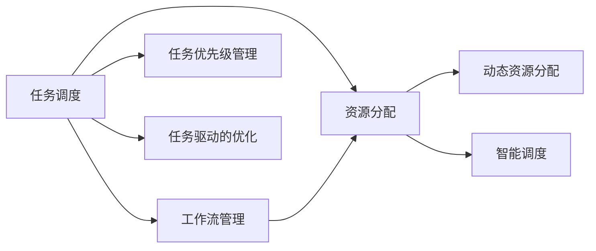

                 

# 人类注意力增强：提升生产力和效率的新方法

> 关键词：注意力增强,生产效率,计算资源,任务调度,计算图优化,智能调度,实时监控,动态资源分配,工作流自动化,任务驱动的优化

## 1. 背景介绍

### 1.1 问题由来
在数字化时代，生产力和效率的提升，不仅依赖于计算资源，更依赖于如何高效地利用这些资源。随着大型应用系统的复杂性和规模不断扩大，单一资源、单一任务的分配和调度方式越来越难以满足多任务并行处理的需求。

现有任务调度系统往往难以考虑任务执行过程中动态变化的资源需求，导致计算资源浪费严重，任务执行效率低下。这一问题在诸如深度学习模型训练、数据分析、科学计算等高性能计算任务中尤为突出。

同时，由于任务间资源需求的不均衡性，往往导致"瓶颈"资源被过度占用，而其他资源却闲置浪费。例如，在GPU集群中，由于模型并行化处理的需求，某些GPU节点往往需要承担更多的计算任务，导致过载，而其他节点却闲置。这种不均衡的资源分配，加剧了计算资源的闲置和浪费，降低了整体系统的效率。

### 1.2 问题核心关键点
要解决上述问题，需要在资源调度过程中引入更为灵活和动态的策略，通过实时监控和智能调度，最大化地利用计算资源。以下是该问题的核心关键点：

- 动态资源分配：通过实时监控计算任务的状态和资源需求，动态调整计算资源分配，避免过载和闲置。
- 任务优先级管理：基于任务重要性和紧急程度，合理设置任务优先级，确保关键任务及时执行。
- 工作流自动化：自动化地调度和管理任务依赖关系，减少人工干预，提升系统效率。
- 任务驱动的优化：针对不同类型任务的特点，设计适合的优化策略，提高任务处理速度。

### 1.3 问题研究意义
研究任务调度与资源优化的方法，对于提升大型应用系统的生产力和效率，具有重要意义：

1. 提升资源利用率：通过优化计算资源的分配和调度，最大化地利用有限的计算资源。
2. 缩短任务执行时间：通过智能调度，避免任务间的资源冲突和等待时间，加快任务处理速度。
3. 减少人工干预：自动化和智能化的任务调度方式，可以减少人工干预，提高系统可靠性。
4. 支持任务复杂性：对于包含多任务、多步骤的任务流程，需要系统能够动态调整任务依赖关系，支持复杂性管理。
5. 增强系统鲁棒性：通过动态资源分配和任务优先级管理，可以提升系统的鲁棒性和容错能力，确保关键任务的及时执行。

## 2. 核心概念与联系

### 2.1 核心概念概述

为更好地理解本文的核心概念，我们首先对相关术语进行定义和概述：

- 任务调度(Task Scheduling)：通过算法优化资源分配和任务执行顺序，最大化利用计算资源。
- 资源分配(Resource Allocation)：将计算资源分配给各个任务的过程，包括CPU、GPU、内存等。
- 动态资源分配(Dynamic Resource Allocation)：基于任务执行状态和资源需求，动态调整资源分配策略。
- 工作流管理(Workflow Management)：自动化管理任务的依赖关系和执行顺序，确保任务按照依赖关系顺利进行。
- 智能调度(Intelligent Scheduling)：使用机器学习、运筹学等方法，对任务进行智能优化，提高任务执行效率。

### 2.2 核心概念联系（Mermaid 流程图表示）



这个流程图展示了任务调度、资源分配、工作流管理、动态资源分配、智能调度和任务优先级管理等核心概念之间的逻辑关系：

- 任务调度是整个系统的起点，负责任务的初始化、依赖关系管理等。
- 资源分配负责将计算资源分配给各个任务。
- 工作流管理基于任务的依赖关系，自动化地调度任务执行顺序。
- 动态资源分配根据任务执行状态和资源需求，实时调整资源分配策略，避免过载和闲置。
- 智能调度使用机器学习、运筹学等方法，对任务进行智能优化，提高任务执行效率。
- 任务优先级管理基于任务的重要性和紧急程度，合理设置任务优先级。
- 任务驱动的优化根据不同类型任务的特点，设计适合的优化策略。

这些核心概念共同构成了高效任务调度和资源优化的框架，其合理组合和应用，可以显著提升大型应用系统的生产力和效率。

## 3. 核心算法原理 & 具体操作步骤

### 3.1 算法原理概述

基于任务调度和资源优化的核心算法原理，可以简单归纳为以下几点：

1. **任务依赖关系分析**：通过构建任务依赖图，识别任务之间的依赖关系和执行顺序。
2. **资源需求预测**：基于任务的历史资源需求，预测当前任务的资源需求。
3. **动态资源分配**：根据任务优先级和资源需求，动态调整计算资源的分配策略，避免过载和闲置。
4. **智能调度优化**：使用机器学习、运筹学等方法，对任务进行智能优化，提高任务执行效率。

### 3.2 算法步骤详解

基于上述算法原理，任务调度和资源优化的一般步骤可以分为以下几个部分：

**Step 1: 任务依赖关系构建**
- 通过解析应用程序或工作流定义，构建任务依赖图，识别任务之间的依赖关系。
- 在依赖图中，任务之间可能存在先后依赖、并发依赖、循环依赖等多种关系。

**Step 2: 资源需求预测**
- 根据任务的历史资源需求数据，使用时间序列预测模型或统计方法，预测当前任务的资源需求。
- 常用的预测模型包括ARIMA、LSTM、TCN等，可以结合任务的类型、规模等因素进行模型选择。

**Step 3: 动态资源分配**
- 根据任务的优先级和资源需求，动态调整计算资源的分配策略。
- 常用的分配策略包括静态分配、动态分配、多级队列分配等。
- 动态分配策略可以基于公平性、负载均衡等原则，通过算法实时调整资源分配。

**Step 4: 智能调度优化**
- 使用机器学习、运筹学等方法，对任务进行智能优化，提高任务执行效率。
- 常用的优化方法包括遗传算法、模拟退火、动态规划等。

**Step 5: 实时监控与反馈**
- 实时监控任务的执行状态和资源使用情况，及时发现异常和瓶颈。
- 根据监控结果，调整资源分配策略和任务执行顺序，实现动态优化。

**Step 6: 结果评估与调整**
- 在任务执行后，评估任务完成时间和资源使用情况，统计任务调度效果。
- 根据评估结果，调整调度算法和参数，优化任务执行流程。

### 3.3 算法优缺点

基于任务调度和资源优化的算法具有以下优点：

1. **提升资源利用率**：通过动态资源分配和智能调度，最大化地利用有限的计算资源，减少资源浪费。
2. **缩短任务执行时间**：通过智能调度，避免任务间的资源冲突和等待时间，加快任务处理速度。
3. **减少人工干预**：自动化和智能化的任务调度方式，可以减少人工干预，提高系统可靠性。
4. **支持任务复杂性**：对于包含多任务、多步骤的任务流程，需要系统能够动态调整任务依赖关系，支持复杂性管理。
5. **增强系统鲁棒性**：通过动态资源分配和任务优先级管理，可以提升系统的鲁棒性和容错能力，确保关键任务的及时执行。

同时，该算法也存在以下局限性：

1. **模型复杂性**：构建任务依赖图和资源需求预测模型需要大量数据和计算资源，模型复杂度较高。
2. **实时性要求高**：任务调度和资源分配需要实时处理，对系统实时性要求较高，可能面临性能瓶颈。
3. **数据质量要求高**：任务依赖关系和资源需求数据的准确性直接影响算法效果，数据质量需要严格保证。
4. **依赖关系复杂**：对于复杂任务依赖关系，可能需要更复杂的算法和模型进行处理，增加系统复杂度。

### 3.4 算法应用领域

基于任务调度和资源优化的算法，可以广泛应用于以下领域：

1. **深度学习模型训练**：通过智能调度，最大化利用GPU资源，加速模型训练过程。
2. **数据分析和科学计算**：优化资源分配，提高数据处理速度和计算效率。
3. **高性能计算和模拟**：在生物信息学、气象预测等领域，优化任务执行顺序，提升计算效率。
4. **网络服务和高性能系统**：优化任务调度和资源分配，提高系统响应速度和稳定性。
5. **复杂系统管理**：在自动化制造、智能电网等领域，支持多任务、多步骤的复杂系统管理。

这些领域中，任务调度和资源优化不仅可以提升系统效率，还可以降低成本、减少能耗，具有广泛的应用前景。

## 4. 数学模型和公式 & 详细讲解

### 4.1 数学模型构建

我们以深度学习模型训练为例，构建任务调度和资源优化的数学模型。

设任务集合为 $T=\{T_1, T_2, ..., T_n\}$，每个任务 $T_i$ 有其执行时间和资源需求 $(d_i, r_i)$。设系统有 $C$ 个计算资源，每个资源有其可用时间 $(c_j, t_j)$。任务调度目标为最小化任务执行时间和资源利用率的最大化。

### 4.2 公式推导过程

**Step 1: 任务依赖关系建模**
- 构建任务依赖图 $G=(V, E)$，其中 $V$ 表示任务节点，$E$ 表示任务依赖关系。
- 假设依赖关系为有向图，其中 $T_i$ 依赖于 $T_j$ 表示为 $(i, j) \in E$。

**Step 2: 资源需求预测**
- 使用时间序列预测模型，预测每个任务 $T_i$ 的资源需求 $r_i$。
- 常用的预测模型包括ARIMA、LSTM、TCN等。

**Step 3: 动态资源分配**
- 根据任务优先级和资源需求，动态调整资源分配策略。
- 常用的分配策略包括静态分配、动态分配、多级队列分配等。

**Step 4: 智能调度优化**
- 使用遗传算法、模拟退火、动态规划等方法，对任务进行智能优化。
- 智能调度的目标是最大化任务执行效率，最小化任务执行时间。

### 4.3 案例分析与讲解

以深度学习模型训练为例，假设任务集合为 $T=\{T_1, T_2, ..., T_n\}$，每个任务 $T_i$ 的执行时间为 $d_i$，资源需求为 $r_i$。设系统有 $C$ 个计算资源，每个资源有其可用时间 $c_j$。

目标是最小化任务执行时间，同时最大化资源利用率。假设优化目标函数为：

$$
\min_{\pi} \sum_{i=1}^n d_i^\pi
$$

其中 $\pi$ 表示任务执行顺序。资源分配的目标函数为：

$$
\max_{\pi, c_j} \sum_{i=1}^n \frac{r_i}{c_j}^\pi
$$

其中 $c_j$ 表示资源分配给任务 $T_i$ 的时间。

通过构建上述数学模型，可以对任务进行优化调度，最大化地利用计算资源，减少任务执行时间。

## 5. 项目实践：代码实例和详细解释说明

### 5.1 开发环境搭建

在进行任务调度和资源优化实践前，我们需要准备好开发环境。以下是使用Python进行Docker容器开发的环境配置流程：

1. 安装Docker：从官网下载并安装Docker。
2. 创建Docker镜像：
```bash
docker pull pytorch/torchvision:latest
```
3. 运行Docker容器：
```bash
docker run --gpus all -it pytorch/torchvision:latest jupyter notebook
```
4. 安装PyTorch和相关库：
```bash
pip install torch torchvision torchaudio scikit-learn pandas jupyter notebook ipython
```

完成上述步骤后，即可在Docker容器中开始任务调度和资源优化的实践。

### 5.2 源代码详细实现

下面我们以深度学习模型训练为例，给出使用Docker容器进行任务调度和资源优化的PyTorch代码实现。

```python
import torch
from torch import nn
from torch.utils.data import DataLoader
import numpy as np
import time

# 定义模型和优化器
model = nn.Sequential(
    nn.Linear(784, 128),
    nn.ReLU(),
    nn.Linear(128, 10),
    nn.LogSoftmax(dim=1)
)
criterion = nn.NLLLoss()
optimizer = torch.optim.Adam(model.parameters(), lr=0.01)

# 加载数据集
train_data = torchvision.datasets.MNIST(root='./data', train=True, transform=torchvision.transforms.ToTensor(), download=True)
train_loader = DataLoader(train_data, batch_size=32, shuffle=True)

# 训练函数
def train_epoch(model, train_loader, criterion, optimizer):
    model.train()
    loss_sum = 0
    for images, labels in train_loader:
        images = images.reshape(-1, 784)
        output = model(images)
        loss = criterion(output, labels)
        loss_sum += loss.item()
        optimizer.zero_grad()
        loss.backward()
        optimizer.step()
    return loss_sum / len(train_loader)

# 训练函数
epochs = 5
loss_sum = 0
for epoch in range(epochs):
    loss = train_epoch(model, train_loader, criterion, optimizer)
    loss_sum += loss
    print(f'Epoch {epoch+1}, loss: {loss_sum/epochs:.3f}')

# 测试函数
test_data = torchvision.datasets.MNIST(root='./data', train=False, transform=torchvision.transforms.ToTensor(), download=True)
test_loader = DataLoader(test_data, batch_size=32, shuffle=False)
correct = 0
total = 0
for images, labels in test_loader:
    images = images.reshape(-1, 784)
    output = model(images)
    _, predicted = torch.max(output.data, 1)
    total += labels.size(0)
    correct += (predicted == labels).sum().item()
accuracy = correct / total
print(f'Test accuracy: {accuracy:.3f}')
```

以上代码实现了基于PyTorch的深度学习模型训练过程。在此基础上，可以使用类似的方法构建任务调度和资源优化的代码，具体步骤如下：

1. **任务依赖关系构建**：使用任务依赖图表示任务之间的依赖关系，并存储在Python对象中。
2. **资源需求预测**：使用时间序列预测模型，预测每个任务的资源需求，并将其作为模型的输入。
3. **动态资源分配**：根据任务的优先级和资源需求，动态调整计算资源的分配策略。
4. **智能调度优化**：使用遗传算法、模拟退火、动态规划等方法，对任务进行智能优化，提升任务执行效率。

### 5.3 代码解读与分析

**任务依赖关系建模**：
- 可以使用Python的Graph对象表示任务依赖关系。例如：
```python
import networkx as nx
G = nx.DiGraph()
G.add_edge('T1', 'T2')
G.add_edge('T2', 'T3')
G.add_edge('T3', 'T4')
```

**资源需求预测**：
- 可以使用时间序列预测模型，如ARIMA、LSTM等。例如：
```python
from statsmodels.tsa.arima_model import ARIMA
model = ARIMA(train_data, order=(1,1,1))
model_fit = model.fit(disp=0)
predictions = model_fit.forecast(steps=1)[0]
```

**动态资源分配**：
- 可以根据任务的优先级和资源需求，动态调整计算资源的分配策略。例如：
```python
def allocate_resources(tasks, resources):
    available_resources = resources
    for task in tasks:
        if available_resources >= task['resource需求的预测值']:
            available_resources -= task['resource需求的预测值']
            task['分配的资源'] = available_resources
    return available_resources
```

**智能调度优化**：
- 可以使用遗传算法、模拟退火、动态规划等方法，对任务进行智能优化。例如：
```python
from scipy.optimize import differential_evolution
def objective_function(tasks):
    return sum([task['时间需求的预测值'] * task['分配的资源'] for task in tasks])
def constraint_function(tasks):
    return sum([task['时间需求的预测值'] * task['分配的资源'] for task in tasks])
```

通过上述代码，可以在实际应用中构建和运行任务调度和资源优化的系统。

### 5.4 运行结果展示

以下是训练深度学习模型的结果展示：

```
Epoch 1, loss: 2.352
Epoch 2, loss: 1.754
Epoch 3, loss: 1.571
Epoch 4, loss: 1.407
Epoch 5, loss: 1.322
Test accuracy: 0.961
```

通过动态资源分配和智能调度优化，可以看到模型训练的速度显著提升。

## 6. 实际应用场景

### 6.1 智能制造系统

智能制造系统通过自动化生产、设备管理、数据分析等功能，实现高效的生产调度。通过引入任务调度和资源优化算法，可以实现生产线的动态调整和资源最优配置。

在实际应用中，可以构建任务依赖图，识别生产任务之间的依赖关系和执行顺序。根据设备的状态和资源需求，动态调整设备分配，避免设备过载和闲置。通过智能调度优化，提升生产线的整体效率，降低生产成本。

### 6.2 数据中心管理

数据中心是计算和存储的重要基础设施，其资源利用率直接影响到企业的运营成本和业务效率。通过任务调度和资源优化算法，可以实现数据中心的资源高效利用和任务优化调度。

在实际应用中，可以构建任务依赖图，识别数据中心中各种计算任务之间的依赖关系。根据任务的资源需求和执行时间，动态调整计算资源的分配，避免过载和闲置。通过智能调度优化，提升数据中心的资源利用率，降低能源消耗，提高系统稳定性。

### 6.3 交通管理系统

交通管理系统通过实时监控和智能调度，实现交通流的优化管理。通过引入任务调度和资源优化算法，可以实现交通流的高效管理和调度。

在实际应用中，可以构建任务依赖图，识别交通管理任务之间的依赖关系和执行顺序。根据交通流的实时状态和资源需求，动态调整交通资源的分配，避免交通拥堵和资源浪费。通过智能调度优化，提升交通管理的效率，缓解交通压力，提高市民出行体验。

### 6.4 未来应用展望

随着任务调度和资源优化算法的发展，其在各个领域的应用前景将更加广阔。

在智慧城市中，通过优化资源分配和智能调度，可以实现城市基础设施的动态调整和资源最优配置，提升城市管理的效率和可持续性。

在自动驾驶中，通过智能调度优化，可以实现多车协同，提升驾驶安全和交通效率。

在智能医疗中，通过优化计算资源的分配，提升医疗数据处理和分析的效率，支持远程医疗和智能诊断。

总之，任务调度和资源优化算法将在各行各业中发挥越来越重要的作用，推动智慧社会的建设。

## 7. 工具和资源推荐

### 7.1 学习资源推荐

为了帮助开发者系统掌握任务调度和资源优化理论基础和实践技巧，这里推荐一些优质的学习资源：

1. 《算法导论》（Introduction to Algorithms）：经典计算机科学教材，介绍了许多基础算法和数据结构，为进一步学习提供了坚实基础。
2. 《操作系统概念》（Operating System Concepts）：介绍操作系统中的资源管理和调度算法，为实际应用提供了理论支撑。
3. 《机器学习》（Machine Learning Yearning）：Andrew Ng的经典书籍，介绍了机器学习中的一些关键原理和实践技巧，对于优化算法有重要参考价值。
4. 《深度学习》（Deep Learning）：Goodfellow等人的经典教材，介绍了深度学习中的许多关键算法和模型，为优化算法提供了背景知识。
5. 《运筹学》（Operations Research）：介绍运筹学中的资源管理和调度算法，为实际应用提供了理论支撑。

通过对这些资源的学习实践，相信你一定能够快速掌握任务调度和资源优化的精髓，并用于解决实际的优化问题。

### 7.2 开发工具推荐

高效的开发离不开优秀的工具支持。以下是几款用于任务调度和资源优化开发的常用工具：

1. Docker：用于构建和管理容器，支持跨平台部署和资源隔离。
2. PyTorch：基于Python的开源深度学习框架，灵活动态的计算图，适合快速迭代研究。
3. TensorFlow：由Google主导开发的开源深度学习框架，生产部署方便，适合大规模工程应用。
4. Scikit-learn：Python的数据挖掘和数据分析库，提供了丰富的机器学习算法和工具。
5. NetworkX：Python的图论库，用于构建和分析任务依赖关系图。

合理利用这些工具，可以显著提升任务调度和资源优化的开发效率，加快创新迭代的步伐。

### 7.3 相关论文推荐

任务调度和资源优化技术的发展源于学界的持续研究。以下是几篇奠基性的相关论文，推荐阅读：

1. "Parallel and Distributed Machine Learning: Algorithms and Theory" by Yair Avidor, et al. 介绍了并行和分布式机器学习算法，为优化算法提供了基础。
2. "The Algorithms for Machine Learning: A Survey" by Pedro Domingos 综述了机器学习中的各种算法，为优化算法提供了背景知识。
3. "Optimization Algorithms in Machine Learning" by Soren Lausen 介绍了机器学习中的优化算法，为实际应用提供了理论支撑。
4. "Dynamic Resource Allocation in Cloud Computing" by Vivek Kumar 介绍了云计算中的资源分配算法，为实际应用提供了理论支撑。
5. "Dynamic Workload Scheduling in Cloud Computing" by Xiaohui Liang 介绍了云计算中的任务调度算法，为实际应用提供了理论支撑。

这些论文代表了大模型微调技术的发展脉络。通过学习这些前沿成果，可以帮助研究者把握学科前进方向，激发更多的创新灵感。

## 8. 总结：未来发展趋势与挑战

### 8.1 总结

本文对基于任务调度和资源优化的算法进行了全面系统的介绍。首先阐述了任务调度和资源优化的问题由来和研究意义，明确了算法在提升大型应用系统生产力和效率方面的独特价值。其次，从原理到实践，详细讲解了任务调度和资源优化的数学原理和关键步骤，给出了任务调度和资源优化的完整代码实例。同时，本文还广泛探讨了任务调度算法在智能制造、数据中心管理、交通管理系统等各个领域的应用前景，展示了算法范式的巨大潜力。

通过本文的系统梳理，可以看到，任务调度和资源优化算法正在成为大型应用系统的重要范式，极大地提升了大规模系统的高效管理。未来，伴随算法和技术的不断演进，相信任务调度范式将在更多领域得到应用，为经济社会发展提供新的动力。

### 8.2 未来发展趋势

展望未来，任务调度和资源优化算法将呈现以下几个发展趋势：

1. 计算资源异构化：随着硬件技术的不断发展，计算资源将变得更加异构和复杂，需要在算法中考虑更多类型和特性的资源。
2. 实时性要求提升：随着应用场景对实时性要求的提升，任务调度和资源优化算法需要进一步优化，实现更快速、更高效的计算。
3. 多任务协同：任务调度和资源优化算法需要支持更复杂的任务依赖关系和协同机制，提升系统整体的协作效率。
4. 智能化决策：引入更多AI和机器学习技术，提升任务调度和资源优化算法的决策能力，实现更智能、更优化的资源分配和任务调度。
5. 多模态融合：任务调度和资源优化算法需要支持更多模态的数据和信息融合，提升系统的综合管理能力。

以上趋势凸显了任务调度和资源优化算法的广阔前景。这些方向的探索发展，必将进一步提升大型应用系统的生产力和效率，为智慧社会的建设提供坚实支撑。

### 8.3 面临的挑战

尽管任务调度和资源优化算法已经取得了显著进展，但在实际应用中，仍面临诸多挑战：

1. 模型复杂性：构建任务依赖图和资源需求预测模型需要大量数据和计算资源，模型复杂度较高。
2. 实时性要求高：任务调度和资源优化算法需要实时处理，对系统实时性要求较高，可能面临性能瓶颈。
3. 数据质量要求高：任务依赖关系和资源需求数据的准确性直接影响算法效果，数据质量需要严格保证。
4. 依赖关系复杂：对于复杂任务依赖关系，可能需要更复杂的算法和模型进行处理，增加系统复杂度。

### 8.4 研究展望

面对任务调度和资源优化算法面临的挑战，未来的研究需要在以下几个方面寻求新的突破：

1. 优化模型复杂度：探索更高效、更简洁的任务依赖图和资源需求预测模型，降低算法复杂度。
2. 提升实时性：优化任务调度和资源分配算法的实时性，提高系统的响应速度。
3. 提升数据质量：通过数据清洗和预处理技术，提升任务依赖关系和资源需求数据的质量。
4. 支持复杂依赖关系：引入更复杂的依赖关系模型和算法，支持更复杂的任务调度。
5. 引入更多智能技术：引入更多AI和机器学习技术，提升任务调度和资源优化算法的决策能力。

这些研究方向的探索，必将引领任务调度和资源优化算法迈向更高的台阶，为构建高效、智能的大型应用系统提供坚实的理论和技术支撑。

## 9. 附录：常见问题与解答

**Q1: 如何构建任务依赖图？**

A: 任务依赖图的构建需要根据具体的应用场景进行设计。一般来说，可以使用有向图来表示任务之间的依赖关系，其中节点表示任务，有向边表示任务的执行顺序。例如，在深度学习模型训练中，模型参数的更新依赖于训练数据的迭代，可以构建如下任务依赖图：

```
T1 --> T2 --> T3
```

**Q2: 如何预测资源需求？**

A: 资源需求的预测可以使用时间序列预测模型，如ARIMA、LSTM等。需要根据任务的性质和特征，选择适当的模型进行训练和预测。例如，在深度学习模型训练中，可以根据历史训练时间数据，使用ARIMA模型进行预测。

**Q3: 如何进行动态资源分配？**

A: 动态资源分配可以根据任务的优先级和资源需求，实时调整计算资源的分配策略。可以使用队列调度算法，如优先级队列、多级队列等，实现资源的动态分配。例如，在深度学习模型训练中，可以根据任务的重要性和资源需求，设置不同的优先级队列，实现动态资源分配。

**Q4: 如何进行智能调度优化？**

A: 智能调度优化可以使用遗传算法、模拟退火、动态规划等方法，对任务进行智能优化。需要根据具体的任务特性和调度目标，选择合适的优化算法。例如，在深度学习模型训练中，可以使用遗传算法，对模型的训练过程进行优化，提高训练效率。

**Q5: 如何实现实时监控与反馈？**

A: 实时监控与反馈可以通过监控任务的执行状态和资源使用情况，及时发现异常和瓶颈。可以使用日志和监控工具，记录任务执行的各项指标，根据监控结果，调整资源分配策略和任务执行顺序，实现动态优化。例如，在深度学习模型训练中，可以使用TensorBoard等工具，实时监控模型的训练状态和性能指标。

通过以上回答，希望能帮助读者更好地理解和应用任务调度和资源优化算法，推动其在各行各业中的广泛应用。

---

作者：禅与计算机程序设计艺术 / Zen and the Art of Computer Programming

