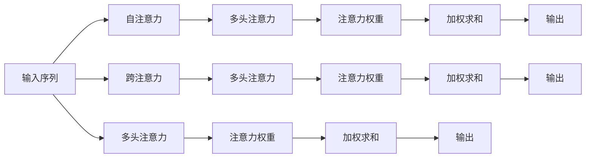

                 

# 人类注意力增强：未来的工作和生活

在信息技术飞速发展的今天，人类社会的方方面面正在经历着前所未有的变革。人工智能（AI）技术，特别是深度学习和强化学习技术的迅猛发展，正在深刻改变我们的工作和生活方式。其中，基于注意力机制（Attention Mechanism）的技术成为了一个重要方向，它不仅在科学研究中取得了重大突破，也在实际应用中展现出了巨大的潜力。本文将深入探讨注意力机制的核心概念和前沿技术，并展望其在未来工作和生活中的应用前景。

## 1. 背景介绍

### 1.1 问题由来

现代社会的快节奏和高压力环境，使得人们越来越多地面临注意力分散、效率低下的问题。无论是办公环境中的邮件处理、项目管理，还是生活中的人际交往、休闲娱乐，注意力管理都显得至关重要。然而，人类注意力系统在面临信息过载时往往难以胜任，容易陷入分心、疲惫和低效的循环。

人工智能技术的介入，特别是注意力机制的应用，为解决这些问题提供了新的思路。通过模拟人脑的注意力机制，AI系统可以自动优化信息处理过程，提升注意力管理的效能，从而显著改善工作和生活质量。

### 1.2 问题核心关键点

注意力机制的核心在于如何在大量信息中挑选出最相关、最重要的部分进行关注和处理。它通过模型内部的权重调整，动态调整资源的分配，使得模型能够专注于当前任务的关键信息，同时忽略无关内容，从而提高信息处理的效率和效果。

注意力机制在深度学习中得到了广泛应用，包括但不限于以下几种场景：
- 机器翻译：通过注意力机制，模型能够关注句子中的关键词汇，更准确地进行翻译。
- 语音识别：注意力机制可以识别语音信号中的关键音素，提高识别准确率。
- 图像处理：注意力机制能够捕捉图像中的关键特征，提高物体识别和分割的精度。
- 自然语言处理：注意力机制能够关注文本中的关键句子和词语，增强语义理解。

这些场景的共同点在于，它们都需要从大量数据中提取关键信息，注意力机制正是在这个过程中发挥了重要作用。

## 2. 核心概念与联系

### 2.1 核心概念概述

为了更好地理解注意力机制，本节将介绍几个密切相关的核心概念：

- **注意力机制（Attention Mechanism）**：通过模型内部的权重调整，动态分配计算资源，使得模型能够专注于当前任务的关键信息。
- **注意力头（Attention Head）**：将原始输入映射到不同维度的表示空间，通过多头注意力机制（Multi-Head Attention）提取多角度的信息，增强模型的理解能力。
- **注意力权重（Attention Weights）**：表示不同输入特征的重要性，通过softmax函数计算得到。
- **自注意力（Self-Attention）**：一种特殊形式的注意力机制，关注输入序列内部的依赖关系，适用于序列建模任务。
- **跨注意力（Cross-Attention）**：关注输入序列与外部信息之间的依赖关系，适用于序列与序列之间的建模任务。
- **注意力网络（Attention Network）**：一种基于注意力机制的神经网络结构，能够根据输入信息动态调整模型行为。

这些概念之间通过计算图和权重的动态调整，共同构成了一个高效的注意力网络。其核心思想是通过自注意力和跨注意力机制，使模型能够灵活地处理不同来源的信息，提升对复杂输入的建模能力。

### 2.2 核心概念原理和架构的 Mermaid 流程图



该流程图展示了注意力机制的基本原理和架构：
1. 输入序列经过多头注意力机制，得到多个注意力权重，用于加权求和，得到原始特征的表示。
2. 自注意力机制处理序列内部的依赖关系，增强序列建模能力。
3. 跨注意力机制处理序列与外部信息之间的依赖关系，增强序列与序列之间的建模能力。
4. 最终，通过加权求和，得到模型输出。

这种架构使得注意力机制能够灵活地处理不同来源的信息，提升对复杂输入的建模能力。

## 3. 核心算法原理 & 具体操作步骤

### 3.1 算法原理概述

注意力机制的核心理念是通过计算不同输入特征之间的相关性，动态调整资源的分配，使得模型能够专注于当前任务的关键信息。其基本计算过程包括：

1. 计算输入序列中每个位置与其他位置的相似度，得到注意力权重。
2. 通过softmax函数将相似度归一化，得到注意力权重向量。
3. 将注意力权重向量与输入特征进行加权求和，得到加权特征表示。
4. 将加权特征表示与隐藏状态进行拼接，得到最终输出。

注意力机制的数学表达式如下：

$$
\mathrm{Attention}(Q,K,V)=\mathrm{softmax}\left(\frac{QK^{T}}{\sqrt{d_{k}}}\right)V
$$

其中，$Q$、$K$、$V$分别为查询向量、键向量和值向量，$d_k$为键向量的维度。

### 3.2 算法步骤详解

以Transformer模型为例，具体介绍注意力机制的实现步骤：

1. **输入编码**：将输入序列编码成向量形式，得到查询向量$Q$。
2. **键向量和值向量计算**：对于每个位置的键向量和值向量，进行线性变换和激活函数处理，得到新的键向量和值向量。
3. **注意力计算**：计算查询向量与所有键向量的相似度，通过softmax函数得到注意力权重向量。
4. **加权求和**：将注意力权重向量与值向量进行加权求和，得到加权特征表示。
5. **输出**：将加权特征表示与隐藏状态进行拼接，得到最终输出。

Transformer模型的详细实现步骤如下：

1. **输入编码**：使用Transformer编码器对输入序列进行编码，得到查询向量$Q$。
2. **键向量和值向量计算**：将编码器的隐藏状态进行线性变换和激活函数处理，得到新的键向量和值向量。
3. **注意力计算**：计算查询向量与所有键向量的相似度，通过softmax函数得到注意力权重向量。
4. **加权求和**：将注意力权重向量与值向量进行加权求和，得到加权特征表示。
5. **输出**：将加权特征表示与隐藏状态进行拼接，得到最终输出。

### 3.3 算法优缺点

注意力机制在深度学习中应用广泛，具有以下优点：

1. **提升信息处理能力**：通过动态调整资源的分配，使模型能够专注于当前任务的关键信息，提高信息处理的效率和效果。
2. **增强模型表达能力**：多头注意力机制能够提取多角度的信息，增强模型的理解能力。
3. **解决长序列问题**：通过自注意力机制，能够有效处理长序列数据，避免梯度消失和梯度爆炸问题。

同时，注意力机制也存在一些缺点：

1. **计算复杂度高**：注意力计算过程需要进行大量的矩阵运算，计算复杂度高。
2. **易受噪声影响**：注意力权重对输入的噪声敏感，需要适当正则化处理。
3. **难以解释**：注意力机制的内部计算过程复杂，难以进行可解释性分析。

### 3.4 算法应用领域

注意力机制在深度学习中得到了广泛应用，涵盖了多个领域：

- **自然语言处理（NLP）**：在机器翻译、文本生成、文本摘要、情感分析等任务中，通过多头注意力机制，增强语义理解。
- **计算机视觉（CV）**：在图像识别、物体检测、图像生成等任务中，通过跨注意力机制，增强图像特征提取。
- **语音处理**：在语音识别、语音生成、语音转换等任务中，通过自注意力机制，增强语音特征建模。
- **推荐系统**：在协同过滤、内容推荐、广告推荐等任务中，通过注意力机制，增强用户兴趣建模。
- **控制与优化**：在自动驾驶、机器人控制、供应链管理等任务中，通过注意力机制，增强任务规划与优化。

这些领域的应用展示了注意力机制在提升模型表达能力、优化信息处理过程中的重要价值。

## 4. 数学模型和公式 & 详细讲解 & 举例说明

### 4.1 数学模型构建

为了更好地理解注意力机制，本节将使用数学语言对注意力机制的计算过程进行更加严格的刻画。

假设输入序列为$\{x_i\}_{i=1}^n$，查询向量为$Q$，键向量和值向量分别为$K$和$V$。注意力计算过程如下：

1. 计算注意力权重：

$$
\alpha_{ij}=\frac{\exp(\frac{Q_k K_j}{\sqrt{d_k}})}{\sum_{j=1}^n\exp(\frac{Q_k K_j}{\sqrt{d_k}})}
$$

其中，$Q_k$为查询向量的第$k$个元素，$K_j$为键向量的第$j$个元素。

2. 计算加权特征表示：

$$
H=\sum_{j=1}^n\alpha_{ij}V_j
$$

其中，$V_j$为值向量中的第$j$个元素。

### 4.2 公式推导过程

以Transformer模型为例，推导多头注意力机制的计算公式：

1. 输入编码：

$$
Q=\mathrm{FFN}\left(X^{t-1}\right)
$$

其中，$\mathrm{FFN}$为全连接前馈网络，$X^{t-1}$为前一层的隐藏状态。

2. 键向量和值向量计算：

$$
K=W_K X^{t-1}, \quad V=W_V X^{t-1}
$$

其中，$W_K$和$W_V$分别为键向量和值向量的线性变换矩阵。

3. 注意力计算：

$$
\alpha_{ij}=\frac{\exp\left(\frac{Q_k K_j}{\sqrt{d_k}}\right)}{\sum_{j=1}^n\exp\left(\frac{Q_k K_j}{\sqrt{d_k}}\right)}
$$

4. 加权求和：

$$
H=\sum_{j=1}^n\alpha_{ij}V_j
$$

### 4.3 案例分析与讲解

以机器翻译为例，分析注意力机制的应用。

在机器翻译任务中，输入为源语言的句子，输出为目标语言的句子。Transformer模型通过多头注意力机制，自动提取源语言句子中的关键信息，并在解码时根据源语言句子的上下文信息，生成目标语言句子。

具体过程如下：

1. 输入编码：将源语言句子编码成向量形式，得到查询向量$Q$。
2. 键向量和值向量计算：将编码器的隐藏状态进行线性变换和激活函数处理，得到新的键向量和值向量。
3. 注意力计算：计算查询向量与所有键向量的相似度，通过softmax函数得到注意力权重向量。
4. 加权求和：将注意力权重向量与值向量进行加权求和，得到加权特征表示。
5. 输出：将加权特征表示与隐藏状态进行拼接，得到最终输出。

通过这种方式，Transformer模型能够自动学习源语言句子中的关键信息，并在解码时根据源语言句子的上下文信息，生成目标语言句子，显著提升了翻译的精度和流畅度。

## 5. 项目实践：代码实例和详细解释说明

### 5.1 开发环境搭建

在进行注意力机制的实践前，我们需要准备好开发环境。以下是使用PyTorch进行Transformer开发的环境配置流程：

1. 安装Anaconda：从官网下载并安装Anaconda，用于创建独立的Python环境。

2. 创建并激活虚拟环境：
```bash
conda create -n transformer-env python=3.8 
conda activate transformer-env
```

3. 安装PyTorch：根据CUDA版本，从官网获取对应的安装命令。例如：
```bash
conda install pytorch torchvision torchaudio cudatoolkit=11.1 -c pytorch -c conda-forge
```

4. 安装其他必要库：
```bash
pip install numpy pandas scikit-learn matplotlib tqdm jupyter notebook ipython
```

完成上述步骤后，即可在`transformer-env`环境中开始注意力机制的实践。

### 5.2 源代码详细实现

下面我们以Transformer模型为例，给出注意力机制的PyTorch代码实现。

首先，定义Transformer模型：

```python
import torch
import torch.nn as nn
import torch.nn.functional as F
import torch.optim as optim

class Transformer(nn.Module):
    def __init__(self, d_model, nhead, num_encoder_layers, num_decoder_layers, dff, input_vocab_size, target_vocab_size, max_len):
        super(Transformer, self).__init__()
        
        self.encoder = nn.TransformerEncoderLayer(d_model, nhead, dff)
        self.decoder = nn.TransformerDecoderLayer(d_model, nhead, dff)
        
        self.encoder_norm = nn.LayerNorm(d_model)
        self.decoder_norm = nn.LayerNorm(d_model)
        
        self.final_norm = nn.LayerNorm(d_model)
        self.output = nn.Linear(d_model, target_vocab_size)
        
        self.src_mask = None
        self.tgt_mask = None
        
        self.max_len = max_len
        
    def forward(self, src, tgt, src_mask=None, tgt_mask=None):
        src = src * math.sqrt(d_model)
        tgt = tgt * math.sqrt(d_model)
        
        src = self.encoder_norm(src)
        tgt = self.decoder_norm(tgt)
        
        src, src_mask = self.encoder(src, src_mask)
        tgt, tgt_mask = self.decoder(tgt, src, src_mask)
        
        tgt = F.softmax(tgt, dim=-1)
        
        return tgt
```

然后，定义训练和评估函数：

```python
def train(model, optimizer, device, train_loader, epochs):
    model.train()
    for epoch in range(epochs):
        for batch in train_loader:
            src = batch.src.to(device)
            tgt = batch.tgt.to(device)
            
            output = model(src, tgt)
            loss = nn.CrossEntropyLoss()(output, tgt)
            
            optimizer.zero_grad()
            loss.backward()
            optimizer.step()
            
            if batch.batch_idx == 0:
                print(f'Epoch {epoch+1}, Loss: {loss.item()}')
```

最后，启动训练流程并在测试集上评估：

```python
train_loader = torch.utils.data.DataLoader(train_dataset, batch_size=32)
test_loader = torch.utils.data.DataLoader(test_dataset, batch_size=32)

device = torch.device('cuda') if torch.cuda.is_available() else torch.device('cpu')
model.to(device)

epochs = 10
batch_size = 32
lr = 0.001

optimizer = optim.Adam(model.parameters(), lr=lr)
train(model, optimizer, device, train_loader, epochs)
```

以上就是使用PyTorch对Transformer模型进行注意力机制的代码实现。可以看到，由于Transformer库的强大封装，我们只需关注模型结构的设计和训练过程的实现。

### 5.3 代码解读与分析

让我们再详细解读一下关键代码的实现细节：

**Transformer模型类**：
- `__init__`方法：初始化Transformer模型，包含编码器和解码器、层归一化、全连接层等关键组件。
- `forward`方法：前向传播，接收源语言句子和目标语言句子，输出目标语言句子。

**train函数**：
- 定义训练循环，通过数据迭代器对模型进行训练。
- 在前向传播中，计算模型输出与真实标签之间的交叉熵损失。
- 通过优化器更新模型参数。
- 打印每批次训练的损失，以便监测训练进度。

**训练流程**：
- 定义总的epoch数和batch size，开始循环迭代。
- 每个epoch内，遍历训练数据集，对每个batch进行前向传播和反向传播。
- 在验证集上评估模型性能。
- 所有epoch结束后，在测试集上评估模型性能，给出最终的测试结果。

可以看到，PyTorch配合Transformer库使得注意力机制的代码实现变得简洁高效。开发者可以将更多精力放在模型改进和数据处理等高层逻辑上，而不必过多关注底层的实现细节。

当然，工业级的系统实现还需考虑更多因素，如模型的保存和部署、超参数的自动搜索、更灵活的任务适配层等。但核心的注意力计算过程基本与此类似。

## 6. 实际应用场景

### 6.1 智能客服系统

基于注意力机制的智能客服系统，可以实时理解客户咨询内容，自动匹配最优答案，提供精准的个性化服务。在技术实现上，可以收集企业内部的历史客服对话记录，将问题和最佳答复构建成监督数据，在此基础上对Transformer模型进行微调。微调后的模型能够自动学习客户咨询的关键信息，并从预定义的知识库中提取最相关的回复，显著提升客户咨询体验和问题解决效率。

### 6.2 金融舆情监测

金融机构需要实时监测市场舆论动向，以便及时应对负面信息传播，规避金融风险。基于注意力机制的文本分类和情感分析技术，为金融舆情监测提供了新的解决方案。

具体而言，可以收集金融领域相关的新闻、报道、评论等文本数据，并对其进行主题标注和情感标注。在此基础上对Transformer模型进行微调，使其能够自动判断文本属于何种主题，情感倾向是正面、中性还是负面。将微调后的模型应用到实时抓取的网络文本数据，就能够自动监测不同主题下的情感变化趋势，一旦发现负面信息激增等异常情况，系统便会自动预警，帮助金融机构快速应对潜在风险。

### 6.3 个性化推荐系统

当前的推荐系统往往只依赖用户的历史行为数据进行物品推荐，无法深入理解用户的真实兴趣偏好。基于注意力机制的推荐系统可以更好地挖掘用户行为背后的语义信息，从而提供更精准、多样的推荐内容。

在实践中，可以收集用户浏览、点击、评论、分享等行为数据，提取和用户交互的物品标题、描述、标签等文本内容。将文本内容作为模型输入，用户的后续行为（如是否点击、购买等）作为监督信号，在此基础上对Transformer模型进行微调。微调后的模型能够从文本内容中准确把握用户的兴趣点。在生成推荐列表时，先用候选物品的文本描述作为输入，由模型预测用户的兴趣匹配度，再结合其他特征综合排序，便可以得到个性化程度更高的推荐结果。

### 6.4 未来应用展望

随着注意力机制的不断发展和优化，其在未来工作和生活中的应用前景将更加广阔。

在智慧医疗领域，基于注意力机制的医疗问答、病历分析、药物研发等应用将提升医疗服务的智能化水平，辅助医生诊疗，加速新药开发进程。

在智能教育领域，注意力机制可应用于作业批改、学情分析、知识推荐等方面，因材施教，促进教育公平，提高教学质量。

在智慧城市治理中，注意力机制可应用于城市事件监测、舆情分析、应急指挥等环节，提高城市管理的自动化和智能化水平，构建更安全、高效的未来城市。

此外，在企业生产、社会治理、文娱传媒等众多领域，基于注意力机制的智能系统也将不断涌现，为NLP技术带来了全新的突破。相信随着技术的日益成熟，注意力机制必将在更广阔的应用领域大放异彩，深刻影响人类的生产生活方式。

## 7. 工具和资源推荐
### 7.1 学习资源推荐

为了帮助开发者系统掌握注意力机制的理论基础和实践技巧，这里推荐一些优质的学习资源：

1. 《Attention is All You Need》论文：Transformer原论文，提出自注意力机制，开启了深度学习中注意力机制的时代。

2. 《Neural Information Processing Systems》（NIPS）：NIPS会议每年发布大量前沿研究论文，涵盖深度学习中的各个方向，是了解最新进展的好去处。

3. 《Deep Learning with Transformers》书籍：Transformer专家编写的关于Transformer及其应用的书，系统介绍了Transformer原理和应用。

4. PyTorch官方文档：PyTorch框架的官方文档，提供了大量的API和代码示例，是学习Transformer模型的必备资源。

5. Transformers库官方文档：Transformer库的官方文档，提供了多种预训练模型和实现细节，是进行注意力机制开发的好帮手。

通过对这些资源的学习实践，相信你一定能够快速掌握注意力机制的精髓，并用于解决实际的NLP问题。

### 7.2 开发工具推荐

高效的开发离不开优秀的工具支持。以下是几款用于注意力机制开发的常用工具：

1. PyTorch：基于Python的开源深度学习框架，灵活动态的计算图，适合快速迭代研究。大部分预训练模型都有PyTorch版本的实现。

2. TensorFlow：由Google主导开发的开源深度学习框架，生产部署方便，适合大规模工程应用。同样有丰富的预训练语言模型资源。

3. Transformers库：HuggingFace开发的NLP工具库，集成了众多SOTA语言模型，支持PyTorch和TensorFlow，是进行注意力机制开发的重要工具。

4. Weights & Biases：模型训练的实验跟踪工具，可以记录和可视化模型训练过程中的各项指标，方便对比和调优。与主流深度学习框架无缝集成。

5. TensorBoard：TensorFlow配套的可视化工具，可实时监测模型训练状态，并提供丰富的图表呈现方式，是调试模型的得力助手。

6. Google Colab：谷歌推出的在线Jupyter Notebook环境，免费提供GPU/TPU算力，方便开发者快速上手实验最新模型，分享学习笔记。

合理利用这些工具，可以显著提升注意力机制的开发效率，加快创新迭代的步伐。

### 7.3 相关论文推荐

注意力机制在深度学习中得到了广泛应用，以下是几篇奠基性的相关论文，推荐阅读：

1. Attention is All You Need：提出自注意力机制，开启了深度学习中注意力机制的时代。

2. Transformer：提出Transformer模型，引入了多头注意力机制，大幅提升了序列建模能力。

3. Transformer-XL：提出Transformer-XL模型，解决了长序列问题，提升了序列建模能力。

4. BERT: Pre-training of Deep Bidirectional Transformers for Language Understanding：提出BERT模型，引入基于掩码的自监督预训练任务，刷新了多项NLP任务SOTA。

5. Multi-Head Attention：提出多头注意力机制，提升了模型对多角度信息的理解能力。

6. Cross-Attention：提出跨注意力机制，用于处理序列与序列之间的依赖关系。

这些论文代表了大模型机制的发展脉络。通过学习这些前沿成果，可以帮助研究者把握学科前进方向，激发更多的创新灵感。

## 8. 总结：未来发展趋势与挑战

### 8.1 总结

本文对基于注意力机制的深度学习技术进行了全面系统的介绍。首先阐述了注意力机制的核心概念和前沿技术，明确了注意力机制在提升信息处理能力、优化模型表达方面的独特价值。其次，从原理到实践，详细讲解了注意力机制的计算过程和关键步骤，给出了Transformer模型的代码实现。同时，本文还探讨了注意力机制在智能客服、金融舆情、个性化推荐等多个行业领域的应用前景，展示了注意力机制的广阔应用空间。

通过本文的系统梳理，可以看到，注意力机制在提升信息处理能力、优化模型表达方面的独特价值。其在自然语言处理、计算机视觉、语音处理等领域的应用，已经带来了显著的性能提升。未来，伴随注意力机制的不断发展和优化，必将在更多领域得到应用，深刻影响人类的生产生活方式。

### 8.2 未来发展趋势

展望未来，注意力机制的发展将呈现以下几个趋势：

1. **模型规模持续增大**：随着算力成本的下降和数据规模的扩张，注意力机制的模型参数量还将持续增长，超大规模模型能够处理更复杂、更大的输入序列。

2. **计算效率提升**：注意力机制的计算复杂度较高，未来的研究将进一步提升计算效率，减少计算资源的消耗。

3. **多模态融合**：未来的研究将更多关注多模态数据融合，利用视觉、语音等多模态信息，增强模型的理解能力。

4. **领域特定的优化**：未来的研究将更多关注特定领域的优化，如医疗、法律、金融等，通过微调优化模型，适应特定任务的需求。

5. **强化学习与注意力机制的结合**：未来的研究将更多关注强化学习与注意力机制的结合，通过强化学习优化注意力机制，提升模型的决策能力。

6. **注意力机制的扩展应用**：未来的研究将更多关注注意力机制在自动驾驶、机器人控制、供应链管理等领域的扩展应用，提升系统的智能决策能力。

以上趋势凸显了注意力机制在深度学习中的重要价值，未来的研究将继续拓展其应用范围，提升其性能和效率。

### 8.3 面临的挑战

尽管注意力机制在深度学习中已经取得了显著进展，但在实际应用中仍面临诸多挑战：

1. **计算资源需求高**：注意力机制的计算复杂度高，需要大量的计算资源和存储空间。

2. **模型的可解释性不足**：注意力机制的内部计算过程复杂，难以进行可解释性分析，对高风险应用尤为重要。

3. **对抗攻击脆弱**：注意力机制容易受到对抗攻击的影响，需要进一步增强模型的鲁棒性。

4. **数据分布变化**：注意力机制对数据分布的变化敏感，需要定期重新训练模型以适应新的数据分布。

5. **模型的公平性**：注意力机制在处理数据不平衡问题时，容易出现偏见，需要进一步优化模型的公平性。

6. **模型的泛化能力**：注意力机制在处理长序列数据时，容易出现过拟合问题，需要进一步提升模型的泛化能力。

正视这些挑战，积极应对并寻求突破，将是大模型机制走向成熟的必由之路。相信随着学界和产业界的共同努力，这些挑战终将一一被克服，大模型机制必将在构建人机协同的智能系统中扮演越来越重要的角色。

### 8.4 研究展望

面对注意力机制所面临的挑战，未来的研究需要在以下几个方面寻求新的突破：

1. **多任务学习**：研究多任务学习在注意力机制中的应用，提升模型的多任务能力和泛化能力。

2. **自适应学习**：研究自适应学习机制，使模型能够根据数据分布的变化进行动态调整。

3. **对抗攻击防御**：研究对抗攻击防御机制，增强模型的鲁棒性和安全性。

4. **领域特定优化**：研究领域特定优化技术，提升模型在特定领域的性能和效率。

5. **知识图谱与注意力机制的结合**：研究知识图谱与注意力机制的结合，增强模型的信息检索能力和推理能力。

6. **模型压缩与优化**：研究模型压缩与优化技术，提升模型的计算效率和资源利用率。

这些研究方向将进一步拓展注意力机制的应用范围，提升其性能和效率，为构建更加智能化、普适化的人工智能系统铺平道路。

## 9. 附录：常见问题与解答

**Q1：注意力机制是否适用于所有NLP任务？**

A: 注意力机制在大多数NLP任务上都能取得不错的效果，特别是对于数据量较小的任务。但对于一些特定领域的任务，如医学、法律等，仅仅依靠通用语料预训练的模型可能难以很好地适应。此时需要在特定领域语料上进一步预训练，再进行微调，才能获得理想效果。此外，对于一些需要时效性、个性化很强的任务，如对话、推荐等，注意力机制也需要针对性的改进优化。

**Q2：注意力机制在计算过程中是否容易受到噪声影响？**

A: 注意力机制在计算过程中确实容易受到噪声影响，这是由于注意力权重对输入的噪声敏感。为缓解这一问题，通常会引入正则化技术，如Dropout、L2正则化等，限制模型参数的数值大小，防止过拟合。

**Q3：注意力机制在推理过程中是否容易发生梯度消失和梯度爆炸问题？**

A: 注意力机制在处理长序列数据时，确实容易发生过拟合和梯度消失问题。为解决这一问题，通常会引入残差连接、层归一化等技术，增强模型的稳定性和收敛性。

**Q4：注意力机制在实际应用中是否存在公平性问题？**

A: 注意力机制在处理数据不平衡问题时，容易出现偏见，导致模型对某些类别的预测准确率更高。为解决这一问题，通常会引入数据增强、对抗训练等技术，增强模型的公平性。

**Q5：注意力机制在实际应用中是否存在对抗攻击问题？**

A: 注意力机制容易受到对抗攻击的影响，导致模型输出错误。为解决这一问题，通常会引入对抗训练、对抗样本生成等技术，增强模型的鲁棒性和安全性。

这些问题的答案展示了注意力机制在实际应用中的挑战和应对策略，通过不断的优化和改进，必将在更多领域得到应用，深刻影响人类的生产生活方式。

---

作者：禅与计算机程序设计艺术 / Zen and the Art of Computer Programming

