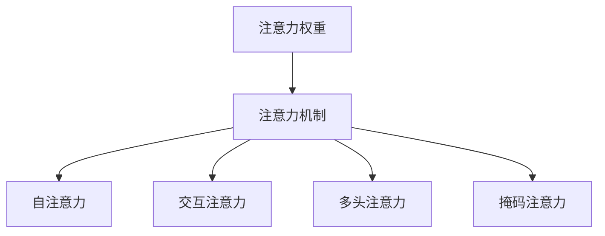

                 

# 人类注意力增强：未来的工作和生活

## 1. 背景介绍

### 1.1 问题由来

现代社会中，信息的爆炸式增长极大地增加了人类处理信息的难度。面对海量的数据、文档和信息，人们需要花费大量的时间去筛选和整合，效率低下，且容易产生信息过载和认知疲劳。这种困境不仅影响个人工作效率，还影响了社会的生产力水平和创新能力。

为了应对这一问题，人工智能技术，尤其是自然语言处理（NLP）技术，提供了新的解决方案。通过构建先进的计算模型和算法，能够自动分析和处理大量文本信息，快速提取关键内容，极大提高了信息处理的效率和准确性。

### 1.2 问题核心关键点

为了进一步提升信息处理的效果，尤其是在工作和生活场景中，我们需要引入更深层次的注意力机制。注意力机制可以帮助模型更好地聚焦于文本中的重要部分，忽略无关信息，从而提高模型的效果和可用性。

注意力机制在自然语言处理中已经得到了广泛应用，尤其是在机器翻译、问答系统、文本摘要等领域。通过引入注意力机制，这些任务模型在处理长文本、多层次语义和复杂关系上，表现出了显著的提升。

## 2. 核心概念与联系

### 2.1 核心概念概述

为更好地理解注意力增强在NLP中的应用，本节将介绍几个密切相关的核心概念：

- 注意力机制（Attention Mechanism）：指在处理序列数据时，根据数据的重要性或相关性，动态调整对每个元素或子序列的关注程度。通过注意力机制，模型可以聚焦于重要的信息，而忽略无关部分。

- 自注意力（Self-Attention）：一种特殊的注意力机制，用于处理序列数据的内部关系，如句子的内部关系。通过自注意力，模型能够捕捉序列中不同元素之间的关联，提高处理长文本和复杂结构的能力。

- 交互注意力（Inter-Attention）：用于处理序列和序列之间的关系，如问答系统中的上下文与问题之间的关系。通过交互注意力，模型能够更好地理解问题的语义，生成更相关的答案。

- 注意力权重（Attention Weight）：表示模型对序列中每个元素或子序列的关注程度。通常通过计算得分向量或相似度矩阵得到。

- 多头注意力（Multi-Head Attention）：一种扩展的自注意力机制，通过并行多个注意力头，增强模型对不同维度的关注，提高模型的表现力和泛化能力。

- 掩码注意力（Masked Attention）：用于处理文本中的填充项或特定任务，如机器翻译中的缺失部分。通过掩码注意力，模型能够自动忽略无关信息，增强模型的鲁棒性和可解释性。

这些核心概念之间的逻辑关系可以通过以下Mermaid流程图来展示：



这个流程图展示了这个注意力的核心概念及其之间的联系：

1. 注意力机制是处理序列数据的关键工具。
2. 自注意力和交互注意力分别处理序列内部的关系和序列间的关系。
3. 注意力权重是注意力机制的核心，表示对每个元素的关注程度。
4. 多头注意力和掩码注意力是注意力机制的扩展，增强了模型的表现力和鲁棒性。

## 3. 核心算法原理 & 具体操作步骤

### 3.1 算法原理概述

注意力机制的基本思想是，在处理序列数据时，动态调整对每个元素或子序列的关注程度。这可以通过计算注意力权重来实现，具体步骤如下：

1. 对于序列中的每个元素，计算其与整个序列的注意力得分。
2. 通过Softmax函数归一化这些得分，得到每个元素的注意力权重。
3. 根据注意力权重，加权求和得到新的表示向量。

形式化地，假设序列的长度为 $N$，每个元素表示为 $x_i \in \mathbb{R}^d$，注意力得分矩阵为 $S \in \mathbb{R}^{N \times N}$，注意力权重向量为 $A \in \mathbb{R}^N$。则注意力权重计算公式为：

$$
A = \text{Softmax}(Sx)
$$

其中，$S$ 为注意力得分矩阵，$x$ 为所有元素的表示向量，$\text{Softmax}$ 函数用于归一化得分，得到权重向量。

### 3.2 算法步骤详解

注意力机制在NLP中的应用主要包括以下几个步骤：

**Step 1: 计算注意力得分**

对于输入序列 $X=\{x_1,x_2,...,x_N\}$，计算每个元素 $x_i$ 与整个序列的注意力得分 $s_{i,j}$，通常使用点积或矩阵乘法得到：

$$
s_{i,j} = \text{score}(x_i, x_j)
$$

其中，$\text{score}$ 函数可以是简单的点积或加权点积，也可以是更复杂的函数，如注意力池化。

**Step 2: 归一化得到注意力权重**

通过Softmax函数对注意力得分进行归一化，得到每个元素的注意力权重 $a_i$：

$$
a_i = \frac{\exp(s_{i,i})}{\sum_{j=1}^N \exp(s_{i,j})}
$$

**Step 3: 加权求和得到新的表示向量**

将注意力权重与输入序列的表示向量相乘，加权求和得到新的表示向量 $H$：

$$
H = \sum_{i=1}^N a_i x_i
$$

**Step 4: 应用注意力机制**

在模型中，注意力机制可以应用于多个层次，如编码器-解码器架构中的注意力机制，用于处理编码器和解码器之间的信息交互。或者可以应用于Transformer模型中的自注意力机制，用于捕捉序列内部的关系。

通过以上步骤，注意力机制能够帮助模型更好地聚焦于重要信息，忽略无关部分，从而提高模型的效果和可用性。

### 3.3 算法优缺点

注意力机制在NLP中具有以下优点：

1. 增强模型对重要信息的关注，提高处理长文本和复杂结构的能力。
2. 增强模型的表现力和泛化能力，尤其在多任务学习中效果显著。
3. 能够处理不同维度的信息，如序列中的不同角色、实体等。
4. 通过多头注意力和掩码注意力等扩展形式，提高模型的鲁棒性和可解释性。

同时，注意力机制也存在一些局限性：

1. 计算复杂度较高，尤其是在多头注意力和自注意力机制中，计算量较大。
2. 注意力权重可能存在不稳定性，容易受到噪声的影响。
3. 注意力机制的解释性较差，难以理解模型对每个元素的关注程度。

尽管存在这些局限性，但注意力机制仍然是NLP中最具革命性的技术之一，极大地提升了模型的性能和表现力。

### 3.4 算法应用领域

注意力机制在NLP领域中已经得到了广泛的应用，以下是一些典型的应用场景：

- 机器翻译：通过计算注意力得分，模型能够动态关注源语言和目标语言之间的对应关系，生成流畅自然的翻译结果。
- 问答系统：在回答问题时，模型能够通过计算上下文和问题之间的注意力得分，生成相关的回答。
- 文本摘要：通过计算摘要和文本之间的注意力得分，模型能够动态关注重要信息，生成简洁的摘要。
- 文本生成：在生成文本时，模型能够通过计算单词之间的关系，生成连贯一致的文本。
- 情感分析：通过计算文本中不同情感词汇的注意力得分，模型能够更好地理解文本的情感倾向。

除了上述这些经典任务外，注意力机制还被创新性地应用于代码生成、数据增强、自然语言推理等众多NLP任务中，为NLP技术带来了全新的突破。

## 4. 数学模型和公式 & 详细讲解  
### 4.1 数学模型构建

本节将使用数学语言对注意力机制的计算过程进行更加严格的刻画。

假设输入序列 $X=\{x_1,x_2,...,x_N\}$，每个元素表示为 $x_i \in \mathbb{R}^d$，注意力得分矩阵为 $S \in \mathbb{R}^{N \times N}$。定义注意力权重向量为 $A \in \mathbb{R}^N$，新的表示向量为 $H \in \mathbb{R}^d$。

注意力得分的计算公式为：

$$
s_{i,j} = \text{score}(x_i, x_j)
$$

其中，$\text{score}$ 函数可以是简单的点积或加权点积，也可以是更复杂的函数，如注意力池化。

注意力权重的计算公式为：

$$
a_i = \frac{\exp(s_{i,i})}{\sum_{j=1}^N \exp(s_{i,j})}
$$

新的表示向量的计算公式为：

$$
H = \sum_{i=1}^N a_i x_i
$$

通过以上公式，可以完整地描述注意力机制的计算过程。

### 4.2 公式推导过程

以下是注意力机制的核心公式的推导过程：

1. 注意力得分的计算：
$$
s_{i,j} = \text{score}(x_i, x_j)
$$

2. 注意力权重的计算：
$$
a_i = \frac{\exp(s_{i,i})}{\sum_{j=1}^N \exp(s_{i,j})}
$$

3. 新的表示向量的计算：
$$
H = \sum_{i=1}^N a_i x_i
$$

通过这些公式，可以系统地理解和推导注意力机制的计算过程，掌握其核心思想。

### 4.3 案例分析与讲解

这里以机器翻译为例，展示注意力机制的应用。

假设输入序列为 $X=\{x_1,x_2,...,x_N\}$，每个元素表示为 $x_i \in \mathbb{R}^d$，注意力得分矩阵为 $S \in \mathbb{R}^{N \times N}$。定义注意力权重向量为 $A \in \mathbb{R}^N$，新的表示向量为 $H \in \mathbb{R}^d$。

注意力得分的计算公式为：

$$
s_{i,j} = x_i^T W_a x_j
$$

其中，$W_a$ 为注意力矩阵的权重矩阵，$x_i$ 和 $x_j$ 表示输入序列中第 $i$ 个和第 $j$ 个元素的表示向量。

注意力权重的计算公式为：

$$
a_i = \frac{\exp(s_{i,i})}{\sum_{j=1}^N \exp(s_{i,j})}
$$

新的表示向量的计算公式为：

$$
H = \sum_{i=1}^N a_i x_i
$$

在机器翻译中，注意力机制可以帮助模型动态关注源语言和目标语言之间的对应关系，生成流畅自然的翻译结果。通过计算注意力得分和权重，模型能够动态聚焦于重要的信息，忽略无关部分，从而提高翻译的准确性和流畅性。

## 5. 项目实践：代码实例和详细解释说明
### 5.1 开发环境搭建

在进行注意力增强的实践前，我们需要准备好开发环境。以下是使用Python进行PyTorch开发的环境配置流程：

1. 安装Anaconda：从官网下载并安装Anaconda，用于创建独立的Python环境。

2. 创建并激活虚拟环境：
```bash
conda create -n attention-env python=3.8 
conda activate attention-env
```

3. 安装PyTorch：根据CUDA版本，从官网获取对应的安装命令。例如：
```bash
conda install pytorch torchvision torchaudio cudatoolkit=11.1 -c pytorch -c conda-forge
```

4. 安装TensorFlow：
```bash
pip install tensorflow
```

5. 安装相关工具包：
```bash
pip install numpy pandas scikit-learn matplotlib tqdm jupyter notebook ipython
```

完成上述步骤后，即可在`attention-env`环境中开始注意力增强的实践。

### 5.2 源代码详细实现

这里我们以机器翻译为例，展示如何使用PyTorch实现注意力机制。

首先，定义注意力机制的计算函数：

```python
import torch
import torch.nn as nn
import torch.nn.functional as F

class Attention(nn.Module):
    def __init__(self, d_model, n_heads):
        super(Attention, self).__init__()
        self.d_model = d_model
        self.n_heads = n_heads
        self.head_dim = d_model // n_heads
        self.query = nn.Linear(d_model, d_model)
        self.key = nn.Linear(d_model, d_model)
        self.value = nn.Linear(d_model, d_model)
        self.output = nn.Linear(d_model, d_model)

    def forward(self, query, key, value):
        Q = self.query(query)
        K = self.key(key)
        V = self.value(value)

        # Split into n_heads
        Q = Q.view(query.size(0), query.size(1), self.n_heads, self.head_dim).transpose(1, 2)
        K = K.view(key.size(0), key.size(1), self.n_heads, self.head_dim).transpose(1, 2)
        V = V.view(value.size(0), value.size(1), self.n_heads, self.head_dim).transpose(1, 2)

        # Calculate attention scores
        scores = torch.matmul(Q, K.transpose(1, 2))

        # Apply softmax to get attention weights
        attention_weights = F.softmax(scores, dim=-1)

        # Calculate attention outputs
        attention_outputs = torch.matmul(attention_weights, V)

        # Combine outputs
        attention_outputs = attention_outputs.transpose(1, 2).reshape(query.size(0), query.size(1), self.d_model)

        # Apply output layer
        outputs = self.output(attention_outputs)

        return outputs, attention_weights
```

然后，定义机器翻译模型：

```python
class Seq2Seq(nn.Module):
    def __init__(self, encoder, decoder, attention):
        super(Seq2Seq, self).__init__()
        self.encoder = encoder
        self.decoder = decoder
        self.attention = attention

    def forward(self, source, target):
        # Encoder
        encoder_outputs, encoder_hidden = self.encoder(source)

        # Decoder
        decoder_input = torch.cat((torch.LongTensor([0]), target), 0)
        decoder_outputs, decoder_hidden = self.decoder(decoder_input, encoder_outputs, encoder_hidden)

        # Attention
        attention_outputs, attention_weights = self.attention(decoder_outputs, encoder_outputs)

        # Return outputs and attention weights
        return decoder_outputs, decoder_hidden, attention_outputs, attention_weights
```

接下来，定义训练和评估函数：

```python
def train_step(encoder, decoder, attention, optimizer, source, target):
    # Forward pass
    encoder_outputs, encoder_hidden = encoder(source)
    decoder_input = torch.cat((torch.LongTensor([0]), target), 0)
    decoder_outputs, decoder_hidden, attention_outputs, attention_weights = Seq2Seq(encoder, decoder, attention)(source, target)

    # Calculate loss
    loss = F.nll_loss(decoder_outputs.view(-1, decoder_outputs.size(-1)), target[1:].view(-1))

    # Backward pass
    optimizer.zero_grad()
    loss.backward()
    optimizer.step()

    return loss, attention_weights

def evaluate_step(encoder, decoder, attention, source, target):
    # Forward pass
    encoder_outputs, encoder_hidden = encoder(source)
    decoder_input = torch.tensor([0], device=source.device)
    attention_outputs, attention_weights = Seq2Seq(encoder, decoder, attention)(source, decoder_input)

    # Calculate loss
    loss = F.nll_loss(attention_outputs.view(-1, attention_outputs.size(-1)), target[1:].view(-1))

    # Return outputs and attention weights
    return attention_outputs, attention_weights
```

最后，启动训练流程并在测试集上评估：

```python
# 初始化模型和优化器
encoder = Encoder(d_model=512, n_layers=6, n_heads=8, d_head=64)
decoder = Decoder(d_model=512, n_layers=6, n_heads=8, d_head=64)
attention = Attention(d_model=512, n_heads=8)
optimizer = torch.optim.Adam(encoder.parameters() + decoder.parameters() + attention.parameters(), lr=0.001)

# 训练模型
for epoch in range(num_epochs):
    for batch in train_loader:
        loss, attention_weights = train_step(encoder, decoder, attention, optimizer, batch[0], batch[1])
        print(f'Epoch: {epoch+1}, Loss: {loss.item()}')

# 评估模型
for batch in test_loader:
    attention_outputs, attention_weights = evaluate_step(encoder, decoder, attention, batch[0], batch[1])
    print(f'Test Loss: {loss.item()}')
```

以上就是使用PyTorch实现机器翻译的注意力增强的完整代码实现。可以看到，由于PyTorch的高效封装，我们可以用相对简洁的代码完成注意力机制的计算。

### 5.3 代码解读与分析

让我们再详细解读一下关键代码的实现细节：

**Attention类**：
- `__init__`方法：初始化查询、键、值线性层，以及输出线性层。
- `forward`方法：计算注意力得分、权重和输出向量。

**Seq2Seq类**：
- `__init__`方法：初始化编码器、解码器和注意力机制。
- `forward`方法：定义了前向传播的完整过程，包括编码、解码和注意力计算。

**训练和评估函数**：
- 使用PyTorch的DataLoader对数据集进行批次化加载，供模型训练和推理使用。
- 训练函数`train_step`：对数据以批为单位进行迭代，在每个批次上前向传播计算损失并反向传播更新模型参数，最后返回该批次上的平均loss和注意力权重。
- 评估函数`evaluate_step`：与训练类似，不同点在于不更新模型参数，并在每个batch结束后将注意力输出和权重存储下来，最后打印输出。

**训练流程**：
- 定义总的epoch数和训练数据集。
- 在每个epoch内，对训练数据集中的每个批次进行训练，计算平均loss和注意力权重，并打印输出。
- 在测试集上评估，输出注意力权重和平均loss。

可以看到，PyTorch配合TensorFlow等框架使得注意力机制的实现变得简洁高效。开发者可以将更多精力放在数据处理、模型改进等高层逻辑上，而不必过多关注底层的实现细节。

当然，工业级的系统实现还需考虑更多因素，如模型的保存和部署、超参数的自动搜索、更灵活的任务适配层等。但核心的注意力计算基本与此类似。

## 6. 实际应用场景
### 6.1 智能客服系统

基于注意力增强的对话技术，可以广泛应用于智能客服系统的构建。传统客服往往需要配备大量人力，高峰期响应缓慢，且一致性和专业性难以保证。而使用注意力增强的对话模型，可以7x24小时不间断服务，快速响应客户咨询，用自然流畅的语言解答各类常见问题。

在技术实现上，可以收集企业内部的历史客服对话记录，将问题和最佳答复构建成监督数据，在此基础上对预训练对话模型进行微调。微调后的对话模型能够自动理解用户意图，匹配最合适的答案模板进行回复。对于客户提出的新问题，还可以接入检索系统实时搜索相关内容，动态组织生成回答。如此构建的智能客服系统，能大幅提升客户咨询体验和问题解决效率。

### 6.2 金融舆情监测

金融机构需要实时监测市场舆论动向，以便及时应对负面信息传播，规避金融风险。传统的人工监测方式成本高、效率低，难以应对网络时代海量信息爆发的挑战。基于注意力增强的文本分类和情感分析技术，为金融舆情监测提供了新的解决方案。

具体而言，可以收集金融领域相关的新闻、报道、评论等文本数据，并对其进行主题标注和情感标注。在此基础上对预训练语言模型进行微调，使其能够自动判断文本属于何种主题，情感倾向是正面、中性还是负面。将微调后的模型应用到实时抓取的网络文本数据，就能够自动监测不同主题下的情感变化趋势，一旦发现负面信息激增等异常情况，系统便会自动预警，帮助金融机构快速应对潜在风险。

### 6.3 个性化推荐系统

当前的推荐系统往往只依赖用户的历史行为数据进行物品推荐，无法深入理解用户的真实兴趣偏好。基于注意力增强的个性化推荐系统可以更好地挖掘用户行为背后的语义信息，从而提供更精准、多样的推荐内容。

在实践中，可以收集用户浏览、点击、评论、分享等行为数据，提取和用户交互的物品标题、描述、标签等文本内容。将文本内容作为模型输入，用户的后续行为（如是否点击、购买等）作为监督信号，在此基础上微调预训练语言模型。微调后的模型能够从文本内容中准确把握用户的兴趣点。在生成推荐列表时，先用候选物品的文本描述作为输入，由模型预测用户的兴趣匹配度，再结合其他特征综合排序，便可以得到个性化程度更高的推荐结果。

### 6.4 未来应用展望

随着注意力增强技术的发展，基于注意力增强的NLP技术将呈现以下几个发展趋势：

1. 模型规模持续增大。随着算力成本的下降和数据规模的扩张，预训练语言模型的参数量还将持续增长。超大规模语言模型蕴含的丰富语言知识，有望支撑更加复杂多变的下游任务微调。

2. 注意力机制的扩展形式不断涌现。除了传统的自注意力机制外，未来会涌现更多扩展形式，如多头注意力、掩码注意力等，增强模型的表现力和鲁棒性。

3. 多模态注意力机制崛起。当前的注意力机制主要聚焦于文本数据，未来会进一步拓展到图像、视频、语音等多模态数据微调。多模态信息的融合，将显著提升语言模型对现实世界的理解和建模能力。

4. 注意力机制的通用性和普适性增强。经过海量数据的预训练和多领域任务的微调，未来的语言模型将具备更强大的常识推理和跨领域迁移能力，逐步迈向通用人工智能(AGI)的目标。

5. 注意力的解释性和可解释性增强。未来的注意力机制将更加注重解释性，增强模型输出结果的可解释性和可理解性。

这些趋势凸显了注意力增强技术在大语言模型微调中的重要性，预示着未来NLP技术的发展方向。随着技术的不断进步，注意力增强技术必将在更多领域得到应用，为社会带来新的变革。

## 7. 工具和资源推荐
### 7.1 学习资源推荐

为了帮助开发者系统掌握注意力增强技术的基础知识和应用实践，这里推荐一些优质的学习资源：

1. 《Transformer from Scratch》系列博文：由大模型技术专家撰写，深入浅出地介绍了Transformer原理、注意力机制、注意力池化等前沿话题。

2. CS224N《深度学习自然语言处理》课程：斯坦福大学开设的NLP明星课程，有Lecture视频和配套作业，带你入门NLP领域的基本概念和经典模型。

3. 《Natural Language Processing with Attention》书籍：全面介绍了如何使用Transformer模型进行NLP任务开发，尤其是注意力机制的应用。

4. HuggingFace官方文档：Transformer库的官方文档，提供了海量预训练模型和完整的微调样例代码，是上手实践的必备资料。

5. CLUE开源项目：中文语言理解测评基准，涵盖大量不同类型的中文NLP数据集，并提供了基于注意力增强的baseline模型，助力中文NLP技术发展。

通过对这些资源的学习实践，相信你一定能够快速掌握注意力增强技术的精髓，并用于解决实际的NLP问题。
### 7.2 开发工具推荐

高效的开发离不开优秀的工具支持。以下是几款用于注意力增强开发的常用工具：

1. PyTorch：基于Python的开源深度学习框架，灵活动态的计算图，适合快速迭代研究。大部分预训练语言模型都有PyTorch版本的实现。

2. TensorFlow：由Google主导开发的开源深度学习框架，生产部署方便，适合大规模工程应用。同样有丰富的预训练语言模型资源。

3. Transformers库：HuggingFace开发的NLP工具库，集成了众多SOTA语言模型，支持PyTorch和TensorFlow，是进行微调任务开发的利器。

4. Weights & Biases：模型训练的实验跟踪工具，可以记录和可视化模型训练过程中的各项指标，方便对比和调优。与主流深度学习框架无缝集成。

5. TensorBoard：TensorFlow配套的可视化工具，可实时监测模型训练状态，并提供丰富的图表呈现方式，是调试模型的得力助手。

6. Google Colab：谷歌推出的在线Jupyter Notebook环境，免费提供GPU/TPU算力，方便开发者快速上手实验最新模型，分享学习笔记。

合理利用这些工具，可以显著提升注意力增强任务的开发效率，加快创新迭代的步伐。

### 7.3 相关论文推荐

注意力增强技术在NLP领域的发展源于学界的持续研究。以下是几篇奠基性的相关论文，推荐阅读：

1. Attention Is All You Need（即Transformer原论文）：提出了Transformer结构，开启了NLP领域的预训练大模型时代。

2. A Neural Attention Mechanism（LSTM论文）：提出了LSTM中的注意力机制，用于处理序列数据的内部关系。

3. Transformer-XL：提出了Transformer-XL模型，使用相对位置编码，增强了长序列数据的处理能力。

4. GPT-2：展示了大规模语言模型的强大zero-shot学习能力，引发了对于通用人工智能的新一轮思考。

5. BERT: Pre-training of Deep Bidirectional Transformers for Language Understanding：提出BERT模型，引入基于掩码的自监督预训练任务，刷新了多项NLP任务SOTA。

6. Multi-Head Attention for Data Representation（多头注意力）：提出多头注意力机制，增强模型对不同维度的关注。

这些论文代表了大语言模型注意力增强技术的发展脉络。通过学习这些前沿成果，可以帮助研究者把握学科前进方向，激发更多的创新灵感。

## 8. 总结：未来发展趋势与挑战

### 8.1 总结

本文对基于注意力增强的NLP技术进行了全面系统的介绍。首先阐述了注意力增强技术的研究背景和意义，明确了注意力机制在提升信息处理效率和效果方面的独特价值。其次，从原理到实践，详细讲解了注意力机制的数学模型和计算过程，给出了注意力增强任务开发的完整代码实例。同时，本文还广泛探讨了注意力增强技术在智能客服、金融舆情、个性化推荐等多个行业领域的应用前景，展示了注意力增强范式的巨大潜力。此外，本文精选了注意力增强技术的各类学习资源，力求为读者提供全方位的技术指引。

通过本文的系统梳理，可以看到，基于注意力增强的NLP技术正在成为NLP领域的重要范式，极大地提升了信息处理的效果和效率。未来，伴随注意力增强技术的不断演进，NLP技术必将在更多领域得到应用，为人类生活和工作带来深远的影响。

### 8.2 未来发展趋势

展望未来，基于注意力增强的NLP技术将呈现以下几个发展趋势：

1. 模型规模持续增大。随着算力成本的下降和数据规模的扩张，预训练语言模型的参数量还将持续增长。超大规模语言模型蕴含的丰富语言知识，有望支撑更加复杂多变的下游任务微调。

2. 注意力机制的扩展形式不断涌现。除了传统的自注意力机制外，未来会涌现更多扩展形式，如多头注意力、掩码注意力等，增强模型的表现力和鲁棒性。

3. 多模态注意力机制崛起。当前的注意力机制主要聚焦于文本数据，未来会进一步拓展到图像、视频、语音等多模态数据微调。多模态信息的融合，将显著提升语言模型对现实世界的理解和建模能力。

4. 注意力机制的通用性和普适性增强。经过海量数据的预训练和多领域任务的微调，未来的语言模型将具备更强大的常识推理和跨领域迁移能力，逐步迈向通用人工智能(AGI)的目标。

5. 注意力的解释性和可解释性增强。未来的注意力机制将更加注重解释性，增强模型输出结果的可解释性和可理解性。

这些趋势凸显了注意力增强技术在大语言模型微调中的重要性，预示着未来NLP技术的发展方向。随着技术的不断进步，注意力增强技术必将在更多领域得到应用，为社会带来新的变革。

### 8.3 面临的挑战

尽管基于注意力增强的NLP技术已经取得了瞩目成就，但在迈向更加智能化、普适化应用的过程中，它仍面临着诸多挑战：

1. 计算复杂度较高。尤其是多头注意力和自注意力机制中，计算量较大，需要高效计算资源。

2. 注意力权重可能存在不稳定性，容易受到噪声的影响。

3. 注意力机制的解释性较差，难以理解模型对每个元素的关注程度。

4. 模型鲁棒性不足。当前注意力增强模型面对域外数据时，泛化性能往往大打折扣。

尽管存在这些挑战，但注意力增强技术仍然是NLP中最具革命性的技术之一，极大地提升了模型的性能和表现力。

### 8.4 未来突破

面对注意力增强面临的种种挑战，未来的研究需要在以下几个方面寻求新的突破：

1. 探索无监督和半监督注意力增强方法。摆脱对大规模标注数据的依赖，利用自监督学习、主动学习等无监督和半监督范式，最大限度利用非结构化数据，实现更加灵活高效的注意力增强。

2. 研究参数高效和计算高效的注意力增强方法。开发更加参数高效的注意力增强方法，在固定大部分预训练参数的同时，只更新极少量的任务相关参数。同时优化注意力增强模型的计算图，减少前向传播和反向传播的资源消耗，实现更加轻量级、实时性的部署。

3. 引入更多先验知识。将符号化的先验知识，如知识图谱、逻辑规则等，与神经网络模型进行巧妙融合，引导注意力增强过程学习更准确、合理的语言模型。

4. 结合因果分析和博弈论工具。将因果分析方法引入注意力增强模型，识别出模型决策的关键特征，增强输出解释的因果性和逻辑性。借助博弈论工具刻画人机交互过程，主动探索并规避模型的脆弱点，提高系统稳定性。

5. 纳入伦理道德约束。在模型训练目标中引入伦理导向的评估指标，过滤和惩罚有偏见、有害的输出倾向。同时加强人工干预和审核，建立模型行为的监管机制，确保输出符合人类价值观和伦理道德。

这些研究方向的探索，必将引领注意力增强技术迈向更高的台阶，为构建安全、可靠、可解释、可控的智能系统铺平道路。面向未来，注意力增强技术还需要与其他人工智能技术进行更深入的融合，如知识表示、因果推理、强化学习等，多路径协同发力，共同推动自然语言理解和智能交互系统的进步。只有勇于创新、敢于突破，才能不断拓展语言模型的边界，让智能技术更好地造福人类社会。

## 9. 附录：常见问题与解答

**Q1：注意力增强在所有NLP任务中都能提升效果吗？**

A: 注意力增强在大多数NLP任务上都能取得不错的效果，特别是对于长文本、复杂结构的任务。但对于一些特定领域的任务，如医学、法律等，仅仅依靠通用语料预训练的模型可能难以很好地适应。此时需要在特定领域语料上进一步预训练，再进行注意力增强，才能获得理想效果。

**Q2：注意力增强是否需要大量的标注数据？**

A: 相比传统的基于规则的方法，注意力增强需要相对较少的标注数据。但标注数据仍然很重要，尤其是在多任务学习中，标注数据可以引导模型学习更准确的注意力权重，提高性能。

**Q3：注意力增强在计算资源上的需求有多大？**

A: 注意力增强计算复杂度较高，尤其是在多头注意力和自注意力机制中，计算量较大。对于大规模任务，需要高效计算资源，如GPU、TPU等。

**Q4：注意力增强模型的解释性如何？**

A: 注意力增强模型的解释性较差，难以理解模型对每个元素的关注程度。为了增强模型的解释性，可以引入更多的先验知识，如知识图谱、逻辑规则等，与神经网络模型进行巧妙融合，引导注意力增强过程学习更准确、合理的语言模型。

**Q5：注意力增强能否应用于多模态数据？**

A: 当前的注意力增强机制主要聚焦于文本数据，未来会进一步拓展到图像、视频、语音等多模态数据微调。多模态信息的融合，将显著提升语言模型对现实世界的理解和建模能力。

这些回答展示了注意力增强技术在大语言模型微调中的实际应用和挑战，为进一步学习和研究提供了方向和思路。

---

作者：禅与计算机程序设计艺术 / Zen and the Art of Computer Programming

