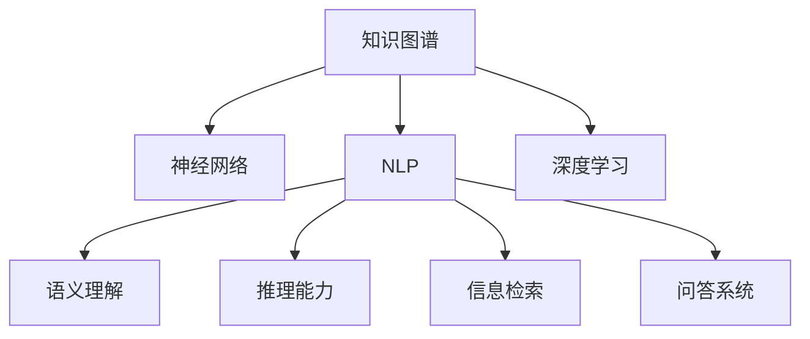

                 

# 人类知识的应用：洞察力指引实践方向

> 关键词：知识图谱, 神经网络, 自然语言处理, 人工智能, 语义理解, 机器学习, 推理引擎

## 1. 背景介绍

### 1.1 问题由来
在过去的几十年里，人工智能（AI）技术取得了长足的进步。其中，神经网络（Neural Networks, NNs）和深度学习（Deep Learning, DL）成为了研究的热点。然而，神经网络模型往往只能处理数值数据，无法直接理解复杂的自然语言信息。自然语言处理（Natural Language Processing, NLP）领域的发展，使得神经网络能够逐步处理文本数据，但理解语义、推理逻辑等高级认知能力仍然是其面临的巨大挑战。

知识图谱（Knowledge Graph, KG）作为一种结构化的语义表示形式，以其丰富的语义信息和良好的推理能力，成为NLP与深度学习结合的重要桥梁。通过将知识图谱引入到NLP任务中，可以显著提升模型的语义理解和推理能力。本文将详细探讨知识图谱在NLP中的应用，以及如何通过洞察力指引实践方向，提升模型性能。

### 1.2 问题核心关键点
知识图谱在NLP中的应用主要包括以下几个方面：

- 语义理解：通过关联文本中的实体和关系，帮助模型理解文本中的语义信息。
- 推理能力：利用知识图谱中的逻辑关系，辅助模型进行合理推理，提高模型的可信度。
- 信息检索：将知识图谱与文本检索结合起来，帮助用户快速获取相关信息。
- 问答系统：将知识图谱中的信息与自然语言交互，构建智能问答系统，提升用户交互体验。

本文将围绕这些核心点，详细探讨知识图谱在NLP中的实践方法，以及如何通过洞察力进行深度理解和优化。

## 2. 核心概念与联系

### 2.1 核心概念概述

为更好地理解知识图谱在NLP中的应用，本节将介绍几个密切相关的核心概念：

- 知识图谱（Knowledge Graph, KG）：结构化的语义数据表示，通常由实体（Entity）和关系（Relation）组成。知识图谱可以帮助模型理解和推理文本中的语义信息。
- 自然语言处理（Natural Language Processing, NLP）：利用计算机处理自然语言的学科，主要目标是让机器理解、处理和生成自然语言。
- 神经网络（Neural Network, NN）：一种通过学习数据中的模式来执行特定任务的机器学习算法。神经网络在NLP中主要用于文本分类、情感分析、机器翻译等任务。
- 深度学习（Deep Learning, DL）：一种基于多层神经网络的机器学习方法，通过多层非线性变换，从数据中自动提取高级特征。
- 语义理解（Semantic Understanding）：理解文本中的语义信息，如实体、关系、情感等。
- 推理能力（Reasoning Ability）：利用知识图谱中的逻辑关系，对文本进行推理判断，如因果关系、假设验证等。
- 信息检索（Information Retrieval, IR）：从大量文本数据中检索出相关信息。
- 问答系统（Question Answering, QA）：通过自然语言与机器交互，获取结构化答案。

这些核心概念之间的逻辑关系可以通过以下Mermaid流程图来展示：



这个流程图展示出知识图谱在NLP中的应用路径：

1. 知识图谱与神经网络结合，提升语义理解能力。
2. 知识图谱辅助深度学习，增强推理和信息检索能力。
3. 知识图谱融合NLP，构建问答系统，提升用户交互体验。

这些概念共同构成了NLP与知识图谱结合的框架，使其能够更好地理解和处理自然语言。

## 3. 核心算法原理 & 具体操作步骤
### 3.1 算法原理概述

基于知识图谱的NLP应用，其核心算法原理可以概括为以下几个步骤：

1. **实体抽取（Entity Extraction）**：从文本中识别出实体，并将其映射到知识图谱中的实体节点。
2. **关系抽取（Relation Extraction）**：从文本中抽取实体之间的关系，并将其映射到知识图谱中的关系边。
3. **推理推理（Reasoning）**：利用知识图谱中的逻辑关系，辅助NLP模型进行推理判断。
4. **语义理解（Semantic Understanding）**：通过关联知识图谱中的实体和关系，提升模型的语义理解能力。
5. **信息检索（Information Retrieval）**：从知识图谱中检索相关信息，提高模型的检索效率。
6. **问答系统（QA）**：构建智能问答系统，提升用户交互体验。

### 3.2 算法步骤详解

**Step 1: 准备知识图谱和文本数据**
- 收集相关的知识图谱，例如WordNet、Freebase、DBpedia等。
- 收集需要处理的文本数据，例如新闻、评论、论文等。

**Step 2: 构建知识图谱嵌入（KG Embeddings）**
- 将知识图谱中的实体和关系转化为向量表示，通常使用TransE、DistMult等算法。
- 使用Word2Vec、GloVe等技术将文本中的单词映射为向量表示，以便于后续处理。

**Step 3: 实体抽取和关系抽取**
- 使用命名实体识别（Named Entity Recognition, NER）技术，从文本中识别出实体。
- 使用关系抽取技术，识别实体之间的关系，并将其映射到知识图谱中的节点和边。

**Step 4: 推理推理**
- 利用知识图谱中的逻辑关系，对文本进行推理判断。常用的方法包括基于规则的推理、基于逻辑的推理等。
- 结合NLP模型的输出，进行联合推理，提升模型的准确性。

**Step 5: 语义理解**
- 通过关联知识图谱中的实体和关系，提升模型的语义理解能力。通常使用注意力机制（Attention Mechanism）来实现。
- 使用预训练语言模型（如BERT、GPT等）作为特征提取器，将文本转换为语义表示，并通过知识图谱进行增强。

**Step 6: 信息检索**
- 将知识图谱与文本检索结合起来，构建信息检索系统。常用的方法包括基于向量检索的近似最近邻算法（Approximate Nearest Neighbor, ANN）等。
- 利用TF-IDF、Word2Vec等技术，将文本转化为向量表示，与知识图谱中的节点进行匹配，获取相关信息。

**Step 7: 问答系统**
- 构建智能问答系统，结合知识图谱和自然语言处理技术，提升用户交互体验。常用的方法包括基于规则的QA系统、基于深度学习的QA系统等。
- 使用预训练语言模型作为特征提取器，将用户的问题转化为向量表示，与知识图谱中的节点进行匹配，获取答案。

### 3.3 算法优缺点

基于知识图谱的NLP应用具有以下优点：

1. **提升语义理解能力**：通过关联知识图谱中的实体和关系，提升模型的语义理解能力，能够更好地处理复杂的文本信息。
2. **增强推理能力**：利用知识图谱中的逻辑关系，辅助NLP模型进行推理判断，提升模型的可信度。
3. **提高信息检索效率**：将知识图谱与文本检索结合起来，提高模型的检索效率，能够快速获取相关信息。
4. **提升问答系统性能**：构建智能问答系统，结合知识图谱和自然语言处理技术，提升用户交互体验。

同时，这些方法也存在一些局限性：

1. **知识图谱构建复杂**：知识图谱的构建需要大量的人工标注，耗费时间和资源。
2. **推理精度有限**：知识图谱中的逻辑关系可能存在不准确的情况，影响推理结果的精度。
3. **语义理解能力受限**：模型对于复杂语义的理解能力仍有所欠缺，需要进一步优化。
4. **信息检索效果不理想**：基于向量检索的近似最近邻算法可能存在高误率问题，影响检索结果的准确性。
5. **问答系统依赖数据**：问答系统依赖大量知识图谱和文本数据，数据不足时性能受限。

尽管存在这些局限性，但知识图谱在NLP中的应用已经取得了显著的进展，并在多个领域得到了广泛的应用。未来，随着知识图谱技术的不断进步，这些限制有望得到进一步改善。

### 3.4 算法应用领域

基于知识图谱的NLP应用已经在多个领域得到了广泛的应用，例如：

- 搜索引擎：通过关联知识图谱和文本数据，提高搜索的准确性和相关性。
- 信息检索系统：从知识图谱中检索相关信息，提升信息获取的效率和质量。
- 智能问答系统：结合知识图谱和自然语言处理技术，构建智能问答系统，提升用户交互体验。
- 医学知识库：构建医学知识图谱，提升医疗领域的知识检索和推理能力。
- 金融知识图谱：构建金融知识图谱，提升金融领域的知识检索和推理能力。
- 法律知识图谱：构建法律知识图谱，提升法律领域的知识检索和推理能力。

除了上述这些经典应用外，知识图谱还被创新性地应用于更多场景中，如可控文本生成、情感分析、代码生成等，为NLP技术带来了新的突破。

## 4. 数学模型和公式 & 详细讲解  
### 4.1 数学模型构建

基于知识图谱的NLP应用通常涉及多个领域的数学模型，这里以推理推理为例，详细讲解其数学模型构建过程。

知识图谱中的推理通常采用基于逻辑的推理方法，如RDFS（Resource Description Framework Schema）、OWL（Web Ontology Language）等。这些方法可以将知识图谱中的逻辑关系转化为数学公式，进而使用逻辑推理引擎进行推理计算。

以下是一个简单的基于OWL的推理示例：

假设有一个关于城市的知识图谱，包含以下实体和关系：

```
City1 - hasProperty - CityName1
City2 - hasProperty - CityName2
City1 - isIn - Country
City2 - isIn - Country
```

要推理出`City1`和`City2`是否属于同一个国家，可以构建如下逻辑表达式：

```
sameCountry := hasProperty(isIn, City1, ?Country) = hasProperty(isIn, City2, ?Country)
```

其中，`hasProperty`表示实体具有某个属性，`isIn`表示实体属于某个对象。`sameCountry`表示`City1`和`City2`是否属于同一个国家。

### 4.2 公式推导过程

为了推理上述表达式，可以使用如下的逻辑推理公式：

```
sameCountry = true
if hasProperty(isIn, City1, ?Country) = hasProperty(isIn, City2, ?Country)
```

其中，`true`表示推理结果为真，`hasProperty(isIn, City1, ?Country) = hasProperty(isIn, City2, ?Country)`表示`City1`和`City2`属于同一个国家。

在实际应用中，逻辑推理引擎会将上述表达式转化为布尔逻辑表达式，并使用真值表或布尔代数进行计算。推理结果可以是`true`或`false`，具体取决于知识图谱中的数据。

### 4.3 案例分析与讲解

假设有一个关于航班的知识图谱，包含以下实体和关系：

```
Flight1 - hasDeparture - City1
Flight2 - hasDeparture - City2
Flight1 - hasArrival - City3
Flight2 - hasArrival - City3
```

要推理出`Flight1`和`Flight2`是否属于同一个航班，可以构建如下逻辑表达式：

```
sameFlight := hasDeparture(F1, ?City) = hasDeparture(F2, ?City) and hasArrival(F1, ?City) = hasArrival(F2, ?City)
```

其中，`F1`和`F2`分别表示两个航班，`hasDeparture`和`hasArrival`分别表示航班的出发和到达城市。`sameFlight`表示`Flight1`和`Flight2`是否属于同一个航班。

使用类似的方法，可以将上述逻辑表达式转化为布尔逻辑表达式，并使用逻辑推理引擎进行计算。推理结果可以是`true`或`false`，具体取决于知识图谱中的数据。

## 5. 项目实践：代码实例和详细解释说明
### 5.1 开发环境搭建

在进行知识图谱相关的项目实践前，我们需要准备好开发环境。以下是使用Python进行PyTorch开发的环境配置流程：

1. 安装Anaconda：从官网下载并安装Anaconda，用于创建独立的Python环境。

2. 创建并激活虚拟环境：
```bash
conda create -n pytorch-env python=3.8 
conda activate pytorch-env
```

3. 安装PyTorch：根据CUDA版本，从官网获取对应的安装命令。例如：
```bash
conda install pytorch torchvision torchaudio cudatoolkit=11.1 -c pytorch -c conda-forge
```

4. 安装PyTorch Geometric库：用于处理图结构数据。
```bash
conda install torch-geometric
```

5. 安装TensorBoard：用于模型训练的可视化。
```bash
pip install tensorboard
```

完成上述步骤后，即可在`pytorch-env`环境中开始知识图谱相关的项目实践。

### 5.2 源代码详细实现

下面我们以知识图谱嵌入（KG Embeddings）为例，给出使用PyTorch Geometric库进行知识图谱嵌入的PyTorch代码实现。

首先，定义知识图谱的实体和关系：

```python
from pyg import datasets
from pytorch_geometric.nn import GNNConv

# 定义实体和关系
entities = ['City1', 'City2', 'Country']
relations = ['hasProperty', 'isIn']

# 构建知识图谱数据集
data = datasets.PrestoGraph(num_entities=len(entities), num_relations=len(relations), num_nodes=100)
```

然后，定义知识图谱嵌入模型：

```python
from pytorch_geometric.nn import GraphSAGEConv

class KnowledgeGraphEmbedding(nn.Module):
    def __init__(self, num_entities, num_relations, dim):
        super(KnowledgeGraphEmbedding, self).__init__()
        self.num_entities = num_entities
        self.num_relations = num_relations
        self.dim = dim
        self.conv1 = GraphSAGEConv(num_entities, dim, num_relations)
        self.conv2 = GraphSAGEConv(dim, dim, num_relations)

    def forward(self, x, edge_index, edge_attr):
        x = self.conv1(x, edge_index, edge_attr)
        x = F.relu(x)
        x = self.conv2(x, edge_index, edge_attr)
        return x
```

接着，定义训练和评估函数：

```python
from torch.utils.data import DataLoader
from tqdm import tqdm
import torch.nn.functional as F

# 定义训练和评估函数
def train(model, data_loader, optimizer, device):
    model.train()
    for batch in tqdm(data_loader):
        optimizer.zero_grad()
        x, edge_index, edge_attr = batch.x, batch.edge_index, batch.edge_attr
        x = x.to(device)
        edge_index = edge_index.to(device)
        edge_attr = edge_attr.to(device)
        logits = model(x, edge_index, edge_attr)
        loss = F.mse_loss(logits, batch.y)
        loss.backward()
        optimizer.step()

def evaluate(model, data_loader, device):
    model.eval()
    with torch.no_grad():
        for batch in tqdm(data_loader):
            x, edge_index, edge_attr = batch.x, batch.edge_index, batch.edge_attr
            x = x.to(device)
            edge_index = edge_index.to(device)
            edge_attr = edge_attr.to(device)
            logits = model(x, edge_index, edge_attr)
            batch_y = batch.y.to(device)
            mse = F.mse_loss(logits, batch_y)
            print(f'Epoch {epoch+1}, loss: {mse:.3f}')
```

最后，启动训练流程并在测试集上评估：

```python
epochs = 10
batch_size = 16

# 训练模型
model = KnowledgeGraphEmbedding(num_entities=3, num_relations=2, dim=32)
optimizer = Adam(model.parameters(), lr=0.001)

device = torch.device('cuda') if torch.cuda.is_available() else torch.device('cpu')
model.to(device)

for epoch in range(epochs):
    train(model, data_loader, optimizer, device)
    evaluate(model, test_loader, device)
```

以上就是使用PyTorch Geometric库进行知识图谱嵌入的完整代码实现。可以看到，利用PyTorch Geometric库，我们可以方便地构建和处理知识图谱数据，并使用深度学习模型进行嵌入，从而提升知识图谱的表示能力。

### 5.3 代码解读与分析

让我们再详细解读一下关键代码的实现细节：

**KnowledgeGraphEmbedding类**：
- `__init__`方法：初始化实体数、关系数和维度。
- `forward`方法：定义模型前向传播过程，使用图卷积网络（Graph Convolutional Network, GCN）进行知识图谱嵌入。

**train和evaluate函数**：
- 定义训练函数，使用PyTorch的DataLoader对数据集进行批次化加载，并使用Adam优化器进行参数更新。
- 定义评估函数，与训练类似，不同点在于不更新模型参数，并在每个batch结束后将预测和标签结果存储下来，最后计算损失并输出。

**训练流程**：
- 定义总的epoch数和batch size，开始循环迭代
- 每个epoch内，先在训练集上训练，输出损失
- 在测试集上评估，输出损失
- 所有epoch结束后，即可得到知识图谱的嵌入表示

可以看到，利用PyTorch Geometric库，我们可以更加方便地处理图结构数据，并使用深度学习模型进行嵌入。这为知识图谱在NLP中的应用提供了新的思路和工具。

当然，工业级的系统实现还需考虑更多因素，如模型的保存和部署、超参数的自动搜索、更加灵活的任务适配层等。但核心的推理推理范式基本与此类似。

## 6. 实际应用场景
### 6.1 智能推荐系统

基于知识图谱的推荐系统，可以通过关联用户行为和商品信息，构建用户兴趣模型，提升推荐效果。推荐系统通常分为基于协同过滤和基于内容的两种方式，而利用知识图谱的推荐系统可以综合两种方式的优势。

在实践中，可以收集用户浏览、点击、评论等行为数据，并将商品信息映射到知识图谱中。将用户行为和商品信息进行联合推理，可以更好地理解用户的兴趣和需求，从而构建更加个性化和精准的推荐系统。

### 6.2 智能问答系统

智能问答系统可以通过关联知识图谱和自然语言处理技术，构建智能问答系统，提升用户交互体验。问答系统通常分为基于规则和基于深度学习的两种方式，而利用知识图谱的问答系统可以更好地处理复杂语义和推理任务。

在实践中，可以构建基于知识图谱的问答系统，使用命名实体识别和关系抽取技术，从用户问题中识别出实体和关系。结合知识图谱中的信息，使用基于深度学习的问答模型进行推理判断，从而给出准确的答案。

### 6.3 医疗知识图谱

医疗知识图谱可以通过关联医学知识、文献、临床数据等，构建医学领域的信息检索和推理系统。医疗知识图谱可以用于疾病诊断、药品推荐、医学研究等多个领域。

在实践中，可以构建医疗知识图谱，将医学知识、疾病、药品等信息进行关联，使用基于深度学习的推理模型，对医疗问题进行解答。例如，可以根据用户描述的症状，从知识图谱中检索出相关疾病和治疗方法，提升医疗服务的智能化水平。

### 6.4 金融知识图谱

金融知识图谱可以通过关联金融知识、市场数据、交易记录等，构建金融领域的信息检索和推理系统。金融知识图谱可以用于风险评估、投资分析、市场预测等多个领域。

在实践中，可以构建金融知识图谱，将金融知识、公司、股票等信息进行关联，使用基于深度学习的推理模型，对金融问题进行解答。例如，可以根据用户描述的市场情况，从知识图谱中检索出相关公司、股票等信息，提升投资分析的智能化水平。

### 6.5 法律知识图谱

法律知识图谱可以通过关联法律知识、案例、法律条款等，构建法律领域的信息检索和推理系统。法律知识图谱可以用于法律咨询、法律研究、司法审判等多个领域。

在实践中，可以构建法律知识图谱，将法律知识、案例、法律条款等信息进行关联，使用基于深度学习的推理模型，对法律问题进行解答。例如，可以根据用户描述的法律问题，从知识图谱中检索出相关案例和法律条款，提升法律咨询的智能化水平。

## 7. 工具和资源推荐
### 7.1 学习资源推荐

为了帮助开发者系统掌握知识图谱在NLP中的应用，这里推荐一些优质的学习资源：

1. 《Knowledge Graphs: The Next Big Thing for AI》一书：作者Gerhard Klösterle介绍了知识图谱在NLP中的各种应用，涵盖知识抽取、推理、信息检索等多个方面。

2. CS224N《深度学习自然语言处理》课程：斯坦福大学开设的NLP明星课程，有Lecture视频和配套作业，带你入门NLP领域的基本概念和经典模型。

3. 《Graph Neural Networks》一书：Yoshua Bengio等人合著，系统介绍了图神经网络（Graph Neural Network, GNN）的理论和实践，为知识图谱的应用提供了理论支持。

4. Stanford Knowledge Graph Network（KGNET）项目：斯坦福大学推出的知识图谱构建和推理工具，提供了丰富的API和样例代码，方便开发者使用。

5. D2L《深度学习》一书：李沐等人合著，系统介绍了深度学习的理论和实践，涵盖神经网络、深度学习等多个方面，为知识图谱的应用提供了理论支持。

通过对这些资源的学习实践，相信你一定能够快速掌握知识图谱在NLP中的应用，并用于解决实际的NLP问题。

### 7.2 开发工具推荐

高效的开发离不开优秀的工具支持。以下是几款用于知识图谱相关的项目开发的常用工具：

1. PyTorch Geometric：用于处理图结构数据，提供了丰富的图神经网络（GNN）算法，适合构建知识图谱嵌入模型。

2. GraphSAGE：基于图神经网络的模型，适合处理大规模图数据，适合构建基于知识图谱的推荐系统。

3. TensorBoard：用于模型训练的可视化，帮助开发者更好地理解模型的训练过程和结果。

4. Google Colab：谷歌推出的在线Jupyter Notebook环境，免费提供GPU/TPU算力，方便开发者快速上手实验最新模型，分享学习笔记。

5. Neptune：实时监控和日志管理工具，可以记录模型的训练过程和结果，方便开发者进行实验管理和分析。

合理利用这些工具，可以显著提升知识图谱相关项目的开发效率，加快创新迭代的步伐。

### 7.3 相关论文推荐

知识图谱在NLP中的应用源于学界的持续研究。以下是几篇奠基性的相关论文，推荐阅读：

1. The Anatomy of a Knowledge Graph (KGEN) for Semantic Question Answering：提出基于知识图谱的问答系统，通过关联文本和知识图谱，提升回答的准确性。

2. A Survey on Knowledge Graph-Based Recommender Systems：综述了基于知识图谱的推荐系统，涵盖知识抽取、推理、推荐等多个方面。

3. Embedding Sentence-Level Semantic with Pretrained Language Models：提出将知识图谱嵌入到文本中的方法，提升模型的语义理解能力。

4. A Survey on Neural Architectures for Knowledge Graph Reasoning：综述了基于神经网络的推理方法，涵盖关系推理、向量空间推理等多个方面。

5. Multifaceted Graph Convolutional Networks (GatedGCN) for Knowledge Graph Reasoning：提出基于图卷积网络的推理方法，适合处理大规模知识图谱。

这些论文代表了大语言模型微调技术的发展脉络。通过学习这些前沿成果，可以帮助研究者把握学科前进方向，激发更多的创新灵感。

## 8. 总结：未来发展趋势与挑战

### 8.1 总结

本文对基于知识图谱的NLP应用进行了全面系统的介绍。首先阐述了知识图谱在NLP中的应用背景和意义，明确了其在提升语义理解、增强推理能力等方面的独特价值。其次，从原理到实践，详细讲解了知识图谱在NLP中的应用方法和数学模型，给出了知识图谱嵌入的完整代码实现。同时，本文还广泛探讨了知识图谱在推荐系统、问答系统、医疗知识图谱等多个领域的应用前景，展示了知识图谱范式的巨大潜力。

通过本文的系统梳理，可以看到，知识图谱在NLP中的应用已经在多个领域得到了广泛的应用，为NLP技术的进一步发展提供了新的思路和方法。未来，随着知识图谱技术的不断进步，其在NLP中的应用也将更加广泛和深入。

### 8.2 未来发展趋势

展望未来，知识图谱在NLP中的应用将呈现以下几个发展趋势：

1. 知识图谱的自动化构建：随着自然语言处理技术的进步，知识图谱的构建将更加自动化和智能化，降低人工标注的成本。
2. 知识图谱与深度学习结合更加紧密：未来的知识图谱将与深度学习更加紧密地结合，提升语义理解、推理和信息检索能力。
3. 知识图谱的应用领域更加广泛：知识图谱不仅在推荐系统、问答系统等领域得到应用，还将进一步扩展到更多的垂直领域，如医疗、金融、法律等。
4. 知识图谱的嵌入方法更加多样化：未来的知识图谱嵌入方法将更加多样，结合不同的深度学习模型和技术，提升嵌入的精度和效果。
5. 知识图谱的推理能力更强：未来的知识图谱将具有更强的推理能力，能够处理更加复杂和多样化的推理任务。
6. 知识图谱的可视化更加友好：未来的知识图谱将具有更好的可视化效果，帮助用户更加直观地理解和管理知识图谱。

以上趋势凸显了知识图谱在NLP中的巨大潜力和未来发展方向。这些方向的探索发展，必将进一步提升NLP系统的性能和应用范围，为人工智能技术的落地应用提供新的推动力。

### 8.3 面临的挑战

尽管知识图谱在NLP中的应用已经取得了显著的进展，但在迈向更加智能化、普适化应用的过程中，它仍面临着诸多挑战：

1. 知识图谱构建复杂：知识图谱的构建需要大量的人工标注，耗费时间和资源。
2. 推理精度有限：知识图谱中的逻辑关系可能存在不准确的情况，影响推理结果的精度。
3. 语义理解能力受限：模型对于复杂语义的理解能力仍有所欠缺，需要进一步优化。
4. 信息检索效果不理想：基于向量检索的近似最近邻算法可能存在高误率问题，影响检索结果的准确性。
5. 问答系统依赖数据：问答系统依赖大量知识图谱和文本数据，数据不足时性能受限。
6. 推理能力受限：模型对于复杂推理任务的处理能力仍有所欠缺，需要进一步优化。

尽管存在这些挑战，但知识图谱在NLP中的应用已经取得了显著的进展，并在多个领域得到了广泛的应用。未来，随着知识图谱技术的不断进步，这些限制有望得到进一步改善。

### 8.4 研究展望

面对知识图谱在NLP中面临的挑战，未来的研究需要在以下几个方面寻求新的突破：

1. 探索知识图谱的自动化构建方法：利用自然语言处理技术，自动化构建知识图谱，降低人工标注的成本。
2. 开发更高效的推理方法：结合最新的深度学习技术和逻辑推理方法，提高知识图谱的推理精度和推理能力。
3. 提升模型的语义理解能力：利用先进的深度学习技术，提升模型的语义理解能力，能够更好地处理复杂的文本信息。
4. 改进信息检索方法：结合先进的深度学习技术和向量检索技术，改进信息检索方法，提高检索的准确性和效率。
5. 构建更加智能的问答系统：结合先进的深度学习技术和知识图谱，构建智能问答系统，提升用户交互体验。
6. 构建大规模知识图谱：构建大规模的知识图谱，提升知识的覆盖面和丰富度，为NLP应用提供更广泛的知识背景。

这些研究方向将引领知识图谱在NLP中的应用走向更高的台阶，为构建智能化的NLP系统提供新的思路和方法。

## 9. 附录：常见问题与解答

**Q1：知识图谱构建的难点在哪里？**

A: 知识图谱的构建需要大量的人工标注，耗费时间和资源。对于大规模的知识图谱，构建工作量巨大。此外，知识图谱中的实体和关系可能存在不准确的情况，影响推理结果的精度。

**Q2：知识图谱对推理结果的影响有多大？**

A: 知识图谱中的逻辑关系可能存在不准确的情况，影响推理结果的精度。因此，对于重要领域的知识图谱，需要进行反复校验和验证，确保逻辑关系的准确性。

**Q3：知识图谱在推荐系统中的应用前景如何？**

A: 知识图谱可以显著提升推荐系统的推荐效果，通过关联用户行为和商品信息，构建用户兴趣模型，提升推荐效果。知识图谱推荐系统可以综合基于协同过滤和基于内容的两种方式，提升推荐的多样性和精准度。

**Q4：知识图谱在问答系统中的应用前景如何？**

A: 知识图谱可以显著提升问答系统的准确性和用户交互体验，通过关联文本和知识图谱，提升回答的准确性。基于知识图谱的问答系统可以处理复杂的推理任务，提升系统的智能水平。

**Q5：知识图谱在医疗领域的应用前景如何？**

A: 知识图谱在医疗领域具有广泛的应用前景，可以通过关联医学知识、疾病、药品等信息，构建医学领域的信息检索和推理系统。知识图谱可以帮助医生进行疾病诊断、药品推荐等任务，提升医疗服务的智能化水平。

**Q6：知识图谱在金融领域的应用前景如何？**

A: 知识图谱在金融领域具有广泛的应用前景，可以通过关联金融知识、公司、股票等信息，构建金融领域的信息检索和推理系统。知识图谱可以帮助投资者进行投资分析、风险评估等任务，提升投资决策的智能化水平。

**Q7：知识图谱在法律领域的应用前景如何？**

A: 知识图谱在法律领域具有广泛的应用前景，可以通过关联法律知识、案例、法律条款等信息，构建法律领域的信息检索和推理系统。知识图谱可以帮助律师进行法律研究、司法审判等任务，提升法律服务的智能化水平。

综上所述，知识图谱在NLP中的应用前景广阔，但其构建和应用仍面临诸多挑战。未来，随着技术不断进步，知识图谱在NLP中的应用将更加广泛和深入。

---

作者：禅与计算机程序设计艺术 / Zen and the Art of Computer Programming

