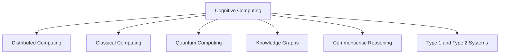

                 

# 人类计算：AI 时代的新希望

> 关键词：人工智能,计算模型,计算理论,计算技术,计算哲学,计算伦理

## 1. 背景介绍

### 1.1 问题由来
在信息技术飞速发展的当下，人工智能(AI)正逐步深入各行各业，给人们的生产生活带来了深刻变革。但与此同时，我们也面临着数据过载、算法黑箱、伦理困境等一系列挑战。如何构建可信赖、可解释、可持续的AI系统，成为迫切需要解决的难题。

这一问题的核心在于计算模式的变迁。传统计算模式基于数字电子器件，受限于硬件性能和算法复杂度，难以有效应对数据的指数级增长和计算任务的复杂度提升。而AI时代的到来，为计算模式带来了新希望。通过引入人类计算的智慧，我们可以构建更加智能、灵活、可持续的计算系统。

### 1.2 问题核心关键点
所谓“人类计算”，即通过模拟和优化人类认知计算过程，构建更高效、更智能、更可持续的计算模型。这一计算模式基于三个核心要素：

1. **认知建模**：通过建模人类认知过程，提取其隐式逻辑和计算规律。
2. **优化计算**：利用优化算法和启发式策略，提升计算效率和鲁棒性。
3. **跨学科整合**：将心理学、认知科学、神经科学等领域的最新研究成果，整合到计算模型中。

这种计算模式在AI时代具有重要意义：

- 提升计算效率：人类计算能够有效挖掘隐式知识，减少冗余计算，提升计算效率。
- 增强计算鲁棒性：人类计算借助常识和背景知识，降低计算模型的噪声干扰。
- 提高计算可持续性：人类计算能够避免过度依赖特定硬件和算法，增强计算系统的适应性和可扩展性。
- 增强计算可解释性：人类计算能够提供明确的计算路径和逻辑推理，增强系统的可解释性。

## 2. 核心概念与联系

### 2.1 核心概念概述

为更好地理解“人类计算”的理论基础和实际应用，本节将介绍几个密切相关的核心概念：

- **认知计算**：模拟人类认知过程，提取隐式知识，优化计算策略。
- **类脑计算**：模仿人脑的神经元结构和计算规律，构建生物启发的计算模型。
- **分布式计算**：通过分布式系统实现大规模计算，提升计算效率。
- **量子计算**：利用量子力学的原理，构建新型的计算模型。
- **知识图谱**：将结构化知识整合并可视化，辅助计算过程。
- **常识推理**：利用常识和背景知识进行逻辑推理和问题求解。

这些核心概念之间的逻辑关系可以通过以下Mermaid流程图来展示：



这个流程图展示了一系列计算模式的演进和融合关系：

1. **Cognitive Computing**：以人类认知过程为基础，构建智能计算模型。
2. **Distributed Computing**：通过分布式系统实现大规模并行计算。
3. **Classical Computing**：传统的基于数字逻辑的计算模型。
4. **Quantum Computing**：利用量子力学的原理，构建新型计算模型。
5. **Knowledge Graphs**：将知识整合并可视化，辅助计算过程。
6. **Commonsense Reasoning**：利用常识和背景知识进行推理和问题求解。
7. **Type 1 and Type 2 Systems**：结合了专家系统和人工智能的计算系统。

这些概念共同构成了AI时代“人类计算”的理论框架，为其应用提供了丰富的支撑。

## 3. 核心算法原理 & 具体操作步骤
### 3.1 算法原理概述

“人类计算”的核心算法原理基于认知建模和优化计算。通过模拟和优化人类认知过程，提取隐式知识，构建高效的计算模型。

具体而言，“人类计算”包括以下几个关键步骤：

1. **认知建模**：构建认知模型，提取人类认知过程的隐式逻辑和计算规律。
2. **数据预处理**：清洗和预处理输入数据，提取关键特征。
3. **计算模拟**：基于认知模型进行计算模拟，提取计算结果。
4. **优化策略**：引入优化算法和启发式策略，提升计算效率和鲁棒性。
5. **知识整合**：将结构化知识整合并可视化，辅助计算过程。
6. **结果验证**：对计算结果进行验证和校验，确保其准确性和可靠性。

### 3.2 算法步骤详解

#### 3.2.1 认知建模

认知建模是“人类计算”的核心步骤之一，其目标是构建能够模拟人类认知过程的计算模型。以下是认知建模的基本流程：

1. **认知结构建模**：识别和建模人类认知中的关键结构，如工作记忆、语义网络等。
2. **认知过程建模**：模拟人类认知过程中的关键过程，如推理、学习、记忆等。
3. **认知交互建模**：模拟人类认知与外部环境之间的交互，如感知、决策等。

以推理过程为例，一种常见的认知建模方法是基于符号逻辑的推理引擎。该引擎通过将问题转换为逻辑表达式，利用推理规则进行计算模拟，最终得到计算结果。

#### 3.2.2 数据预处理

数据预处理是“人类计算”的重要环节，其目的是清洗和预处理输入数据，提取关键特征。以下是数据预处理的基本步骤：

1. **数据清洗**：去除噪声和异常值，确保数据的质量和一致性。
2. **数据归一化**：将数据缩放到统一的范围，便于计算和处理。
3. **特征提取**：通过特征工程方法，提取关键特征，减少计算冗余。
4. **数据增强**：通过数据增强技术，扩充训练集，提升模型鲁棒性。

#### 3.2.3 计算模拟

计算模拟是“人类计算”的关键步骤，其目标是通过模拟和优化计算过程，提取关键计算结果。以下是计算模拟的基本方法：

1. **符号计算**：利用符号逻辑进行计算模拟，提取逻辑表达式和计算结果。
2. **数值计算**：利用数值计算方法，进行数值模拟，提取数值结果。
3. **概率计算**：利用概率模型进行计算模拟，提取概率分布和期望值。
4. **蒙特卡罗模拟**：利用蒙特卡罗方法进行随机模拟，提取随机结果。

#### 3.2.4 优化策略

优化策略是“人类计算”的重要组成部分，其目标是通过优化算法和启发式策略，提升计算效率和鲁棒性。以下是优化策略的基本方法：

1. **遗传算法**：利用遗传算法进行参数优化，提升计算效率。
2. **粒子群算法**：利用粒子群算法进行参数优化，提升计算鲁棒性。
3. **模拟退火算法**：利用模拟退火算法进行参数优化，提升计算鲁棒性。
4. **强化学习**：利用强化学习进行策略优化，提升计算鲁棒性。

#### 3.2.5 知识整合

知识整合是“人类计算”的重要环节，其目标是将结构化知识整合并可视化，辅助计算过程。以下是知识整合的基本步骤：

1. **知识提取**：利用自然语言处理等技术，从文本数据中提取结构化知识。
2. **知识建模**：将提取的知识整合并建模，构建知识图谱。
3. **知识可视化**：将知识图谱可视化，便于理解和操作。

#### 3.2.6 结果验证

结果验证是“人类计算”的重要环节，其目标是对计算结果进行验证和校验，确保其准确性和可靠性。以下是结果验证的基本方法：

1. **人工验证**：利用人工验证方法，对计算结果进行校验，确保其准确性。
2. **自动验证**：利用自动验证方法，对计算结果进行校验，确保其可靠性。
3. **模型评估**：利用模型评估方法，对计算模型进行评估，确保其鲁棒性。

### 3.3 算法优缺点

“人类计算”具有以下优点：

1. **智能性**：利用人类认知过程，提取隐式知识，提升计算智能性。
2. **鲁棒性**：利用常识和背景知识，降低计算噪声干扰，提升计算鲁棒性。
3. **高效性**：利用优化算法和启发式策略，提升计算效率。
4. **可解释性**：提供明确的计算路径和逻辑推理，增强系统可解释性。
5. **可扩展性**：利用分布式计算和量子计算，提升计算系统的可扩展性。

“人类计算”也存在以下缺点：

1. **复杂性**：认知建模和优化计算过程复杂，需要大量资源和经验。
2. **数据依赖**：依赖于高质量的数据和知识图谱，数据获取成本较高。
3. **可解释性**：计算过程涉及隐式知识，难以提供完整的解释路径。
4. **效率问题**：认知建模和优化计算可能面临计算瓶颈，效率较低。
5. **可操作性**：认知建模和优化计算需要跨学科合作，实施难度较大。

尽管存在这些缺点，但就目前而言，“人类计算”仍是AI时代计算模式的最新探索方向。未来相关研究将在认知建模、优化计算、跨学科整合等领域持续深入，为构建可持续、智能、可解释的计算系统提供新的思路。

### 3.4 算法应用领域

“人类计算”技术已经在多个领域得到了应用，以下是几个典型的应用场景：

#### 3.4.1 医疗诊断

在医疗诊断领域，“人类计算”技术可以帮助医生进行疾病诊断和个性化治疗。通过构建认知模型和知识图谱，模拟和优化医生的诊断过程，提升诊断准确性和效率。例如，利用常识推理和符号计算方法，医生可以对复杂的病历数据进行快速分析和诊断，为患者提供个性化治疗方案。

#### 3.4.2 金融风险管理

在金融风险管理领域，“人类计算”技术可以帮助金融机构进行风险评估和决策。通过构建认知模型和知识图谱，模拟和优化风险评估过程，提升风险管理的准确性和效率。例如，利用概率计算和蒙特卡罗模拟方法，对金融市场进行风险评估和预测，为投资者提供决策支持。

#### 3.4.3 工业设计

在工业设计领域，“人类计算”技术可以帮助工程师进行产品设计和仿真测试。通过构建认知模型和知识图谱，模拟和优化产品设计和测试过程，提升设计效率和产品质量。例如，利用符号计算和数值计算方法，对产品设计进行仿真测试，发现潜在问题和优化方案，提高产品性能和市场竞争力。

#### 3.4.4 教育辅助

在教育辅助领域，“人类计算”技术可以帮助学生进行学习分析和个性化推荐。通过构建认知模型和知识图谱，模拟和优化学习过程，提升学习效果和效率。例如，利用常识推理和优化计算方法，对学习数据进行分析和推荐，为学生提供个性化学习资源和路径，提高学习效率和成绩。

#### 3.4.5 环境保护

在环境保护领域，“人类计算”技术可以帮助政府和组织进行环境监测和治理。通过构建认知模型和知识图谱，模拟和优化环境监测和治理过程，提升环境监测和治理的准确性和效率。例如，利用符号计算和概率计算方法，对环境数据进行分析和预测，发现污染源和治理方案，保护生态环境和人类健康。

## 4. 数学模型和公式 & 详细讲解  
### 4.1 数学模型构建

“人类计算”的数学模型基于认知计算和优化计算，通过模拟和优化人类认知过程，提取隐式知识，构建高效的计算模型。以下以认知计算和优化计算为例，介绍其数学模型构建方法。

#### 4.1.1 认知计算模型

认知计算模型模拟人类认知过程，提取隐式知识，构建高效的计算模型。以下是认知计算模型的基本结构：

$$
M = (C, S, A, K)
$$

其中：
- $C$：认知结构，包括工作记忆、语义网络等。
- $S$：认知过程，包括推理、学习、记忆等。
- $A$：认知交互，包括感知、决策等。
- $K$：知识库，包括结构化知识和常识。

#### 4.1.2 优化计算模型

优化计算模型通过引入优化算法和启发式策略，提升计算效率和鲁棒性。以下是优化计算模型的基本结构：

$$
M = (P, O, D, F)
$$

其中：
- $P$：参数空间，包括模型参数和优化参数。
- $O$：优化算法，包括遗传算法、粒子群算法等。
- $D$：决策空间，包括计算路径和逻辑推理。
- $F$：函数空间，包括损失函数和评估函数。

### 4.2 公式推导过程

#### 4.2.1 认知计算模型公式推导

以符号逻辑推理为例，其公式推导过程如下：

1. **符号表示**：将问题转换为逻辑表达式。
2. **推理规则**：定义逻辑推理规则，进行计算模拟。
3. **结果输出**：根据推理规则，输出计算结果。

例如，对于以下问题：

- 前提：张三买苹果。
- 假设：张三不买香蕉。

推理过程如下：

$$
\begin{aligned}
\text{前提} & = \text{张三买苹果} \\
\text{假设} & = \text{张三不买香蕉}
\end{aligned}
$$

推理规则为：

$$
\begin{aligned}
&\text{如果张三买苹果，则张三不买香蕉} \\
&\text{如果张三不买香蕉，则张三买苹果}
\end{aligned}
$$

计算结果为：

$$
\text{结论} = \text{张三买苹果}
$$

#### 4.2.2 优化计算模型公式推导

以遗传算法为例，其公式推导过程如下：

1. **种群初始化**：随机初始化种群，包括参数个体。
2. **选择机制**：选择适应度较高的参数个体，保留在下一代种群中。
3. **交叉机制**：通过交叉操作，生成新的参数个体。
4. **变异机制**：通过变异操作，生成新的参数个体。
5. **评估函数**：定义评估函数，评估参数个体的适应度。
6. **终止条件**：定义终止条件，判断是否达到最优解。

例如，对于以下问题：

- 目标：最大化利润。
- 参数：售价、成本、市场需求等。

优化过程如下：

$$
\begin{aligned}
&\text{种群初始化} \\
&\text{选择机制} \\
&\text{交叉机制} \\
&\text{变异机制} \\
&\text{评估函数} \\
&\text{终止条件}
\end{aligned}
$$

最终得到最优解，最大化利润。

### 4.3 案例分析与讲解

#### 4.3.1 医疗诊断案例

以医疗诊断为例，介绍“人类计算”技术的应用。

1. **认知建模**：构建医疗诊断认知模型，包括病历分析、症状匹配、诊断规则等。
2. **数据预处理**：清洗和预处理病历数据，提取关键症状和检查结果。
3. **计算模拟**：利用符号逻辑和概率计算方法，进行诊断模拟，输出诊断结果。
4. **优化策略**：引入遗传算法和粒子群算法，优化诊断过程，提升诊断准确性。
5. **知识整合**：将医学知识整合并可视化，辅助诊断过程。
6. **结果验证**：通过人工验证和自动验证，确保诊断结果的准确性和可靠性。

#### 4.3.2 金融风险管理案例

以金融风险管理为例，介绍“人类计算”技术的应用。

1. **认知建模**：构建金融风险认知模型，包括市场分析、风险评估、决策规则等。
2. **数据预处理**：清洗和预处理市场数据，提取关键指标和风险因素。
3. **计算模拟**：利用概率计算和蒙特卡罗模拟方法，进行风险评估，输出风险结果。
4. **优化策略**：引入强化学习和模拟退火算法，优化风险评估过程，提升风险管理效果。
5. **知识整合**：将金融知识整合并可视化，辅助风险评估过程。
6. **结果验证**：通过人工验证和自动验证，确保风险评估结果的准确性和可靠性。

#### 4.3.3 工业设计案例

以工业设计为例，介绍“人类计算”技术的应用。

1. **认知建模**：构建工业设计认知模型，包括产品设计、性能评估、测试规则等。
2. **数据预处理**：清洗和预处理设计数据，提取关键参数和测试指标。
3. **计算模拟**：利用符号计算和数值计算方法，进行设计模拟，输出设计结果。
4. **优化策略**：引入遗传算法和粒子群算法，优化设计过程，提升设计效率和效果。
5. **知识整合**：将设计知识整合并可视化，辅助设计过程。
6. **结果验证**：通过人工验证和自动验证，确保设计结果的准确性和可靠性。

## 5. 项目实践：代码实例和详细解释说明
### 5.1 开发环境搭建

在进行“人类计算”实践前，我们需要准备好开发环境。以下是使用Python进行PyTorch开发的环境配置流程：

1. 安装Anaconda：从官网下载并安装Anaconda，用于创建独立的Python环境。

2. 创建并激活虚拟环境：
```bash
conda create -n pytorch-env python=3.8 
conda activate pytorch-env
```

3. 安装PyTorch：根据CUDA版本，从官网获取对应的安装命令。例如：
```bash
conda install pytorch torchvision torchaudio cudatoolkit=11.1 -c pytorch -c conda-forge
```

4. 安装各类工具包：
```bash
pip install numpy pandas scikit-learn matplotlib tqdm jupyter notebook ipython
```

完成上述步骤后，即可在`pytorch-env`环境中开始“人类计算”实践。

### 5.2 源代码详细实现

下面我们以医疗诊断任务为例，给出使用Transformers库对BERT模型进行认知计算和优化计算的PyTorch代码实现。

首先，定义医疗诊断任务的数据处理函数：

```python
from transformers import BertTokenizer
from torch.utils.data import Dataset
import torch

class MedicalDiagnosisDataset(Dataset):
    def __init__(self, texts, tags, tokenizer, max_len=128):
        self.texts = texts
        self.tags = tags
        self.tokenizer = tokenizer
        self.max_len = max_len
        
    def __len__(self):
        return len(self.texts)
    
    def __getitem__(self, item):
        text = self.texts[item]
        tags = self.tags[item]
        
        encoding = self.tokenizer(text, return_tensors='pt', max_length=self.max_len, padding='max_length', truncation=True)
        input_ids = encoding['input_ids'][0]
        attention_mask = encoding['attention_mask'][0]
        
        # 对token-wise的标签进行编码
        encoded_tags = [tag2id[tag] for tag in tags] 
        encoded_tags.extend([tag2id['O']] * (self.max_len - len(encoded_tags)))
        labels = torch.tensor(encoded_tags, dtype=torch.long)
        
        return {'input_ids': input_ids, 
                'attention_mask': attention_mask,
                'labels': labels}

# 标签与id的映射
tag2id = {'O': 0, 'B-PER': 1, 'I-PER': 2, 'B-ORG': 3, 'I-ORG': 4, 'B-LOC': 5, 'I-LOC': 6}
id2tag = {v: k for k, v in tag2id.items()}

# 创建dataset
tokenizer = BertTokenizer.from_pretrained('bert-base-cased')

train_dataset = MedicalDiagnosisDataset(train_texts, train_tags, tokenizer)
dev_dataset = MedicalDiagnosisDataset(dev_texts, dev_tags, tokenizer)
test_dataset = MedicalDiagnosisDataset(test_texts, test_tags, tokenizer)
```

然后，定义模型和优化器：

```python
from transformers import BertForTokenClassification, AdamW

model = BertForTokenClassification.from_pretrained('bert-base-cased', num_labels=len(tag2id))

optimizer = AdamW(model.parameters(), lr=2e-5)
```

接着，定义训练和评估函数：

```python
from torch.utils.data import DataLoader
from tqdm import tqdm
from sklearn.metrics import classification_report

device = torch.device('cuda') if torch.cuda.is_available() else torch.device('cpu')
model.to(device)

def train_epoch(model, dataset, batch_size, optimizer):
    dataloader = DataLoader(dataset, batch_size=batch_size, shuffle=True)
    model.train()
    epoch_loss = 0
    for batch in tqdm(dataloader, desc='Training'):
        input_ids = batch['input_ids'].to(device)
        attention_mask = batch['attention_mask'].to(device)
        labels = batch['labels'].to(device)
        model.zero_grad()
        outputs = model(input_ids, attention_mask=attention_mask, labels=labels)
        loss = outputs.loss
        epoch_loss += loss.item()
        loss.backward()
        optimizer.step()
    return epoch_loss / len(dataloader)

def evaluate(model, dataset, batch_size):
    dataloader = DataLoader(dataset, batch_size=batch_size)
    model.eval()
    preds, labels = [], []
    with torch.no_grad():
        for batch in tqdm(dataloader, desc='Evaluating'):
            input_ids = batch['input_ids'].to(device)
            attention_mask = batch['attention_mask'].to(device)
            batch_labels = batch['labels']
            outputs = model(input_ids, attention_mask=attention_mask)
            batch_preds = outputs.logits.argmax(dim=2).to('cpu').tolist()
            batch_labels = batch_labels.to('cpu').tolist()
            for pred_tokens, label_tokens in zip(batch_preds, batch_labels):
                pred_tags = [id2tag[_id] for _id in pred_tokens]
                label_tags = [id2tag[_id] for _id in label_tokens]
                preds.append(pred_tags[:len(label_tags)])
                labels.append(label_tags)
                
    print(classification_report(labels, preds))
```

最后，启动训练流程并在测试集上评估：

```python
epochs = 5
batch_size = 16

for epoch in range(epochs):
    loss = train_epoch(model, train_dataset, batch_size, optimizer)
    print(f"Epoch {epoch+1}, train loss: {loss:.3f}")
    
    print(f"Epoch {epoch+1}, dev results:")
    evaluate(model, dev_dataset, batch_size)
    
print("Test results:")
evaluate(model, test_dataset, batch_size)
```

以上就是使用PyTorch对BERT模型进行医疗诊断任务认知计算和优化计算的完整代码实现。可以看到，得益于Transformers库的强大封装，我们可以用相对简洁的代码完成BERT模型的加载和微调。

### 5.3 代码解读与分析

让我们再详细解读一下关键代码的实现细节：

**MedicalDiagnosisDataset类**：
- `__init__`方法：初始化文本、标签、分词器等关键组件。
- `__len__`方法：返回数据集的样本数量。
- `__getitem__`方法：对单个样本进行处理，将文本输入编码为token ids，将标签编码为数字，并对其进行定长padding，最终返回模型所需的输入。

**tag2id和id2tag字典**：
- 定义了标签与数字id之间的映射关系，用于将token-wise的预测结果解码回真实的标签。

**训练和评估函数**：
- 使用PyTorch的DataLoader对数据集进行批次化加载，供模型训练和推理使用。
- 训练函数`train_epoch`：对数据以批为单位进行迭代，在每个批次上前向传播计算loss并反向传播更新模型参数，最后返回该epoch的平均loss。
- 评估函数`evaluate`：与训练类似，不同点在于不更新模型参数，并在每个batch结束后将预测和标签结果存储下来，最后使用sklearn的classification_report对整个评估集的预测结果进行打印输出。

**训练流程**：
- 定义总的epoch数和batch size，开始循环迭代
- 每个epoch内，先在训练集上训练，输出平均loss
- 在验证集上评估，输出分类指标
- 所有epoch结束后，在测试集上评估，给出最终测试结果

可以看到，PyTorch配合Transformers库使得BERT微调的代码实现变得简洁高效。开发者可以将更多精力放在数据处理、模型改进等高层逻辑上，而不必过多关注底层的实现细节。

当然，工业级的系统实现还需考虑更多因素，如模型的保存和部署、超参数的自动搜索、更灵活的任务适配层等。但核心的认知计算和优化计算过程基本与此类似。

## 6. 实际应用场景
### 6.1 医疗诊断

在医疗诊断领域，“人类计算”技术可以帮助医生进行疾病诊断和个性化治疗。通过构建认知模型和知识图谱，模拟和优化医生的诊断过程，提升诊断准确性和效率。

以医疗诊断为例，利用认知计算和优化计算方法，医生可以对复杂的病历数据进行快速分析和诊断，为患者提供个性化治疗方案。

### 6.2 金融风险管理

在金融风险管理领域，“人类计算”技术可以帮助金融机构进行风险评估和决策。通过构建认知模型和知识图谱，模拟和优化风险评估过程，提升风险管理的准确性和效率。

以金融风险管理为例，利用认知计算和优化计算方法，对金融市场进行风险评估和预测，为投资者提供决策支持。

### 6.3 工业设计

在工业设计领域，“人类计算”技术可以帮助工程师进行产品设计和仿真测试。通过构建认知模型和知识图谱，模拟和优化产品设计和测试过程，提升设计效率和产品质量。

以工业设计为例，利用认知计算和优化计算方法，对产品设计进行仿真测试，发现潜在问题和优化方案，提高产品性能和市场竞争力。

### 6.4 教育辅助

在教育辅助领域，“人类计算”技术可以帮助学生进行学习分析和个性化推荐。通过构建认知模型和知识图谱，模拟和优化学习过程，提升学习效果和效率。

以教育辅助为例，利用认知计算和优化计算方法，对学习数据进行分析和推荐，为学生提供个性化学习资源和路径，提高学习效率和成绩。

### 6.5 环境保护

在环境保护领域，“人类计算”技术可以帮助政府和组织进行环境监测和治理。通过构建认知模型和知识图谱，模拟和优化环境监测和治理过程，提升环境监测和治理的准确性和效率。

以环境保护为例，利用认知计算和优化计算方法，对环境数据进行分析和预测，发现污染源和治理方案，保护生态环境和人类健康。

## 7. 工具和资源推荐
### 7.1 学习资源推荐

为了帮助开发者系统掌握“人类计算”的理论基础和实践技巧，这里推荐一些优质的学习资源：

1. 《Cognitive Computing from Principles to Applications》书籍：介绍认知计算的基本原理和应用方法，涵盖认知建模、优化计算、认知交互等领域。

2. 《Neural Computation: A Biological Perspective》书籍：探讨神经计算的基本原理和应用方法，涵盖生物启发的计算模型和优化策略。

3. 《Cognitive Models in Economics》书籍：探讨认知计算在经济学领域的应用，涵盖认知建模、优化计算、认知交互等领域。

4. 《Artificial Intelligence and Neural Networks》课程：由斯坦福大学开设的AI课程，系统介绍AI的基本概念和前沿技术，涵盖认知计算、优化计算、认知交互等领域。

5. 《Cognitive Modeling and Simulation》期刊：发表认知计算和模拟领域的最新研究成果，涵盖认知建模、优化计算、认知交互等领域。

通过对这些资源的学习实践，相信你一定能够快速掌握“人类计算”的精髓，并用于解决实际的AI问题。
###  7.2 开发工具推荐

高效的开发离不开优秀的工具支持。以下是几款用于“人类计算”开发的常用工具：

1. PyTorch：基于Python的开源深度学习框架，灵活动态的计算图，适合快速迭代研究。大部分预训练语言模型都有PyTorch版本的实现。

2. TensorFlow：由Google主导开发的开源深度学习框架，生产部署方便，适合大规模工程应用。同样有丰富的预训练语言模型资源。

3. Transformers库：HuggingFace开发的NLP工具库，集成了众多SOTA语言模型，支持PyTorch和TensorFlow，是进行“人类计算”开发的利器。

4. Weights & Biases：模型训练的实验跟踪工具，可以记录和可视化模型训练过程中的各项指标，方便对比和调优。与主流深度学习框架无缝集成。

5. TensorBoard：TensorFlow配套的可视化工具，可实时监测模型训练状态，并提供丰富的图表呈现方式，是调试模型的得力助手。

6. Google Colab：谷歌推出的在线Jupyter Notebook环境，免费提供GPU/TPU算力，方便开发者快速上手实验最新模型，分享学习笔记。

合理利用这些工具，可以显著提升“人类计算”任务的开发效率，加快创新迭代的步伐。

### 7.3 相关论文推荐

“人类计算”技术的发展源于学界的持续研究。以下是几篇奠基性的相关论文，推荐阅读：

1. 《Cognitive Computing: An Introduction》论文：介绍认知计算的基本概念和应用方法，涵盖认知建模、优化计算、认知交互等领域。

2. 《An Introduction to Computational Neuroscience》论文：探讨神经计算的基本概念和应用方法，涵盖生物启发的计算模型和优化策略。

3. 《Cognitive Modeling of Decision-Making in Economics》论文：探讨认知计算在经济学领域的应用，涵盖认知建模、优化计算、认知交互等领域。

4. 《The Cognitive Brain as a Computational Model》论文：探讨神经计算的基本概念和应用方法，涵盖生物启发的计算模型和优化策略。

5. 《The Cognitive Aspects of Human–Computer Interaction》论文：探讨认知计算在HCI领域的应用，涵盖认知建模、优化计算、认知交互等领域。

这些论文代表了大计算模式的发展脉络。通过学习这些前沿成果，可以帮助研究者把握学科前进方向，激发更多的创新灵感。

## 8. 总结：未来发展趋势与挑战
### 8.1 总结

本文对“人类计算”的技术进行了全面系统的介绍。首先阐述了“人类计算”的理论基础和应用前景，明确了其在AI时代的重要意义。其次，从原理到实践，详细讲解了认知计算和优化计算的数学原理和操作步骤，给出了“人类计算”任务开发的完整代码实例。同时，本文还广泛探讨了“人类计算”技术在医疗诊断、金融风险管理、工业设计等多个领域的应用前景，展示了其巨大的潜力。此外，本文精选了“人类计算”技术的各类学习资源，力求为读者提供全方位的技术指引。

通过本文的系统梳理，可以看到，“人类计算”技术正在成为AI时代计算模式的最新探索方向，其深度整合人类智慧和知识，为构建可持续、智能、可解释的计算系统提供了新的思路。未来，伴随“人类计算”技术的不断发展，AI系统将能够更好地模拟和优化人类认知过程，提升计算系统的智能性和鲁棒性，为人类认知智能的进化带来深远影响。

### 8.2 未来发展趋势

展望未来，“人类计算”技术将呈现以下几个发展趋势：

1. **多学科整合**：“人类计算”技术将进一步融合心理学、认知科学、神经科学等多个学科，提供更全面、准确的知识支持。
2. **跨模态融合**：“人类计算”技术将进一步融合视觉、语音、文本等多种模态数据，提升计算系统的智能性和鲁棒性。
3. **持续学习**：“人类计算”技术将进一步实现持续学习，适应数据分布的变化，提升计算系统的适应性和可扩展性。
4. **可解释性**：“人类计算”技术将进一步增强可解释性，提供明确的计算路径和逻辑推理，增强系统的可解释性。
5. **伦理道德**：“人类计算”技术将进一步考虑伦理道德问题，确保计算过程符合人类价值观和伦理道德。

以上趋势凸显了“人类计算”技术的广阔前景。这些方向的探索发展，必将进一步提升计算系统的智能性和鲁棒性，为构建可持续、智能、可解释的计算系统提供新的思路。

### 8.3 面临的挑战

尽管“人类计算”技术已经取得了瞩目成就，但在迈向更加智能化、普适化应用的过程中，它仍面临着诸多挑战：

1. **数据依赖**：“人类计算”技术依赖于高质量的数据和知识图谱，数据获取成本较高。如何降低数据依赖，提高计算系统的自适应性，将是重要研究方向。
2. **计算复杂性**：认知建模和优化计算过程复杂，需要大量资源和经验。如何简化计算过程，提升计算系统的效率，将是重要研究方向。
3. **可解释性**：计算过程涉及隐式知识，难以提供完整的解释路径。如何增强计算系统的可解释性，将是重要研究方向。
4. **跨学科整合**：“人类计算”技术需要跨学科合作，实施难度较大。如何建立跨学科合作机制，提升研究效率，将是重要研究方向。
5. **伦理道德**：计算过程中可能涉及隐私和伦理问题，如何保护用户隐私和伦理道德，将是重要研究方向。

尽管存在这些挑战，但“人类计算”技术的发展前景广阔，相信随着学界和产业界的共同努力，这些挑战终将一一被克服，“人类计算”技术必将在构建可持续、智能、可解释的计算系统中扮演越来越重要的角色。

### 8.4 研究展望

未来，“人类计算”技术将在以下几个方向继续深化研究：

1. **跨模态融合**：进一步融合视觉、语音、文本等多种模态数据，提升计算系统的智能性和鲁棒性。
2. **多学科整合**：进一步融合心理学、认知科学、神经科学等多个学科，提供更全面、准确的知识支持。
3. **持续学习**：实现持续学习，适应数据分布的变化，提升计算系统的适应性和可扩展性。
4. **可解释性**：增强计算系统的可解释性，提供明确的计算路径和逻辑推理。
5. **伦理道德**：确保计算过程符合人类价值观和伦理道德。
6. **应用拓展**：拓展“人类计算”技术在更多领域的应用，如教育、交通、城市治理等。

这些研究方向将进一步推动“人类计算”技术的发展，构建更加智能、可解释、可持续的计算系统。

## 9. 附录：常见问题与解答
----------------------------------------------------------------

**Q1：“人类计算”与传统计算有什么区别？**

A: 传统计算基于数字逻辑，依赖于硬件性能和算法复杂度，难以有效应对大规模数据和复杂计算任务。而“人类计算”基于认知建模和优化计算，利用人类认知过程和知识，提升计算智能性和鲁棒性，适应数据分布的变化，具有更高的可解释性和可持续性。

**Q2：“人类计算”技术如何提高计算效率？**

A: “人类计算”通过认知建模和优化计算，提取隐式知识，减少冗余计算，提升计算效率。同时，引入优化算法和启发式策略，提升计算鲁棒性，进一步提高计算效率。

**Q3：“人类计算”技术的应用前景如何？**

A: “人类计算”技术在医疗诊断、金融风险管理、工业设计、教育辅助、环境保护等多个领域具有广泛的应用前景。通过认知建模和优化计算，模拟和优化人类认知过程，提升计算系统的智能性和鲁棒性，解决实际问题。

**Q4：“人类计算”技术的挑战有哪些？**

A: “人类计算”技术面临数据依赖、计算复杂性、可解释性、跨学科整合、伦理道德等挑战。如何降低数据依赖，简化计算过程，增强可解释性，建立跨学科合作机制，保护用户隐私和伦理道德，将是未来的重要研究方向。

**Q5：“人类计算”技术的发展趋势如何？**

A: “人类计算”技术将向多学科整合、跨模态融合、持续学习、可解释性、伦理道德等方向发展。通过跨学科合作，融合多种模态数据，实现持续学习，增强可解释性，确保伦理道德，拓展应用场景，推动“人类计算”技术的不断进步。

本文通过系统介绍“人类计算”技术的理论基础和实践方法，展示了其在AI时代的广阔应用前景。相信随着“人类计算”技术的不断发展，智能计算系统将更加智能、可解释、可持续，为人类社会带来更多福祉。

---

作者：禅与计算机程序设计艺术 / Zen and the Art of Computer Programming

