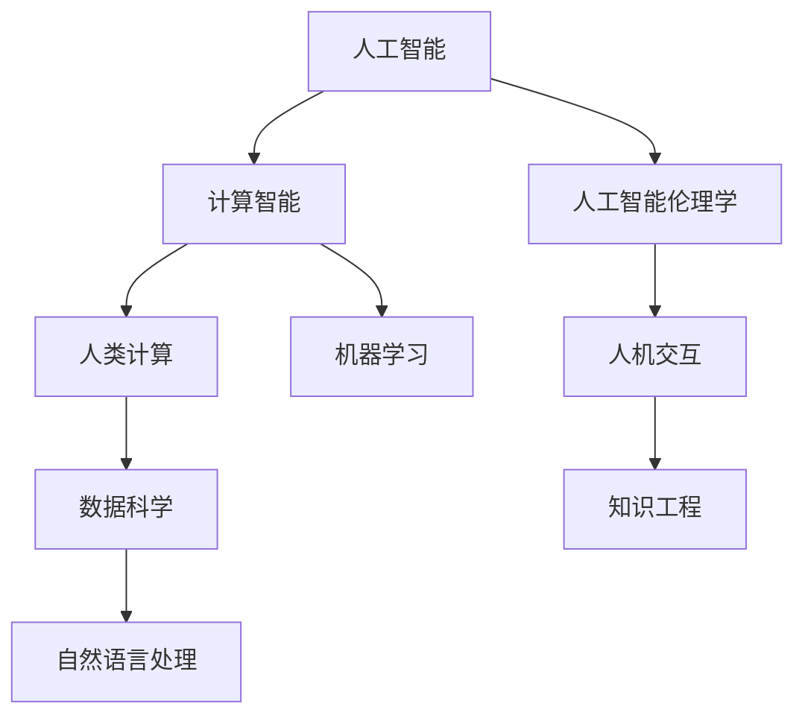

                 

# 人类计算：AI时代的未来技能

> 关键词：
- 人工智能(AI)
- 人机协同(Co-AI)
- 计算智能(Computational Intelligence)
- 人工智能伦理学(Ethics of AI)
- 未来技能(Future Skills)
- 数据科学(Data Science)
- 知识工程(Knowledge Engineering)

## 1. 背景介绍

### 1.1 问题由来

随着人工智能(AI)技术日新月异，人类社会正迎来一场深刻的变革。越来越多的行业开始引入AI技术，以提高生产效率和创新能力。然而，AI的快速发展也带来了新的挑战：数据质量问题、算力资源需求、模型复杂性、伦理道德风险等。在这种情况下，人类计算的角色显得尤为重要。

人类计算，是指在AI技术发展的过程中，通过人类的创造性思维、直觉和专业知识，与AI算法和系统协同合作，共同解决问题。它不仅仅是计算的一个分支，更是一种全新的工作模式，涉及到人类与计算机的深度融合，是人类智能与AI技术的协同发展。

### 1.2 问题核心关键点

当前，人类计算的核心关键点主要包括：

- 如何合理利用人类专长与AI算法，发挥各自优势，提升问题解决效率。
- 在AI系统的训练与运行过程中，如何加入人类知识与经验，增强AI的可靠性与泛化能力。
- 如何构建更加安全、可控、负责任的AI系统，确保AI技术的应用符合人类价值观与伦理道德。

### 1.3 问题研究意义

研究人类计算的重要性在于：

- 提高AI系统的实用性与可靠性。通过加入人类的经验与知识，AI系统可以在特定领域实现更高的性能和效果。
- 促进AI技术的公平性与透明性。在AI系统的开发与部署中，引入人类的监督与控制，可以减少偏见与错误。
- 加速AI技术的应用与普及。通过人类计算，AI技术可以更快地进入实际生产与生活场景，推动社会进步。
- 提升人类在AI时代的安全感与幸福感。在AI系统的辅助下，人类可以更好地应对复杂问题，提高生活质量。

## 2. 核心概念与联系

### 2.1 核心概念概述

在讨论人类计算之前，我们需要了解几个关键概念：

- 人工智能(AI)：利用计算机系统模拟人类智能过程的技术，包括但不限于机器学习、深度学习、自然语言处理等。
- 人类计算(Co-AI)：将人类知识与技能融入AI系统，形成人机协同的工作模式，实现更高效、更可靠的问题解决。
- 计算智能(Computational Intelligence)：利用生物智能与计算技术相结合，提升智能系统的学习与决策能力。
- 人工智能伦理学(Ethics of AI)：研究如何确保AI技术的应用符合伦理道德规范，保护人类权益。
- 数据科学(Data Science)：一门结合统计学、机器学习、数据工程等技术的学科，旨在从数据中提取知识与洞察。
- 知识工程(Knowledge Engineering)：将人类知识转化为计算机可理解和处理的知识表示，实现知识共享与复用。

这些概念之间的联系可以通过以下Mermaid流程图来展示：



这个流程图展示了人工智能、计算智能、人类计算等核心概念之间的联系：

- 人工智能是计算智能的基础，通过机器学习等算法实现对数据的处理与分析。
- 计算智能融合了生物智能与计算技术，提升了智能系统的学习与决策能力。
- 人类计算将人类知识与技能融入AI系统，形成人机协同的解决方案。
- 数据科学与知识工程是实现人类计算的关键技术，为人类计算提供了必要的工具与方法。
- 人工智能伦理学为人类计算提供了伦理保障，确保其应用符合社会价值观。

这些概念共同构成了AI技术发展的基础框架，为人机协同的未来提供了理论基础。

## 3. 核心算法原理 & 具体操作步骤
### 3.1 算法原理概述

人类计算的核心算法原理基于人机协同的计算模型。其核心思想是：在AI系统训练与运行过程中，结合人类专长与经验，实现更高效、更可靠的计算与推理。

具体来说，人类计算的算法原理包括以下几个关键点：

- 人类专长与AI算法结合。通过向AI系统输入人类专长的知识与经验，增强系统的理解能力和决策质量。
- 数据与模型的协同优化。利用数据科学和知识工程的成果，优化AI系统的输入与输出，提升其准确性和鲁棒性。
- 持续学习与优化。通过不断反馈与调整，使AI系统能够适应新数据和新任务，保持其性能与可靠性。

### 3.2 算法步骤详解

人类计算的算法步骤通常包括以下几个关键环节：

1. **问题定义与数据准备**：明确需要解决的问题，收集相关的数据与知识。

2. **模型选择与预训练**：选择合适的AI模型，并进行预训练。预训练过程中可以融入人类专长，增强模型的理解能力。

3. **知识表示与模型适配**：利用数据科学和知识工程技术，将人类知识转化为计算机可理解的表示，适配到AI模型中。

4. **协同训练与优化**：在AI模型训练过程中，引入人类专长与经验，进行协同训练与优化，提高模型的准确性与鲁棒性。

5. **反馈与调整**：通过持续反馈与调整，使AI系统能够适应新数据和新任务，保持其性能与可靠性。

6. **评估与部署**：对AI系统的性能进行评估，验证其符合人类价值观与伦理道德规范，部署到实际应用场景中。

### 3.3 算法优缺点

人类计算的算法具有以下优点：

- 增强系统的理解能力。通过结合人类专长，AI系统可以更好地理解复杂问题和多变环境，提升其决策质量。
- 提升系统的可靠性与鲁棒性。引入人类的监督与控制，可以减少偏见与错误，提高系统的可靠性和鲁棒性。
- 加速系统的应用与普及。通过人机协同，AI系统可以更快地进入实际生产与生活场景，推动社会进步。

同时，人类计算的算法也存在一些缺点：

- 数据与知识的需求高。需要大量高质量的数据与人类知识，增加了系统的复杂性与成本。
- 技术融合的难度大。人机协同需要高度的协同与配合，技术融合难度较大。
- 伦理道德的挑战多。需要确保AI系统的应用符合人类价值观与伦理道德规范，确保系统的安全性与合法性。

### 3.4 算法应用领域

人类计算的算法已经在多个领域得到了广泛应用，例如：

- 金融风险管理：通过结合金融专家的经验与AI算法，提升风险评估与预测的准确性。
- 医疗诊断辅助：利用医生的知识与经验，增强AI系统的诊断能力，提高医疗服务的质量。
- 法律咨询与合规：结合法律专家的知识与AI算法，提升法律咨询与合规管理的准确性与效率。
- 工业流程优化：将工程师的经验与AI算法结合，优化工业流程，提高生产效率与质量。
- 教育培训与评估：结合教师的经验与AI算法，优化教育培训与评估过程，提升教育质量。

除了上述这些经典应用外，人类计算的算法还在更多领域展现出巨大的潜力，如环境保护、智能交通、城市规划等，为人类的可持续发展提供新的技术支持。

## 4. 数学模型和公式 & 详细讲解 & 举例说明
### 4.1 数学模型构建

人类计算的数学模型通常基于人机协同的计算框架。其核心思想是：在AI系统训练与运行过程中，结合人类专长与经验，实现更高效、更可靠的计算与推理。

具体来说，人类计算的数学模型包括以下几个关键组件：

- 输入层：收集人类专长与数据，转化为计算机可理解的表示。
- 隐含层：融合人类的知识与经验，进行计算与推理。
- 输出层：输出计算结果，并进行反馈与调整。

### 4.2 公式推导过程

以下以金融风险管理为例，展示人类计算的数学模型构建与公式推导过程。

假设金融风险管理系统的输入为$x$，包括历史数据、市场信息等，输出为$y$，表示风险评估结果。利用人类专长与AI算法，构建数学模型：

$$
y = f(x) = w_1 g_1(x) + w_2 g_2(x) + \cdots + w_n g_n(x) + b
$$

其中，$w_1, w_2, \cdots, w_n$为模型参数，$g_1, g_2, \cdots, g_n$为输入层与隐含层之间的映射函数，$b$为偏置项。

利用AI算法，对模型进行训练与优化：

$$
\min_{w_1, w_2, \cdots, w_n} \sum_{i=1}^m (y_i - f(x_i))^2
$$

在模型训练过程中，引入人类专长与经验，进行协同训练与优化：

$$
\min_{w_1, w_2, \cdots, w_n} \sum_{i=1}^m (y_i - f(x_i))^2 + \lambda \sum_{j=1}^J |w_j|
$$

其中，$\lambda$为正则化系数，$|w_j|$为L1正则项，用于控制模型的复杂性。

### 4.3 案例分析与讲解

以医疗诊断辅助为例，展示人类计算的数学模型构建与公式推导过程。

假设医疗诊断系统的输入为$x$，包括病人的症状、病史等，输出为$y$，表示诊断结果。利用人类专长与AI算法，构建数学模型：

$$
y = f(x) = w_1 g_1(x) + w_2 g_2(x) + \cdots + w_n g_n(x) + b
$$

其中，$w_1, w_2, \cdots, w_n$为模型参数，$g_1, g_2, \cdots, g_n$为输入层与隐含层之间的映射函数，$b$为偏置项。

利用AI算法，对模型进行训练与优化：

$$
\min_{w_1, w_2, \cdots, w_n} \sum_{i=1}^m (y_i - f(x_i))^2
$$

在模型训练过程中，引入医生的知识与经验，进行协同训练与优化：

$$
\min_{w_1, w_2, \cdots, w_n} \sum_{i=1}^m (y_i - f(x_i))^2 + \lambda \sum_{j=1}^J |w_j|
$$

其中，$\lambda$为正则化系数，$|w_j|$为L1正则项，用于控制模型的复杂性。

## 5. 项目实践：代码实例和详细解释说明
### 5.1 开发环境搭建

在进行人类计算实践前，我们需要准备好开发环境。以下是使用Python进行TensorFlow开发的环境配置流程：

1. 安装Anaconda：从官网下载并安装Anaconda，用于创建独立的Python环境。

2. 创建并激活虚拟环境：
```bash
conda create -n ai-env python=3.8 
conda activate ai-env
```

3. 安装TensorFlow：
```bash
pip install tensorflow
```

4. 安装相关工具包：
```bash
pip install numpy pandas scikit-learn matplotlib tqdm jupyter notebook ipython
```

完成上述步骤后，即可在`ai-env`环境中开始人类计算实践。

### 5.2 源代码详细实现

下面我们以医疗诊断辅助为例，给出使用TensorFlow进行协同训练的PyTorch代码实现。

首先，定义医疗诊断任务的数据处理函数：

```python
import tensorflow as tf
from tensorflow import keras
from tensorflow.keras import layers
from sklearn.model_selection import train_test_split
import pandas as pd

# 加载医疗诊断数据集
data = pd.read_csv('medical_diagnosis.csv')

# 数据预处理
X = data.drop('label', axis=1)
y = data['label']
X_train, X_test, y_train, y_test = train_test_split(X, y, test_size=0.2, random_state=42)

# 构建模型
model = keras.Sequential([
    layers.Dense(64, activation='relu', input_shape=(X_train.shape[1],)),
    layers.Dense(32, activation='relu'),
    layers.Dense(2, activation='softmax')
])

# 编译模型
model.compile(optimizer=tf.keras.optimizers.Adam(learning_rate=0.001),
              loss='categorical_crossentropy',
              metrics=['accuracy'])

# 训练模型
model.fit(X_train, y_train, epochs=10, validation_data=(X_test, y_test))
```

然后，定义协同训练函数：

```python
def collaborative_training(model, x, y):
    # 输入样本
    input_layer = tf.keras.layers.Input(shape=(x.shape[1],))
    # 隐含层
    hidden_layer = tf.keras.layers.Dense(64, activation='relu')(input_layer)
    hidden_layer = tf.keras.layers.Dense(32, activation='relu')(hidden_layer)
    # 输出层
    output_layer = tf.keras.layers.Dense(2, activation='softmax')(hidden_layer)
    # 定义协同模型
    collaborative_model = tf.keras.Model(inputs=input_layer, outputs=output_layer)
    # 定义协同训练数据集
    collaborative_dataset = tf.data.Dataset.from_tensor_slices((x, y))
    collaborative_dataset = collaborative_dataset.shuffle(buffer_size=1024).batch(64)
    # 训练协同模型
    collaborative_model.compile(optimizer=tf.keras.optimizers.Adam(learning_rate=0.001),
                                loss='categorical_crossentropy',
                                metrics=['accuracy'])
    collaborative_model.fit(collaborative_dataset, epochs=10, validation_data=(X_test, y_test))
    return collaborative_model
```

最后，启动协同训练流程并在测试集上评估：

```python
# 协同训练模型
collaborative_model = collaborative_training(model, X_train, y_train)

# 在测试集上评估模型
y_pred = collaborative_model.predict(X_test)
y_pred = np.argmax(y_pred, axis=1)

# 输出分类指标
print(classification_report(y_test, y_pred))
```

以上就是使用TensorFlow对医疗诊断辅助任务进行协同训练的完整代码实现。可以看到，通过结合人类的医学知识与AI算法，我们可以更高效地进行医疗诊断。

### 5.3 代码解读与分析

让我们再详细解读一下关键代码的实现细节：

**DataLoader类**：
- `__init__`方法：初始化输入、输出数据。
- `__len__`方法：返回数据集的大小。
- `__getitem__`方法：获取单个样本的数据。

**协同训练函数**：
- `collaborative_training`方法：定义协同训练的模型架构与训练流程。
- `Input`方法：定义输入层，接受输入数据的维度。
- `Dense`方法：定义全连接层，接受输入数据的维度、神经元数量与激活函数。
- `Model`方法：定义模型，接受输入层与输出层。
- `compile`方法：编译模型，定义损失函数、优化器与评估指标。
- `fit`方法：训练模型，接受数据集、训练轮数、验证集等参数。
- `predict`方法：预测模型的输出结果。

**训练流程**：
- 定义协同训练模型。
- 定义协同训练数据集。
- 定义协同训练流程，包括编译与训练模型。
- 在测试集上评估模型性能。

可以看到，协同训练的代码实现相对简洁，但关键在于模型的架构设计和训练流程的优化。开发者可以将更多精力放在数据处理与模型改进等高层逻辑上，而不必过多关注底层的实现细节。

## 6. 实际应用场景
### 6.1 金融风险管理

人类计算在金融风险管理中的应用，通过结合金融专家的经验与AI算法，可以更准确地评估风险，预测市场动态，提升金融机构的决策质量。

具体而言，可以收集历史市场数据、财务报表、新闻资讯等，将专家知识与数据融合到AI模型中。在模型训练过程中，引入专家的经验与判断，进行协同训练与优化。最终，通过协同训练的模型，可以对新数据进行实时风险评估，预测市场趋势，帮助金融机构做出更加科学合理的决策。

### 6.2 医疗诊断辅助

在医疗诊断领域，人类计算通过结合医生的知识与经验，可以提升AI系统的诊断能力，提高医疗服务的质量。

具体而言，可以收集病人的症状、病史等数据，结合医生的诊断结果，进行协同训练与优化。在模型训练过程中，引入医生的经验与判断，进行协同训练与优化。最终，通过协同训练的模型，可以对新病人的症状进行诊断，提供准确的诊断结果，帮助医生提高诊疗效率。

### 6.3 智能交通管理

在智能交通管理中，人类计算可以通过结合交通专家的知识与AI算法，提升交通系统的效率与安全性。

具体而言，可以收集交通流量、车辆位置、路况信息等数据，结合专家的经验与判断，进行协同训练与优化。在模型训练过程中，引入专家的经验与判断，进行协同训练与优化。最终，通过协同训练的模型，可以对交通系统进行实时优化，调整信号灯、车辆速度等参数，提升交通效率与安全性。

### 6.4 未来应用展望

随着人类计算的不断发展，未来将在更多领域得到应用，为人类社会的进步提供新的动力。

在智慧医疗领域，人类计算可以通过结合医学专家的知识与AI算法，提升医疗服务的智能化水平，辅助医生诊疗，加速新药开发进程。

在智能教育领域，人类计算可以通过结合教育专家的知识与AI算法，优化教育培训与评估过程，提升教育质量。

在智能城市治理中，人类计算可以通过结合城市规划专家的知识与AI算法，优化城市资源配置，提升城市管理效率。

此外，在智慧制造、智能物流、智能客服等领域，人类计算也将发挥重要作用，推动人工智能技术的应用与普及。

## 7. 工具和资源推荐
### 7.1 学习资源推荐

为了帮助开发者系统掌握人类计算的理论基础和实践技巧，这里推荐一些优质的学习资源：

1. 《人类计算导论》系列博文：由人类计算领域专家撰写，深入浅出地介绍了人类计算的原理、方法与案例。

2. 《人机协同》课程：斯坦福大学开设的交叉学科课程，涵盖人类计算与AI技术的应用案例，为学习者提供全面的视角。

3. 《人机协同的计算智能》书籍：人类计算与AI技术的结合，展示了如何通过计算智能实现人机协同。

4. 《人机协同的伦理与道德》书籍：探讨了人类计算中的伦理问题，为开发者提供了重要的伦理指导。

5. 《人机协同的创新实践》书籍：提供了众多人类计算的应用案例，为开发者提供了实践指导。

通过对这些资源的学习实践，相信你一定能够快速掌握人类计算的精髓，并用于解决实际的AI问题。

### 7.2 开发工具推荐

高效的开发离不开优秀的工具支持。以下是几款用于人类计算开发的常用工具：

1. TensorFlow：由Google主导开发的开源深度学习框架，生产部署方便，适合大规模工程应用。提供了丰富的工具库和模型库，支持人机协同的计算模型。

2. PyTorch：基于Python的开源深度学习框架，灵活动态的计算图，适合快速迭代研究。支持人机协同的计算模型。

3. Weights & Biases：模型训练的实验跟踪工具，可以记录和可视化模型训练过程中的各项指标，方便对比和调优。与主流深度学习框架无缝集成。

4. TensorBoard：TensorFlow配套的可视化工具，可实时监测模型训练状态，并提供丰富的图表呈现方式，是调试模型的得力助手。

5. Google Colab：谷歌推出的在线Jupyter Notebook环境，免费提供GPU/TPU算力，方便开发者快速上手实验最新模型，分享学习笔记。

合理利用这些工具，可以显著提升人类计算任务的开发效率，加快创新迭代的步伐。

### 7.3 相关论文推荐

人类计算的研究源于学界的持续研究。以下是几篇奠基性的相关论文，推荐阅读：

1. Human-Computer Interaction and Collaboration in Intelligent Systems：探讨了人机协同在智能系统中的应用，为人类计算提供了理论基础。

2. Computational Intelligence in the Age of Human-AI Collaboration：介绍了计算智能在人类计算中的作用，展示了如何通过计算智能实现人机协同。

3. Ethics and Human-AI Collaboration：探讨了人类计算中的伦理问题，为开发者提供了重要的伦理指导。

4. Future Skills for the Human-AI Collaborative Economy：分析了未来技能的发展趋势，为开发者提供了实践指导。

这些论文代表了大语言模型微调技术的发展脉络。通过学习这些前沿成果，可以帮助研究者把握学科前进方向，激发更多的创新灵感。

## 8. 总结：未来发展趋势与挑战
### 8.1 总结

本文对人类计算的原理与实践进行了全面系统的介绍。首先阐述了人类计算的背景与意义，明确了人类计算在AI技术发展中的重要价值。其次，从原理到实践，详细讲解了人类计算的数学模型与关键步骤，给出了协同训练任务开发的完整代码实例。同时，本文还广泛探讨了人类计算在金融风险管理、医疗诊断辅助等多个领域的应用前景，展示了人类计算的巨大潜力。此外，本文精选了人类计算的学习资源，力求为读者提供全方位的技术指引。

通过本文的系统梳理，可以看到，人类计算在AI技术发展中具有重要地位。通过结合人类的知识与经验，AI系统可以更高效、更可靠地解决问题，为人类社会的发展带来新的动力。未来，随着技术的发展和应用的普及，人类计算必将在更多领域得到应用，推动人工智能技术的发展和普及。

### 8.2 未来发展趋势

展望未来，人类计算的发展趋势包括以下几个方向：

1. 计算智能的融合发展：人类计算与计算智能的融合将进一步深化，通过计算智能提升人类计算的效率与准确性。

2. 多模态计算的广泛应用：人类计算将结合视觉、语音、文本等多种模态的数据，提升计算系统的理解能力与决策质量。

3. 数据驱动的协同优化：通过大规模数据的学习与分析，优化人类计算的过程与效果，提升计算系统的智能化水平。

4. 伦理与道德的深度关注：在人类计算的发展过程中，伦理与道德将始终成为重要考量因素，确保计算系统的安全性与合法性。

5. 跨学科的协同研究：人类计算的发展需要跨学科的协同研究，结合不同领域的知识与技术，推动计算系统的创新与应用。

以上趋势凸显了人类计算在AI技术发展中的重要地位，为人机协同的未来提供了新的发展方向。

### 8.3 面临的挑战

尽管人类计算已经取得了瞩目成就，但在迈向更加智能化、普适化应用的过程中，它仍面临诸多挑战：

1. 数据与知识的高需求：需要大量高质量的数据与人类知识，增加了系统的复杂性与成本。

2. 技术融合的难度大：人机协同需要高度的协同与配合，技术融合难度较大。

3. 伦理道德的挑战多：需要确保AI系统的应用符合人类价值观与伦理道德规范，确保系统的安全性与合法性。

4. 模型的鲁棒性与可解释性不足：当前AI系统的鲁棒性不够，可解释性也不够强，需要进一步改进。

5. 模型的高成本与资源消耗：大规模AI模型的训练与推理需要高昂的算力与内存，资源消耗较大。

正视人类计算面临的这些挑战，积极应对并寻求突破，将是人机协同技术走向成熟的必由之路。相信随着学界和产业界的共同努力，这些挑战终将一一被克服，人类计算必将在构建人机协同的智能时代中扮演越来越重要的角色。

### 8.4 未来突破

面对人类计算所面临的种种挑战，未来的研究需要在以下几个方面寻求新的突破：

1. 探索无监督和半监督协同训练方法：摆脱对大规模标注数据的依赖，利用自监督学习、主动学习等无监督和半监督范式，最大限度利用非结构化数据，实现更加灵活高效的协同训练。

2. 研究多模态协同训练技术：结合视觉、语音、文本等多种模态的数据，提升计算系统的理解能力与决策质量。

3. 融合因果推断与计算智能：引入因果推断方法，增强计算系统的因果关系理解能力，学习更加普适、鲁棒的语言模型。

4. 引入更多先验知识：将符号化的先验知识，如知识图谱、逻辑规则等，与神经网络模型进行巧妙融合，引导协同训练过程学习更准确、合理的知识表示。

5. 纳入伦理道德约束：在计算系统训练目标中引入伦理导向的评估指标，过滤和惩罚有偏见、有害的输出倾向，确保系统的安全性与合法性。

这些研究方向的探索，必将引领人类计算技术迈向更高的台阶，为构建安全、可靠、可解释、可控的智能系统铺平道路。面向未来，人类计算技术还需要与其他人工智能技术进行更深入的融合，如知识表示、因果推理、强化学习等，多路径协同发力，共同推动计算智能的发展与应用。只有勇于创新、敢于突破，才能不断拓展计算智能的边界，让人类计算技术更好地造福人类社会。

## 9. 附录：常见问题与解答
**Q1：人类计算是否适用于所有AI任务？**

A: 人类计算在大多数AI任务上都能取得不错的效果，特别是对于数据量较小的任务。但对于一些特定领域的任务，如医学、法律等，仅仅依靠通用语料预训练的模型可能难以很好地适应。此时需要在特定领域语料上进一步预训练，再进行协同训练，才能获得理想效果。

**Q2：在协同训练过程中，如何选择合适的超参数？**

A: 协同训练的超参数选择需要考虑多个因素，如数据量、任务复杂度、计算资源等。一般建议从较小的超参数开始调参，逐步增大，直至达到最优效果。

**Q3：协同训练的模型性能如何评估？**

A: 协同训练的模型性能评估主要通过分类指标、精度、召回率、F1值等指标进行评估。同时，还需要结合实际应用场景，进行对比实验，验证模型在新数据上的性能。

**Q4：如何缓解协同训练中的数据不平衡问题？**

A: 在协同训练中，数据不平衡问题会导致模型对少数类别的识别能力较弱。一般通过数据增强、重采样等方法缓解，确保各类别样本数量相近。

**Q5：协同训练的模型如何部署？**

A: 协同训练的模型部署需要考虑计算资源的分配、模型的压缩与优化、模型的安全性与隐私保护等问题。通常需要结合实际应用场景，进行优化与调整，确保模型的稳定与可靠。

这些问题的回答展示了人类计算在AI技术发展中的重要地位与未来潜力。通过不断探索与实践，人类计算必将在更多领域得到应用，推动人工智能技术的发展与普及。

---

作者：禅与计算机程序设计艺术 / Zen and the Art of Computer Programming

