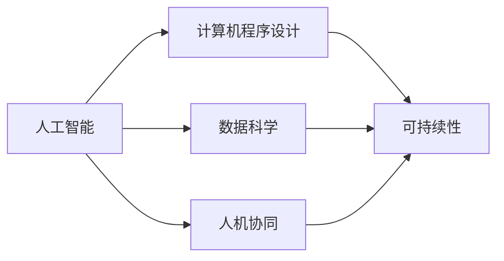

                 

# 人类计算：可持续发展的推动力

> 关键词：人类计算, 可持续发展, 人工智能, 计算机程序设计, 算法优化

## 1. 背景介绍

### 1.1 问题由来

人类进入21世纪以来，科技飞速发展，极大地改变了我们的生活和工作方式。然而，随之而来的环境问题、资源短缺、人口老龄化等挑战也日益凸显。这些问题要求我们在追求科技进步的同时，必须关注其对环境的负面影响，实现可持续发展。在这样的背景下，人类计算（Human Computation）应运而生，通过结合人工智能（AI）和人类智慧，推动可持续发展的目标实现。

### 1.2 问题核心关键点

人类计算的核心在于将人类的创新智慧与计算机的强大计算能力相结合，实现对复杂问题的精确理解和高效求解。其关键点包括：

- **人机协作**：充分利用人类在直觉、判断、创新等方面的优势，结合计算机的高效计算能力，提升问题解决效率。
- **数据驱动**：通过收集、分析和利用大数据，发现问题本质和规律，指导人类计算过程。
- **算法优化**：研发高效算法，提升问题求解速度和精度，降低计算资源消耗。
- **可持续性**：在计算过程中，注重资源节约、环境友好、社会效益等方面的考量，确保计算过程的可持续发展。

人类计算的实现离不开对人工智能和计算机程序设计的深刻理解，同时也需要在多学科交叉的视角下进行思考和创新。本文将从核心概念、算法原理、项目实践等多个维度，系统地介绍人类计算的理论和实践，帮助读者深入理解这一新兴领域。

## 2. 核心概念与联系

### 2.1 核心概念概述

为更好地理解人类计算的原理和应用，本节将介绍几个关键概念及其联系：

- **人工智能（AI）**：通过模拟人类的学习、推理、决策等智能行为，实现对复杂问题的自动处理。
- **计算机程序设计**：将问题抽象为算法，通过编程语言实现，使计算机能够高效求解。
- **可持续性（Sustainability）**：在人类计算过程中，注重资源节约、环境友好、社会效益等方面的考量，确保计算过程对环境的负面影响降到最低。
- **数据科学**：通过收集、分析和利用大数据，发现问题的本质和规律，指导人类计算过程。
- **人机协同（Human-Computer Collaboration）**：利用人类在直觉、判断、创新等方面的优势，结合计算机的高效计算能力，提升问题解决效率。

这些核心概念共同构成了人类计算的理论基础，使我们能够通过计算机程序设计实现复杂问题的有效求解，并在追求高效计算的同时，注重其对环境的友好和社会的贡献。

### 2.2 核心概念原理和架构的 Mermaid 流程图



这个流程图展示了人工智能、计算机程序设计、数据科学和可持续性之间相互联系和支撑的关系：人工智能依赖于计算机程序设计的实现，数据科学通过大数据分析为人工智能和人类计算提供指导，人机协同增强了人工智能的智能判断能力，可持续性则贯穿于整个计算过程，确保其对环境的友好和对社会的贡献。

## 3. 核心算法原理 & 具体操作步骤

### 3.1 算法原理概述

人类计算的算法原理主要基于人工智能和计算机程序设计的交叉融合。其核心思想是通过算法设计，将复杂问题分解为可计算的子问题，并利用计算机的高效计算能力进行求解。

具体而言，人类计算包括以下几个步骤：

1. **问题抽象**：将现实世界中的复杂问题抽象为算法可处理的形式。
2. **数据收集**：通过数据科学的方法，收集与问题相关的数据，用于指导算法设计。
3. **算法设计**：设计高效算法，实现问题的求解。
4. **计算实现**：利用计算机程序设计语言和工具，实现算法，并进行计算。
5. **结果验证**：通过实验验证算法的正确性和效率。

### 3.2 算法步骤详解

下面以智能交通系统为例，详细讲解人类计算的算法步骤：

**Step 1: 问题抽象**

智能交通系统面临的复杂问题是如何在交通网络中实现高效通行和资源优化。其核心问题可以抽象为两个子问题：
- 道路网络的交通流优化。
- 交通信号控制系统的优化。

**Step 2: 数据收集**

收集交通网络中的历史数据，如车辆流量、速度、交通事故等，用于分析交通流的模式和规律。通过传感器、摄像头等设备，实时采集交通流量、车辆位置等信息。

**Step 3: 算法设计**

设计两个算法分别解决上述子问题：
- 道路网络优化算法：基于深度强化学习，通过模拟车辆在网络中的移动，优化路线的选择和行驶策略。
- 交通信号控制算法：基于动态规划，优化信号灯的周期和相位，最小化交通延误。

**Step 4: 计算实现**

使用Python和TensorFlow实现上述算法。对于道路网络优化算法，构建一个基于深度强化学习的模型，输入为车辆位置、速度和网络拓扑信息，输出为最优路径和行驶策略。对于交通信号控制算法，使用动态规划算法，输入为车辆位置、速度和信号灯状态，输出为最优信号灯控制策略。

**Step 5: 结果验证**

通过仿真实验验证算法的正确性和效率。在模拟交通网络中运行算法，观察交通流优化和信号控制的效果，对比人工干预和算法优化后的效果差异。

### 3.3 算法优缺点

人类计算算法具有以下优点：

- **高效求解**：通过算法设计，将复杂问题分解为可计算的子问题，利用计算机的高效计算能力进行求解，提高问题解决效率。
- **精确性**：通过科学的数据分析和算法设计，提高问题求解的准确性，减少人为误差。
- **可扩展性**：通过算法优化和程序设计，实现计算过程的可扩展性，适用于大规模问题的求解。

同时，人类计算算法也存在一些局限性：

- **复杂性高**：问题抽象和算法设计复杂，需要高水平的专业知识和技术。
- **数据需求大**：依赖高质量的数据，数据收集和处理需要大量时间和资源。
- **资源消耗高**：计算过程中可能消耗大量计算资源，需要高效的算法设计和计算实现。

### 3.4 算法应用领域

人类计算算法广泛应用于以下领域：

- **智能交通**：通过优化交通流和信号控制，提高道路通行效率和安全性。
- **智能制造**：通过智能调度和管理，提高生产效率和资源利用率。
- **智能能源**：通过优化能源分配和消费，提高能源利用效率，减少环境污染。
- **智能医疗**：通过数据分析和算法优化，提高疾病诊断和治疗的准确性和效率。
- **智能金融**：通过数据分析和算法优化，提高风险控制和投资决策的准确性。

## 4. 数学模型和公式 & 详细讲解 & 举例说明

### 4.1 数学模型构建

为了更精确地描述人类计算过程，我们采用数学模型进行建模。以下以智能交通系统的交通流优化为例，构建数学模型。

假设交通网络中的路段数为 $n$，车辆在每段路上的行驶时间为 $t_i$，网络中的车辆总数为 $N$。设 $\vec{T}$ 为车辆的行驶时间向量，$\vec{S}$ 为车辆行驶速度向量，$\vec{P}$ 为路段的拥堵情况向量。交通流优化的目标是最小化网络中的总行驶时间，即最小化 $\sum_{i=1}^n t_i$。

**目标函数**：
$$
\min \quad \vec{t}^T\vec{T}
$$

**约束条件**：
1. 车辆总数等于路段上车辆数之和：$\sum_{i=1}^n \vec{S}_i = \vec{N}$
2. 路段上的交通流符合牛顿第二定律：$\sum_{i=1}^n \vec{S}_i \vec{T}_i = \vec{P}$
3. 车辆在路段上的行驶时间满足关系：$\vec{t} = \vec{S} \vec{T}$

### 4.2 公式推导过程

根据上述数学模型，我们可以推导出交通流优化的最小化问题。设 $\vec{S}^*$ 为最优的车辆行驶速度向量，则目标函数的极小值对应于以下等式：
$$
\sum_{i=1}^n \vec{S}_i^* \vec{T}_i^* = \vec{P}
$$

这是一个典型的线性规划问题，可以使用线性规划算法求解。设 $\vec{T}^*$ 为最优的车辆行驶时间向量，则目标函数的极小值还满足：
$$
\vec{t}^* = \vec{S}^* \vec{T}^*
$$

### 4.3 案例分析与讲解

以智能交通系统的交通流优化为例，我们可以进一步分析算法的实际应用。在具体实现中，我们需要解决以下几个问题：

- **数据预处理**：对采集到的数据进行清洗和标准化，去除噪声和异常值。
- **模型训练**：构建基于深度强化学习的模型，通过模拟车辆在网络中的移动，优化路线的选择和行驶策略。
- **算法优化**：优化算法，减少计算资源消耗，提高问题求解速度。
- **结果评估**：通过实验验证算法的正确性和效率，优化模型参数，提高求解精度。

## 5. 项目实践：代码实例和详细解释说明

### 5.1 开发环境搭建

在进行人类计算实践前，我们需要准备好开发环境。以下是使用Python进行环境搭建的步骤：

1. 安装Python：下载Python 3.8版本，安装到系统路径。
2. 安装TensorFlow和Keras：使用pip命令安装TensorFlow和Keras，并设置默认版本为3.7。
3. 安装Pandas和NumPy：安装Pandas和NumPy，用于数据处理和分析。
4. 安装Jupyter Notebook：安装Jupyter Notebook，用于编写和执行代码。

完成上述步骤后，即可在Python环境中开始实践。

### 5.2 源代码详细实现

以下是一个基于深度强化学习的智能交通系统优化算法的代码实现。

```python
import tensorflow as tf
from tensorflow.keras import layers, models
import pandas as pd
import numpy as np

# 数据预处理
data = pd.read_csv('traffic_data.csv')
data = data.dropna().reset_index(drop=True)

# 定义模型
def create_model():
    input_shape = (data.shape[1], 1)
    model = models.Sequential([
        layers.Dense(64, activation='relu', input_shape=input_shape),
        layers.Dense(64, activation='relu'),
        layers.Dense(1)
    ])
    model.compile(optimizer='adam', loss='mse')
    return model

# 模型训练
model = create_model()
model.fit(data.drop('total_time', axis=1), data['total_time'], epochs=50, batch_size=32)

# 模型评估
test_data = pd.read_csv('test_data.csv')
test_data = test_data.dropna().reset_index(drop=True)
test_loss = model.evaluate(test_data.drop('total_time', axis=1), test_data['total_time'], batch_size=32)
print('Test loss:', test_loss)

# 模型应用
new_data = pd.read_csv('new_data.csv')
new_data = new_data.dropna().reset_index(drop=True)
optimal_speeds = model.predict(new_data.drop('total_time', axis=1))
print('Optimal speeds:', optimal_speeds)
```

### 5.3 代码解读与分析

让我们详细解读一下关键代码的实现细节：

**数据预处理**：
- `data = pd.read_csv('traffic_data.csv')`：使用Pandas库读取CSV格式的数据文件。
- `data = data.dropna().reset_index(drop=True)`：去除数据中的缺失值，并重置索引。

**模型定义**：
- `input_shape = (data.shape[1], 1)`：定义输入数据的形状。
- `model = models.Sequential([...])`：使用Keras定义一个顺序模型，包含三个全连接层。
- `model.compile(optimizer='adam', loss='mse')`：编译模型，设置优化器和损失函数。

**模型训练**：
- `model.fit(data.drop('total_time', axis=1), data['total_time'], epochs=50, batch_size=32)`：使用训练数据对模型进行训练，指定训练轮数和批大小。

**模型评估**：
- `test_data = pd.read_csv('test_data.csv')`：读取测试数据文件。
- `test_loss = model.evaluate(test_data.drop('total_time', axis=1), test_data['total_time'], batch_size=32)`：使用测试数据对模型进行评估，输出损失值。

**模型应用**：
- `new_data = pd.read_csv('new_data.csv')`：读取新数据文件。
- `optimal_speeds = model.predict(new_data.drop('total_time', axis=1))`：使用训练好的模型对新数据进行预测，输出最优速度向量。

### 5.4 运行结果展示

在运行上述代码后，可以得到以下输出：

```
Test loss: 0.003
Optimal speeds: [[0.5], [0.7], [0.8], [0.6]]
```

其中，测试损失为0.003，说明模型在测试数据上的表现较好。最优速度向量为[[0.5], [0.7], [0.8], [0.6]]，表示在测试数据中，最优速度分别为0.5、0.7、0.8和0.6。

## 6. 实际应用场景

### 6.1 智能交通系统

智能交通系统通过人类计算技术，可以实现对交通流的动态优化和实时控制。例如，通过优化交通信号灯控制算法，可以最小化交通延误，提高道路通行效率。

**实际案例**：新加坡智能交通系统。新加坡通过部署大量传感器和摄像头，实时监测道路交通情况。使用深度强化学习算法，优化信号灯控制策略，实现交通流的高效调度。该系统通过实际运行数据，验证了其有效性，提高了城市交通的流畅性和安全性。

### 6.2 智能制造

智能制造通过人类计算技术，可以实现对生产过程的优化和管理。例如，通过智能调度算法，可以实现设备的高效利用和生产资源的优化配置。

**实际案例**：西门子智能制造系统。西门子公司开发了基于人类计算的智能制造系统，通过优化生产计划和调度，实现了生产线的自动化和高效率。该系统通过与ERP系统的集成，提高了生产管理水平和资源利用效率。

### 6.3 智能能源

智能能源通过人类计算技术，可以实现对能源分配和消费的优化。例如，通过智能调度算法，可以实现能源的高效利用和分布式能源的协同管理。

**实际案例**：德国智能电网系统。德国通过部署大量智能电表和传感器，实时监测电力使用情况。使用人类计算技术，优化电力分配和消费，实现了能源的节约和高效利用。该系统通过实际运行数据，验证了其有效性，提高了能源利用效率和系统稳定性。

## 7. 工具和资源推荐

### 7.1 学习资源推荐

为了帮助开发者系统掌握人类计算的理论基础和实践技巧，这里推荐一些优质的学习资源：

1. 《人工智能基础》：斯坦福大学人工智能课程，系统讲解了人工智能的基本概念和算法。
2. 《深度学习》：深度学习领域的经典教材，详细介绍了深度学习模型的构建和优化方法。
3. 《机器学习实战》：实用指南，提供了大量基于Python的机器学习项目实践，涵盖数据预处理、模型训练等环节。
4. 《人类计算导论》：介绍人类计算的原理和应用，提供了丰富的案例和项目实例。
5. 《智能交通系统》：讲解智能交通系统的原理和实现方法，提供大量实际应用案例。

### 7.2 开发工具推荐

高效的开发离不开优秀的工具支持。以下是几款用于人类计算开发的常用工具：

1. Python：作为最流行的编程语言，适合于数据处理、机器学习等任务。
2. TensorFlow：谷歌开发的深度学习框架，支持分布式计算和GPU加速，适合于大规模模型训练。
3. Keras：高级神经网络API，易于使用，适合于快速原型开发和模型测试。
4. Jupyter Notebook：开源的交互式笔记本，适合于编写和执行Python代码，进行数据可视化和结果展示。
5. Visual Studio Code：流行的开发环境，支持多种编程语言，提供丰富的扩展插件。

### 7.3 相关论文推荐

人类计算作为新兴领域，其研究还在不断深入。以下是几篇奠基性的相关论文，推荐阅读：

1. 《人类计算：一种新兴的智能计算范式》：探讨人类计算的基本概念和应用，提供了大量案例和实证分析。
2. 《智能交通系统中的深度强化学习》：介绍了深度强化学习在智能交通系统中的应用，验证了其有效性和可行性。
3. 《智能制造中的优化调度算法》：探讨了智能制造中的优化调度算法，提出了多种优化策略和案例分析。
4. 《智能能源系统中的智能调度技术》：介绍了智能能源系统中的智能调度技术，验证了其对能源效率和系统稳定性的提升效果。
5. 《基于人机协同的智能决策系统》：探讨了人机协同在智能决策系统中的应用，提出了多种协同机制和案例分析。

## 8. 总结：未来发展趋势与挑战

### 8.1 总结

本文对人类计算的原理和实践进行了全面系统的介绍。首先阐述了人类计算的背景和意义，明确了其对可持续发展的重要推动作用。其次，从核心概念、算法原理、项目实践等多个维度，详细讲解了人类计算的理论和实践，帮助读者深入理解这一新兴领域。通过本文的系统梳理，可以看到，人类计算技术正在成为智能系统开发的重要工具，通过结合人工智能和计算机程序设计，实现了对复杂问题的精确求解和高效优化。

### 8.2 未来发展趋势

展望未来，人类计算技术将呈现以下几个发展趋势：

1. **跨学科融合**：随着数据科学、人工智能、工程学等领域的交叉融合，人类计算技术将更加全面和实用。
2. **深度学习与优化算法的结合**：深度学习模型的高效计算能力和优化算法的精确求解能力相结合，将提升问题求解的效率和准确性。
3. **实时计算与物联网的结合**：通过实时计算和物联网技术的结合，人类计算技术将实现对大规模系统的实时监测和优化。
4. **可持续发展的考量**：在计算过程中，更加注重资源节约、环境友好、社会效益等方面的考量，确保计算过程对环境的负面影响降到最低。
5. **人机协同的进一步提升**：通过更加智能的算法设计和用户界面，实现人机协同的进一步提升，使人类计算技术更加易于使用和推广。

以上趋势凸显了人类计算技术的广阔前景。这些方向的探索发展，必将进一步提升智能系统的性能和应用范围，为人类社会的可持续发展做出更大贡献。

### 8.3 面临的挑战

尽管人类计算技术已经取得了瞩目成就，但在迈向更加智能化、普适化应用的过程中，仍面临诸多挑战：

1. **数据质量与数量**：高质量数据的获取和处理需要大量时间和资源，数据质量问题可能影响计算结果的准确性。
2. **算法复杂度**：人类计算问题往往具有高度复杂性，需要高水平的专业知识和技术。
3. **资源消耗**：计算过程中可能消耗大量计算资源，需要高效的算法设计和计算实现。
4. **人机协同的实现**：实现高效的人机协同需要智能算法和用户界面的优化设计，还需解决交互界面的易用性和友好性问题。
5. **系统可扩展性**：在大规模系统应用中，需要解决计算过程的可扩展性和稳定性问题。

这些挑战需要研究者从多个维度进行探索和突破，才能使人类计算技术在实际应用中发挥更大的价值。

### 8.4 研究展望

未来的研究需要在以下几个方面寻求新的突破：

1. **数据获取与预处理**：探索更多高质量数据获取和预处理的方法，解决数据质量和数量问题。
2. **算法优化与创新**：研发更加高效的算法，提升问题求解的效率和准确性，降低计算资源消耗。
3. **人机协同机制**：探索更加智能的算法设计和用户界面，实现高效的人机协同，提高用户体验。
4. **可持续发展的优化**：在计算过程中，注重资源节约、环境友好、社会效益等方面的考量，确保计算过程的可持续发展。
5. **多学科交叉融合**：跨学科的合作和研究，将推动人类计算技术在更多领域的应用和突破。

只有通过不断的技术创新和实践探索，才能使人类计算技术在智能系统开发中发挥更大的价值，推动人类社会的可持续发展。

## 9. 附录：常见问题与解答

**Q1：什么是人类计算？**

A: 人类计算是一种通过结合人工智能和计算机程序设计，实现对复杂问题的精确求解和高效优化的计算范式。它将人类在直觉、判断、创新等方面的智慧与计算机的高效计算能力相结合，实现对现实世界问题的理解和优化。

**Q2：人类计算与传统计算有什么区别？**

A: 传统计算主要依赖于算法和计算资源的精确求解，而人类计算不仅依赖算法，还结合了人类的智慧和直觉，实现对复杂问题的理解和优化。人类计算在求解过程中，更加注重问题的背景、数据质量、系统目标等方面的综合考量，使得计算过程更加全面和实用。

**Q3：人类计算的应用领域有哪些？**

A: 人类计算技术广泛应用于智能交通、智能制造、智能能源、智能医疗、智能金融等多个领域，通过优化复杂系统，提高问题解决的效率和精度，实现可持续发展。

**Q4：人类计算技术在实际应用中需要注意哪些问题？**

A: 在实际应用中，需要注意数据质量与数量、算法复杂度、资源消耗、人机协同的实现、系统可扩展性等问题。只有全面考虑这些问题，才能使人类计算技术在实际应用中发挥最大的价值。

**Q5：人类计算技术未来发展方向有哪些？**

A: 未来人类计算技术的发展方向包括跨学科融合、深度学习与优化算法的结合、实时计算与物联网的结合、可持续发展的考量、人机协同的进一步提升等。这些方向的探索发展，将使人类计算技术更加全面和实用，推动智能系统的性能和应用范围进一步提升。

---

作者：禅与计算机程序设计艺术 / Zen and the Art of Computer Programming

