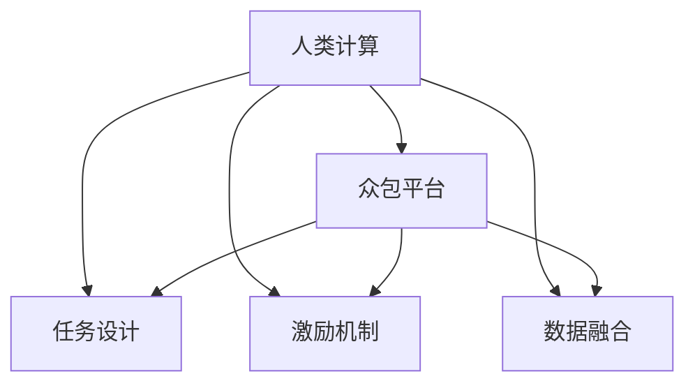

                 

## 1. 背景介绍

在当今数字化信息时代，人类计算正日益成为驱动经济社会发展的重要引擎。大数据、云计算、人工智能等技术迅猛发展，极大地提升了信息处理和知识获取的效率，推动了科学发现、决策支持、业务优化等领域的革新。然而，随着计算任务复杂度的不断提升，单纯依赖机械的机器算法已难以满足社会对智能、高效计算的需求。

### 1.1 问题由来
人类计算（Human Computation）是指利用人类的智慧和劳动，通过设计合理、高效的任务，充分发挥人的智能和创造力，以辅助机器算法的计算过程，提升计算结果的精确性和可靠性。这一概念最早由MIT媒体实验室（MIT Media Lab）提出，旨在解决机器计算的局限性，融合人机协作的力量，构建更加智能、灵活的计算系统。

人类计算在科学研究和商业应用中已展现巨大潜力。例如，通过人类计算，可以高效识别图像、处理文本、优化算法等，极大地加速了技术创新和商业模式的演进。在疫情监测、气候模拟、金融风险评估等领域，人类计算的精准度和可靠性尤为突出，正成为解决复杂计算问题的关键工具。

### 1.2 问题核心关键点
人类计算的核心在于将人机优势有效结合，充分释放人类智慧与创造力的同时，避免机器算法的局限性。其核心要素包括：

- **任务设计**：根据计算任务的特点，合理设计人类任务，使其与机器算法形成互补。
- **众包平台**：搭建便捷、高效的平台，吸引和组织大量参与者进行任务完成。
- **激励机制**：设计科学的激励方案，鼓励参与者持续贡献智慧和劳动。
- **数据融合**：将人类计算结果与机器算法输出进行有效整合，提升计算结果的准确性和多样性。

## 2. 核心概念与联系

### 2.1 核心概念概述

为了更好地理解人类计算的工作原理，本节将介绍几个密切相关的核心概念：

- **人类计算**：指利用人类智慧和劳动，辅助机器算法完成复杂计算任务的过程。与传统机器计算相比，人类计算更注重任务的智能化和灵活性。
- **众包平台**：用于组织和管理大量人群参与任务完成的软件平台，如Amazon Mechanical Turk、CrowdFlower等。通过平台，可以高效聚集全球的人才资源。
- **任务设计**：根据计算任务的特点，合理设计任务形式，使其便于人类理解和完成。任务设计是实现高效人类计算的前提。
- **激励机制**：通过奖励和激励措施，调动参与者的积极性和创造力，提升任务完成质量。激励机制的设计对任务完成的效率和效果有重要影响。
- **数据融合**：将人类计算结果与机器算法输出进行整合，形成更加全面、准确的计算结果。数据融合是实现人机协作的关键环节。

这些核心概念之间的逻辑关系可以通过以下Mermaid流程图来展示：



这个流程图展示了大语言模型的核心概念及其之间的关系：

1. 人类计算通过众包平台组织人群，设计并完成具体的计算任务。
2. 任务设计决定了任务完成的质量和效率。
3. 激励机制调动了参与者的积极性。
4. 数据融合实现了人机协作，提升了计算结果的准确性。

## 3. 核心算法原理 & 具体操作步骤
### 3.1 算法原理概述

人类计算的本质是利用人类的智慧和劳动，辅助机器算法进行复杂计算任务。其核心思想是：将计算任务分解为可手工完成的小任务，由大量人群通过众包平台完成，然后将结果汇总并进行融合，得到最终计算结果。

形式化地，假设一个复杂计算任务 $T$ 需要由若干子任务 $T_i$ 构成，每个子任务 $T_i$ 可以由一个人手工完成，得到结果 $R_i$。则整个人类计算的过程可以描述为：

$$
R = \sum_{i} R_i
$$

其中 $R$ 为最终计算结果，$R_i$ 为子任务 $T_i$ 的计算结果。通过这种方式，可以有效利用人类计算资源，提升计算效率和结果精度。

### 3.2 算法步骤详解

人类计算的实现步骤主要包括：

**Step 1: 任务分解与设计**
- 将复杂计算任务 $T$ 分解为若干子任务 $T_i$。
- 设计每个子任务 $T_i$ 的形式，确保易于理解和完成。
- 确定子任务所需的输入和输出格式，确保数据流动的顺畅。

**Step 2: 平台搭建与发布**
- 搭建一个便捷、高效的众包平台，吸引和组织大量人群。
- 在平台上发布子任务 $T_i$，包含任务描述、输入格式、输出格式等关键信息。
- 设置任务完成时间和报酬，以吸引参与者积极参与。

**Step 3: 任务执行与反馈**
- 参与者根据任务描述，完成子任务 $T_i$，并提交结果 $R_i$。
- 平台对每个结果 $R_i$ 进行初步审核，筛选出高质量的结果。
- 对结果 $R_i$ 进行汇总，并进行数据融合。

**Step 4: 结果验证与发布**
- 将融合后的结果 $R$ 进行验证，确保其准确性和可靠性。
- 发布最终计算结果 $R$，供用户或后续算法使用。

### 3.3 算法优缺点

人类计算具有以下优点：

1. **灵活性高**：人类计算可以处理各种复杂的计算任务，尤其是在数据标注、图像识别等领域，机器算法难以达到人类水平。
2. **成本低**：通过众包平台，可以高效利用全球人才资源，降低计算成本。
3. **多样性丰富**：人类计算能够引入多种视角和思路，提升结果的多样性和可靠性。

同时，该方法也存在一定的局限性：

1. **任务设计复杂**：不同任务之间存在差异，设计合理、高效的任务形式需要大量的时间和经验。
2. **参与者多样性**：参与者的背景和技能水平不同，可能导致任务完成质量的参差不齐。
3. **激励机制设计困难**：激励机制的设计需要考虑多方面因素，确保参与者持续贡献。
4. **数据隐私和安全**：处理敏感数据时，需要严格保护参与者的隐私和数据安全。

尽管存在这些局限性，但就目前而言，人类计算已成为解决复杂计算问题的重要手段。未来相关研究的重点在于如何进一步降低任务设计的复杂度，提升任务完成的自动化程度，同时兼顾数据隐私和安全等因素。

### 3.4 算法应用领域

人类计算在多个领域已经得到了广泛的应用，涵盖了科学计算、商业智能、社会服务等多个方向，例如：

- **科学计算**：在气候模拟、生物信息学、天文学等领域，利用人类计算加速数据标注、实验设计等任务。
- **商业智能**：在客户关系管理、市场分析、产品设计等领域，利用人类计算优化决策过程，提升商业洞察。
- **社会服务**：在灾害预警、公共安全、健康监测等领域，利用人类计算加速信息收集和处理，提升服务效率。
- **艺术创作**：在音乐、绘画、电影制作等领域，利用人类计算探索新的创作思路，丰富艺术表现形式。
- **教育培训**：在在线教育、语言学习、技能培训等领域，利用人类计算提供个性化辅导，提升教育质量。

除了上述这些经典领域外，人类计算也被创新性地应用到更多场景中，如动态系统仿真、动态语言翻译、智能投顾等，为各行业带来了新的增长点。

## 4. 数学模型和公式 & 详细讲解  
### 4.1 数学模型构建

本节将使用数学语言对人类计算的原理进行更加严格的刻画。

假设一个复杂计算任务 $T$ 需要由若干子任务 $T_i$ 构成，每个子任务 $T_i$ 可以由一个人手工完成，得到结果 $R_i$。则整个人类计算的过程可以描述为：

$$
R = \sum_{i} R_i
$$

其中 $R$ 为最终计算结果，$R_i$ 为子任务 $T_i$ 的计算结果。

### 4.2 公式推导过程

在推导人类计算的公式过程中，主要涉及统计学和概率论的相关知识。假设每个子任务 $T_i$ 的结果 $R_i$ 服从独立同分布的概率分布 $p(R_i)$，则最终结果 $R$ 的分布 $p(R)$ 可以通过子任务的结果进行积分得到：

$$
p(R) = \prod_{i} p(R_i)
$$

由于 $R$ 是通过 $N$ 个独立子任务的结果 $R_1, R_2, ..., R_N$ 进行求和得到，因此 $R$ 的概率分布可以表示为：

$$
p(R) = \int_{-\infty}^{\infty} \prod_{i} p(R_i) dr_i
$$

其中 $r_i = R_i - \bar{R}$，$\bar{R}$ 为子任务 $T_i$ 的平均结果。

通过以上推导，可以看出，人类计算的过程可以视为对独立同分布的随机变量求和的分布积分过程。这种数学模型有助于我们更好地理解人类计算的统计性质。

### 4.3 案例分析与讲解

假设我们有一个复杂的图像识别任务，需要识别图像中的多个物体。我们可以将任务分解为多个子任务，每个子任务独立识别一个物体，最终将多个结果进行合并。具体步骤如下：

1. **任务分解**：将图像中的每个物体识别任务分解为多个子任务，如分别识别汽车、人、树等。
2. **任务设计**：设计每个子任务的形式，如通过固定框、半框、标框等方式进行标注。
3. **平台搭建**：搭建一个便捷的众包平台，吸引和组织大量标注员参与任务完成。
4. **任务执行**：标注员根据任务描述，完成子任务，并提交标注结果。
5. **结果汇总与融合**：对每个标注结果进行汇总，并进行数据融合，得到最终识别结果。

在实际应用中，我们可以利用人类计算技术，通过众包平台高效完成图像识别、文本标注等复杂任务，提升机器算法的准确性和可靠性。

## 5. 项目实践：代码实例和详细解释说明
### 5.1 开发环境搭建

在进行人类计算实践前，我们需要准备好开发环境。以下是使用Python进行Amazon Mechanical Turk开发的环境配置流程：

1. 安装Boto3：
```bash
pip install boto3
```

2. 创建Amazon S3存储桶：
```bash
aws s3 mb s3://your-bucket-name
```

3. 在Amazon Mechanical Turk上创建任务：
```bash
aws mturk create-hit --job-name 'your-job-name' --qualification-id 'your-qualification-id'
```

4. 通过Boto3上传任务数据到Amazon S3：
```python
import boto3

s3 = boto3.client('s3')
s3.upload_file('data.txt', 'your-bucket-name', 'data.txt')
```

完成上述步骤后，即可在AWS平台上进行人类计算任务的开发和部署。

### 5.2 源代码详细实现

下面以图像标注任务为例，给出使用Amazon Mechanical Turk进行人类计算的Python代码实现。

```python
import boto3
import xml.etree.ElementTree as ET

# 创建Amazon Mechanical Turk客户端
mturk = boto3.client('mturk')

# 创建任务
job_name = 'your-job-name'
qualification_id = 'your-qualification-id'
xml_file = 'data.xml'
bucket_name = 'your-bucket-name'

# 创建XML文件，描述任务
root = ET.Element('HIT')
worker_name = 'WorkerName'
assignment_id = 'AssignmentId'
job_id = 'JobId'
job_type = 'one'
assignment_duration = 120  # 单位：秒

# 添加任务描述
description = '描述你的任务'
root.append(ET.SubElement(root, 'Item', {'ID': 'item_1'}))
root['item_1'] = ET.SubElement(root['item_1'], 'Title', {'ID': 'title'})
root['item_1']['title'].text = description

# 添加输入输出格式
input_format = '图像标注：请用红色框标注目标物体。最大标记数目为20。'
output_format = '图像标注结果，格式为：<物体名称>,<坐标1>,<坐标2>,...'
input_format_tag = 'Instruction'
output_format_tag = 'Response'
input_data_tag = 'Data'
output_data_tag = 'Result'
root.append(ET.SubElement(root, input_format_tag, {'ID': 'input_format'}))
root['input_format'].text = input_format
root.append(ET.SubElement(root, output_format_tag, {'ID': 'output_format'}))
root['output_format'].text = output_format

# 创建任务模板
template = ET.tostring(root)

# 创建任务请求
response = mturk.create_human_integer_attributes(
    JobName=job_name,
    QualificationId=qualification_id,
    JobType=job_type,
    MaxPay=2.0,
    AssignmentDuration=assignment_duration,
    HITTemplate={
        'HITLayout': template
    },
)

# 获取任务ID
job_id = response['JobId']
print(f'任务创建成功，任务ID为：{job_id}')

# 上传任务数据到Amazon S3
s3 = boto3.client('s3')
s3.upload_file(xml_file, bucket_name, xml_file)
```

### 5.3 代码解读与分析

让我们再详细解读一下关键代码的实现细节：

- **Amazon Mechanical Turk客户端创建**：通过Boto3创建Amazon Mechanical Turk客户端，用于发送API请求。
- **任务创建**：使用`create-hit`方法创建任务，指定任务名称、合格ID、数据XML文件、存储桶等关键信息。
- **任务描述和输入输出格式设计**：在XML文件中定义任务描述和输入输出格式，确保标注员能清楚理解任务要求。
- **任务模板生成**：将XML文件转换为字符串，并设置任务模板。
- **任务请求发送**：使用`create-human_integer_attributes`方法发送任务请求，生成任务ID。
- **数据上传**：将任务数据上传至Amazon S3存储桶，确保标注员能正常获取任务数据。

完成上述步骤后，即可在Amazon Mechanical Turk平台上进行图像标注任务的执行和结果汇总。

## 6. 实际应用场景
### 6.1 智能医疗诊断

人类计算在智能医疗诊断领域具有重要应用价值。通过利用众包平台，可以快速收集大量医疗影像和病历数据，进行标注和分析，辅助医生进行诊断。

具体而言，可以利用人类计算技术，对医疗影像中的肿瘤、病变等进行标注，生成标注结果，然后结合机器学习算法进行分析，提升诊断的准确性和效率。在实际应用中，可以通过将标注结果上传至医疗平台，实现多轮反馈和优化，逐步提升诊断的精度。

### 6.2 社会舆情分析

社会舆情分析是了解公众情绪和舆论动向的重要工具。利用人类计算技术，可以快速收集和分析大规模的社交媒体数据，识别舆情热点和趋势。

在具体实践中，可以设计多种标注任务，如情感分类、事件挖掘等，通过众包平台组织标注员完成标注工作。然后，利用机器学习算法进行数据融合和分析，生成舆情报告，为政府和企业决策提供支持。

### 6.3 人工智能教育

人工智能教育正在逐渐成为教育技术发展的重要方向。通过人类计算技术，可以高效完成大规模的教育数据标注和分析，提升教育质量。

具体而言，可以利用众包平台，对学生的作业、论文等进行批改和评价，生成详细的反馈意见，帮助学生改进学习方法和策略。同时，可以通过对学生的学习数据进行标注和分析，发现学习中的问题和难点，制定个性化的教育方案。

### 6.4 未来应用展望

随着人类计算技术的不断发展，其应用前景将更加广阔。未来，人类计算将渗透到更多领域，为社会各行业带来新的机遇和挑战。

在智能制造、智慧城市、智能交通等领域，人类计算技术将发挥重要作用，推动技术创新和产业升级。同时，在应对气候变化、解决全球性问题等重大课题上，人类计算将发挥不可替代的作用，推动科学发现和社会进步。

## 7. 工具和资源推荐
### 7.1 学习资源推荐

为了帮助开发者系统掌握人类计算的理论基础和实践技巧，这里推荐一些优质的学习资源：

1. **《人类计算：从众包到智慧城市》**：该书系统介绍了人类计算的理论基础和应用案例，深入浅出地讲解了人类计算的原理和实践技巧。
2. **MIT Media Lab关于人类计算的研究报告**：MIT Media Lab在人类计算领域进行了大量前沿研究，其报告和论文是学习和研究的重要资源。
3. **Coursera和edX上的相关课程**：这些在线教育平台提供了多门关于人类计算和众包技术的高质量课程，帮助开发者全面掌握相关知识。

通过这些资源的学习实践，相信你一定能够快速掌握人类计算的精髓，并用于解决实际的计算问题。

### 7.2 开发工具推荐

高效的开发离不开优秀的工具支持。以下是几款用于人类计算开发的常用工具：

1. **Amazon Mechanical Turk**：作为全球最大的众包平台，Amazon Mechanical Turk提供了便捷的任务发布和执行功能，适合处理大规模标注任务。
2. **Google Cloud Tasks**：谷歌提供的任务调度平台，支持自动化任务发布和管理，适合需要定期执行的任务。
3. **Airtable**：一款强大的项目管理工具，支持多用户协作，适合设计和发布复杂的任务。
4. **Pandoc**：文本转换工具，可以将多种格式的文本进行互相转换，方便数据的格式统一和处理。
5. **Jupyter Notebook**：开源的交互式笔记本，支持Python、R等多种编程语言，适合进行数据处理和分析。

合理利用这些工具，可以显著提升人类计算任务的开发效率，加快创新迭代的步伐。

### 7.3 相关论文推荐

人类计算技术的发展源于学界的持续研究。以下是几篇奠基性的相关论文，推荐阅读：

1. **"Human Computation: Leveraging Massive Online Task Solving for Large Scale Computational Challenges"**：该论文提出了人类计算的概念和框架，探讨了人类计算在科学计算、商业智能等领域的应用。
2. **"Human Computation and Crowdsourcing"**：由MIT Media Lab发表的综述论文，总结了人类计算和众包技术的研究进展和应用案例。
3. **"Human Computation and Crowdsourcing for Scientific Data Management"**：该论文探讨了人类计算在科学数据管理中的应用，提出了多种数据标注和分析方法。
4. **"Human Computer Interaction in Support of Crowdsourcing"**：该论文讨论了人类计算和众包技术中的人机交互问题，提出了多轮反馈和优化机制。

这些论文代表了大语言模型微调技术的发展脉络。通过学习这些前沿成果，可以帮助研究者把握学科前进方向，激发更多的创新灵感。

## 8. 总结：未来发展趋势与挑战

### 8.1 总结

本文对人类计算技术进行了全面系统的介绍。首先阐述了人类计算的研究背景和意义，明确了人类计算在提升计算效率、优化决策支持等方面的独特价值。其次，从原理到实践，详细讲解了人类计算的数学模型和操作步骤，给出了人类计算任务开发的完整代码实例。同时，本文还广泛探讨了人类计算技术在智能医疗、社会舆情、教育培训等多个行业领域的应用前景，展示了人类计算技术的巨大潜力。此外，本文精选了人类计算技术的各类学习资源，力求为读者提供全方位的技术指引。

通过本文的系统梳理，可以看到，人类计算技术正在成为解决复杂计算问题的重要手段，极大地拓展了计算资源的边界，推动了人工智能技术的发展。未来，伴随人类计算技术的进一步演进，相信人工智能技术将更加智能化、高效化，为社会各行业带来新的突破和机遇。

### 8.2 未来发展趋势

展望未来，人类计算技术将呈现以下几个发展趋势：

1. **智能化水平提升**：随着机器学习算法的发展，人类计算任务将更加智能化，可以处理更加复杂和多样化的计算任务。
2. **自动化程度提高**：人类计算任务的设计和执行将更加自动化，通过算法优化和模型训练，提高任务完成的效率和质量。
3. **多模态数据融合**：人类计算将支持多模态数据的融合，结合文本、图像、视频等数据，提升计算结果的全面性和可靠性。
4. **数据隐私保护**：随着数据隐私意识的提高，人类计算将更加注重数据隐私保护，确保参与者的数据安全。
5. **全球协作增强**：通过众包平台，可以更好地组织全球人才资源，提升任务的完成速度和质量。
6. **跨领域应用扩展**：人类计算将应用于更多领域，推动科学发现、商业创新和社会进步。

以上趋势凸显了人类计算技术的广阔前景。这些方向的探索发展，必将进一步提升计算任务的效率和质量，推动人类计算技术的广泛应用。

### 8.3 面临的挑战

尽管人类计算技术已经取得了瞩目成就，但在迈向更加智能化、高效化应用的过程中，它仍面临着诸多挑战：

1. **任务设计复杂性**：设计合理、高效的人类计算任务需要大量的时间和经验，不同任务之间存在差异，设计复杂。
2. **参与者多样性**：参与者的背景和技能水平不同，可能导致任务完成质量的参差不齐。
3. **激励机制设计困难**：激励机制的设计需要考虑多方面因素，确保参与者持续贡献。
4. **数据隐私和安全**：处理敏感数据时，需要严格保护参与者的隐私和数据安全。
5. **任务完成效率**：任务完成效率受多种因素影响，如何提高任务完成的自动化程度，仍然是一个挑战。

尽管存在这些挑战，但人类计算技术的发展潜力巨大，相信通过持续的研究和优化，这些挑战终将一一被克服，人类计算技术必将在各个领域发挥更大的作用。

### 8.4 研究展望

面向未来，人类计算技术需要在以下几个方面进行深入研究和探索：

1. **任务自动化设计**：开发更加自动化、智能化的任务设计工具，减少任务设计的时间和成本。
2. **任务完成优化**：通过算法优化和模型训练，提高任务完成的效率和质量，提升任务的自动化程度。
3. **多模态数据融合**：结合文本、图像、视频等多模态数据，提升计算结果的全面性和可靠性。
4. **数据隐私保护**：在处理敏感数据时，探索更加安全和高效的数据隐私保护机制。
5. **全球协作增强**：通过众包平台，更好地组织全球人才资源，提升任务的完成速度和质量。
6. **跨领域应用扩展**：将人类计算技术应用于更多领域，推动科学发现、商业创新和社会进步。

这些研究方向将推动人类计算技术的不断演进，为人机协同计算提供新的动力，推动人工智能技术的广泛应用和发展。总之，人类计算技术需要在数据、算法、工程、社会等多个维度协同发力，才能真正实现其价值。

## 9. 附录：常见问题与解答

**Q1：人类计算是否适用于所有计算任务？**

A: 人类计算适用于各种复杂的计算任务，尤其是在数据标注、图像识别等领域，机器算法难以达到人类水平。但对于一些简单、重复的任务，采用机器算法可能更为高效。

**Q2：如何选择合适的人类计算任务？**

A: 选择合适的人类计算任务需要考虑多方面因素，如任务的复杂度、任务完成的难度、任务完成的质量要求等。通常，简单、重复的任务适合采用机器算法，复杂、多样化的任务适合采用人类计算。

**Q3：如何确保人类计算任务的质量？**

A: 确保人类计算任务的质量需要设计合理的激励机制和审核流程。可以通过设置任务完成时间、报酬等激励机制，鼓励参与者积极完成任务。同时，对每个结果进行初步审核，筛选出高质量的结果，并进行数据融合，确保最终结果的准确性和可靠性。

**Q4：人类计算在落地部署时需要注意哪些问题？**

A: 人类计算在落地部署时需要注意以下问题：

1. 任务设计和平台搭建：设计合理、高效的任务形式，搭建便捷、高效的众包平台，吸引和组织大量人群。
2. 激励机制设计：设计科学的激励方案，鼓励参与者持续贡献。
3. 数据隐私和安全：在处理敏感数据时，严格保护参与者的隐私和数据安全。
4. 任务完成效率：提高任务完成的自动化程度，减少任务完成的复杂性和难度。

通过合理设计任务和平台，可以有效提高人类计算任务的完成质量和效率。

**Q5：人类计算的未来发展方向是什么？**

A: 人类计算的未来发展方向包括智能化水平提升、自动化程度提高、多模态数据融合、数据隐私保护、全球协作增强和跨领域应用扩展。通过这些方向的探索和发展，人类计算技术将进一步拓展计算资源边界，推动人工智能技术的广泛应用和创新。

通过合理设计任务和平台，可以有效提高人类计算任务的完成质量和效率。

---

作者：禅与计算机程序设计艺术 / Zen and the Art of Computer Programming

