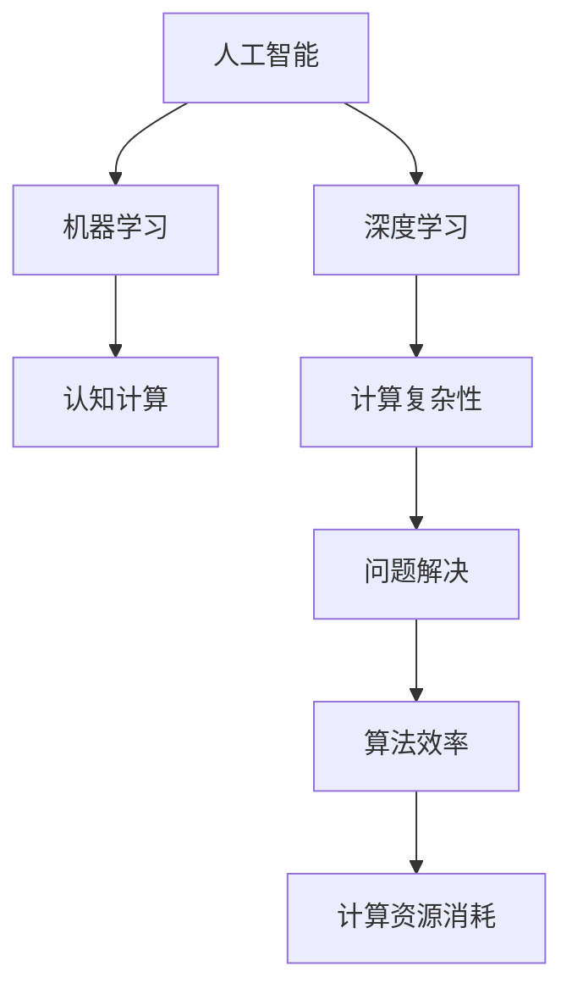

                 

# 人类计算：塑造数字时代的未来

> 关键词：人类计算, 数字时代, 人工智能, 计算复杂性, 机器学习, 深度学习, 认知计算

## 1. 背景介绍

### 1.1 问题由来

在数字时代，计算已逐渐从传统的机械式计算转向智能式计算。人工智能（AI）技术的发展，尤其是深度学习和机器学习的兴起，使得“人类计算”的概念变得尤为重要。人类计算（Human Computation）指的是将人类智慧与计算机处理能力相结合，以实现更高效、更智能的计算方式。它不仅涉及技术层面，还涉及到文化、教育、伦理等多方面的问题。

人工智能技术在各个领域的广泛应用，如自动驾驶、医疗诊断、金融分析等，已经深刻改变了人类社会的运作模式。然而，这些技术的进步离不开人类的智慧和决策。人工智能本质上是一种工具，其效能和方向往往由人类主导。因此，如何有效结合人类智慧和机器能力，不仅是一个技术问题，也是当今社会亟需解决的重大挑战。

### 1.2 问题核心关键点

在讨论人类计算的背景时，我们需要明确以下几个关键点：

1. **计算复杂性**：计算机在处理一些特定类型的问题时，会面临计算复杂性高、难以解决的情况，如自然语言处理（NLP）、知识图谱构建、社会网络分析等。
2. **认知计算**：将人类认知能力与计算相结合，利用人类对语义、情感、关系等信息的直觉判断，提升计算的准确性和有效性。
3. **机器学习与深度学习**：通过大量数据和复杂的算法，使机器能够自动学习并做出决策，但这一过程需要人类提供初始的训练数据和目标导向。
4. **人类智慧与机器智能的融合**：如何有效结合人类智慧与机器智能，使其在决策和问题解决中相辅相成。
5. **伦理与隐私**：在利用人工智能技术时，如何保障数据隐私，避免算法偏见和歧视，确保技术使用的道德和合法性。

这些问题构成了人类计算的核心，决定了未来人工智能技术发展的方向和可能性。

## 2. 核心概念与联系

### 2.1 核心概念概述

为了更好地理解人类计算的概念及其相关技术，我们需要对以下核心概念进行概述：

- **人工智能（AI）**：通过计算机模拟人类智能，实现自动化决策和问题解决的技术。
- **机器学习（ML）**：使机器能够从数据中学习并做出预测或决策的过程。
- **深度学习（DL）**：一种特殊的机器学习技术，通过多层次神经网络结构，自动提取数据的高级特征。
- **认知计算（CC）**：结合人类认知和计算能力的计算模型，利用人类的直觉和知识辅助机器决策。
- **计算复杂性（Computational Complexity）**：描述问题解决难度的数学概念，通常与算法效率和计算资源消耗相关。

这些概念构成了人类计算的基础，互相交织形成了一个复杂而丰富的技术体系。

### 2.2 核心概念原理和架构的 Mermaid 流程图



这个流程图展示了核心概念之间的联系。人工智能是整个技术体系的起点，机器学习和深度学习是其核心技术手段，认知计算结合了人类智慧和计算能力，计算复杂性描述了问题解决的难度，而算法效率和计算资源消耗则是评估问题解决能力的关键指标。

## 3. 核心算法原理 & 具体操作步骤

### 3.1 算法原理概述

人类计算的核心算法原理主要涉及以下两个方面：

1. **机器学习与深度学习**：通过大量数据训练模型，使机器能够从数据中学习特征，进行预测和分类。
2. **认知计算**：结合人类直觉和知识，对机器学习结果进行验证和修正，提高决策的准确性和鲁棒性。

这些算法原理通过计算机和人类智慧的结合，实现了高效、智能的计算。

### 3.2 算法步骤详解

基于人类计算的核心算法原理，以下是具体的算法步骤：

1. **数据收集与预处理**：
   - 收集相关领域的原始数据，如文本、图像、声音等。
   - 清洗数据，去除噪声和冗余信息。
   - 进行数据增强，如扩充训练集、增加数据多样性。

2. **模型训练**：
   - 使用机器学习或深度学习算法训练模型。
   - 利用人类专家的知识指导模型训练过程。
   - 验证模型在特定任务上的表现，根据反馈进行调整。

3. **模型部署与优化**：
   - 将训练好的模型部署到实际应用场景中。
   - 监控模型的性能，收集反馈数据。
   - 根据实际应用需求，对模型进行微调或重新训练。

### 3.3 算法优缺点

人类计算的优势主要体现在以下几个方面：

- **高效性**：利用机器计算能力，能够迅速处理大量数据。
- **智能性**：结合人类智慧，提高了决策的准确性和鲁棒性。
- **灵活性**：能够根据实际需求进行调整和优化。

然而，人类计算也存在一些局限性：

- **数据依赖性**：高质量数据的获取和处理可能困难重重。
- **复杂性**：结合人类智慧和机器计算的复杂性高。
- **伦理风险**：算法偏见和歧视问题，需要严格监管和规范。

### 3.4 算法应用领域

人类计算的应用领域非常广泛，包括但不限于以下几个方面：

- **医疗健康**：利用认知计算辅助诊断和治疗决策。
- **金融分析**：结合人类直觉和机器学习进行风险评估和投资决策。
- **自然语言处理**：通过深度学习进行语言理解、翻译和生成。
- **城市管理**：利用大数据和认知计算进行城市规划和交通管理。
- **教育培训**：结合机器学习与认知计算进行个性化学习与辅导。

## 4. 数学模型和公式 & 详细讲解 & 举例说明

### 4.1 数学模型构建

在人类计算中，常用的数学模型包括：

- **线性回归模型**：用于预测连续变量，公式为 $y = \beta_0 + \beta_1x_1 + ... + \beta_nx_n + \epsilon$。
- **逻辑回归模型**：用于分类问题，公式为 $P(y=1) = \frac{1}{1+e^{-(\beta_0 + \beta_1x_1 + ... + \beta_nx_n)}}$。
- **神经网络模型**：通过多层感知器（MLP）进行非线性映射，公式为 $f(x) = \sigma(\sum_{i=1}^n w_i x_i + b)$，其中 $\sigma$ 为激活函数。
- **支持向量机（SVM）模型**：用于分类和回归问题，公式为 $f(x) = \sum_{i=1}^n a_i y_i \phi(x_i)^T \phi(x)$。

### 4.2 公式推导过程

以逻辑回归模型为例，推导其公式过程如下：

- **概率预测**：$P(y=1) = \frac{1}{1+e^{-(\beta_0 + \beta_1x_1 + ... + \beta_nx_n)}}$
- **对数似然损失函数**：$L(y, \theta) = -\sum_{i=1}^N [y_i \log P(y_i) + (1-y_i) \log (1-P(y_i))]$
- **梯度下降更新**：$\theta \leftarrow \theta - \alpha \frac{\partial L(y, \theta)}{\partial \theta}$，其中 $\alpha$ 为学习率。

### 4.3 案例分析与讲解

以医疗健康领域的诊断为例，结合人类智慧与机器学习进行疾病预测。

- **数据收集**：收集患者的临床数据、实验室检查结果、病史信息等。
- **特征工程**：提取和选择对疾病预测有用的特征，如血压、血红蛋白、肝功能等。
- **模型训练**：使用逻辑回归模型训练预测模型，利用专家知识指导模型训练。
- **结果验证**：在独立测试集上评估模型性能，调整模型参数。
- **实际应用**：将模型部署到临床应用中，根据患者数据进行疾病预测和诊断。

## 5. 项目实践：代码实例和详细解释说明

### 5.1 开发环境搭建

在进行人类计算实践时，我们需要搭建一个全面的开发环境，包括：

- **编程语言**：Python是主要的编程语言，使用广泛且生态丰富。
- **框架库**：TensorFlow、PyTorch、Keras等深度学习框架，提供强大的模型训练和优化能力。
- **工具库**：NumPy、Pandas、Scikit-learn等工具库，用于数据处理和分析。
- **计算平台**：使用GPU或TPU加速计算，提高训练和推理速度。

### 5.2 源代码详细实现

以下是一个简单的医疗健康领域疾病预测的代码实现：

```python
import numpy as np
from sklearn.linear_model import LogisticRegression
from sklearn.model_selection import train_test_split
from sklearn.metrics import accuracy_score

# 数据生成
n_samples = 1000
X = np.random.randn(n_samples, 5)  # 5个特征
y = np.random.randint(0, 2, size=n_samples)  # 二分类

# 数据分割
X_train, X_test, y_train, y_test = train_test_split(X, y, test_size=0.2, random_state=42)

# 模型训练
model = LogisticRegression()
model.fit(X_train, y_train)

# 结果验证
y_pred = model.predict(X_test)
accuracy = accuracy_score(y_test, y_pred)
print(f"Accuracy: {accuracy:.2f}")
```

### 5.3 代码解读与分析

这段代码实现了一个基于逻辑回归模型的疾病预测任务。

- **数据生成**：使用NumPy生成随机数据，包含5个特征和1个标签。
- **数据分割**：使用Scikit-learn的train_test_split函数将数据划分为训练集和测试集。
- **模型训练**：使用Scikit-learn的LogisticRegression模型训练模型。
- **结果验证**：在测试集上评估模型性能，输出准确率。

## 6. 实际应用场景

### 6.1 智能交通系统

智能交通系统通过人类计算结合机器学习和大数据技术，可以实现实时交通流量监控、事故预警、路径规划等功能。例如，利用传感器和摄像头数据，结合认知计算进行交通状况分析，优化交通信号控制，减少拥堵和事故发生率。

### 6.2 智能制造

在智能制造中，人类计算可以结合机器学习对生产过程进行监控和优化。例如，利用物联网设备收集的生产数据，结合人类专家的知识，进行生产过程的预测和决策。

### 6.3 智能安防

智能安防系统通过人类计算和机器学习结合，可以实现视频监控、入侵检测、行为分析等功能。例如，利用视频监控数据，结合人类专家的知识和机器学习模型，进行异常行为识别和预警。

### 6.4 未来应用展望

未来，人类计算将在更多领域得到应用，为社会带来深远的影响。例如：

- **智能城市**：利用大数据和认知计算，优化城市管理，提高生活质量。
- **智能农业**：结合机器学习和大数据分析，实现精准农业，提高农业生产效率。
- **智能教育**：结合认知计算和机器学习，进行个性化教学和辅导，提高教育质量。
- **智能医疗**：利用认知计算和机器学习，辅助诊断和治疗，提高医疗服务水平。

## 7. 工具和资源推荐

### 7.1 学习资源推荐

为了帮助开发者系统掌握人类计算的理论基础和实践技巧，这里推荐一些优质的学习资源：

- **《机器学习》课程**：斯坦福大学Andrew Ng教授的机器学习课程，深入浅出地介绍了机器学习的基本概念和算法。
- **《深度学习》课程**：DeepLearning.ai的深度学习课程，涵盖了深度学习的各个方面，从基础到高级。
- **《认知计算》课程**：Coursera上的认知计算课程，介绍了认知计算的基本原理和应用。
- **《人工智能基础》书籍**：Ian Goodfellow、Yoshua Bengio和Aaron Courville合著的人工智能教材，系统介绍了人工智能的基础理论和应用。
- **《Python深度学习》书籍**：Francois Chollet所著的深度学习书籍，涵盖了深度学习框架PyTorch的实现和应用。

### 7.2 开发工具推荐

高效的开发离不开优秀的工具支持。以下是几款用于人类计算开发的常用工具：

- **PyTorch**：基于Python的深度学习框架，灵活高效，广泛用于科研和工程。
- **TensorFlow**：由Google开发的深度学习框架，支持分布式计算和高效的GPU/TPU加速。
- **Keras**：高层次的深度学习框架，易于使用且功能强大。
- **NumPy**：Python的科学计算库，提供了高效的数组运算和线性代数运算。
- **Scikit-learn**：Python的数据分析库，提供了丰富的机器学习算法和数据处理工具。

### 7.3 相关论文推荐

人类计算和人工智能技术的发展源于学界的持续研究。以下是几篇奠基性的相关论文，推荐阅读：

- **《人类计算》论文**：探讨了人类计算的概念、原理和应用。
- **《深度学习》论文**：提出了深度学习的基本框架和算法。
- **《认知计算》论文**：介绍了认知计算的基本概念和应用场景。
- **《机器学习》论文**：涵盖了机器学习的基本概念、算法和应用。

这些论文代表了大语言模型微调技术的发展脉络。通过学习这些前沿成果，可以帮助研究者把握学科前进方向，激发更多的创新灵感。

## 8. 总结：未来发展趋势与挑战

### 8.1 总结

本文对人类计算的概念及其相关技术进行了全面系统的介绍。首先阐述了人类计算的背景和意义，明确了机器学习和深度学习在其中的作用。其次，从原理到实践，详细讲解了人类计算的数学模型和具体步骤，给出了实际应用场景和代码实例。最后，介绍了人类计算的挑战和未来发展方向。

通过本文的系统梳理，可以看到，人类计算技术正在成为现代科技的重要组成部分，极大地提升了计算的效率和智能化水平。未来，伴随技术的不断发展，人类计算将在更多领域得到应用，为社会带来更深远的影响。

### 8.2 未来发展趋势

展望未来，人类计算技术将呈现以下几个发展趋势：

1. **智能化程度的提升**：随着深度学习和认知计算的结合，人类计算将变得更加智能化和灵活。
2. **跨领域应用的拓展**：人类计算将在更多领域得到应用，如智能城市、智能制造、智能医疗等。
3. **数据和算法的融合**：大数据和深度学习技术的结合，将使得人类计算能够处理更加复杂的问题。
4. **伦理和隐私的重视**：在利用人类计算技术时，如何保障数据隐私和算法伦理将成为重要的研究方向。
5. **计算资源的优化**：高效利用计算资源，提高计算速度和效率，是未来人类计算的重要方向。

这些趋势凸显了人类计算技术的广阔前景。通过不断探索和创新，人类计算将在构建智能社会和智能时代中扮演越来越重要的角色。

### 8.3 面临的挑战

尽管人类计算技术已经取得了显著的进步，但在迈向更加智能化、普适化应用的过程中，它仍面临诸多挑战：

1. **数据获取和处理**：高质量数据的获取和处理可能困难重重，数据标注成本高。
2. **算法复杂性**：结合人类智慧和机器计算的复杂性高，需要更高效的算法和计算平台。
3. **伦理和隐私问题**：算法偏见和歧视问题，需要严格监管和规范。
4. **计算资源限制**：高效的计算资源和算法需要优化，以适应大规模数据处理。
5. **认知计算的瓶颈**：如何将人类智慧与机器智能有效结合，仍然是一个重要的问题。

这些挑战需要不断探索和解决，才能推动人类计算技术的进一步发展。

### 8.4 研究展望

未来，人类计算技术需要在以下几个方面进行更深入的研究：

1. **无监督学习和半监督学习**：如何从非标注数据中学习，减少对大量标注数据的依赖。
2. **跨模态计算**：结合视觉、语音、文本等多种模态信息，实现更全面的计算。
3. **认知计算的融合**：将认知计算和机器学习更紧密地结合，提升计算的智能性。
4. **计算资源的优化**：提高计算效率和资源利用率，实现高效计算。
5. **伦理和隐私保护**：确保算法的公平性和透明度，保障数据隐私。

这些研究方向将推动人类计算技术向更智能化、普适化方向发展，为构建更加智能的社会奠定基础。

## 9. 附录：常见问题与解答

**Q1：人类计算和人工智能有什么区别？**

A: 人类计算是指将人类智慧和计算机处理能力相结合的计算方式，而人工智能是通过计算机模拟人类智能的技术。人类计算更强调人的参与和智慧的融合，而人工智能则主要依赖于机器学习和深度学习。

**Q2：人类计算的优势和劣势是什么？**

A: 优势包括高效性、智能性和灵活性，劣势则是数据依赖性、复杂性和伦理风险。

**Q3：人类计算在实际应用中面临哪些挑战？**

A: 数据获取和处理、算法复杂性、伦理和隐私问题、计算资源限制和认知计算的瓶颈等。

**Q4：如何优化人类计算的算法和资源利用率？**

A: 采用无监督学习和半监督学习，结合跨模态计算，融合认知计算，优化计算资源配置。

**Q5：人类计算的未来发展方向是什么？**

A: 智能化程度的提升、跨领域应用的拓展、数据和算法的融合、伦理和隐私的重视以及计算资源的优化等。

---

作者：禅与计算机程序设计艺术 / Zen and the Art of Computer Programming

