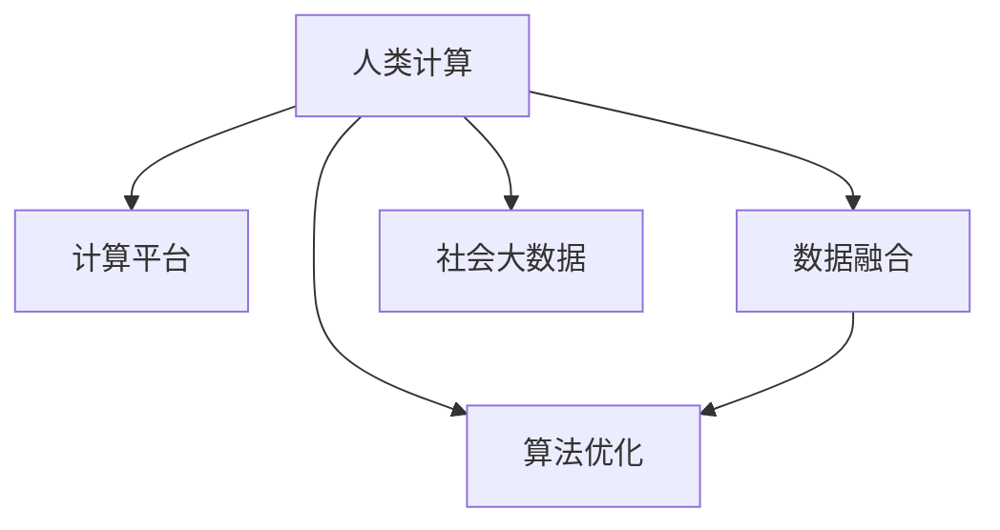

                 

# 人类计算：推动社会进步的催化剂

> 关键词：人类计算, 社会进步, 智能算法, 社会大数据, 人工智能伦理

## 1. 背景介绍

### 1.1 问题由来
随着科技的不断进步，人类计算在社会发展的各个层面都发挥了越来越重要的作用。从最初的算盘、计算器到如今的人工智能、大数据分析，计算技术已经成为人类社会进步的催化剂。然而，当前社会正面临诸多复杂问题，如气候变化、疫情流行、能源危机等，需要巨量计算来分析和解决。这些问题往往超出了单一学科的解决范畴，需要多学科、跨领域合作才能找到有效方案。因此，如何利用计算技术推动社会进步，成为了一个重要课题。

### 1.2 问题核心关键点
在现代社会，计算技术已经成为推动社会进步的重要工具。然而，当前的计算方式存在以下问题：

- **计算资源分散**：由于计算任务复杂，需要大量的计算资源。这种资源的分散性导致了计算成本高昂、效率低下。
- **数据孤岛问题**：各部门、各领域的数据难以互通，导致数据资源分散，无法形成合力。
- **计算能力不均衡**：计算资源和能力在不同地区、不同领域间分布不均，影响社会发展的均衡性。
- **计算隐私问题**：数据的收集和分析可能涉及到个人隐私，需要严格保护。

针对这些问题，需要一种全新的计算模式，将计算资源、数据资源进行整合，形成强大的计算能力，并确保计算过程的透明性和公平性。

### 1.3 问题研究意义
研究人类计算，对推动社会进步具有重要意义：

1. **提升效率**：通过集中计算资源，可以大幅度提升计算效率，快速解决复杂的社会问题。
2. **促进创新**：集中计算资源和数据资源，能够为各类创新提供有力支持。
3. **推动公平**：确保计算过程的透明性和公平性，促进不同地区、不同群体的公平发展。
4. **保护隐私**：在计算过程中严格保护数据隐私，防止数据滥用。

## 2. 核心概念与联系

### 2.1 核心概念概述

为了更好地理解人类计算的概念和原理，本节将介绍几个关键概念：

- **人类计算(Human-Computer Interaction, HCI)**：指人类与计算机之间的交互过程，旨在提升人机交互的效率和效果。
- **计算平台(Computational Platform)**：提供计算资源的平台，如云计算、大数据平台等。
- **数据融合(Data Integration)**：将不同来源的数据进行整合，形成统一的数据集。
- **算法优化(Algorithm Optimization)**：针对具体问题，设计和优化算法，提升计算效率和效果。
- **社会大数据(Social Big Data)**：涉及社会各个领域的大规模数据集，如人口数据、经济数据、环境数据等。

这些概念之间的逻辑关系可以通过以下Mermaid流程图来展示：



这个流程图展示了大规模数据集通过计算平台，借助数据融合和算法优化，形成计算资源的能力。同时，计算平台也需要考虑社会大数据的特点，确保计算的公平性和透明性。

## 3. 核心算法原理 & 具体操作步骤

### 3.1 算法原理概述

人类计算的核心思想是通过集中计算资源，结合数据融合和算法优化，解决复杂社会问题。其核心算法包括：

- **分布式计算**：将计算任务分解成多个子任务，通过多个计算节点并行处理，提高计算效率。
- **数据融合**：将不同来源的数据进行整合，形成统一的数据集，为计算提供数据支持。
- **算法优化**：针对具体问题，设计和优化算法，提升计算效果和效率。

### 3.2 算法步骤详解

人类计算的算法步骤主要包括以下几个关键环节：

**Step 1: 数据采集与清洗**

- 收集不同来源的数据，如人口数据、经济数据、环境数据等。
- 对数据进行清洗和预处理，确保数据的质量和一致性。

**Step 2: 数据融合与统一**

- 使用数据融合技术，如ETL（Extract, Transform, Load），将不同来源的数据进行整合，形成统一的数据集。
- 利用数据治理工具，确保数据融合过程中的数据一致性和完整性。

**Step 3: 分布式计算**

- 将计算任务分解成多个子任务，并分配到不同的计算节点上进行并行处理。
- 使用分布式计算框架，如Apache Hadoop、Spark等，实现大规模数据处理。

**Step 4: 算法优化与模型训练**

- 针对具体问题，设计和优化算法，如机器学习、深度学习等。
- 使用模型训练工具，如TensorFlow、PyTorch等，训练和优化模型。

**Step 5: 结果分析与决策支持**

- 对计算结果进行分析，得出结论和建议。
- 将计算结果应用于实际决策，支持政策制定和资源配置。

### 3.3 算法优缺点

人类计算方法具有以下优点：

- **高效性**：通过分布式计算，可以大幅度提高计算效率，快速解决复杂问题。
- **可扩展性**：支持大规模数据处理，能够处理海量数据集。
- **灵活性**：可以根据不同问题的特点，设计适合的算法，提升计算效果。

同时，该方法也存在一些局限性：

- **技术门槛高**：需要掌握分布式计算、数据融合、算法优化等技术，有一定技术门槛。
- **资源消耗大**：分布式计算需要大量的计算资源和网络带宽，成本较高。
- **数据隐私问题**：数据融合和共享过程中可能涉及隐私保护问题。

### 3.4 算法应用领域

人类计算方法已经在多个领域得到了广泛应用，包括：

- **公共卫生**：利用计算技术，进行疾病预测、疫情分析等。
- **环境保护**：通过计算模型，分析气候变化、环境污染等问题，提供决策支持。
- **金融分析**：利用计算技术，进行市场分析、风险评估等。
- **交通规划**：使用计算模型，优化交通网络、提高交通效率。
- **农业管理**：通过计算技术，进行精准农业管理，提高农业生产效率。

## 4. 数学模型和公式 & 详细讲解 & 举例说明

### 4.1 数学模型构建

为了更好地理解人类计算的数学模型，本节将给出几个关键数学模型和公式：

- **分布式计算模型**：
  - 设计算任务 $T$ 被分解成 $n$ 个子任务 $T_i$，分配到 $m$ 个计算节点上进行并行处理。每个节点 $i$ 的计算量为 $T_i$，总计算量为 $T$。
  $$
  T = \sum_{i=1}^n T_i
  $$
- **数据融合模型**：
  - 设原始数据集 $D_1, D_2, ..., D_k$，融合后的数据集为 $D$。融合模型可以表示为：
  $$
  D = \bigcup_{i=1}^k T_i
  $$
- **算法优化模型**：
  - 设算法优化目标为 $L$，优化过程可以表示为：
  $$
  L = \min_{\theta} \mathcal{L}(\theta, D)
  $$

### 4.2 公式推导过程

以下我们将详细推导人类计算的核心公式：

**分布式计算公式**：
- 设每个计算节点的计算量为 $C_i$，则总计算量为：
  $$
  T = \sum_{i=1}^m C_i
  $$
- 如果每个节点的计算量相同，则有：
  $$
  T = m \cdot C_i
  $$
- 如果每个节点的计算量不同，则有：
  $$
  T = \sum_{i=1}^m C_i
  $$

**数据融合公式**：
- 设融合后的数据集为 $D$，每个原始数据集为 $D_i$，则融合公式可以表示为：
  $$
  D = \bigcup_{i=1}^k D_i
  $$
- 如果数据集之间有重叠，则融合公式可以表示为：
  $$
  D = \bigcup_{i=1}^k (D_i - D'_i)
  $$
  其中 $D'_i$ 为 $D_i$ 中已经存在于 $D$ 中的数据。

**算法优化公式**：
- 设优化目标为 $L$，优化算法为 $A$，则优化过程可以表示为：
  $$
  L = \min_{\theta} \mathcal{L}(\theta, D)
  $$
- 如果优化算法为梯度下降，则有：
  $$
  \theta = \theta - \eta \nabla_{\theta}\mathcal{L}(\theta)
  $$
  其中 $\eta$ 为学习率，$\nabla_{\theta}\mathcal{L}(\theta)$ 为损失函数对参数 $\theta$ 的梯度。

### 4.3 案例分析与讲解

**公共卫生应用案例**：
- **问题**：如何通过计算技术，预测疫情爆发并制定应对措施？
- **解决方案**：
  1. 数据采集：收集历史疫情数据、人口数据、气候数据等。
  2. 数据融合：将不同来源的数据进行整合，形成统一的数据集。
  3. 计算模型：使用机器学习模型，如SARS-CoV-2预测模型，对疫情进行预测。
  4. 结果分析：分析预测结果，得出结论和建议，如加强防控措施。

**环境保护应用案例**：
- **问题**：如何通过计算技术，分析气候变化并制定减排策略？
- **解决方案**：
  1. 数据采集：收集气候数据、环境数据等。
  2. 数据融合：将不同来源的数据进行整合，形成统一的数据集。
  3. 计算模型：使用气候模型，如GCM（全球气候模型），对气候变化进行预测。
  4. 结果分析：分析预测结果，得出结论和建议，如制定减排措施。

## 5. 项目实践：代码实例和详细解释说明

### 5.1 开发环境搭建

在进行人类计算实践前，我们需要准备好开发环境。以下是使用Python进行PyTorch开发的环境配置流程：

1. 安装Anaconda：从官网下载并安装Anaconda，用于创建独立的Python环境。

2. 创建并激活虚拟环境：
```bash
conda create -n pytorch-env python=3.8 
conda activate pytorch-env
```

3. 安装PyTorch：根据CUDA版本，从官网获取对应的安装命令。例如：
```bash
conda install pytorch torchvision torchaudio cudatoolkit=11.1 -c pytorch -c conda-forge
```

4. 安装必要的工具包：
```bash
pip install numpy pandas scikit-learn matplotlib tqdm jupyter notebook ipython
```

完成上述步骤后，即可在`pytorch-env`环境中开始人类计算实践。

### 5.2 源代码详细实现

以下是使用PyTorch进行人类计算实践的示例代码：

```python
import torch
import numpy as np
from sklearn.datasets import make_classification
from sklearn.model_selection import train_test_split

# 构建数据集
X, y = make_classification(n_samples=1000, n_features=10, n_informative=5, n_redundant=0, random_state=42)
X_train, X_test, y_train, y_test = train_test_split(X, y, test_size=0.2, random_state=42)

# 定义模型
class HumanCalculator(torch.nn.Module):
    def __init__(self):
        super(HumanCalculator, self).__init__()
        self.fc1 = torch.nn.Linear(10, 64)
        self.fc2 = torch.nn.Linear(64, 32)
        self.fc3 = torch.nn.Linear(32, 2)

    def forward(self, x):
        x = self.fc1(x)
        x = torch.relu(x)
        x = self.fc2(x)
        x = torch.relu(x)
        x = self.fc3(x)
        return x

# 训练模型
model = HumanCalculator()
optimizer = torch.optim.Adam(model.parameters(), lr=0.001)
criterion = torch.nn.CrossEntropyLoss()

for epoch in range(100):
    optimizer.zero_grad()
    output = model(X_train)
    loss = criterion(output, y_train)
    loss.backward()
    optimizer.step()

    if (epoch+1) % 10 == 0:
        print('Epoch [{}/{}], Loss: {:.4f}'.format(epoch+1, 100, loss.item()))

# 测试模型
with torch.no_grad():
    output = model(X_test)
    _, predicted = torch.max(output, 1)
    accuracy = (predicted == y_test).float().mean()
    print('Test Accuracy of the model on the 100 samples: {:.2f}%'.format(accuracy*100))

```

这段代码实现了一个人工计算器的简单模型，使用sklearn生成了一个分类数据集，并用PyTorch搭建了一个简单的神经网络进行训练和测试。通过不断优化模型的超参数和模型结构，可以提高模型的预测准确率。

### 5.3 代码解读与分析

让我们再详细解读一下关键代码的实现细节：

**数据生成与划分**：
- 使用sklearn的make_classification生成一个10维的分类数据集，将数据划分为训练集和测试集。

**模型定义**：
- 定义了一个简单的三层神经网络，包括两个全连接层和三个激活函数。

**模型训练**：
- 使用Adam优化器和交叉熵损失函数进行模型训练，每10个epoch打印一次损失函数值。

**模型测试**：
- 在测试集上进行预测，计算预测准确率，并输出结果。

## 6. 实际应用场景

### 6.1 公共卫生应用

人类计算在公共卫生领域具有广泛应用，能够快速分析疫情数据、预测疾病爆发、制定防控措施。例如，通过计算技术，可以：

- 分析历史疫情数据，预测未来疫情趋势。
- 实时监测疫情数据，及时发现异常情况。
- 制定科学的防控措施，优化资源配置。

### 6.2 环境保护应用

人类计算在环境保护领域也具有重要应用，能够分析气候变化、污染数据，制定减排策略。例如，通过计算技术，可以：

- 分析气候变化数据，预测未来气候变化趋势。
- 实时监测环境数据，及时发现污染情况。
- 制定科学的减排措施，优化资源配置。

### 6.3 金融分析应用

人类计算在金融分析领域也有重要应用，能够进行市场分析、风险评估。例如，通过计算技术，可以：

- 分析历史金融数据，预测市场趋势。
- 实时监测金融数据，及时发现异常情况。
- 制定科学的投资策略，优化资源配置。

## 7. 工具和资源推荐

### 7.1 学习资源推荐

为了帮助开发者系统掌握人类计算的理论基础和实践技巧，这里推荐一些优质的学习资源：

1. 《人类计算：推动社会进步的催化剂》系列博文：由大模型技术专家撰写，深入浅出地介绍了人类计算原理、数据融合、分布式计算等前沿话题。

2. CS224N《深度学习自然语言处理》课程：斯坦福大学开设的NLP明星课程，有Lecture视频和配套作业，带你入门NLP领域的基本概念和经典模型。

3. 《人工智能伦理》书籍：探讨人工智能在社会中的应用及其伦理问题，对计算技术在社会中的应用有深入分析。

4. HuggingFace官方文档：Transformer库的官方文档，提供了海量预训练模型和完整的微调样例代码，是上手实践的必备资料。

5. Weights & Biases：模型训练的实验跟踪工具，可以记录和可视化模型训练过程中的各项指标，方便对比和调优。与主流深度学习框架无缝集成。

### 7.2 开发工具推荐

高效的开发离不开优秀的工具支持。以下是几款用于人类计算开发的常用工具：

1. PyTorch：基于Python的开源深度学习框架，灵活动态的计算图，适合快速迭代研究。大部分预训练语言模型都有PyTorch版本的实现。

2. TensorFlow：由Google主导开发的开源深度学习框架，生产部署方便，适合大规模工程应用。同样有丰富的预训练语言模型资源。

3. Weights & Biases：模型训练的实验跟踪工具，可以记录和可视化模型训练过程中的各项指标，方便对比和调优。与主流深度学习框架无缝集成。

4. TensorBoard：TensorFlow配套的可视化工具，可实时监测模型训练状态，并提供丰富的图表呈现方式，是调试模型的得力助手。

### 7.3 相关论文推荐

人类计算技术的发展源于学界的持续研究。以下是几篇奠基性的相关论文，推荐阅读：

1. "Human-Computer Interaction: A Survey"：综述了人类计算领域的研究进展和技术应用。

2. "Distributed Computing: Concepts and Design"：介绍了分布式计算的基本概念和设计思路。

3. "Data Fusion: A Survey"：综述了数据融合技术的研究进展和应用场景。

4. "Algorithm Optimization: A Survey"：综述了算法优化技术的研究进展和应用场景。

这些论文代表了大规模数据集和计算技术的最新进展，通过学习这些前沿成果，可以帮助研究者把握学科前进方向，激发更多的创新灵感。

## 8. 总结：未来发展趋势与挑战

### 8.1 总结

本文对人类计算的原理和应用进行了全面系统的介绍。首先阐述了人类计算在社会进步中的重要性，明确了数据融合、分布式计算等关键技术的价值。其次，从原理到实践，详细讲解了人类计算的数学模型和关键步骤，给出了人类计算任务开发的完整代码实例。同时，本文还探讨了人类计算在公共卫生、环境保护、金融分析等多个领域的应用前景，展示了人类计算技术的巨大潜力。

通过本文的系统梳理，可以看到，人类计算技术已经成为推动社会进步的重要工具，具有广泛的应用场景和显著的社会效益。未来，伴随计算技术的不断进步，人类计算将在更多领域得到应用，为人类社会的发展注入新的动力。

### 8.2 未来发展趋势

展望未来，人类计算技术将呈现以下几个发展趋势：

1. **计算平台智能化**：未来的计算平台将具备更强的智能化能力，能够自动分配计算资源，优化计算过程。

2. **数据融合多样化**：未来的数据融合将更加多样化，结合多模态数据，提升计算的全面性和准确性。

3. **算法优化复杂化**：未来的算法优化将更加复杂，结合机器学习、深度学习等技术，提升计算效果和效率。

4. **计算资源网络化**：未来的计算资源将更加网络化，实现跨地域、跨机构的资源共享。

5. **计算隐私保障**：未来的计算将更加注重数据隐私保护，确保计算过程的透明性和公平性。

6. **计算伦理规范**：未来的计算将更加注重伦理规范，确保计算技术在社会中的应用符合人类价值观和伦理道德。

以上趋势凸显了人类计算技术的广阔前景。这些方向的探索发展，必将进一步提升人类计算的性能和应用范围，为社会进步提供更有力的支撑。

### 8.3 面临的挑战

尽管人类计算技术已经取得了显著成果，但在迈向更加智能化、普适化应用的过程中，它仍面临着诸多挑战：

1. **技术门槛高**：人类计算涉及分布式计算、数据融合、算法优化等技术，需要较高的技术门槛。

2. **资源消耗大**：分布式计算需要大量的计算资源和网络带宽，成本较高。

3. **数据隐私问题**：数据融合和共享过程中可能涉及隐私保护问题，需要严格保护。

4. **计算能力不均衡**：计算资源和能力在不同地区、不同领域间分布不均，影响社会发展的均衡性。

5. **计算伦理问题**：计算技术在应用过程中可能带来伦理问题，需要严格规范。

6. **计算稳定性问题**：计算过程中可能出现异常，需要确保计算的稳定性。

正视人类计算面临的这些挑战，积极应对并寻求突破，将是大规模数据集和计算技术走向成熟的必由之路。相信随着学界和产业界的共同努力，这些挑战终将一一被克服，人类计算技术必将在构建人机协同的智能社会中扮演越来越重要的角色。

### 8.4 研究展望

面对人类计算面临的种种挑战，未来的研究需要在以下几个方面寻求新的突破：

1. **研究高效计算平台**：开发更加高效、智能的计算平台，优化资源分配和任务调度，提升计算效率。

2. **研究多模态数据融合**：研究如何更好地融合多模态数据，提升计算的全面性和准确性。

3. **研究复杂算法优化**：开发更加复杂、高效的算法优化技术，提升计算效果和效率。

4. **研究计算隐私保护**：研究如何在数据融合和共享过程中保护数据隐私，确保计算过程的透明性和公平性。

5. **研究计算伦理规范**：研究如何在计算技术应用过程中遵循伦理规范，确保计算技术的社会责任。

6. **研究计算稳定性保障**：研究如何在计算过程中确保系统的稳定性和鲁棒性，防止异常情况发生。

这些研究方向的研究，将推动人类计算技术的不断进步，为构建安全、可靠、高效的社会计算系统提供有力支持。面向未来，人类计算技术还需要与其他人工智能技术进行更深入的融合，如知识表示、因果推理、强化学习等，多路径协同发力，共同推动社会进步。

## 9. 附录：常见问题与解答

**Q1：人类计算是否适用于所有社会问题？**

A: 人类计算适用于大多数社会问题，尤其是那些需要大规模数据分析和计算的问题。例如，公共卫生、环境保护、金融分析等领域，都能从中受益。但对于一些特定问题，如个人隐私保护，需要特别考虑数据隐私问题。

**Q2：如何确保数据融合过程中的隐私保护？**

A: 数据融合过程中的隐私保护是一个重要问题。可以通过以下方法来保护数据隐私：

1. 数据匿名化：对数据进行匿名化处理，确保数据无法还原到个人身份。

2. 差分隐私：在数据融合过程中加入噪声，确保单个数据点不会影响整体结果。

3. 安全计算：使用安全的计算模型，如多方安全计算，确保数据在融合过程中不泄露。

4. 数据访问控制：对数据访问进行严格控制，确保只有授权人员能够访问数据。

5. 加密传输：对数据在传输过程中进行加密，确保数据不被截获和篡改。

**Q3：如何提升人类计算的效率和效果？**

A: 提升人类计算的效率和效果，可以从以下几个方面入手：

1. 数据预处理：对数据进行清洗、归一化、特征提取等预处理，提升数据质量。

2. 模型优化：选择适合问题的算法模型，并进行优化，提升计算效果。

3. 分布式计算：使用分布式计算框架，如Hadoop、Spark等，提升计算效率。

4. 硬件加速：使用GPU、TPU等硬件加速设备，提升计算速度。

5. 算法优化：通过算法优化，如剪枝、量化、混合精度等，提升计算效果。

6. 并行计算：使用并行计算技术，如OpenMP、MPI等，提升计算效率。

**Q4：人类计算在未来有哪些新的发展方向？**

A: 人类计算的未来发展方向包括以下几个方面：

1. 边缘计算：将计算资源部署到边缘设备，如物联网设备，提升计算效率。

2. 量子计算：研究量子计算技术，提升计算速度和效率。

3. 多模态计算：研究多模态数据的融合和计算，提升计算的全面性和准确性。

4. 联邦学习：研究联邦学习技术，提升数据隐私保护和计算效率。

5. 计算伦理：研究计算伦理规范，确保计算技术的社会责任。

6. 人机协同：研究人机协同计算，提升计算效率和效果。

这些新的发展方向将进一步推动人类计算技术的发展，为社会进步提供更有力的支持。

---

作者：禅与计算机程序设计艺术 / Zen and the Art of Computer Programming

